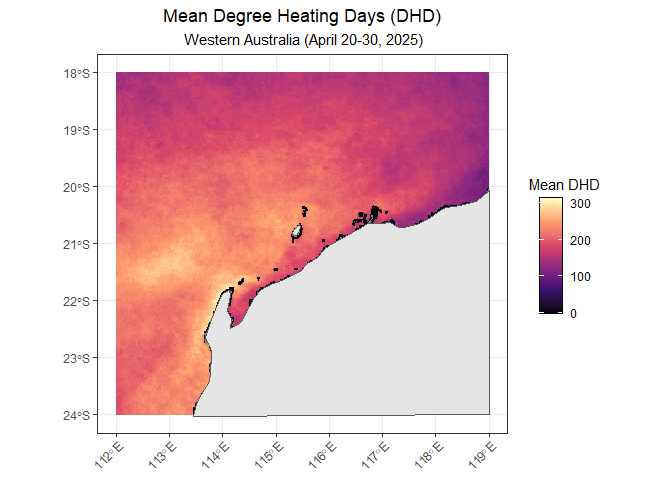

IMOS_AUSTemp
================
Denisse Fierro Arcos
2025-07-08

- [Introduction](#introduction)
- [Loading required libraries](#loading-required-libraries)
- [Connecting to IMOS THREDDS
  server](#connecting-to-imos-thredds-server)
- [Loading downloaded data](#loading-downloaded-data)
- [Visualising DHD data](#visualising-dhd-data)
- [Cropping data](#cropping-data)
- [Creating a map with `ggplot2`](#creating-a-map-with-ggplot2)
  - [Saving plot](#saving-plot)

# Introduction

In this notebook, we will explore how to access and visualize the IMOS
SRS Degree Heating Days (DHD) data using R. We will also show how to
extract DHD data using a bounding box.

This dataset contains the summer Degree Heating Days (DHD) from the 1st
of December to the 30th of April since 2012, which is calculated by
accumulating the daily positive Sea Surface Temperature anomalies
(SSTa). The SSTa is calculated by comparing the current SST to long-term
averages (1993-2003, the “CSIRO Legacy climatology” or 2002-2011, the
“IMOS climatology”). The magnitude of the DHD correlates well with past
coral bleaching events. In cases where SST cannot be calculated due to
cloud cover, the grid cell is left blank (white in web plots,
transparent in Google Earth) to indicate missing data.

# Loading required libraries

``` r
#Connection to THREDDS
library(thredds)
#Downloading data
library(curl)
#Data manipulation
library(dplyr)
library(stringr)
library(purrr)
#Spatial data
library(sf)
#Gridded data
library(terra)
#Plotting
library(ggplot2)
library(tidyterra)
#Base map
library(rnaturalearth)
```

# Connecting to IMOS THREDDS server

As shown in the
[Accessing_IMOS_STS_SST_data.md](Accessing_IMOS_STS_SST_data.md)
notebook, we can connect to the IMOS THREDDS server using the `thredds`
package. We first explored the IMOS THREDDS server to find the dataset
we want to access, and once we identified the dataset we needed, we
proceeded to connect to it.

``` r
# Create a CatalogNode object to access the DHW collection
dhw_cat <- CatalogNode$new(
  paste0("https://thredds.aodn.org.au/thredds/catalog/IMOS/SRS/AusTemp/dhd/",
         "2025/catalog.xml"), prefix = "thredds")

# Get a list of datasets in the DHW collection for the end of April 2025
dhw_apr <- dhw_cat$get_dataset_names() |>
  str_subset("202504[2-3][0-9]")

# Checking the datasets selected
dhw_apr
```

    ##  [1] "20250420_IMOS_AusTemp-degree-heating-day_AUS_fv02.nc"
    ##  [2] "20250421_IMOS_AusTemp-degree-heating-day_AUS_fv02.nc"
    ##  [3] "20250422_IMOS_AusTemp-degree-heating-day_AUS_fv02.nc"
    ##  [4] "20250423_IMOS_AusTemp-degree-heating-day_AUS_fv02.nc"
    ##  [5] "20250424_IMOS_AusTemp-degree-heating-day_AUS_fv02.nc"
    ##  [6] "20250425_IMOS_AusTemp-degree-heating-day_AUS_fv02.nc"
    ##  [7] "20250426_IMOS_AusTemp-degree-heating-day_AUS_fv02.nc"
    ##  [8] "20250427_IMOS_AusTemp-degree-heating-day_AUS_fv02.nc"
    ##  [9] "20250428_IMOS_AusTemp-degree-heating-day_AUS_fv02.nc"
    ## [10] "20250429_IMOS_AusTemp-degree-heating-day_AUS_fv02.nc"
    ## [11] "20250430_IMOS_AusTemp-degree-heating-day_AUS_fv02.nc"

The datasets selected are the DHD data for the end of April 2025. We can
now proceed to create the full URL path before downloading the data
using the `curl` package. This make take a few minutes depending on the
speed of your internet connection.

``` r
# Get base url for HTTPserver access
http_base <- dhw_cat$list_services()$http[["base"]]

# Put together full url to download selected files
dhw_urls <- dhw_apr |> 
  map_chr(\(x) paste0("https://thredds.aodn.org.au", http_base,
                      dhw_cat$get_datasets()[[x]]$get_url()))

# Download selected files - They will be named the same as in the catalog
map2(dhw_urls, dhw_apr, \(x, y) curl_download(x, file.path("../data/", y)))
```

# Loading downloaded data

``` r
# Load DHW data ----------------------------------------------------------
dhw <- rast(list.files("../data/", pattern = "AusTemp", full.names = T))

# Exploring DHW data
data.frame(longname = longnames(dhw), short_name = names(dhw))
```

    ##                               longname       short_name
    ## 1                  degree heating days              dhd
    ## 2           degree heating days mosaic       dhd_mosaic
    ## 3       degree heating days mosaic age   dhd_mosaic_age
    ## 4            degree heating days count        dhd_count
    ## 5     degree heating days count mosaic dhd_count_mosaic
    ## 6         Mean Positive Summer Anomaly             mpsa
    ## 7  Mean Positive Summer Anomaly mosaic      mpsa_mosaic
    ## 8                  degree heating days              dhd
    ## 9           degree heating days mosaic       dhd_mosaic
    ## 10      degree heating days mosaic age   dhd_mosaic_age
    ## 11           degree heating days count        dhd_count
    ## 12    degree heating days count mosaic dhd_count_mosaic
    ## 13        Mean Positive Summer Anomaly             mpsa
    ## 14 Mean Positive Summer Anomaly mosaic      mpsa_mosaic
    ## 15                 degree heating days              dhd
    ## 16          degree heating days mosaic       dhd_mosaic
    ## 17      degree heating days mosaic age   dhd_mosaic_age
    ## 18           degree heating days count        dhd_count
    ## 19    degree heating days count mosaic dhd_count_mosaic
    ## 20        Mean Positive Summer Anomaly             mpsa
    ## 21 Mean Positive Summer Anomaly mosaic      mpsa_mosaic
    ## 22                 degree heating days              dhd
    ## 23          degree heating days mosaic       dhd_mosaic
    ## 24      degree heating days mosaic age   dhd_mosaic_age
    ## 25           degree heating days count        dhd_count
    ## 26    degree heating days count mosaic dhd_count_mosaic
    ## 27        Mean Positive Summer Anomaly             mpsa
    ## 28 Mean Positive Summer Anomaly mosaic      mpsa_mosaic
    ## 29                 degree heating days              dhd
    ## 30          degree heating days mosaic       dhd_mosaic
    ## 31      degree heating days mosaic age   dhd_mosaic_age
    ## 32           degree heating days count        dhd_count
    ## 33    degree heating days count mosaic dhd_count_mosaic
    ## 34        Mean Positive Summer Anomaly             mpsa
    ## 35 Mean Positive Summer Anomaly mosaic      mpsa_mosaic
    ## 36                 degree heating days              dhd
    ## 37          degree heating days mosaic       dhd_mosaic
    ## 38      degree heating days mosaic age   dhd_mosaic_age
    ## 39           degree heating days count        dhd_count
    ## 40    degree heating days count mosaic dhd_count_mosaic
    ## 41        Mean Positive Summer Anomaly             mpsa
    ## 42 Mean Positive Summer Anomaly mosaic      mpsa_mosaic
    ## 43                 degree heating days              dhd
    ## 44          degree heating days mosaic       dhd_mosaic
    ## 45      degree heating days mosaic age   dhd_mosaic_age
    ## 46           degree heating days count        dhd_count
    ## 47    degree heating days count mosaic dhd_count_mosaic
    ## 48        Mean Positive Summer Anomaly             mpsa
    ## 49 Mean Positive Summer Anomaly mosaic      mpsa_mosaic
    ## 50                 degree heating days              dhd
    ## 51          degree heating days mosaic       dhd_mosaic
    ## 52      degree heating days mosaic age   dhd_mosaic_age
    ## 53           degree heating days count        dhd_count
    ## 54    degree heating days count mosaic dhd_count_mosaic
    ## 55        Mean Positive Summer Anomaly             mpsa
    ## 56 Mean Positive Summer Anomaly mosaic      mpsa_mosaic
    ## 57                 degree heating days              dhd
    ## 58          degree heating days mosaic       dhd_mosaic
    ## 59      degree heating days mosaic age   dhd_mosaic_age
    ## 60           degree heating days count        dhd_count
    ## 61    degree heating days count mosaic dhd_count_mosaic
    ## 62        Mean Positive Summer Anomaly             mpsa
    ## 63 Mean Positive Summer Anomaly mosaic      mpsa_mosaic
    ## 64                 degree heating days              dhd
    ## 65          degree heating days mosaic       dhd_mosaic
    ## 66      degree heating days mosaic age   dhd_mosaic_age
    ## 67           degree heating days count        dhd_count
    ## 68    degree heating days count mosaic dhd_count_mosaic
    ## 69        Mean Positive Summer Anomaly             mpsa
    ## 70 Mean Positive Summer Anomaly mosaic      mpsa_mosaic
    ## 71                 degree heating days              dhd
    ## 72          degree heating days mosaic       dhd_mosaic
    ## 73      degree heating days mosaic age   dhd_mosaic_age
    ## 74           degree heating days count        dhd_count
    ## 75    degree heating days count mosaic dhd_count_mosaic
    ## 76        Mean Positive Summer Anomaly             mpsa
    ## 77 Mean Positive Summer Anomaly mosaic      mpsa_mosaic

We can now select the Degree Heating Days (DHD) variable from the loaded
data. The DHD variable is stored in the `dhd` layer of the raster
object. We can calculate the mean DHD over the 10-day period to
visualise the data.

``` r
# Selecting Degree Heating Days (DHD)
dhd <- dhw[[names(dhw) == "dhd"]]

# Calculating mean over week
dhd_mean <- mean(dhd, na.rm = TRUE)
dhd_mean
```

    ## class       : SpatRaster 
    ## size        : 1890, 2685, 1  (nrow, ncol, nlyr)
    ## resolution  : 0.02, 0.02  (x, y)
    ## extent      : 110, 163.7, -46, -8.2  (xmin, xmax, ymin, ymax)
    ## coord. ref. : lon/lat WGS 84 (CRS84) (OGC:CRS84) 
    ## source(s)   : memory
    ## name        :     mean 
    ## min value   :   0.0000 
    ## max value   : 367.4737

# Visualising DHD data

We can create a simple plot with base R as follows.

``` r
plot(dhd_mean)
```

<!-- -->

# Cropping data

Let’s assume we just need data for a specific region, for example,
Western Australia. We can define a bounding box and use this to crop the
DHD data.

``` r
# Define bounding box for Western Australia
bb_wa <- c(112, 119, -24, -18)

# Cropping mean DHD data using the bounding box
dhd_mean_wa <- crop(dhd_mean, bb_wa)

# Checking result
dhd_mean_wa
```

    ## class       : SpatRaster 
    ## size        : 300, 350, 1  (nrow, ncol, nlyr)
    ## resolution  : 0.02, 0.02  (x, y)
    ## extent      : 112, 119, -24, -18  (xmin, xmax, ymin, ymax)
    ## coord. ref. : lon/lat WGS 84 (CRS84) (OGC:CRS84) 
    ## source(s)   : memory
    ## name        :     mean 
    ## min value   :   0.0000 
    ## max value   : 311.6234

We can see that the extent has been reduced after cropping, we will use
this cropped DHD data to create a map of mean DHD in Western Australia.

# Creating a map with `ggplot2`

``` r
# First we will get a map of Australia
aus <- ne_countries(country = "Australia", scale = "medium",
                    returnclass = "sf") |> 
  # Cropping map to match the extent of the DHD WA data
  st_crop(dhd_mean_wa)
```

    ## Warning: attribute variables are assumed to be spatially constant throughout
    ## all geometries

Now we have all components to create a map of mean DHD in Western
Australia.

``` r
ggplot()+
  geom_spatraster(data = dhd_mean_wa)+
  geom_sf(data = aus)+
  # Customizing the color scale
  scale_fill_viridis_c(option = "A", name = "Mean DHD")+
  # Remove x and y axis labels
  labs(x = NULL, y = NULL, 
       title = "Mean Degree Heating Days (DHD)", 
       subtitle = " Western Australia (April 20-30, 2025)")+
  # lims(x = c(110, 120), y = c(-40, -10))+
  theme_bw()+
  # Formatting legend
  theme(legend.title = element_text(hjust = 0.5),
        axis.text.x = element_text(angle = 45, hjust = 1), 
        legend.frame = element_rect(colour = "black"),
        plot.title = element_text(hjust = 0.5), 
        plot.subtitle = element_text(hjust = 0.5))
```

<!-- -->

## Saving plot

``` r
ggsave("../outputs/mean_dhd_western_australia.png", width = 10, height = 6,
       dpi = 300, bg = "white")
```
