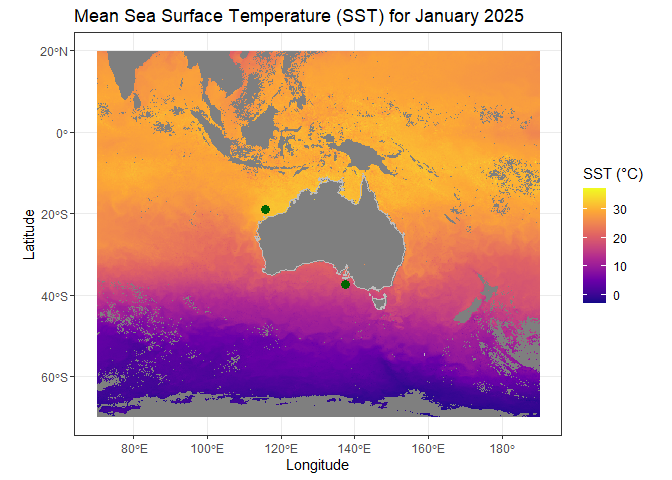

IMOS_SRS_SST
================
Denisse Fierro Arcos
2025-07-08

- [Introduction](#introduction)
- [Loading required libraries](#loading-required-libraries)
- [Connecting to IMOS THREDDS
  server](#connecting-to-imos-thredds-server)
  - [Exploring the IMOS THREDDS
    catalog](#exploring-the-imos-thredds-catalog)
  - [Download SST data from IMOS THREDDS
    server](#download-sst-data-from-imos-thredds-server)
- [Load SST data](#load-sst-data)
- [Extracting SST data for points of
  interest](#extracting-sst-data-for-points-of-interest)
- [Calculating mean SST for the first week of January
  2025](#calculating-mean-sst-for-the-first-week-of-january-2025)
- [Plotting SST data](#plotting-sst-data)
- [Conclusion](#conclusion)

# Introduction

In this notebook, we will explore how to access and visualize the IMOS
SRS Sea Surface Temperature (SST) data using R. We will also show how to
extract SST data using a point of interest.

This SST data product is available through the IMOS THREDDS Data Server
and it provides the skin sea surface temperature which was measured
using infra-red radiometers on various satellites. The data is
composited over multiple swaths/scenes and gridded over a 0.02 degree
rectangular grid over Australia. For more information, see
<http://www.ghrsst.org>

# Loading required libraries

``` r
#Connection to THREDDS
library(thredds)
#Downloading data
library(curl)
#Data manipulation
library(dplyr)
library(stringr)
library(purrr)
#Spatial data
library(sf)
#Gridded data
library(terra)
#Plotting
library(ggplot2)
library(tidyterra)
#Base map
library(rnaturalearth)
```

# Connecting to IMOS THREDDS server

The IMOS THREDDS server can be accessed using the `thredds` package in
R. It is also possible to explore the catalog to find the dataset we are
interested in, which we show below, but we recommend using the web
browser for easier navigation.

``` r
# We define the URL of the IMOS THREDDS catalog
imos_cat_url <- "https://thredds.aodn.org.au/thredds/catalog/IMOS/catalog.xml"
# We create a CatalogNode object to connect to the IMOS THREDDS catalog
imos_cat <- CatalogNode$new(imos_cat_url, prefix = "thredds")
```

## Exploring the IMOS THREDDS catalog

We can open the catalog in the web browser to explore the datasets
available as follows:

``` r
imos_cat$browse()
```

    ## Warning in imos_cat$browse(): unable to browse
    ## URL:https://thredds.aodn.org.au/thredds/catalog/IMOS/catalog.xml

Once in the browser, you can change the extension of the catalog URL
from `catalog.xml` to `catalog.html`. This way you can explore the
catalog in a more user-friendly format.

As mentioned previously, we can also explore the catalog
programmatically, but this is more time-consuming. We will check the SST
datasets inside the SRS catalog:

``` r
# Listing datasets in the catalog
imos_cat$get_catalogs()
```

    ## $AATAMS
    ## CatalogNode (R6): 
    ##   verbose: FALSE    tries: 3    namespace prefix: d1
    ##   url: https://thredds.aodn.org.au/thredds/catalog/IMOS/AATAMS/catalog.xml
    ##   services [4]: Compound OPENDAP HTTPServer WMS
    ##   catalogRefs [5]: AATAMS_sattag_nrt acoustic_detections_QC acoustic_tagging archival_tagging satellite_tagging
    ##   datasets [1]: AATAMS
    ## 
    ## $ACORN
    ## CatalogNode (R6): 
    ##   verbose: FALSE    tries: 3    namespace prefix: d1
    ##   url: https://thredds.aodn.org.au/thredds/catalog/IMOS/ACORN/catalog.xml
    ##   services [4]: Compound OPENDAP HTTPServer WMS
    ##   catalogRefs [9]: gridded_1h-avg-current-map_QC gridded_1h-avg-current-map_non-QC gridded_1h-avg-wave-site-map_QC gridded_1h-avg-wave-spectra_QC gridded_1h-avg-wave-station-map_QC gridded_1h-avg-wind-map_QC radial radial_quality_controlled vector
    ##   datasets [1]: ACORN
    ## 
    ## $ACORN_JCU_historical
    ## CatalogNode (R6): 
    ##   verbose: FALSE    tries: 3    namespace prefix: d1
    ##   url: https://thredds.aodn.org.au/thredds/catalog/IMOS/ACORN_JCU_historical/catalog.xml
    ##   services [4]: Compound OPENDAP HTTPServer WMS
    ##   catalogRefs [2]: gridded_1h-avg-current-map_QC radial_quality_controlled
    ##   datasets [1]: ACORN_JCU_historical
    ## 
    ## $ANFOG
    ## CatalogNode (R6): 
    ##   verbose: FALSE    tries: 3    namespace prefix: d1
    ##   url: https://thredds.aodn.org.au/thredds/catalog/IMOS/ANFOG/catalog.xml
    ##   services [4]: Compound OPENDAP HTTPServer WMS
    ##   catalogRefs [3]: REALTIME seaglider slocum_glider
    ##   datasets [1]: ANFOG
    ## 
    ## $ANMN
    ## CatalogNode (R6): 
    ##   verbose: FALSE    tries: 3    namespace prefix: d1
    ##   url: https://thredds.aodn.org.au/thredds/catalog/IMOS/ANMN/catalog.xml
    ##   services [4]: Compound OPENDAP HTTPServer WMS
    ##   catalogRefs [10]: AM Acoustic Deep_Water_Waves NRS NSW PA QLD SA WA Wave_Buoys
    ##   datasets [1]: ANMN
    ## 
    ## $AUV
    ## CatalogNode (R6): 
    ##   verbose: FALSE    tries: 3    namespace prefix: d1
    ##   url: https://thredds.aodn.org.au/thredds/catalog/IMOS/AUV/catalog.xml
    ##   services [4]: Compound OPENDAP HTTPServer WMS
    ##   catalogRefs [74]: AUV_articles Apollo202309 Batemans201011 ... Wilsonsprom201603SS Wollongong202201 auv_viewer_data
    ##   datasets [1]: AUV
    ## 
    ## $Argo
    ## CatalogNode (R6): 
    ##   verbose: FALSE    tries: 3    namespace prefix: d1
    ##   url: https://thredds.aodn.org.au/thredds/catalog/IMOS/Argo/catalog.xml
    ##   services [4]: Compound OPENDAP HTTPServer WMS
    ##   catalogRefs [2]: aggregated_datasets dac
    ##   datasets [1]: Argo
    ## 
    ## $BGC_DB
    ## CatalogNode (R6): 
    ##   verbose: FALSE    tries: 3    namespace prefix: d1
    ##   url: https://thredds.aodn.org.au/thredds/catalog/IMOS/BGC_DB/catalog.xml
    ##   services [4]: Compound OPENDAP HTTPServer WMS
    ##   catalogRefs [1]: harvested_from_CSIRO
    ##   datasets [1]: BGC_DB
    ## 
    ## $`COASTAL-WAVE-BUOYS`
    ## CatalogNode (R6): 
    ##   verbose: FALSE    tries: 3    namespace prefix: d1
    ##   url: https://thredds.aodn.org.au/thredds/catalog/IMOS/COASTAL-WAVE-BUOYS/catalog.xml
    ##   services [4]: Compound OPENDAP HTTPServer WMS
    ##   catalogRefs [1]: WAVE-BUOYS
    ##   datasets [1]: COASTAL-WAVE-BUOYS
    ## 
    ## $DWM
    ## CatalogNode (R6): 
    ##   verbose: FALSE    tries: 3    namespace prefix: d1
    ##   url: https://thredds.aodn.org.au/thredds/catalog/IMOS/DWM/catalog.xml
    ##   services [4]: Compound OPENDAP HTTPServer WMS
    ##   catalogRefs [4]: ASFS DA Deployments SOTS
    ##   datasets [1]: DWM
    ## 
    ## $FAIMMS
    ## CatalogNode (R6): 
    ##   verbose: FALSE    tries: 3    namespace prefix: d1
    ##   url: https://thredds.aodn.org.au/thredds/catalog/IMOS/FAIMMS/catalog.xml
    ##   services [4]: Compound OPENDAP HTTPServer WMS
    ##   catalogRefs [7]: Davies_Reef Heron_Island Lizard_Island Myrmidon_Reef One_Tree_Island Orpheus_Island Rib_Reef
    ##   datasets [1]: FAIMMS
    ## 
    ## $NTP
    ## CatalogNode (R6): 
    ##   verbose: FALSE    tries: 3    namespace prefix: d1
    ##   url: https://thredds.aodn.org.au/thredds/catalog/IMOS/NTP/catalog.xml
    ##   services [4]: Compound OPENDAP HTTPServer WMS
    ##   catalogRefs [2]: Low_Cost_Wave_Buoy_Technology Profiling_Moorings
    ##   datasets [1]: NTP
    ## 
    ## $OceanCurrent
    ## CatalogNode (R6): 
    ##   verbose: FALSE    tries: 3    namespace prefix: d1
    ##   url: https://thredds.aodn.org.au/thredds/catalog/IMOS/OceanCurrent/catalog.xml
    ##   services [4]: Compound OPENDAP HTTPServer WMS
    ##   catalogRefs [1]: GSLA
    ##   datasets [1]: OceanCurrent
    ## 
    ## $SAIMOS
    ## CatalogNode (R6): 
    ##   verbose: FALSE    tries: 3    namespace prefix: d1
    ##   url: https://thredds.aodn.org.au/thredds/catalog/IMOS/SAIMOS/catalog.xml
    ##   services [4]: Compound OPENDAP HTTPServer WMS
    ##   catalogRefs [1]: Biogeochem
    ##   datasets [1]: SAIMOS
    ## 
    ## $SOOP
    ## CatalogNode (R6): 
    ##   verbose: FALSE    tries: 3    namespace prefix: d1
    ##   url: https://thredds.aodn.org.au/thredds/catalog/IMOS/SOOP/catalog.xml
    ##   services [4]: Compound OPENDAP HTTPServer WMS
    ##   catalogRefs [8]: SOOP-ASF SOOP-BA SOOP-CO2 SOOP-FishSOOP SOOP-SST SOOP-TMV SOOP-TRV SOOP-XBT
    ##   datasets [1]: SOOP
    ## 
    ## $SRS
    ## CatalogNode (R6): 
    ##   verbose: FALSE    tries: 3    namespace prefix: d1
    ##   url: https://thredds.aodn.org.au/thredds/catalog/IMOS/SRS/catalog.xml
    ##   services [4]: Compound OPENDAP HTTPServer WMS
    ##   catalogRefs [6]: ALTIMETRY AusTemp OC SSS SST Surface-Waves
    ##   datasets [1]: SRS
    ## 
    ## $eMII
    ## CatalogNode (R6): 
    ##   verbose: FALSE    tries: 3    namespace prefix: d1
    ##   url: https://thredds.aodn.org.au/thredds/catalog/IMOS/eMII/catalog.xml
    ##   services [4]: Compound OPENDAP HTTPServer WMS
    ##   catalogRefs [2]: demos test_files
    ##   datasets [1]: eMII

We can see there are a number of datasets available in the IMOS catalog.
We are interested in the `SRS` products, so we can check the datasets
available in the `SRS` catalog:

``` r
imos_cat$get_catalogs()[["SRS"]]
```

    ## CatalogNode (R6): 
    ##   verbose: FALSE    tries: 3    namespace prefix: d1
    ##   url: https://thredds.aodn.org.au/thredds/catalog/IMOS/SRS/catalog.xml
    ##   services [4]: Compound OPENDAP HTTPServer WMS
    ##   catalogRefs [6]: ALTIMETRY AusTemp OC SSS SST Surface-Waves
    ##   datasets [1]: SRS

We can see that the `SRS` catalog contains the `SST` dataset we are
interested in. There are multiple datasets available inside `SST`, but
below we show you the path to the `ghrsst` dataset, which contains the
Sea Surface Temperature data we want to access:

``` r
imos_cat$get_catalogs()[["SRS"]]$get_catalogs()[["SST"]]$
  get_catalogs()[["ghrsst"]]$get_catalogs()[["L3SM-1d"]]$
  get_catalogs()[["day"]]$get_catalogs()[["2025"]]
```

    ## CatalogNode (R6): 
    ##   verbose: FALSE    tries: 3    namespace prefix: d1
    ##   url: https://thredds.aodn.org.au/thredds/catalog/IMOS/SRS/SST/ghrsst/L3SM-1d/day/2025/catalog.xml
    ##   services [4]: Compound OPENDAP HTTPServer WMS
    ##   catalogRefs [0]: none
    ##   datasets [163]: 20250101032000-ABOM-L3S_GHRSST-SSTskin-MultiSensor-1d_day.nc 20250102032000-ABOM-L3S_GHRSST-SSTskin-MultiSensor-1d_day.nc ... 20250702032000-ABOM-L3S_GHRSST-SSTskin-MultiSensor-1d_day.nc 20250703032000-ABOM-L3S_GHRSST-SSTskin-MultiSensor-1d_day.nc

We can see that there are 163 files available in the `2025` folder,
which contains the SST data for that year. We also get a URL that will
allow us to explore the catalog further. We will use this URL to
download the SST data for the first week of 2025.

``` r
# First we connect to the catalog
srs_cat <- CatalogNode$new(paste0("https://thredds.aodn.org.au/thredds/catalog",
                                  "/IMOS/SRS/SST/ghrsst/L3SM-1d/day/2025/", 
                                  "catalog.xml"),
                           prefix = "thredds")

# Now we can get the dataset names available in the catalog
sst_jan_names <- srs_cat$get_dataset_names() |>
  str_subset("2025010[1-7]")

# Checking we have selected the correct datasets
sst_jan_names
```

    ## [1] "20250101032000-ABOM-L3S_GHRSST-SSTskin-MultiSensor-1d_day.nc"
    ## [2] "20250102032000-ABOM-L3S_GHRSST-SSTskin-MultiSensor-1d_day.nc"
    ## [3] "20250103032000-ABOM-L3S_GHRSST-SSTskin-MultiSensor-1d_day.nc"
    ## [4] "20250104032000-ABOM-L3S_GHRSST-SSTskin-MultiSensor-1d_day.nc"
    ## [5] "20250105032000-ABOM-L3S_GHRSST-SSTskin-MultiSensor-1d_day.nc"
    ## [6] "20250106032000-ABOM-L3S_GHRSST-SSTskin-MultiSensor-1d_day.nc"
    ## [7] "20250107032000-ABOM-L3S_GHRSST-SSTskin-MultiSensor-1d_day.nc"

We have seven datasets available for the first week of January 2025,
which is exactly what we wanted. Once again, this method to explore the
catalog is more time-consuming, so unless you’re familiar with the
structure of the catalog, we highlight recommend you use the web browser
instead.

We now need a complete URL to download the SST data as shown below.

``` r
# Get base url for HTTPserver access
http_base <- srs_cat$list_services()$http[["base"]]

# Put together full url to download selected files
sst_jan_urls <- sst_jan_names |> 
  map_chr(\(x) paste0("https://thredds.aodn.org.au", http_base,
                      srs_cat$get_datasets()[[x]]$get_url()))

# Checking results
sst_jan_urls
```

    ## [1] "https://thredds.aodn.org.au/thredds/fileServer/IMOS/SRS/SST/ghrsst/L3SM-1d/day/2025/20250101032000-ABOM-L3S_GHRSST-SSTskin-MultiSensor-1d_day.nc"
    ## [2] "https://thredds.aodn.org.au/thredds/fileServer/IMOS/SRS/SST/ghrsst/L3SM-1d/day/2025/20250102032000-ABOM-L3S_GHRSST-SSTskin-MultiSensor-1d_day.nc"
    ## [3] "https://thredds.aodn.org.au/thredds/fileServer/IMOS/SRS/SST/ghrsst/L3SM-1d/day/2025/20250103032000-ABOM-L3S_GHRSST-SSTskin-MultiSensor-1d_day.nc"
    ## [4] "https://thredds.aodn.org.au/thredds/fileServer/IMOS/SRS/SST/ghrsst/L3SM-1d/day/2025/20250104032000-ABOM-L3S_GHRSST-SSTskin-MultiSensor-1d_day.nc"
    ## [5] "https://thredds.aodn.org.au/thredds/fileServer/IMOS/SRS/SST/ghrsst/L3SM-1d/day/2025/20250105032000-ABOM-L3S_GHRSST-SSTskin-MultiSensor-1d_day.nc"
    ## [6] "https://thredds.aodn.org.au/thredds/fileServer/IMOS/SRS/SST/ghrsst/L3SM-1d/day/2025/20250106032000-ABOM-L3S_GHRSST-SSTskin-MultiSensor-1d_day.nc"
    ## [7] "https://thredds.aodn.org.au/thredds/fileServer/IMOS/SRS/SST/ghrsst/L3SM-1d/day/2025/20250107032000-ABOM-L3S_GHRSST-SSTskin-MultiSensor-1d_day.nc"

We are now ready to download the data.

## Download SST data from IMOS THREDDS server

``` r
# We will ensure we have a directory to store the data
if(!dir.exists("../data")){
  dir.create("../data", recursive = T)
}

# We will download the SST data for the first week of January 2025
# The file names will be named the same as in the catalog
map2(sst_jan_urls, sst_jan_names, 
     \(x, y) curl_download(x, file.path("../data/", y)))
```

Data download may take a few minutes depending on your internet
connection. Once the data is downloaded, we can load it into R for
further analysis.

# Load SST data

``` r
# We can get a list of the downloaded files
sst_jan_files <- list.files("../data", pattern = "GHRSST", full.names = T)

# We can load the SST data using the terra package
sst_jan_w1 <- rast(sst_jan_files)

# Exploring SST data
sst_jan_w1
```

    ## class       : SpatRaster 
    ## dimensions  : 4500, 6000, 112  (nrow, ncol, nlyr)
    ## resolution  : 0.02, 0.02  (x, y)
    ## extent      : 70, 190, -70, 20  (xmin, xmax, ymin, ymax)
    ## coord. ref. : lon/lat WGS 84 (CRS84) (OGC:CRS84) 
    ## sources     : 20250101032000-ABOM-L3S_GHRSST-SSTskin-MultiSensor-1d_day.nc:sea_surface_temperature  
    ##               20250101032000-ABOM-L3S_GHRSST-SSTskin-MultiSensor-1d_day.nc:sst_dtime  
    ##               20250101032000-ABOM-L3S_GHRSST-SSTskin-MultiSensor-1d_day.nc:dt_analysis  
    ##               ... and 109 more sources
    ## varnames    : sea_surface_temperature (sea surface skin temperature) 
    ##               sst_dtime (time difference from reference time) 
    ##               dt_analysis (deviation from last SST analysis) 
    ##               ...
    ## names       : sea_s~ature, sst_dtime, dt_analysis, wind_speed, wind_~m_sst, sea_i~ction, ... 
    ## unit        :      kelvin,    second,      kelvin,      m s-1,        hour,           1, ...

The dataset contains multiple variables, but we are interested in the
`sea_surface_temperature` variable. We can subset the data to keep SST
data only and then we will convert it from Kelvin to Celsius.

You may also have noticed that there is no information about dates in
the raster object. We can extract this information from the `source`
attribute of the raster object.

``` r
# Subsetting SST data
sst_jan_w1 <- sst_jan_w1[[names(sst_jan_w1) == "sea_surface_temperature"]]

# Getting dates from the source attribute
date_sst_jan <- sources(sst_jan_w1) |> 
  str_extract(pattern = "2025010[1-7]") |> 
  as.Date(format = "%Y%m%d")

# Adding dates as time and names to the raster object
time(sst_jan_w1) <- date_sst_jan
names(sst_jan_w1) <- date_sst_jan

# Transforming from Kelvin to Celsius
sst_jan_w1_celsius <- sst_jan_w1 - 273.15
```

    ## |---------|---------|---------|---------|=========================================                                          

``` r
sst_jan_w1_celsius
```

    ## class       : SpatRaster 
    ## dimensions  : 4500, 6000, 7  (nrow, ncol, nlyr)
    ## resolution  : 0.02, 0.02  (x, y)
    ## extent      : 70, 190, -70, 20  (xmin, xmax, ymin, ymax)
    ## coord. ref. : lon/lat WGS 84 (CRS84) (OGC:CRS84) 
    ## source      : spat_62e81d4b43ac_25320_o8up7yuDdJ6XHBX.tif 
    ## varname     : sea_surface_temperature (sea surface skin temperature) 
    ## names       : 2025-01-01, 2025-01-02, 2025-01-03, 2025-01-04, 2025-01-05, 2025-01-06, ... 
    ## min values  :  -3.111253,  -3.123773,  -3.439873,  -3.564982,  -3.099774,  -3.140474, ... 
    ## max values  :  42.158745,  39.066227,  40.410126,  44.685017,  43.490223,  46.409527, ... 
    ## time (days) : 2025-01-01 to 2025-01-07 (2 steps)

# Extracting SST data for points of interest

We can extract SST data for specific points of interest using the
`extract` function from the `terra` package. For example, we can extract
SST data for a points in the east and west coast of Australia.

``` r
# Defining points of interest
points_of_interest <- data.frame(lon = c(153.4, 115.7),
                                 lat = c(-19.5, -32))

# Converting points to a spatial object
points_sf <- points_of_interest |> 
  st_as_sf(coords = c("lon", "lat"), crs = 4326)

# Extracting SST data for points of interest
sst_points <- extract(sst_jan_w1_celsius, points_sf, xy = T)

# Checking extracted SST data
sst_points
```

    ##   ID 2025-01-01 2025-01-02 2025-01-03 2025-01-04 2025-01-05 2025-01-06
    ## 1  1   27.88875         NA   27.27013   27.98502         NA         NA
    ## 2  2   22.50875   22.77623   21.58013   22.97502   22.95023   23.64953
    ##   2025-01-07      x      y
    ## 1   26.93361 153.39 -19.51
    ## 2   23.34361 115.69 -32.01

We can reformat the extracted data to make it easier to read and
visualize.

``` r
sst_points <- sst_points |> 
  pivot_longer(cols = !c(ID, x, y), names_to = "date",
               values_to = "sst_celsius")

sst_points
```

    ## # A tibble: 14 × 5
    ##       ID     x     y date       sst_celsius
    ##    <dbl> <dbl> <dbl> <chr>            <dbl>
    ##  1     1  153. -19.5 2025-01-01        27.9
    ##  2     1  153. -19.5 2025-01-02        NA  
    ##  3     1  153. -19.5 2025-01-03        27.3
    ##  4     1  153. -19.5 2025-01-04        28.0
    ##  5     1  153. -19.5 2025-01-05        NA  
    ##  6     1  153. -19.5 2025-01-06        NA  
    ##  7     1  153. -19.5 2025-01-07        26.9
    ##  8     2  116. -32.0 2025-01-01        22.5
    ##  9     2  116. -32.0 2025-01-02        22.8
    ## 10     2  116. -32.0 2025-01-03        21.6
    ## 11     2  116. -32.0 2025-01-04        23.0
    ## 12     2  116. -32.0 2025-01-05        23.0
    ## 13     2  116. -32.0 2025-01-06        23.6
    ## 14     2  116. -32.0 2025-01-07        23.3

# Calculating mean SST for the first week of January 2025

``` r
mean_sst_jan_w1 <- mean(sst_jan_w1_celsius, na.rm = TRUE)
```

    ## |---------|---------|---------|---------|=========================================                                          

``` r
mean_sst_jan_w1
```

    ## class       : SpatRaster 
    ## dimensions  : 4500, 6000, 1  (nrow, ncol, nlyr)
    ## resolution  : 0.02, 0.02  (x, y)
    ## extent      : 70, 190, -70, 20  (xmin, xmax, ymin, ymax)
    ## coord. ref. : lon/lat WGS 84 (CRS84) (OGC:CRS84) 
    ## source      : spat_62e83da1b5d_25320_zxzxx9jyyx6UnnI.tif 
    ## name        :     mean 
    ## min value   : -3.14639 
    ## max value   : 40.50361

# Plotting SST data

We can create a simple plot of the mean SST using base R.

``` r
plot(mean_sst_jan_w1)
```

<!-- -->

We can also create a more informative plot using `ggplot2` and
`tidyterra` packages. We will use the `geom_spatraster` function to plot
the raster data and add a base map of Australia using the
`rnaturalearth` package.

``` r
# Getting a base map of Australia
aus <- ne_countries(country = "Australia", scale = "medium",
                    returnclass = "sf")
```

Remember that when using `ggplot2`, we create a plot by stacking layers.
This means we will need to add the raster data as the first layer and
then add the base map as a second layer. We can also add points for the
locations we extracted SST data from.

``` r
ggplot()+
  # Using tidyterra to plot the raster data
  geom_spatraster(data = mean_sst_jan_w1) +
  # Setting the color scale for the SST data
  scale_fill_viridis_c(option = "C", name = "SST (°C)") +
  # Adding base map of Australia
  geom_sf(data = aus, fill = NA, color = "grey") +
  # Adding points for the locations we extracted SST data from
  geom_sf(data = points_sf, color = "darkgreen", size = 3) +
  # Adding labels and theme
  labs(title = "Mean Sea Surface Temperature (SST) for January 2025",
       x = "Longitude", y = "Latitude") +
  theme_bw()
```

    ## <SpatRaster> resampled to 500821 cells.

<!-- -->

We can also make a plot comparing the mean SST for the first week of
January 2025 at our two points of interest.

``` r
sst_points |> 
  ggplot(aes(x = date, y = sst_celsius, color = as.factor(ID))) +
  geom_line(aes(group = ID)) +
  geom_point() +
  labs(title = "SST at Points of Interest for January 2025",
       x = "Date", y = "SST (°C)", color = "Point ID") +
  theme_bw()
```

    ## Warning: Removed 3 rows containing missing values or values outside the scale range
    ## (`geom_point()`).

<!-- -->

Finally, we can also create a multipanel plot to visualize the SST data
for each day of the first week of January 2025 at our points of
interest.

``` r
ggplot()+
  geom_spatraster(data = sst_jan_w1_celsius)+
  scale_fill_viridis_c(option = "C", name = "SST (°C)") +
  geom_sf(data = aus, fill = "#fff2cc", color = "#fff2cc") +
  facet_wrap(~lyr) +
  theme_bw() +
  labs(title = "Sea Surface Temperature (SST) for January 2025") +
  theme(legend.position = "bottom", legend.title.position = "top", 
        axis.text.x = element_text(angle = 45, hjust = 1))
```

    ## <SpatRaster> resampled to 500821 cells.

<!-- -->

Remember that you can save any plots as follows:

``` r
ggsave("../outputs/sst_australia_jan2025.png", dpi = 300, 
       bg = "white")
```

# Conclusion

In this notebook, we have gone through the basics of how to access IMOS
data available via the THREDDS server, specifically the Sea Surface
Temperature (SST) data. We have shown how to download the data, load it
into R, extract SST data for specific points of interest, and visualize
the data using `ggplot2` and `tidyterra`. We have also shown how to
calculate the mean SST for the first week of January 2025 and created
multifaceted plots to visualise the data.
