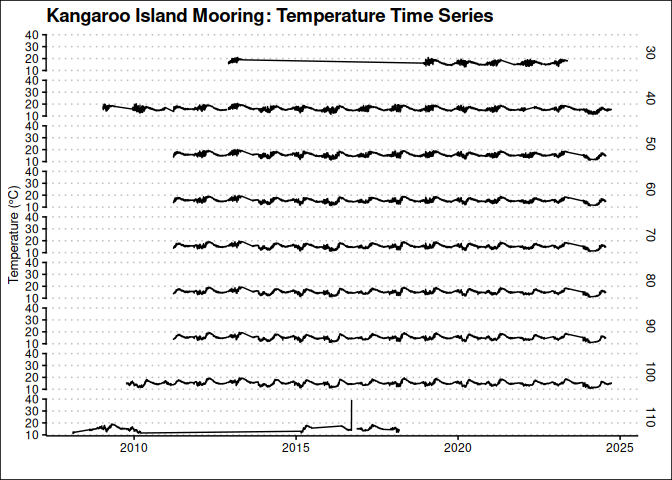
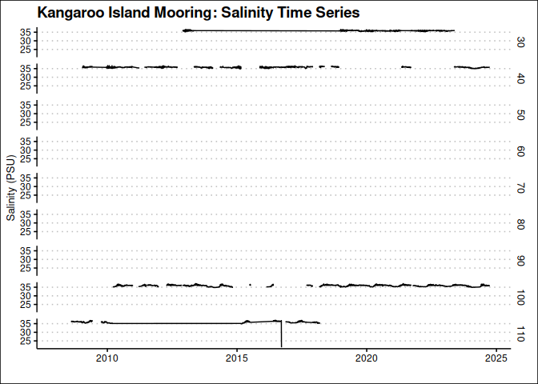
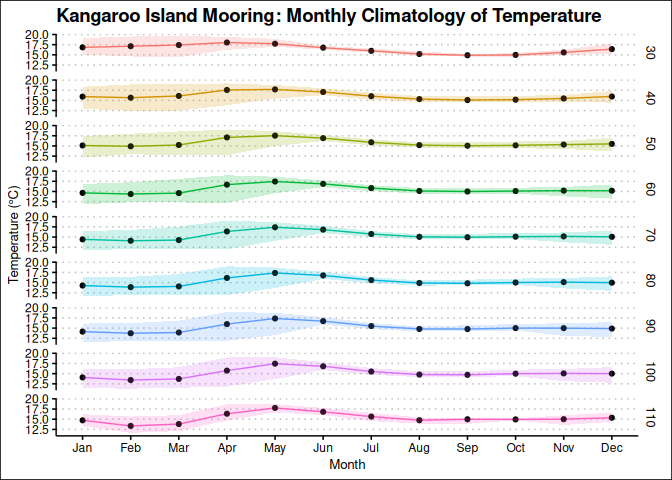
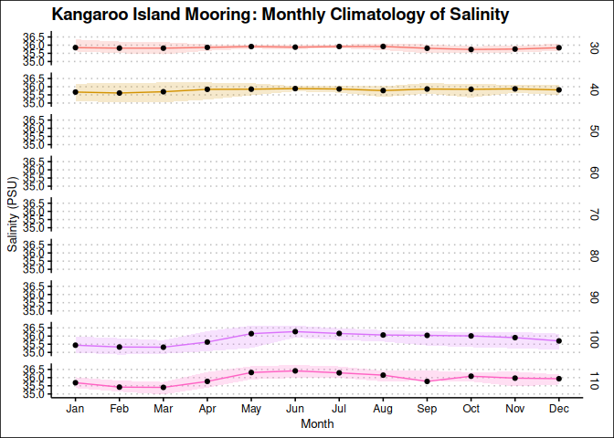
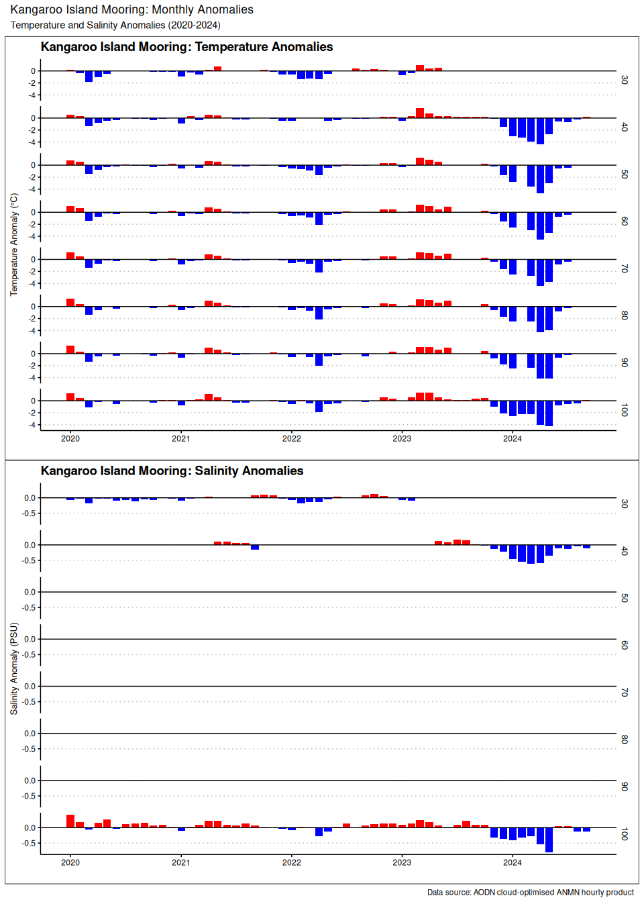

Last updated: 2025-07-13

## Goal

This notebook shows how to extract and plot a temperature and salinity times series from the Maria Island mooring. We will use AODN cloud-optimised ANMN hourly product, which is delivered as a Parquet file. This file is partitioned and sorted by `site_code`, `timestap` (3 months range), and `polygon` which is a cell that contains the data.

## Load packages
We will need `arrow`, `dplyr` and `ggplot2` plus `lubridate` to manage time.


``` r
## load libraries, suppress warnings and messages
suppressPackageStartupMessages({
  library(arrow)
  library(dplyr)
  library(ggplot2)
  library(lubridate)
  library(ggthemes)
  library(kableExtra)
  library(leaflet)
  library(patchwork)
})
```

## Load data

First we need to create a connection with the cloud-optimise data store. We will use the `arrow` package to read the Parquet file. The mooring hourly time-series data is located in `s3://aodn-cloud-optimised/mooring_hourly_timeseries_delayed_qc.parquet/`


``` r
# Create a connection to the cloud-optimised data store
uri <- "s3://aodn-cloud-optimised/mooring_hourly_timeseries_delayed_qc.parquet/"
## the s3_bucket function will automatically detect the region, but we can also specify it
bucket <- s3_bucket(uri, anonymous=TRUE, region="ap-southeast-2")

# Read the Parquet file
df <- open_dataset(bucket)
```


This dataset contains more than 54 million lines of hourly measurements in 96 columns and it is partitioned into more than 2700 individual files. Below are the columns in the dataset. You should be able to identify the variables of interest, such as `TEMP` for temperature and `PSAL` for salinity. The time variable is `TIME`, and the actual depth is indicated by `DEPTH` and the target depth is `NOMINAL_DEPTH`. The mooring site is identified by `site_code`. This product is an aggregation of the IMOS mooring data, which is collected by the [Australian National Mooring Network (ANMN)](https://imos.org.au/facility/national-mooring-network) and has 84 locations. The instruments are programmed to collect data at different frequencies, but the data is aggregated to an hourly frequency. The data is also quality controlled and delayed, which means that the data is not available in real-time, but is available after a certain period of time.


``` r
print(df$schema)
```

```
## Schema
## instrument_index: int32
## instrument_id: string
## source_file: string
## TIME: timestamp[ns]
## LONGITUDE: double
## LATITUDE: double
## NOMINAL_DEPTH: float
## DEPTH: float
## DEPTH_count: float
## DEPTH_min: float
## DEPTH_max: float
## DEPTH_std: float
## PRES: float
## PRES_REL: float
## PRES_REL_count: float
## PRES_REL_max: float
## PRES_REL_min: float
## PRES_REL_std: float
## PRES_count: float
## PRES_max: float
## PRES_min: float
## PRES_std: float
## TEMP: float
## TEMP_count: float
## TEMP_max: float
## TEMP_min: float
## TEMP_std: float
## PSAL: float
## PSAL_count: float
## PSAL_max: float
## PSAL_min: float
## PSAL_std: float
## filename: string
## TURB: float
## TURB_count: float
## TURB_max: float
## TURB_min: float
## TURB_std: float
## CHLF: float
## CHLF_count: float
## CHLF_max: float
## CHLF_min: float
## CHLF_std: float
## CHLU: float
## CHLU_count: float
## CHLU_max: float
## CHLU_min: float
## CHLU_std: float
## CPHL: float
## CPHL_count: float
## CPHL_max: float
## CPHL_min: float
## CPHL_std: float
## DOX: float
## DOX_min: float
## DOX_max: float
## DOX_std: float
## DOX_count: float
## DOX1: float
## DOX1_count: float
## DOX1_max: float
## DOX1_min: float
## DOX1_std: float
## DOX1_2: float
## DOX1_2_min: float
## DOX1_2_max: float
## DOX1_2_std: float
## DOX1_2_count: float
## DOX2: float
## DOX2_min: float
## DOX2_max: float
## DOX2_count: float
## DOX2_std: float
## DOX1_3: float
## DOX1_3_min: float
## DOX1_3_max: float
## DOX1_3_count: float
## DOX1_3_std: float
## DOXY: float
## DOXY_std: float
## DOXY_min: float
## DOXY_max: float
## DOXY_count: float
## DOXS: float
## DOXS_std: float
## DOXS_min: float
## DOXS_max: float
## DOXS_count: float
## PAR: float
## PAR_std: float
## PAR_min: float
## PAR_max: float
## PAR_count: float
## site_code: string
## timestamp: int32
## polygon: string
```

## Mooring Locations

Let's make a map showing the locations of the moorings. Red markers indicate the National Reference Stations. This map is created using an external file that contains the mooring locations. The file was generated from the cloud-optimised product but the code is not including here as it will take long time to run. The file is available in the same directory as this notebook and is called `ANMNlocations.csv`. 


``` r
# Load the mooring locations
mooring_locations <- read.csv("ANMNlocations.csv", stringsAsFactors = FALSE)
mooring_locations$NRSsize <- ifelse(mooring_locations$NRS == FALSE, 7, 12)
mooring_locations$NRScolour <- ifelse(mooring_locations$Active == TRUE, "#5e3c99", "#b2abd2")
mooring_locations$NRScolour <- ifelse(mooring_locations$NRS == TRUE, "#e66101", mooring_locations$NRScolour)

## Map the mooring locations using leaflet. Color the markers by NRS field
m <- leaflet(mooring_locations) |>
  addTiles() |>
  addCircleMarkers(lng = ~lon, lat = ~lat,
                   radius = ~NRSsize, 
                   fillColor = ~NRScolour, 
                   fillOpacity = 0.8, 
                   stroke = TRUE,
                   weight = 1.5,
                   color = "black",
                   label = ~paste(site_name, "-", site_code, " ", yearMin, " - ", yearMax),
                   labelOptions = labelOptions(noHide = FALSE, direction = "top")) |> 
  ## add legend
  addLegend("bottomleft", 
            colors = c("#e66101", "#5e3c99", "#b2abd2"), 
            labels = c("National Reference Station", "Active Mooring", "Inactive Mooring"),
            title = "Mooring Type",
            opacity = 0.7) 

m
```

```{=html}
<div class="leaflet html-widget html-fill-item" id="htmlwidget-c64177c95b770132ebfb" style="width:672px;height:480px;"></div>
<script type="application/json" data-for="htmlwidget-c64177c95b770132ebfb">{"x":{"options":{"crs":{"crsClass":"L.CRS.EPSG3857","code":null,"proj4def":null,"projectedBounds":null,"options":{}}},"calls":[{"method":"addTiles","args":["https://{s}.tile.openstreetmap.org/{z}/{x}/{y}.png",null,null,{"minZoom":0,"maxZoom":18,"tileSize":256,"subdomains":"abc","errorTileUrl":"","tms":false,"noWrap":false,"zoomOffset":0,"zoomReverse":false,"opacity":1,"zIndex":1,"detectRetina":false,"attribution":"&copy; <a href=\"https://openstreetmap.org/copyright/\">OpenStreetMap<\/a>,  <a href=\"https://opendatacommons.org/licenses/odbl/\">ODbL<\/a>"}]},{"method":"addCircleMarkers","args":[[-36.1906712,-36.19009093,-36.20585309,-14.85037859,-14.31487107,-30.31040989,-30.27361398,-30.26665139,-12.10780152,-27.32795179,-27.3126,-27.31393044,-27.28363929,-27.24425202,-27.2073152,-27.10488562,-22.40305779,-21.02259777,-23.38159208,-23.5132984,-14.70248699,-14.33987366,-18.21947399,-23.48292719,-18.3087182,-12.28997678,-13.60855362,-11.00009037,-8.528942103,-8.857720994999999,-9.817862471,-9.001899999999999,-9.274152695,-35.07666667,-16.38794857,-15.67348786,-15.53463744,-15.22124724,-12.34206868,-33.93247228,-35.83713429,-42.59749192,-21.8672856,-27.34219686,-31.99310877,-19.30246886,-20.76071731,-14.23546422,-9.938065417000001,-17.75854331,-33.89450494,-31.88553288,-38.53976155,-32.31159203,-34.1196536,-20.05461902,-19.69429745,-19.43549979,-36.51586594,-35.27289307,-36.14565383,-36.52334094,-34.92796536,-35.49918333,-36.18263078,-35.24945206,-33.11102233,-27.33998333,-27.33185,-32.45753817,-32.48012644,-33.94254246,-33.99540967,-21.84994433,-38.40860399,-31.98340519,-31.93281667,-32.08463976,-31.7174322,-31.62658608,-31.6457212,-31.68856764,-31.72755415,-31.76841896],[150.1892948,150.2333512,150.3151557,123.8027014,123.5956437,153.2285647,153.2987944,153.3947308,130.5870294,153.8992557,153.969,153.9995998,154.1351027,154.2929388,154.6448646,155.2973102,151.9881703,152.8145922,151.9871126,151.9552961,145.6369411,145.3034396,147.3455446,152.1728261,147.165542,128.4771819,128.9665793,128.0001992,125.0800169,127.1951632,127.5542381,127.2538,127.3597157,150.8478,121.5882956,121.3020928,121.2431082,121.1152245,130.7100554,121.8501846,136.4466497,148.2333225,113.9474805,153.5618708,115.393581,147.6208144,114.7570044,123.1634636,130.3493088,119.9059366,151.31473,115.0079236,141.2314594,152.923058,151.2245376,116.4160281,116.1116386,115.915315,136.2429354,135.6799347,135.9029688,136.8619556,135.0086717,136.60115,135.8462275,136.6904559,137.7083385,153.7747833,153.8765333,152.54906,152.5685207,151.3821902,151.4508793,113.9067452,141.2708689,115.2284286,115.0111167,115.0714369,115.39993,115.2454978,115.1999289,115.125059,115.0394966,114.9596322],[7,7,7,7,7,7,7,7,7,7,7,7,7,7,7,7,7,7,7,7,7,7,7,7,7,7,7,7,7,7,7,7,7,7,7,7,7,7,12,7,12,12,7,12,12,12,7,7,7,7,7,7,7,7,12,7,7,7,7,7,7,7,7,7,7,7,7,7,7,7,7,7,7,7,12,7,7,7,7,7,7,7,7,7],null,null,{"interactive":true,"className":"","stroke":true,"color":"black","weight":1.5,"opacity":0.5,"fill":true,"fillColor":["#5e3c99","#b2abd2","#5e3c99","#b2abd2","#b2abd2","#5e3c99","#5e3c99","#5e3c99","#b2abd2","#b2abd2","#b2abd2","#b2abd2","#b2abd2","#b2abd2","#b2abd2","#b2abd2","#5e3c99","#b2abd2","#b2abd2","#5e3c99","#b2abd2","#5e3c99","#5e3c99","#5e3c99","#5e3c99","#b2abd2","#b2abd2","#b2abd2","#b2abd2","#b2abd2","#b2abd2","#b2abd2","#b2abd2","#b2abd2","#b2abd2","#b2abd2","#b2abd2","#b2abd2","#e66101","#b2abd2","#e66101","#e66101","#b2abd2","#e66101","#e66101","#e66101","#5e3c99","#5e3c99","#5e3c99","#5e3c99","#5e3c99","#b2abd2","#b2abd2","#b2abd2","#e66101","#b2abd2","#b2abd2","#b2abd2","#b2abd2","#b2abd2","#b2abd2","#b2abd2","#5e3c99","#b2abd2","#b2abd2","#5e3c99","#5e3c99","#b2abd2","#b2abd2","#b2abd2","#b2abd2","#5e3c99","#5e3c99","#b2abd2","#e66101","#5e3c99","#b2abd2","#b2abd2","#b2abd2","#b2abd2","#5e3c99","#b2abd2","#5e3c99","#5e3c99"],"fillOpacity":0.8},null,null,null,null,["Bateman's Marine Park 70m Mooring - BMP070   2014  -  2024","Bateman's Marine Park 90m Mooring - BMP090   2011  -  2015","Bateman's Marine Park 120m Mooring - BMP120   2011  -  2024","Camden Sound 50m Mooring - CAM050   2014  -  2015","Camden Sound 100m Mooring - CAM100   2014  -  2015","Coffs Harbour 50m Mooring - CH050   2016  -  2024","Coffs Harbour 70m Mooring - CH070   2009  -  2024","Coffs Harbour 100m Mooring - CH100   2009  -  2024","Beagle Gulf Mooring - DARBGF   2013  -  2017","East Australian Current (EAC) Deep Water mooring - EAC0500   2015  -  2022","East Australian Current (EAC) Deep Water mooring - EAC1520   2012  -  2013","East Australian Current (EAC) Deep Water mooring - EAC2000   2012  -  2022","East Australian Current (EAC) Deep Water mooring - EAC3200   2015  -  2022","East Australian Current (EAC) Deep Water mooring - EAC4200   2012  -  2022","East Australian Current (EAC) Deep Water mooring - EAC4700   2012  -  2022","East Australian Current (EAC) Deep Water mooring - EAC4800   2012  -  2022","Capricorn Channel Mooring - GBRCCH   2007  -  2024","Elusive Reef Mooring - GBRELR   2007  -  2014","Heron Island North mooring - GBRHIN   2007  -  2013","Heron Island South Mooring - GBRHIS   2007  -  2024","Lizard Shelf Mooring - GBRLSH   2008  -  2014","Lizard Slope Mooring - GBRLSL   2007  -  2024","Myrmidon Mooring - GBRMYR   2007  -  2024","One Tree East Mooring - GBROTE   2007  -  2024","Palm Passage Mooring - GBRPPS   2007  -  2024","Flat Top Banks Shelf Mooring - ITFFTB   2010  -  2019","Joseph Bonaparte Gulf Shelf Mooring - ITFJBG   2010  -  2019","Margaret Harries Banks Shelf Mooring - ITFMHB   2010  -  2019","Indonesian Throughflow array, Ombai  Mooring - ITFOMB   2011  -  2015","Timor North Mooring - ITFTIN   2011  -  2014","Timor South Shelf Mooring - ITFTIS   2010  -  2019","Mooring - ITFTNS   2014  -  2015","Indonesian Throughflow array Timor Sill - ITFTSL   2011  -  2015","Jervis Bay Mooring - JB070   2009  -  2009","Kimberley 50m Mooring - KIM050   2011  -  2014","Kimberley 100m Mooring - KIM100   2012  -  2014","Kimberley 200m Mooring - KIM200   2012  -  2014","Kimberley 400m Mooring - KIM400   2012  -  2014","Darwin National Reference Station - NRSDAR   2009  -  2024","Esperance National Reference Station  - NRSESP   2008  -  2013","Kangaroo Island National Reference Station  - NRSKAI   2008  -  2024","Maria Island National Reference Station  - NRSMAI   2008  -  2024","Ningaloo Reef National Reference Station - NRSNIN   2010  -  2014","North Stradbroke Island National Reference Station - NRSNSI   2010  -  2024","Rottnest Island National Reference Station - NRSROT   2008  -  2024","Yongala National Reference Station - NRSYON   2008  -  2024","Barrow Island Mooring - NWSBAR   2019  -  2024","Browse Island Mooring - NWSBRW   2019  -  2024","Lynedoch Shoal Mooring - NWSLYN   2019  -  2024","Rowley Shoals Mooring - NWSROW   2019  -  2024","Ocean Reference Station Sydney Mooring - ORS065   2006  -  2024","Perth Canyon, WA Passive Acoustic Observatory - PAPCA   2010  -  2017","Portland, VIC Passive Acoustic Observatory - PAPOR   2010  -  2017","Tuncurry, NSW Passive Acoustic Observatory - PATUN   2010  -  2015","Port Hacking 100m Mooring - PH100   2009  -  2024","Pilbara 50m Mooring - PIL050   2012  -  2014","Pilbara 100m Mooring - PIL100   2012  -  2014","Pilbara 200m Mooring - PIL200   2012  -  2014","Deep Slope Mooring (M1) - SAM1DS   2008  -  2009","Cabbage Patch Mooring (M2) - SAM2CP   2008  -  2010","Mid-Slope Mooring (M3) - SAM3MS   2011  -  2013","Canyon Mooring (M4) - SAM4CY   2009  -  2010","Coffin Bay Mooring (M5) - SAM5CB   2009  -  2024","Investigator Strait Mooring (M6) - SAM6IS   2009  -  2009","Deep-Slope Mooring (M7) - SAM7DS   2009  -  2014","Spencer Gulf Mouth Mooring (M8) - SAM8SG   2009  -  2024","Upper Spencer Gulf Mooring - SAMUSG   2019  -  2024","South-East Queensland 200m Mooring - SEQ200   2012  -  2013","South-East Queensland 400m Mooring - SEQ400   2012  -  2013","Seal Rocks Line (SRL2) Mooring - SR030   2020  -  2023","Seal Rocks Line (SRL5) Mooring - SR050   2020  -  2023","Sydney 100m Mooring - SYD100   2008  -  2024","Sydney 140m Mooring - SYD140   2008  -  2024","Tantabiddi Mooring - TAN100   2010  -  2024","Bonney Coast Mooring - VBM100   2019  -  2023","Canyon 200m Head Mooring - WACA20   2010  -  2024","Canyon 500m North Mooring - WACANO   2010  -  2010","Canyon 500m South Mooring - WACASO   2010  -  2014","Two Rocks 44m Mooring - WATR04   2013  -  2019","Two Rocks 50m Shelf Mooring - WATR05   2009  -  2013","Two Rocks 100m Shelf Mooring - WATR10   2009  -  2024","Two Rocks 150m Shelf Mooring - WATR15   2009  -  2013","Two Rocks 200m Shelf Mooring - WATR20   2009  -  2025","Two Rocks 500m Shelf Mooring - WATR50   2009  -  2025"],{"interactive":false,"permanent":false,"direction":"top","opacity":1,"offset":[0,0],"textsize":"10px","textOnly":false,"className":"","sticky":true},null]},{"method":"addLegend","args":[{"colors":["#e66101","#5e3c99","#b2abd2"],"labels":["National Reference Station","Active Mooring","Inactive Mooring"],"na_color":null,"na_label":"NA","opacity":0.7,"position":"bottomleft","type":"unknown","title":"Mooring Type","extra":null,"layerId":null,"className":"info legend","group":null}]}],"limits":{"lat":[-42.59749192,-8.528942103],"lng":[113.9067452,155.2973102]}},"evals":[],"jsHooks":[]}</script>
```

``` r
## save widget
#library(htmlwidgets)
#saveWidget(m, "mooring_locations.html", selfcontained = TRUE, title = "IMOS Mooring Locations")
```


## Get Kangaroo Island data


As mentioned at the beginning, this dataset has `site_code` as a primary sort key. Using `filter()` we can select the data for Maria Island mooring, which has `site_code = "NRSMAI"`. These are the variables in the extracted table.


``` r
# Filter the dataset for Maria Island mooring
kai_data <- df |>
  filter(site_code == "NRSKAI") |>
  collect()  # Collect the data into a local data frame

# Check the first few rows of the data
glimpse(kai_data)
```

```
## Rows: 1,643,940
## Columns: 96
## $ instrument_index <int> 0, 0, 0, 0, 0, 0, 0, 0, 0, 0, 0, 0, 0, 0, 0, 0, 0, 0,…
## $ instrument_id    <chr> "NRSKAI-0802; RDI ADCP-WORKHORSE-SENTINEL; 9223", "NR…
## $ source_file      <chr> "IMOS/ANMN/NRS/NRSKAI/Velocity/IMOS_ANMN-NRS_AETVZ_20…
## $ TIME             <dttm> 2008-02-12 19:00:00, 2008-02-12 20:00:00, 2008-02-12…
## $ LONGITUDE        <dbl> 136.4476, 136.4476, 136.4476, 136.4476, 136.4476, 136…
## $ LATITUDE         <dbl> -35.83557, -35.83557, -35.83557, -35.83557, -35.83557…
## $ NOMINAL_DEPTH    <dbl> 105.3, 105.3, 105.3, 105.3, 105.3, 105.3, 105.3, 105.…
## $ DEPTH            <dbl> 104.7067, 104.6013, 104.5955, 104.6428, 104.7445, 104…
## $ DEPTH_count      <dbl> 4, 6, 6, 6, 6, 6, 6, 6, 6, 6, 6, 6, 6, 6, 6, 6, 6, 6,…
## $ DEPTH_min        <dbl> 104.6375, 104.5909, 104.5750, 104.6147, 104.6971, 104…
## $ DEPTH_max        <dbl> 104.7605, 104.6097, 104.6296, 104.6633, 104.7903, 104…
## $ DEPTH_std        <dbl> 0.058960252, 0.007117553, 0.018758614, 0.017690416, 0…
## $ PRES             <dbl> NA, NA, NA, NA, NA, NA, NA, NA, NA, NA, NA, NA, NA, N…
## $ PRES_REL         <dbl> 105.5027, 105.3965, 105.3907, 105.4383, 105.5408, 105…
## $ PRES_REL_count   <dbl> 4, 6, 6, 6, 6, 6, 6, 6, 6, 6, 6, 6, 6, 6, 6, 6, 6, 6,…
## $ PRES_REL_max     <dbl> 105.557, 105.405, 105.425, 105.459, 105.587, 105.761,…
## $ PRES_REL_min     <dbl> 105.433, 105.386, 105.370, 105.410, 105.493, 105.626,…
## $ PRES_REL_std     <dbl> 0.059421230, 0.007175917, 0.018907163, 0.017828008, 0…
## $ PRES_count       <dbl> NA, NA, NA, NA, NA, NA, NA, NA, NA, NA, NA, NA, NA, N…
## $ PRES_max         <dbl> NA, NA, NA, NA, NA, NA, NA, NA, NA, NA, NA, NA, NA, N…
## $ PRES_min         <dbl> NA, NA, NA, NA, NA, NA, NA, NA, NA, NA, NA, NA, NA, N…
## $ PRES_std         <dbl> NA, NA, NA, NA, NA, NA, NA, NA, NA, NA, NA, NA, NA, N…
## $ TEMP             <dbl> 12.76500, 11.17167, 11.03333, 11.03500, 11.03000, 11.…
## $ TEMP_count       <dbl> 6, 6, 6, 6, 6, 6, 6, 6, 6, 6, 6, 6, 6, 6, 6, 6, 6, 6,…
## $ TEMP_max         <dbl> 16.42, 11.27, 11.06, 11.04, 11.03, 11.03, 11.03, 11.0…
## $ TEMP_min         <dbl> 11.31, 11.09, 11.01, 11.03, 11.03, 11.03, 11.02, 11.0…
## $ TEMP_std         <dbl> 2.035629988, 0.068532243, 0.019663807, 0.005477351, 0…
## $ PSAL             <dbl> NA, NA, NA, NA, NA, NA, NA, NA, NA, NA, NA, NA, NA, N…
## $ PSAL_count       <dbl> NA, NA, NA, NA, NA, NA, NA, NA, NA, NA, NA, NA, NA, N…
## $ PSAL_max         <dbl> NA, NA, NA, NA, NA, NA, NA, NA, NA, NA, NA, NA, NA, N…
## $ PSAL_min         <dbl> NA, NA, NA, NA, NA, NA, NA, NA, NA, NA, NA, NA, NA, N…
## $ PSAL_std         <dbl> NA, NA, NA, NA, NA, NA, NA, NA, NA, NA, NA, NA, NA, N…
## $ filename         <chr> "IMOS_ANMN-NRS_BOSTZ_20080212_NRSKAI_FV02_hourly-time…
## $ TURB             <dbl> NA, NA, NA, NA, NA, NA, NA, NA, NA, NA, NA, NA, NA, N…
## $ TURB_count       <dbl> NA, NA, NA, NA, NA, NA, NA, NA, NA, NA, NA, NA, NA, N…
## $ TURB_max         <dbl> NA, NA, NA, NA, NA, NA, NA, NA, NA, NA, NA, NA, NA, N…
## $ TURB_min         <dbl> NA, NA, NA, NA, NA, NA, NA, NA, NA, NA, NA, NA, NA, N…
## $ TURB_std         <dbl> NA, NA, NA, NA, NA, NA, NA, NA, NA, NA, NA, NA, NA, N…
## $ CHLF             <dbl> NA, NA, NA, NA, NA, NA, NA, NA, NA, NA, NA, NA, NA, N…
## $ CHLF_count       <dbl> NA, NA, NA, NA, NA, NA, NA, NA, NA, NA, NA, NA, NA, N…
## $ CHLF_max         <dbl> NA, NA, NA, NA, NA, NA, NA, NA, NA, NA, NA, NA, NA, N…
## $ CHLF_min         <dbl> NA, NA, NA, NA, NA, NA, NA, NA, NA, NA, NA, NA, NA, N…
## $ CHLF_std         <dbl> NA, NA, NA, NA, NA, NA, NA, NA, NA, NA, NA, NA, NA, N…
## $ CHLU             <dbl> NA, NA, NA, NA, NA, NA, NA, NA, NA, NA, NA, NA, NA, N…
## $ CHLU_count       <dbl> NA, NA, NA, NA, NA, NA, NA, NA, NA, NA, NA, NA, NA, N…
## $ CHLU_max         <dbl> NA, NA, NA, NA, NA, NA, NA, NA, NA, NA, NA, NA, NA, N…
## $ CHLU_min         <dbl> NA, NA, NA, NA, NA, NA, NA, NA, NA, NA, NA, NA, NA, N…
## $ CHLU_std         <dbl> NA, NA, NA, NA, NA, NA, NA, NA, NA, NA, NA, NA, NA, N…
## $ CPHL             <dbl> NA, NA, NA, NA, NA, NA, NA, NA, NA, NA, NA, NA, NA, N…
## $ CPHL_count       <dbl> NA, NA, NA, NA, NA, NA, NA, NA, NA, NA, NA, NA, NA, N…
## $ CPHL_max         <dbl> NA, NA, NA, NA, NA, NA, NA, NA, NA, NA, NA, NA, NA, N…
## $ CPHL_min         <dbl> NA, NA, NA, NA, NA, NA, NA, NA, NA, NA, NA, NA, NA, N…
## $ CPHL_std         <dbl> NA, NA, NA, NA, NA, NA, NA, NA, NA, NA, NA, NA, NA, N…
## $ DOX              <dbl> NA, NA, NA, NA, NA, NA, NA, NA, NA, NA, NA, NA, NA, N…
## $ DOX_min          <dbl> NA, NA, NA, NA, NA, NA, NA, NA, NA, NA, NA, NA, NA, N…
## $ DOX_max          <dbl> NA, NA, NA, NA, NA, NA, NA, NA, NA, NA, NA, NA, NA, N…
## $ DOX_std          <dbl> NA, NA, NA, NA, NA, NA, NA, NA, NA, NA, NA, NA, NA, N…
## $ DOX_count        <dbl> NA, NA, NA, NA, NA, NA, NA, NA, NA, NA, NA, NA, NA, N…
## $ DOX1             <dbl> NA, NA, NA, NA, NA, NA, NA, NA, NA, NA, NA, NA, NA, N…
## $ DOX1_count       <dbl> NA, NA, NA, NA, NA, NA, NA, NA, NA, NA, NA, NA, NA, N…
## $ DOX1_max         <dbl> NA, NA, NA, NA, NA, NA, NA, NA, NA, NA, NA, NA, NA, N…
## $ DOX1_min         <dbl> NA, NA, NA, NA, NA, NA, NA, NA, NA, NA, NA, NA, NA, N…
## $ DOX1_std         <dbl> NA, NA, NA, NA, NA, NA, NA, NA, NA, NA, NA, NA, NA, N…
## $ DOX1_2           <dbl> NA, NA, NA, NA, NA, NA, NA, NA, NA, NA, NA, NA, NA, N…
## $ DOX1_2_min       <dbl> NA, NA, NA, NA, NA, NA, NA, NA, NA, NA, NA, NA, NA, N…
## $ DOX1_2_max       <dbl> NA, NA, NA, NA, NA, NA, NA, NA, NA, NA, NA, NA, NA, N…
## $ DOX1_2_std       <dbl> NA, NA, NA, NA, NA, NA, NA, NA, NA, NA, NA, NA, NA, N…
## $ DOX1_2_count     <dbl> NA, NA, NA, NA, NA, NA, NA, NA, NA, NA, NA, NA, NA, N…
## $ DOX2             <dbl> NA, NA, NA, NA, NA, NA, NA, NA, NA, NA, NA, NA, NA, N…
## $ DOX2_min         <dbl> NA, NA, NA, NA, NA, NA, NA, NA, NA, NA, NA, NA, NA, N…
## $ DOX2_max         <dbl> NA, NA, NA, NA, NA, NA, NA, NA, NA, NA, NA, NA, NA, N…
## $ DOX2_count       <dbl> NA, NA, NA, NA, NA, NA, NA, NA, NA, NA, NA, NA, NA, N…
## $ DOX2_std         <dbl> NA, NA, NA, NA, NA, NA, NA, NA, NA, NA, NA, NA, NA, N…
## $ DOX1_3           <dbl> NA, NA, NA, NA, NA, NA, NA, NA, NA, NA, NA, NA, NA, N…
## $ DOX1_3_min       <dbl> NA, NA, NA, NA, NA, NA, NA, NA, NA, NA, NA, NA, NA, N…
## $ DOX1_3_max       <dbl> NA, NA, NA, NA, NA, NA, NA, NA, NA, NA, NA, NA, NA, N…
## $ DOX1_3_count     <dbl> NA, NA, NA, NA, NA, NA, NA, NA, NA, NA, NA, NA, NA, N…
## $ DOX1_3_std       <dbl> NA, NA, NA, NA, NA, NA, NA, NA, NA, NA, NA, NA, NA, N…
## $ DOXY             <dbl> NA, NA, NA, NA, NA, NA, NA, NA, NA, NA, NA, NA, NA, N…
## $ DOXY_std         <dbl> NA, NA, NA, NA, NA, NA, NA, NA, NA, NA, NA, NA, NA, N…
## $ DOXY_min         <dbl> NA, NA, NA, NA, NA, NA, NA, NA, NA, NA, NA, NA, NA, N…
## $ DOXY_max         <dbl> NA, NA, NA, NA, NA, NA, NA, NA, NA, NA, NA, NA, NA, N…
## $ DOXY_count       <dbl> NA, NA, NA, NA, NA, NA, NA, NA, NA, NA, NA, NA, NA, N…
## $ DOXS             <dbl> NA, NA, NA, NA, NA, NA, NA, NA, NA, NA, NA, NA, NA, N…
## $ DOXS_std         <dbl> NA, NA, NA, NA, NA, NA, NA, NA, NA, NA, NA, NA, NA, N…
## $ DOXS_min         <dbl> NA, NA, NA, NA, NA, NA, NA, NA, NA, NA, NA, NA, NA, N…
## $ DOXS_max         <dbl> NA, NA, NA, NA, NA, NA, NA, NA, NA, NA, NA, NA, NA, N…
## $ DOXS_count       <dbl> NA, NA, NA, NA, NA, NA, NA, NA, NA, NA, NA, NA, NA, N…
## $ PAR              <dbl> NA, NA, NA, NA, NA, NA, NA, NA, NA, NA, NA, NA, NA, N…
## $ PAR_std          <dbl> NA, NA, NA, NA, NA, NA, NA, NA, NA, NA, NA, NA, NA, N…
## $ PAR_min          <dbl> NA, NA, NA, NA, NA, NA, NA, NA, NA, NA, NA, NA, NA, N…
## $ PAR_max          <dbl> NA, NA, NA, NA, NA, NA, NA, NA, NA, NA, NA, NA, NA, N…
## $ PAR_count        <dbl> NA, NA, NA, NA, NA, NA, NA, NA, NA, NA, NA, NA, NA, N…
## $ site_code        <chr> "NRSKAI", "NRSKAI", "NRSKAI", "NRSKAI", "NRSKAI", "NR…
## $ timestamp        <int> 1199145600, 1199145600, 1199145600, 1199145600, 11991…
## $ polygon          <chr> "0103000000010000000500000000000000004060400000000000…
```

Now, we have the data locally in our machine. Note that there are multiple variables, not all are available for this station. The main time indicator is the variable `TIME`.

## Location of the mooring

We can plot the location of the Maria Island mooring using `leaflet`. The mooring coordinates are in the `LATITUDE` and `LONGITUDE` columns. We will use the `leaflet` package to create an interactive map. Note that coordinates may vary slightly depending on the deployment, but they are generally around the same location. We will take the average location for the map.


``` r
# Calculate the average location of the mooring
avg_location <- kai_data |>
  summarise(lat = mean(LATITUDE, na.rm = TRUE),
            lon = mean(LONGITUDE, na.rm = TRUE))
# Create a leaflet map
leaflet(avg_location) |>
  addTiles() |>
  addCircleMarkers(lng = ~lon, lat = ~lat,
                   radius = 10, 
                   fillColor = "red", 
                   fillOpacity = 0.5, 
                   stroke = FALSE,
                   label = ~paste("Maria Island Mooring (NRSMAI)"),
                   labelOptions = labelOptions(noHide = FALSE, direction = "top")) |>
  setView(lng = avg_location$lon, lat = avg_location$lat, zoom = 7) 
```

```{=html}
<div class="leaflet html-widget html-fill-item" id="htmlwidget-0fb6a8dd4dd017697bbf" style="width:672px;height:480px;"></div>
<script type="application/json" data-for="htmlwidget-0fb6a8dd4dd017697bbf">{"x":{"options":{"crs":{"crsClass":"L.CRS.EPSG3857","code":null,"proj4def":null,"projectedBounds":null,"options":{}}},"calls":[{"method":"addTiles","args":["https://{s}.tile.openstreetmap.org/{z}/{x}/{y}.png",null,null,{"minZoom":0,"maxZoom":18,"tileSize":256,"subdomains":"abc","errorTileUrl":"","tms":false,"noWrap":false,"zoomOffset":0,"zoomReverse":false,"opacity":1,"zIndex":1,"detectRetina":false,"attribution":"&copy; <a href=\"https://openstreetmap.org/copyright/\">OpenStreetMap<\/a>,  <a href=\"https://opendatacommons.org/licenses/odbl/\">ODbL<\/a>"}]},{"method":"addCircleMarkers","args":[-35.83713428861687,136.4466496583042,10,null,null,{"interactive":true,"className":"","stroke":false,"color":"#03F","weight":5,"opacity":0.5,"fill":true,"fillColor":"red","fillOpacity":0.5},null,null,null,null,"Maria Island Mooring (NRSMAI)",{"interactive":false,"permanent":false,"direction":"top","opacity":1,"offset":[0,0],"textsize":"10px","textOnly":false,"className":"","sticky":true},null]}],"limits":{"lat":[-35.83713428861687,-35.83713428861687],"lng":[136.4466496583042,136.4466496583042]},"setView":[[-35.83713428861687,136.4466496583042],7,[]]},"evals":[],"jsHooks":[]}</script>
```


## Plot temperature and salinity time series

We will plot the temperature and salinity time series using `ggplot2`. Note that the mooring array has instrument depployed at different depths. With every deployment the target depth could change. The indicator of the target depth is `NOMINAL_DEPTH`. We will use the `NOMINAL_DEPTH`.

Let's explore the data a bit more to see the available depths and how many data point we have for each depth.


``` r
# Check the available depths and number of data points for each depth
depth_summary <- kai_data |>
  group_by(NOMINAL_DEPTH) |>
  summarise(count = n(), .groups = 'drop') |>
  arrange(NOMINAL_DEPTH)

## Print a nice formatted table
kbl(depth_summary) |> 
  kable_styling(full_width = F, bootstrap_options = c("striped", "hover"))
```

<table class="table table-striped table-hover" style="color: black; width: auto !important; margin-left: auto; margin-right: auto;">
 <thead>
  <tr>
   <th style="text-align:right;"> NOMINAL_DEPTH </th>
   <th style="text-align:right;"> count </th>
  </tr>
 </thead>
<tbody>
  <tr>
   <td style="text-align:right;"> 31.7000 </td>
   <td style="text-align:right;"> 3792 </td>
  </tr>
  <tr>
   <td style="text-align:right;"> 32.0000 </td>
   <td style="text-align:right;"> 2208 </td>
  </tr>
  <tr>
   <td style="text-align:right;"> 32.4950 </td>
   <td style="text-align:right;"> 3261 </td>
  </tr>
  <tr>
   <td style="text-align:right;"> 33.0000 </td>
   <td style="text-align:right;"> 4386 </td>
  </tr>
  <tr>
   <td style="text-align:right;"> 33.5500 </td>
   <td style="text-align:right;"> 3908 </td>
  </tr>
  <tr>
   <td style="text-align:right;"> 34.0000 </td>
   <td style="text-align:right;"> 14588 </td>
  </tr>
  <tr>
   <td style="text-align:right;"> 34.4800 </td>
   <td style="text-align:right;"> 2284 </td>
  </tr>
  <tr>
   <td style="text-align:right;"> 34.6200 </td>
   <td style="text-align:right;"> 2418 </td>
  </tr>
  <tr>
   <td style="text-align:right;"> 34.7100 </td>
   <td style="text-align:right;"> 2100 </td>
  </tr>
  <tr>
   <td style="text-align:right;"> 35.0000 </td>
   <td style="text-align:right;"> 4201 </td>
  </tr>
  <tr>
   <td style="text-align:right;"> 35.8000 </td>
   <td style="text-align:right;"> 2901 </td>
  </tr>
  <tr>
   <td style="text-align:right;"> 36.0000 </td>
   <td style="text-align:right;"> 2327 </td>
  </tr>
  <tr>
   <td style="text-align:right;"> 36.0400 </td>
   <td style="text-align:right;"> 3886 </td>
  </tr>
  <tr>
   <td style="text-align:right;"> 36.1100 </td>
   <td style="text-align:right;"> 3150 </td>
  </tr>
  <tr>
   <td style="text-align:right;"> 36.1200 </td>
   <td style="text-align:right;"> 4197 </td>
  </tr>
  <tr>
   <td style="text-align:right;"> 36.2000 </td>
   <td style="text-align:right;"> 2714 </td>
  </tr>
  <tr>
   <td style="text-align:right;"> 36.3980 </td>
   <td style="text-align:right;"> 3507 </td>
  </tr>
  <tr>
   <td style="text-align:right;"> 36.4624 </td>
   <td style="text-align:right;"> 4486 </td>
  </tr>
  <tr>
   <td style="text-align:right;"> 36.5000 </td>
   <td style="text-align:right;"> 2753 </td>
  </tr>
  <tr>
   <td style="text-align:right;"> 36.6000 </td>
   <td style="text-align:right;"> 5735 </td>
  </tr>
  <tr>
   <td style="text-align:right;"> 36.7000 </td>
   <td style="text-align:right;"> 1969 </td>
  </tr>
  <tr>
   <td style="text-align:right;"> 36.8000 </td>
   <td style="text-align:right;"> 7228 </td>
  </tr>
  <tr>
   <td style="text-align:right;"> 36.9000 </td>
   <td style="text-align:right;"> 6874 </td>
  </tr>
  <tr>
   <td style="text-align:right;"> 37.0000 </td>
   <td style="text-align:right;"> 3793 </td>
  </tr>
  <tr>
   <td style="text-align:right;"> 37.0200 </td>
   <td style="text-align:right;"> 4343 </td>
  </tr>
  <tr>
   <td style="text-align:right;"> 37.1000 </td>
   <td style="text-align:right;"> 7684 </td>
  </tr>
  <tr>
   <td style="text-align:right;"> 37.2000 </td>
   <td style="text-align:right;"> 4991 </td>
  </tr>
  <tr>
   <td style="text-align:right;"> 37.4000 </td>
   <td style="text-align:right;"> 2209 </td>
  </tr>
  <tr>
   <td style="text-align:right;"> 37.5000 </td>
   <td style="text-align:right;"> 2349 </td>
  </tr>
  <tr>
   <td style="text-align:right;"> 37.8200 </td>
   <td style="text-align:right;"> 2854 </td>
  </tr>
  <tr>
   <td style="text-align:right;"> 37.8300 </td>
   <td style="text-align:right;"> 1536 </td>
  </tr>
  <tr>
   <td style="text-align:right;"> 38.0000 </td>
   <td style="text-align:right;"> 2209 </td>
  </tr>
  <tr>
   <td style="text-align:right;"> 38.2040 </td>
   <td style="text-align:right;"> 3264 </td>
  </tr>
  <tr>
   <td style="text-align:right;"> 38.4000 </td>
   <td style="text-align:right;"> 2692 </td>
  </tr>
  <tr>
   <td style="text-align:right;"> 39.0000 </td>
   <td style="text-align:right;"> 4387 </td>
  </tr>
  <tr>
   <td style="text-align:right;"> 39.6921 </td>
   <td style="text-align:right;"> 3908 </td>
  </tr>
  <tr>
   <td style="text-align:right;"> 40.0000 </td>
   <td style="text-align:right;"> 12103 </td>
  </tr>
  <tr>
   <td style="text-align:right;"> 40.3600 </td>
   <td style="text-align:right;"> 2783 </td>
  </tr>
  <tr>
   <td style="text-align:right;"> 41.0000 </td>
   <td style="text-align:right;"> 29127 </td>
  </tr>
  <tr>
   <td style="text-align:right;"> 42.0000 </td>
   <td style="text-align:right;"> 25306 </td>
  </tr>
  <tr>
   <td style="text-align:right;"> 42.1800 </td>
   <td style="text-align:right;"> 3151 </td>
  </tr>
  <tr>
   <td style="text-align:right;"> 42.2000 </td>
   <td style="text-align:right;"> 6598 </td>
  </tr>
  <tr>
   <td style="text-align:right;"> 42.3061 </td>
   <td style="text-align:right;"> 2578 </td>
  </tr>
  <tr>
   <td style="text-align:right;"> 42.4000 </td>
   <td style="text-align:right;"> 3312 </td>
  </tr>
  <tr>
   <td style="text-align:right;"> 42.5140 </td>
   <td style="text-align:right;"> 2602 </td>
  </tr>
  <tr>
   <td style="text-align:right;"> 43.0000 </td>
   <td style="text-align:right;"> 9410 </td>
  </tr>
  <tr>
   <td style="text-align:right;"> 43.2000 </td>
   <td style="text-align:right;"> 3264 </td>
  </tr>
  <tr>
   <td style="text-align:right;"> 43.9000 </td>
   <td style="text-align:right;"> 2692 </td>
  </tr>
  <tr>
   <td style="text-align:right;"> 44.0000 </td>
   <td style="text-align:right;"> 4387 </td>
  </tr>
  <tr>
   <td style="text-align:right;"> 44.6921 </td>
   <td style="text-align:right;"> 3908 </td>
  </tr>
  <tr>
   <td style="text-align:right;"> 45.0000 </td>
   <td style="text-align:right;"> 12580 </td>
  </tr>
  <tr>
   <td style="text-align:right;"> 45.3600 </td>
   <td style="text-align:right;"> 2783 </td>
  </tr>
  <tr>
   <td style="text-align:right;"> 45.7000 </td>
   <td style="text-align:right;"> 2419 </td>
  </tr>
  <tr>
   <td style="text-align:right;"> 46.0000 </td>
   <td style="text-align:right;"> 25433 </td>
  </tr>
  <tr>
   <td style="text-align:right;"> 47.0000 </td>
   <td style="text-align:right;"> 33344 </td>
  </tr>
  <tr>
   <td style="text-align:right;"> 47.1800 </td>
   <td style="text-align:right;"> 3149 </td>
  </tr>
  <tr>
   <td style="text-align:right;"> 47.3061 </td>
   <td style="text-align:right;"> 2966 </td>
  </tr>
  <tr>
   <td style="text-align:right;"> 47.5100 </td>
   <td style="text-align:right;"> 187 </td>
  </tr>
  <tr>
   <td style="text-align:right;"> 48.0000 </td>
   <td style="text-align:right;"> 5896 </td>
  </tr>
  <tr>
   <td style="text-align:right;"> 48.2040 </td>
   <td style="text-align:right;"> 3264 </td>
  </tr>
  <tr>
   <td style="text-align:right;"> 49.0000 </td>
   <td style="text-align:right;"> 9888 </td>
  </tr>
  <tr>
   <td style="text-align:right;"> 50.0000 </td>
   <td style="text-align:right;"> 12581 </td>
  </tr>
  <tr>
   <td style="text-align:right;"> 50.3640 </td>
   <td style="text-align:right;"> 2783 </td>
  </tr>
  <tr>
   <td style="text-align:right;"> 50.7000 </td>
   <td style="text-align:right;"> 2419 </td>
  </tr>
  <tr>
   <td style="text-align:right;"> 51.0000 </td>
   <td style="text-align:right;"> 23106 </td>
  </tr>
  <tr>
   <td style="text-align:right;"> 52.0000 </td>
   <td style="text-align:right;"> 29551 </td>
  </tr>
  <tr>
   <td style="text-align:right;"> 52.1800 </td>
   <td style="text-align:right;"> 3149 </td>
  </tr>
  <tr>
   <td style="text-align:right;"> 52.2014 </td>
   <td style="text-align:right;"> 2255 </td>
  </tr>
  <tr>
   <td style="text-align:right;"> 52.3061 </td>
   <td style="text-align:right;"> 2991 </td>
  </tr>
  <tr>
   <td style="text-align:right;"> 52.5100 </td>
   <td style="text-align:right;"> 187 </td>
  </tr>
  <tr>
   <td style="text-align:right;"> 53.0000 </td>
   <td style="text-align:right;"> 10394 </td>
  </tr>
  <tr>
   <td style="text-align:right;"> 53.2000 </td>
   <td style="text-align:right;"> 3264 </td>
  </tr>
  <tr>
   <td style="text-align:right;"> 54.0000 </td>
   <td style="text-align:right;"> 7079 </td>
  </tr>
  <tr>
   <td style="text-align:right;"> 54.6921 </td>
   <td style="text-align:right;"> 3908 </td>
  </tr>
  <tr>
   <td style="text-align:right;"> 55.0000 </td>
   <td style="text-align:right;"> 15390 </td>
  </tr>
  <tr>
   <td style="text-align:right;"> 55.3640 </td>
   <td style="text-align:right;"> 2783 </td>
  </tr>
  <tr>
   <td style="text-align:right;"> 55.7000 </td>
   <td style="text-align:right;"> 2419 </td>
  </tr>
  <tr>
   <td style="text-align:right;"> 56.0000 </td>
   <td style="text-align:right;"> 22907 </td>
  </tr>
  <tr>
   <td style="text-align:right;"> 57.0000 </td>
   <td style="text-align:right;"> 26015 </td>
  </tr>
  <tr>
   <td style="text-align:right;"> 57.1800 </td>
   <td style="text-align:right;"> 3149 </td>
  </tr>
  <tr>
   <td style="text-align:right;"> 57.2014 </td>
   <td style="text-align:right;"> 2255 </td>
  </tr>
  <tr>
   <td style="text-align:right;"> 57.3061 </td>
   <td style="text-align:right;"> 2966 </td>
  </tr>
  <tr>
   <td style="text-align:right;"> 57.5140 </td>
   <td style="text-align:right;"> 439 </td>
  </tr>
  <tr>
   <td style="text-align:right;"> 58.0000 </td>
   <td style="text-align:right;"> 13930 </td>
  </tr>
  <tr>
   <td style="text-align:right;"> 58.2000 </td>
   <td style="text-align:right;"> 3264 </td>
  </tr>
  <tr>
   <td style="text-align:right;"> 59.0000 </td>
   <td style="text-align:right;"> 7079 </td>
  </tr>
  <tr>
   <td style="text-align:right;"> 59.6921 </td>
   <td style="text-align:right;"> 3908 </td>
  </tr>
  <tr>
   <td style="text-align:right;"> 60.0000 </td>
   <td style="text-align:right;"> 15390 </td>
  </tr>
  <tr>
   <td style="text-align:right;"> 60.3640 </td>
   <td style="text-align:right;"> 2783 </td>
  </tr>
  <tr>
   <td style="text-align:right;"> 60.7000 </td>
   <td style="text-align:right;"> 2419 </td>
  </tr>
  <tr>
   <td style="text-align:right;"> 61.0000 </td>
   <td style="text-align:right;"> 25433 </td>
  </tr>
  <tr>
   <td style="text-align:right;"> 62.0000 </td>
   <td style="text-align:right;"> 22321 </td>
  </tr>
  <tr>
   <td style="text-align:right;"> 62.1800 </td>
   <td style="text-align:right;"> 3149 </td>
  </tr>
  <tr>
   <td style="text-align:right;"> 62.2014 </td>
   <td style="text-align:right;"> 2255 </td>
  </tr>
  <tr>
   <td style="text-align:right;"> 62.3061 </td>
   <td style="text-align:right;"> 2966 </td>
  </tr>
  <tr>
   <td style="text-align:right;"> 62.5100 </td>
   <td style="text-align:right;"> 439 </td>
  </tr>
  <tr>
   <td style="text-align:right;"> 63.0000 </td>
   <td style="text-align:right;"> 17624 </td>
  </tr>
  <tr>
   <td style="text-align:right;"> 63.0954 </td>
   <td style="text-align:right;"> 3264 </td>
  </tr>
  <tr>
   <td style="text-align:right;"> 64.0000 </td>
   <td style="text-align:right;"> 7079 </td>
  </tr>
  <tr>
   <td style="text-align:right;"> 64.2371 </td>
   <td style="text-align:right;"> 3908 </td>
  </tr>
  <tr>
   <td style="text-align:right;"> 65.0000 </td>
   <td style="text-align:right;"> 15823 </td>
  </tr>
  <tr>
   <td style="text-align:right;"> 65.3600 </td>
   <td style="text-align:right;"> 2783 </td>
  </tr>
  <tr>
   <td style="text-align:right;"> 65.3950 </td>
   <td style="text-align:right;"> 2286 </td>
  </tr>
  <tr>
   <td style="text-align:right;"> 65.7000 </td>
   <td style="text-align:right;"> 2419 </td>
  </tr>
  <tr>
   <td style="text-align:right;"> 66.0000 </td>
   <td style="text-align:right;"> 19722 </td>
  </tr>
  <tr>
   <td style="text-align:right;"> 67.0000 </td>
   <td style="text-align:right;"> 20111 </td>
  </tr>
  <tr>
   <td style="text-align:right;"> 67.1000 </td>
   <td style="text-align:right;"> 2255 </td>
  </tr>
  <tr>
   <td style="text-align:right;"> 67.3700 </td>
   <td style="text-align:right;"> 3151 </td>
  </tr>
  <tr>
   <td style="text-align:right;"> 67.4890 </td>
   <td style="text-align:right;"> 425 </td>
  </tr>
  <tr>
   <td style="text-align:right;"> 68.0000 </td>
   <td style="text-align:right;"> 19834 </td>
  </tr>
  <tr>
   <td style="text-align:right;"> 68.0950 </td>
   <td style="text-align:right;"> 3264 </td>
  </tr>
  <tr>
   <td style="text-align:right;"> 69.0000 </td>
   <td style="text-align:right;"> 7079 </td>
  </tr>
  <tr>
   <td style="text-align:right;"> 69.2371 </td>
   <td style="text-align:right;"> 3908 </td>
  </tr>
  <tr>
   <td style="text-align:right;"> 69.3793 </td>
   <td style="text-align:right;"> 2578 </td>
  </tr>
  <tr>
   <td style="text-align:right;"> 70.0000 </td>
   <td style="text-align:right;"> 11970 </td>
  </tr>
  <tr>
   <td style="text-align:right;"> 70.3600 </td>
   <td style="text-align:right;"> 2783 </td>
  </tr>
  <tr>
   <td style="text-align:right;"> 70.3950 </td>
   <td style="text-align:right;"> 2286 </td>
  </tr>
  <tr>
   <td style="text-align:right;"> 70.7000 </td>
   <td style="text-align:right;"> 2419 </td>
  </tr>
  <tr>
   <td style="text-align:right;"> 71.0000 </td>
   <td style="text-align:right;"> 17042 </td>
  </tr>
  <tr>
   <td style="text-align:right;"> 72.0000 </td>
   <td style="text-align:right;"> 34492 </td>
  </tr>
  <tr>
   <td style="text-align:right;"> 72.1000 </td>
   <td style="text-align:right;"> 2255 </td>
  </tr>
  <tr>
   <td style="text-align:right;"> 72.3700 </td>
   <td style="text-align:right;"> 3149 </td>
  </tr>
  <tr>
   <td style="text-align:right;"> 73.0000 </td>
   <td style="text-align:right;"> 12604 </td>
  </tr>
  <tr>
   <td style="text-align:right;"> 73.0190 </td>
   <td style="text-align:right;"> 439 </td>
  </tr>
  <tr>
   <td style="text-align:right;"> 73.0950 </td>
   <td style="text-align:right;"> 3264 </td>
  </tr>
  <tr>
   <td style="text-align:right;"> 74.0000 </td>
   <td style="text-align:right;"> 7079 </td>
  </tr>
  <tr>
   <td style="text-align:right;"> 74.2371 </td>
   <td style="text-align:right;"> 3908 </td>
  </tr>
  <tr>
   <td style="text-align:right;"> 74.3793 </td>
   <td style="text-align:right;"> 2966 </td>
  </tr>
  <tr>
   <td style="text-align:right;"> 75.0000 </td>
   <td style="text-align:right;"> 11970 </td>
  </tr>
  <tr>
   <td style="text-align:right;"> 75.2500 </td>
   <td style="text-align:right;"> 2419 </td>
  </tr>
  <tr>
   <td style="text-align:right;"> 75.3600 </td>
   <td style="text-align:right;"> 2783 </td>
  </tr>
  <tr>
   <td style="text-align:right;"> 75.3950 </td>
   <td style="text-align:right;"> 2286 </td>
  </tr>
  <tr>
   <td style="text-align:right;"> 76.0000 </td>
   <td style="text-align:right;"> 11613 </td>
  </tr>
  <tr>
   <td style="text-align:right;"> 77.0000 </td>
   <td style="text-align:right;"> 30362 </td>
  </tr>
  <tr>
   <td style="text-align:right;"> 77.1000 </td>
   <td style="text-align:right;"> 2255 </td>
  </tr>
  <tr>
   <td style="text-align:right;"> 77.3700 </td>
   <td style="text-align:right;"> 1757 </td>
  </tr>
  <tr>
   <td style="text-align:right;"> 78.0000 </td>
   <td style="text-align:right;"> 22010 </td>
  </tr>
  <tr>
   <td style="text-align:right;"> 78.0100 </td>
   <td style="text-align:right;"> 439 </td>
  </tr>
  <tr>
   <td style="text-align:right;"> 78.0900 </td>
   <td style="text-align:right;"> 3264 </td>
  </tr>
  <tr>
   <td style="text-align:right;"> 79.0000 </td>
   <td style="text-align:right;"> 7079 </td>
  </tr>
  <tr>
   <td style="text-align:right;"> 79.2371 </td>
   <td style="text-align:right;"> 3908 </td>
  </tr>
  <tr>
   <td style="text-align:right;"> 79.3793 </td>
   <td style="text-align:right;"> 2966 </td>
  </tr>
  <tr>
   <td style="text-align:right;"> 80.0000 </td>
   <td style="text-align:right;"> 11561 </td>
  </tr>
  <tr>
   <td style="text-align:right;"> 80.2500 </td>
   <td style="text-align:right;"> 2419 </td>
  </tr>
  <tr>
   <td style="text-align:right;"> 80.3600 </td>
   <td style="text-align:right;"> 2783 </td>
  </tr>
  <tr>
   <td style="text-align:right;"> 80.3950 </td>
   <td style="text-align:right;"> 2286 </td>
  </tr>
  <tr>
   <td style="text-align:right;"> 81.0000 </td>
   <td style="text-align:right;"> 12074 </td>
  </tr>
  <tr>
   <td style="text-align:right;"> 82.0000 </td>
   <td style="text-align:right;"> 39124 </td>
  </tr>
  <tr>
   <td style="text-align:right;"> 82.3700 </td>
   <td style="text-align:right;"> 3149 </td>
  </tr>
  <tr>
   <td style="text-align:right;"> 83.0000 </td>
   <td style="text-align:right;"> 14609 </td>
  </tr>
  <tr>
   <td style="text-align:right;"> 83.0100 </td>
   <td style="text-align:right;"> 439 </td>
  </tr>
  <tr>
   <td style="text-align:right;"> 83.0900 </td>
   <td style="text-align:right;"> 3264 </td>
  </tr>
  <tr>
   <td style="text-align:right;"> 84.0000 </td>
   <td style="text-align:right;"> 7079 </td>
  </tr>
  <tr>
   <td style="text-align:right;"> 84.2371 </td>
   <td style="text-align:right;"> 3908 </td>
  </tr>
  <tr>
   <td style="text-align:right;"> 84.3793 </td>
   <td style="text-align:right;"> 2966 </td>
  </tr>
  <tr>
   <td style="text-align:right;"> 85.0000 </td>
   <td style="text-align:right;"> 11970 </td>
  </tr>
  <tr>
   <td style="text-align:right;"> 85.2500 </td>
   <td style="text-align:right;"> 2419 </td>
  </tr>
  <tr>
   <td style="text-align:right;"> 85.3600 </td>
   <td style="text-align:right;"> 2783 </td>
  </tr>
  <tr>
   <td style="text-align:right;"> 86.0000 </td>
   <td style="text-align:right;"> 9548 </td>
  </tr>
  <tr>
   <td style="text-align:right;"> 87.0000 </td>
   <td style="text-align:right;"> 33238 </td>
  </tr>
  <tr>
   <td style="text-align:right;"> 87.1000 </td>
   <td style="text-align:right;"> 2255 </td>
  </tr>
  <tr>
   <td style="text-align:right;"> 87.3700 </td>
   <td style="text-align:right;"> 3149 </td>
  </tr>
  <tr>
   <td style="text-align:right;"> 88.0000 </td>
   <td style="text-align:right;"> 18390 </td>
  </tr>
  <tr>
   <td style="text-align:right;"> 88.0100 </td>
   <td style="text-align:right;"> 439 </td>
  </tr>
  <tr>
   <td style="text-align:right;"> 89.0000 </td>
   <td style="text-align:right;"> 9888 </td>
  </tr>
  <tr>
   <td style="text-align:right;"> 89.2371 </td>
   <td style="text-align:right;"> 3908 </td>
  </tr>
  <tr>
   <td style="text-align:right;"> 89.3793 </td>
   <td style="text-align:right;"> 2966 </td>
  </tr>
  <tr>
   <td style="text-align:right;"> 90.0000 </td>
   <td style="text-align:right;"> 11561 </td>
  </tr>
  <tr>
   <td style="text-align:right;"> 90.2500 </td>
   <td style="text-align:right;"> 2419 </td>
  </tr>
  <tr>
   <td style="text-align:right;"> 91.0000 </td>
   <td style="text-align:right;"> 9171 </td>
  </tr>
  <tr>
   <td style="text-align:right;"> 92.0000 </td>
   <td style="text-align:right;"> 39975 </td>
  </tr>
  <tr>
   <td style="text-align:right;"> 92.1000 </td>
   <td style="text-align:right;"> 2255 </td>
  </tr>
  <tr>
   <td style="text-align:right;"> 92.3700 </td>
   <td style="text-align:right;"> 3149 </td>
  </tr>
  <tr>
   <td style="text-align:right;"> 93.0000 </td>
   <td style="text-align:right;"> 9591 </td>
  </tr>
  <tr>
   <td style="text-align:right;"> 93.0100 </td>
   <td style="text-align:right;"> 439 </td>
  </tr>
  <tr>
   <td style="text-align:right;"> 93.8425 </td>
   <td style="text-align:right;"> 3264 </td>
  </tr>
  <tr>
   <td style="text-align:right;"> 94.0000 </td>
   <td style="text-align:right;"> 12097 </td>
  </tr>
  <tr>
   <td style="text-align:right;"> 94.3357 </td>
   <td style="text-align:right;"> 3908 </td>
  </tr>
  <tr>
   <td style="text-align:right;"> 95.0000 </td>
   <td style="text-align:right;"> 11300 </td>
  </tr>
  <tr>
   <td style="text-align:right;"> 95.2500 </td>
   <td style="text-align:right;"> 2419 </td>
  </tr>
  <tr>
   <td style="text-align:right;"> 95.3580 </td>
   <td style="text-align:right;"> 2783 </td>
  </tr>
  <tr>
   <td style="text-align:right;"> 95.7350 </td>
   <td style="text-align:right;"> 2286 </td>
  </tr>
  <tr>
   <td style="text-align:right;"> 96.0000 </td>
   <td style="text-align:right;"> 6529 </td>
  </tr>
  <tr>
   <td style="text-align:right;"> 96.3000 </td>
   <td style="text-align:right;"> 3792 </td>
  </tr>
  <tr>
   <td style="text-align:right;"> 97.0000 </td>
   <td style="text-align:right;"> 32348 </td>
  </tr>
  <tr>
   <td style="text-align:right;"> 97.1254 </td>
   <td style="text-align:right;"> 2255 </td>
  </tr>
  <tr>
   <td style="text-align:right;"> 97.6000 </td>
   <td style="text-align:right;"> 3151 </td>
  </tr>
  <tr>
   <td style="text-align:right;"> 98.0000 </td>
   <td style="text-align:right;"> 19083 </td>
  </tr>
  <tr>
   <td style="text-align:right;"> 98.0100 </td>
   <td style="text-align:right;"> 425 </td>
  </tr>
  <tr>
   <td style="text-align:right;"> 98.2660 </td>
   <td style="text-align:right;"> 3263 </td>
  </tr>
  <tr>
   <td style="text-align:right;"> 99.0000 </td>
   <td style="text-align:right;"> 4901 </td>
  </tr>
  <tr>
   <td style="text-align:right;"> 99.3432 </td>
   <td style="text-align:right;"> 3908 </td>
  </tr>
  <tr>
   <td style="text-align:right;"> 99.4000 </td>
   <td style="text-align:right;"> 3791 </td>
  </tr>
  <tr>
   <td style="text-align:right;"> 99.8000 </td>
   <td style="text-align:right;"> 2541 </td>
  </tr>
  <tr>
   <td style="text-align:right;"> 100.0000 </td>
   <td style="text-align:right;"> 20815 </td>
  </tr>
  <tr>
   <td style="text-align:right;"> 100.2600 </td>
   <td style="text-align:right;"> 2419 </td>
  </tr>
  <tr>
   <td style="text-align:right;"> 100.3163 </td>
   <td style="text-align:right;"> 2285 </td>
  </tr>
  <tr>
   <td style="text-align:right;"> 100.4000 </td>
   <td style="text-align:right;"> 2783 </td>
  </tr>
  <tr>
   <td style="text-align:right;"> 100.5000 </td>
   <td style="text-align:right;"> 2713 </td>
  </tr>
  <tr>
   <td style="text-align:right;"> 100.7000 </td>
   <td style="text-align:right;"> 2526 </td>
  </tr>
  <tr>
   <td style="text-align:right;"> 100.7770 </td>
   <td style="text-align:right;"> 3908 </td>
  </tr>
  <tr>
   <td style="text-align:right;"> 101.0000 </td>
   <td style="text-align:right;"> 19426 </td>
  </tr>
  <tr>
   <td style="text-align:right;"> 101.2025 </td>
   <td style="text-align:right;"> 2578 </td>
  </tr>
  <tr>
   <td style="text-align:right;"> 101.3000 </td>
   <td style="text-align:right;"> 2518 </td>
  </tr>
  <tr>
   <td style="text-align:right;"> 101.3600 </td>
   <td style="text-align:right;"> 4196 </td>
  </tr>
  <tr>
   <td style="text-align:right;"> 101.4000 </td>
   <td style="text-align:right;"> 4180 </td>
  </tr>
  <tr>
   <td style="text-align:right;"> 101.8600 </td>
   <td style="text-align:right;"> 2782 </td>
  </tr>
  <tr>
   <td style="text-align:right;"> 101.9068 </td>
   <td style="text-align:right;"> 4486 </td>
  </tr>
  <tr>
   <td style="text-align:right;"> 102.0000 </td>
   <td style="text-align:right;"> 8854 </td>
  </tr>
  <tr>
   <td style="text-align:right;"> 102.0509 </td>
   <td style="text-align:right;"> 3506 </td>
  </tr>
  <tr>
   <td style="text-align:right;"> 102.1000 </td>
   <td style="text-align:right;"> 2418 </td>
  </tr>
  <tr>
   <td style="text-align:right;"> 102.2000 </td>
   <td style="text-align:right;"> 6684 </td>
  </tr>
  <tr>
   <td style="text-align:right;"> 102.3000 </td>
   <td style="text-align:right;"> 3536 </td>
  </tr>
  <tr>
   <td style="text-align:right;"> 102.4000 </td>
   <td style="text-align:right;"> 3151 </td>
  </tr>
  <tr>
   <td style="text-align:right;"> 102.4500 </td>
   <td style="text-align:right;"> 4344 </td>
  </tr>
  <tr>
   <td style="text-align:right;"> 102.4800 </td>
   <td style="text-align:right;"> 2285 </td>
  </tr>
  <tr>
   <td style="text-align:right;"> 102.5000 </td>
   <td style="text-align:right;"> 6363 </td>
  </tr>
  <tr>
   <td style="text-align:right;"> 102.6135 </td>
   <td style="text-align:right;"> 3885 </td>
  </tr>
  <tr>
   <td style="text-align:right;"> 102.7000 </td>
   <td style="text-align:right;"> 2182 </td>
  </tr>
  <tr>
   <td style="text-align:right;"> 103.0000 </td>
   <td style="text-align:right;"> 6375 </td>
  </tr>
  <tr>
   <td style="text-align:right;"> 103.1300 </td>
   <td style="text-align:right;"> 2209 </td>
  </tr>
  <tr>
   <td style="text-align:right;"> 103.2000 </td>
   <td style="text-align:right;"> 2526 </td>
  </tr>
  <tr>
   <td style="text-align:right;"> 103.3000 </td>
   <td style="text-align:right;"> 1970 </td>
  </tr>
  <tr>
   <td style="text-align:right;"> 103.4000 </td>
   <td style="text-align:right;"> 1648 </td>
  </tr>
  <tr>
   <td style="text-align:right;"> 103.5000 </td>
   <td style="text-align:right;"> 2679 </td>
  </tr>
  <tr>
   <td style="text-align:right;"> 103.5490 </td>
   <td style="text-align:right;"> 3886 </td>
  </tr>
  <tr>
   <td style="text-align:right;"> 103.5860 </td>
   <td style="text-align:right;"> 3507 </td>
  </tr>
  <tr>
   <td style="text-align:right;"> 103.6000 </td>
   <td style="text-align:right;"> 6406 </td>
  </tr>
  <tr>
   <td style="text-align:right;"> 103.7000 </td>
   <td style="text-align:right;"> 5063 </td>
  </tr>
  <tr>
   <td style="text-align:right;"> 103.7308 </td>
   <td style="text-align:right;"> 4486 </td>
  </tr>
  <tr>
   <td style="text-align:right;"> 103.9000 </td>
   <td style="text-align:right;"> 2518 </td>
  </tr>
  <tr>
   <td style="text-align:right;"> 103.9800 </td>
   <td style="text-align:right;"> 1536 </td>
  </tr>
  <tr>
   <td style="text-align:right;"> 104.0100 </td>
   <td style="text-align:right;"> 2855 </td>
  </tr>
  <tr>
   <td style="text-align:right;"> 104.0900 </td>
   <td style="text-align:right;"> 3150 </td>
  </tr>
  <tr>
   <td style="text-align:right;"> 104.2000 </td>
   <td style="text-align:right;"> 2740 </td>
  </tr>
  <tr>
   <td style="text-align:right;"> 104.3000 </td>
   <td style="text-align:right;"> 11195 </td>
  </tr>
  <tr>
   <td style="text-align:right;"> 104.4900 </td>
   <td style="text-align:right;"> 4196 </td>
  </tr>
  <tr>
   <td style="text-align:right;"> 104.6000 </td>
   <td style="text-align:right;"> 3693 </td>
  </tr>
  <tr>
   <td style="text-align:right;"> 104.8000 </td>
   <td style="text-align:right;"> 2209 </td>
  </tr>
  <tr>
   <td style="text-align:right;"> 104.9000 </td>
   <td style="text-align:right;"> 5843 </td>
  </tr>
  <tr>
   <td style="text-align:right;"> 105.0000 </td>
   <td style="text-align:right;"> 246 </td>
  </tr>
  <tr>
   <td style="text-align:right;"> 105.1000 </td>
   <td style="text-align:right;"> 7342 </td>
  </tr>
  <tr>
   <td style="text-align:right;"> 105.2000 </td>
   <td style="text-align:right;"> 2716 </td>
  </tr>
  <tr>
   <td style="text-align:right;"> 105.3000 </td>
   <td style="text-align:right;"> 2800 </td>
  </tr>
  <tr>
   <td style="text-align:right;"> 105.6000 </td>
   <td style="text-align:right;"> 2349 </td>
  </tr>
  <tr>
   <td style="text-align:right;"> 105.7300 </td>
   <td style="text-align:right;"> 1536 </td>
  </tr>
  <tr>
   <td style="text-align:right;"> 106.1000 </td>
   <td style="text-align:right;"> 1647 </td>
  </tr>
  <tr>
   <td style="text-align:right;"> 106.4000 </td>
   <td style="text-align:right;"> 1580 </td>
  </tr>
  <tr>
   <td style="text-align:right;"> 106.5000 </td>
   <td style="text-align:right;"> 2692 </td>
  </tr>
  <tr>
   <td style="text-align:right;"> 106.6000 </td>
   <td style="text-align:right;"> 2108 </td>
  </tr>
  <tr>
   <td style="text-align:right;"> 107.6000 </td>
   <td style="text-align:right;"> 3054 </td>
  </tr>
  <tr>
   <td style="text-align:right;"> 108.2000 </td>
   <td style="text-align:right;"> 3312 </td>
  </tr>
  <tr>
   <td style="text-align:right;"> 108.9000 </td>
   <td style="text-align:right;"> 2108 </td>
  </tr>
  <tr>
   <td style="text-align:right;"> 109.2000 </td>
   <td style="text-align:right;"> 1580 </td>
  </tr>
  <tr>
   <td style="text-align:right;"> 110.7000 </td>
   <td style="text-align:right;"> 3311 </td>
  </tr>
</tbody>
</table>

Now we can plot the temperature and salinity time series for each depth. We will create separate plots for each depth. Let's aggregate (average) the data in 10 meter bins to make the plots more readable. We will use `facet_grid()` to create separate panels for each depth.


``` r
# Aggregate the data in 10 meter bins
kai_data <- kai_data |>
  mutate(NOMINAL_DEPTH = round(NOMINAL_DEPTH, -1)) |>  # Round to nearest 10m
  group_by(TIME, NOMINAL_DEPTH) |>
  summarise(TEMP = mean(TEMP, na.rm = TRUE),
            PSAL = mean(PSAL, na.rm = TRUE),
            .groups = 'drop') |> 
  arrange(TIME, NOMINAL_DEPTH)
# Print the first few rows of the aggregated data
glimpse(kai_data)
```

```
## Rows: 869,799
## Columns: 4
## $ TIME          <dttm> 2008-02-12 19:00:00, 2008-02-12 20:00:00, 2008-02-12 21…
## $ NOMINAL_DEPTH <dbl> 110, 110, 110, 110, 110, 110, 110, 110, 110, 110, 110, 1…
## $ TEMP          <dbl> 12.76500, 11.17167, 11.03333, 11.03500, 11.03000, 11.030…
## $ PSAL          <dbl> NaN, NaN, NaN, NaN, NaN, NaN, NaN, NaN, NaN, NaN, NaN, N…
```


Temperature time series: 


``` r
# Plot temperature time series for each depth
ggplot(kai_data, aes(x = TIME, y = TEMP)) +
  geom_line() +
  facet_grid(NOMINAL_DEPTH~.) +
  labs(title = "Kangaroo Island Mooring: Temperature Time Series",
       x = "",
       y = "Temperature (°C)") +
  theme_clean() +
  theme(legend.position = "none")
```

<!-- -->

Salinity time series:  


``` r
# Plot salinity time series for each depth
ggplot(kai_data, aes(x = TIME, y = PSAL)) +
  geom_line() +
  facet_grid(NOMINAL_DEPTH~.) +
  labs(title = "Kangaroo Island Mooring: Salinity Time Series",
       x = "",
       y = "Salinity (PSU)") +
  theme_clean() +
  theme(legend.position = "none")
```

<!-- -->

## Monthly climatology

We can also calculate the monthly climatology for temperature and salinity. We will use `lubridate` to extract the month from the `TIME` variable and then calculate the mean for each month. We will remove the depth of 25m as it only has a few months of data, which may skew the results. We will calculate the mean, min, max, and 0.95 and 0.05 quantiles for each month and depth.


``` r
# Extract month from TIME and calculate monthly climatology
# Remove DEPTH == 25 as it only has few months
monthly_climatology <- kai_data |>
  filter(NOMINAL_DEPTH != 25) |>
  mutate(month = month(TIME)) |>
  group_by(month, NOMINAL_DEPTH) |>
  summarise(TEMPmean = mean(TEMP, na.rm = TRUE),
            TEMPmin = min(TEMP, na.rm = TRUE),
            TEMPmax = max(TEMP, na.rm = TRUE),
            TEMP95 = quantile(TEMP, 0.95, na.rm = TRUE),
            TEMP05 = quantile(TEMP, 0.05, na.rm = TRUE),
            PSALmean = mean(PSAL, na.rm = TRUE),
            PSALmin = min(PSAL, na.rm = TRUE),
            PSALmax = max(PSAL, na.rm = TRUE),
            PSAL95 = quantile(PSAL, 0.95, na.rm = TRUE),
            PSAL05 = quantile(PSAL, 0.05, na.rm = TRUE),
            .groups = 'drop') |> 
  arrange(NOMINAL_DEPTH, month)
```

```
## Warning: There were 120 warnings in `summarise()`.
## The first warning was:
## ℹ In argument: `PSALmin = min(PSAL, na.rm = TRUE)`.
## ℹ In group 3: `month = 1` `NOMINAL_DEPTH = 50`.
## Caused by warning in `min()`:
## ! no non-missing arguments to min; returning Inf
## ℹ Run `dplyr::last_dplyr_warnings()` to see the 119 remaining warnings.
```

``` r
# Print the monthly climatology using kable. Group rows by NOMINAL_DEPTH
kbl(monthly_climatology[,c(1, 3:12)], col.names = c("Month", rep(c("Mean", "Min", "Max", "p0.95", "p0.05"), 2)), digits = 4) |> 
  kable_styling(full_width = F, bootstrap_options = c("striped", "hover")) |> 
  add_header_above(c(" " = 1, "Temperature (°C)" = 5, "Salinity (PSU)" = 5)) |>
  pack_rows(index = c("20m" = 12, "85m" = 12, "90m" = 12 ))
```

<table class="table table-striped table-hover" style="color: black; width: auto !important; margin-left: auto; margin-right: auto;">
 <thead>
<tr>
<th style="empty-cells: hide;border-bottom:hidden;" colspan="1"></th>
<th style="border-bottom:hidden;padding-bottom:0; padding-left:3px;padding-right:3px;text-align: center; " colspan="5"><div style="border-bottom: 1px solid #ddd; padding-bottom: 5px; ">Temperature (°C)</div></th>
<th style="border-bottom:hidden;padding-bottom:0; padding-left:3px;padding-right:3px;text-align: center; " colspan="5"><div style="border-bottom: 1px solid #ddd; padding-bottom: 5px; ">Salinity (PSU)</div></th>
</tr>
  <tr>
   <th style="text-align:right;"> Month </th>
   <th style="text-align:right;"> Mean </th>
   <th style="text-align:right;"> Min </th>
   <th style="text-align:right;"> Max </th>
   <th style="text-align:right;"> p0.95 </th>
   <th style="text-align:right;"> p0.05 </th>
   <th style="text-align:right;"> Mean </th>
   <th style="text-align:right;"> Min </th>
   <th style="text-align:right;"> Max </th>
   <th style="text-align:right;"> p0.95 </th>
   <th style="text-align:right;"> p0.05 </th>
  </tr>
 </thead>
<tbody>
  <tr grouplength="12"><td colspan="11" style="border-bottom: 1px solid;"><strong>20m</strong></td></tr>
<tr>
   <td style="text-align:right;padding-left: 2em;" indentlevel="1"> 1 </td>
   <td style="text-align:right;"> 16.8385 </td>
   <td style="text-align:right;"> 13.7376 </td>
   <td style="text-align:right;"> 20.9515 </td>
   <td style="text-align:right;"> 19.1239 </td>
   <td style="text-align:right;"> 15.0956 </td>
   <td style="text-align:right;"> 35.8476 </td>
   <td style="text-align:right;"> 35.2840 </td>
   <td style="text-align:right;"> 36.6877 </td>
   <td style="text-align:right;"> 36.3500 </td>
   <td style="text-align:right;"> 35.6140 </td>
  </tr>
  <tr>
   <td style="text-align:right;padding-left: 2em;" indentlevel="1"> 2 </td>
   <td style="text-align:right;"> 17.1193 </td>
   <td style="text-align:right;"> 13.2965 </td>
   <td style="text-align:right;"> 20.6202 </td>
   <td style="text-align:right;"> 19.4976 </td>
   <td style="text-align:right;"> 14.6090 </td>
   <td style="text-align:right;"> 35.8159 </td>
   <td style="text-align:right;"> 35.3873 </td>
   <td style="text-align:right;"> 36.5647 </td>
   <td style="text-align:right;"> 36.2185 </td>
   <td style="text-align:right;"> 35.5059 </td>
  </tr>
  <tr>
   <td style="text-align:right;padding-left: 2em;" indentlevel="1"> 3 </td>
   <td style="text-align:right;"> 17.4115 </td>
   <td style="text-align:right;"> 12.9922 </td>
   <td style="text-align:right;"> 20.9861 </td>
   <td style="text-align:right;"> 19.7145 </td>
   <td style="text-align:right;"> 14.4256 </td>
   <td style="text-align:right;"> 35.8149 </td>
   <td style="text-align:right;"> 35.2544 </td>
   <td style="text-align:right;"> 36.5420 </td>
   <td style="text-align:right;"> 36.1866 </td>
   <td style="text-align:right;"> 35.4389 </td>
  </tr>
  <tr>
   <td style="text-align:right;padding-left: 2em;" indentlevel="1"> 4 </td>
   <td style="text-align:right;"> 18.0338 </td>
   <td style="text-align:right;"> 14.1136 </td>
   <td style="text-align:right;"> 19.6905 </td>
   <td style="text-align:right;"> 19.4050 </td>
   <td style="text-align:right;"> 16.2449 </td>
   <td style="text-align:right;"> 35.8605 </td>
   <td style="text-align:right;"> 35.3323 </td>
   <td style="text-align:right;"> 36.3849 </td>
   <td style="text-align:right;"> 36.0483 </td>
   <td style="text-align:right;"> 35.6516 </td>
  </tr>
  <tr>
   <td style="text-align:right;padding-left: 2em;" indentlevel="1"> 5 </td>
   <td style="text-align:right;"> 17.7350 </td>
   <td style="text-align:right;"> 16.2016 </td>
   <td style="text-align:right;"> 19.2954 </td>
   <td style="text-align:right;"> 18.9208 </td>
   <td style="text-align:right;"> 16.9580 </td>
   <td style="text-align:right;"> 35.9138 </td>
   <td style="text-align:right;"> 35.5412 </td>
   <td style="text-align:right;"> 36.2993 </td>
   <td style="text-align:right;"> 36.0271 </td>
   <td style="text-align:right;"> 35.7791 </td>
  </tr>
  <tr>
   <td style="text-align:right;padding-left: 2em;" indentlevel="1"> 6 </td>
   <td style="text-align:right;"> 16.7586 </td>
   <td style="text-align:right;"> 15.8054 </td>
   <td style="text-align:right;"> 17.5010 </td>
   <td style="text-align:right;"> 17.2470 </td>
   <td style="text-align:right;"> 16.2743 </td>
   <td style="text-align:right;"> 35.8759 </td>
   <td style="text-align:right;"> 35.7259 </td>
   <td style="text-align:right;"> 36.4227 </td>
   <td style="text-align:right;"> 35.9962 </td>
   <td style="text-align:right;"> 35.7638 </td>
  </tr>
  <tr>
   <td style="text-align:right;padding-left: 2em;" indentlevel="1"> 7 </td>
   <td style="text-align:right;"> 15.9870 </td>
   <td style="text-align:right;"> 14.8702 </td>
   <td style="text-align:right;"> 16.7433 </td>
   <td style="text-align:right;"> 16.5416 </td>
   <td style="text-align:right;"> 15.5277 </td>
   <td style="text-align:right;"> 35.9160 </td>
   <td style="text-align:right;"> 35.6920 </td>
   <td style="text-align:right;"> 36.1919 </td>
   <td style="text-align:right;"> 36.0331 </td>
   <td style="text-align:right;"> 35.8039 </td>
  </tr>
  <tr>
   <td style="text-align:right;padding-left: 2em;" indentlevel="1"> 8 </td>
   <td style="text-align:right;"> 15.2067 </td>
   <td style="text-align:right;"> 14.4605 </td>
   <td style="text-align:right;"> 16.0843 </td>
   <td style="text-align:right;"> 15.8939 </td>
   <td style="text-align:right;"> 14.7267 </td>
   <td style="text-align:right;"> 35.9180 </td>
   <td style="text-align:right;"> 35.5731 </td>
   <td style="text-align:right;"> 36.2240 </td>
   <td style="text-align:right;"> 36.1116 </td>
   <td style="text-align:right;"> 35.6932 </td>
  </tr>
  <tr>
   <td style="text-align:right;padding-left: 2em;" indentlevel="1"> 9 </td>
   <td style="text-align:right;"> 14.9006 </td>
   <td style="text-align:right;"> 14.3102 </td>
   <td style="text-align:right;"> 15.6344 </td>
   <td style="text-align:right;"> 15.1769 </td>
   <td style="text-align:right;"> 14.5767 </td>
   <td style="text-align:right;"> 35.8087 </td>
   <td style="text-align:right;"> 35.4359 </td>
   <td style="text-align:right;"> 36.1953 </td>
   <td style="text-align:right;"> 36.0484 </td>
   <td style="text-align:right;"> 35.5012 </td>
  </tr>
  <tr>
   <td style="text-align:right;padding-left: 2em;" indentlevel="1"> 10 </td>
   <td style="text-align:right;"> 14.9856 </td>
   <td style="text-align:right;"> 14.0779 </td>
   <td style="text-align:right;"> 15.7211 </td>
   <td style="text-align:right;"> 15.4207 </td>
   <td style="text-align:right;"> 14.5456 </td>
   <td style="text-align:right;"> 35.7356 </td>
   <td style="text-align:right;"> 35.3414 </td>
   <td style="text-align:right;"> 36.0540 </td>
   <td style="text-align:right;"> 35.9386 </td>
   <td style="text-align:right;"> 35.5099 </td>
  </tr>
  <tr>
   <td style="text-align:right;padding-left: 2em;" indentlevel="1"> 11 </td>
   <td style="text-align:right;"> 15.5950 </td>
   <td style="text-align:right;"> 14.4380 </td>
   <td style="text-align:right;"> 17.0117 </td>
   <td style="text-align:right;"> 16.2768 </td>
   <td style="text-align:right;"> 14.9317 </td>
   <td style="text-align:right;"> 35.7592 </td>
   <td style="text-align:right;"> 35.4523 </td>
   <td style="text-align:right;"> 36.2345 </td>
   <td style="text-align:right;"> 35.9538 </td>
   <td style="text-align:right;"> 35.5572 </td>
  </tr>
  <tr>
   <td style="text-align:right;padding-left: 2em;" indentlevel="1"> 12 </td>
   <td style="text-align:right;"> 16.4078 </td>
   <td style="text-align:right;"> 14.5597 </td>
   <td style="text-align:right;"> 18.6186 </td>
   <td style="text-align:right;"> 17.8204 </td>
   <td style="text-align:right;"> 15.3080 </td>
   <td style="text-align:right;"> 35.8413 </td>
   <td style="text-align:right;"> 35.0611 </td>
   <td style="text-align:right;"> 36.6082 </td>
   <td style="text-align:right;"> 36.1108 </td>
   <td style="text-align:right;"> 35.6420 </td>
  </tr>
  <tr grouplength="12"><td colspan="11" style="border-bottom: 1px solid;"><strong>85m</strong></td></tr>
<tr>
   <td style="text-align:right;padding-left: 2em;" indentlevel="1"> 1 </td>
   <td style="text-align:right;"> 15.9332 </td>
   <td style="text-align:right;"> 11.3551 </td>
   <td style="text-align:right;"> 20.2472 </td>
   <td style="text-align:right;"> 18.3741 </td>
   <td style="text-align:right;"> 12.9605 </td>
   <td style="text-align:right;"> 35.6721 </td>
   <td style="text-align:right;"> 34.9655 </td>
   <td style="text-align:right;"> 36.7617 </td>
   <td style="text-align:right;"> 36.1878 </td>
   <td style="text-align:right;"> 35.1289 </td>
  </tr>
  <tr>
   <td style="text-align:right;padding-left: 2em;" indentlevel="1"> 2 </td>
   <td style="text-align:right;"> 15.6606 </td>
   <td style="text-align:right;"> 11.3291 </td>
   <td style="text-align:right;"> 20.3816 </td>
   <td style="text-align:right;"> 18.9071 </td>
   <td style="text-align:right;"> 12.4206 </td>
   <td style="text-align:right;"> 35.6135 </td>
   <td style="text-align:right;"> 34.7436 </td>
   <td style="text-align:right;"> 36.6832 </td>
   <td style="text-align:right;"> 36.2203 </td>
   <td style="text-align:right;"> 35.0346 </td>
  </tr>
  <tr>
   <td style="text-align:right;padding-left: 2em;" indentlevel="1"> 3 </td>
   <td style="text-align:right;"> 16.0910 </td>
   <td style="text-align:right;"> 11.5354 </td>
   <td style="text-align:right;"> 20.6854 </td>
   <td style="text-align:right;"> 18.9385 </td>
   <td style="text-align:right;"> 12.4768 </td>
   <td style="text-align:right;"> 35.6909 </td>
   <td style="text-align:right;"> 34.9358 </td>
   <td style="text-align:right;"> 36.7199 </td>
   <td style="text-align:right;"> 36.2587 </td>
   <td style="text-align:right;"> 35.0426 </td>
  </tr>
  <tr>
   <td style="text-align:right;padding-left: 2em;" indentlevel="1"> 4 </td>
   <td style="text-align:right;"> 17.5552 </td>
   <td style="text-align:right;"> 11.7074 </td>
   <td style="text-align:right;"> 19.5258 </td>
   <td style="text-align:right;"> 19.1655 </td>
   <td style="text-align:right;"> 13.8132 </td>
   <td style="text-align:right;"> 35.8390 </td>
   <td style="text-align:right;"> 35.0628 </td>
   <td style="text-align:right;"> 36.4591 </td>
   <td style="text-align:right;"> 36.2568 </td>
   <td style="text-align:right;"> 35.2085 </td>
  </tr>
  <tr>
   <td style="text-align:right;padding-left: 2em;" indentlevel="1"> 5 </td>
   <td style="text-align:right;"> 17.7003 </td>
   <td style="text-align:right;"> 13.1819 </td>
   <td style="text-align:right;"> 19.3475 </td>
   <td style="text-align:right;"> 18.7826 </td>
   <td style="text-align:right;"> 15.4270 </td>
   <td style="text-align:right;"> 35.8476 </td>
   <td style="text-align:right;"> 35.2906 </td>
   <td style="text-align:right;"> 36.4404 </td>
   <td style="text-align:right;"> 36.2138 </td>
   <td style="text-align:right;"> 35.4719 </td>
  </tr>
  <tr>
   <td style="text-align:right;padding-left: 2em;" indentlevel="1"> 6 </td>
   <td style="text-align:right;"> 17.0597 </td>
   <td style="text-align:right;"> 15.5901 </td>
   <td style="text-align:right;"> 18.6465 </td>
   <td style="text-align:right;"> 17.9661 </td>
   <td style="text-align:right;"> 16.2858 </td>
   <td style="text-align:right;"> 35.8843 </td>
   <td style="text-align:right;"> 35.6385 </td>
   <td style="text-align:right;"> 36.3922 </td>
   <td style="text-align:right;"> 36.0425 </td>
   <td style="text-align:right;"> 35.7136 </td>
  </tr>
  <tr>
   <td style="text-align:right;padding-left: 2em;" indentlevel="1"> 7 </td>
   <td style="text-align:right;"> 16.0340 </td>
   <td style="text-align:right;"> 14.5363 </td>
   <td style="text-align:right;"> 17.6733 </td>
   <td style="text-align:right;"> 16.8876 </td>
   <td style="text-align:right;"> 15.1621 </td>
   <td style="text-align:right;"> 35.8599 </td>
   <td style="text-align:right;"> 35.5273 </td>
   <td style="text-align:right;"> 36.3152 </td>
   <td style="text-align:right;"> 36.0671 </td>
   <td style="text-align:right;"> 35.6313 </td>
  </tr>
  <tr>
   <td style="text-align:right;padding-left: 2em;" indentlevel="1"> 8 </td>
   <td style="text-align:right;"> 15.3238 </td>
   <td style="text-align:right;"> 14.2034 </td>
   <td style="text-align:right;"> 16.7529 </td>
   <td style="text-align:right;"> 16.0752 </td>
   <td style="text-align:right;"> 14.6818 </td>
   <td style="text-align:right;"> 35.7628 </td>
   <td style="text-align:right;"> 35.0233 </td>
   <td style="text-align:right;"> 36.4203 </td>
   <td style="text-align:right;"> 36.0292 </td>
   <td style="text-align:right;"> 35.3729 </td>
  </tr>
  <tr>
   <td style="text-align:right;padding-left: 2em;" indentlevel="1"> 9 </td>
   <td style="text-align:right;"> 15.0921 </td>
   <td style="text-align:right;"> 14.2151 </td>
   <td style="text-align:right;"> 16.3360 </td>
   <td style="text-align:right;"> 15.9848 </td>
   <td style="text-align:right;"> 14.6037 </td>
   <td style="text-align:right;"> 35.8581 </td>
   <td style="text-align:right;"> 35.2619 </td>
   <td style="text-align:right;"> 36.4938 </td>
   <td style="text-align:right;"> 36.2301 </td>
   <td style="text-align:right;"> 35.5707 </td>
  </tr>
  <tr>
   <td style="text-align:right;padding-left: 2em;" indentlevel="1"> 10 </td>
   <td style="text-align:right;"> 15.1744 </td>
   <td style="text-align:right;"> 13.3322 </td>
   <td style="text-align:right;"> 16.3956 </td>
   <td style="text-align:right;"> 16.1033 </td>
   <td style="text-align:right;"> 14.5626 </td>
   <td style="text-align:right;"> 35.8404 </td>
   <td style="text-align:right;"> 35.1327 </td>
   <td style="text-align:right;"> 36.2928 </td>
   <td style="text-align:right;"> 36.1441 </td>
   <td style="text-align:right;"> 35.3395 </td>
  </tr>
  <tr>
   <td style="text-align:right;padding-left: 2em;" indentlevel="1"> 11 </td>
   <td style="text-align:right;"> 15.4830 </td>
   <td style="text-align:right;"> 13.0275 </td>
   <td style="text-align:right;"> 17.3539 </td>
   <td style="text-align:right;"> 16.3460 </td>
   <td style="text-align:right;"> 14.6560 </td>
   <td style="text-align:right;"> 35.8670 </td>
   <td style="text-align:right;"> 35.0979 </td>
   <td style="text-align:right;"> 36.3396 </td>
   <td style="text-align:right;"> 36.1378 </td>
   <td style="text-align:right;"> 35.6276 </td>
  </tr>
  <tr>
   <td style="text-align:right;padding-left: 2em;" indentlevel="1"> 12 </td>
   <td style="text-align:right;"> 15.9548 </td>
   <td style="text-align:right;"> 12.9677 </td>
   <td style="text-align:right;"> 18.4423 </td>
   <td style="text-align:right;"> 17.3119 </td>
   <td style="text-align:right;"> 14.4552 </td>
   <td style="text-align:right;"> 35.8041 </td>
   <td style="text-align:right;"> 35.0206 </td>
   <td style="text-align:right;"> 36.4813 </td>
   <td style="text-align:right;"> 36.1192 </td>
   <td style="text-align:right;"> 35.4800 </td>
  </tr>
  <tr grouplength="12"><td colspan="11" style="border-bottom: 1px solid;"><strong>90m</strong></td></tr>
<tr>
   <td style="text-align:right;padding-left: 2em;" indentlevel="1"> 1 </td>
   <td style="text-align:right;"> 15.1154 </td>
   <td style="text-align:right;"> 10.9586 </td>
   <td style="text-align:right;"> 19.5032 </td>
   <td style="text-align:right;"> 17.4497 </td>
   <td style="text-align:right;"> 12.1317 </td>
   <td style="text-align:right;"> NaN </td>
   <td style="text-align:right;"> Inf </td>
   <td style="text-align:right;"> -Inf </td>
   <td style="text-align:right;"> NA </td>
   <td style="text-align:right;"> NA </td>
  </tr>
  <tr>
   <td style="text-align:right;padding-left: 2em;" indentlevel="1"> 2 </td>
   <td style="text-align:right;"> 14.9110 </td>
   <td style="text-align:right;"> 11.6148 </td>
   <td style="text-align:right;"> 20.1509 </td>
   <td style="text-align:right;"> 18.0039 </td>
   <td style="text-align:right;"> 12.9683 </td>
   <td style="text-align:right;"> NaN </td>
   <td style="text-align:right;"> Inf </td>
   <td style="text-align:right;"> -Inf </td>
   <td style="text-align:right;"> NA </td>
   <td style="text-align:right;"> NA </td>
  </tr>
  <tr>
   <td style="text-align:right;padding-left: 2em;" indentlevel="1"> 3 </td>
   <td style="text-align:right;"> 15.2320 </td>
   <td style="text-align:right;"> 11.4392 </td>
   <td style="text-align:right;"> 20.1633 </td>
   <td style="text-align:right;"> 18.5541 </td>
   <td style="text-align:right;"> 12.7190 </td>
   <td style="text-align:right;"> NaN </td>
   <td style="text-align:right;"> Inf </td>
   <td style="text-align:right;"> -Inf </td>
   <td style="text-align:right;"> NA </td>
   <td style="text-align:right;"> NA </td>
  </tr>
  <tr>
   <td style="text-align:right;padding-left: 2em;" indentlevel="1"> 4 </td>
   <td style="text-align:right;"> 17.0906 </td>
   <td style="text-align:right;"> 11.5413 </td>
   <td style="text-align:right;"> 19.3361 </td>
   <td style="text-align:right;"> 19.0247 </td>
   <td style="text-align:right;"> 12.7226 </td>
   <td style="text-align:right;"> NaN </td>
   <td style="text-align:right;"> Inf </td>
   <td style="text-align:right;"> -Inf </td>
   <td style="text-align:right;"> NA </td>
   <td style="text-align:right;"> NA </td>
  </tr>
  <tr>
   <td style="text-align:right;padding-left: 2em;" indentlevel="1"> 5 </td>
   <td style="text-align:right;"> 17.5310 </td>
   <td style="text-align:right;"> 12.7210 </td>
   <td style="text-align:right;"> 19.1159 </td>
   <td style="text-align:right;"> 18.6298 </td>
   <td style="text-align:right;"> 14.9852 </td>
   <td style="text-align:right;"> NaN </td>
   <td style="text-align:right;"> Inf </td>
   <td style="text-align:right;"> -Inf </td>
   <td style="text-align:right;"> NA </td>
   <td style="text-align:right;"> NA </td>
  </tr>
  <tr>
   <td style="text-align:right;padding-left: 2em;" indentlevel="1"> 6 </td>
   <td style="text-align:right;"> 16.9126 </td>
   <td style="text-align:right;"> 15.4892 </td>
   <td style="text-align:right;"> 18.2796 </td>
   <td style="text-align:right;"> 17.7195 </td>
   <td style="text-align:right;"> 16.1906 </td>
   <td style="text-align:right;"> NaN </td>
   <td style="text-align:right;"> Inf </td>
   <td style="text-align:right;"> -Inf </td>
   <td style="text-align:right;"> NA </td>
   <td style="text-align:right;"> NA </td>
  </tr>
  <tr>
   <td style="text-align:right;padding-left: 2em;" indentlevel="1"> 7 </td>
   <td style="text-align:right;"> 15.8923 </td>
   <td style="text-align:right;"> 14.6723 </td>
   <td style="text-align:right;"> 17.0752 </td>
   <td style="text-align:right;"> 16.5837 </td>
   <td style="text-align:right;"> 15.1321 </td>
   <td style="text-align:right;"> NaN </td>
   <td style="text-align:right;"> Inf </td>
   <td style="text-align:right;"> -Inf </td>
   <td style="text-align:right;"> NA </td>
   <td style="text-align:right;"> NA </td>
  </tr>
  <tr>
   <td style="text-align:right;padding-left: 2em;" indentlevel="1"> 8 </td>
   <td style="text-align:right;"> 15.2042 </td>
   <td style="text-align:right;"> 14.3471 </td>
   <td style="text-align:right;"> 16.2974 </td>
   <td style="text-align:right;"> 15.9206 </td>
   <td style="text-align:right;"> 14.6246 </td>
   <td style="text-align:right;"> NaN </td>
   <td style="text-align:right;"> Inf </td>
   <td style="text-align:right;"> -Inf </td>
   <td style="text-align:right;"> NA </td>
   <td style="text-align:right;"> NA </td>
  </tr>
  <tr>
   <td style="text-align:right;padding-left: 2em;" indentlevel="1"> 9 </td>
   <td style="text-align:right;"> 15.0522 </td>
   <td style="text-align:right;"> 14.0877 </td>
   <td style="text-align:right;"> 16.3124 </td>
   <td style="text-align:right;"> 15.9580 </td>
   <td style="text-align:right;"> 14.5136 </td>
   <td style="text-align:right;"> NaN </td>
   <td style="text-align:right;"> Inf </td>
   <td style="text-align:right;"> -Inf </td>
   <td style="text-align:right;"> NA </td>
   <td style="text-align:right;"> NA </td>
  </tr>
  <tr>
   <td style="text-align:right;padding-left: 2em;" indentlevel="1"> 10 </td>
   <td style="text-align:right;"> 15.1472 </td>
   <td style="text-align:right;"> 13.5870 </td>
   <td style="text-align:right;"> 16.3601 </td>
   <td style="text-align:right;"> 16.0879 </td>
   <td style="text-align:right;"> 14.4402 </td>
   <td style="text-align:right;"> NaN </td>
   <td style="text-align:right;"> Inf </td>
   <td style="text-align:right;"> -Inf </td>
   <td style="text-align:right;"> NA </td>
   <td style="text-align:right;"> NA </td>
  </tr>
  <tr>
   <td style="text-align:right;padding-left: 2em;" indentlevel="1"> 11 </td>
   <td style="text-align:right;"> 15.3354 </td>
   <td style="text-align:right;"> 12.5086 </td>
   <td style="text-align:right;"> 17.2329 </td>
   <td style="text-align:right;"> 16.2216 </td>
   <td style="text-align:right;"> 14.2823 </td>
   <td style="text-align:right;"> NaN </td>
   <td style="text-align:right;"> Inf </td>
   <td style="text-align:right;"> -Inf </td>
   <td style="text-align:right;"> NA </td>
   <td style="text-align:right;"> NA </td>
  </tr>
  <tr>
   <td style="text-align:right;padding-left: 2em;" indentlevel="1"> 12 </td>
   <td style="text-align:right;"> 15.4962 </td>
   <td style="text-align:right;"> 12.5813 </td>
   <td style="text-align:right;"> 18.3336 </td>
   <td style="text-align:right;"> 17.0060 </td>
   <td style="text-align:right;"> 13.6335 </td>
   <td style="text-align:right;"> NaN </td>
   <td style="text-align:right;"> Inf </td>
   <td style="text-align:right;"> -Inf </td>
   <td style="text-align:right;"> NA </td>
   <td style="text-align:right;"> NA </td>
  </tr>
  <tr>
   <td style="text-align:right;"> 1 </td>
   <td style="text-align:right;"> 14.6586 </td>
   <td style="text-align:right;"> 10.9126 </td>
   <td style="text-align:right;"> 18.7468 </td>
   <td style="text-align:right;"> 16.8231 </td>
   <td style="text-align:right;"> 11.8844 </td>
   <td style="text-align:right;"> NaN </td>
   <td style="text-align:right;"> Inf </td>
   <td style="text-align:right;"> -Inf </td>
   <td style="text-align:right;"> NA </td>
   <td style="text-align:right;"> NA </td>
  </tr>
  <tr>
   <td style="text-align:right;"> 2 </td>
   <td style="text-align:right;"> 14.3703 </td>
   <td style="text-align:right;"> 11.4179 </td>
   <td style="text-align:right;"> 19.7967 </td>
   <td style="text-align:right;"> 17.2743 </td>
   <td style="text-align:right;"> 12.3541 </td>
   <td style="text-align:right;"> NaN </td>
   <td style="text-align:right;"> Inf </td>
   <td style="text-align:right;"> -Inf </td>
   <td style="text-align:right;"> NA </td>
   <td style="text-align:right;"> NA </td>
  </tr>
  <tr>
   <td style="text-align:right;"> 3 </td>
   <td style="text-align:right;"> 14.6014 </td>
   <td style="text-align:right;"> 11.3330 </td>
   <td style="text-align:right;"> 19.6682 </td>
   <td style="text-align:right;"> 18.1032 </td>
   <td style="text-align:right;"> 12.3199 </td>
   <td style="text-align:right;"> NaN </td>
   <td style="text-align:right;"> Inf </td>
   <td style="text-align:right;"> -Inf </td>
   <td style="text-align:right;"> NA </td>
   <td style="text-align:right;"> NA </td>
  </tr>
  <tr>
   <td style="text-align:right;"> 4 </td>
   <td style="text-align:right;"> 16.6772 </td>
   <td style="text-align:right;"> 11.4374 </td>
   <td style="text-align:right;"> 19.3411 </td>
   <td style="text-align:right;"> 18.9771 </td>
   <td style="text-align:right;"> 12.1796 </td>
   <td style="text-align:right;"> NaN </td>
   <td style="text-align:right;"> Inf </td>
   <td style="text-align:right;"> -Inf </td>
   <td style="text-align:right;"> NA </td>
   <td style="text-align:right;"> NA </td>
  </tr>
  <tr>
   <td style="text-align:right;"> 5 </td>
   <td style="text-align:right;"> 17.4494 </td>
   <td style="text-align:right;"> 12.4293 </td>
   <td style="text-align:right;"> 19.1016 </td>
   <td style="text-align:right;"> 18.6288 </td>
   <td style="text-align:right;"> 14.5844 </td>
   <td style="text-align:right;"> NaN </td>
   <td style="text-align:right;"> Inf </td>
   <td style="text-align:right;"> -Inf </td>
   <td style="text-align:right;"> NA </td>
   <td style="text-align:right;"> NA </td>
  </tr>
  <tr>
   <td style="text-align:right;"> 6 </td>
   <td style="text-align:right;"> 16.8688 </td>
   <td style="text-align:right;"> 15.3342 </td>
   <td style="text-align:right;"> 18.0177 </td>
   <td style="text-align:right;"> 17.7056 </td>
   <td style="text-align:right;"> 16.0603 </td>
   <td style="text-align:right;"> NaN </td>
   <td style="text-align:right;"> Inf </td>
   <td style="text-align:right;"> -Inf </td>
   <td style="text-align:right;"> NA </td>
   <td style="text-align:right;"> NA </td>
  </tr>
  <tr>
   <td style="text-align:right;"> 7 </td>
   <td style="text-align:right;"> 15.8316 </td>
   <td style="text-align:right;"> 14.5981 </td>
   <td style="text-align:right;"> 17.0530 </td>
   <td style="text-align:right;"> 16.5380 </td>
   <td style="text-align:right;"> 15.0754 </td>
   <td style="text-align:right;"> NaN </td>
   <td style="text-align:right;"> Inf </td>
   <td style="text-align:right;"> -Inf </td>
   <td style="text-align:right;"> NA </td>
   <td style="text-align:right;"> NA </td>
  </tr>
  <tr>
   <td style="text-align:right;"> 8 </td>
   <td style="text-align:right;"> 15.1346 </td>
   <td style="text-align:right;"> 14.0111 </td>
   <td style="text-align:right;"> 16.2570 </td>
   <td style="text-align:right;"> 15.8524 </td>
   <td style="text-align:right;"> 14.5072 </td>
   <td style="text-align:right;"> NaN </td>
   <td style="text-align:right;"> Inf </td>
   <td style="text-align:right;"> -Inf </td>
   <td style="text-align:right;"> NA </td>
   <td style="text-align:right;"> NA </td>
  </tr>
  <tr>
   <td style="text-align:right;"> 9 </td>
   <td style="text-align:right;"> 14.9998 </td>
   <td style="text-align:right;"> 14.0012 </td>
   <td style="text-align:right;"> 16.1664 </td>
   <td style="text-align:right;"> 15.8464 </td>
   <td style="text-align:right;"> 14.4925 </td>
   <td style="text-align:right;"> NaN </td>
   <td style="text-align:right;"> Inf </td>
   <td style="text-align:right;"> -Inf </td>
   <td style="text-align:right;"> NA </td>
   <td style="text-align:right;"> NA </td>
  </tr>
  <tr>
   <td style="text-align:right;"> 10 </td>
   <td style="text-align:right;"> 15.1047 </td>
   <td style="text-align:right;"> 13.5813 </td>
   <td style="text-align:right;"> 16.1793 </td>
   <td style="text-align:right;"> 15.9150 </td>
   <td style="text-align:right;"> 14.4835 </td>
   <td style="text-align:right;"> NaN </td>
   <td style="text-align:right;"> Inf </td>
   <td style="text-align:right;"> -Inf </td>
   <td style="text-align:right;"> NA </td>
   <td style="text-align:right;"> NA </td>
  </tr>
  <tr>
   <td style="text-align:right;"> 11 </td>
   <td style="text-align:right;"> 15.2053 </td>
   <td style="text-align:right;"> 12.1216 </td>
   <td style="text-align:right;"> 16.9283 </td>
   <td style="text-align:right;"> 16.1171 </td>
   <td style="text-align:right;"> 13.8071 </td>
   <td style="text-align:right;"> NaN </td>
   <td style="text-align:right;"> Inf </td>
   <td style="text-align:right;"> -Inf </td>
   <td style="text-align:right;"> NA </td>
   <td style="text-align:right;"> NA </td>
  </tr>
  <tr>
   <td style="text-align:right;"> 12 </td>
   <td style="text-align:right;"> 15.1897 </td>
   <td style="text-align:right;"> 12.3047 </td>
   <td style="text-align:right;"> 18.2003 </td>
   <td style="text-align:right;"> 16.7014 </td>
   <td style="text-align:right;"> 13.2573 </td>
   <td style="text-align:right;"> NaN </td>
   <td style="text-align:right;"> Inf </td>
   <td style="text-align:right;"> -Inf </td>
   <td style="text-align:right;"> NA </td>
   <td style="text-align:right;"> NA </td>
  </tr>
  <tr>
   <td style="text-align:right;"> 1 </td>
   <td style="text-align:right;"> 14.4237 </td>
   <td style="text-align:right;"> 10.8058 </td>
   <td style="text-align:right;"> 18.4232 </td>
   <td style="text-align:right;"> 16.4746 </td>
   <td style="text-align:right;"> 11.6970 </td>
   <td style="text-align:right;"> NaN </td>
   <td style="text-align:right;"> Inf </td>
   <td style="text-align:right;"> -Inf </td>
   <td style="text-align:right;"> NA </td>
   <td style="text-align:right;"> NA </td>
  </tr>
  <tr>
   <td style="text-align:right;"> 2 </td>
   <td style="text-align:right;"> 14.0821 </td>
   <td style="text-align:right;"> 11.3582 </td>
   <td style="text-align:right;"> 19.1811 </td>
   <td style="text-align:right;"> 16.7323 </td>
   <td style="text-align:right;"> 12.0987 </td>
   <td style="text-align:right;"> NaN </td>
   <td style="text-align:right;"> Inf </td>
   <td style="text-align:right;"> -Inf </td>
   <td style="text-align:right;"> NA </td>
   <td style="text-align:right;"> NA </td>
  </tr>
  <tr>
   <td style="text-align:right;"> 3 </td>
   <td style="text-align:right;"> 14.2602 </td>
   <td style="text-align:right;"> 11.2792 </td>
   <td style="text-align:right;"> 19.6864 </td>
   <td style="text-align:right;"> 17.5517 </td>
   <td style="text-align:right;"> 12.0161 </td>
   <td style="text-align:right;"> NaN </td>
   <td style="text-align:right;"> Inf </td>
   <td style="text-align:right;"> -Inf </td>
   <td style="text-align:right;"> NA </td>
   <td style="text-align:right;"> NA </td>
  </tr>
  <tr>
   <td style="text-align:right;"> 4 </td>
   <td style="text-align:right;"> 16.3683 </td>
   <td style="text-align:right;"> 11.3498 </td>
   <td style="text-align:right;"> 19.4374 </td>
   <td style="text-align:right;"> 19.0452 </td>
   <td style="text-align:right;"> 11.9839 </td>
   <td style="text-align:right;"> NaN </td>
   <td style="text-align:right;"> Inf </td>
   <td style="text-align:right;"> -Inf </td>
   <td style="text-align:right;"> NA </td>
   <td style="text-align:right;"> NA </td>
  </tr>
  <tr>
   <td style="text-align:right;"> 5 </td>
   <td style="text-align:right;"> 17.3974 </td>
   <td style="text-align:right;"> 12.1897 </td>
   <td style="text-align:right;"> 19.2036 </td>
   <td style="text-align:right;"> 18.6523 </td>
   <td style="text-align:right;"> 14.0613 </td>
   <td style="text-align:right;"> NaN </td>
   <td style="text-align:right;"> Inf </td>
   <td style="text-align:right;"> -Inf </td>
   <td style="text-align:right;"> NA </td>
   <td style="text-align:right;"> NA </td>
  </tr>
  <tr>
   <td style="text-align:right;"> 6 </td>
   <td style="text-align:right;"> 16.8118 </td>
   <td style="text-align:right;"> 15.2836 </td>
   <td style="text-align:right;"> 18.0216 </td>
   <td style="text-align:right;"> 17.7219 </td>
   <td style="text-align:right;"> 15.9578 </td>
   <td style="text-align:right;"> NaN </td>
   <td style="text-align:right;"> Inf </td>
   <td style="text-align:right;"> -Inf </td>
   <td style="text-align:right;"> NA </td>
   <td style="text-align:right;"> NA </td>
  </tr>
  <tr>
   <td style="text-align:right;"> 7 </td>
   <td style="text-align:right;"> 15.7434 </td>
   <td style="text-align:right;"> 14.4575 </td>
   <td style="text-align:right;"> 17.0522 </td>
   <td style="text-align:right;"> 16.4724 </td>
   <td style="text-align:right;"> 15.0011 </td>
   <td style="text-align:right;"> NaN </td>
   <td style="text-align:right;"> Inf </td>
   <td style="text-align:right;"> -Inf </td>
   <td style="text-align:right;"> NA </td>
   <td style="text-align:right;"> NA </td>
  </tr>
  <tr>
   <td style="text-align:right;"> 8 </td>
   <td style="text-align:right;"> 15.0484 </td>
   <td style="text-align:right;"> 13.2966 </td>
   <td style="text-align:right;"> 16.1043 </td>
   <td style="text-align:right;"> 15.6896 </td>
   <td style="text-align:right;"> 14.4459 </td>
   <td style="text-align:right;"> NaN </td>
   <td style="text-align:right;"> Inf </td>
   <td style="text-align:right;"> -Inf </td>
   <td style="text-align:right;"> NA </td>
   <td style="text-align:right;"> NA </td>
  </tr>
  <tr>
   <td style="text-align:right;"> 9 </td>
   <td style="text-align:right;"> 14.9516 </td>
   <td style="text-align:right;"> 14.0609 </td>
   <td style="text-align:right;"> 16.1513 </td>
   <td style="text-align:right;"> 15.7917 </td>
   <td style="text-align:right;"> 14.4462 </td>
   <td style="text-align:right;"> NaN </td>
   <td style="text-align:right;"> Inf </td>
   <td style="text-align:right;"> -Inf </td>
   <td style="text-align:right;"> NA </td>
   <td style="text-align:right;"> NA </td>
  </tr>
  <tr>
   <td style="text-align:right;"> 10 </td>
   <td style="text-align:right;"> 15.0863 </td>
   <td style="text-align:right;"> 13.9659 </td>
   <td style="text-align:right;"> 16.2503 </td>
   <td style="text-align:right;"> 15.9716 </td>
   <td style="text-align:right;"> 14.5396 </td>
   <td style="text-align:right;"> NaN </td>
   <td style="text-align:right;"> Inf </td>
   <td style="text-align:right;"> -Inf </td>
   <td style="text-align:right;"> NA </td>
   <td style="text-align:right;"> NA </td>
  </tr>
  <tr>
   <td style="text-align:right;"> 11 </td>
   <td style="text-align:right;"> 15.1587 </td>
   <td style="text-align:right;"> 12.0938 </td>
   <td style="text-align:right;"> 16.9271 </td>
   <td style="text-align:right;"> 16.1245 </td>
   <td style="text-align:right;"> 13.7116 </td>
   <td style="text-align:right;"> NaN </td>
   <td style="text-align:right;"> Inf </td>
   <td style="text-align:right;"> -Inf </td>
   <td style="text-align:right;"> NA </td>
   <td style="text-align:right;"> NA </td>
  </tr>
  <tr>
   <td style="text-align:right;"> 12 </td>
   <td style="text-align:right;"> 15.0524 </td>
   <td style="text-align:right;"> 12.3503 </td>
   <td style="text-align:right;"> 18.0336 </td>
   <td style="text-align:right;"> 16.6152 </td>
   <td style="text-align:right;"> 13.0966 </td>
   <td style="text-align:right;"> NaN </td>
   <td style="text-align:right;"> Inf </td>
   <td style="text-align:right;"> -Inf </td>
   <td style="text-align:right;"> NA </td>
   <td style="text-align:right;"> NA </td>
  </tr>
  <tr>
   <td style="text-align:right;"> 1 </td>
   <td style="text-align:right;"> 14.2736 </td>
   <td style="text-align:right;"> 10.7145 </td>
   <td style="text-align:right;"> 18.2983 </td>
   <td style="text-align:right;"> 16.2487 </td>
   <td style="text-align:right;"> 11.5670 </td>
   <td style="text-align:right;"> NaN </td>
   <td style="text-align:right;"> Inf </td>
   <td style="text-align:right;"> -Inf </td>
   <td style="text-align:right;"> NA </td>
   <td style="text-align:right;"> NA </td>
  </tr>
  <tr>
   <td style="text-align:right;"> 2 </td>
   <td style="text-align:right;"> 13.8782 </td>
   <td style="text-align:right;"> 11.2632 </td>
   <td style="text-align:right;"> 18.7965 </td>
   <td style="text-align:right;"> 16.4217 </td>
   <td style="text-align:right;"> 11.9759 </td>
   <td style="text-align:right;"> NaN </td>
   <td style="text-align:right;"> Inf </td>
   <td style="text-align:right;"> -Inf </td>
   <td style="text-align:right;"> NA </td>
   <td style="text-align:right;"> NA </td>
  </tr>
  <tr>
   <td style="text-align:right;"> 3 </td>
   <td style="text-align:right;"> 14.0527 </td>
   <td style="text-align:right;"> 11.2718 </td>
   <td style="text-align:right;"> 19.4153 </td>
   <td style="text-align:right;"> 17.0984 </td>
   <td style="text-align:right;"> 11.8759 </td>
   <td style="text-align:right;"> NaN </td>
   <td style="text-align:right;"> Inf </td>
   <td style="text-align:right;"> -Inf </td>
   <td style="text-align:right;"> NA </td>
   <td style="text-align:right;"> NA </td>
  </tr>
  <tr>
   <td style="text-align:right;"> 4 </td>
   <td style="text-align:right;"> 16.1370 </td>
   <td style="text-align:right;"> 11.3249 </td>
   <td style="text-align:right;"> 19.4290 </td>
   <td style="text-align:right;"> 18.9945 </td>
   <td style="text-align:right;"> 11.9064 </td>
   <td style="text-align:right;"> NaN </td>
   <td style="text-align:right;"> Inf </td>
   <td style="text-align:right;"> -Inf </td>
   <td style="text-align:right;"> NA </td>
   <td style="text-align:right;"> NA </td>
  </tr>
  <tr>
   <td style="text-align:right;"> 5 </td>
   <td style="text-align:right;"> 17.3610 </td>
   <td style="text-align:right;"> 12.1226 </td>
   <td style="text-align:right;"> 19.2589 </td>
   <td style="text-align:right;"> 18.6933 </td>
   <td style="text-align:right;"> 13.6569 </td>
   <td style="text-align:right;"> NaN </td>
   <td style="text-align:right;"> Inf </td>
   <td style="text-align:right;"> -Inf </td>
   <td style="text-align:right;"> NA </td>
   <td style="text-align:right;"> NA </td>
  </tr>
  <tr>
   <td style="text-align:right;"> 6 </td>
   <td style="text-align:right;"> 16.7528 </td>
   <td style="text-align:right;"> 15.2468 </td>
   <td style="text-align:right;"> 17.9558 </td>
   <td style="text-align:right;"> 17.6722 </td>
   <td style="text-align:right;"> 15.8962 </td>
   <td style="text-align:right;"> NaN </td>
   <td style="text-align:right;"> Inf </td>
   <td style="text-align:right;"> -Inf </td>
   <td style="text-align:right;"> NA </td>
   <td style="text-align:right;"> NA </td>
  </tr>
  <tr>
   <td style="text-align:right;"> 7 </td>
   <td style="text-align:right;"> 15.6121 </td>
   <td style="text-align:right;"> 14.4294 </td>
   <td style="text-align:right;"> 17.0427 </td>
   <td style="text-align:right;"> 16.3453 </td>
   <td style="text-align:right;"> 14.8401 </td>
   <td style="text-align:right;"> NaN </td>
   <td style="text-align:right;"> Inf </td>
   <td style="text-align:right;"> -Inf </td>
   <td style="text-align:right;"> NA </td>
   <td style="text-align:right;"> NA </td>
  </tr>
  <tr>
   <td style="text-align:right;"> 8 </td>
   <td style="text-align:right;"> 14.9033 </td>
   <td style="text-align:right;"> 13.0545 </td>
   <td style="text-align:right;"> 16.0048 </td>
   <td style="text-align:right;"> 15.5328 </td>
   <td style="text-align:right;"> 14.2689 </td>
   <td style="text-align:right;"> NaN </td>
   <td style="text-align:right;"> Inf </td>
   <td style="text-align:right;"> -Inf </td>
   <td style="text-align:right;"> NA </td>
   <td style="text-align:right;"> NA </td>
  </tr>
  <tr>
   <td style="text-align:right;"> 9 </td>
   <td style="text-align:right;"> 14.8243 </td>
   <td style="text-align:right;"> 13.8518 </td>
   <td style="text-align:right;"> 16.0550 </td>
   <td style="text-align:right;"> 15.7103 </td>
   <td style="text-align:right;"> 14.3107 </td>
   <td style="text-align:right;"> NaN </td>
   <td style="text-align:right;"> Inf </td>
   <td style="text-align:right;"> -Inf </td>
   <td style="text-align:right;"> NA </td>
   <td style="text-align:right;"> NA </td>
  </tr>
  <tr>
   <td style="text-align:right;"> 10 </td>
   <td style="text-align:right;"> 15.0105 </td>
   <td style="text-align:right;"> 14.1707 </td>
   <td style="text-align:right;"> 16.2844 </td>
   <td style="text-align:right;"> 15.9842 </td>
   <td style="text-align:right;"> 14.4255 </td>
   <td style="text-align:right;"> NaN </td>
   <td style="text-align:right;"> Inf </td>
   <td style="text-align:right;"> -Inf </td>
   <td style="text-align:right;"> NA </td>
   <td style="text-align:right;"> NA </td>
  </tr>
  <tr>
   <td style="text-align:right;"> 11 </td>
   <td style="text-align:right;"> 15.1151 </td>
   <td style="text-align:right;"> 12.1044 </td>
   <td style="text-align:right;"> 16.8456 </td>
   <td style="text-align:right;"> 16.1195 </td>
   <td style="text-align:right;"> 13.5706 </td>
   <td style="text-align:right;"> NaN </td>
   <td style="text-align:right;"> Inf </td>
   <td style="text-align:right;"> -Inf </td>
   <td style="text-align:right;"> NA </td>
   <td style="text-align:right;"> NA </td>
  </tr>
  <tr>
   <td style="text-align:right;"> 12 </td>
   <td style="text-align:right;"> 14.9748 </td>
   <td style="text-align:right;"> 12.3099 </td>
   <td style="text-align:right;"> 17.4794 </td>
   <td style="text-align:right;"> 16.5235 </td>
   <td style="text-align:right;"> 12.9768 </td>
   <td style="text-align:right;"> NaN </td>
   <td style="text-align:right;"> Inf </td>
   <td style="text-align:right;"> -Inf </td>
   <td style="text-align:right;"> NA </td>
   <td style="text-align:right;"> NA </td>
  </tr>
  <tr>
   <td style="text-align:right;"> 1 </td>
   <td style="text-align:right;"> 14.1370 </td>
   <td style="text-align:right;"> 10.5593 </td>
   <td style="text-align:right;"> 17.6440 </td>
   <td style="text-align:right;"> 16.1223 </td>
   <td style="text-align:right;"> 11.4795 </td>
   <td style="text-align:right;"> NaN </td>
   <td style="text-align:right;"> Inf </td>
   <td style="text-align:right;"> -Inf </td>
   <td style="text-align:right;"> NA </td>
   <td style="text-align:right;"> NA </td>
  </tr>
  <tr>
   <td style="text-align:right;"> 2 </td>
   <td style="text-align:right;"> 13.7380 </td>
   <td style="text-align:right;"> 11.2065 </td>
   <td style="text-align:right;"> 18.0963 </td>
   <td style="text-align:right;"> 16.2161 </td>
   <td style="text-align:right;"> 11.9021 </td>
   <td style="text-align:right;"> NaN </td>
   <td style="text-align:right;"> Inf </td>
   <td style="text-align:right;"> -Inf </td>
   <td style="text-align:right;"> NA </td>
   <td style="text-align:right;"> NA </td>
  </tr>
  <tr>
   <td style="text-align:right;"> 3 </td>
   <td style="text-align:right;"> 13.9244 </td>
   <td style="text-align:right;"> 11.2715 </td>
   <td style="text-align:right;"> 19.3433 </td>
   <td style="text-align:right;"> 16.8395 </td>
   <td style="text-align:right;"> 11.8518 </td>
   <td style="text-align:right;"> NaN </td>
   <td style="text-align:right;"> Inf </td>
   <td style="text-align:right;"> -Inf </td>
   <td style="text-align:right;"> NA </td>
   <td style="text-align:right;"> NA </td>
  </tr>
  <tr>
   <td style="text-align:right;"> 4 </td>
   <td style="text-align:right;"> 15.9853 </td>
   <td style="text-align:right;"> 11.2951 </td>
   <td style="text-align:right;"> 19.4146 </td>
   <td style="text-align:right;"> 18.9714 </td>
   <td style="text-align:right;"> 11.8721 </td>
   <td style="text-align:right;"> NaN </td>
   <td style="text-align:right;"> Inf </td>
   <td style="text-align:right;"> -Inf </td>
   <td style="text-align:right;"> NA </td>
   <td style="text-align:right;"> NA </td>
  </tr>
  <tr>
   <td style="text-align:right;"> 5 </td>
   <td style="text-align:right;"> 17.3676 </td>
   <td style="text-align:right;"> 12.0430 </td>
   <td style="text-align:right;"> 19.2789 </td>
   <td style="text-align:right;"> 18.7488 </td>
   <td style="text-align:right;"> 13.2786 </td>
   <td style="text-align:right;"> NaN </td>
   <td style="text-align:right;"> Inf </td>
   <td style="text-align:right;"> -Inf </td>
   <td style="text-align:right;"> NA </td>
   <td style="text-align:right;"> NA </td>
  </tr>
  <tr>
   <td style="text-align:right;"> 6 </td>
   <td style="text-align:right;"> 16.7150 </td>
   <td style="text-align:right;"> 15.2231 </td>
   <td style="text-align:right;"> 17.9441 </td>
   <td style="text-align:right;"> 17.7190 </td>
   <td style="text-align:right;"> 15.8764 </td>
   <td style="text-align:right;"> NaN </td>
   <td style="text-align:right;"> Inf </td>
   <td style="text-align:right;"> -Inf </td>
   <td style="text-align:right;"> NA </td>
   <td style="text-align:right;"> NA </td>
  </tr>
  <tr>
   <td style="text-align:right;"> 7 </td>
   <td style="text-align:right;"> 15.5045 </td>
   <td style="text-align:right;"> 14.4176 </td>
   <td style="text-align:right;"> 16.9622 </td>
   <td style="text-align:right;"> 16.2586 </td>
   <td style="text-align:right;"> 14.7674 </td>
   <td style="text-align:right;"> NaN </td>
   <td style="text-align:right;"> Inf </td>
   <td style="text-align:right;"> -Inf </td>
   <td style="text-align:right;"> NA </td>
   <td style="text-align:right;"> NA </td>
  </tr>
  <tr>
   <td style="text-align:right;"> 8 </td>
   <td style="text-align:right;"> 14.7967 </td>
   <td style="text-align:right;"> 12.9899 </td>
   <td style="text-align:right;"> 15.7776 </td>
   <td style="text-align:right;"> 15.4312 </td>
   <td style="text-align:right;"> 14.1919 </td>
   <td style="text-align:right;"> NaN </td>
   <td style="text-align:right;"> Inf </td>
   <td style="text-align:right;"> -Inf </td>
   <td style="text-align:right;"> NA </td>
   <td style="text-align:right;"> NA </td>
  </tr>
  <tr>
   <td style="text-align:right;"> 9 </td>
   <td style="text-align:right;"> 14.7725 </td>
   <td style="text-align:right;"> 13.8489 </td>
   <td style="text-align:right;"> 15.9210 </td>
   <td style="text-align:right;"> 15.6940 </td>
   <td style="text-align:right;"> 14.2296 </td>
   <td style="text-align:right;"> NaN </td>
   <td style="text-align:right;"> Inf </td>
   <td style="text-align:right;"> -Inf </td>
   <td style="text-align:right;"> NA </td>
   <td style="text-align:right;"> NA </td>
  </tr>
  <tr>
   <td style="text-align:right;"> 10 </td>
   <td style="text-align:right;"> 15.0072 </td>
   <td style="text-align:right;"> 14.2439 </td>
   <td style="text-align:right;"> 16.2268 </td>
   <td style="text-align:right;"> 16.0067 </td>
   <td style="text-align:right;"> 14.4382 </td>
   <td style="text-align:right;"> NaN </td>
   <td style="text-align:right;"> Inf </td>
   <td style="text-align:right;"> -Inf </td>
   <td style="text-align:right;"> NA </td>
   <td style="text-align:right;"> NA </td>
  </tr>
  <tr>
   <td style="text-align:right;"> 11 </td>
   <td style="text-align:right;"> 14.9909 </td>
   <td style="text-align:right;"> 12.1045 </td>
   <td style="text-align:right;"> 16.8213 </td>
   <td style="text-align:right;"> 16.2039 </td>
   <td style="text-align:right;"> 13.0826 </td>
   <td style="text-align:right;"> NaN </td>
   <td style="text-align:right;"> Inf </td>
   <td style="text-align:right;"> -Inf </td>
   <td style="text-align:right;"> NA </td>
   <td style="text-align:right;"> NA </td>
  </tr>
  <tr>
   <td style="text-align:right;"> 12 </td>
   <td style="text-align:right;"> 14.8903 </td>
   <td style="text-align:right;"> 11.7030 </td>
   <td style="text-align:right;"> 17.4317 </td>
   <td style="text-align:right;"> 16.4505 </td>
   <td style="text-align:right;"> 12.8367 </td>
   <td style="text-align:right;"> NaN </td>
   <td style="text-align:right;"> Inf </td>
   <td style="text-align:right;"> -Inf </td>
   <td style="text-align:right;"> NA </td>
   <td style="text-align:right;"> NA </td>
  </tr>
  <tr>
   <td style="text-align:right;"> 1 </td>
   <td style="text-align:right;"> 14.0750 </td>
   <td style="text-align:right;"> 10.5474 </td>
   <td style="text-align:right;"> 17.2467 </td>
   <td style="text-align:right;"> 16.0277 </td>
   <td style="text-align:right;"> 11.4301 </td>
   <td style="text-align:right;"> 35.4405 </td>
   <td style="text-align:right;"> 34.8830 </td>
   <td style="text-align:right;"> 36.1649 </td>
   <td style="text-align:right;"> 35.9754 </td>
   <td style="text-align:right;"> 34.9805 </td>
  </tr>
  <tr>
   <td style="text-align:right;"> 2 </td>
   <td style="text-align:right;"> 13.4353 </td>
   <td style="text-align:right;"> 10.7145 </td>
   <td style="text-align:right;"> 17.9029 </td>
   <td style="text-align:right;"> 16.0907 </td>
   <td style="text-align:right;"> 11.3284 </td>
   <td style="text-align:right;"> 35.3299 </td>
   <td style="text-align:right;"> 34.7695 </td>
   <td style="text-align:right;"> 36.1797 </td>
   <td style="text-align:right;"> 35.8714 </td>
   <td style="text-align:right;"> 34.8652 </td>
  </tr>
  <tr>
   <td style="text-align:right;"> 3 </td>
   <td style="text-align:right;"> 13.7081 </td>
   <td style="text-align:right;"> 11.0363 </td>
   <td style="text-align:right;"> 19.3878 </td>
   <td style="text-align:right;"> 16.5779 </td>
   <td style="text-align:right;"> 11.5387 </td>
   <td style="text-align:right;"> 35.3180 </td>
   <td style="text-align:right;"> 34.8173 </td>
   <td style="text-align:right;"> 36.2251 </td>
   <td style="text-align:right;"> 35.7482 </td>
   <td style="text-align:right;"> 34.9142 </td>
  </tr>
  <tr>
   <td style="text-align:right;"> 4 </td>
   <td style="text-align:right;"> 15.7488 </td>
   <td style="text-align:right;"> 11.2477 </td>
   <td style="text-align:right;"> 19.4650 </td>
   <td style="text-align:right;"> 19.0347 </td>
   <td style="text-align:right;"> 11.8236 </td>
   <td style="text-align:right;"> 35.6338 </td>
   <td style="text-align:right;"> 34.9484 </td>
   <td style="text-align:right;"> 36.7825 </td>
   <td style="text-align:right;"> 36.3020 </td>
   <td style="text-align:right;"> 35.0695 </td>
  </tr>
  <tr>
   <td style="text-align:right;"> 5 </td>
   <td style="text-align:right;"> 17.4566 </td>
   <td style="text-align:right;"> 12.0295 </td>
   <td style="text-align:right;"> 19.6297 </td>
   <td style="text-align:right;"> 19.0134 </td>
   <td style="text-align:right;"> 13.6505 </td>
   <td style="text-align:right;"> 36.1472 </td>
   <td style="text-align:right;"> 35.1202 </td>
   <td style="text-align:right;"> 37.1276 </td>
   <td style="text-align:right;"> 36.6345 </td>
   <td style="text-align:right;"> 35.2697 </td>
  </tr>
  <tr>
   <td style="text-align:right;"> 6 </td>
   <td style="text-align:right;"> 16.8084 </td>
   <td style="text-align:right;"> 15.2188 </td>
   <td style="text-align:right;"> 18.3597 </td>
   <td style="text-align:right;"> 17.8353 </td>
   <td style="text-align:right;"> 15.8990 </td>
   <td style="text-align:right;"> 36.2712 </td>
   <td style="text-align:right;"> 35.4431 </td>
   <td style="text-align:right;"> 37.0554 </td>
   <td style="text-align:right;"> 36.6435 </td>
   <td style="text-align:right;"> 35.9085 </td>
  </tr>
  <tr>
   <td style="text-align:right;"> 7 </td>
   <td style="text-align:right;"> 15.5213 </td>
   <td style="text-align:right;"> 14.2955 </td>
   <td style="text-align:right;"> 17.1087 </td>
   <td style="text-align:right;"> 16.3757 </td>
   <td style="text-align:right;"> 14.7216 </td>
   <td style="text-align:right;"> 36.1582 </td>
   <td style="text-align:right;"> 35.5169 </td>
   <td style="text-align:right;"> 36.8016 </td>
   <td style="text-align:right;"> 36.4773 </td>
   <td style="text-align:right;"> 35.7529 </td>
  </tr>
  <tr>
   <td style="text-align:right;"> 8 </td>
   <td style="text-align:right;"> 14.7755 </td>
   <td style="text-align:right;"> 13.6336 </td>
   <td style="text-align:right;"> 16.1995 </td>
   <td style="text-align:right;"> 15.5621 </td>
   <td style="text-align:right;"> 14.1504 </td>
   <td style="text-align:right;"> 36.0642 </td>
   <td style="text-align:right;"> 35.4274 </td>
   <td style="text-align:right;"> 36.6110 </td>
   <td style="text-align:right;"> 36.3622 </td>
   <td style="text-align:right;"> 35.6629 </td>
  </tr>
  <tr>
   <td style="text-align:right;"> 9 </td>
   <td style="text-align:right;"> 14.7177 </td>
   <td style="text-align:right;"> 13.7862 </td>
   <td style="text-align:right;"> 15.9408 </td>
   <td style="text-align:right;"> 15.5939 </td>
   <td style="text-align:right;"> 14.1571 </td>
   <td style="text-align:right;"> 36.0413 </td>
   <td style="text-align:right;"> 35.1427 </td>
   <td style="text-align:right;"> 36.4739 </td>
   <td style="text-align:right;"> 36.2813 </td>
   <td style="text-align:right;"> 35.4208 </td>
  </tr>
  <tr>
   <td style="text-align:right;"> 10 </td>
   <td style="text-align:right;"> 15.0005 </td>
   <td style="text-align:right;"> 13.7708 </td>
   <td style="text-align:right;"> 16.2279 </td>
   <td style="text-align:right;"> 15.9829 </td>
   <td style="text-align:right;"> 14.4034 </td>
   <td style="text-align:right;"> 36.0079 </td>
   <td style="text-align:right;"> 34.8677 </td>
   <td style="text-align:right;"> 36.4137 </td>
   <td style="text-align:right;"> 36.2508 </td>
   <td style="text-align:right;"> 35.3220 </td>
  </tr>
  <tr>
   <td style="text-align:right;"> 11 </td>
   <td style="text-align:right;"> 15.0647 </td>
   <td style="text-align:right;"> 11.9788 </td>
   <td style="text-align:right;"> 16.7977 </td>
   <td style="text-align:right;"> 16.1328 </td>
   <td style="text-align:right;"> 13.1547 </td>
   <td style="text-align:right;"> 35.9038 </td>
   <td style="text-align:right;"> 35.0324 </td>
   <td style="text-align:right;"> 36.5257 </td>
   <td style="text-align:right;"> 36.2571 </td>
   <td style="text-align:right;"> 35.2493 </td>
  </tr>
  <tr>
   <td style="text-align:right;"> 12 </td>
   <td style="text-align:right;"> 15.0130 </td>
   <td style="text-align:right;"> 11.6026 </td>
   <td style="text-align:right;"> 17.5168 </td>
   <td style="text-align:right;"> 16.6080 </td>
   <td style="text-align:right;"> 12.7751 </td>
   <td style="text-align:right;"> 35.7014 </td>
   <td style="text-align:right;"> 35.0178 </td>
   <td style="text-align:right;"> 36.3548 </td>
   <td style="text-align:right;"> 36.1457 </td>
   <td style="text-align:right;"> 35.1701 </td>
  </tr>
  <tr>
   <td style="text-align:right;"> 1 </td>
   <td style="text-align:right;"> 14.7258 </td>
   <td style="text-align:right;"> 12.9427 </td>
   <td style="text-align:right;"> 17.5423 </td>
   <td style="text-align:right;"> 16.2310 </td>
   <td style="text-align:right;"> 13.3465 </td>
   <td style="text-align:right;"> 35.6883 </td>
   <td style="text-align:right;"> 35.3074 </td>
   <td style="text-align:right;"> 36.3571 </td>
   <td style="text-align:right;"> 36.0243 </td>
   <td style="text-align:right;"> 35.3611 </td>
  </tr>
  <tr>
   <td style="text-align:right;"> 2 </td>
   <td style="text-align:right;"> 13.3524 </td>
   <td style="text-align:right;"> 11.0100 </td>
   <td style="text-align:right;"> 17.9157 </td>
   <td style="text-align:right;"> 15.6486 </td>
   <td style="text-align:right;"> 11.6602 </td>
   <td style="text-align:right;"> 35.4189 </td>
   <td style="text-align:right;"> 34.8701 </td>
   <td style="text-align:right;"> 36.2965 </td>
   <td style="text-align:right;"> 35.8188 </td>
   <td style="text-align:right;"> 35.1410 </td>
  </tr>
  <tr>
   <td style="text-align:right;"> 3 </td>
   <td style="text-align:right;"> 13.8134 </td>
   <td style="text-align:right;"> 11.4757 </td>
   <td style="text-align:right;"> 17.2731 </td>
   <td style="text-align:right;"> 15.9972 </td>
   <td style="text-align:right;"> 12.0820 </td>
   <td style="text-align:right;"> 35.4025 </td>
   <td style="text-align:right;"> 34.8853 </td>
   <td style="text-align:right;"> 35.9301 </td>
   <td style="text-align:right;"> 35.7326 </td>
   <td style="text-align:right;"> 34.9683 </td>
  </tr>
  <tr>
   <td style="text-align:right;"> 4 </td>
   <td style="text-align:right;"> 16.3422 </td>
   <td style="text-align:right;"> 14.5004 </td>
   <td style="text-align:right;"> 18.9970 </td>
   <td style="text-align:right;"> 18.6432 </td>
   <td style="text-align:right;"> 14.6738 </td>
   <td style="text-align:right;"> 35.7683 </td>
   <td style="text-align:right;"> 35.3013 </td>
   <td style="text-align:right;"> 36.5281 </td>
   <td style="text-align:right;"> 36.3453 </td>
   <td style="text-align:right;"> 35.3845 </td>
  </tr>
  <tr>
   <td style="text-align:right;"> 5 </td>
   <td style="text-align:right;"> 17.7654 </td>
   <td style="text-align:right;"> 15.8897 </td>
   <td style="text-align:right;"> 18.9657 </td>
   <td style="text-align:right;"> 18.6601 </td>
   <td style="text-align:right;"> 16.6690 </td>
   <td style="text-align:right;"> 36.3132 </td>
   <td style="text-align:right;"> 35.6573 </td>
   <td style="text-align:right;"> 36.8817 </td>
   <td style="text-align:right;"> 36.6979 </td>
   <td style="text-align:right;"> 35.8916 </td>
  </tr>
  <tr>
   <td style="text-align:right;"> 6 </td>
   <td style="text-align:right;"> 16.8160 </td>
   <td style="text-align:right;"> 15.4276 </td>
   <td style="text-align:right;"> 18.1280 </td>
   <td style="text-align:right;"> 17.7861 </td>
   <td style="text-align:right;"> 16.0304 </td>
   <td style="text-align:right;"> 36.4127 </td>
   <td style="text-align:right;"> 35.7791 </td>
   <td style="text-align:right;"> 37.0413 </td>
   <td style="text-align:right;"> 36.7712 </td>
   <td style="text-align:right;"> 35.9842 </td>
  </tr>
  <tr>
   <td style="text-align:right;"> 7 </td>
   <td style="text-align:right;"> 15.6509 </td>
   <td style="text-align:right;"> 14.1846 </td>
   <td style="text-align:right;"> 16.8251 </td>
   <td style="text-align:right;"> 16.5647 </td>
   <td style="text-align:right;"> 14.5202 </td>
   <td style="text-align:right;"> 36.2916 </td>
   <td style="text-align:right;"> 35.9156 </td>
   <td style="text-align:right;"> 36.8854 </td>
   <td style="text-align:right;"> 36.6863 </td>
   <td style="text-align:right;"> 35.9874 </td>
  </tr>
  <tr>
   <td style="text-align:right;"> 8 </td>
   <td style="text-align:right;"> 14.7477 </td>
   <td style="text-align:right;"> 13.5824 </td>
   <td style="text-align:right;"> 15.6453 </td>
   <td style="text-align:right;"> 15.4335 </td>
   <td style="text-align:right;"> 13.9350 </td>
   <td style="text-align:right;"> 36.1509 </td>
   <td style="text-align:right;"> 35.7454 </td>
   <td style="text-align:right;"> 36.6376 </td>
   <td style="text-align:right;"> 36.4232 </td>
   <td style="text-align:right;"> 35.7682 </td>
  </tr>
  <tr>
   <td style="text-align:right;"> 9 </td>
   <td style="text-align:right;"> 14.9812 </td>
   <td style="text-align:right;"> 13.6259 </td>
   <td style="text-align:right;"> 39.2405 </td>
   <td style="text-align:right;"> 15.2367 </td>
   <td style="text-align:right;"> 13.8738 </td>
   <td style="text-align:right;"> 35.7672 </td>
   <td style="text-align:right;"> 21.2621 </td>
   <td style="text-align:right;"> 36.8198 </td>
   <td style="text-align:right;"> 36.4382 </td>
   <td style="text-align:right;"> 35.8131 </td>
  </tr>
  <tr>
   <td style="text-align:right;"> 10 </td>
   <td style="text-align:right;"> 14.9497 </td>
   <td style="text-align:right;"> 13.7818 </td>
   <td style="text-align:right;"> 15.2459 </td>
   <td style="text-align:right;"> 15.1975 </td>
   <td style="text-align:right;"> 14.6993 </td>
   <td style="text-align:right;"> 36.0862 </td>
   <td style="text-align:right;"> 35.4741 </td>
   <td style="text-align:right;"> 36.3808 </td>
   <td style="text-align:right;"> 36.3289 </td>
   <td style="text-align:right;"> 35.7583 </td>
  </tr>
  <tr>
   <td style="text-align:right;"> 11 </td>
   <td style="text-align:right;"> 15.0110 </td>
   <td style="text-align:right;"> 13.1040 </td>
   <td style="text-align:right;"> 16.2043 </td>
   <td style="text-align:right;"> 15.9735 </td>
   <td style="text-align:right;"> 13.5928 </td>
   <td style="text-align:right;"> 35.9690 </td>
   <td style="text-align:right;"> 35.3560 </td>
   <td style="text-align:right;"> 36.4692 </td>
   <td style="text-align:right;"> 36.3695 </td>
   <td style="text-align:right;"> 35.4642 </td>
  </tr>
  <tr>
   <td style="text-align:right;"> 12 </td>
   <td style="text-align:right;"> 15.3612 </td>
   <td style="text-align:right;"> 13.1948 </td>
   <td style="text-align:right;"> 17.3830 </td>
   <td style="text-align:right;"> 16.5967 </td>
   <td style="text-align:right;"> 14.3482 </td>
   <td style="text-align:right;"> 35.9336 </td>
   <td style="text-align:right;"> 35.3346 </td>
   <td style="text-align:right;"> 36.2940 </td>
   <td style="text-align:right;"> 36.1908 </td>
   <td style="text-align:right;"> 35.5757 </td>
  </tr>
</tbody>
</table>
## Monthly climatology plots

We can plot the monthly climatology for temperature and salinity as separate plots for each depth. The bands represent the 0.95 and 0.05 quantiles values for each month.


``` r
# Plot monthly climatology for temperature
ggplot(monthly_climatology, aes(x = month, y = TEMPmean, group = NOMINAL_DEPTH)) +
  geom_line(aes(color = as.factor(NOMINAL_DEPTH))) +
  geom_point(colour="black") +
  geom_ribbon(aes(ymin = TEMP05, ymax = TEMP95, fill = as.factor(NOMINAL_DEPTH)), alpha = 0.2) +
  labs(title = "Kangaroo Island Mooring: Monthly Climatology of Temperature",
       x = "Month",
       y = "Temperature (°C)",
       color = "Depth (m)",
       fill = "Depth (m)") +
  scale_x_continuous(breaks = 1:12, labels = month.abb) +
  facet_grid(NOMINAL_DEPTH~.) +
  theme_clean() +
  theme(legend.position = "none")
```

<!-- -->

``` r
# Plot monthly climatology for salinity
ggplot(monthly_climatology, aes(x = month, y = PSALmean, group = NOMINAL_DEPTH)) +
  geom_line(aes(color = as.factor(NOMINAL_DEPTH))) +
  geom_ribbon(aes(ymin = PSAL05, ymax = PSAL95, fill = as.factor(NOMINAL_DEPTH)), alpha = 0.2) +
  geom_point(colour="black") +
  labs(title = "Kangaroo Island Mooring: Monthly Climatology of Salinity",
       x = "Month",
       y = "Salinity (PSU)",
       color = "Depth (m)",
       fill = "Depth (m)") +
  scale_x_continuous(breaks = 1:12, labels = month.abb) +
  facet_grid(NOMINAL_DEPTH~.) +
  theme_clean() +
  theme(legend.position = "none")
```

```
## Warning: Removed 60 rows containing missing values or values outside the scale range
## (`geom_line()`).
```

```
## Warning in max(ids, na.rm = TRUE): no non-missing arguments to max; returning
## -Inf
## Warning in max(ids, na.rm = TRUE): no non-missing arguments to max; returning
## -Inf
## Warning in max(ids, na.rm = TRUE): no non-missing arguments to max; returning
## -Inf
## Warning in max(ids, na.rm = TRUE): no non-missing arguments to max; returning
## -Inf
## Warning in max(ids, na.rm = TRUE): no non-missing arguments to max; returning
## -Inf
```

```
## Warning: Removed 60 rows containing missing values or values outside the scale range
## (`geom_point()`).
```

<!-- -->

## Monthly temperature and salinity anomalies

We can calculate the monthly anomalies for temperature and salinity by subtracting the monthly climatology from the actual monthly mean values. We will use the `left_join()` function to join the monthly climatology with the original data. Plot the last five years of data.


``` r
# Join the monthly climatology with the original data
ki_anomalies <- kai_data |>
  filter(NOMINAL_DEPTH != 25) |>
  mutate(year = year(TIME), month = month(TIME)) |>
  group_by(year, month, NOMINAL_DEPTH) |>
  summarise(TEMP = mean(TEMP, na.rm = TRUE),
            PSAL = mean(PSAL, na.rm = TRUE),
            .groups = 'drop') |>
  left_join(monthly_climatology, by = c("month", "NOMINAL_DEPTH")) |>
  mutate(TEMP_anomaly = TEMP - TEMPmean,
         PSAL_anomaly = PSAL - PSALmean) |>
  mutate(TIME = make_datetime(year, month, 1)) |>
  select(TIME, NOMINAL_DEPTH, TEMP_anomaly, PSAL_anomaly)

## add a colour column to the anomalies data frame with red for positive anomalies and blue for negative anomalies
ki_anomalies <- ki_anomalies |>
  mutate(TEMP_color = ifelse(TEMP_anomaly > 0, "red", "blue"),
         PSAL_color = ifelse(PSAL_anomaly > 0, "red", "blue"))


# Plot the temperature anomalies. Plot positive anomalies in red and negative in blue
ppTEMP <- ggplot(ki_anomalies |> filter(year(TIME)>=2020), aes(x = TIME, y = TEMP_anomaly)) +
  geom_col(aes(fill = TEMP_color)) +
  geom_hline(yintercept = 0, color = "black") +
  facet_grid(NOMINAL_DEPTH~.) +
  labs(title = "Kangaroo Island Mooring: Temperature Anomalies",
       x = "",
       y = "Temperature Anomaly (°C)") +
  scale_fill_manual(values = c("red" = "red", "blue" = "blue")) +
  theme_clean() +
  theme(legend.position = "none")


# Plot the salinity anomalies. Plot positive anomalies in red and negative in blue
ppPSAL <- ggplot(ki_anomalies |> filter(year(TIME)>=2020), aes(x = TIME, y = PSAL_anomaly)) +
  geom_col(aes(fill = PSAL_color)) +
  geom_hline(yintercept = 0, color = "black") +
  facet_grid(NOMINAL_DEPTH~.) +
  labs(title = "Kangaroo Island Mooring: Salinity Anomalies",
       x = "",
       y = "Salinity Anomaly (PSU)") +
  scale_fill_manual(values = c("red" = "red", "blue" = "blue")) +
  theme_clean() +
  theme(legend.position = "none")

ppTEMP / ppPSAL + 
  plot_layout(guides = "collect") +
  plot_annotation(title = "Kangaroo Island Mooring: Monthly Anomalies",
                  subtitle = "Temperature and Salinity Anomalies (2020-2024)",
                  caption = "Data source: AODN cloud-optimised ANMN hourly product")
```

```
## Warning: Removed 284 rows containing missing values or values outside the scale range
## (`geom_col()`).
```

<!-- -->


## Conclusion

In this notebook, we have extracted and plotted the temperature and salinity time series from the Kangaroo Island mooring using the AODN cloud-optimised ANMN hourly product. We have also calculated the monthly climatology and anomalies for temperature and salinity. The plots show the variations in temperature and salinity over time, as well as the monthly climatology and anomalies for each depth.


