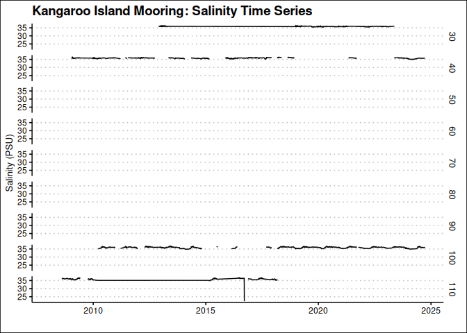
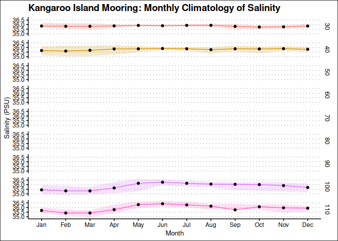

Last updated: 2025-07-14

## Goal

This notebook shows how to extract and plot a temperature and salinity times series from the Maria Island mooring. We will use AODN cloud-optimised ANMN hourly product, which is delivered as a Parquet file. This file is partitioned and sorted by `site_code`, `timestap` (3 months range), and `polygon` which is a cell that contains the data.

## Load packages
We will need `arrow`, `dplyr` and `ggplot2` plus `lubridate` to manage time.


``` r
## load libraries, suppress warnings and messages
suppressPackageStartupMessages({
  library(arrow)
  library(dplyr)
  library(ggplot2)
  library(lubridate)
  library(ggthemes)
  library(kableExtra)
  library(leaflet)
  library(patchwork)
})
```


## Mooring Locations

Let's make a map showing the locations of the moorings. Red markers indicate the National Reference Stations. This map is created using an external file that contains the mooring locations. The file was generated from the cloud-optimised product but the code is not including here as it will take long time to run. The file is available in the same directory as this notebook and is called `ANMNlocations.csv`. 


``` r
# Load the mooring locations
mooring_locations <- read.csv("ANMNlocations.csv", stringsAsFactors = FALSE)
mooring_locations$NRSsize <- ifelse(mooring_locations$NRS == FALSE, 7, 12)
mooring_locations$NRScolour <- ifelse(mooring_locations$Active == TRUE, "#5e3c99", "#b2abd2")
mooring_locations$NRScolour <- ifelse(mooring_locations$NRS == TRUE, "#e66101", mooring_locations$NRScolour)

## Map the mooring locations using leaflet. Color the markers by NRS field
m <- leaflet(mooring_locations) |>
  addTiles() |>
  addCircleMarkers(lng = ~lon, lat = ~lat,
                   radius = ~NRSsize, 
                   fillColor = ~NRScolour, 
                   fillOpacity = 0.8, 
                   stroke = TRUE,
                   weight = 1.5,
                   color = "black",
                   label = ~paste(site_name, "-", site_code, " ", yearMin, " - ", yearMax),
                   labelOptions = labelOptions(noHide = FALSE, direction = "top")) |> 
  ## add legend
  addLegend("bottomleft", 
            colors = c("#e66101", "#5e3c99", "#b2abd2"), 
            labels = c("National Reference Station", "Active Mooring", "Inactive Mooring"),
            title = "Mooring Type",
            opacity = 0.7) 

m
```

```{=html}
<div class="leaflet html-widget html-fill-item" id="htmlwidget-b16dd0d0f4c5d03706dc" style="width:672px;height:480px;"></div>
<script type="application/json" data-for="htmlwidget-b16dd0d0f4c5d03706dc">{"x":{"options":{"crs":{"crsClass":"L.CRS.EPSG3857","code":null,"proj4def":null,"projectedBounds":null,"options":{}}},"calls":[{"method":"addTiles","args":["https://{s}.tile.openstreetmap.org/{z}/{x}/{y}.png",null,null,{"minZoom":0,"maxZoom":18,"tileSize":256,"subdomains":"abc","errorTileUrl":"","tms":false,"noWrap":false,"zoomOffset":0,"zoomReverse":false,"opacity":1,"zIndex":1,"detectRetina":false,"attribution":"&copy; <a href=\"https://openstreetmap.org/copyright/\">OpenStreetMap<\/a>,  <a href=\"https://opendatacommons.org/licenses/odbl/\">ODbL<\/a>"}]},{"method":"addCircleMarkers","args":[[-36.1906712,-36.19009093,-36.20585309,-14.85037859,-14.31487107,-30.31040989,-30.27361398,-30.26665139,-12.10780152,-27.32795179,-27.3126,-27.31393044,-27.28363929,-27.24425202,-27.2073152,-27.10488562,-22.40305779,-21.02259777,-23.38159208,-23.5132984,-14.70248699,-14.33987366,-18.21947399,-23.48292719,-18.3087182,-12.28997678,-13.60855362,-11.00009037,-8.528942103,-8.857720994999999,-9.817862471,-9.001899999999999,-9.274152695,-35.07666667,-16.38794857,-15.67348786,-15.53463744,-15.22124724,-12.34206868,-33.93247228,-35.83713429,-42.59749192,-21.8672856,-27.34219686,-31.99310877,-19.30246886,-20.76071731,-14.23546422,-9.938065417000001,-17.75854331,-33.89450494,-31.88553288,-38.53976155,-32.31159203,-34.1196536,-20.05461902,-19.69429745,-19.43549979,-36.51586594,-35.27289307,-36.14565383,-36.52334094,-34.92796536,-35.49918333,-36.18263078,-35.24945206,-33.11102233,-27.33998333,-27.33185,-32.45753817,-32.48012644,-33.94254246,-33.99540967,-21.84994433,-38.40860399,-31.98340519,-31.93281667,-32.08463976,-31.7174322,-31.62658608,-31.6457212,-31.68856764,-31.72755415,-31.76841896],[150.1892948,150.2333512,150.3151557,123.8027014,123.5956437,153.2285647,153.2987944,153.3947308,130.5870294,153.8992557,153.969,153.9995998,154.1351027,154.2929388,154.6448646,155.2973102,151.9881703,152.8145922,151.9871126,151.9552961,145.6369411,145.3034396,147.3455446,152.1728261,147.165542,128.4771819,128.9665793,128.0001992,125.0800169,127.1951632,127.5542381,127.2538,127.3597157,150.8478,121.5882956,121.3020928,121.2431082,121.1152245,130.7100554,121.8501846,136.4466497,148.2333225,113.9474805,153.5618708,115.393581,147.6208144,114.7570044,123.1634636,130.3493088,119.9059366,151.31473,115.0079236,141.2314594,152.923058,151.2245376,116.4160281,116.1116386,115.915315,136.2429354,135.6799347,135.9029688,136.8619556,135.0086717,136.60115,135.8462275,136.6904559,137.7083385,153.7747833,153.8765333,152.54906,152.5685207,151.3821902,151.4508793,113.9067452,141.2708689,115.2284286,115.0111167,115.0714369,115.39993,115.2454978,115.1999289,115.125059,115.0394966,114.9596322],[7,7,7,7,7,7,7,7,7,7,7,7,7,7,7,7,7,7,7,7,7,7,7,7,7,7,7,7,7,7,7,7,7,7,7,7,7,7,12,7,12,12,7,12,12,12,7,7,7,7,7,7,7,7,12,7,7,7,7,7,7,7,7,7,7,7,7,7,7,7,7,7,7,7,12,7,7,7,7,7,7,7,7,7],null,null,{"interactive":true,"className":"","stroke":true,"color":"black","weight":1.5,"opacity":0.5,"fill":true,"fillColor":["#5e3c99","#b2abd2","#5e3c99","#b2abd2","#b2abd2","#5e3c99","#5e3c99","#5e3c99","#b2abd2","#b2abd2","#b2abd2","#b2abd2","#b2abd2","#b2abd2","#b2abd2","#b2abd2","#5e3c99","#b2abd2","#b2abd2","#5e3c99","#b2abd2","#5e3c99","#5e3c99","#5e3c99","#5e3c99","#b2abd2","#b2abd2","#b2abd2","#b2abd2","#b2abd2","#b2abd2","#b2abd2","#b2abd2","#b2abd2","#b2abd2","#b2abd2","#b2abd2","#b2abd2","#e66101","#b2abd2","#e66101","#e66101","#b2abd2","#e66101","#e66101","#e66101","#5e3c99","#5e3c99","#5e3c99","#5e3c99","#5e3c99","#b2abd2","#b2abd2","#b2abd2","#e66101","#b2abd2","#b2abd2","#b2abd2","#b2abd2","#b2abd2","#b2abd2","#b2abd2","#5e3c99","#b2abd2","#b2abd2","#5e3c99","#5e3c99","#b2abd2","#b2abd2","#b2abd2","#b2abd2","#5e3c99","#5e3c99","#b2abd2","#e66101","#5e3c99","#b2abd2","#b2abd2","#b2abd2","#b2abd2","#5e3c99","#b2abd2","#5e3c99","#5e3c99"],"fillOpacity":0.8},null,null,null,null,["Bateman's Marine Park 70m Mooring - BMP070   2014  -  2024","Bateman's Marine Park 90m Mooring - BMP090   2011  -  2015","Bateman's Marine Park 120m Mooring - BMP120   2011  -  2024","Camden Sound 50m Mooring - CAM050   2014  -  2015","Camden Sound 100m Mooring - CAM100   2014  -  2015","Coffs Harbour 50m Mooring - CH050   2016  -  2024","Coffs Harbour 70m Mooring - CH070   2009  -  2024","Coffs Harbour 100m Mooring - CH100   2009  -  2024","Beagle Gulf Mooring - DARBGF   2013  -  2017","East Australian Current (EAC) Deep Water mooring - EAC0500   2015  -  2022","East Australian Current (EAC) Deep Water mooring - EAC1520   2012  -  2013","East Australian Current (EAC) Deep Water mooring - EAC2000   2012  -  2022","East Australian Current (EAC) Deep Water mooring - EAC3200   2015  -  2022","East Australian Current (EAC) Deep Water mooring - EAC4200   2012  -  2022","East Australian Current (EAC) Deep Water mooring - EAC4700   2012  -  2022","East Australian Current (EAC) Deep Water mooring - EAC4800   2012  -  2022","Capricorn Channel Mooring - GBRCCH   2007  -  2024","Elusive Reef Mooring - GBRELR   2007  -  2014","Heron Island North mooring - GBRHIN   2007  -  2013","Heron Island South Mooring - GBRHIS   2007  -  2024","Lizard Shelf Mooring - GBRLSH   2008  -  2014","Lizard Slope Mooring - GBRLSL   2007  -  2024","Myrmidon Mooring - GBRMYR   2007  -  2024","One Tree East Mooring - GBROTE   2007  -  2024","Palm Passage Mooring - GBRPPS   2007  -  2024","Flat Top Banks Shelf Mooring - ITFFTB   2010  -  2019","Joseph Bonaparte Gulf Shelf Mooring - ITFJBG   2010  -  2019","Margaret Harries Banks Shelf Mooring - ITFMHB   2010  -  2019","Indonesian Throughflow array, Ombai  Mooring - ITFOMB   2011  -  2015","Timor North Mooring - ITFTIN   2011  -  2014","Timor South Shelf Mooring - ITFTIS   2010  -  2019","Mooring - ITFTNS   2014  -  2015","Indonesian Throughflow array Timor Sill - ITFTSL   2011  -  2015","Jervis Bay Mooring - JB070   2009  -  2009","Kimberley 50m Mooring - KIM050   2011  -  2014","Kimberley 100m Mooring - KIM100   2012  -  2014","Kimberley 200m Mooring - KIM200   2012  -  2014","Kimberley 400m Mooring - KIM400   2012  -  2014","Darwin National Reference Station - NRSDAR   2009  -  2024","Esperance National Reference Station  - NRSESP   2008  -  2013","Kangaroo Island National Reference Station  - NRSKAI   2008  -  2024","Maria Island National Reference Station  - NRSMAI   2008  -  2024","Ningaloo Reef National Reference Station - NRSNIN   2010  -  2014","North Stradbroke Island National Reference Station - NRSNSI   2010  -  2024","Rottnest Island National Reference Station - NRSROT   2008  -  2024","Yongala National Reference Station - NRSYON   2008  -  2024","Barrow Island Mooring - NWSBAR   2019  -  2024","Browse Island Mooring - NWSBRW   2019  -  2024","Lynedoch Shoal Mooring - NWSLYN   2019  -  2024","Rowley Shoals Mooring - NWSROW   2019  -  2024","Ocean Reference Station Sydney Mooring - ORS065   2006  -  2024","Perth Canyon, WA Passive Acoustic Observatory - PAPCA   2010  -  2017","Portland, VIC Passive Acoustic Observatory - PAPOR   2010  -  2017","Tuncurry, NSW Passive Acoustic Observatory - PATUN   2010  -  2015","Port Hacking 100m Mooring - PH100   2009  -  2024","Pilbara 50m Mooring - PIL050   2012  -  2014","Pilbara 100m Mooring - PIL100   2012  -  2014","Pilbara 200m Mooring - PIL200   2012  -  2014","Deep Slope Mooring (M1) - SAM1DS   2008  -  2009","Cabbage Patch Mooring (M2) - SAM2CP   2008  -  2010","Mid-Slope Mooring (M3) - SAM3MS   2011  -  2013","Canyon Mooring (M4) - SAM4CY   2009  -  2010","Coffin Bay Mooring (M5) - SAM5CB   2009  -  2024","Investigator Strait Mooring (M6) - SAM6IS   2009  -  2009","Deep-Slope Mooring (M7) - SAM7DS   2009  -  2014","Spencer Gulf Mouth Mooring (M8) - SAM8SG   2009  -  2024","Upper Spencer Gulf Mooring - SAMUSG   2019  -  2024","South-East Queensland 200m Mooring - SEQ200   2012  -  2013","South-East Queensland 400m Mooring - SEQ400   2012  -  2013","Seal Rocks Line (SRL2) Mooring - SR030   2020  -  2023","Seal Rocks Line (SRL5) Mooring - SR050   2020  -  2023","Sydney 100m Mooring - SYD100   2008  -  2024","Sydney 140m Mooring - SYD140   2008  -  2024","Tantabiddi Mooring - TAN100   2010  -  2024","Bonney Coast Mooring - VBM100   2019  -  2023","Canyon 200m Head Mooring - WACA20   2010  -  2024","Canyon 500m North Mooring - WACANO   2010  -  2010","Canyon 500m South Mooring - WACASO   2010  -  2014","Two Rocks 44m Mooring - WATR04   2013  -  2019","Two Rocks 50m Shelf Mooring - WATR05   2009  -  2013","Two Rocks 100m Shelf Mooring - WATR10   2009  -  2024","Two Rocks 150m Shelf Mooring - WATR15   2009  -  2013","Two Rocks 200m Shelf Mooring - WATR20   2009  -  2025","Two Rocks 500m Shelf Mooring - WATR50   2009  -  2025"],{"interactive":false,"permanent":false,"direction":"top","opacity":1,"offset":[0,0],"textsize":"10px","textOnly":false,"className":"","sticky":true},null]},{"method":"addLegend","args":[{"colors":["#e66101","#5e3c99","#b2abd2"],"labels":["National Reference Station","Active Mooring","Inactive Mooring"],"na_color":null,"na_label":"NA","opacity":0.7,"position":"bottomleft","type":"unknown","title":"Mooring Type","extra":null,"layerId":null,"className":"info legend","group":null}]}],"limits":{"lat":[-42.59749192,-8.528942103],"lng":[113.9067452,155.2973102]}},"evals":[],"jsHooks":[]}</script>
```

``` r
## save widget
#library(htmlwidgets)
#saveWidget(m, "mooring_locations.html", selfcontained = TRUE, title = "IMOS Mooring Locations")
```


## Load data

First we need to create a connection with the cloud-optimise data store. We will use the `arrow` package to read the Parquet file. The mooring hourly time-series data is located in `s3://aodn-cloud-optimised/mooring_hourly_timeseries_delayed_qc.parquet/`


``` r
# Create a connection to the cloud-optimised data store
uri <- "s3://aodn-cloud-optimised/mooring_hourly_timeseries_delayed_qc.parquet/"
## the s3_bucket function will automatically detect the region, but we can also specify it
bucket <- s3_bucket(uri, anonymous=TRUE, region="ap-southeast-2")

# Read the Parquet file
df <- open_dataset(bucket)
```


This dataset contains more than 54 million lines of hourly measurements in 96 columns and it is partitioned into more than 2700 individual files. Below are the columns in the dataset. You should be able to identify the variables of interest, such as `TEMP` for temperature and `PSAL` for salinity. The time variable is `TIME`, and the actual depth is indicated by `DEPTH` and the target depth is `NOMINAL_DEPTH`. The mooring site is identified by `site_code`. This product is an aggregation of the IMOS mooring data, which is collected by the [Australian National Mooring Network (ANMN)](https://imos.org.au/facility/national-mooring-network) and has 84 locations. The instruments are programmed to collect data at different frequencies, but the data is aggregated to an hourly frequency. The data is also quality controlled and delayed, which means that the data is not available in real-time, but is available after a certain period of time.


``` r
print(df$schema)
```

```
## Schema
## instrument_index: int32
## instrument_id: string
## source_file: string
## TIME: timestamp[ns]
## LONGITUDE: double
## LATITUDE: double
## NOMINAL_DEPTH: float
## DEPTH: float
## DEPTH_count: float
## DEPTH_min: float
## DEPTH_max: float
## DEPTH_std: float
## PRES: float
## PRES_REL: float
## PRES_REL_count: float
## PRES_REL_max: float
## PRES_REL_min: float
## PRES_REL_std: float
## PRES_count: float
## PRES_max: float
## PRES_min: float
## PRES_std: float
## TEMP: float
## TEMP_count: float
## TEMP_max: float
## TEMP_min: float
## TEMP_std: float
## PSAL: float
## PSAL_count: float
## PSAL_max: float
## PSAL_min: float
## PSAL_std: float
## filename: string
## TURB: float
## TURB_count: float
## TURB_max: float
## TURB_min: float
## TURB_std: float
## CHLF: float
## CHLF_count: float
## CHLF_max: float
## CHLF_min: float
## CHLF_std: float
## CHLU: float
## CHLU_count: float
## CHLU_max: float
## CHLU_min: float
## CHLU_std: float
## CPHL: float
## CPHL_count: float
## CPHL_max: float
## CPHL_min: float
## CPHL_std: float
## DOX: float
## DOX_min: float
## DOX_max: float
## DOX_std: float
## DOX_count: float
## DOX1: float
## DOX1_count: float
## DOX1_max: float
## DOX1_min: float
## DOX1_std: float
## DOX1_2: float
## DOX1_2_min: float
## DOX1_2_max: float
## DOX1_2_std: float
## DOX1_2_count: float
## DOX2: float
## DOX2_min: float
## DOX2_max: float
## DOX2_count: float
## DOX2_std: float
## DOX1_3: float
## DOX1_3_min: float
## DOX1_3_max: float
## DOX1_3_count: float
## DOX1_3_std: float
## DOXY: float
## DOXY_std: float
## DOXY_min: float
## DOXY_max: float
## DOXY_count: float
## DOXS: float
## DOXS_std: float
## DOXS_min: float
## DOXS_max: float
## DOXS_count: float
## PAR: float
## PAR_std: float
## PAR_min: float
## PAR_max: float
## PAR_count: float
## site_code: string
## timestamp: int32
## polygon: string
```


## Get Kangaroo Island data


As mentioned at the beginning, this dataset has `site_code` as a primary sort key. Using `filter()` we can select the data for Kangaroo Island mooring, which has `site_code = "NRSKAI"`. I will also calculate the daily average of the varaibles of interest, as the want to explore long time series. I will make use of the on the fly calcutation abilities of the arrowpackage, taking maximun advantage of the parquet file. These are the variables in the extracted table.


``` r
# Filter the dataset for Maria Island mooring and calculate daily averages
kai_data <- df |>
  filter(site_code == "NRSKAI") |>
  select(TIME, DEPTH, NOMINAL_DEPTH, TEMP, PSAL, LATITUDE, LONGITUDE) |>
  group_by(TIME = floor_date(TIME, "day"), NOMINAL_DEPTH) |>
  summarise(TEMP = mean(TEMP, na.rm = TRUE),
            PSAL = mean(PSAL, na.rm = TRUE),
            LATITUDE = mean(LATITUDE),
            LONGITUDE = mean(LONGITUDE),
            DEPTH= mean(DEPTH, na.rm = TRUE)) |> 
  collect()
```

This is a glimpse of the data extracted:


``` r
# Check the first few rows of the data
glimpse(kai_data)
```

```
## Rows: 68,871
## Columns: 7
## Groups: TIME [5,860]
## $ TIME          <dttm> 2008-02-12 11:00:00, 2008-02-13 11:00:00, 2008-02-14 11…
## $ NOMINAL_DEPTH <dbl> 105.3, 105.3, 105.3, 105.3, 105.3, 105.3, 105.3, 105.3, …
## $ TEMP          <dbl> 11.16563, 11.30278, 11.80153, 11.88667, 11.62660, 11.592…
## $ PSAL          <dbl> NaN, NaN, NaN, NaN, NaN, NaN, NaN, NaN, NaN, NaN, NaN, N…
## $ LATITUDE      <dbl> -35.83557, -35.83557, -35.83557, -35.83557, -35.83557, -…
## $ LONGITUDE     <dbl> 136.4476, 136.4476, 136.4476, 136.4476, 136.4476, 136.44…
## $ DEPTH         <dbl> 104.8843, 104.8661, 104.8068, 104.8061, 104.8411, 104.86…
```

Now, we have the data locally in our machine. Note that there are multiple variables, not all are available for this station. The main time indicator is the variable `TIME`.

## Location of the mooring

We can plot the location of the Maria Island mooring using `leaflet`. The mooring coordinates are in the `LATITUDE` and `LONGITUDE` columns. We will use the `leaflet` package to create an interactive map. Note that coordinates may vary slightly depending on the deployment, but they are generally around the same location. We will take the average location for the map.


``` r
# Calculate the average location of the mooring
avg_location <- kai_data |>
  summarise(lat = mean(LATITUDE, na.rm = TRUE),
            lon = mean(LONGITUDE, na.rm = TRUE))
# Create a leaflet map
leaflet(avg_location) |>
  addTiles() |>
  addCircleMarkers(lng = ~lon, lat = ~lat,
                   radius = 10, 
                   fillColor = "red", 
                   fillOpacity = 0.5, 
                   stroke = FALSE,
                   label = ~paste("Maria Island Mooring (NRSMAI)"),
                   labelOptions = labelOptions(noHide = FALSE, direction = "top")) |>
  setView(lng = avg_location$lon, lat = avg_location$lat, zoom = 7) 
```

```{=html}
<div class="leaflet html-widget html-fill-item" id="htmlwidget-e144caddf0ab8c8eb197" style="width:672px;height:480px;"></div>
<script type="application/json" data-for="htmlwidget-e144caddf0ab8c8eb197">{"x":{"options":{"crs":{"crsClass":"L.CRS.EPSG3857","code":null,"proj4def":null,"projectedBounds":null,"options":{}}},"calls":[{"method":"addTiles","args":["https://{s}.tile.openstreetmap.org/{z}/{x}/{y}.png",null,null,{"minZoom":0,"maxZoom":18,"tileSize":256,"subdomains":"abc","errorTileUrl":"","tms":false,"noWrap":false,"zoomOffset":0,"zoomReverse":false,"opacity":1,"zIndex":1,"detectRetina":false,"attribution":"&copy; <a href=\"https://openstreetmap.org/copyright/\">OpenStreetMap<\/a>,  <a href=\"https://opendatacommons.org/licenses/odbl/\">ODbL<\/a>"}]},{"method":"addCircleMarkers","args":[[-35.8355666667,-35.83556666669998,-35.83556666669998,-35.83556666669998,-35.83556666669998,-35.83556666669998,-35.83556666669998,-35.83556666669998,-35.83556666669998,-35.83556666669998,-35.83556666669998,-35.83556666669998,-35.83556666669998,-35.83556666669998,-35.83556666669998,-35.83556666669998,-35.83556666669998,-35.83556666669998,-35.83556666669998,-35.83556666669998,-35.83556666669998,-35.83556666669998,-35.83556666669998,-35.83556666669998,-35.83556666669998,-35.83556666669998,-35.8355666667,-35.83528333330002,-35.83528333330002,-35.83528333330002,-35.83528333330002,-35.83528333330002,-35.83528333330002,-35.83528333330002,-35.83528333330002,-35.83528333330002,-35.83528333330002,-35.83528333330002,-35.83528333330002,-35.83528333330002,-35.83528333330002,-35.83528333330002,-35.83528333330002,-35.83528333330002,-35.83528333330002,-35.83528333330002,-35.83528333330002,-35.83528333330002,-35.83528333330002,-35.83528333330002,-35.83528333330002,-35.83528333330002,-35.83528333330002,-35.83528333330002,-35.83528333330002,-35.83528333330002,-35.83528333330002,-35.83528333330002,-35.83528333330002,-35.83528333330002,-35.83528333330002,-35.83528333330002,-35.83528333330002,-35.83528333330002,-35.83528333330002,-35.83528333330002,-35.83528333330002,-35.83528333330002,-35.83528333330002,-35.83528333330002,-35.83528333330002,-35.83528333330002,-35.83528333330002,-35.83528333330002,-35.83528333330002,-35.83528333330002,-35.83528333330002,-35.83528333330002,-35.83528333330002,-35.83528333330002,-35.83528333330002,-35.83528333330002,-35.83528333330002,-35.83528333330002,-35.83528333330002,-35.83528333330002,-35.83528333330002,-35.83528333330002,-35.83528333330002,-35.83528333330002,-35.83528333330002,-35.83528333330002,-35.83528333330001,-35.83609999999999,-35.83609999999999,-35.83609999999999,-35.83609999999999,-35.83609999999999,-35.83609999999999,-35.83609999999999,-35.83609999999999,-35.83609999999999,-35.83609999999999,-35.83609999999999,-35.83609999999999,-35.83609999999999,-35.83609999999999,-35.83609999999999,-35.83609999999999,-35.83609999999999,-35.83609999999999,-35.83609999999999,-35.83609999999999,-35.83609999999999,-35.83609999999999,-35.83609999999999,-35.83609999999999,-35.83609999999999,-35.83609999999999,-35.83609999999999,-35.83609999999999,-35.83609999999999,-35.83609999999999,-35.83609999999999,-35.83609999999999,-35.83609999999999,-35.83609999999999,-35.83609999999999,-35.83609999999999,-35.83609999999999,-35.83609999999999,-35.83609999999999,-35.83609999999999,-35.83609999999999,-35.83609999999999,-35.83609999999999,-35.83609999999999,-35.83609999999999,-35.83609999999999,-35.83609999999999,-35.83609999999999,-35.83609999999999,-35.83609999999999,-35.83609999999999,-35.83609999999999,-35.83609999999999,-35.83609999999999,-35.83609999999999,-35.83609999999999,-35.83609999999999,-35.83609999999999,-35.83609999999999,-35.83609999999999,-35.83609999999999,-35.83609999999999,-35.83609999999999,-35.83609999999999,-35.83609999999999,-35.83609999999999,-35.83609999999999,-35.83609999999999,-35.83609999999999,-35.83609999999999,-35.83609999999999,-35.83609999999999,-35.83609999999999,-35.83609999999999,-35.83609999999999,-35.83609999999999,-35.83609999999999,-35.83609999999999,-35.83609999999999,-35.83609999999999,-35.83609999999999,-35.83609999999999,-35.83609999999999,-35.83609999999999,-35.83609999999999,-35.83609999999999,-35.83609999999999,-35.83727,-35.83804999999999,-35.83804999999999,-35.83804999999999,-35.83804999999999,-35.83804999999999,-35.83804999999999,-35.83804999999999,-35.83804999999999,-35.83804999999999,-35.83804999999999,-35.83804999999999,-35.83804999999999,-35.83804999999999,-35.83804999999999,-35.83804999999999,-35.83804999999999,-35.83804999999999,-35.83804999999999,-35.83804999999999,-35.83804999999999,-35.83804999999999,-35.83804999999999,-35.83804999999999,-35.83804999999999,-35.83804999999999,-35.83804999999999,-35.83804999999999,-35.83804999999999,-35.83804999999999,-35.83804999999999,-35.83804999999999,-35.83804999999999,-35.83804999999999,-35.83804999999999,-35.83804999999999,-35.83804999999999,-35.83804999999999,-35.83804999999999,-35.83804999999999,-35.83804999999999,-35.83804999999999,-35.83804999999999,-35.83804999999999,-35.83804999999999,-35.83804999999999,-35.83804999999999,-35.83804999999999,-35.83804999999999,-35.83804999999999,-35.83804999999999,-35.83804999999999,-35.83804999999999,-35.83804999999999,-35.83804999999999,-35.83804999999999,-35.83804999999999,-35.83804999999999,-35.83804999999999,-35.83804999999999,-35.83804999999999,-35.83804999999999,-35.83804999999999,-35.83804999999999,-35.83804999999999,-35.83804999999999,-35.83804999999999,-35.83804999999999,-35.83804999999999,-35.83804999999999,-35.83804999999999,-35.83804999999999,-35.83804999999999,-35.83804999999999,-35.83804999999999,-35.83804999999999,-35.83804999999999,-35.83804999999999,-35.83804999999999,-35.83804999999999,-35.83804999999999,-35.83804999999999,-35.83804999999999,-35.83804999999999,-35.83804999999999,-35.83804999999999,-35.83804999999999,-35.83804999999999,-35.83804999999999,-35.83804999999999,-35.83804999999999,-35.83804999999999,-35.83804999999999,-35.83804999999999,-35.83804999999999,-35.83804999999999,-35.83804999999999,-35.83804999999999,-35.83804999999999,-35.83804999999999,-35.83804999999999,-35.83804999999999,-35.83804999999999,-35.83804999999999,-35.83804999999999,-35.83804999999999,-35.83804999999999,-35.83804999999999,-35.83804999999999,-35.83804999999999,-35.83804999999999,-35.83804999999999,-35.83804999999999,-35.83804999999999,-35.83804999999999,-35.83804999999999,-35.83804999999999,-35.83804999999999,-35.83804999999999,-35.83804999999999,-35.83804999999999,-35.83804999999999,-35.83804999999999,-35.83804999999999,-35.83804999999999,-35.83804999999999,-35.83804999999999,-35.83804999999999,-35.83804999999999,-35.83804999999999,-35.83804999999999,-35.83804999999999,-35.83804999999999,-35.83804999999999,-35.83804999999999,-35.83804999999999,-35.83804999999999,-35.83804999999999,-35.83804999999999,-35.83523333330001,-35.83523333330001,-35.83523333330001,-35.83523333330001,-35.83523333330001,-35.83523333330001,-35.83523333330001,-35.83523333330001,-35.83523333330001,-35.83523333330001,-35.83523333330001,-35.83523333330001,-35.83523333330001,-35.83523333330001,-35.83523333330001,-35.83523333330001,-35.83523333330001,-35.83523333330001,-35.83523333330001,-35.83523333330001,-35.83523333330001,-35.83523333330001,-35.83523333330001,-35.83523333330001,-35.83523333330001,-35.83523333330001,-35.83523333330001,-35.83523333330001,-35.83523333330001,-35.83523333330001,-35.83523333330001,-35.83523333330001,-35.83523333330001,-35.83523333330001,-35.83523333330001,-35.83523333330001,-35.83523333330001,-35.83523333330001,-35.83523333330001,-35.83523333330001,-35.83523333330001,-35.83523333330001,-35.83523333330001,-35.83523333330001,-35.83523333330001,-35.83523333330001,-35.83523333330001,-35.83523333330001,-35.83523333330001,-35.83523333330001,-35.83523333330001,-35.83523333330001,-35.83523333330001,-35.83523333330001,-35.83523333330001,-35.83523333330001,-35.83523333330001,-35.83523333330001,-35.83523333330001,-35.83523333330001,-35.83523333330001,-35.83523333330001,-35.83523333330001,-35.83523333330001,-35.83523333330001,-35.83523333330001,-35.83523333330001,-35.83523333330001,-35.83523333330001,-35.83523333330001,-35.83523333330001,-35.83523333330001,-35.83523333330001,-35.83523333330001,-35.83523333330001,-35.83523333330001,-35.83523333330001,-35.83523333330001,-35.83523333330001,-35.83523333330001,-35.83523333330001,-35.83523333330001,-35.83523333330001,-35.83523333330001,-35.83523333330001,-35.83523333330001,-35.83523333330001,-35.83523333330001,-35.83523333330001,-35.83523333330001,-35.83523333330001,-35.83523333330001,-35.83523333330001,-35.83523333330001,-35.83523333330001,-35.83523333330001,-35.83523333330001,-35.83523333330001,-35.83523333330001,-35.83523333330001,-35.83523333330001,-35.83523333330001,-35.83523333330001,-35.83523333330001,-35.83523333330001,-35.83523333330001,-35.83523333330001,-35.83523333330001,-35.83523333330001,-35.83523333330001,-35.83523333330001,-35.83523333330001,-35.83523333330001,-35.83523333330001,-35.83523333330001,-35.83523333330001,-35.83523333330001,-35.83523333330001,-35.83523333330001,-35.83523333330001,-35.83523333330001,-35.83523333330001,-35.83523333330001,-35.83523333330001,-35.83523333330001,-35.83523333330001,-35.83523333330001,-35.83362222223334,-35.83281666669999,-35.83281666669999,-35.83281666669999,-35.83281666669999,-35.83281666669999,-35.83281666669999,-35.83281666669999,-35.83281666669999,-35.83281666669999,-35.83281666669999,-35.83281666669999,-35.83281666669999,-35.83281666669999,-35.83281666669999,-35.83281666669999,-35.83281666669999,-35.83281666669999,-35.83281666669999,-35.83281666669999,-35.83281666669999,-35.83281666669999,-35.83281666669999,-35.83281666669999,-35.83281666669999,-35.83281666669999,-35.83281666669999,-35.83281666669999,-35.83281666669999,-35.83281666669999,-35.83281666669999,-35.83281666669999,-35.83281666669999,-35.83281666669999,-35.83281666669999,-35.83281666669999,-35.83281666669999,-35.83281666669999,-35.83281666669999,-35.83281666669999,-35.83281666669999,-35.83281666669999,-35.83281666669999,-35.83281666669999,-35.83281666669999,-35.83281666669999,-35.83281666669999,-35.83281666669999,-35.83281666669999,-35.83281666669999,-35.83281666669999,-35.83281666669999,-35.83281666669999,-35.83281666669999,-35.83281666669999,-35.83281666669999,-35.83281666669999,-35.83281666669999,-35.83281666669999,-35.83281666669999,-35.83281666669999,-35.83281666669999,-35.83281666669999,-35.83281666669999,-35.83281666669999,-35.83281666669999,-35.83281666669999,-35.83281666669999,-35.83281666669999,-35.83593333329998,-35.83593333329998,-35.83593333329998,-35.83593333329998,-35.83593333329998,-35.83593333329998,-35.83593333329998,-35.83593333329998,-35.83593333329998,-35.83593333329998,-35.83593333329998,-35.83593333329998,-35.83593333329998,-35.83593333329998,-35.83593333329998,-35.83593333329998,-35.83593333329998,-35.83593333329998,-35.83593333329998,-35.83593333329998,-35.83593333329998,-35.83593333329998,-35.83593333329998,-35.83593333329998,-35.83593333329998,-35.83593333329998,-35.83593333329998,-35.83593333329998,-35.83593333329998,-35.83593333329998,-35.83593333329998,-35.83593333329998,-35.83593333329998,-35.83593333329998,-35.83593333329998,-35.83593333329998,-35.83593333329998,-35.83593333329998,-35.83593333329998,-35.83593333329998,-35.83593333329998,-35.83593333329998,-35.83593333329998,-35.83593333329998,-35.83593333329998,-35.83593333329998,-35.83593333329998,-35.83593333329998,-35.83593333329998,-35.83593333329998,-35.83593333329998,-35.83593333329998,-35.83593333329998,-35.83593333329998,-35.83593333329998,-35.83593333329998,-35.83593333329998,-35.83593333329998,-35.83593333329998,-35.83593333329998,-35.83593333329998,-35.83593333329998,-35.83593333329998,-35.83593333329998,-35.83593333329998,-35.83593333329998,-35.83593333329998,-35.83593333329998,-35.83593333329998,-35.83593333329998,-35.83593333329998,-35.83593333329998,-35.83593333329998,-35.83593333329998,-35.83593333329998,-35.83593333329998,-35.83593333329998,-35.83593333329998,-35.83593333329998,-35.83593333329998,-35.83593333329998,-35.83593333329998,-35.83593333329998,-35.83593333329998,-35.83593333329998,-35.83593333329998,-35.83593333329998,-35.83593333329998,-35.83593333329998,-35.83593333329998,-35.83593333329998,-35.84485,-35.84484999999999,-35.84484999999999,-35.84484999999999,-35.84484999999999,-35.84484999999999,-35.84484999999999,-35.84484999999999,-35.84484999999999,-35.84484999999999,-35.84484999999999,-35.84484999999999,-35.84484999999999,-35.84484999999999,-35.84484999999999,-35.84484999999999,-35.84484999999999,-35.84484999999999,-35.84484999999999,-35.84484999999999,-35.84484999999999,-35.84484999999999,-35.84484999999999,-35.84484999999999,-35.84484999999999,-35.84484999999999,-35.84484999999999,-35.84484999999999,-35.84484999999999,-35.84484999999999,-35.84484999999999,-35.84484999999999,-35.84484999999999,-35.84484999999999,-35.84484999999999,-35.84484999999999,-35.84484999999999,-35.84484999999999,-35.84484999999999,-35.84484999999999,-35.84484999999999,-35.84484999999999,-35.84484999999999,-35.84484999999999,-35.84484999999999,-35.84484999999999,-35.84484999999999,-35.84484999999999,-35.84484999999999,-35.84484999999999,-35.84484999999999,-35.84484999999999,-35.84484999999999,-35.84484999999999,-35.84484999999999,-35.84484999999999,-35.84484999999999,-35.84484999999999,-35.84484999999999,-35.84484999999999,-35.84484999999999,-35.84484999999999,-35.84484999999999,-35.84484999999999,-35.84484999999999,-35.84484999999999,-35.84484999999999,-35.84484999999999,-35.84484999999999,-35.84484999999999,-35.84484999999999,-35.84484999999999,-35.84484999999999,-35.84484999999999,-35.84484999999999,-35.84484999999999,-35.84484999999999,-35.84484999999999,-35.84484999999999,-35.84484999999999,-35.84484999999999,-35.84484999999999,-35.84484999999999,-35.84484999999999,-35.84484999999999,-35.84484999999999,-35.84484999999999,-35.84484999999999,-35.84484999999999,-35.84484999999999,-35.84484999999999,-35.84484999999999,-35.84484999999999,-35.84484999999999,-35.84484999999999,-35.84484999999999,-35.84484999999999,-35.84484999999999,-35.84484999999999,-35.84484999999999,-35.84484999999999,-35.84484999999999,-35.84484999999999,-35.84484999999999,-35.84484999999999,-35.84484999999999,-35.84484999999999,-35.84484999999999,-35.84484999999999,-35.84484999999999,-35.84484999999999,-35.84484999999999,-35.84484999999999,-35.84484999999999,-35.84484999999999,-35.84484999999999,-35.84484999999999,-35.84484999999999,-35.84484999999999,-35.84484999999999,-35.84484999999999,-35.84484999999999,-35.84484999999999,-35.84484999999999,-35.84484999999999,-35.84484999999999,-35.84484999999999,-35.84484999999999,-35.84484999999999,-35.84484999999999,-35.84484999999999,-35.84484999999999,-35.84484999999999,-35.84484999999999,-35.84484999999999,-35.84484999999999,-35.84484999999999,-35.84484999999999,-35.84484999999999,-35.84484999999999,-35.84484999999999,-35.84484999999999,-35.84484999999999,-35.84484999999999,-35.84484999999999,-35.84484999999999,-35.84484999999999,-35.84484999999999,-35.84484999999999,-35.84484999999999,-35.84484999999999,-35.84484999999999,-35.84484999999999,-35.84484999999999,-35.84484999999999,-35.84484999999999,-35.84484999999999,-35.84484999999999,-35.84484999999999,-35.84484999999999,-35.84484999999999,-35.84142499999999,-35.83799999999999,-35.83799999999999,-35.83799999999999,-35.83799999999999,-35.83799999999999,-35.83799999999999,-35.83799999999999,-35.83799999999999,-35.83799999999999,-35.83799999999999,-35.83799999999999,-35.83799999999999,-35.83799999999999,-35.83799999999999,-35.83799999999999,-35.83799999999999,-35.83799999999999,-35.83799999999999,-35.83799999999999,-35.83799999999999,-35.83799999999999,-35.83799999999999,-35.83799999999999,-35.83799999999999,-35.83799999999999,-35.83799999999999,-35.83799999999999,-35.83799999999999,-35.83799999999999,-35.83799999999999,-35.83799999999999,-35.83799999999999,-35.83799999999999,-35.83799999999999,-35.83799999999999,-35.83799999999999,-35.83799999999999,-35.83799999999999,-35.83799999999999,-35.83799999999999,-35.83799999999999,-35.83799999999999,-35.83799999999999,-35.83799999999999,-35.83799999999999,-35.83799999999999,-35.83799999999999,-35.83799999999999,-35.83799999999999,-35.83799999999999,-35.83799999999999,-35.83799999999999,-35.83799999999999,-35.83799999999999,-35.83799999999999,-35.83799999999999,-35.83799999999999,-35.83799999999999,-35.83799999999999,-35.83799999999999,-35.83799999999999,-35.83799999999999,-35.83799999999999,-35.83799999999999,-35.83799999999999,-35.83799999999999,-35.83799999999999,-35.83799999999999,-35.83799999999999,-35.83799999999999,-35.83799999999999,-35.83799999999999,-35.83799999999999,-35.83799999999999,-35.83799999999999,-35.83799999999999,-35.83799999999999,-35.83799999999999,-35.83799999999999,-35.83799999999999,-35.83799999999999,-35.83799999999999,-35.83799999999999,-35.83799999999999,-35.83799999999999,-35.83799999999999,-35.83799999999999,-35.83799999999999,-35.83799999999999,-35.83799999999999,-35.83799999999999,-35.83799999999999,-35.83799999999999,-35.83799999999999,-35.83799999999999,-35.83799999999999,-35.83799999999999,-35.83799999999999,-35.83799999999999,-35.83799999999999,-35.83799999999999,-35.83799999999999,-35.83799999999999,-35.83799999999999,-35.83799999999999,-35.83799999999999,-35.83799999999999,-35.83799999999999,-35.83799999999999,-35.83799999999999,-35.83799999999999,-35.838,-35.83799999999999,-35.83799999999999,-35.838,-35.83799999999999,-35.83799999999999,-35.83799999999999,-35.83799999999999,-35.83799999999999,-35.83799999999999,-35.83799999999999,-35.83799999999999,-35.83799999999999,-35.83799999999999,-35.83799999999999,-35.83799999999999,-35.83799999999999,-35.83799999999999,-35.83799999999999,-35.83799999999999,-35.83799999999999,-35.83799999999999,-35.83799999999999,-35.83799999999999,-35.83799999999999,-35.83799999999999,-35.83799999999999,-35.83799999999999,-35.83799999999999,-35.83799999999999,-35.83799999999999,-35.83799999999999,-35.83799999999999,-35.83799999999999,-35.83799999999999,-35.83799999999999,-35.83799999999999,-35.83799999999999,-35.83799999999999,-35.83799999999999,-35.83799999999999,-35.83799999999999,-35.83799999999999,-35.83799999999999,-35.83799999999999,-35.83799999999999,-35.83799999999999,-35.83799999999999,-35.83799999999999,-35.83799999999999,-35.83799999999999,-35.83799999999999,-35.83799999999999,-35.83799999999999,-35.83799999999999,-35.83799999999999,-35.83799999999999,-35.83799999999999,-35.83799999999999,-35.83799999999999,-35.83799999999999,-35.83799999999999,-35.83799999999999,-35.838,-35.84476666670002,-35.84476666670002,-35.84476666670002,-35.84476666670002,-35.84476666670002,-35.84476666670002,-35.84476666670002,-35.84476666670002,-35.84476666670002,-35.84476666670002,-35.84476666670002,-35.84476666670002,-35.84476666670002,-35.84476666670002,-35.84476666670002,-35.84476666670002,-35.84476666670002,-35.84476666670002,-35.84476666670002,-35.84476666670002,-35.84476666670002,-35.84476666670002,-35.84476666670002,-35.84476666670002,-35.84476666670002,-35.84476666670002,-35.84476666670002,-35.84476666670002,-35.84476666670002,-35.84476666670002,-35.84476666670002,-35.84476666670002,-35.84476666670002,-35.84476666670002,-35.84476666670002,-35.84476666670002,-35.84476666670002,-35.84476666670002,-35.84476666670002,-35.84476666670002,-35.84476666670002,-35.84476666670002,-35.84476666670002,-35.84476666670002,-35.84476666670002,-35.84476666670002,-35.84476666670002,-35.84476666670002,-35.84476666670002,-35.84476666670002,-35.84476666670002,-35.84476666670002,-35.84476666670002,-35.84476666670002,-35.84476666670002,-35.84476666670002,-35.84476666670002,-35.84476666670002,-35.84476666670002,-35.84476666670002,-35.84476666670002,-35.84476666670002,-35.84476666670002,-35.84476666670002,-35.84476666670002,-35.84476666670002,-35.84476666670002,-35.84476666670002,-35.84476666670002,-35.84476666670002,-35.84476666670002,-35.84476666670002,-35.84476666670002,-35.84476666670002,-35.84476666670002,-35.84476666670002,-35.84476666670002,-35.84476666670002,-35.84476666670002,-35.84476666670002,-35.84476666670002,-35.84476666670002,-35.84476666670002,-35.84476666670002,-35.84476666670002,-35.84476666670002,-35.84476666670002,-35.84476666670002,-35.84476666670002,-35.84476666670002,-35.84476666670002,-35.84476666670002,-35.84476666670002,-35.84476666670002,-35.84476666670002,-35.84476666670002,-35.84476666670002,-35.84476666670002,-35.84476666670002,-35.84476666670002,-35.84476666670002,-35.84476666670002,-35.84476666670002,-35.84476666670002,-35.84476666670002,-35.84476666670002,-35.84476666670002,-35.84476666670002,-35.84476666670002,-35.84476666670002,-35.84476666670002,-35.84476666670002,-35.84476666670002,-35.84476666670002,-35.84476666670002,-35.84476666670002,-35.84476666670002,-35.84476666670002,-35.84476666670002,-35.84476666670002,-35.84476666670002,-35.83714999999999,-35.83714999999999,-35.83714999999999,-35.83714999999999,-35.83714999999999,-35.83714999999999,-35.83714999999999,-35.83714999999999,-35.83714999999999,-35.83714999999999,-35.83714999999999,-35.83714999999999,-35.83714999999999,-35.83714999999999,-35.83714999999999,-35.83714999999999,-35.83714999999999,-35.83714999999999,-35.83714999999999,-35.83714999999999,-35.83714999999999,-35.83714999999999,-35.83714999999999,-35.83714999999999,-35.83714999999999,-35.83714999999999,-35.83714999999999,-35.83714999999999,-35.83714999999999,-35.83714999999999,-35.83714999999999,-35.83714999999999,-35.83714999999999,-35.83714999999999,-35.83714999999999,-35.83714999999999,-35.83714999999999,-35.83714999999999,-35.83714999999999,-35.83714999999999,-35.83714999999999,-35.83714999999999,-35.83714999999999,-35.83714999999999,-35.83714999999999,-35.83714999999999,-35.83714999999999,-35.83714999999999,-35.83714999999999,-35.83714999999999,-35.83714999999999,-35.83714999999999,-35.83714999999999,-35.83714999999999,-35.83714999999999,-35.83714999999999,-35.83714999999999,-35.83714999999999,-35.83714999999999,-35.83714999999999,-35.83714999999999,-35.83714999999999,-35.83714999999999,-35.83714999999999,-35.83714999999999,-35.83714999999999,-35.83714999999999,-35.83714999999999,-35.83714999999999,-35.83714999999999,-35.83714999999999,-35.83714999999999,-35.83714999999999,-35.83714999999999,-35.83714999999999,-35.83714999999999,-35.83714999999999,-35.83714999999999,-35.83714999999999,-35.83714999999999,-35.83714999999999,-35.83714999999999,-35.83714999999999,-35.83714999999999,-35.83714999999999,-35.83714999999999,-35.83714999999999,-35.83714999999999,-35.83714999999999,-35.83714999999999,-35.83714999999999,-35.83714999999999,-35.83714999999999,-35.83714999999999,-35.83714999999999,-35.83714999999999,-35.83714999999999,-35.83714999999999,-35.83714999999999,-35.83714999999999,-35.83714999999999,-35.83714999999999,-35.83714999999999,-35.83714999999999,-35.83714999999999,-35.83714999999999,-35.83714999999999,-35.83714999999999,-35.83714999999999,-35.83714999999999,-35.83714999999999,-35.83714999999999,-35.83714999999999,-35.83714999999999,-35.83714999999999,-35.83714999999999,-35.83714999999999,-35.83714999999999,-35.83714999999999,-35.83714999999999,-35.83714999999999,-35.83714999999999,-35.83714999999999,-35.83714999999999,-35.83714999999999,-35.83714999999999,-35.83714999999999,-35.83714999999999,-35.83714999999999,-35.83714999999999,-35.83714999999999,-35.83714999999999,-35.83714999999999,-35.83714999999999,-35.83714999999999,-35.83714999999999,-35.83714999999999,-35.83714999999999,-35.83714999999999,-35.83714999999999,-35.83714999999999,-35.83714999999999,-35.83714999999999,-35.83714999999999,-35.83714999999999,-35.83714999999999,-35.83714999999999,-35.83714999999999,-35.83714999999999,-35.83714999999999,-35.83714999999999,-35.83714999999999,-35.83714999999999,-35.83714999999999,-35.83453333329999,-35.83453333329999,-35.83453333329999,-35.83453333329999,-35.83453333329999,-35.83453333329999,-35.83453333329999,-35.83453333329999,-35.83453333329999,-35.83453333329999,-35.83453333329999,-35.83453333329999,-35.83453333329999,-35.83453333329999,-35.83453333329999,-35.83453333329999,-35.83453333329999,-35.83453333329999,-35.83453333329999,-35.83453333329999,-35.83453333329999,-35.83453333329999,-35.83453333329999,-35.83453333329999,-35.83453333329999,-35.83453333329999,-35.83453333329999,-35.83453333329999,-35.83453333329999,-35.83453333329999,-35.83453333329999,-35.83453333329999,-35.83453333329999,-35.83453333329999,-35.83453333329999,-35.83453333329999,-35.83453333329999,-35.83453333329999,-35.83453333329999,-35.83453333329999,-35.83453333329999,-35.83453333329999,-35.83453333329999,-35.83453333329999,-35.83453333329999,-35.83453333329999,-35.83453333329999,-35.83453333329999,-35.83453333329999,-35.83453333329999,-35.83453333329999,-35.83453333329999,-35.83453333329999,-35.83453333329999,-35.83453333329999,-35.83453333329999,-35.83453333329999,-35.83453333329999,-35.83453333329999,-35.83453333329999,-35.83453333329999,-35.83453333329999,-35.83453333329999,-35.83453333329999,-35.83453333329999,-35.83453333329999,-35.83453333329999,-35.83453333329999,-35.83453333329999,-35.83453333329999,-35.83453333329999,-35.83453333329999,-35.83453333329999,-35.83453333329999,-35.83453333329999,-35.83453333329999,-35.83453333329999,-35.83453333329999,-35.83453333329999,-35.83453333329999,-35.83453333329999,-35.83453333329999,-35.83453333329999,-35.83453333329999,-35.83453333329999,-35.83453333329999,-35.83453333329999,-35.83453333329999,-35.83453333329999,-35.83453333329999,-35.83453333329999,-35.83453333329999,-35.83453333329999,-35.83453333329999,-35.83453333329999,-35.83453333329999,-35.83453333329999,-35.83453333329999,-35.83453333329999,-35.83453333329999,-35.83453333329999,-35.83453333329999,-35.83453333329999,-35.83453333329999,-35.83453333329999,-35.83453333329999,-35.83453333329999,-35.83453333329999,-35.83453333329999,-35.83453333329999,-35.83453333329999,-35.83453333329999,-35.83453333329999,-35.83453333329999,-35.83453333329999,-35.83453333329999,-35.83453333329999,-35.83351151365427,-35.8326833333,-35.8326833333,-35.8326833333,-35.8326833333,-35.8326833333,-35.8326833333,-35.8326833333,-35.8326833333,-35.8326833333,-35.8326833333,-35.8326833333,-35.8326833333,-35.8326833333,-35.8326833333,-35.8326833333,-35.8326833333,-35.8326833333,-35.8326833333,-35.8326833333,-35.8326833333,-35.8326833333,-35.8326833333,-35.8326833333,-35.8326833333,-35.8326833333,-35.8326833333,-35.8326833333,-35.8326833333,-35.8326833333,-35.8326833333,-35.8326833333,-35.8326833333,-35.8326833333,-35.8326833333,-35.8326833333,-35.8326833333,-35.8326833333,-35.8326833333,-35.8326833333,-35.8326833333,-35.8326833333,-35.8326833333,-35.8326833333,-35.8326833333,-35.8326833333,-35.8326833333,-35.8326833333,-35.8326833333,-35.8326833333,-35.8326833333,-35.8326833333,-35.8326833333,-35.8326833333,-35.8326833333,-35.8326833333,-35.8326833333,-35.8326833333,-35.8326833333,-35.8326833333,-35.8326833333,-35.8326833333,-35.8326833333,-35.8326833333,-35.8326833333,-35.8326833333,-35.8326833333,-35.8326833333,-35.8326833333,-35.8326833333,-35.8326833333,-35.8326833333,-35.8326833333,-35.8326833333,-35.8326833333,-35.8326833333,-35.8326833333,-35.8326833333,-35.8326833333,-35.8326833333,-35.8326833333,-35.8326833333,-35.8326833333,-35.8326833333,-35.8326833333,-35.8326833333,-35.8326833333,-35.8326833333,-35.8326833333,-35.8326833333,-35.8326833333,-35.8326833333,-35.8326833333,-35.8326833333,-35.8326833333,-35.8326833333,-35.8326833333,-35.8326833333,-35.8326833333,-35.8326833333,-35.8326833333,-35.8326833333,-35.8326833333,-35.8326833333,-35.8326833333,-35.8326833333,-35.8326833333,-35.8326833333,-35.8326833333,-35.8326833333,-35.8326833333,-35.8326833333,-35.8326833333,-35.8326833333,-35.8326833333,-35.8326833333,-35.8326833333,-35.8326833333,-35.8326833333,-35.8326833333,-35.8326833333,-35.8326833333,-35.8326833333,-35.8326833333,-35.8326833333,-35.8326833333,-35.8326833333,-35.8326833333,-35.8326833333,-35.8326833333,-35.8326833333,-35.8326833333,-35.8326833333,-35.8326833333,-35.8326833333,-35.8326833333,-35.8326833333,-35.8326833333,-35.8326833333,-35.8326833333,-35.8326833333,-35.8326833333,-35.8326833333,-35.8326833333,-35.8326833333,-35.8326833333,-35.8326833333,-35.8326833333,-35.8326833333,-35.8326833333,-35.8326833333,-35.8326833333,-35.8326833333,-35.8326833333,-35.8326833333,-35.8326833333,-35.8326833333,-35.8326833333,-35.8326833333,-35.8326833333,-35.8326833333,-35.8326833333,-35.8326833333,-35.8326833333,-35.8326833333,-35.8326833333,-35.8326833333,-35.8326833333,-35.8326833333,-35.8326833333,-35.8326833333,-35.8326833333,-35.8326833333,-35.8326833333,-35.8326833333,-35.8326833333,-35.8326833333,-35.8326833333,-35.8326833333,-35.8326833333,-35.8326833333,-35.8326833333,-35.8326833333,-35.8326833333,-35.8326833333,-35.8326833333,-35.8326833333,-35.8326833333,-35.8326833333,-35.8326833333,-35.8326833333,-35.8326833333,-35.8326833333,-35.8326833333,-35.8326833333,-35.8326833333,-35.8326833333,-35.8326833333,-35.8326833333,-35.8326833333,-35.8326833333,-35.8326833333,-35.8326833333,-35.8326833333,-35.8326833333,-35.8326833333,-35.8326833333,-35.8326833333,-35.8390833333,-35.83908333329999,-35.83908333329999,-35.83908333329999,-35.83908333329999,-35.83908333329999,-35.83908333329999,-35.83908333329999,-35.83908333329999,-35.83908333329999,-35.83908333329999,-35.83908333329999,-35.83908333329999,-35.83908333329999,-35.83908333329999,-35.83908333329999,-35.83908333329999,-35.83908333329999,-35.83908333329999,-35.83908333329999,-35.83908333329999,-35.83908333329999,-35.83908333329999,-35.83908333329999,-35.83908333329999,-35.83908333329999,-35.83908333329999,-35.83908333329999,-35.83908333329999,-35.83908333329999,-35.83908333329999,-35.83908333329999,-35.83908333329999,-35.83908333329999,-35.83908333329999,-35.83908333329999,-35.83908333329999,-35.83908333329999,-35.83908333329999,-35.83908333329999,-35.83908333329999,-35.83908333329999,-35.83908333329999,-35.83908333329999,-35.83908333329999,-35.83908333329999,-35.83908333329999,-35.83908333329999,-35.83908333329999,-35.83908333329999,-35.83908333329999,-35.83908333329999,-35.83908333329999,-35.83908333329999,-35.83908333329999,-35.83908333329999,-35.83908333329999,-35.83908333329999,-35.83908333329999,-35.83908333329999,-35.83908333329999,-35.83908333329999,-35.83908333329999,-35.83908333329999,-35.83908333329999,-35.83908333329999,-35.83908333329999,-35.83908333329999,-35.83908333329999,-35.83908333329999,-35.83908333329999,-35.83908333329999,-35.83908333329999,-35.83908333329999,-35.83908333329999,-35.83908333329999,-35.83908333329999,-35.83908333329999,-35.83908333329999,-35.83908333329999,-35.83908333329999,-35.83908333329999,-35.83908333329999,-35.83908333329999,-35.83908333329999,-35.83908333329999,-35.83908333329999,-35.83908333329999,-35.83908333329999,-35.83908333329999,-35.83908333329999,-35.83908333329999,-35.83908333329999,-35.83908333329999,-35.83908333329999,-35.83908333329999,-35.83908333329999,-35.83908333329999,-35.83908333329999,-35.83908333329999,-35.83908333329999,-35.83908333329999,-35.83908333329999,-35.83908333329999,-35.83908333329999,-35.83908333329999,-35.83908333329999,-35.83908333329999,-35.83908333329999,-35.83908333329999,-35.83908333329999,-35.83908333329999,-35.83908333329999,-35.83908333329999,-35.83908333329999,-35.83908333329999,-35.83908333329999,-35.83908333329999,-35.83908333329999,-35.83908333329999,-35.83908333329999,-35.83908333329999,-35.83908333329999,-35.83908333329999,-35.83908333329999,-35.83908333329999,-35.83908333329999,-35.83908333329999,-35.83908333329999,-35.83908333329999,-35.83908333329999,-35.83908333329999,-35.83908333329999,-35.83908333329999,-35.83908333329999,-35.83908333329999,-35.83908333329999,-35.83908333329999,-35.83908333329999,-35.83908333329999,-35.83908333329999,-35.83908333329999,-35.83908333329999,-35.83908333329999,-35.83908333329999,-35.83908333329999,-35.83908333329999,-35.83908333329999,-35.83908333329999,-35.83908333329999,-35.83908333329999,-35.83908333329999,-35.83908333329999,-35.83908333329999,-35.83908333329999,-35.83908333329999,-35.83908333329999,-35.83908333329999,-35.83951666663332,-35.8416833333,-35.8416833333,-35.8416833333,-35.8416833333,-35.8416833333,-35.8416833333,-35.8416833333,-35.8416833333,-35.8416833333,-35.8416833333,-35.8416833333,-35.8416833333,-35.8416833333,-35.8416833333,-35.8416833333,-35.8416833333,-35.8416833333,-35.8416833333,-35.8416833333,-35.8416833333,-35.8416833333,-35.8416833333,-35.8416833333,-35.8416833333,-35.8416833333,-35.8416833333,-35.8416833333,-35.8416833333,-35.8416833333,-35.8416833333,-35.8416833333,-35.8416833333,-35.8416833333,-35.8416833333,-35.8416833333,-35.8416833333,-35.8416833333,-35.8416833333,-35.8416833333,-35.8416833333,-35.8416833333,-35.8416833333,-35.8416833333,-35.8416833333,-35.8416833333,-35.8416833333,-35.8416833333,-35.8416833333,-35.8416833333,-35.8416833333,-35.8416833333,-35.8416833333,-35.8416833333,-35.8416833333,-35.8416833333,-35.8416833333,-35.8416833333,-35.8416833333,-35.8416833333,-35.8416833333,-35.8416833333,-35.8416833333,-35.8416833333,-35.8416833333,-35.8416833333,-35.8416833333,-35.8416833333,-35.8416833333,-35.8416833333,-35.8416833333,-35.8416833333,-35.8416833333,-35.8416833333,-35.8416833333,-35.8416833333,-35.8416833333,-35.8416833333,-35.8416833333,-35.8416833333,-35.8416833333,-35.8416833333,-35.8416833333,-35.8416833333,-35.8416833333,-35.8416833333,-35.8416833333,-35.8416833333,-35.8416833333,-35.8416833333,-35.8416833333,-35.8416833333,-35.8416833333,-35.8416833333,-35.8416833333,-35.8416833333,-35.8416833333,-35.8416833333,-35.8416833333,-35.8416833333,-35.8416833333,-35.8416833333,-35.8416833333,-35.8416833333,-35.8416833333,-35.8416833333,-35.8416833333,-35.8416833333,-35.8416833333,-35.8416833333,-35.8416833333,-35.8416833333,-35.8416833333,-35.8368895833,-35.83578333330001,-35.83578333330001,-35.83578333330001,-35.83578333330001,-35.83578333330001,-35.83578333330001,-35.83578333330001,-35.83578333330001,-35.83578333330001,-35.83578333330001,-35.83578333330001,-35.83578333330001,-35.83578333330001,-35.83578333330001,-35.83578333330001,-35.83578333330001,-35.83578333330001,-35.83578333330001,-35.83578333330001,-35.83578333330001,-35.83578333330001,-35.83578333330001,-35.83578333330001,-35.83578333330001,-35.83578333330001,-35.83578333330001,-35.83578333330001,-35.83578333330001,-35.83578333330001,-35.83578333330001,-35.83578333330001,-35.83578333330001,-35.83578333330001,-35.83578333330001,-35.83578333330001,-35.83578333330001,-35.83578333330001,-35.83578333330001,-35.83578333330001,-35.83578333330001,-35.83578333330001,-35.83578333330001,-35.83578333330001,-35.83578333330001,-35.83578333330001,-35.83578333330001,-35.83578333330001,-35.83578333330001,-35.83578333330001,-35.83578333330001,-35.83578333330001,-35.83578333330001,-35.83578333330001,-35.83578333330001,-35.83578333330001,-35.83578333330001,-35.83578333330001,-35.83578333330001,-35.83578333330001,-35.83578333330001,-35.83578333330001,-35.83578333330001,-35.83578333330001,-35.83578333330001,-35.83578333330001,-35.83578333330001,-35.83578333330001,-35.83578333330001,-35.83578333330001,-35.83578333330001,-35.83578333330001,-35.83578333330001,-35.83578333330001,-35.83578333330001,-35.83578333330001,-35.83578333330001,-35.83578333330001,-35.83578333330001,-35.83578333330001,-35.83578333330001,-35.83578333330001,-35.83578333330001,-35.83578333330001,-35.83578333330001,-35.83578333330001,-35.83578333330001,-35.83578333330001,-35.83578333330001,-35.83578333330001,-35.83578333330001,-35.83578333330001,-35.83578333330001,-35.83578333330001,-35.83578333330001,-35.83578333330001,-35.83578333330001,-35.83578333330001,-35.83578333330001,-35.83578333330001,-35.83578333330001,-35.83578333330001,-35.83578333330001,-35.83578333330001,-35.83578333330001,-35.83578333330001,-35.83578333330001,-35.83578333330001,-35.83578333330001,-35.83578333330001,-35.83578333330001,-35.83578333330001,-35.83578333330001,-35.83578333330001,-35.83578333330001,-35.83578333330001,-35.83578333330001,-35.83578333330001,-35.83578333330001,-35.83578333330001,-35.83578333330001,-35.83578333330001,-35.83578333330001,-35.83578333330001,-35.83578333330001,-35.83578333330001,-35.83578333330001,-35.83578333330001,-35.83578333330001,-35.83578333330001,-35.83578333330001,-35.83578333330001,-35.83578333330001,-35.83578333330001,-35.83578333330001,-35.83578333330001,-35.83578333330001,-35.83578333330001,-35.83578333330001,-35.83578333330001,-35.83578333330001,-35.83578333330001,-35.83578333330001,-35.83578333330001,-35.83578333330001,-35.83578333330001,-35.83578333330001,-35.83578333330001,-35.83535399998384,-35.83495000000001,-35.83495000000001,-35.83495000000001,-35.83495000000001,-35.83495000000001,-35.83495000000001,-35.83495000000001,-35.83495000000001,-35.83495000000001,-35.83495000000001,-35.83495000000001,-35.83495000000001,-35.83495000000001,-35.83495000000001,-35.83495000000001,-35.83495000000001,-35.83495000000001,-35.83495000000001,-35.83495000000001,-35.83495000000001,-35.83495000000001,-35.83495000000001,-35.83495000000001,-35.83495000000001,-35.83495000000001,-35.83495000000001,-35.83495000000001,-35.83495000000001,-35.83495000000001,-35.83495000000001,-35.83495000000001,-35.83495000000001,-35.83495000000001,-35.83495000000001,-35.83495000000001,-35.83495000000001,-35.83495000000001,-35.83495000000001,-35.83495000000001,-35.83495000000001,-35.83495000000001,-35.83495000000001,-35.83495000000001,-35.83495000000001,-35.83495000000001,-35.83495000000001,-35.83495000000001,-35.83495000000001,-35.83495000000001,-35.83495000000001,-35.83495000000001,-35.83495000000001,-35.83495000000001,-35.83495000000001,-35.83495000000001,-35.83495000000001,-35.83495000000001,-35.83495000000001,-35.83495000000001,-35.83495000000001,-35.83495000000001,-35.83495000000001,-35.83495000000001,-35.83495000000001,-35.83495000000001,-35.83495000000001,-35.83495000000001,-35.83495000000001,-35.83495000000001,-35.83495000000001,-35.83495000000001,-35.83495000000001,-35.83495000000001,-35.83495000000001,-35.83495000000001,-35.83495000000001,-35.83495000000001,-35.83495000000001,-35.83495000000001,-35.83495000000001,-35.83495000000001,-35.83495000000001,-35.83495000000001,-35.83495000000001,-35.83495000000001,-35.83495000000001,-35.83495000000001,-35.83495000000001,-35.83495000000001,-35.83495000000001,-35.83495000000001,-35.83495000000001,-35.83495000000001,-35.83495000000001,-35.83495000000001,-35.83495000000001,-35.83495000000001,-35.83495000000001,-35.83495000000001,-35.83495000000001,-35.83495000000001,-35.83495000000001,-35.83495000000001,-35.83495000000001,-35.83514117647058,-35.83519999999999,-35.83519999999999,-35.83519999999999,-35.83519999999999,-35.83519999999999,-35.83519999999999,-35.83519999999999,-35.83519999999999,-35.83519999999999,-35.83519999999999,-35.83519999999999,-35.83519999999999,-35.83519999999999,-35.83519999999999,-35.83519999999999,-35.83519999999999,-35.83519999999999,-35.83519999999999,-35.83519999999999,-35.83519999999999,-35.83519999999999,-35.83519999999999,-35.83519999999999,-35.83519999999999,-35.83519999999999,-35.83519999999999,-35.83519999999999,-35.83519999999999,-35.83519999999999,-35.83519999999999,-35.83519999999999,-35.83519999999999,-35.83519999999999,-35.83519999999999,-35.83519999999999,-35.83519999999999,-35.83519999999999,-35.83519999999999,-35.83519999999999,-35.83519999999999,-35.83519999999999,-35.83519999999999,-35.83519999999999,-35.83519999999999,-35.83519999999999,-35.83519999999999,-35.83519999999999,-35.83519999999999,-35.83519999999999,-35.83519999999999,-35.83519999999999,-35.83519999999999,-35.83519999999999,-35.83519999999999,-35.83519999999999,-35.83519999999999,-35.83519999999999,-35.83519999999999,-35.83519999999999,-35.83519999999999,-35.83519999999999,-35.83519999999999,-35.83519999999999,-35.83519999999999,-35.83519999999999,-35.83519999999999,-35.83519999999999,-35.83519999999999,-35.83519999999999,-35.83519999999999,-35.83519999999999,-35.83519999999999,-35.83519999999999,-35.83519999999999,-35.83519999999999,-35.83519999999999,-35.83519999999999,-35.83519999999999,-35.83519999999999,-35.83519999999999,-35.83519999999999,-35.83519999999999,-35.83519999999999,-35.83519999999999,-35.83519999999999,-35.83519999999999,-35.83519999999999,-35.83519999999999,-35.83519999999999,-35.83519999999999,-35.83519999999999,-35.83519999999999,-35.83519999999999,-35.83519999999999,-35.83519999999999,-35.83519999999999,-35.83519999999999,-35.83519999999999,-35.83519999999999,-35.83519999999999,-35.83519999999999,-35.83519999999999,-35.83519999999999,-35.83519999999999,-35.83519999999999,-35.83519999999999,-35.83519999999999,-35.83519999999999,-35.83519999999999,-35.83519999999999,-35.83519999999999,-35.83519999999999,-35.83519999999999,-35.83519999999999,-35.83519999999999,-35.83519999999999,-35.83519999999999,-35.83519999999999,-35.83519999999999,-35.83519999999999,-35.83519999999999,-35.83519999999999,-35.83519999999999,-35.83519999999999,-35.83519999999999,-35.83519999999999,-35.83519999999999,-35.83519999999999,-35.83519999999999,-35.83519999999999,-35.83519999999999,-35.83519999999999,-35.83519999999999,-35.83519999999999,-35.83519999999999,-35.83519999999999,-35.83519999999999,-35.83519999999999,-35.83519999999999,-35.83519999999999,-35.83519999999999,-35.83519999999999,-35.83519999999999,-35.83519999999999,-35.83519999999999,-35.83519999999999,-35.83519999999999,-35.83519999999999,-35.83519999999999,-35.83519999999999,-35.83519999999999,-35.83519999999999,-35.83519999999999,-35.83519999999999,-35.83519999999999,-35.83519999999999,-35.83519999999999,-35.83519999999999,-35.83519999999999,-35.83519999999999,-35.83519999999999,-35.83519999999999,-35.83519999999999,-35.83519999999999,-35.83519999999999,-35.83519999999999,-35.83519999999999,-35.83519999999999,-35.83519999999999,-35.83519999999999,-35.83519999999999,-35.83519999999999,-35.83519999999999,-35.83519999999999,-35.83677051283846,-35.8381166667,-35.8381166667,-35.8381166667,-35.8381166667,-35.8381166667,-35.8381166667,-35.8381166667,-35.8381166667,-35.8381166667,-35.8381166667,-35.8381166667,-35.8381166667,-35.8381166667,-35.8381166667,-35.8381166667,-35.8381166667,-35.8381166667,-35.8381166667,-35.8381166667,-35.8381166667,-35.8381166667,-35.8381166667,-35.8381166667,-35.8381166667,-35.8381166667,-35.8381166667,-35.8381166667,-35.8381166667,-35.8381166667,-35.8381166667,-35.8381166667,-35.8381166667,-35.8381166667,-35.8381166667,-35.8381166667,-35.8381166667,-35.8381166667,-35.8381166667,-35.8381166667,-35.8381166667,-35.8381166667,-35.8381166667,-35.8381166667,-35.8381166667,-35.8381166667,-35.8381166667,-35.8381166667,-35.8381166667,-35.8381166667,-35.8381166667,-35.8381166667,-35.8381166667,-35.8381166667,-35.8381166667,-35.8381166667,-35.8381166667,-35.8381166667,-35.8381166667,-35.8381166667,-35.8381166667,-35.8381166667,-35.8381166667,-35.8381166667,-35.8381166667,-35.8381166667,-35.8381166667,-35.8381166667,-35.8381166667,-35.8381166667,-35.8381166667,-35.8381166667,-35.8381166667,-35.8381166667,-35.8381166667,-35.8381166667,-35.8381166667,-35.8381166667,-35.8381166667,-35.8381166667,-35.8381166667,-35.8381166667,-35.8381166667,-35.8381166667,-35.8381166667,-35.8381166667,-35.8381166667,-35.8381166667,-35.8381166667,-35.8381166667,-35.8381166667,-35.8381166667,-35.8381166667,-35.8381166667,-35.8381166667,-35.8381166667,-35.8381166667,-35.8381166667,-35.8381166667,-35.8381166667,-35.8381166667,-35.8381166667,-35.8381166667,-35.8381166667,-35.8381166667,-35.8381166667,-35.8381166667,-35.8381166667,-35.8381166667,-35.8381166667,-35.8381166667,-35.8381166667,-35.8381166667,-35.8381166667,-35.8381166667,-35.8381166667,-35.8381166667,-35.8381166667,-35.84590512823846,-35.8516166667,-35.8516166667,-35.8516166667,-35.8516166667,-35.8516166667,-35.8516166667,-35.8516166667,-35.8516166667,-35.8516166667,-35.8516166667,-35.8516166667,-35.8516166667,-35.8516166667,-35.8516166667,-35.8516166667,-35.8516166667,-35.8516166667,-35.8516166667,-35.8516166667,-35.8516166667,-35.8516166667,-35.8516166667,-35.8516166667,-35.8516166667,-35.8516166667,-35.8516166667,-35.8516166667,-35.8516166667,-35.8516166667,-35.8516166667,-35.8516166667,-35.8516166667,-35.8516166667,-35.8516166667,-35.8516166667,-35.8516166667,-35.8516166667,-35.8516166667,-35.8516166667,-35.8516166667,-35.8516166667,-35.8516166667,-35.8516166667,-35.8516166667,-35.8516166667,-35.8516166667,-35.8516166667,-35.8516166667,-35.8516166667,-35.8516166667,-35.8516166667,-35.8516166667,-35.8516166667,-35.8516166667,-35.8516166667,-35.8516166667,-35.8516166667,-35.8516166667,-35.8516166667,-35.8516166667,-35.8516166667,-35.8516166667,-35.8516166667,-35.8516166667,-35.8516166667,-35.8516166667,-35.8516166667,-35.8516166667,-35.8516166667,-35.8516166667,-35.8516166667,-35.8516166667,-35.8516166667,-35.8516166667,-35.8516166667,-35.8516166667,-35.8516166667,-35.8516166667,-35.8516166667,-35.8516166667,-35.8516166667,-35.8516166667,-35.8516166667,-35.8516166667,-35.8516166667,-35.8516166667,-35.8516166667,-35.8516166667,-35.8516166667,-35.8516166667,-35.8516166667,-35.8516166667,-35.8516166667,-35.8516166667,-35.8516166667,-35.8516166667,-35.8516166667,-35.8516166667,-35.8516166667,-35.8516166667,-35.8516166667,-35.8516166667,-35.8516166667,-35.8516166667,-35.8516166667,-35.8516166667,-35.8516166667,-35.8516166667,-35.8516166667,-35.8516166667,-35.8516166667,-35.8516166667,-35.8516166667,-35.8516166667,-35.8516166667,-35.8516166667,-35.8516166667,-35.8516166667,-35.8516166667,-35.8516166667,-35.8516166667,-35.8516166667,-35.8516166667,-35.8516166667,-35.8516166667,-35.8516166667,-35.8516166667,-35.8516166667,-35.8516166667,-35.8516166667,-35.8516166667,-35.8516166667,-35.8516166667,-35.8516166667,-35.8516166667,-35.8516166667,-35.8516166667,-35.8516166667,-35.8516166667,-35.8516166667,-35.8516166667,-35.8516166667,-35.8516166667,-35.8516166667,-35.8516166667,-35.8516166667,-35.8516166667,-35.8516166667,-35.8516166667,-35.8516166667,-35.8516166667,-35.8516166667,-35.8516166667,-35.8516166667,-35.8516166667,-35.8516166667,-35.8516166667,-35.8516166667,-35.8516166667,-35.8516166667,-35.8516166667,-35.8516166667,-35.8516166667,-35.8516166667,-35.8516166667,-35.8516166667,-35.8516166667,-35.8516166667,-35.8516166667,-35.8516166667,-35.8516166667,-35.8516166667,-35.8516166667,-35.8516166667,-35.8516166667,-35.8516166667,-35.8516166667,-35.8516166667,-35.8516166667,-35.8516166667,-35.8516166667,-35.8516166667,-35.8516166667,-35.8516166667,-35.8516166667,-35.8516166667,-35.8516166667,-35.8516166667,-35.8516166667,-35.8516166667,-35.8516166667,-35.8516166667,-35.8516166667,-35.8516166667,-35.8516166667,-35.8516166667,-35.8516166667,-35.8516166667,-35.8516166667,-35.8516166667,-35.8516166667,-35.8516166667,-35.8516166667,-35.8516166667,-35.8516166667,-35.8516166667,-35.8516166667,-35.8516166667,-35.8516166667,-35.8516166667,-35.8516166667,-35.8516166667,-35.8516166667,-35.8516166667,-35.8516166667,-35.8516166667,-35.8516166667,-35.8516166667,-35.8516166667,-35.8516166667,-35.8516166667,-35.8516166667,-35.8516166667,-35.8516166667,-35.8516166667,-35.8516166667,-35.8516166667,-35.8516166667,-35.8516166667,-35.8516166667,-35.8516166667,-35.8516166667,-35.8516166667,-35.8516166667,-35.8516166667,-35.8516166667,-35.8516166667,-35.8516166667,-35.8516166667,-35.8516166667,-35.8516166667,-35.8516166667,-35.8516166667,-35.8516166667,-35.8516166667,-35.8516166667,-35.8516166667,-35.8516166667,-35.8516166667,-35.8516166667,-35.8516166667,-35.8516166667,-35.8516166667,-35.8516166667,-35.8516166667,-35.8516166667,-35.8516166667,-35.8516166667,-35.8516166667,-35.8516166667,-35.8516166667,-35.8516166667,-35.8516166667,-35.8516166667,-35.8516166667,-35.8516166667,-35.8516166667,-35.8516166667,-35.8516166667,-35.8516166667,-35.8516166667,-35.8516166667,-35.8516166667,-35.8516166667,-35.8516166667,-35.8516166667,-35.8516166667,-35.8516166667,-35.8516166667,-35.8516166667,-35.8516166667,-35.8516166667,-35.8516166667,-35.8516166667,-35.8516166667,-35.8516166667,-35.8516166667,-35.8516166667,-35.8516166667,-35.8516166667,-35.8516166667,-35.8516166667,-35.8516166667,-35.8516166667,-35.8516166667,-35.8516166667,-35.8516166667,-35.8516166667,-35.8516166667,-35.8516166667,-35.8516166667,-35.8516166667,-35.8516166667,-35.8516166667,-35.8516166667,-35.8516166667,-35.8516166667,-35.8516166667,-35.8516166667,-35.8516166667,-35.8516166667,-35.8516166667,-35.8516166667,-35.8516166667,-35.8516166667,-35.8516166667,-35.8516166667,-35.8516166667,-35.8516166667,-35.8516166667,-35.8516166667,-35.8516166667,-35.8516166667,-35.8516166667,-35.8516166667,-35.8516166667,-35.8516166667,-35.8516166667,-35.8516166667,-35.8516166667,-35.8516166667,-35.8516166667,-35.8516166667,-35.8516166667,-35.8516166667,-35.8516166667,-35.8516166667,-35.8516166667,-35.8516166667,-35.8516166667,-35.8516166667,-35.8516166667,-35.8516166667,-35.8516166667,-35.8516166667,-35.8516166667,-35.8516166667,-35.8516166667,-35.8516166667,-35.8516166667,-35.8516166667,-35.8516166667,-35.8516166667,-35.8516166667,-35.8516166667,-35.8516166667,-35.8516166667,-35.8516166667,-35.8516166667,-35.8516166667,-35.8516166667,-35.8516166667,-35.8516166667,-35.84707394023533,-35.84178299999999,-35.84178299999999,-35.84178299999999,-35.84178299999999,-35.84178299999999,-35.84178299999999,-35.84178299999999,-35.84178299999999,-35.84178299999999,-35.84178299999999,-35.84178299999999,-35.84178299999999,-35.84178299999999,-35.84178299999999,-35.84178299999999,-35.84178299999999,-35.84178299999999,-35.84178299999999,-35.84178299999999,-35.84178299999999,-35.84178299999999,-35.84178299999999,-35.84178299999999,-35.84178299999999,-35.84178299999999,-35.84178299999999,-35.84178299999999,-35.84178299999999,-35.84178299999999,-35.84178299999999,-35.84178299999999,-35.84178299999999,-35.84178299999999,-35.84178299999999,-35.84178299999999,-35.84178299999999,-35.84178299999999,-35.84178299999999,-35.84178299999999,-35.84178299999999,-35.84178299999999,-35.84178299999999,-35.84178299999999,-35.84178299999999,-35.84178299999999,-35.84178299999999,-35.84178299999999,-35.84178299999999,-35.84178299999999,-35.84178299999999,-35.84178299999999,-35.84178299999999,-35.84178299999999,-35.84178299999999,-35.84178299999999,-35.84178299999999,-35.84178299999999,-35.84178299999999,-35.84178299999999,-35.84178299999999,-35.84178299999999,-35.84178299999999,-35.84178299999999,-35.84178299999999,-35.84178299999999,-35.84178299999999,-35.84178299999999,-35.84178299999999,-35.84178299999999,-35.84178299999999,-35.84178299999999,-35.84178299999999,-35.84178299999999,-35.84178299999999,-35.84178299999999,-35.84178299999999,-35.84178299999999,-35.84178299999999,-35.84178299999999,-35.84178299999999,-35.84178299999999,-35.84178299999999,-35.84178299999999,-35.84178299999999,-35.84178299999999,-35.84178299999999,-35.84178299999999,-35.84178299999999,-35.84178299999999,-35.84178299999999,-35.84178299999999,-35.841775,-35.841767,-35.841767,-35.841767,-35.841767,-35.841767,-35.841767,-35.841767,-35.841767,-35.841767,-35.841767,-35.841767,-35.841767,-35.841767,-35.841767,-35.841767,-35.841767,-35.841767,-35.841767,-35.841767,-35.841767,-35.841767,-35.841767,-35.841767,-35.841767,-35.841767,-35.841767,-35.841767,-35.841767,-35.841767,-35.841767,-35.841767,-35.841767,-35.841767,-35.841767,-35.841767,-35.841767,-35.841767,-35.841767,-35.841767,-35.841767,-35.841767,-35.841767,-35.841767,-35.841767,-35.841767,-35.841767,-35.841767,-35.841767,-35.841767,-35.841767,-35.841767,-35.841767,-35.841767,-35.841767,-35.841767,-35.841767,-35.841767,-35.841767,-35.841767,-35.841767,-35.841767,-35.841767,-35.841767,-35.841767,-35.841767,-35.841767,-35.841767,-35.841767,-35.841767,-35.841767,-35.841767,-35.841767,-35.841767,-35.841767,-35.841767,-35.841767,-35.841767,-35.841767,-35.841767,-35.841767,-35.841767,-35.841767,-35.841767,-35.841767,-35.841767,-35.841767,-35.841767,-35.841767,-35.841767,-35.841767,-35.841767,-35.841767,-35.841767,-35.841767,-35.841767,-35.841767,-35.841767,-35.841767,-35.841767,-35.841767,-35.841767,-35.841767,-35.841767,-35.841767,-35.841767,-35.841767,-35.841767,-35.841767,-35.841767,-35.841767,-35.841767,-35.841767,-35.840366835,-35.83896667,-35.83896667,-35.83896667,-35.83896667,-35.83896667,-35.83896667,-35.83896667,-35.83896667,-35.83896667,-35.83896667,-35.83896667,-35.83896667,-35.83896667,-35.83896667,-35.83896667,-35.83896667,-35.83896667,-35.83896667,-35.83896667,-35.83896667,-35.83896667,-35.83896667,-35.83896667,-35.83896667,-35.83896667,-35.83896667,-35.83896667,-35.83896667,-35.83896667,-35.83896667,-35.83896667,-35.83896667,-35.83896667,-35.83896667,-35.83896667,-35.83896667,-35.83896667,-35.83896667,-35.83896667,-35.83896667,-35.83896667,-35.83896667,-35.83896667,-35.83896667,-35.83896667,-35.83896667,-35.83896667,-35.83896667,-35.83896667,-35.83896667,-35.83896667,-35.83896667,-35.83896667,-35.83896667,-35.83896667,-35.83896667,-35.83896667,-35.83896667,-35.83896667,-35.83896667,-35.83896667,-35.83896667,-35.83896667,-35.839058335,-35.83915000000001,-35.83915000000001,-35.83915000000001,-35.83915000000001,-35.83915000000001,-35.83915000000001,-35.83915000000001,-35.83915000000001,-35.83915000000001,-35.83915000000001,-35.83915000000001,-35.83915000000001,-35.83915000000001,-35.83915000000001,-35.83915000000001,-35.83915000000001,-35.83915000000001,-35.83915000000001,-35.83915000000001,-35.83915000000001,-35.83915000000001,-35.83915000000001,-35.83915000000001,-35.83915000000001,-35.83915000000001,-35.83915000000001,-35.83915000000001,-35.83915000000001,-35.83915000000001,-35.83915000000001,-35.83915000000001,-35.83915000000001,-35.83915000000001,-35.83915000000001,-35.83915000000001,-35.83915000000001,-35.83915000000001,-35.83915000000001,-35.83915000000001,-35.83915000000001,-35.83915000000001,-35.83915000000001,-35.83915000000001,-35.83915000000001,-35.83915000000001,-35.83915000000001,-35.83915000000001,-35.83915000000001,-35.83915000000001,-35.83915000000001,-35.83915000000001,-35.83915000000001,-35.83915000000001,-35.83915000000001,-35.83915000000001,-35.83915000000001,-35.83915000000001,-35.83915000000001,-35.83915000000001,-35.83915000000001,-35.83915000000001,-35.83915000000001,-35.83915000000001,-35.83915000000001,-35.83915000000001,-35.83915000000001,-35.83915000000001,-35.83915000000001,-35.83915000000001,-35.83915000000001,-35.83915000000001,-35.83915000000001,-35.83915000000001,-35.83915000000001,-35.83915000000001,-35.83915000000001,-35.83915000000001,-35.83915000000001,-35.83915000000001,-35.83915000000001,-35.83915000000001,-35.83915000000001,-35.83915000000001,-35.83915000000001,-35.83915000000001,-35.83915000000001,-35.83915000000001,-35.83915000000001,-35.83915000000001,-35.83915000000001,-35.83915000000001,-35.83915000000001,-35.83915000000001,-35.83915000000001,-35.83915000000001,-35.83915000000001,-35.83915000000001,-35.83915000000001,-35.83915000000001,-35.83915000000001,-35.83915000000001,-35.83915000000001,-35.83915000000001,-35.83915000000001,-35.83915000000001,-35.83915000000001,-35.83915000000001,-35.83915000000001,-35.83915000000001,-35.83915000000001,-35.83915000000001,-35.83915000000001,-35.83915000000001,-35.83915000000001,-35.83915000000001,-35.83915000000001,-35.83915000000001,-35.83915000000001,-35.83915000000001,-35.83915000000001,-35.83915000000001,-35.83915000000001,-35.83915000000001,-35.83915000000001,-35.83915000000001,-35.83915000000001,-35.83915000000001,-35.83915000000001,-35.83915000000001,-35.83915000000001,-35.83915000000001,-35.83915000000001,-35.83915000000001,-35.83915000000001,-35.83915000000001,-35.83915000000001,-35.83915000000001,-35.83915000000001,-35.83915000000001,-35.83915000000001,-35.83915000000001,-35.83915000000001,-35.83915000000001,-35.83915000000001,-35.83915000000001,-35.83915000000001,-35.83915000000001,-35.83915000000001,-35.83915000000001,-35.83915000000001,-35.83915000000001,-35.83915000000001,-35.83915000000001,-35.83915000000001,-35.83915000000001,-35.83915000000001,-35.83915000000001,-35.83915000000001,-35.83915000000001,-35.83915000000001,-35.83915000000001,-35.83915000000001,-35.83915000000001,-35.83915000000001,-35.83915000000001,-35.83915000000001,-35.83915000000001,-35.83915000000001,-35.83915000000001,-35.83915000000001,-35.83915000000001,-35.83915000000001,-35.83915000000001,-35.83915000000001,-35.83915000000001,-35.83915000000001,-35.83915000000001,-35.83915000000001,-35.83915000000001,-35.83915000000001,-35.83915000000001,-35.83915000000001,-35.83915000000001,-35.83915000000001,-35.83915000000001,-35.83915000000001,-35.83915000000001,-35.83915000000001,-35.83915000000001,-35.83915000000001,-35.83915000000001,-35.83915000000001,-35.83915000000001,-35.83915000000001,-35.83915000000001,-35.83915000000001,-35.83915000000001,-35.83915000000001,-35.83915000000001,-35.83915000000001,-35.83915000000001,-35.83915000000001,-35.83915000000001,-35.83915000000001,-35.83915000000001,-35.83915000000001,-35.83915000000001,-35.83915000000001,-35.83915000000001,-35.83915000000001,-35.83915000000001,-35.83915000000001,-35.83915000000001,-35.83915000000001,-35.83915000000001,-35.83915000000001,-35.83915000000001,-35.83915000000001,-35.83915000000001,-35.83915000000001,-35.83915000000001,-35.83915000000001,-35.83915000000001,-35.83915000000001,-35.83915000000001,-35.83915000000001,-35.83915000000001,-35.83915000000001,-35.83915000000001,-35.83915000000001,-35.83915000000001,-35.83915000000001,-35.83915000000001,-35.83915000000001,-35.83915000000001,-35.83915000000001,-35.83915000000001,-35.83915000000001,-35.83915000000001,-35.83915000000001,-35.83915000000001,-35.83915000000001,-35.83915000000001,-35.83915000000001,-35.83915000000001,-35.83915000000001,-35.83915000000001,-35.83915000000001,-35.83915000000001,-35.83915000000001,-35.83915000000001,-35.83915000000001,-35.83915000000001,-35.83915000000001,-35.83915000000001,-35.83915000000001,-35.83915000000001,-35.83915000000001,-35.83915000000001,-35.83915000000001,-35.83915000000001,-35.83915000000001,-35.83915000000001,-35.83915000000001,-35.83915000000001,-35.83915000000001,-35.83915000000001,-35.83915000000001,-35.83915000000001,-35.83915000000001,-35.83915000000001,-35.83915000000001,-35.83915000000001,-35.83915000000001,-35.83915000000001,-35.83915000000001,-35.83915000000001,-35.83915000000001,-35.83915000000001,-35.83915000000001,-35.83915000000001,-35.83915000000001,-35.83915000000001,-35.83915000000001,-35.83915000000001,-35.83915000000001,-35.83915000000001,-35.83915000000001,-35.83915000000001,-35.83915000000001,-35.83915000000001,-35.83915000000001,-35.83915000000001,-35.83808333333333,-35.83754999999999,-35.83754999999999,-35.83754999999999,-35.83754999999999,-35.83754999999999,-35.83754999999999,-35.83754999999999,-35.83754999999999,-35.83754999999999,-35.83754999999999,-35.83754999999999,-35.83754999999999,-35.83754999999999,-35.83754999999999,-35.83754999999999,-35.83754999999999,-35.83754999999999,-35.83754999999999,-35.83754999999999,-35.83754999999999,-35.83754999999999,-35.83754999999999,-35.83754999999999,-35.83754999999999,-35.83754999999999,-35.83754999999999,-35.83754999999999,-35.83754999999999,-35.83754999999999,-35.83754999999999,-35.83754999999999,-35.83754999999999,-35.83754999999999,-35.83754999999999,-35.83754999999999,-35.83754999999999,-35.83754999999999,-35.83754999999999,-35.83754999999999,-35.83754999999999,-35.83754999999999,-35.83754999999999,-35.83754999999999,-35.83754999999999,-35.83754999999999,-35.83754999999999,-35.83754999999999,-35.83754999999999,-35.83754999999999,-35.83754999999999,-35.83754999999999,-35.83754999999999,-35.83754999999999,-35.83754999999999,-35.83754999999999,-35.83754999999999,-35.83754999999999,-35.83754999999999,-35.83754999999999,-35.83754999999999,-35.83754999999999,-35.83754999999999,-35.83754999999999,-35.83754999999999,-35.83754999999999,-35.83754999999999,-35.83754999999999,-35.83754999999999,-35.83754999999999,-35.83754999999999,-35.83754999999999,-35.83754999999999,-35.83754999999999,-35.83754999999999,-35.83754999999999,-35.83754999999999,-35.83754999999999,-35.83754999999999,-35.83754999999999,-35.83754999999999,-35.83754999999999,-35.83656319446457,-35.83591666669998,-35.83591666669998,-35.83591666669998,-35.83591666669998,-35.83591666669998,-35.83591666669998,-35.83591666669998,-35.83591666669998,-35.83591666669998,-35.83591666669998,-35.83591666669998,-35.83591666669998,-35.83591666669998,-35.83591666669998,-35.83591666669998,-35.83591666669998,-35.83591666669998,-35.83591666669998,-35.83591666669998,-35.83591666669998,-35.83591666669998,-35.83591666669998,-35.83591666669998,-35.83591666669998,-35.83591666669998,-35.83591666669998,-35.83591666669998,-35.83591666669998,-35.83591666669998,-35.83591666669998,-35.83591666669998,-35.83591666669998,-35.83591666669998,-35.83591666669998,-35.83591666669998,-35.83591666669998,-35.83591666669998,-35.83591666669998,-35.83591666669998,-35.83591666669998,-35.83591666669998,-35.83591666669998,-35.83591666669998,-35.83591666669998,-35.83591666669998,-35.83591666669998,-35.83591666669998,-35.83591666669998,-35.83591666669998,-35.83591666669998,-35.83591666669998,-35.83591666669998,-35.83591666669998,-35.83591666669998,-35.83591666669998,-35.83591666669998,-35.83591666669998,-35.83591666669998,-35.83591666669998,-35.83591666669998,-35.83591666669998,-35.83591666669998,-35.83591666669998,-35.83591666669998,-35.83591666669998,-35.83591666669998,-35.83591666669998,-35.83591666669998,-35.83591666669998,-35.83591666669998,-35.83591666669998,-35.83591666669998,-35.83591666669998,-35.83591666669998,-35.83591666669998,-35.83591666669998,-35.83591666669998,-35.83591666669998,-35.83591666669998,-35.83591666669998,-35.83591666669998,-35.83591666669998,-35.83591666669998,-35.83591666669998,-35.83591666669998,-35.83591666669998,-35.83591666669998,-35.83591666669998,-35.83591666669998,-35.83591666669998,-35.83591666669998,-35.83591666669998,-35.83591666669998,-35.83591666669998,-35.83591666669998,-35.83591666669998,-35.83591666669998,-35.8377166667,-35.83951666669999,-35.83951666669999,-35.83951666669999,-35.83951666669999,-35.83951666669999,-35.83951666669999,-35.83951666669999,-35.83951666669999,-35.83951666669999,-35.83951666669999,-35.83951666669999,-35.83951666669999,-35.83951666669999,-35.83951666669999,-35.83951666669999,-35.83951666669999,-35.83951666669999,-35.83951666669999,-35.83951666669999,-35.83951666669999,-35.83951666669999,-35.83951666669999,-35.83951666669999,-35.83951666669999,-35.83951666669999,-35.83951666669999,-35.83951666669999,-35.83951666669999,-35.83951666669999,-35.83951666669999,-35.83951666669999,-35.83951666669999,-35.83951666669999,-35.83951666669999,-35.83951666669999,-35.83951666669999,-35.83951666669999,-35.83951666669999,-35.83951666669999,-35.83951666669999,-35.83951666669999,-35.83951666669999,-35.83951666669999,-35.83951666669999,-35.83951666669999,-35.83951666669999,-35.83951666669999,-35.83951666669999,-35.83951666669999,-35.83951666669999,-35.83951666669999,-35.83951666669999,-35.83951666669999,-35.83951666669999,-35.83951666669999,-35.83951666669999,-35.83951666669999,-35.83951666669999,-35.83951666669999,-35.83951666669999,-35.83951666669999,-35.83951666669999,-35.83951666669999,-35.83951666669999,-35.83951666669999,-35.83951666669999,-35.83951666669999,-35.83951666669999,-35.83803541669999,-35.83556666669998,-35.83556666669998,-35.83556666669998,-35.83556666669998,-35.83556666669998,-35.83556666669998,-35.83556666669998,-35.83556666669998,-35.83556666669998,-35.83556666669998,-35.83556666669998,-35.83556666669998,-35.83556666669998,-35.83556666669998,-35.83556666669998,-35.83556666669998,-35.83556666669998,-35.83556666669998,-35.83556666669998,-35.83556666669998,-35.83556666669998,-35.83556666669998,-35.83556666669998,-35.83556666669998,-35.83556666669998,-35.83556666669998,-35.83556666669998,-35.83556666669998,-35.83556666669998,-35.83556666669998,-35.83556666669998,-35.83556666669998,-35.83556666669998,-35.83556666669998,-35.83556666669998,-35.83556666669998,-35.83556666669998,-35.83556666669998,-35.83556666669998,-35.83556666669998,-35.83556666669998,-35.83556666669998,-35.83556666669998,-35.83556666669998,-35.83556666669998,-35.83556666669998,-35.83556666669998,-35.83556666669998,-35.83556666669998,-35.83556666669998,-35.83556666669998,-35.83556666669998,-35.83556666669998,-35.83556666669998,-35.83556666669998,-35.83556666669998,-35.83556666669998,-35.83556666669998,-35.83556666669998,-35.83556666669998,-35.83556666669998,-35.83556666669998,-35.83556666669998,-35.83556666669998,-35.83556666669998,-35.83556666669998,-35.83556666669998,-35.83556666669998,-35.83556666669998,-35.83556666669998,-35.83556666669998,-35.83556666669998,-35.83556666669998,-35.83556666669998,-35.83556666669998,-35.83556666669998,-35.83556666669998,-35.83556666669998,-35.83556666669998,-35.83556666669998,-35.83556666669998,-35.83556666669998,-35.83556666669998,-35.83556666669998,-35.83556666669998,-35.83556666669998,-35.83556666669998,-35.83556666669998,-35.83556666669998,-35.83556666669998,-35.83556666669998,-35.83556666669998,-35.83556666669998,-35.83556666669998,-35.83556666669998,-35.83556666669998,-35.8351721014826,-35.83391666670001,-35.83391666670001,-35.83391666670001,-35.83391666670001,-35.83391666670001,-35.83391666670001,-35.83391666670001,-35.83391666670001,-35.83391666670001,-35.83391666670001,-35.83391666670001,-35.83391666670001,-35.83391666670001,-35.83391666670001,-35.83391666670001,-35.83391666670001,-35.83391666670001,-35.83391666670001,-35.83391666670001,-35.83391666670001,-35.83391666670001,-35.83391666670001,-35.83391666670001,-35.83391666670001,-35.83391666670001,-35.83391666670001,-35.83391666670001,-35.83391666670001,-35.83391666670001,-35.83391666670001,-35.83391666670001,-35.83391666670001,-35.83391666670001,-35.83391666670001,-35.83391666670001,-35.83391666670001,-35.83391666670001,-35.83391666670001,-35.83391666670001,-35.83391666670001,-35.83391666670001,-35.83391666670001,-35.83391666670001,-35.83391666670001,-35.83391666670001,-35.83391666670001,-35.83391666670001,-35.83391666670001,-35.83391666670001,-35.83391666670001,-35.83391666670001,-35.83391666670001,-35.83391666670001,-35.83391666670001,-35.83391666670001,-35.83391666670001,-35.83391666670001,-35.83391666670001,-35.83391666670001,-35.83391666670001,-35.83391666670001,-35.83391666670001,-35.83391666670001,-35.83391666670001,-35.83391666670001,-35.83391666670001,-35.83391666670001,-35.83391666670001,-35.83391666670001,-35.83391666670001,-35.83391666670001,-35.83391666670001,-35.83391666670001,-35.83391666670001,-35.83391666670001,-35.83391666670001,-35.83391666670001,-35.83391666670001,-35.83391666670001,-35.83391666670001,-35.83391666670001,-35.83391666670001,-35.83391666670001,-35.83391666670001,-35.83391666670001,-35.83391666670001,-35.83391666670001,-35.83391666670001,-35.83391666670001,-35.83391666670001,-35.83391666670001,-35.83391666670001,-35.83391666670001,-35.83391666670001,-35.83391666670001,-35.83391666670001,-35.83391666670001,-35.83391666670001,-35.83391666670001,-35.83391666670001,-35.83391666670001,-35.83391666670001,-35.83391666670001,-35.83391666670001,-35.83391666670001,-35.83295512821923,-35.83225000000001,-35.83225000000001,-35.83225000000001,-35.83225000000001,-35.83225000000001,-35.83225000000001,-35.83225000000001,-35.83225000000001,-35.83225000000001,-35.83225000000001,-35.83225000000001,-35.83225000000001,-35.83225000000001,-35.83225000000001,-35.83225000000001,-35.83225000000001,-35.83225000000001,-35.83225000000001,-35.83225000000001,-35.83225000000001,-35.83225000000001,-35.83225000000001,-35.83225000000001,-35.83225000000001,-35.83225000000001,-35.83225000000001,-35.83225000000001,-35.83225000000001,-35.83225000000001,-35.83225000000001,-35.83225000000001,-35.83225000000001,-35.83225000000001,-35.83225000000001,-35.83225000000001,-35.83225000000001,-35.83225000000001,-35.83225000000001,-35.83225000000001,-35.83225000000001,-35.83225000000001,-35.83225000000001,-35.83225000000001,-35.83225000000001,-35.83225000000001,-35.83225000000001,-35.83225000000001,-35.83225000000001,-35.83225000000001,-35.83225000000001,-35.83225000000001,-35.83225000000001,-35.83225000000001,-35.83225000000001,-35.83225000000001,-35.83225000000001,-35.83225000000001,-35.83225000000001,-35.83225000000001,-35.83225000000001,-35.83225000000001,-35.83225000000001,-35.83225000000001,-35.83225000000001,-35.83225000000001,-35.83225000000001,-35.83225000000001,-35.83225000000001,-35.83225000000001,-35.83225000000001,-35.83225000000001,-35.83225000000001,-35.83225000000001,-35.83225000000001,-35.83225000000001,-35.83225000000001,-35.83225000000001,-35.83225000000001,-35.83225000000001,-35.83225000000001,-35.83225000000001,-35.83225000000001,-35.83225000000001,-35.83225000000001,-35.83225000000001,-35.83225000000001,-35.83225000000001,-35.83225000000001,-35.83225000000001,-35.83225000000001,-35.83225000000001,-35.83225000000001,-35.83225000000001,-35.83225000000001,-35.83225000000001,-35.83225000000001,-35.83225000000001,-35.83225000000001,-35.83225000000001,-35.83225000000001,-35.83225000000001,-35.83225000000001,-35.83225000000001,-35.83225000000001,-35.83225000000001,-35.83299531250001,-35.83315000000001,-35.83315000000001,-35.83315000000001,-35.83315000000001,-35.83315000000001,-35.83315000000001,-35.83315000000001,-35.83315000000001,-35.83315000000001,-35.83315000000001,-35.83315000000001,-35.83315000000001,-35.83315000000001,-35.83315000000001,-35.83315000000001,-35.83315000000001,-35.83315000000001,-35.83315000000001,-35.83315000000001,-35.83315000000001,-35.83315000000001,-35.83315000000001,-35.83315000000001,-35.83315000000001,-35.83315000000001,-35.83315000000001,-35.83315000000001,-35.83315000000001,-35.83315000000001,-35.83315000000001,-35.83315000000001,-35.83315000000001,-35.83315000000001,-35.83315000000001,-35.83315000000001,-35.83315000000001,-35.83315000000001,-35.83315000000001,-35.83315000000001,-35.83315000000001,-35.83315000000001,-35.83315000000001,-35.83315000000001,-35.83315000000001,-35.83315000000001,-35.83315000000001,-35.83315000000001,-35.83315000000001,-35.83315000000001,-35.83315000000001,-35.83315000000001,-35.83315000000001,-35.83315000000001,-35.83315000000001,-35.83368913043478,-35.83394999999999,-35.83394999999999,-35.83394999999999,-35.83394999999999,-35.83394999999999,-35.83394999999999,-35.83394999999999,-35.83394999999999,-35.83394999999999,-35.83394999999999,-35.83394999999999,-35.83394999999999,-35.83394999999999,-35.83394999999999,-35.83394999999999,-35.83394999999999,-35.83394999999999,-35.83394999999999,-35.83394999999999,-35.83394999999999,-35.83394999999999,-35.83394999999999,-35.83394999999999,-35.83394999999999,-35.83394999999999,-35.83394999999999,-35.83394999999999,-35.83394999999999,-35.83394999999999,-35.83394999999999,-35.83394999999999,-35.83394999999999,-35.83394999999999,-35.83394999999999,-35.83394999999999,-35.83394999999999,-35.83394999999999,-35.83394999999999,-35.83394999999999,-35.83394999999999,-35.83394999999999,-35.83394999999999,-35.83394999999999,-35.83394999999999,-35.83394999999999,-35.83394999999999,-35.83394999999999,-35.83394999999999,-35.83394999999999,-35.83394999999999,-35.83394999999999,-35.83394999999999,-35.83394999999999,-35.83394999999999,-35.83394999999999,-35.83394999999999,-35.83394999999999,-35.83394999999999,-35.83394999999999,-35.83394999999999,-35.83394999999999,-35.83394999999999,-35.83394999999999,-35.83394999999999,-35.83394999999999,-35.83394999999999,-35.83394999999999,-35.83394999999999,-35.83394999999999,-35.83394999999999,-35.83394999999999,-35.83394999999999,-35.83394999999999,-35.83394999999999,-35.83394999999999,-35.83394999999999,-35.83394999999999,-35.83394999999999,-35.83394999999999,-35.83394999999999,-35.83394999999999,-35.83394999999999,-35.83394999999999,-35.83394999999999,-35.83394999999999,-35.83394999999999,-35.83394999999999,-35.83394999999999,-35.83394999999999,-35.83394999999999,-35.83394999999999,-35.83394999999999,-35.83394999999999,-35.83394999999999,-35.83394999999999,-35.83394999999999,-35.83394999999999,-35.83394999999999,-35.83394999999999,-35.83394999999999,-35.83394999999999,-35.83394999999999,-35.83394999999999,-35.83394999999999,-35.83394999999999,-35.83394999999999,-35.83394999999999,-35.83394999999999,-35.83394999999999,-35.83394999999999,-35.83394999999999,-35.83394999999999,-35.83394999999999,-35.83394999999999,-35.83394999999999,-35.83394999999999,-35.83394999999999,-35.83343511095463,-35.8308333333,-35.8308333333,-35.8308333333,-35.8308333333,-35.8308333333,-35.8308333333,-35.8308333333,-35.8308333333,-35.8308333333,-35.8308333333,-35.8308333333,-35.8308333333,-35.8308333333,-35.8308333333,-35.8308333333,-35.8308333333,-35.8308333333,-35.8308333333,-35.8308333333,-35.8308333333,-35.8308333333,-35.8308333333,-35.8308333333,-35.8308333333,-35.8308333333,-35.8308333333,-35.8308333333,-35.8308333333,-35.8308333333,-35.8308333333,-35.8308333333,-35.8308333333,-35.8308333333,-35.8308333333,-35.8308333333,-35.8308333333,-35.8308333333,-35.8308333333,-35.8308333333,-35.8308333333,-35.8308333333,-35.8308333333,-35.8308333333,-35.8308333333,-35.8308333333,-35.8308333333,-35.8308333333,-35.8308333333,-35.8308333333,-35.8308333333,-35.8308333333,-35.8308333333,-35.8308333333,-35.8308333333,-35.8308333333,-35.8308333333,-35.8308333333,-35.8308333333,-35.8308333333,-35.8308333333,-35.8308333333,-35.8308333333,-35.8308333333,-35.8308333333,-35.8308333333,-35.8308333333,-35.8308333333,-35.8308333333,-35.8308333333,-35.8308333333,-35.8308333333,-35.8308333333,-35.8308333333,-35.8308333333,-35.8308333333,-35.8308333333,-35.8308333333,-35.8308333333,-35.8308333333,-35.8308333333,-35.8308333333,-35.8308333333,-35.8308333333,-35.8308333333,-35.8308333333,-35.8308333333,-35.8308333333,-35.8308333333,-35.8308333333,-35.8308333333,-35.8308333333,-35.8308333333,-35.8308333333,-35.8308333333,-35.8308333333,-35.8308333333,-35.8308333333,-35.8308333333,-35.8308333333,-35.8308333333,-35.8308333333,-35.8308333333,-35.8308333333,-35.8308333333,-35.8308333333,-35.8308333333,-35.8308333333,-35.8308333333,-35.8308333333,-35.8308333333,-35.8308333333,-35.8308333333,-35.8308333333,-35.8308333333,-35.8308333333,-35.8308333333,-35.8308333333,-35.8308333333,-35.8308333333,-35.8308333333,-35.8308333333,-35.8308333333,-35.8308333333,-35.8308333333,-35.8308333333,-35.8308333333,-35.8308333333,-35.8308333333,-35.8308333333,-35.8308333333,-35.8308333333,-35.8308333333,-35.8308333333,-35.8308333333,-35.8308333333,-35.8308333333,-35.8308333333,-35.8308333333,-35.8308333333,-35.8308333333,-35.8308333333,-35.8308333333,-35.8308333333,-35.8308333333,-35.8308333333,-35.8308333333,-35.8308333333,-35.8308333333,-35.8308333333,-35.8308333333,-35.8308333333,-35.8308333333,-35.8308333333,-35.8308333333,-35.8308333333,-35.8308333333,-35.8308333333,-35.8308333333,-35.8308333333,-35.8308333333,-35.8308333333,-35.8308333333,-35.8308333333,-35.8308333333,-35.8308333333,-35.8308333333,-35.8308333333,-35.8308333333,-35.8308333333,-35.8308333333,-35.8308333333,-35.8308333333,-35.8308333333,-35.8308333333,-35.8308333333,-35.8308333333,-35.8308333333,-35.8308333333,-35.8308333333,-35.8308333333,-35.8308333333,-35.8308333333,-35.8308333333,-35.8308333333,-35.8308333333,-35.8308333333,-35.8308333333,-35.8308333333,-35.8308333333,-35.8308333333,-35.8308333333,-35.8308333333,-35.8308333333,-35.8308333333,-35.8308333333,-35.8308333333,-35.8308333333,-35.8308333333,-35.8308333333,-35.8308333333,-35.8308333333,-35.8308333333,-35.8308333333,-35.8308333333,-35.8308333333,-35.8308333333,-35.8308333333,-35.8308333333,-35.8308333333,-35.8308333333,-35.8308333333,-35.8308333333,-35.8308333333,-35.8308333333,-35.8308333333,-35.8308333333,-35.8308333333,-35.8308333333,-35.8308333333,-35.8308333333,-35.8308333333,-35.8308333333,-35.8308333333,-35.8308333333,-35.8308333333,-35.8308333333,-35.8308333333,-35.8308333333,-35.8308333333,-35.8308333333,-35.8308333333,-35.8308333333,-35.8308333333,-35.8308333333,-35.8308333333,-35.8308333333,-35.8308333333,-35.8308333333,-35.8308333333,-35.8308333333,-35.8308333333,-35.8308333333,-35.8308333333,-35.8308333333,-35.8308333333,-35.8308333333,-35.8308333333,-35.8308333333,-35.8308333333,-35.8308333333,-35.8308333333,-35.8308333333,-35.8308333333,-35.8308333333,-35.8308333333,-35.8308333333,-35.8308333333,-35.8308333333,-35.8308333333,-35.8308333333,-35.83320891023764,-35.83591666669998,-35.83591666669998,-35.83591666669998,-35.83591666669998,-35.83591666669998,-35.83591666669998,-35.83591666669998,-35.83591666669998,-35.83591666669998,-35.83591666669998,-35.83591666669998,-35.83591666669998,-35.83591666669998,-35.83591666669998,-35.83591666669998,-35.83591666669998,-35.83591666669998,-35.83591666669998,-35.83591666669998,-35.83591666669998,-35.83591666669998,-35.83591666669998,-35.83591666669998,-35.83591666669998,-35.83591666669998,-35.83591666669998,-35.83591666669998,-35.83591666669998,-35.83591666669998,-35.83591666669998,-35.83591666669998,-35.83591666669998,-35.83591666669998,-35.83591666669998,-35.83591666669998,-35.83591666669998,-35.83591666669998,-35.83591666669998,-35.83591666669998,-35.83591666669998,-35.83591666669998,-35.83591666669998,-35.83591666669998,-35.83591666669998,-35.83591666669998,-35.83591666669998,-35.83591666669998,-35.83591666669998,-35.83591666669998,-35.83591666669998,-35.83591666669998,-35.83591666669998,-35.83591666669998,-35.83591666669998,-35.83591666669998,-35.83591666669998,-35.83591666669998,-35.83591666669998,-35.83591666669998,-35.83591666669998,-35.83591666669998,-35.83591666669998,-35.83591666669998,-35.83591666669998,-35.83591666669998,-35.83591666669998,-35.83591666669998,-35.83591666669998,-35.83591666669998,-35.83591666669998,-35.83591666669998,-35.83591666669998,-35.83591666669998,-35.83591666669998,-35.83591666669998,-35.83591666669998,-35.83591666669998,-35.83591666669998,-35.83591666669998,-35.83591666669998,-35.83591666669998,-35.83591666669998,-35.83591666669998,-35.83591666669998,-35.83591666669998,-35.83591666669998,-35.83591666669998,-35.83591666669998,-35.83591666669998,-35.83591666669998,-35.83591666669998,-35.83591666669998,-35.83591666669998,-35.83591666669998,-35.83591666669998,-35.83591666669998,-35.83591666669998,-35.83591666669998,-35.83591666669998,-35.83591666669998,-35.83591666669998,-35.83591666669998,-35.83591666669998,-35.83591666669998,-35.83591666669998,-35.83591666669998,-35.83591666669998,-35.83591666669998,-35.83591666669998,-35.83591666669998,-35.83591666669998,-35.83591666669998,-35.83591666669998,-35.83591666669998,-35.83591666669998,-35.83591666669998,-35.83591666669998,-35.83591666669998,-35.83591666669998,-35.83591666669998,-35.83591666669998,-35.83591666669998,-35.83591666669998,-35.83591666669998,-35.83591666669998,-35.83591666669998,-35.83591666669998,-35.83591666669998,-35.83591666669998,-35.83591666669998,-35.83591666669998,-35.83591666669998,-35.83591666669998,-35.83591666669998,-35.83591666669998,-35.83591666669998,-35.83591666669998,-35.83591666669998,-35.83591666669998,-35.83591666669998,-35.83591666669998,-35.83591666669998,-35.83591666669998,-35.83591666669998,-35.83591666669998,-35.83591666669998,-35.83591666669998,-35.83591666669998,-35.83591666669998,-35.83591666669998,-35.83591666669998,-35.83591666669998,-35.83591666669998,-35.83591666669998,-35.83591666669998,-35.83591666669998,-35.83591666669998,-35.83591666669998,-35.83591666669998,-35.83591666669998,-35.83591666669998,-35.83591666669998,-35.83591666669998,-35.83591666669998,-35.83591666669998,-35.83591666669998,-35.83591666669998,-35.83591666669998,-35.83591666669998,-35.83591666669998,-35.83591666669998,-35.83591666669998,-35.83591666669998,-35.83591666669998,-35.83591666669998,-35.83591666669998,-35.83591666669998,-35.83591666669998,-35.83591666669998,-35.83439583336666,-35.83226666669999,-35.83226666669999,-35.83226666669999,-35.83226666669999,-35.83226666669999,-35.83226666669999,-35.83226666669999,-35.83226666669999,-35.83226666669999,-35.83226666669999,-35.83226666669999,-35.83226666669999,-35.83226666669999,-35.83226666669999,-35.83226666669999,-35.83226666669999,-35.83226666669999,-35.83226666669999,-35.83226666669999,-35.83226666669999,-35.83226666669999,-35.83226666669999,-35.83226666669999,-35.83226666669999,-35.83226666669999,-35.83226666669999,-35.83226666669999,-35.83226666669999,-35.83226666669999,-35.83226666669999,-35.83226666669999,-35.83226666669999,-35.83226666669999,-35.83226666669999,-35.83226666669999,-35.83226666669999,-35.83226666669999,-35.83226666669999,-35.83226666669999,-35.83226666669999,-35.83226666669999,-35.83226666669999,-35.83226666669999,-35.83226666669999,-35.83226666669999,-35.83226666669999,-35.83226666669999,-35.83226666669999,-35.83226666669999,-35.83226666669999,-35.83226666669999,-35.83226666669999,-35.83226666669999,-35.83226666669999,-35.83226666669999,-35.83226666669999,-35.83226666669999,-35.83226666669999,-35.83226666669999,-35.83226666669999,-35.83226666669999,-35.83226666669999,-35.83226666669999,-35.83226666669999,-35.83226666669999,-35.83226666669999,-35.83226666669999,-35.83226666669999,-35.83226666669999,-35.83226666669999,-35.83190499484053,-35.83155,-35.83155,-35.83155,-35.83155,-35.83155,-35.83155,-35.83155,-35.83155,-35.83155,-35.83155,-35.83155,-35.83155,-35.83155,-35.83155,-35.83155,-35.83155,-35.83155,-35.83155,-35.83155,-35.83155,-35.83155,-35.83155,-35.83155,-35.83155,-35.83155,-35.83155,-35.83155,-35.83155,-35.83155,-35.83155,-35.83155,-35.83155,-35.83155,-35.83155,-35.83155,-35.83155,-35.83155,-35.83155,-35.83155,-35.83155,-35.83155,-35.83155,-35.83155,-35.83155,-35.83155,-35.83155,-35.83155,-35.83155,-35.83155,-35.83155,-35.83155,-35.83155,-35.83155,-35.83155,-35.83155,-35.83155,-35.83155,-35.83155,-35.83155,-35.83155,-35.83155,-35.83155,-35.83155,-35.83155,-35.83155,-35.83155,-35.83155,-35.83155,-35.83155,-35.83155,-35.83155,-35.83155,-35.83155,-35.83155,-35.83155,-35.83155,-35.83155,-35.83155,-35.83155,-35.83155,-35.83155,-35.83155,-35.83155,-35.83155,-35.83155,-35.83155,-35.83155,-35.83155,-35.83155,-35.83155,-35.83155,-35.83195833335,-35.83236666669999,-35.83236666669999,-35.83236666669999,-35.83236666669999,-35.83236666669999,-35.83236666669999,-35.83236666669999,-35.83236666669999,-35.83236666669999,-35.83236666669999,-35.83236666669999,-35.83236666669999,-35.83236666669999,-35.83236666669999,-35.83236666669999,-35.83236666669999,-35.83236666669999,-35.83236666669999,-35.83236666669999,-35.83236666669999,-35.83236666669999,-35.83236666669999,-35.83236666669999,-35.83236666669999,-35.83236666669999,-35.83236666669999,-35.83236666669999,-35.83236666669999,-35.83236666669999,-35.83236666669999,-35.83236666669999,-35.83236666669999,-35.83236666669999,-35.83236666669999,-35.83236666669999,-35.83236666669999,-35.83236666669999,-35.83236666669999,-35.83236666669999,-35.83236666669999,-35.83236666669999,-35.83236666669999,-35.83236666669999,-35.83236666669999,-35.83236666669999,-35.83236666669999,-35.83236666669999,-35.83236666669999,-35.83236666669999,-35.83236666669999,-35.83236666669999,-35.83236666669999,-35.83236666669999,-35.83236666669999,-35.83236666669999,-35.83236666669999,-35.83236666669999,-35.83236666669999,-35.83236666669999,-35.83236666669999,-35.83236666669999,-35.83236666669999,-35.83236666669999,-35.83236666669999,-35.83236666669999,-35.83236666669999,-35.83236666669999,-35.83236666669999,-35.83236666669999,-35.83236666669999,-35.83236666669999,-35.83236666669999,-35.83236666669999,-35.83236666669999,-35.83236666669999,-35.83236666669999,-35.83236666669999,-35.83236666669999,-35.83236666669999,-35.83236666669999,-35.83236666669999,-35.83236666669999,-35.83236666669999,-35.83236666669999,-35.83236666669999,-35.83236666669999,-35.83236666669999,-35.83236666669999,-35.83236666669999,-35.83236666669999,-35.83236666669999,-35.83236666669999,-35.83236666669999,-35.83236666669999,-35.83236666669999,-35.83236666669999,-35.83236666669999,-35.83236666669999,-35.83236666669999,-35.83236666669999,-35.83236666669999,-35.83236666669999,-35.83236666669999,-35.83236666669999,-35.83236666669999,-35.83236666669999,-35.83236666669999,-35.83236666669999,-35.83236666669999,-35.83236666669999,-35.83236666669999,-35.83236666669999,-35.83236666669999,-35.83236666669999,-35.83236666669999,-35.83236666669999,-35.83236666669999,-35.83236666669999,-35.83236666669999,-35.83236666669999,-35.83236666669999,-35.83236666669999,-35.83236666669999,-35.83236666669999,-35.83236666669999,-35.83236666669999,-35.83236666669999,-35.83236666669999,-35.83236666669999,-35.83236666669999,-35.83236666669999,-35.83381111114444,-35.8353666667,-35.8353666667,-35.8353666667,-35.8353666667,-35.8353666667,-35.8353666667,-35.8353666667,-35.8353666667,-35.8353666667,-35.8353666667,-35.8353666667,-35.8353666667,-35.8353666667,-35.8353666667,-35.8353666667,-35.8353666667,-35.8353666667,-35.8353666667,-35.8353666667,-35.8353666667,-35.8353666667,-35.8353666667,-35.8353666667,-35.8353666667,-35.8353666667,-35.8353666667,-35.8353666667,-35.8353666667,-35.8353666667,-35.8353666667,-35.8353666667,-35.8353666667,-35.8353666667,-35.8353666667,-35.8353666667,-35.8353666667,-35.8353666667,-35.8353666667,-35.8353666667,-35.8353666667,-35.8353666667,-35.8353666667,-35.8353666667,-35.8353666667,-35.8353666667,-35.8353666667,-35.8353666667,-35.8353666667,-35.8353666667,-35.8353666667,-35.8353666667,-35.8353666667,-35.8353666667,-35.8353666667,-35.8353666667,-35.8353666667,-35.8353666667,-35.8353666667,-35.8353666667,-35.8353666667,-35.8353666667,-35.8353666667,-35.8353666667,-35.8353666667,-35.8353666667,-35.8353666667,-35.8353666667,-35.8353666667,-35.8353666667,-35.8353666667,-35.8353666667,-35.8353666667,-35.8353666667,-35.8353666667,-35.8353666667,-35.8353666667,-35.8353666667,-35.8353666667,-35.8353666667,-35.8353666667,-35.8353666667,-35.8353666667,-35.8353666667,-35.8353666667,-35.8353666667,-35.8353666667,-35.8353666667,-35.8353666667,-35.8353666667,-35.8353666667,-35.8353666667,-35.8353666667,-35.8353666667,-35.8353666667,-35.8353666667,-35.8353666667,-35.8353666667,-35.8353666667,-35.8353666667,-35.8353666667,-35.8353666667,-35.8353666667,-35.8353666667,-35.8353666667,-35.8353666667,-35.8353666667,-35.8353666667,-35.8353666667,-35.8353666667,-35.8353666667,-35.8353666667,-35.8353666667,-35.8353666667,-35.8353666667,-35.8353666667,-35.8353666667,-35.8353666667,-35.8353666667,-35.8353666667,-35.8353666667,-35.8353666667,-35.8353666667,-35.8353666667,-35.8353666667,-35.8353666667,-35.8353666667,-35.8353666667,-35.8353666667,-35.8353666667,-35.8353666667,-35.8353666667,-35.8353666667,-35.8353666667,-35.8353666667,-35.8353666667,-35.83278333334999,-35.8302,-35.8302,-35.8302,-35.8302,-35.8302,-35.8302,-35.8302,-35.8302,-35.8302,-35.8302,-35.8302,-35.8302,-35.8302,-35.8302,-35.8302,-35.8302,-35.8302,-35.8302,-35.8302,-35.8302,-35.8302,-35.8302,-35.8302,-35.8302,-35.8302,-35.8302,-35.8302,-35.8302,-35.8302,-35.8302,-35.8302,-35.8302,-35.8302,-35.8302,-35.8302,-35.8302,-35.8302,-35.8302,-35.8302,-35.8302,-35.8302,-35.8302,-35.8302,-35.8302,-35.8302,-35.8302,-35.8302,-35.8302,-35.8302,-35.8302,-35.8302,-35.8302,-35.8302,-35.8302,-35.8302,-35.8302,-35.8302,-35.8302,-35.8302,-35.8302,-35.8302,-35.8302,-35.8302,-35.8302,-35.8302,-35.8302,-35.8302,-35.8302,-35.8302,-35.8302,-35.8302,-35.8302,-35.8302,-35.8302,-35.8302,-35.8302,-35.8302,-35.8302,-35.8302,-35.8302,-35.8302,-35.8302,-35.8302,-35.8302,-35.8302,-35.8302,-35.8302,-35.8302,-35.8302,-35.8302,-35.8302,-35.8302,-35.8302,-35.8302,-35.8302,-35.8302,-35.8302,-35.8302,-35.8302,-35.8302,-35.83556666669998,-35.83556666669998,-35.83556666669998,-35.83556666669998,-35.83556666669998,-35.83556666669998,-35.83556666669998,-35.83556666669998,-35.83556666669998,-35.83556666669998,-35.83556666669998,-35.83556666669998,-35.83556666669998,-35.83556666669998,-35.83556666669998,-35.83556666669998,-35.83556666669998,-35.83556666669998,-35.83556666669998,-35.83556666669998,-35.83556666669998,-35.83556666669998,-35.83556666669998,-35.83556666669998,-35.83556666669998,-35.83556666669998,-35.83556666669998,-35.83556666669998,-35.83556666669998,-35.83556666669998,-35.83556666669998,-35.83556666669998,-35.83556666669998,-35.83556666669998,-35.83556666669998,-35.83556666669998,-35.83556666669998,-35.83556666669998,-35.83556666669998,-35.83556666669998,-35.83556666669998,-35.83556666669998,-35.83556666669998,-35.83556666669998,-35.83556666669998,-35.83556666669998,-35.83556666669998,-35.83556666669998,-35.83556666669998,-35.83556666669998,-35.83556666669998,-35.83556666669998,-35.83556666669998,-35.83556666669998,-35.83556666669998,-35.83556666669998,-35.83556666669998,-35.83556666669998,-35.83556666669998,-35.83556666669998,-35.83556666669998,-35.83556666669998,-35.83556666669998,-35.83556666669998,-35.83556666669998,-35.83556666669998,-35.83556666669998,-35.83556666669998,-35.83556666669998,-35.83556666669998,-35.83556666669998,-35.83556666669998,-35.83556666669998,-35.83556666669998,-35.83556666669998,-35.83556666669998,-35.83556666669998,-35.83556666669998,-35.83556666669998,-35.83556666669998,-35.83556666669998,-35.83556666669998,-35.83556666669998,-35.83556666669998,-35.83556666669998,-35.83556666669998,-35.83556666669998,-35.83556666669998,-35.83556666669998,-35.83556666669998,-35.83556666669998,-35.83556666669998,-35.83556666669998,-35.83556666669998,-35.83556666669998,-35.83556666669998,-35.83556666669998,-35.83556666669998,-35.83556666669998,-35.83556666669998,-35.83556666669998,-35.83556666669998,-35.83556666669998,-35.83556666669998,-35.83556666669998,-35.83556666669998,-35.83556666669998,-35.83556666669998,-35.83556666669998,-35.83556666669998,-35.83556666669998,-35.83556666669998,-35.83556666669998,-35.83556666669998,-35.83556666669998,-35.83573946669999,-35.83592666669998,-35.83592666669998,-35.83592666669998,-35.83592666669998,-35.83592666669998,-35.83592666669998,-35.83592666669998,-35.83592666669998,-35.83592666669998,-35.83592666669998,-35.83592666669998,-35.83592666669998,-35.83592666669998,-35.83592666669998,-35.83592666669998,-35.83592666669998,-35.83592666669998,-35.83592666669998,-35.83592666669998,-35.83592666669998,-35.83592666669998,-35.83592666669998,-35.83592666669998,-35.83592666669998,-35.83592666669998,-35.83592666669998,-35.83592666669998,-35.83592666669998,-35.83592666669998,-35.83592666669998,-35.83592666669998,-35.83592666669998,-35.83592666669998,-35.83592666669998,-35.83592666669998,-35.83592666669998,-35.83592666669998,-35.83592666669998,-35.83592666669998,-35.83592666669998,-35.83592666669998,-35.83592666669998,-35.83592666669998,-35.83592666669998,-35.83592666669998,-35.83592666669998,-35.83592666669998,-35.83592666669998,-35.83592666669998,-35.83592666669998,-35.83592666669998,-35.83592666669998,-35.83592666669998,-35.83592666669998,-35.83592666669998,-35.83592666669998,-35.83592666669998,-35.83592666669998,-35.83592666669998,-35.83592666669998,-35.83592666669998,-35.83592666669998,-35.83592666669998,-35.83592666669998,-35.83592666669998,-35.83592666669998,-35.83592666669998,-35.83592666669998,-35.83592666669998,-35.83592666669998,-35.83592666669998,-35.83592666669998,-35.83592666669998,-35.83592666669998,-35.83592666669998,-35.83592666669998,-35.83592666669998,-35.83592666669998,-35.83592666669998,-35.83592666669998,-35.83592666669998,-35.83592666669998,-35.83592666669998,-35.83592666669998,-35.83592666669998,-35.83592666669998,-35.83592666669998,-35.83592666669998,-35.83592666669998,-35.83592666669998,-35.83592666669998,-35.83592666669998,-35.83592666669998,-35.83592666669998,-35.83592666669998,-35.83592666669999,-35.83592666669998,-35.83592666669998,-35.83592666669998,-35.83592666669998,-35.83592666669998,-35.83592666669998,-35.83592666669998,-35.83592666669998,-35.83592666669998,-35.83592666669998,-35.83592666669998,-35.83592666669998,-35.83592666669998,-35.83592666669998,-35.83592666669998,-35.83592666669998,-35.83592666669998,-35.83592666669998,-35.83592666669998,-35.83592666669998,-35.83592666669998,-35.83592666669998,-35.83592666669998,-35.83592666669998,-35.83592666669998,-35.83592666669998,-35.83592666669998,-35.83592666669998,-35.83592666669998,-35.83592666669998,-35.83592666669998,-35.83592666669998,-35.83592666669998,-35.83592666669998,-35.83592666669998,-35.83592666669998,-35.83592666669998,-35.83592666669998,-35.83592666669998,-35.83592666669998,-35.83592666669998,-35.83592666669998,-35.83592666669998,-35.83592666669998,-35.83592666669998,-35.83592666669998,-35.83592666669998,-35.83592666669998,-35.83592666669998,-35.83592666669998,-35.83592666669998,-35.83592666669998,-35.83592666669998,-35.83592666669998,-35.83592666669998,-35.83592666669998,-35.83592666669998,-35.83592666669998,-35.83592666669998,-35.83592666669998,-35.83592666669998,-35.83592666669998,-35.83592666669998,-35.83592666669998,-35.83592666669998,-35.83592666669998,-35.83592666669998,-35.83592666669998,-35.83592666669998,-35.83592666669998,-35.83592666669998,-35.83592666669998,-35.83592666669998,-35.83592666669998,-35.83592666669998,-35.83592666669998,-35.83592666669998,-35.83592666669998,-35.83592666669998,-35.83592666669998,-35.83592666669998,-35.83592666669998,-35.83592666669998,-35.83592666669998,-35.83592666669998,-35.83592666669998,-35.83592666669998,-35.83592666669998,-35.83592666669998,-35.83592666669998,-35.83592666669998,-35.83592666669998,-35.83592666669998,-35.83592666669998,-35.83592666669998,-35.83592666669998,-35.83592666669998,-35.83592666669998,-35.83592666669998,-35.83592666669998,-35.83592666669998,-35.83592666669998,-35.83592666669998,-35.83592666669998,-35.83592666669998,-35.83592666669998,-35.83592666669998,-35.83592666669998,-35.83592666669998,-35.83592666669998,-35.83592666669998,-35.83592666669998,-35.83592666669998,-35.83592666669998,-35.83592666669998,-35.83592666669998,-35.83592666669998,-35.83592666669998,-35.83592666669998,-35.83592666669998,-35.83592666669998,-35.83592666669998,-35.83592666669998,-35.83592666669998,-35.83592666669998,-35.83592666669998,-35.83592666669998,-35.83592666669998,-35.83592666669998,-35.83592666669998,-35.83592666669998,-35.83592666669998,-35.83592666669998,-35.83592666669998,-35.83592666669998,-35.83592666669998,-35.83592666669998,-35.83592666669998,-35.83592666669998,-35.83592666669998,-35.83592666669998,-35.83592666669998,-35.83592666669998,-35.83592666669998,-35.83592666669998,-35.83592666669998,-35.83592666669998,-35.83592666669998,-35.83592666669998,-35.83592666669998,-35.83592666669998,-35.83592666669998,-35.83592666669998,-35.83592666669998,-35.83592666669998,-35.83592666669998,-35.83592666669998,-35.83592666669998,-35.83592666669998,-35.83592666669998,-35.83592666669998,-35.83592666669998,-35.83592666669998,-35.83592666669998,-35.83592666669998,-35.83592666669998,-35.83592666669998,-35.83592666669998,-35.83592666669998,-35.83592666669998,-35.83592666669998,-35.83592666669998,-35.83592666669998,-35.83592666669998,-35.83592666669998,-35.83592666669998,-35.83592666669998,-35.83592666669998,-35.83592666669998,-35.83592666669998,-35.83592666669999,-35.83592666669998,-35.83592666669998,-35.83592666669998,-35.83592666669998,-35.83592666669998,-35.83592666669998,-35.83592666669998,-35.83592666669998,-35.83592666669998,-35.83592666669998,-35.83592666669998,-35.83592666669998,-35.83592666669998,-35.83592666669998,-35.83592666669998,-35.83592666669998,-35.83592666669998,-35.83592666669998,-35.83592666669998,-35.83592666669998,-35.83592666669998,-35.83592666669998,-35.83592666669998,-35.83592666669998,-35.83592666669998,-35.83592666669998,-35.83592666669998,-35.83592666669998,-35.83592666669998,-35.83592666669998,-35.83592666669998,-35.83592666669998,-35.83592666669998,-35.83592666669998,-35.83592666669998,-35.83592666669998,-35.83592666669998,-35.83592666669998,-35.83592666669998,-35.83592666669998,-35.83592666669998,-35.83592666669998,-35.83592666669998,-35.83592666669998,-35.83592666669998,-35.83592666669998,-35.83592666669998,-35.83592666669998,-35.83592666669998,-35.83592666669998,-35.83592666669998,-35.83592666669998,-35.83592666669998,-35.83592666669998,-35.83592666669998,-35.83592666669998,-35.83592666669998,-35.83592666669998,-35.83592666669998,-35.83592666669998,-35.83592666669998,-35.83592666669998,-35.83592666669998,-35.83592666669998,-35.83592666669998,-35.83592666669998,-35.83592666669998,-35.83592666669998,-35.83592666669998,-35.83592666669998,-35.83592666669998,-35.83592666669998,-35.83592666669998,-35.83592666669998,-35.83592666669998,-35.83592666669998,-35.83592666669998,-35.83592666669998,-35.83592666669998,-35.83592666669998,-35.83592666669998,-35.83592666669998,-35.83592666669998,-35.83592666669998,-35.83592666669998,-35.83592666669998,-35.83592666669998,-35.83592666669998,-35.83592666669998,-35.83592666669999,-35.83592666669998,-35.83592666669998,-35.83592666669998,-35.83592666669998,-35.83592666669998,-35.83592666669998,-35.83592666669998,-35.83592666669998,-35.83592666669998,-35.83592666669998,-35.83592666669998,-35.83592666669998,-35.83592666669998,-35.83592666669998,-35.83592666669998,-35.83592666669998,-35.83592666669998,-35.83592666669998,-35.83592666669998,-35.83592666669998,-35.83592666669998,-35.83592666669998,-35.83592666669998,-35.83592666669998,-35.83592666669998,-35.83592666669998,-35.83592666669998,-35.83592666669998,-35.83592666669998,-35.83592666669998,-35.83592666669998,-35.83592666669998,-35.83592666669998,-35.83592666669998,-35.83592666669998,-35.83592666669998,-35.83592666669998,-35.83592666669998,-35.83592666669998,-35.83592666669998,-35.83592666669998,-35.83592666669998,-35.83592666669998,-35.83592666669998,-35.83592666669998,-35.83592666669998,-35.83592666669998,-35.83592666669998,-35.83592666669998,-35.83592666669998,-35.83592666669998,-35.83592666669998,-35.83592666938124,-35.83592667000001,-35.83592667000001,-35.83592667000001,-35.83592667000001,-35.83592667000001,-35.83592667000001,-35.83592667000001,-35.83592667000001,-35.83592667000001,-35.83592667000001,-35.83592667000001,-35.83592667000001,-35.83592667000001,-35.83592667000001,-35.83592667000001,-35.83592667000001,-35.83592667000001,-35.83592667000001,-35.83592667000001,-35.83592667000001,-35.83592667000001,-35.83592667000001,-35.83592667000001,-35.83592667000001,-35.83592667000001,-35.83592667000001,-35.83592667000001,-35.83592667000001,-35.83592667000001,-35.83592667000001,-35.83592667000001,-35.83592667000001,-35.83592667000001,-35.83592667000001,-35.83592667000001,-35.83592667000001,-35.83592667000001,-35.83592667000001,-35.83592667000001,-35.83592667000001,-35.83592667000001,-35.83592667000001,-35.83592667000001,-35.83592667000001,-35.83592667000001,-35.83592667000001,-35.83592667000001,-35.83592667000001,-35.83592667000001,-35.83592667000001,-35.83592667000001,-35.83592667000001,-35.83592667000001,-35.83592667000001,-35.83592667000001,-35.83592667000001,-35.83592667000001,-35.83592667000001,-35.83592667000001,-35.83592667000001,-35.83592667000001,-35.83592667000001,-35.83592667000001,-35.83592667000001,-35.83592667000001,-35.83592667000001,-35.83592667000001,-35.83592667000001,-35.83592667000001,-35.83592667000001,-35.83592667000001,-35.83592667000001,-35.83592667000001,-35.83592667000001,-35.83592667000001,-35.83592667000001,-35.83592667000001,-35.83592667000001,-35.83592667000001,-35.83592667000001,-35.83592667000001,-35.83592667000001,-35.83592667000001,-35.83592667000001,-35.83592667000001,-35.83592667000001,-35.83592667000001,-35.83592667000001,-35.83592667000001,-35.83592667000001,-35.83592667000001,-35.83592667000001,-35.83592667000001,-35.83592667000001,-35.83592667000001,-35.83592667000001,-35.83592667000001,-35.83592667000001,-35.83592667000001,-35.83592667000001,-35.83592667000001,-35.83592667000001,-35.83592667000001,-35.83592667000001,-35.83592667000001,-35.83592667000001,-35.83592667000001,-35.83592667000001,-35.83592667000001,-35.83592667000001,-35.83592667000001,-35.83592667000001,-35.83592667000001,-35.83592667000001,-35.83592667000001,-35.83592667000001,-35.83592667000001,-35.83592667000001,-35.83592667000001,-35.83592667000001,-35.83592667000001,-35.83592667000001,-35.83592667000001,-35.83592667000001,-35.83592667000001,-35.83592667000001,-35.83592667000001,-35.83592667000001,-35.83592667000001,-35.83592667000001,-35.83592667000001,-35.83592667000001,-35.83592667000001,-35.83592667000001,-35.83592667000001,-35.83592667000001,-35.83592667000001,-35.83592667000001,-35.83592667000001,-35.83592667000001,-35.83592667000001,-35.83592667000001,-35.83592667000001,-35.83592667000001,-35.83592667000001,-35.83592667000001,-35.83592667000001,-35.83592667000001,-35.83592667000001,-35.83592667000001,-35.83592667000001,-35.83592667000001,-35.83592667000001,-35.83592667000001,-35.83592667000001,-35.83592667000001,-35.83592667000001,-35.83592667000001,-35.83592667000001,-35.83592667000001,-35.83592667000001,-35.83592667000001,-35.83592667000001,-35.83592667000001,-35.83592667000001,-35.83592667000001,-35.83592667000001,-35.83592667000001,-35.83592667000001,-35.83592667000001,-35.83592667000001,-35.83592667000001,-35.83592667000001,-35.83592667000001,-35.83592667000001,-35.83592667000001,-35.83592667000001,-35.83592667000001,-35.83592667000001,-35.83592667000001,-35.83592667000001,-35.83592667000001,-35.83592667000001,-35.83592667000001,-35.83592667000001,-35.83592667000001,-35.83592667000001,-35.83592667000001,-35.83592667000001,-35.83592667000001,-35.83592667000001,-35.83592667000001,-35.83592667000001,-35.83592667000001,-35.83592667000001,-35.83592667000001,-35.83592667000001,-35.83592667000001,-35.83592667000001,-35.83592667000001,-35.83592667000001,-35.83592667000001,-35.83592667000001,-35.83592667000001,-35.83592667000001,-35.83592667000001,-35.83592667000001,-35.83592667000001,-35.83592667000001,-35.83592667000001,-35.83592667000001,-35.83592667000001,-35.83592667000001,-35.83592667000001,-35.83592667000001,-35.83592667000001,-35.83592667000001,-35.83592667000001,-35.83592667000001,-35.83592667000001,-35.83592667000001,-35.83592667000001,-35.83592667000001,-35.83592667000001,-35.83592667000001,-35.83592667000001,-35.83592667000001,-35.83592667000001,-35.83592667000001,-35.83592667000001,-35.83592667000001,-35.83592667000001,-35.83592667000001,-35.83592667000001,-35.83592667000001,-35.83592667000001,-35.83592667000001,-35.83592667000001,-35.83592667000001,-35.83592667000001,-35.83592667000001,-35.83592667000001,-35.83592667000001,-35.83592667000001,-35.83592667000001,-35.83592667000001,-35.83592667000001,-35.83592667000001,-35.83592667000001,-35.83592667000001,-35.83592667000001,-35.83592667000001,-35.83592667000001,-35.83592667000001,-35.83592667000001,-35.83592667000001,-35.83592667000001,-35.83592667000001,-35.83592667000001,-35.83592667000001,-35.83592667000001,-35.83592667000001,-35.83592667000001,-35.83592667000001,-35.83592667000001,-35.83592667000001,-35.83592667000001,-35.83592667000001,-35.83592667000001,-35.83592667000001,-35.83592667000001,-35.83592667000001,-35.83592667000001,-35.83592667000001,-35.83592667000001,-35.83592667000001,-35.83592667000001,-35.83592667000001,-35.83592667000001,-35.83592667000001,-35.83592667000001,-35.83592667000001,-35.83592667000001,-35.83592667000001,-35.83592667000001,-35.83592667000001,-35.83592667000001,-35.83592667000001,-35.83592667000001,-35.83592667000001,-35.83592667000001,-35.83592667000001,-35.83592667000001,-35.83592667000001,-35.83592667000001,-35.83592667000001,-35.83592667000001,-35.83592667000001,-35.83592667000001,-35.83592667000001,-35.83592667000001,-35.83592667000001,-35.83592667000001,-35.83592667000001,-35.83592667000001,-35.83592667000001,-35.83592667000001,-35.83592667000001,-35.83592667000001,-35.83592667000001,-35.83592667000001,-35.83592667000001,-35.83592667000001,-35.83592667000001,-35.83592667000001,-35.83592667000001,-35.83592667000001,-35.83592667000001,-35.83592667000001,-35.83592667000001,-35.83592667000001,-35.83592667000001,-35.83592667000001,-35.83592667000001,-35.83592667000001,-35.83592667000001,-35.83592667000001,-35.83592667000001,-35.83592667000001,-35.83592667000001,-35.83592667000001,-35.83592667000001,-35.83592667000001],[136.4475666667,136.4475666666999,136.4475666666999,136.4475666666999,136.4475666666999,136.4475666666999,136.4475666666999,136.4475666666999,136.4475666666999,136.4475666666999,136.4475666666999,136.4475666666999,136.4475666666999,136.4475666666999,136.4475666666999,136.4475666666999,136.4475666666999,136.4475666666999,136.4475666666999,136.4475666666999,136.4475666666999,136.4475666666999,136.4475666666999,136.4475666666999,136.4475666666999,136.4475666666999,136.4475666667,136.4480166666999,136.4480166666999,136.4480166666999,136.4480166666999,136.4480166666999,136.4480166666999,136.4480166666999,136.4480166666999,136.4480166666999,136.4480166666999,136.4480166666999,136.4480166666999,136.4480166666999,136.4480166666999,136.4480166666999,136.4480166666999,136.4480166666999,136.4480166666999,136.4480166666999,136.4480166666999,136.4480166666999,136.4480166666999,136.4480166666999,136.4480166666999,136.4480166666999,136.4480166666999,136.4480166666999,136.4480166666999,136.4480166666999,136.4480166666999,136.4480166666999,136.4480166666999,136.4480166666999,136.4480166666999,136.4480166666999,136.4480166666999,136.4480166666999,136.4480166666999,136.4480166666999,136.4480166666999,136.4480166666999,136.4480166666999,136.4480166666999,136.4480166666999,136.4480166666999,136.4480166666999,136.4480166666999,136.4480166666999,136.4480166666999,136.4480166666999,136.4480166666999,136.4480166666999,136.4480166666999,136.4480166666999,136.4480166666999,136.4480166666999,136.4480166666999,136.4480166666999,136.4480166666999,136.4480166666999,136.4480166666999,136.4480166666999,136.4480166666999,136.4480166666999,136.4480166666999,136.4480166667,136.4471,136.4471,136.4471,136.4471,136.4471,136.4471,136.4471,136.4471,136.4471,136.4471,136.4471,136.4471,136.4471,136.4471,136.4471,136.4471,136.4471,136.4471,136.4471,136.4471,136.4471,136.4471,136.4471,136.4471,136.4471,136.4471,136.4471,136.4471,136.4471,136.4471,136.4471,136.4471,136.4471,136.4471,136.4471,136.4471,136.4471,136.4471,136.4471,136.4471,136.4471,136.4471,136.4471,136.4471,136.4471,136.4471,136.4471,136.4471,136.4471,136.4471,136.4471,136.4471,136.4471,136.4471,136.4471,136.4471,136.4471,136.4471,136.4471,136.4471,136.4471,136.4471,136.4471,136.4471,136.4471,136.4471,136.4471,136.4471,136.4471,136.4471,136.4471,136.4471,136.4471,136.4471,136.4471,136.4471,136.4471,136.4471,136.4471,136.4471,136.4471,136.4471,136.4471,136.4471,136.4471,136.4471,136.4471,136.44522000002,136.4439666666999,136.4439666666999,136.4439666666999,136.4439666666999,136.4439666666999,136.4439666666999,136.4439666666999,136.4439666666999,136.4439666666999,136.4439666666999,136.4439666666999,136.4439666666999,136.4439666666999,136.4439666666999,136.4439666666999,136.4439666666999,136.4439666666999,136.4439666666999,136.4439666666999,136.4439666666999,136.4439666666999,136.4439666666999,136.4439666666999,136.4439666666999,136.4439666666999,136.4439666666999,136.4439666666999,136.4439666666999,136.4439666666999,136.4439666666999,136.4439666666999,136.4439666666999,136.4439666666999,136.4439666666999,136.4439666666999,136.4439666666999,136.4439666666999,136.4439666666999,136.4439666666999,136.4439666666999,136.4439666666999,136.4439666666999,136.4439666666999,136.4439666666999,136.4439666666999,136.4439666666999,136.4439666666999,136.4439666666999,136.4439666666999,136.4439666666999,136.4439666666999,136.4439666666999,136.4439666666999,136.4439666666999,136.4439666666999,136.4439666666999,136.4439666666999,136.4439666666999,136.4439666666999,136.4439666666999,136.4439666666999,136.4439666666999,136.4439666666999,136.4439666666999,136.4439666666999,136.4439666666999,136.4439666666999,136.4439666666999,136.4439666666999,136.4439666666999,136.4439666666999,136.4439666666999,136.4439666666999,136.4439666666999,136.4439666666999,136.4439666666999,136.4439666666999,136.4439666666999,136.4439666666999,136.4439666666999,136.4439666666999,136.4439666666999,136.4439666666999,136.4439666666999,136.4439666666999,136.4439666666999,136.4439666666999,136.4439666666999,136.4439666666999,136.4439666666999,136.4439666666999,136.4439666666999,136.4439666666999,136.4439666666999,136.4439666666999,136.4439666666999,136.4439666666999,136.4439666666999,136.4439666666999,136.4439666666999,136.4439666666999,136.4439666666999,136.4439666666999,136.4439666666999,136.4439666666999,136.4439666666999,136.4439666666999,136.4439666666999,136.4439666666999,136.4439666666999,136.4439666666999,136.4439666666999,136.4439666666999,136.4439666666999,136.4439666666999,136.4439666666999,136.4439666666999,136.4439666666999,136.4439666666999,136.4439666666999,136.4439666666999,136.4439666666999,136.4439666666999,136.4439666666999,136.4439666666999,136.4439666666999,136.4439666666999,136.4439666666999,136.4439666666999,136.4439666666999,136.4439666666999,136.4439666666999,136.4439666666999,136.4439666666999,136.4439666666999,136.4439666666999,136.4439666666999,136.4439666666999,136.4458166667,136.4458166667,136.4458166667,136.4458166667,136.4458166667,136.4458166667,136.4458166667,136.4458166667,136.4458166667,136.4458166667,136.4458166667,136.4458166667,136.4458166667,136.4458166667,136.4458166667,136.4458166667,136.4458166667,136.4458166667,136.4458166667,136.4458166667,136.4458166667,136.4458166667,136.4458166667,136.4458166667,136.4458166667,136.4458166667,136.4458166667,136.4458166667,136.4458166667,136.4458166667,136.4458166667,136.4458166667,136.4458166667,136.4458166667,136.4458166667,136.4458166667,136.4458166667,136.4458166667,136.4458166667,136.4458166667,136.4458166667,136.4458166667,136.4458166667,136.4458166667,136.4458166667,136.4458166667,136.4458166667,136.4458166667,136.4458166667,136.4458166667,136.4458166667,136.4458166667,136.4458166667,136.4458166667,136.4458166667,136.4458166667,136.4458166667,136.4458166667,136.4458166667,136.4458166667,136.4458166667,136.4458166667,136.4458166667,136.4458166667,136.4458166667,136.4458166667,136.4458166667,136.4458166667,136.4458166667,136.4458166667,136.4458166667,136.4458166667,136.4458166667,136.4458166667,136.4458166667,136.4458166667,136.4458166667,136.4458166667,136.4458166667,136.4458166667,136.4458166667,136.4458166667,136.4458166667,136.4458166667,136.4458166667,136.4458166667,136.4458166667,136.4458166667,136.4458166667,136.4458166667,136.4458166667,136.4458166667,136.4458166667,136.4458166667,136.4458166667,136.4458166667,136.4458166667,136.4458166667,136.4458166667,136.4458166667,136.4458166667,136.4458166667,136.4458166667,136.4458166667,136.4458166667,136.4458166667,136.4458166667,136.4458166667,136.4458166667,136.4458166667,136.4458166667,136.4458166667,136.4458166667,136.4458166667,136.4458166667,136.4458166667,136.4458166667,136.4458166667,136.4458166667,136.4458166667,136.4458166667,136.4458166667,136.4458166667,136.4458166667,136.4458166667,136.4458166667,136.4458166667,136.4458055555667,136.4458,136.4458,136.4458,136.4458,136.4458,136.4458,136.4458,136.4458,136.4458,136.4458,136.4458,136.4458,136.4458,136.4458,136.4458,136.4458,136.4458,136.4458,136.4458,136.4458,136.4458,136.4458,136.4458,136.4458,136.4458,136.4458,136.4458,136.4458,136.4458,136.4458,136.4458,136.4458,136.4458,136.4458,136.4458,136.4458,136.4458,136.4458,136.4458,136.4458,136.4458,136.4458,136.4458,136.4458,136.4458,136.4458,136.4458,136.4458,136.4458,136.4458,136.4458,136.4458,136.4458,136.4458,136.4458,136.4458,136.4458,136.4458,136.4458,136.4458,136.4458,136.4458,136.4458,136.4458,136.4458,136.4458,136.4458,136.4458,136.4477166667001,136.4477166667001,136.4477166667001,136.4477166667001,136.4477166667001,136.4477166667001,136.4477166667001,136.4477166667001,136.4477166667001,136.4477166667001,136.4477166667001,136.4477166667001,136.4477166667001,136.4477166667001,136.4477166667001,136.4477166667001,136.4477166667001,136.4477166667001,136.4477166667001,136.4477166667001,136.4477166667001,136.4477166667001,136.4477166667001,136.4477166667001,136.4477166667001,136.4477166667001,136.4477166667001,136.4477166667001,136.4477166667001,136.4477166667001,136.4477166667001,136.4477166667001,136.4477166667001,136.4477166667001,136.4477166667001,136.4477166667001,136.4477166667001,136.4477166667001,136.4477166667001,136.4477166667001,136.4477166667001,136.4477166667001,136.4477166667001,136.4477166667001,136.4477166667001,136.4477166667001,136.4477166667001,136.4477166667001,136.4477166667001,136.4477166667001,136.4477166667001,136.4477166667001,136.4477166667001,136.4477166667001,136.4477166667001,136.4477166667001,136.4477166667001,136.4477166667001,136.4477166667001,136.4477166667001,136.4477166667001,136.4477166667001,136.4477166667001,136.4477166667001,136.4477166667001,136.4477166667001,136.4477166667001,136.4477166667001,136.4477166667001,136.4477166667001,136.4477166667001,136.4477166667001,136.4477166667001,136.4477166667001,136.4477166667001,136.4477166667001,136.4477166667001,136.4477166667001,136.4477166667001,136.4477166667001,136.4477166667001,136.4477166667001,136.4477166667001,136.4477166667001,136.4477166667001,136.4477166667001,136.4477166667001,136.4477166667001,136.4477166667001,136.4477166667001,136.4477166667,136.4454333333,136.4454333333001,136.4454333333001,136.4454333333001,136.4454333333001,136.4454333333001,136.4454333333001,136.4454333333001,136.4454333333001,136.4454333333001,136.4454333333001,136.4454333333001,136.4454333333001,136.4454333333001,136.4454333333001,136.4454333333001,136.4454333333001,136.4454333333001,136.4454333333001,136.4454333333001,136.4454333333001,136.4454333333001,136.4454333333001,136.4454333333001,136.4454333333001,136.4454333333001,136.4454333333001,136.4454333333001,136.4454333333001,136.4454333333001,136.4454333333001,136.4454333333001,136.4454333333001,136.4454333333001,136.4454333333001,136.4454333333001,136.4454333333001,136.4454333333001,136.4454333333001,136.4454333333001,136.4454333333001,136.4454333333001,136.4454333333001,136.4454333333001,136.4454333333001,136.4454333333001,136.4454333333001,136.4454333333001,136.4454333333001,136.4454333333001,136.4454333333001,136.4454333333001,136.4454333333001,136.4454333333001,136.4454333333001,136.4454333333001,136.4454333333001,136.4454333333001,136.4454333333001,136.4454333333001,136.4454333333001,136.4454333333001,136.4454333333001,136.4454333333001,136.4454333333001,136.4454333333001,136.4454333333001,136.4454333333001,136.4454333333001,136.4454333333001,136.4454333333001,136.4454333333001,136.4454333333001,136.4454333333001,136.4454333333001,136.4454333333001,136.4454333333001,136.4454333333001,136.4454333333001,136.4454333333001,136.4454333333001,136.4454333333001,136.4454333333001,136.4454333333001,136.4454333333001,136.4454333333001,136.4454333333001,136.4454333333001,136.4454333333001,136.4454333333001,136.4454333333001,136.4454333333001,136.4454333333001,136.4454333333001,136.4454333333001,136.4454333333001,136.4454333333001,136.4454333333001,136.4454333333001,136.4454333333001,136.4454333333001,136.4454333333001,136.4454333333001,136.4454333333001,136.4454333333001,136.4454333333001,136.4454333333001,136.4454333333001,136.4454333333001,136.4454333333001,136.4454333333001,136.4454333333001,136.4454333333001,136.4454333333001,136.4454333333001,136.4454333333001,136.4454333333001,136.4454333333001,136.4454333333001,136.4454333333001,136.4454333333001,136.4454333333001,136.4454333333001,136.4454333333001,136.4454333333001,136.4454333333001,136.4454333333001,136.4454333333001,136.4454333333001,136.4454333333001,136.4454333333001,136.4454333333001,136.4454333333001,136.4454333333001,136.4454333333001,136.4454333333001,136.4454333333001,136.4454333333001,136.4454333333001,136.4454333333001,136.4454333333001,136.4454333333001,136.4454333333001,136.4454333333001,136.4454333333001,136.4454333333001,136.4454333333001,136.4454333333001,136.4454333333001,136.4454333333001,136.4454333333001,136.4454333333001,136.4454333333001,136.4454333333001,136.4454333333001,136.4454333333001,136.4454333333001,136.4454333333001,136.4454333333001,136.4454333333001,136.4454333333001,136.44429166665,136.44315,136.44315,136.44315,136.44315,136.44315,136.44315,136.44315,136.44315,136.44315,136.44315,136.44315,136.44315,136.44315,136.44315,136.44315,136.44315,136.44315,136.44315,136.44315,136.44315,136.44315,136.44315,136.44315,136.44315,136.44315,136.44315,136.44315,136.44315,136.44315,136.44315,136.44315,136.44315,136.44315,136.44315,136.44315,136.44315,136.44315,136.44315,136.44315,136.44315,136.44315,136.44315,136.44315,136.44315,136.44315,136.44315,136.44315,136.44315,136.44315,136.44315,136.44315,136.44315,136.44315,136.44315,136.44315,136.44315,136.44315,136.44315,136.44315,136.44315,136.44315,136.44315,136.44315,136.44315,136.44315,136.44315,136.44315,136.44315,136.44315,136.44315,136.44315,136.44315,136.44315,136.44315,136.44315,136.44315,136.44315,136.44315,136.44315,136.44315,136.44315,136.44315,136.44315,136.44315,136.44315,136.44315,136.44315,136.44315,136.44315,136.44315,136.44315,136.44315,136.44315,136.44315,136.44315,136.44315,136.44315,136.44315,136.44315,136.44315,136.44315,136.44315,136.44315,136.44315,136.44315,136.44315,136.44315,136.44315,136.44315,136.44315,136.44315,136.44315,136.44315,136.44315,136.44315,136.44315,136.44315,136.44315,136.44315,136.44315,136.44315,136.44315,136.44315,136.44315,136.44315,136.44315,136.44315,136.44315,136.44315,136.44315,136.44315,136.44315,136.44315,136.44315,136.44315,136.44315,136.44315,136.44315,136.44315,136.44315,136.44315,136.44315,136.44315,136.44315,136.44315,136.44315,136.44315,136.44315,136.44315,136.44315,136.44315,136.44315,136.44315,136.44315,136.44315,136.44315,136.44315,136.44315,136.44315,136.44315,136.44315,136.44315,136.44315,136.44315,136.44315,136.44315,136.44315,136.44315,136.44315,136.44315,136.44315,136.44315,136.44315,136.44315,136.44315,136.4456,136.4456,136.4456,136.4456,136.4456,136.4456,136.4456,136.4456,136.4456,136.4456,136.4456,136.4456,136.4456,136.4456,136.4456,136.4456,136.4456,136.4456,136.4456,136.4456,136.4456,136.4456,136.4456,136.4456,136.4456,136.4456,136.4456,136.4456,136.4456,136.4456,136.4456,136.4456,136.4456,136.4456,136.4456,136.4456,136.4456,136.4456,136.4456,136.4456,136.4456,136.4456,136.4456,136.4456,136.4456,136.4456,136.4456,136.4456,136.4456,136.4456,136.4456,136.4456,136.4456,136.4456,136.4456,136.4456,136.4456,136.4456,136.4456,136.4456,136.4456,136.4456,136.4456,136.4456,136.4456,136.4456,136.4456,136.4456,136.4456,136.4456,136.4456,136.4456,136.4456,136.4456,136.4456,136.4456,136.4456,136.4456,136.4456,136.4456,136.4456,136.4456,136.4456,136.4456,136.4456,136.4456,136.4456,136.4456,136.4456,136.4456,136.4456,136.4456,136.4456,136.4456,136.4456,136.4456,136.4456,136.4456,136.4456,136.4456,136.4456,136.4456,136.4456,136.4456,136.4456,136.4456,136.4456,136.4456,136.4456,136.4456,136.4456,136.4456,136.4456,136.4456,136.4456,136.4456,136.4456,136.4456,136.4456,136.4456,136.4456,136.4538166667,136.4538166667,136.4538166667,136.4538166667,136.4538166667,136.4538166667,136.4538166667,136.4538166667,136.4538166667,136.4538166667,136.4538166667,136.4538166667,136.4538166667,136.4538166667,136.4538166667,136.4538166667,136.4538166667,136.4538166667,136.4538166667,136.4538166667,136.4538166667,136.4538166667,136.4538166667,136.4538166667,136.4538166667,136.4538166667,136.4538166667,136.4538166667,136.4538166667,136.4538166667,136.4538166667,136.4538166667,136.4538166667,136.4538166667,136.4538166667,136.4538166667,136.4538166667,136.4538166667,136.4538166667,136.4538166667,136.4538166667,136.4538166667,136.4538166667,136.4538166667,136.4538166667,136.4538166667,136.4538166667,136.4538166667,136.4538166667,136.4538166667,136.4538166667,136.4538166667,136.4538166667,136.4538166667,136.4538166667,136.4538166667,136.4538166667,136.4538166667,136.4538166667,136.4538166667,136.4538166667,136.4538166667,136.4538166667,136.4538166667,136.4538166667,136.4538166667,136.4538166667,136.4538166667,136.4538166667,136.4538166667,136.4538166667,136.4538166667,136.4538166667,136.4538166667,136.4538166667,136.4538166667,136.4538166667,136.4538166667,136.4538166667,136.4538166667,136.4538166667,136.4538166667,136.4538166667,136.4538166667,136.4538166667,136.4538166667,136.4538166667,136.4538166667,136.4538166667,136.4538166667,136.4538166667,136.4538166667,136.4538166667,136.4538166667,136.4538166667,136.4538166667,136.4538166667,136.4538166667,136.4538166667,136.4538166667,136.4538166667,136.4538166667,136.4538166667,136.4538166667,136.4538166667,136.4538166667,136.4538166667,136.4538166667,136.4538166667,136.4538166667,136.4538166667,136.4538166667,136.4538166667,136.4538166667,136.4538166667,136.4538166667,136.4538166667,136.4538166667,136.4538166667,136.4538166667,136.4538166667,136.4538166667,136.4538166667,136.4538166667,136.4538166667,136.4538166667,136.4538166667,136.4538166667,136.4538166667,136.4538166667,136.4538166667,136.4538166667,136.4538166667,136.4538166667,136.4538166667,136.4538166667,136.4538166667,136.4538166667,136.4538166667,136.4538166667,136.4538166667,136.4538166667,136.4538166667,136.4538166667,136.4538166667,136.4538166667,136.4538166667,136.4538166667,136.4538166667,136.4538166667,136.4538166667,136.4538166667,136.4538166667,136.4538166667,136.4482833333,136.4482833333,136.4482833333,136.4482833333,136.4482833333,136.4482833333,136.4482833333,136.4482833333,136.4482833333,136.4482833333,136.4482833333,136.4482833333,136.4482833333,136.4482833333,136.4482833333,136.4482833333,136.4482833333,136.4482833333,136.4482833333,136.4482833333,136.4482833333,136.4482833333,136.4482833333,136.4482833333,136.4482833333,136.4482833333,136.4482833333,136.4482833333,136.4482833333,136.4482833333,136.4482833333,136.4482833333,136.4482833333,136.4482833333,136.4482833333,136.4482833333,136.4482833333,136.4482833333,136.4482833333,136.4482833333,136.4482833333,136.4482833333,136.4482833333,136.4482833333,136.4482833333,136.4482833333,136.4482833333,136.4482833333,136.4482833333,136.4482833333,136.4482833333,136.4482833333,136.4482833333,136.4482833333,136.4482833333,136.4482833333,136.4482833333,136.4482833333,136.4482833333,136.4482833333,136.4482833333,136.4482833333,136.4482833333,136.4482833333,136.4482833333,136.4482833333,136.4482833333,136.4482833333,136.4482833333,136.4482833333,136.4482833333,136.4482833333,136.4482833333,136.4482833333,136.4482833333,136.4482833333,136.4482833333,136.4482833333,136.4482833333,136.4482833333,136.4482833333,136.4482833333,136.4482833333,136.4482833333,136.4482833333,136.4482833333,136.4482833333,136.4482833333,136.4482833333,136.4482833333,136.4482833333,136.4482833333,136.4482833333,136.4482833333,136.4482833333,136.4482833333,136.4482833333,136.4482833333,136.4482833333,136.4482833333,136.4482833333,136.4482833333,136.4482833333,136.4482833333,136.4482833333,136.4482833333,136.4482833333,136.4482833333,136.4482833333,136.4482833333,136.4482833333,136.4482833333,136.4482833333,136.4482833333,136.4482833333,136.4482833333,136.4482833333,136.4496641706591,136.4507833333,136.4507833333,136.4507833333,136.4507833333,136.4507833333,136.4507833333,136.4507833333,136.4507833333,136.4507833333,136.4507833333,136.4507833333,136.4507833333,136.4507833333,136.4507833333,136.4507833333,136.4507833333,136.4507833333,136.4507833333,136.4507833333,136.4507833333,136.4507833333,136.4507833333,136.4507833333,136.4507833333,136.4507833333,136.4507833333,136.4507833333,136.4507833333,136.4507833333,136.4507833333,136.4507833333,136.4507833333,136.4507833333,136.4507833333,136.4507833333,136.4507833333,136.4507833333,136.4507833333,136.4507833333,136.4507833333,136.4507833333,136.4507833333,136.4507833333,136.4507833333,136.4507833333,136.4507833333,136.4507833333,136.4507833333,136.4507833333,136.4507833333,136.4507833333,136.4507833333,136.4507833333,136.4507833333,136.4507833333,136.4507833333,136.4507833333,136.4507833333,136.4507833333,136.4507833333,136.4507833333,136.4507833333,136.4507833333,136.4507833333,136.4507833333,136.4507833333,136.4507833333,136.4507833333,136.4507833333,136.4507833333,136.4507833333,136.4507833333,136.4507833333,136.4507833333,136.4507833333,136.4507833333,136.4507833333,136.4507833333,136.4507833333,136.4507833333,136.4507833333,136.4507833333,136.4507833333,136.4507833333,136.4507833333,136.4507833333,136.4507833333,136.4507833333,136.4507833333,136.4507833333,136.4507833333,136.4507833333,136.4507833333,136.4507833333,136.4507833333,136.4507833333,136.4507833333,136.4507833333,136.4507833333,136.4507833333,136.4507833333,136.4507833333,136.4507833333,136.4507833333,136.4507833333,136.4507833333,136.4507833333,136.4507833333,136.4507833333,136.4507833333,136.4507833333,136.4507833333,136.4507833333,136.4507833333,136.4507833333,136.4507833333,136.4507833333,136.4507833333,136.4507833333,136.4507833333,136.4507833333,136.4507833333,136.4507833333,136.4507833333,136.4507833333,136.4507833333,136.4507833333,136.4507833333,136.4507833333,136.4507833333,136.4507833333,136.4507833333,136.4507833333,136.4507833333,136.4507833333,136.4507833333,136.4507833333,136.4507833333,136.4507833333,136.4507833333,136.4507833333,136.4507833333,136.4507833333,136.4507833333,136.4507833333,136.4507833333,136.4507833333,136.4507833333,136.4507833333,136.4507833333,136.4507833333,136.4507833333,136.4507833333,136.4507833333,136.4507833333,136.4507833333,136.4507833333,136.4507833333,136.4507833333,136.4507833333,136.4507833333,136.4507833333,136.4507833333,136.4507833333,136.4507833333,136.4507833333,136.4507833333,136.4507833333,136.4507833333,136.4507833333,136.4507833333,136.4507833333,136.4507833333,136.4507833333,136.4507833333,136.4507833333,136.4507833333,136.4507833333,136.4507833333,136.4507833333,136.4507833333,136.4507833333,136.4507833333,136.4507833333,136.4507833333,136.4507833333,136.4507833333,136.4507833333,136.4507833333,136.4507833333,136.4507833333,136.4507833333,136.4507833333,136.4507833333,136.4507833333,136.4507833333,136.4507833333,136.4507833333,136.4507833333,136.4507833333,136.4507833333,136.4507833333,136.4507833333,136.4507833333,136.4507833333,136.4507833333,136.4507833333,136.4496666667,136.4496666667,136.4496666667,136.4496666667,136.4496666667,136.4496666667,136.4496666667,136.4496666667,136.4496666667,136.4496666667,136.4496666667,136.4496666667,136.4496666667,136.4496666667,136.4496666667,136.4496666667,136.4496666667,136.4496666667,136.4496666667,136.4496666667,136.4496666667,136.4496666667,136.4496666667,136.4496666667,136.4496666667,136.4496666667,136.4496666667,136.4496666667,136.4496666667,136.4496666667,136.4496666667,136.4496666667,136.4496666667,136.4496666667,136.4496666667,136.4496666667,136.4496666667,136.4496666667,136.4496666667,136.4496666667,136.4496666667,136.4496666667,136.4496666667,136.4496666667,136.4496666667,136.4496666667,136.4496666667,136.4496666667,136.4496666667,136.4496666667,136.4496666667,136.4496666667,136.4496666667,136.4496666667,136.4496666667,136.4496666667,136.4496666667,136.4496666667,136.4496666667,136.4496666667,136.4496666667,136.4496666667,136.4496666667,136.4496666667,136.4496666667,136.4496666667,136.4496666667,136.4496666667,136.4496666667,136.4496666667,136.4496666667,136.4496666667,136.4496666667,136.4496666667,136.4496666667,136.4496666667,136.4496666667,136.4496666667,136.4496666667,136.4496666667,136.4496666667,136.4496666667,136.4496666667,136.4496666667,136.4496666667,136.4496666667,136.4496666667,136.4496666667,136.4496666667,136.4496666667,136.4496666667,136.4496666667,136.4496666667,136.4496666667,136.4496666667,136.4496666667,136.4496666667,136.4496666667,136.4496666667,136.4496666667,136.4496666667,136.4496666667,136.4496666667,136.4496666667,136.4496666667,136.4496666667,136.4496666667,136.4496666667,136.4496666667,136.4496666667,136.4496666667,136.4496666667,136.4496666667,136.4496666667,136.4496666667,136.4496666667,136.4496666667,136.4496666667,136.4496666667,136.4496666667,136.4496666667,136.4496666667,136.4496666667,136.4496666667,136.4496666667,136.4496666667,136.4496666667,136.4496666667,136.4496666667,136.4496666667,136.4496666667,136.4496666667,136.4496666667,136.4496666667,136.4496666667,136.4496666667,136.4496666667,136.4496666667,136.4496666667,136.4496666667,136.4496666667,136.4496666667,136.4496666667,136.4496666667,136.4496666667,136.4496666667,136.4496666667,136.4496666667,136.4496666667,136.4496666667,136.4496666667,136.4496666667,136.4496666667,136.4496666667,136.4496666667,136.4496666667,136.4496666667,136.4496666667,136.44907222225,136.4461000000001,136.4461000000001,136.4461000000001,136.4461000000001,136.4461000000001,136.4461000000001,136.4461000000001,136.4461000000001,136.4461000000001,136.4461000000001,136.4461000000001,136.4461000000001,136.4461000000001,136.4461000000001,136.4461000000001,136.4461000000001,136.4461000000001,136.4461000000001,136.4461000000001,136.4461000000001,136.4461000000001,136.4461000000001,136.4461000000001,136.4461000000001,136.4461000000001,136.4461000000001,136.4461000000001,136.4461000000001,136.4461000000001,136.4461000000001,136.4461000000001,136.4461000000001,136.4461000000001,136.4461000000001,136.4461000000001,136.4461000000001,136.4461000000001,136.4461000000001,136.4461000000001,136.4461000000001,136.4461000000001,136.4461000000001,136.4461000000001,136.4461000000001,136.4461000000001,136.4461000000001,136.4461000000001,136.4461000000001,136.4461000000001,136.4461000000001,136.4461000000001,136.4461000000001,136.4461000000001,136.4461000000001,136.4461000000001,136.4461000000001,136.4461000000001,136.4461000000001,136.4461000000001,136.4461000000001,136.4461000000001,136.4461000000001,136.4461000000001,136.4461000000001,136.4461000000001,136.4461000000001,136.4461000000001,136.4461000000001,136.4461000000001,136.4461000000001,136.4461000000001,136.4461000000001,136.4461000000001,136.4461000000001,136.4461000000001,136.4461000000001,136.4461000000001,136.4461000000001,136.4461000000001,136.4461000000001,136.4461000000001,136.4461000000001,136.4461000000001,136.4461000000001,136.4461000000001,136.4461000000001,136.4461000000001,136.4461000000001,136.4461000000001,136.4461000000001,136.4461000000001,136.4461000000001,136.4461000000001,136.4461000000001,136.4461000000001,136.4461000000001,136.4461000000001,136.4461000000001,136.4461000000001,136.4461000000001,136.4461000000001,136.4461000000001,136.4461000000001,136.4461000000001,136.4461000000001,136.4461000000001,136.4461000000001,136.4461000000001,136.4461000000001,136.4461000000001,136.4461000000001,136.4461000000001,136.449065625,136.4497499999999,136.4497499999999,136.4497499999999,136.4497499999999,136.4497499999999,136.4497499999999,136.4497499999999,136.4497499999999,136.4497499999999,136.4497499999999,136.4497499999999,136.4497499999999,136.4497499999999,136.4497499999999,136.4497499999999,136.4497499999999,136.4497499999999,136.4497499999999,136.4497499999999,136.4497499999999,136.4497499999999,136.4497499999999,136.4497499999999,136.4497499999999,136.4497499999999,136.4497499999999,136.4497499999999,136.4497499999999,136.4497499999999,136.4497499999999,136.4497499999999,136.4497499999999,136.4497499999999,136.4497499999999,136.4497499999999,136.4497499999999,136.4497499999999,136.4497499999999,136.4497499999999,136.4497499999999,136.4497499999999,136.4497499999999,136.4497499999999,136.4497499999999,136.4497499999999,136.4497499999999,136.4497499999999,136.4497499999999,136.4497499999999,136.4497499999999,136.4497499999999,136.4497499999999,136.4497499999999,136.4497499999999,136.4497499999999,136.4497499999999,136.4497499999999,136.4497499999999,136.4497499999999,136.4497499999999,136.4497499999999,136.4497499999999,136.4497499999999,136.4497499999999,136.4497499999999,136.4497499999999,136.4497499999999,136.4497499999999,136.4497499999999,136.4497499999999,136.4497499999999,136.4497499999999,136.4497499999999,136.4497499999999,136.4497499999999,136.4497499999999,136.4497499999999,136.4497499999999,136.4497499999999,136.4497499999999,136.4497499999999,136.4497499999999,136.4497499999999,136.4497499999999,136.4497499999999,136.4497499999999,136.4497499999999,136.4497499999999,136.4497499999999,136.4497499999999,136.4497499999999,136.4497499999999,136.4497499999999,136.4497499999999,136.4497499999999,136.4497499999999,136.4497499999999,136.4497499999999,136.4497499999999,136.4497499999999,136.4497499999999,136.4497499999999,136.4497499999999,136.4497499999999,136.4497499999999,136.4497499999999,136.4497499999999,136.4497499999999,136.4497499999999,136.4497499999999,136.4497499999999,136.4497499999999,136.4497499999999,136.4497499999999,136.4497499999999,136.4497499999999,136.4497499999999,136.4497499999999,136.4497499999999,136.4497499999999,136.4497499999999,136.4497499999999,136.4497499999999,136.4497499999999,136.4497499999999,136.4497499999999,136.4497499999999,136.4497499999999,136.4497499999999,136.4497499999999,136.4497499999999,136.4497499999999,136.4497499999999,136.4497499999999,136.4497499999999,136.4497499999999,136.4497499999999,136.4497499999999,136.4497499999999,136.4497499999999,136.4497499999999,136.4497499999999,136.4497499999999,136.4497499999999,136.4497499999999,136.4497499999999,136.4497499999999,136.4496813066838,136.4496166667,136.4496166667,136.4496166667,136.4496166667,136.4496166667,136.4496166667,136.4496166667,136.4496166667,136.4496166667,136.4496166667,136.4496166667,136.4496166667,136.4496166667,136.4496166667,136.4496166667,136.4496166667,136.4496166667,136.4496166667,136.4496166667,136.4496166667,136.4496166667,136.4496166667,136.4496166667,136.4496166667,136.4496166667,136.4496166667,136.4496166667,136.4496166667,136.4496166667,136.4496166667,136.4496166667,136.4496166667,136.4496166667,136.4496166667,136.4496166667,136.4496166667,136.4496166667,136.4496166667,136.4496166667,136.4496166667,136.4496166667,136.4496166667,136.4496166667,136.4496166667,136.4496166667,136.4496166667,136.4496166667,136.4496166667,136.4496166667,136.4496166667,136.4496166667,136.4496166667,136.4496166667,136.4496166667,136.4496166667,136.4496166667,136.4496166667,136.4496166667,136.4496166667,136.4496166667,136.4496166667,136.4496166667,136.4496166667,136.4496166667,136.4496166667,136.4496166667,136.4496166667,136.4496166667,136.4496166667,136.4496166667,136.4496166667,136.4496166667,136.4496166667,136.4496166667,136.4496166667,136.4496166667,136.4496166667,136.4496166667,136.4496166667,136.4496166667,136.4496166667,136.4496166667,136.4496166667,136.4496166667,136.4496166667,136.4496166667,136.4496166667,136.4496166667,136.4496166667,136.4496166667,136.4496166667,136.4496166667,136.4496166667,136.4496166667,136.4496166667,136.4496166667,136.4496166667,136.4496166667,136.4496166667,136.4496166667,136.4496166667,136.4496166667,136.4496166667,136.4496166667,136.4491450980471,136.449,136.449,136.449,136.449,136.449,136.449,136.449,136.449,136.449,136.449,136.449,136.449,136.449,136.449,136.449,136.449,136.449,136.449,136.449,136.449,136.449,136.449,136.449,136.449,136.449,136.449,136.449,136.449,136.449,136.449,136.449,136.449,136.449,136.449,136.449,136.449,136.449,136.449,136.449,136.449,136.449,136.449,136.449,136.449,136.449,136.449,136.449,136.449,136.449,136.449,136.449,136.449,136.449,136.449,136.449,136.449,136.449,136.449,136.449,136.449,136.449,136.449,136.449,136.449,136.449,136.449,136.449,136.449,136.449,136.449,136.449,136.449,136.449,136.449,136.449,136.449,136.449,136.449,136.449,136.449,136.449,136.449,136.449,136.449,136.449,136.449,136.449,136.449,136.449,136.449,136.449,136.449,136.449,136.449,136.449,136.449,136.449,136.449,136.449,136.449,136.449,136.449,136.449,136.449,136.449,136.449,136.449,136.449,136.449,136.449,136.449,136.449,136.449,136.449,136.449,136.449,136.449,136.449,136.449,136.449,136.449,136.449,136.449,136.449,136.449,136.449,136.449,136.449,136.449,136.449,136.449,136.449,136.449,136.449,136.449,136.449,136.449,136.449,136.449,136.449,136.449,136.449,136.449,136.449,136.449,136.449,136.449,136.449,136.449,136.449,136.449,136.449,136.449,136.449,136.449,136.449,136.449,136.449,136.449,136.449,136.449,136.449,136.449,136.449,136.449,136.449,136.449,136.449,136.449,136.449,136.449,136.449,136.449,136.449,136.4477974359154,136.4467666667001,136.4467666667001,136.4467666667001,136.4467666667001,136.4467666667001,136.4467666667001,136.4467666667001,136.4467666667001,136.4467666667001,136.4467666667001,136.4467666667001,136.4467666667001,136.4467666667001,136.4467666667001,136.4467666667001,136.4467666667001,136.4467666667001,136.4467666667001,136.4467666667001,136.4467666667001,136.4467666667001,136.4467666667001,136.4467666667001,136.4467666667001,136.4467666667001,136.4467666667001,136.4467666667001,136.4467666667001,136.4467666667001,136.4467666667001,136.4467666667001,136.4467666667001,136.4467666667001,136.4467666667001,136.4467666667001,136.4467666667001,136.4467666667001,136.4467666667001,136.4467666667001,136.4467666667001,136.4467666667001,136.4467666667001,136.4467666667001,136.4467666667001,136.4467666667001,136.4467666667001,136.4467666667001,136.4467666667001,136.4467666667001,136.4467666667001,136.4467666667001,136.4467666667001,136.4467666667001,136.4467666667001,136.4467666667001,136.4467666667001,136.4467666667001,136.4467666667001,136.4467666667001,136.4467666667001,136.4467666667001,136.4467666667001,136.4467666667001,136.4467666667001,136.4467666667001,136.4467666667001,136.4467666667001,136.4467666667001,136.4467666667001,136.4467666667001,136.4467666667001,136.4467666667001,136.4467666667001,136.4467666667001,136.4467666667001,136.4467666667001,136.4467666667001,136.4467666667001,136.4467666667001,136.4467666667001,136.4467666667001,136.4467666667001,136.4467666667001,136.4467666667001,136.4467666667001,136.4467666667001,136.4467666667001,136.4467666667001,136.4467666667001,136.4467666667001,136.4467666667001,136.4467666667001,136.4467666667001,136.4467666667001,136.4467666667001,136.4467666667001,136.4467666667001,136.4467666667001,136.4467666667001,136.4467666667001,136.4467666667001,136.4467666667001,136.4467666667001,136.4467666667001,136.4467666667001,136.4467666667001,136.4467666667001,136.4467666667001,136.4467666667001,136.4467666667001,136.4467666667001,136.4467666667001,136.4467666667001,136.4467666667001,136.4467666667001,136.4467666667001,136.4467666667001,136.4363147436039,136.42865,136.42865,136.42865,136.42865,136.42865,136.42865,136.42865,136.42865,136.42865,136.42865,136.42865,136.42865,136.42865,136.42865,136.42865,136.42865,136.42865,136.42865,136.42865,136.42865,136.42865,136.42865,136.42865,136.42865,136.42865,136.42865,136.42865,136.42865,136.42865,136.42865,136.42865,136.42865,136.42865,136.42865,136.42865,136.42865,136.42865,136.42865,136.42865,136.42865,136.42865,136.42865,136.42865,136.42865,136.42865,136.42865,136.42865,136.42865,136.42865,136.42865,136.42865,136.42865,136.42865,136.42865,136.42865,136.42865,136.42865,136.42865,136.42865,136.42865,136.42865,136.42865,136.42865,136.42865,136.42865,136.42865,136.42865,136.42865,136.42865,136.42865,136.42865,136.42865,136.42865,136.42865,136.42865,136.42865,136.42865,136.42865,136.42865,136.42865,136.42865,136.42865,136.42865,136.42865,136.42865,136.42865,136.42865,136.42865,136.42865,136.42865,136.42865,136.42865,136.42865,136.42865,136.42865,136.42865,136.42865,136.42865,136.42865,136.42865,136.42865,136.42865,136.42865,136.42865,136.42865,136.42865,136.42865,136.42865,136.42865,136.42865,136.42865,136.42865,136.42865,136.42865,136.42865,136.42865,136.42865,136.42865,136.42865,136.42865,136.42865,136.42865,136.42865,136.42865,136.42865,136.42865,136.42865,136.42865,136.42865,136.42865,136.42865,136.42865,136.42865,136.42865,136.42865,136.42865,136.42865,136.42865,136.42865,136.42865,136.42865,136.42865,136.42865,136.42865,136.42865,136.42865,136.42865,136.42865,136.42865,136.42865,136.42865,136.42865,136.42865,136.42865,136.42865,136.42865,136.42865,136.42865,136.42865,136.42865,136.42865,136.42865,136.42865,136.42865,136.42865,136.42865,136.42865,136.42865,136.42865,136.42865,136.42865,136.42865,136.42865,136.42865,136.42865,136.42865,136.42865,136.42865,136.42865,136.42865,136.42865,136.42865,136.42865,136.42865,136.42865,136.42865,136.42865,136.42865,136.42865,136.42865,136.42865,136.42865,136.42865,136.42865,136.42865,136.42865,136.42865,136.42865,136.42865,136.42865,136.42865,136.42865,136.42865,136.42865,136.42865,136.42865,136.42865,136.42865,136.42865,136.42865,136.42865,136.42865,136.42865,136.42865,136.42865,136.42865,136.42865,136.42865,136.42865,136.42865,136.42865,136.42865,136.42865,136.42865,136.42865,136.42865,136.42865,136.42865,136.42865,136.42865,136.42865,136.42865,136.42865,136.42865,136.42865,136.42865,136.42865,136.42865,136.42865,136.42865,136.42865,136.42865,136.42865,136.42865,136.42865,136.42865,136.42865,136.42865,136.42865,136.42865,136.42865,136.42865,136.42865,136.42865,136.42865,136.42865,136.42865,136.42865,136.42865,136.42865,136.42865,136.42865,136.42865,136.42865,136.42865,136.42865,136.42865,136.42865,136.42865,136.42865,136.42865,136.42865,136.42865,136.42865,136.42865,136.42865,136.42865,136.42865,136.42865,136.42865,136.42865,136.42865,136.42865,136.42865,136.42865,136.42865,136.42865,136.42865,136.42865,136.42865,136.42865,136.42865,136.42865,136.42865,136.42865,136.42865,136.42865,136.42865,136.42865,136.42865,136.42865,136.42865,136.42865,136.42865,136.42865,136.42865,136.42865,136.42865,136.42865,136.42865,136.42865,136.42865,136.42865,136.42865,136.42865,136.42865,136.42865,136.42865,136.42865,136.42865,136.42865,136.42865,136.42865,136.42865,136.42865,136.42865,136.42865,136.42865,136.42865,136.42865,136.42865,136.42865,136.42865,136.42865,136.42865,136.42865,136.42865,136.42865,136.42865,136.42865,136.42865,136.42865,136.42865,136.42865,136.42865,136.42865,136.42865,136.42865,136.42865,136.42865,136.42865,136.42865,136.42865,136.42865,136.42865,136.42865,136.42865,136.42865,136.42865,136.42865,136.42865,136.42865,136.42865,136.4353562228261,136.4431669999999,136.4431669999999,136.4431669999999,136.4431669999999,136.4431669999999,136.4431669999999,136.4431669999999,136.4431669999999,136.4431669999999,136.4431669999999,136.4431669999999,136.4431669999999,136.4431669999999,136.4431669999999,136.4431669999999,136.4431669999999,136.4431669999999,136.4431669999999,136.4431669999999,136.4431669999999,136.4431669999999,136.4431669999999,136.4431669999999,136.4431669999999,136.4431669999999,136.4431669999999,136.4431669999999,136.4431669999999,136.4431669999999,136.4431669999999,136.4431669999999,136.4431669999999,136.4431669999999,136.4431669999999,136.4431669999999,136.4431669999999,136.4431669999999,136.4431669999999,136.4431669999999,136.4431669999999,136.4431669999999,136.4431669999999,136.4431669999999,136.4431669999999,136.4431669999999,136.4431669999999,136.4431669999999,136.4431669999999,136.4431669999999,136.4431669999999,136.4431669999999,136.4431669999999,136.4431669999999,136.4431669999999,136.4431669999999,136.4431669999999,136.4431669999999,136.4431669999999,136.4431669999999,136.4431669999999,136.4431669999999,136.4431669999999,136.4431669999999,136.4431669999999,136.4431669999999,136.4431669999999,136.4431669999999,136.4431669999999,136.4431669999999,136.4431669999999,136.4431669999999,136.4431669999999,136.4431669999999,136.4431669999999,136.4431669999999,136.4431669999999,136.4431669999999,136.4431669999999,136.4431669999999,136.4431669999999,136.4431669999999,136.4431669999999,136.4431669999999,136.4431669999999,136.4431669999999,136.4431669999999,136.4431669999999,136.4431669999999,136.4431669999999,136.4431669999999,136.4431669999999,136.443167,136.4431669999999,136.4431669999999,136.4431669999999,136.4431669999999,136.4431669999999,136.4431669999999,136.4431669999999,136.4431669999999,136.4431669999999,136.4431669999999,136.4431669999999,136.4431669999999,136.4431669999999,136.4431669999999,136.4431669999999,136.4431669999999,136.4431669999999,136.4431669999999,136.4431669999999,136.4431669999999,136.4431669999999,136.4431669999999,136.4431669999999,136.4431669999999,136.4431669999999,136.4431669999999,136.4431669999999,136.4431669999999,136.4431669999999,136.4431669999999,136.4431669999999,136.4431669999999,136.4431669999999,136.4431669999999,136.4431669999999,136.4431669999999,136.4431669999999,136.4431669999999,136.4431669999999,136.4431669999999,136.4431669999999,136.4431669999999,136.4431669999999,136.4431669999999,136.4431669999999,136.4431669999999,136.4431669999999,136.4431669999999,136.4431669999999,136.4431669999999,136.4431669999999,136.4431669999999,136.4431669999999,136.4431669999999,136.4431669999999,136.4431669999999,136.4431669999999,136.4431669999999,136.4431669999999,136.4431669999999,136.4431669999999,136.4431669999999,136.4431669999999,136.4431669999999,136.4431669999999,136.4431669999999,136.4431669999999,136.4431669999999,136.4431669999999,136.4431669999999,136.4431669999999,136.4431669999999,136.4431669999999,136.4431669999999,136.4431669999999,136.4431669999999,136.4431669999999,136.4431669999999,136.4431669999999,136.4431669999999,136.4431669999999,136.4431669999999,136.4431669999999,136.4431669999999,136.4431669999999,136.4431669999999,136.4431669999999,136.4431669999999,136.4431669999999,136.4431669999999,136.4431669999999,136.4431669999999,136.4431669999999,136.4431669999999,136.4431669999999,136.4431669999999,136.4431669999999,136.4431669999999,136.4431669999999,136.4431669999999,136.4431669999999,136.4431669999999,136.4431669999999,136.4431669999999,136.4431669999999,136.4431669999999,136.4431669999999,136.4431669999999,136.4431669999999,136.4431669999999,136.4431669999999,136.4431669999999,136.4439335,136.4447,136.4447,136.4447,136.4447,136.4447,136.4447,136.4447,136.4447,136.4447,136.4447,136.4447,136.4447,136.4447,136.4447,136.4447,136.4447,136.4447,136.4447,136.4447,136.4447,136.4447,136.4447,136.4447,136.4447,136.4447,136.4447,136.4447,136.4447,136.4447,136.4447,136.4447,136.4447,136.4447,136.4447,136.4447,136.4447,136.4447,136.4447,136.4447,136.4447,136.4447,136.4447,136.4447,136.4447,136.4447,136.4447,136.4447,136.4447,136.4447,136.4447,136.4447,136.4447,136.4447,136.4447,136.4447,136.4447,136.4447,136.4447,136.4447,136.4447,136.4447,136.4447,136.4447,136.4443000000001,136.4439000000001,136.4439000000001,136.4439000000001,136.4439000000001,136.4439000000001,136.4439000000001,136.4439000000001,136.4439000000001,136.4439000000001,136.4439000000001,136.4439000000001,136.4439000000001,136.4439000000001,136.4439000000001,136.4439000000001,136.4439000000001,136.4439000000001,136.4439000000001,136.4439000000001,136.4439000000001,136.4439000000001,136.4439000000001,136.4439000000001,136.4439000000001,136.4439000000001,136.4439000000001,136.4439000000001,136.4439000000001,136.4439000000001,136.4439000000001,136.4439000000001,136.4439000000001,136.4439000000001,136.4439000000001,136.4439000000001,136.4439000000001,136.4439000000001,136.4439000000001,136.4439000000001,136.4439000000001,136.4439000000001,136.4439000000001,136.4439000000001,136.4439000000001,136.4439000000001,136.4439000000001,136.4439000000001,136.4439000000001,136.4439000000001,136.4439000000001,136.4439000000001,136.4439000000001,136.4439000000001,136.4439000000001,136.4439000000001,136.4439000000001,136.4439000000001,136.4439000000001,136.4439000000001,136.4439000000001,136.4439000000001,136.4439000000001,136.4439000000001,136.4439000000001,136.4439000000001,136.4439000000001,136.4439000000001,136.4439000000001,136.4439000000001,136.4439000000001,136.4439000000001,136.4439000000001,136.4439000000001,136.4439000000001,136.4439000000001,136.4439000000001,136.4439000000001,136.4439000000001,136.4439000000001,136.4439000000001,136.4439000000001,136.4439000000001,136.4439000000001,136.4439000000001,136.4439000000001,136.4439000000001,136.4439000000001,136.4439000000001,136.4439000000001,136.4439000000001,136.4439000000001,136.4439000000001,136.4439000000001,136.4439000000001,136.4439000000001,136.4439000000001,136.4439000000001,136.4439000000001,136.4439000000001,136.4439000000001,136.4439000000001,136.4439000000001,136.4439000000001,136.4439000000001,136.4439000000001,136.4439000000001,136.4439000000001,136.4439000000001,136.4439000000001,136.4439000000001,136.4439000000001,136.4439000000001,136.4439000000001,136.4439000000001,136.4439000000001,136.4439000000001,136.4439000000001,136.4439000000001,136.4439000000001,136.4439000000001,136.4439000000001,136.4439000000001,136.4439000000001,136.4439000000001,136.4439000000001,136.4439000000001,136.4439000000001,136.4439000000001,136.4439000000001,136.4439000000001,136.4439000000001,136.4439000000001,136.4439000000001,136.4439000000001,136.4439000000001,136.4439000000001,136.4439000000001,136.4439000000001,136.4439000000001,136.4439000000001,136.4439000000001,136.4439000000001,136.4439000000001,136.4439000000001,136.4439000000001,136.4439000000001,136.4439000000001,136.4439000000001,136.4439000000001,136.4439000000001,136.4439000000001,136.4439000000001,136.4439000000001,136.4439000000001,136.4439000000001,136.4439000000001,136.4439000000001,136.4439000000001,136.4439000000001,136.4439000000001,136.4439000000001,136.4439000000001,136.4439000000001,136.4439000000001,136.4439000000001,136.4439000000001,136.4439000000001,136.4439000000001,136.4439000000001,136.4439000000001,136.4439000000001,136.4439000000001,136.4439000000001,136.4439000000001,136.4439000000001,136.4439000000001,136.4439000000001,136.4439000000001,136.4439000000001,136.4439000000001,136.4439000000001,136.4439000000001,136.4439000000001,136.4439000000001,136.4439000000001,136.4439000000001,136.4439000000001,136.4439000000001,136.4439000000001,136.4439000000001,136.4439000000001,136.4439000000001,136.4439000000001,136.4439000000001,136.4439000000001,136.4439000000001,136.4439000000001,136.4439000000001,136.4439000000001,136.4439000000001,136.4439000000001,136.4439000000001,136.4439000000001,136.4439000000001,136.4439000000001,136.4439000000001,136.4439000000001,136.4439000000001,136.4439000000001,136.4439000000001,136.4439000000001,136.4439000000001,136.4439000000001,136.4439000000001,136.4439000000001,136.4439000000001,136.4439000000001,136.4439000000001,136.4439000000001,136.4439000000001,136.4439000000001,136.4439000000001,136.4439000000001,136.4439000000001,136.4439000000001,136.4439000000001,136.4439000000001,136.4439000000001,136.4439000000001,136.4439000000001,136.4439000000001,136.4439000000001,136.4439000000001,136.4439000000001,136.4439000000001,136.4439000000001,136.4439000000001,136.4439000000001,136.4439000000001,136.4439000000001,136.4439000000001,136.4439000000001,136.4439000000001,136.4439000000001,136.4439000000001,136.4439000000001,136.4439000000001,136.4439000000001,136.4439000000001,136.4439000000001,136.4439000000001,136.4439000000001,136.4439000000001,136.4439000000001,136.4439000000001,136.4439000000001,136.4439000000001,136.4439000000001,136.4439000000001,136.4439000000001,136.4439000000001,136.4439000000001,136.4439000000001,136.4439000000001,136.4439000000001,136.4439000000001,136.4439000000001,136.4439000000001,136.4439000000001,136.4439000000001,136.4439000000001,136.4439000000001,136.4439000000001,136.4439000000001,136.4439000000001,136.4439000000001,136.4439000000001,136.4439000000001,136.4439000000001,136.4439000000001,136.4439000000001,136.4439000000001,136.4439000000001,136.4439000000001,136.4439000000001,136.4439000000001,136.4439000000001,136.4439000000001,136.4439000000001,136.4439000000001,136.4439000000001,136.4439000000001,136.4439000000001,136.4441888888667,136.4443333333,136.4443333333,136.4443333333,136.4443333333,136.4443333333,136.4443333333,136.4443333333,136.4443333333,136.4443333333,136.4443333333,136.4443333333,136.4443333333,136.4443333333,136.4443333333,136.4443333333,136.4443333333,136.4443333333,136.4443333333,136.4443333333,136.4443333333,136.4443333333,136.4443333333,136.4443333333,136.4443333333,136.4443333333,136.4443333333,136.4443333333,136.4443333333,136.4443333333,136.4443333333,136.4443333333,136.4443333333,136.4443333333,136.4443333333,136.4443333333,136.4443333333,136.4443333333,136.4443333333,136.4443333333,136.4443333333,136.4443333333,136.4443333333,136.4443333333,136.4443333333,136.4443333333,136.4443333333,136.4443333333,136.4443333333,136.4443333333,136.4443333333,136.4443333333,136.4443333333,136.4443333333,136.4443333333,136.4443333333,136.4443333333,136.4443333333,136.4443333333,136.4443333333,136.4443333333,136.4443333333,136.4443333333,136.4443333333,136.4443333333,136.4443333333,136.4443333333,136.4443333333,136.4443333333,136.4443333333,136.4443333333,136.4443333333,136.4443333333,136.4443333333,136.4443333333,136.4443333333,136.4443333333,136.4443333333,136.4443333333,136.4443333333,136.4443333333,136.4443333333,136.4466996527646,136.4482499999999,136.4482499999999,136.4482499999999,136.4482499999999,136.4482499999999,136.4482499999999,136.4482499999999,136.4482499999999,136.4482499999999,136.4482499999999,136.4482499999999,136.4482499999999,136.4482499999999,136.4482499999999,136.4482499999999,136.4482499999999,136.4482499999999,136.4482499999999,136.4482499999999,136.4482499999999,136.4482499999999,136.4482499999999,136.4482499999999,136.4482499999999,136.4482499999999,136.4482499999999,136.4482499999999,136.4482499999999,136.4482499999999,136.4482499999999,136.4482499999999,136.4482499999999,136.4482499999999,136.4482499999999,136.4482499999999,136.4482499999999,136.4482499999999,136.4482499999999,136.4482499999999,136.4482499999999,136.4482499999999,136.4482499999999,136.4482499999999,136.4482499999999,136.4482499999999,136.4482499999999,136.4482499999999,136.4482499999999,136.4482499999999,136.4482499999999,136.4482499999999,136.4482499999999,136.4482499999999,136.4482499999999,136.4482499999999,136.4482499999999,136.4482499999999,136.4482499999999,136.4482499999999,136.4482499999999,136.4482499999999,136.4482499999999,136.4482499999999,136.4482499999999,136.4482499999999,136.4482499999999,136.4482499999999,136.4482499999999,136.4482499999999,136.4482499999999,136.4482499999999,136.4482499999999,136.4482499999999,136.4482499999999,136.4482499999999,136.4482499999999,136.4482499999999,136.4482499999999,136.4482499999999,136.4482499999999,136.4482499999999,136.4482499999999,136.4482499999999,136.4482499999999,136.4482499999999,136.4482499999999,136.4482499999999,136.4482499999999,136.4482499999999,136.4482499999999,136.4482499999999,136.4482499999999,136.4482499999999,136.4482499999999,136.4482499999999,136.4482499999999,136.4482499999999,136.44648333335,136.4447166667,136.4447166667,136.4447166667,136.4447166667,136.4447166667,136.4447166667,136.4447166667,136.4447166667,136.4447166667,136.4447166667,136.4447166667,136.4447166667,136.4447166667,136.4447166667,136.4447166667,136.4447166667,136.4447166667,136.4447166667,136.4447166667,136.4447166667,136.4447166667,136.4447166667,136.4447166667,136.4447166667,136.4447166667,136.4447166667,136.4447166667,136.4447166667,136.4447166667,136.4447166667,136.4447166667,136.4447166667,136.4447166667,136.4447166667,136.4447166667,136.4447166667,136.4447166667,136.4447166667,136.4447166667,136.4447166667,136.4447166667,136.4447166667,136.4447166667,136.4447166667,136.4447166667,136.4447166667,136.4447166667,136.4447166667,136.4447166667,136.4447166667,136.4447166667,136.4447166667,136.4447166667,136.4447166667,136.4447166667,136.4447166667,136.4447166667,136.4447166667,136.4447166667,136.4447166667,136.4447166667,136.4447166667,136.4447166667,136.4447166667,136.4447166667,136.4447166667,136.4447166667,136.4447166667,136.447329166675,136.4516833333,136.4516833333,136.4516833333,136.4516833333,136.4516833333,136.4516833333,136.4516833333,136.4516833333,136.4516833333,136.4516833333,136.4516833333,136.4516833333,136.4516833333,136.4516833333,136.4516833333,136.4516833333,136.4516833333,136.4516833333,136.4516833333,136.4516833333,136.4516833333,136.4516833333,136.4516833333,136.4516833333,136.4516833333,136.4516833333,136.4516833333,136.4516833333,136.4516833333,136.4516833333,136.4516833333,136.4516833333,136.4516833333,136.4516833333,136.4516833333,136.4516833333,136.4516833333,136.4516833333,136.4516833333,136.4516833333,136.4516833333,136.4516833333,136.4516833333,136.4516833333,136.4516833333,136.4516833333,136.4516833333,136.4516833333,136.4516833333,136.4516833333,136.4516833333,136.4516833333,136.4516833333,136.4516833333,136.4516833333,136.4516833333,136.4516833333,136.4516833333,136.4516833333,136.4516833333,136.4516833333,136.4516833333,136.4516833333,136.4516833333,136.4516833333,136.4516833333,136.4516833333,136.4516833333,136.4516833333,136.4516833333,136.4516833333,136.4516833333,136.4516833333,136.4516833333,136.4516833333,136.4516833333,136.4516833333,136.4516833333,136.4516833333,136.4516833333,136.4516833333,136.4516833333,136.4516833333,136.4516833333,136.4516833333,136.4516833333,136.4516833333,136.4516833333,136.4516833333,136.4516833333,136.4516833333,136.4516833333,136.4516833333,136.4516833333,136.4516833333,136.4516833333,136.451699275337,136.45175,136.45175,136.45175,136.45175,136.45175,136.45175,136.45175,136.45175,136.45175,136.45175,136.45175,136.45175,136.45175,136.45175,136.45175,136.45175,136.45175,136.45175,136.45175,136.45175,136.45175,136.45175,136.45175,136.45175,136.45175,136.45175,136.45175,136.45175,136.45175,136.45175,136.45175,136.45175,136.45175,136.45175,136.45175,136.45175,136.45175,136.45175,136.45175,136.45175,136.45175,136.45175,136.45175,136.45175,136.45175,136.45175,136.45175,136.45175,136.45175,136.45175,136.45175,136.45175,136.45175,136.45175,136.45175,136.45175,136.45175,136.45175,136.45175,136.45175,136.45175,136.45175,136.45175,136.45175,136.45175,136.45175,136.45175,136.45175,136.45175,136.45175,136.45175,136.45175,136.45175,136.45175,136.45175,136.45175,136.45175,136.45175,136.45175,136.45175,136.45175,136.45175,136.45175,136.45175,136.45175,136.45175,136.45175,136.45175,136.45175,136.45175,136.45175,136.45175,136.45175,136.45175,136.45175,136.45175,136.45175,136.45175,136.45175,136.45175,136.45175,136.45175,136.45175,136.45175,136.45175,136.4502788461539,136.4492,136.4492,136.4492,136.4492,136.4492,136.4492,136.4492,136.4492,136.4492,136.4492,136.4492,136.4492,136.4492,136.4492,136.4492,136.4492,136.4492,136.4492,136.4492,136.4492,136.4492,136.4492,136.4492,136.4492,136.4492,136.4492,136.4492,136.4492,136.4492,136.4492,136.4492,136.4492,136.4492,136.4492,136.4492,136.4492,136.4492,136.4492,136.4492,136.4492,136.4492,136.4492,136.4492,136.4492,136.4492,136.4492,136.4492,136.4492,136.4492,136.4492,136.4492,136.4492,136.4492,136.4492,136.4492,136.4492,136.4492,136.4492,136.4492,136.4492,136.4492,136.4492,136.4492,136.4492,136.4492,136.4492,136.4492,136.4492,136.4492,136.4492,136.4492,136.4492,136.4492,136.4492,136.4492,136.4492,136.4492,136.4492,136.4492,136.4492,136.4492,136.4492,136.4492,136.4492,136.4492,136.4492,136.4492,136.4492,136.4492,136.4492,136.4492,136.4492,136.4492,136.4492,136.4492,136.4492,136.4492,136.4492,136.4492,136.4492,136.4492,136.4492,136.4492,136.4492,136.4492,136.450469791639,136.4507333333,136.4507333333,136.4507333333,136.4507333333,136.4507333333,136.4507333333,136.4507333333,136.4507333333,136.4507333333,136.4507333333,136.4507333333,136.4507333333,136.4507333333,136.4507333333,136.4507333333,136.4507333333,136.4507333333,136.4507333333,136.4507333333,136.4507333333,136.4507333333,136.4507333333,136.4507333333,136.4507333333,136.4507333333,136.4507333333,136.4507333333,136.4507333333,136.4507333333,136.4507333333,136.4507333333,136.4507333333,136.4507333333,136.4507333333,136.4507333333,136.4507333333,136.4507333333,136.4507333333,136.4507333333,136.4507333333,136.4507333333,136.4507333333,136.4507333333,136.4507333333,136.4507333333,136.4507333333,136.4507333333,136.4507333333,136.4507333333,136.4507333333,136.4507333333,136.4507333333,136.4507333333,136.4507333333,136.4524967391195,136.4533499999999,136.4533499999999,136.4533499999999,136.4533499999999,136.4533499999999,136.4533499999999,136.4533499999999,136.4533499999999,136.4533499999999,136.4533499999999,136.4533499999999,136.4533499999999,136.4533499999999,136.4533499999999,136.4533499999999,136.4533499999999,136.4533499999999,136.4533499999999,136.4533499999999,136.4533499999999,136.4533499999999,136.4533499999999,136.4533499999999,136.4533499999999,136.4533499999999,136.4533499999999,136.4533499999999,136.4533499999999,136.4533499999999,136.4533499999999,136.4533499999999,136.4533499999999,136.4533499999999,136.4533499999999,136.4533499999999,136.4533499999999,136.4533499999999,136.4533499999999,136.4533499999999,136.4533499999999,136.4533499999999,136.4533499999999,136.4533499999999,136.4533499999999,136.4533499999999,136.4533499999999,136.4533499999999,136.4533499999999,136.4533499999999,136.4533499999999,136.4533499999999,136.4533499999999,136.4533499999999,136.4533499999999,136.4533499999999,136.4533499999999,136.4533499999999,136.4533499999999,136.4533499999999,136.4533499999999,136.4533499999999,136.4533499999999,136.4533499999999,136.4533499999999,136.4533499999999,136.4533499999999,136.4533499999999,136.4533499999999,136.4533499999999,136.4533499999999,136.4533499999999,136.4533499999999,136.4533499999999,136.4533499999999,136.4533499999999,136.4533499999999,136.4533499999999,136.4533499999999,136.4533499999999,136.4533499999999,136.4533499999999,136.4533499999999,136.4533499999999,136.4533499999999,136.4533499999999,136.4533499999999,136.4533499999999,136.4533499999999,136.4533499999999,136.4533499999999,136.4533499999999,136.4533499999999,136.4533499999999,136.4533499999999,136.4533499999999,136.4533499999999,136.4533499999999,136.4533499999999,136.4533499999999,136.4533499999999,136.4533499999999,136.4533499999999,136.4533499999999,136.4533499999999,136.4533499999999,136.4533499999999,136.4533499999999,136.4533499999999,136.4533499999999,136.4533499999999,136.4533499999999,136.4533499999999,136.4533499999999,136.4533499999999,136.4533499999999,136.4533499999999,136.4533499999999,136.4526175909969,136.4489166666999,136.4489166666999,136.4489166666999,136.4489166666999,136.4489166666999,136.4489166666999,136.4489166666999,136.4489166666999,136.4489166666999,136.4489166666999,136.4489166666999,136.4489166666999,136.4489166666999,136.4489166666999,136.4489166666999,136.4489166666999,136.4489166666999,136.4489166666999,136.4489166666999,136.4489166666999,136.4489166666999,136.4489166666999,136.4489166666999,136.4489166666999,136.4489166666999,136.4489166666999,136.4489166666999,136.4489166666999,136.4489166666999,136.4489166666999,136.4489166666999,136.4489166666999,136.4489166666999,136.4489166666999,136.4489166666999,136.4489166666999,136.4489166666999,136.4489166666999,136.4489166666999,136.4489166666999,136.4489166666999,136.4489166666999,136.4489166666999,136.4489166666999,136.4489166666999,136.4489166666999,136.4489166666999,136.4489166666999,136.4489166666999,136.4489166666999,136.4489166666999,136.4489166666999,136.4489166666999,136.4489166666999,136.4489166666999,136.4489166666999,136.4489166666999,136.4489166666999,136.4489166666999,136.4489166666999,136.4489166666999,136.4489166666999,136.4489166666999,136.4489166666999,136.4489166666999,136.4489166666999,136.4489166666999,136.4489166666999,136.4489166666999,136.4489166666999,136.4489166666999,136.4489166666999,136.4489166666999,136.4489166666999,136.4489166666999,136.4489166666999,136.4489166666999,136.4489166666999,136.4489166667,136.4489166666999,136.4489166666999,136.4489166666999,136.4489166666999,136.4489166666999,136.4489166666999,136.4489166666999,136.4489166666999,136.4489166666999,136.4489166666999,136.4489166666999,136.4489166666999,136.4489166666999,136.4489166666999,136.4489166666999,136.4489166666999,136.4489166666999,136.4489166666999,136.4489166666999,136.4489166666999,136.4489166666999,136.4489166666999,136.4489166666999,136.4489166666999,136.4489166666999,136.4489166666999,136.4489166666999,136.4489166666999,136.4489166666999,136.4489166666999,136.4489166666999,136.4489166666999,136.4489166666999,136.4489166666999,136.4489166666999,136.4489166666999,136.4489166666999,136.4489166666999,136.4489166666999,136.4489166666999,136.4489166666999,136.4489166666999,136.4489166666999,136.4489166666999,136.4489166666999,136.4489166666999,136.4489166666999,136.4489166666999,136.4489166666999,136.4489166666999,136.4489166666999,136.4489166666999,136.4489166666999,136.4489166666999,136.4489166666999,136.4489166666999,136.4489166666999,136.4489166666999,136.4489166666999,136.4489166666999,136.4489166666999,136.4489166666999,136.4489166666999,136.4489166666999,136.4489166666999,136.4489166666999,136.4489166666999,136.4489166666999,136.4489166666999,136.4489166666999,136.4489166666999,136.4489166666999,136.4489166666999,136.4489166666999,136.4489166666999,136.4489166666999,136.4489166666999,136.4489166666999,136.4489166666999,136.4489166666999,136.4489166666999,136.4489166666999,136.4489166666999,136.4489166666999,136.4489166666999,136.4489166666999,136.4489166666999,136.4489166666999,136.4489166666999,136.4489166666999,136.4489166666999,136.4489166666999,136.4489166666999,136.4489166666999,136.4489166666999,136.4489166666999,136.4489166666999,136.4489166666999,136.4489166666999,136.4489166666999,136.4489166666999,136.4489166666999,136.4489166666999,136.4489166666999,136.4489166666999,136.4489166666999,136.4489166666999,136.4489166666999,136.4489166666999,136.4489166666999,136.4489166666999,136.4489166666999,136.4489166666999,136.4489166666999,136.4489166666999,136.4489166666999,136.4489166666999,136.4489166666999,136.4489166666999,136.4489166666999,136.4489166666999,136.4489166666999,136.4489166666999,136.4489166666999,136.4489166666999,136.4489166666999,136.4489166666999,136.4489166666999,136.4489166666999,136.4489166666999,136.4489166666999,136.4489166666999,136.4489166666999,136.4489166666999,136.4489166666999,136.4489166666999,136.4489166666999,136.4489166666999,136.4489166666999,136.4489166666999,136.4489166666999,136.4489166666999,136.4489166666999,136.4489166666999,136.4489166666999,136.4489166666999,136.4489166666999,136.4489166666999,136.4489166666999,136.4489166666999,136.4489166666999,136.4489166666999,136.4489166666999,136.4489166666999,136.4489166666999,136.4489166666999,136.4489166666999,136.4489166666999,136.4489166666999,136.4489166666999,136.4489166666999,136.4489166666999,136.4489166666999,136.4489166666999,136.4489166666999,136.4489166666999,136.4489166666999,136.4489166666999,136.4489166666999,136.4489166666999,136.4489166666999,136.4489166666999,136.4489166666999,136.4489166666999,136.4489166666999,136.4489166666999,136.4489166666999,136.4489166666999,136.4489166666999,136.4489166666999,136.4489166666999,136.4486051156147,136.4482499999999,136.4482499999999,136.4482499999999,136.4482499999999,136.4482499999999,136.4482499999999,136.4482499999999,136.4482499999999,136.4482499999999,136.4482499999999,136.4482499999999,136.4482499999999,136.4482499999999,136.4482499999999,136.4482499999999,136.4482499999999,136.4482499999999,136.4482499999999,136.4482499999999,136.4482499999999,136.4482499999999,136.4482499999999,136.4482499999999,136.4482499999999,136.4482499999999,136.4482499999999,136.4482499999999,136.4482499999999,136.4482499999999,136.4482499999999,136.4482499999999,136.4482499999999,136.4482499999999,136.4482499999999,136.4482499999999,136.4482499999999,136.4482499999999,136.4482499999999,136.4482499999999,136.4482499999999,136.4482499999999,136.4482499999999,136.4482499999999,136.4482499999999,136.4482499999999,136.4482499999999,136.4482499999999,136.4482499999999,136.4482499999999,136.4482499999999,136.4482499999999,136.4482499999999,136.4482499999999,136.4482499999999,136.4482499999999,136.4482499999999,136.4482499999999,136.4482499999999,136.4482499999999,136.4482499999999,136.4482499999999,136.4482499999999,136.4482499999999,136.4482499999999,136.4482499999999,136.4482499999999,136.4482499999999,136.4482499999999,136.4482499999999,136.4482499999999,136.4482499999999,136.4482499999999,136.4482499999999,136.4482499999999,136.4482499999999,136.4482499999999,136.4482499999999,136.4482499999999,136.4482499999999,136.4482499999999,136.4482499999999,136.4482499999999,136.4482499999999,136.4482499999999,136.4482499999999,136.4482499999999,136.4482499999999,136.4482499999999,136.4482499999999,136.4482499999999,136.4482499999999,136.4482499999999,136.4482499999999,136.4482499999999,136.4482499999999,136.4482499999999,136.4482499999999,136.4482499999999,136.4482499999999,136.4482499999999,136.4482499999999,136.4482499999999,136.4482499999999,136.4482499999999,136.4482499999999,136.4482499999999,136.4482499999999,136.4482499999999,136.4482499999999,136.4482499999999,136.4482499999999,136.4482499999999,136.4482499999999,136.4482499999999,136.4482499999999,136.4482499999999,136.4482499999999,136.4482499999999,136.4482499999999,136.4482499999999,136.4482499999999,136.4482499999999,136.4482499999999,136.4482499999999,136.4482499999999,136.4482499999999,136.4482499999999,136.4482499999999,136.4482499999999,136.4482499999999,136.4482499999999,136.4482499999999,136.4482499999999,136.4482499999999,136.4482499999999,136.4482499999999,136.4482499999999,136.4482499999999,136.4482499999999,136.4482499999999,136.4482499999999,136.4482499999999,136.4482499999999,136.4482499999999,136.4482499999999,136.4482499999999,136.4482499999999,136.4482499999999,136.4482499999999,136.4482499999999,136.4482499999999,136.4482499999999,136.4482499999999,136.4482499999999,136.4482499999999,136.4482499999999,136.4482499999999,136.4482499999999,136.4482499999999,136.4482499999999,136.4482499999999,136.4482499999999,136.4482499999999,136.4482499999999,136.4482499999999,136.4482499999999,136.4482499999999,136.4482499999999,136.4482499999999,136.4482499999999,136.4482499999999,136.4482499999999,136.4482499999999,136.4482499999999,136.4482499999999,136.4482499999999,136.4482499999999,136.4482499999999,136.4482499999999,136.4495416666666,136.45135,136.45135,136.45135,136.45135,136.45135,136.45135,136.45135,136.45135,136.45135,136.45135,136.45135,136.45135,136.45135,136.45135,136.45135,136.45135,136.45135,136.45135,136.45135,136.45135,136.45135,136.45135,136.45135,136.45135,136.45135,136.45135,136.45135,136.45135,136.45135,136.45135,136.45135,136.45135,136.45135,136.45135,136.45135,136.45135,136.45135,136.45135,136.45135,136.45135,136.45135,136.45135,136.45135,136.45135,136.45135,136.45135,136.45135,136.45135,136.45135,136.45135,136.45135,136.45135,136.45135,136.45135,136.45135,136.45135,136.45135,136.45135,136.45135,136.45135,136.45135,136.45135,136.45135,136.45135,136.45135,136.45135,136.45135,136.45135,136.45135,136.45135,136.4500967650272,136.4488666667,136.4488666667,136.4488666667,136.4488666667,136.4488666667,136.4488666667,136.4488666667,136.4488666667,136.4488666667,136.4488666667,136.4488666667,136.4488666667,136.4488666667,136.4488666667,136.4488666667,136.4488666667,136.4488666667,136.4488666667,136.4488666667,136.4488666667,136.4488666667,136.4488666667,136.4488666667,136.4488666667,136.4488666667,136.4488666667,136.4488666667,136.4488666667,136.4488666667,136.4488666667,136.4488666667,136.4488666667,136.4488666667,136.4488666667,136.4488666667,136.4488666667,136.4488666667,136.4488666667,136.4488666667,136.4488666667,136.4488666667,136.4488666667,136.4488666667,136.4488666667,136.4488666667,136.4488666667,136.4488666667,136.4488666667,136.4488666667,136.4488666667,136.4488666667,136.4488666667,136.4488666667,136.4488666667,136.4488666667,136.4488666667,136.4488666667,136.4488666667,136.4488666667,136.4488666667,136.4488666667,136.4488666667,136.4488666667,136.4488666667,136.4488666667,136.4488666667,136.4488666667,136.4488666667,136.4488666667,136.4488666667,136.4488666667,136.4488666667,136.4488666667,136.4488666667,136.4488666667,136.4488666667,136.4488666667,136.4488666667,136.4488666667,136.4488666667,136.4488666667,136.4488666667,136.4488666667,136.4488666667,136.4488666667,136.4488666667,136.4488666667,136.4488666667,136.4488666667,136.4488666667,136.4488666667,136.44880833335,136.44875,136.44875,136.44875,136.44875,136.44875,136.44875,136.44875,136.44875,136.44875,136.44875,136.44875,136.44875,136.44875,136.44875,136.44875,136.44875,136.44875,136.44875,136.44875,136.44875,136.44875,136.44875,136.44875,136.44875,136.44875,136.44875,136.44875,136.44875,136.44875,136.44875,136.44875,136.44875,136.44875,136.44875,136.44875,136.44875,136.44875,136.44875,136.44875,136.44875,136.44875,136.44875,136.44875,136.44875,136.44875,136.44875,136.44875,136.44875,136.44875,136.44875,136.44875,136.44875,136.44875,136.44875,136.44875,136.44875,136.44875,136.44875,136.44875,136.44875,136.44875,136.44875,136.44875,136.44875,136.44875,136.44875,136.44875,136.44875,136.44875,136.44875,136.44875,136.44875,136.44875,136.44875,136.44875,136.44875,136.44875,136.44875,136.44875,136.44875,136.44875,136.44875,136.44875,136.44875,136.44875,136.44875,136.44875,136.44875,136.44875,136.44875,136.44875,136.44875,136.44875,136.44875,136.44875,136.44875,136.44875,136.44875,136.44875,136.44875,136.44875,136.44875,136.44875,136.44875,136.44875,136.44875,136.44875,136.44875,136.44875,136.44875,136.44875,136.44875,136.44875,136.44875,136.44875,136.44875,136.44875,136.44875,136.44875,136.44875,136.44875,136.44875,136.44875,136.44875,136.44875,136.44875,136.44875,136.44875,136.44875,136.44875,136.44875,136.4471209876704,136.4453666667,136.4453666667,136.4453666667,136.4453666667,136.4453666667,136.4453666667,136.4453666667,136.4453666667,136.4453666667,136.4453666667,136.4453666667,136.4453666667,136.4453666667,136.4453666667,136.4453666667,136.4453666667,136.4453666667,136.4453666667,136.4453666667,136.4453666667,136.4453666667,136.4453666667,136.4453666667,136.4453666667,136.4453666667,136.4453666667,136.4453666667,136.4453666667,136.4453666667,136.4453666667,136.4453666667,136.4453666667,136.4453666667,136.4453666667,136.4453666667,136.4453666667,136.4453666667,136.4453666667,136.4453666667,136.4453666667,136.4453666667,136.4453666667,136.4453666667,136.4453666667,136.4453666667,136.4453666667,136.4453666667,136.4453666667,136.4453666667,136.4453666667,136.4453666667,136.4453666667,136.4453666667,136.4453666667,136.4453666667,136.4453666667,136.4453666667,136.4453666667,136.4453666667,136.4453666667,136.4453666667,136.4453666667,136.4453666667,136.4453666667,136.4453666667,136.4453666667,136.4453666667,136.4453666667,136.4453666667,136.4453666667,136.4453666667,136.4453666667,136.4453666667,136.4453666667,136.4453666667,136.4453666667,136.4453666667,136.4453666667,136.4453666667,136.4453666667,136.4453666667,136.4453666667,136.4453666667,136.4453666667,136.4453666667,136.4453666667,136.4453666667,136.4453666667,136.4453666667,136.4453666667,136.4453666667,136.4453666667,136.4453666667,136.4453666667,136.4453666667,136.4453666667,136.4453666667,136.4453666667,136.4453666667,136.4453666667,136.4453666667,136.4453666667,136.4453666667,136.4453666667,136.4453666667,136.4453666667,136.4453666667,136.4453666667,136.4453666667,136.4453666667,136.4453666667,136.4453666667,136.4453666667,136.4453666667,136.4453666667,136.4453666667,136.4453666667,136.4453666667,136.4453666667,136.4453666667,136.4453666667,136.4453666667,136.4453666667,136.4453666667,136.4453666667,136.4453666667,136.4453666667,136.4453666667,136.4453666667,136.4453666667,136.4453666667,136.4453666667,136.4453666667,136.4453666667,136.4453666667,136.44768333335,136.45,136.45,136.45,136.45,136.45,136.45,136.45,136.45,136.45,136.45,136.45,136.45,136.45,136.45,136.45,136.45,136.45,136.45,136.45,136.45,136.45,136.45,136.45,136.45,136.45,136.45,136.45,136.45,136.45,136.45,136.45,136.45,136.45,136.45,136.45,136.45,136.45,136.45,136.45,136.45,136.45,136.45,136.45,136.45,136.45,136.45,136.45,136.45,136.45,136.45,136.45,136.45,136.45,136.45,136.45,136.45,136.45,136.45,136.45,136.45,136.45,136.45,136.45,136.45,136.45,136.45,136.45,136.45,136.45,136.45,136.45,136.45,136.45,136.45,136.45,136.45,136.45,136.45,136.45,136.45,136.45,136.45,136.45,136.45,136.45,136.45,136.45,136.45,136.45,136.45,136.45,136.45,136.45,136.45,136.45,136.45,136.45,136.45,136.45,136.45,136.4475666666999,136.4475666666999,136.4475666666999,136.4475666666999,136.4475666666999,136.4475666666999,136.4475666666999,136.4475666666999,136.4475666666999,136.4475666666999,136.4475666666999,136.4475666666999,136.4475666666999,136.4475666666999,136.4475666666999,136.4475666666999,136.4475666666999,136.4475666666999,136.4475666666999,136.4475666666999,136.4475666666999,136.4475666666999,136.4475666666999,136.4475666666999,136.4475666666999,136.4475666666999,136.4475666666999,136.4475666666999,136.4475666666999,136.4475666666999,136.4475666666999,136.4475666666999,136.4475666666999,136.4475666666999,136.4475666666999,136.4475666666999,136.4475666666999,136.4475666666999,136.4475666666999,136.4475666666999,136.4475666666999,136.4475666666999,136.4475666666999,136.4475666666999,136.4475666666999,136.4475666666999,136.4475666666999,136.4475666666999,136.4475666666999,136.4475666666999,136.4475666666999,136.4475666666999,136.4475666666999,136.4475666666999,136.4475666666999,136.4475666666999,136.4475666666999,136.4475666666999,136.4475666666999,136.4475666666999,136.4475666666999,136.4475666666999,136.4475666666999,136.4475666666999,136.4475666666999,136.4475666666999,136.4475666666999,136.4475666666999,136.4475666666999,136.4475666666999,136.4475666666999,136.4475666666999,136.4475666666999,136.4475666666999,136.4475666666999,136.4475666666999,136.4475666666999,136.4475666666999,136.4475666666999,136.4475666666999,136.4475666666999,136.4475666666999,136.4475666666999,136.4475666666999,136.4475666666999,136.4475666666999,136.4475666666999,136.4475666666999,136.4475666666999,136.4475666666999,136.4475666666999,136.4475666666999,136.4475666666999,136.4475666666999,136.4475666666999,136.4475666666999,136.4475666666999,136.4475666666999,136.4475666666999,136.4475666666999,136.4475666666999,136.4475666666999,136.4475666666999,136.4475666666999,136.4475666666999,136.4475666666999,136.4475666666999,136.4475666666999,136.4475666666999,136.4475666666999,136.4475666666999,136.4475666666999,136.4475666666999,136.4475666666999,136.4475666666999,136.447637066668,136.4477133333,136.4477133333,136.4477133333,136.4477133333,136.4477133333,136.4477133333,136.4477133333,136.4477133333,136.4477133333,136.4477133333,136.4477133333,136.4477133333,136.4477133333,136.4477133333,136.4477133333,136.4477133333,136.4477133333,136.4477133333,136.4477133333,136.4477133333,136.4477133333,136.4477133333,136.4477133333,136.4477133333,136.4477133333,136.4477133333,136.4477133333,136.4477133333,136.4477133333,136.4477133333,136.4477133333,136.4477133333,136.4477133333,136.4477133333,136.4477133333,136.4477133333,136.4477133333,136.4477133333,136.4477133333,136.4477133333,136.4477133333,136.4477133333,136.4477133333,136.4477133333,136.4477133333,136.4477133333,136.4477133333,136.4477133333,136.4477133333,136.4477133333,136.4477133333,136.4477133333,136.4477133333,136.4477133333,136.4477133333,136.4477133333,136.4477133333,136.4477133333,136.4477133333,136.4477133333,136.4477133333,136.4477133333,136.4477133333,136.4477133333,136.4477133333,136.4477133333,136.4477133333,136.4477133333,136.4477133333,136.4477133333,136.4477133333,136.4477133333,136.4477133333,136.4477133333,136.4477133333,136.4477133333,136.4477133333,136.4477133333,136.4477133333,136.4477133333,136.4477133333,136.4477133333,136.4477133333,136.4477133333,136.4477133333,136.4477133333,136.4477133333,136.4477133333,136.4477133333,136.4477133333,136.4477133333,136.4477133333,136.4477133333,136.4477133333,136.4477133333,136.4477133333,136.4477133333,136.4477133333,136.4477133333,136.4477133333,136.4477133333,136.4477133333,136.4477133333,136.4477133333,136.4477133333,136.4477133333,136.4477133333,136.4477133333,136.4477133333,136.4477133333,136.4477133333,136.4477133333,136.4477133333,136.4477133333,136.4477133333,136.4477133333,136.4477133333,136.4477133333,136.4477133333,136.4477133333,136.4477133333,136.4477133333,136.4477133333,136.4477133333,136.4477133333,136.4477133333,136.4477133333,136.4477133333,136.4477133333,136.4477133333,136.4477133333,136.4477133333,136.4477133333,136.4477133333,136.4477133333,136.4477133333,136.4477133333,136.4477133333,136.4477133333,136.4477133333,136.4477133333,136.4477133333,136.4477133333,136.4477133333,136.4477133333,136.4477133333,136.4477133333,136.4477133333,136.4477133333,136.4477133333,136.4477133333,136.4477133333,136.4477133333,136.4477133333,136.4477133333,136.4477133333,136.4477133333,136.4477133333,136.4477133333,136.4477133333,136.4477133333,136.4477133333,136.4477133333,136.4477133333,136.4477133333,136.4477133333,136.4477133333,136.4477133333,136.4477133333,136.4477133333,136.4477133333,136.4477133333,136.4477133333,136.4477133333,136.4477133333,136.4477133333,136.4477133333,136.4477133333,136.4477133333,136.4477133333,136.4477133333,136.4477133333,136.4477133333,136.4477133333,136.4477133333,136.4477133333,136.4477133333,136.4477133333,136.4477133333,136.4477133333,136.4477133333,136.4477133333,136.4477133333,136.4477133333,136.4477133333,136.4477133333,136.4477133333,136.4477133333,136.4477133333,136.4477133333,136.4477133333,136.4477133333,136.4477133333,136.4477133333,136.4477133333,136.4477133333,136.4477133333,136.4477133333,136.4477133333,136.4477133333,136.4477133333,136.4477133333,136.4477133333,136.4477133333,136.4477133333,136.4477133333,136.4477133333,136.4477133333,136.4477133333,136.4477133333,136.4477133333,136.4477133333,136.4477133333,136.4477133333,136.4477133333,136.4477133333,136.4477133333,136.4477133333,136.4477133333,136.4477133333,136.4477133333,136.4477133333,136.4477133333,136.4477133333,136.4477133333,136.4477133333,136.4477133333,136.4477133333,136.4477133333,136.4477133333,136.4477133333,136.4477133333,136.4477133333,136.4477133333,136.4477133333,136.4477133333,136.4477133333,136.4477133333,136.4477133333,136.4477133333,136.4477133333,136.4477133333,136.4477133333,136.4477133333,136.4477133333,136.4477133333,136.4477133333,136.4477133333,136.4477133333,136.4477133333,136.4477133333,136.4477133333,136.4477133333,136.4477133333,136.4477133333,136.4477133333,136.4477133333,136.4477133333,136.4477133333,136.4477133333,136.4477133333,136.4477133333,136.4477133333,136.4477133333,136.4477133333,136.4477133333,136.4477133333,136.4477133333,136.4477133333,136.4477133333,136.4477133333,136.4477133333,136.4477133333,136.4477133333,136.4477133333,136.4477133333,136.4477133333,136.4477133333,136.4477133333,136.4477133333,136.4477133333,136.4477133333,136.4477133333,136.4477133333,136.4477133333,136.4477133333,136.4477133333,136.4477133333,136.4477133333,136.4477133333,136.4477133333,136.4477133333,136.4477133333,136.4477133333,136.4477133333,136.4477133333,136.4477133333,136.4477133333,136.4477133333,136.4477133333,136.4477133333,136.4477133333,136.4477133333,136.4477133333,136.4477133333,136.4477133333,136.4477133333,136.4477133333,136.4477133333,136.4477133333,136.4477133333,136.4477133333,136.4477133333,136.4477133333,136.4477133333,136.4477133333,136.4477133333,136.4477133333,136.4477133333,136.4477133333,136.4477133333,136.4477133333,136.4477133333,136.4477133333,136.4477133333,136.4477133333,136.4477133333,136.4477133333,136.4477133333,136.4477133333,136.4477133333,136.4477133333,136.4477133333,136.4477133333,136.4477133333,136.4477133333,136.4477133333,136.4477133333,136.4477133333,136.4477133333,136.4477133333,136.4477133333,136.4477133333,136.4477133333,136.4477133333,136.4477133333,136.4477133333,136.4477133333,136.4477133333,136.4477133333,136.4477133333,136.4477133333,136.4477133333,136.4477133333,136.4477133333,136.4477133333,136.4477133333,136.4477133333,136.4477133333,136.4477133333,136.4477133333,136.4477133333,136.4477133333,136.4477133333,136.4477133333,136.4477133333,136.4477133333,136.4477133333,136.4477133333,136.4477133333,136.4477133333,136.4477133333,136.4477133333,136.4477133333,136.4477133333,136.4477133333,136.4477133333,136.4477133333,136.4477133333,136.4477133333,136.4477133333,136.4477133333,136.4477133333,136.4477133333,136.4477133333,136.4477133333,136.4477133333,136.4477133333,136.4477133333,136.4477133333,136.4477133333,136.4477133333,136.4477133333,136.4477133333,136.4477133333,136.4477133333,136.4477133333,136.4477133333,136.4477133333,136.4477133333,136.4477133333,136.4477133333,136.4477133333,136.4477133333,136.4477133333,136.4477133333,136.4477133333,136.4477133333,136.4477133333,136.4477133062437,136.4477133,136.4477133,136.4477133,136.4477133,136.4477133,136.4477133,136.4477133,136.4477133,136.4477133,136.4477133,136.4477133,136.4477133,136.4477133,136.4477133,136.4477133,136.4477133,136.4477133,136.4477133,136.4477133,136.4477133,136.4477133,136.4477133,136.4477133,136.4477133,136.4477133,136.4477133,136.4477133,136.4477133,136.4477133,136.4477133,136.4477133,136.4477133,136.4477133,136.4477133,136.4477133,136.4477133,136.4477133,136.4477133,136.4477133,136.4477133,136.4477133,136.4477133,136.4477133,136.4477133,136.4477133,136.4477133,136.4477133,136.4477133,136.4477133,136.4477133,136.4477133,136.4477133,136.4477133,136.4477133,136.4477133,136.4477133,136.4477133,136.4477133,136.4477133,136.4477133,136.4477133,136.4477133,136.4477133,136.4477133,136.4477133,136.4477133,136.4477133,136.4477133,136.4477133,136.4477133,136.4477133,136.4477133,136.4477133,136.4477133,136.4477133,136.4477133,136.4477133,136.4477133,136.4477133,136.4477133,136.4477133,136.4477133,136.4477133,136.4477133,136.4477133,136.4477133,136.4477133,136.4477133,136.4477133,136.4477133,136.4477133,136.4477133,136.4477133,136.4477133,136.4477133,136.4477133,136.4477133,136.4477133,136.4477133,136.4477133,136.4477133,136.4477133,136.4477133,136.4477133,136.4477133,136.4477133,136.4477133,136.4477133,136.4477133,136.4477133,136.4477133,136.4477133,136.4477133,136.4477133,136.4477133,136.4477133,136.4477133,136.4477133,136.4477133,136.4477133,136.4477133,136.4477133,136.4477133,136.4477133,136.4477133,136.4477133,136.4477133,136.4477133,136.4477133,136.4477133,136.4477133,136.4477133,136.4477133,136.4477133,136.4477133,136.4477133,136.4477133,136.4477133,136.4477133,136.4477133,136.4477133,136.4477133,136.4477133,136.4477133,136.4477133,136.4477133,136.4477133,136.4477133,136.4477133,136.4477133,136.4477133,136.4477133,136.4477133,136.4477133,136.4477133,136.4477133,136.4477133,136.4477133,136.4477133,136.4477133,136.4477133,136.4477133,136.4477133,136.4477133,136.4477133,136.4477133,136.4477133,136.4477133,136.4477133,136.4477133,136.4477133,136.4477133,136.4477133,136.4477133,136.4477133,136.4477133,136.4477133,136.4477133,136.4477133,136.4477133,136.4477133,136.4477133,136.4477133,136.4477133,136.4477133,136.4477133,136.4477133,136.4477133,136.4477133,136.4477133,136.4477133,136.4477133,136.4477133,136.4477133,136.4477133,136.4477133,136.4477133,136.4477133,136.4477133,136.4477133,136.4477133,136.4477133,136.4477133,136.4477133,136.4477133,136.4477133,136.4477133,136.4477133,136.4477133,136.4477133,136.4477133,136.4477133,136.4477133,136.4477133,136.4477133,136.4477133,136.4477133,136.4477133,136.4477133,136.4477133,136.4477133,136.4477133,136.4477133,136.4477133,136.4477133,136.4477133,136.4477133,136.4477133,136.4477133,136.4477133,136.4477133,136.4477133,136.4477133,136.4477133,136.4477133,136.4477133,136.4477133,136.4477133,136.4477133,136.4477133,136.4477133,136.4477133,136.4477133,136.4477133,136.4477133,136.4477133,136.4477133,136.4477133,136.4477133,136.4477133,136.4477133,136.4477133,136.4477133,136.4477133,136.4477133,136.4477133,136.4477133,136.4477133,136.4477133,136.4477133,136.4477133,136.4477133,136.4477133,136.4477133,136.4477133,136.4477133,136.4477133,136.4477133,136.4477133,136.4477133,136.4477133,136.4477133,136.4477133,136.4477133,136.4477133,136.4477133,136.4477133,136.4477133,136.4477133,136.4477133,136.4477133,136.4477133,136.4477133,136.4477133,136.4477133,136.4477133,136.4477133,136.4477133,136.4477133,136.4477133,136.4477133,136.4477133,136.4477133,136.4477133,136.4477133,136.4477133,136.4477133,136.4477133,136.4477133,136.4477133,136.4477133,136.4477133,136.4477133,136.4477133,136.4477133,136.4477133,136.4477133,136.4477133,136.4477133,136.4477133,136.4477133,136.4477133,136.4477133,136.4477133,136.4477133,136.4477133,136.4477133,136.4477133,136.4477133,136.4477133,136.4477133,136.4477133,136.4477133,136.4477133,136.4477133,136.4477133,136.4477133,136.4477133,136.4477133,136.4477133,136.4477133,136.4477133,136.4477133],10,null,null,{"interactive":true,"className":"","stroke":false,"color":"#03F","weight":5,"opacity":0.5,"fill":true,"fillColor":"red","fillOpacity":0.5},null,null,null,null,"Maria Island Mooring (NRSMAI)",{"interactive":false,"permanent":false,"direction":"top","opacity":1,"offset":[0,0],"textsize":"10px","textOnly":false,"className":"","sticky":true},null]}],"limits":{"lat":[-35.8516166667,-35.8302],"lng":[136.42865,136.4538166667]},"setView":[[-35.8355666667,-35.83556666669998,-35.83556666669998,-35.83556666669998,-35.83556666669998,-35.83556666669998,-35.83556666669998,-35.83556666669998,-35.83556666669998,-35.83556666669998,-35.83556666669998,-35.83556666669998,-35.83556666669998,-35.83556666669998,-35.83556666669998,-35.83556666669998,-35.83556666669998,-35.83556666669998,-35.83556666669998,-35.83556666669998,-35.83556666669998,-35.83556666669998,-35.83556666669998,-35.83556666669998,-35.83556666669998,-35.83556666669998,-35.8355666667,-35.83528333330002,-35.83528333330002,-35.83528333330002,-35.83528333330002,-35.83528333330002,-35.83528333330002,-35.83528333330002,-35.83528333330002,-35.83528333330002,-35.83528333330002,-35.83528333330002,-35.83528333330002,-35.83528333330002,-35.83528333330002,-35.83528333330002,-35.83528333330002,-35.83528333330002,-35.83528333330002,-35.83528333330002,-35.83528333330002,-35.83528333330002,-35.83528333330002,-35.83528333330002,-35.83528333330002,-35.83528333330002,-35.83528333330002,-35.83528333330002,-35.83528333330002,-35.83528333330002,-35.83528333330002,-35.83528333330002,-35.83528333330002,-35.83528333330002,-35.83528333330002,-35.83528333330002,-35.83528333330002,-35.83528333330002,-35.83528333330002,-35.83528333330002,-35.83528333330002,-35.83528333330002,-35.83528333330002,-35.83528333330002,-35.83528333330002,-35.83528333330002,-35.83528333330002,-35.83528333330002,-35.83528333330002,-35.83528333330002,-35.83528333330002,-35.83528333330002,-35.83528333330002,-35.83528333330002,-35.83528333330002,-35.83528333330002,-35.83528333330002,-35.83528333330002,-35.83528333330002,-35.83528333330002,-35.83528333330002,-35.83528333330002,-35.83528333330002,-35.83528333330002,-35.83528333330002,-35.83528333330002,-35.83528333330001,-35.83609999999999,-35.83609999999999,-35.83609999999999,-35.83609999999999,-35.83609999999999,-35.83609999999999,-35.83609999999999,-35.83609999999999,-35.83609999999999,-35.83609999999999,-35.83609999999999,-35.83609999999999,-35.83609999999999,-35.83609999999999,-35.83609999999999,-35.83609999999999,-35.83609999999999,-35.83609999999999,-35.83609999999999,-35.83609999999999,-35.83609999999999,-35.83609999999999,-35.83609999999999,-35.83609999999999,-35.83609999999999,-35.83609999999999,-35.83609999999999,-35.83609999999999,-35.83609999999999,-35.83609999999999,-35.83609999999999,-35.83609999999999,-35.83609999999999,-35.83609999999999,-35.83609999999999,-35.83609999999999,-35.83609999999999,-35.83609999999999,-35.83609999999999,-35.83609999999999,-35.83609999999999,-35.83609999999999,-35.83609999999999,-35.83609999999999,-35.83609999999999,-35.83609999999999,-35.83609999999999,-35.83609999999999,-35.83609999999999,-35.83609999999999,-35.83609999999999,-35.83609999999999,-35.83609999999999,-35.83609999999999,-35.83609999999999,-35.83609999999999,-35.83609999999999,-35.83609999999999,-35.83609999999999,-35.83609999999999,-35.83609999999999,-35.83609999999999,-35.83609999999999,-35.83609999999999,-35.83609999999999,-35.83609999999999,-35.83609999999999,-35.83609999999999,-35.83609999999999,-35.83609999999999,-35.83609999999999,-35.83609999999999,-35.83609999999999,-35.83609999999999,-35.83609999999999,-35.83609999999999,-35.83609999999999,-35.83609999999999,-35.83609999999999,-35.83609999999999,-35.83609999999999,-35.83609999999999,-35.83609999999999,-35.83609999999999,-35.83609999999999,-35.83609999999999,-35.83609999999999,-35.83727,-35.83804999999999,-35.83804999999999,-35.83804999999999,-35.83804999999999,-35.83804999999999,-35.83804999999999,-35.83804999999999,-35.83804999999999,-35.83804999999999,-35.83804999999999,-35.83804999999999,-35.83804999999999,-35.83804999999999,-35.83804999999999,-35.83804999999999,-35.83804999999999,-35.83804999999999,-35.83804999999999,-35.83804999999999,-35.83804999999999,-35.83804999999999,-35.83804999999999,-35.83804999999999,-35.83804999999999,-35.83804999999999,-35.83804999999999,-35.83804999999999,-35.83804999999999,-35.83804999999999,-35.83804999999999,-35.83804999999999,-35.83804999999999,-35.83804999999999,-35.83804999999999,-35.83804999999999,-35.83804999999999,-35.83804999999999,-35.83804999999999,-35.83804999999999,-35.83804999999999,-35.83804999999999,-35.83804999999999,-35.83804999999999,-35.83804999999999,-35.83804999999999,-35.83804999999999,-35.83804999999999,-35.83804999999999,-35.83804999999999,-35.83804999999999,-35.83804999999999,-35.83804999999999,-35.83804999999999,-35.83804999999999,-35.83804999999999,-35.83804999999999,-35.83804999999999,-35.83804999999999,-35.83804999999999,-35.83804999999999,-35.83804999999999,-35.83804999999999,-35.83804999999999,-35.83804999999999,-35.83804999999999,-35.83804999999999,-35.83804999999999,-35.83804999999999,-35.83804999999999,-35.83804999999999,-35.83804999999999,-35.83804999999999,-35.83804999999999,-35.83804999999999,-35.83804999999999,-35.83804999999999,-35.83804999999999,-35.83804999999999,-35.83804999999999,-35.83804999999999,-35.83804999999999,-35.83804999999999,-35.83804999999999,-35.83804999999999,-35.83804999999999,-35.83804999999999,-35.83804999999999,-35.83804999999999,-35.83804999999999,-35.83804999999999,-35.83804999999999,-35.83804999999999,-35.83804999999999,-35.83804999999999,-35.83804999999999,-35.83804999999999,-35.83804999999999,-35.83804999999999,-35.83804999999999,-35.83804999999999,-35.83804999999999,-35.83804999999999,-35.83804999999999,-35.83804999999999,-35.83804999999999,-35.83804999999999,-35.83804999999999,-35.83804999999999,-35.83804999999999,-35.83804999999999,-35.83804999999999,-35.83804999999999,-35.83804999999999,-35.83804999999999,-35.83804999999999,-35.83804999999999,-35.83804999999999,-35.83804999999999,-35.83804999999999,-35.83804999999999,-35.83804999999999,-35.83804999999999,-35.83804999999999,-35.83804999999999,-35.83804999999999,-35.83804999999999,-35.83804999999999,-35.83804999999999,-35.83804999999999,-35.83804999999999,-35.83804999999999,-35.83804999999999,-35.83804999999999,-35.83804999999999,-35.83804999999999,-35.83804999999999,-35.83804999999999,-35.83804999999999,-35.83523333330001,-35.83523333330001,-35.83523333330001,-35.83523333330001,-35.83523333330001,-35.83523333330001,-35.83523333330001,-35.83523333330001,-35.83523333330001,-35.83523333330001,-35.83523333330001,-35.83523333330001,-35.83523333330001,-35.83523333330001,-35.83523333330001,-35.83523333330001,-35.83523333330001,-35.83523333330001,-35.83523333330001,-35.83523333330001,-35.83523333330001,-35.83523333330001,-35.83523333330001,-35.83523333330001,-35.83523333330001,-35.83523333330001,-35.83523333330001,-35.83523333330001,-35.83523333330001,-35.83523333330001,-35.83523333330001,-35.83523333330001,-35.83523333330001,-35.83523333330001,-35.83523333330001,-35.83523333330001,-35.83523333330001,-35.83523333330001,-35.83523333330001,-35.83523333330001,-35.83523333330001,-35.83523333330001,-35.83523333330001,-35.83523333330001,-35.83523333330001,-35.83523333330001,-35.83523333330001,-35.83523333330001,-35.83523333330001,-35.83523333330001,-35.83523333330001,-35.83523333330001,-35.83523333330001,-35.83523333330001,-35.83523333330001,-35.83523333330001,-35.83523333330001,-35.83523333330001,-35.83523333330001,-35.83523333330001,-35.83523333330001,-35.83523333330001,-35.83523333330001,-35.83523333330001,-35.83523333330001,-35.83523333330001,-35.83523333330001,-35.83523333330001,-35.83523333330001,-35.83523333330001,-35.83523333330001,-35.83523333330001,-35.83523333330001,-35.83523333330001,-35.83523333330001,-35.83523333330001,-35.83523333330001,-35.83523333330001,-35.83523333330001,-35.83523333330001,-35.83523333330001,-35.83523333330001,-35.83523333330001,-35.83523333330001,-35.83523333330001,-35.83523333330001,-35.83523333330001,-35.83523333330001,-35.83523333330001,-35.83523333330001,-35.83523333330001,-35.83523333330001,-35.83523333330001,-35.83523333330001,-35.83523333330001,-35.83523333330001,-35.83523333330001,-35.83523333330001,-35.83523333330001,-35.83523333330001,-35.83523333330001,-35.83523333330001,-35.83523333330001,-35.83523333330001,-35.83523333330001,-35.83523333330001,-35.83523333330001,-35.83523333330001,-35.83523333330001,-35.83523333330001,-35.83523333330001,-35.83523333330001,-35.83523333330001,-35.83523333330001,-35.83523333330001,-35.83523333330001,-35.83523333330001,-35.83523333330001,-35.83523333330001,-35.83523333330001,-35.83523333330001,-35.83523333330001,-35.83523333330001,-35.83523333330001,-35.83523333330001,-35.83523333330001,-35.83523333330001,-35.83362222223334,-35.83281666669999,-35.83281666669999,-35.83281666669999,-35.83281666669999,-35.83281666669999,-35.83281666669999,-35.83281666669999,-35.83281666669999,-35.83281666669999,-35.83281666669999,-35.83281666669999,-35.83281666669999,-35.83281666669999,-35.83281666669999,-35.83281666669999,-35.83281666669999,-35.83281666669999,-35.83281666669999,-35.83281666669999,-35.83281666669999,-35.83281666669999,-35.83281666669999,-35.83281666669999,-35.83281666669999,-35.83281666669999,-35.83281666669999,-35.83281666669999,-35.83281666669999,-35.83281666669999,-35.83281666669999,-35.83281666669999,-35.83281666669999,-35.83281666669999,-35.83281666669999,-35.83281666669999,-35.83281666669999,-35.83281666669999,-35.83281666669999,-35.83281666669999,-35.83281666669999,-35.83281666669999,-35.83281666669999,-35.83281666669999,-35.83281666669999,-35.83281666669999,-35.83281666669999,-35.83281666669999,-35.83281666669999,-35.83281666669999,-35.83281666669999,-35.83281666669999,-35.83281666669999,-35.83281666669999,-35.83281666669999,-35.83281666669999,-35.83281666669999,-35.83281666669999,-35.83281666669999,-35.83281666669999,-35.83281666669999,-35.83281666669999,-35.83281666669999,-35.83281666669999,-35.83281666669999,-35.83281666669999,-35.83281666669999,-35.83281666669999,-35.83281666669999,-35.83593333329998,-35.83593333329998,-35.83593333329998,-35.83593333329998,-35.83593333329998,-35.83593333329998,-35.83593333329998,-35.83593333329998,-35.83593333329998,-35.83593333329998,-35.83593333329998,-35.83593333329998,-35.83593333329998,-35.83593333329998,-35.83593333329998,-35.83593333329998,-35.83593333329998,-35.83593333329998,-35.83593333329998,-35.83593333329998,-35.83593333329998,-35.83593333329998,-35.83593333329998,-35.83593333329998,-35.83593333329998,-35.83593333329998,-35.83593333329998,-35.83593333329998,-35.83593333329998,-35.83593333329998,-35.83593333329998,-35.83593333329998,-35.83593333329998,-35.83593333329998,-35.83593333329998,-35.83593333329998,-35.83593333329998,-35.83593333329998,-35.83593333329998,-35.83593333329998,-35.83593333329998,-35.83593333329998,-35.83593333329998,-35.83593333329998,-35.83593333329998,-35.83593333329998,-35.83593333329998,-35.83593333329998,-35.83593333329998,-35.83593333329998,-35.83593333329998,-35.83593333329998,-35.83593333329998,-35.83593333329998,-35.83593333329998,-35.83593333329998,-35.83593333329998,-35.83593333329998,-35.83593333329998,-35.83593333329998,-35.83593333329998,-35.83593333329998,-35.83593333329998,-35.83593333329998,-35.83593333329998,-35.83593333329998,-35.83593333329998,-35.83593333329998,-35.83593333329998,-35.83593333329998,-35.83593333329998,-35.83593333329998,-35.83593333329998,-35.83593333329998,-35.83593333329998,-35.83593333329998,-35.83593333329998,-35.83593333329998,-35.83593333329998,-35.83593333329998,-35.83593333329998,-35.83593333329998,-35.83593333329998,-35.83593333329998,-35.83593333329998,-35.83593333329998,-35.83593333329998,-35.83593333329998,-35.83593333329998,-35.83593333329998,-35.83593333329998,-35.84485,-35.84484999999999,-35.84484999999999,-35.84484999999999,-35.84484999999999,-35.84484999999999,-35.84484999999999,-35.84484999999999,-35.84484999999999,-35.84484999999999,-35.84484999999999,-35.84484999999999,-35.84484999999999,-35.84484999999999,-35.84484999999999,-35.84484999999999,-35.84484999999999,-35.84484999999999,-35.84484999999999,-35.84484999999999,-35.84484999999999,-35.84484999999999,-35.84484999999999,-35.84484999999999,-35.84484999999999,-35.84484999999999,-35.84484999999999,-35.84484999999999,-35.84484999999999,-35.84484999999999,-35.84484999999999,-35.84484999999999,-35.84484999999999,-35.84484999999999,-35.84484999999999,-35.84484999999999,-35.84484999999999,-35.84484999999999,-35.84484999999999,-35.84484999999999,-35.84484999999999,-35.84484999999999,-35.84484999999999,-35.84484999999999,-35.84484999999999,-35.84484999999999,-35.84484999999999,-35.84484999999999,-35.84484999999999,-35.84484999999999,-35.84484999999999,-35.84484999999999,-35.84484999999999,-35.84484999999999,-35.84484999999999,-35.84484999999999,-35.84484999999999,-35.84484999999999,-35.84484999999999,-35.84484999999999,-35.84484999999999,-35.84484999999999,-35.84484999999999,-35.84484999999999,-35.84484999999999,-35.84484999999999,-35.84484999999999,-35.84484999999999,-35.84484999999999,-35.84484999999999,-35.84484999999999,-35.84484999999999,-35.84484999999999,-35.84484999999999,-35.84484999999999,-35.84484999999999,-35.84484999999999,-35.84484999999999,-35.84484999999999,-35.84484999999999,-35.84484999999999,-35.84484999999999,-35.84484999999999,-35.84484999999999,-35.84484999999999,-35.84484999999999,-35.84484999999999,-35.84484999999999,-35.84484999999999,-35.84484999999999,-35.84484999999999,-35.84484999999999,-35.84484999999999,-35.84484999999999,-35.84484999999999,-35.84484999999999,-35.84484999999999,-35.84484999999999,-35.84484999999999,-35.84484999999999,-35.84484999999999,-35.84484999999999,-35.84484999999999,-35.84484999999999,-35.84484999999999,-35.84484999999999,-35.84484999999999,-35.84484999999999,-35.84484999999999,-35.84484999999999,-35.84484999999999,-35.84484999999999,-35.84484999999999,-35.84484999999999,-35.84484999999999,-35.84484999999999,-35.84484999999999,-35.84484999999999,-35.84484999999999,-35.84484999999999,-35.84484999999999,-35.84484999999999,-35.84484999999999,-35.84484999999999,-35.84484999999999,-35.84484999999999,-35.84484999999999,-35.84484999999999,-35.84484999999999,-35.84484999999999,-35.84484999999999,-35.84484999999999,-35.84484999999999,-35.84484999999999,-35.84484999999999,-35.84484999999999,-35.84484999999999,-35.84484999999999,-35.84484999999999,-35.84484999999999,-35.84484999999999,-35.84484999999999,-35.84484999999999,-35.84484999999999,-35.84484999999999,-35.84484999999999,-35.84484999999999,-35.84484999999999,-35.84484999999999,-35.84484999999999,-35.84484999999999,-35.84484999999999,-35.84484999999999,-35.84484999999999,-35.84484999999999,-35.84484999999999,-35.84484999999999,-35.84484999999999,-35.84484999999999,-35.84484999999999,-35.84484999999999,-35.84142499999999,-35.83799999999999,-35.83799999999999,-35.83799999999999,-35.83799999999999,-35.83799999999999,-35.83799999999999,-35.83799999999999,-35.83799999999999,-35.83799999999999,-35.83799999999999,-35.83799999999999,-35.83799999999999,-35.83799999999999,-35.83799999999999,-35.83799999999999,-35.83799999999999,-35.83799999999999,-35.83799999999999,-35.83799999999999,-35.83799999999999,-35.83799999999999,-35.83799999999999,-35.83799999999999,-35.83799999999999,-35.83799999999999,-35.83799999999999,-35.83799999999999,-35.83799999999999,-35.83799999999999,-35.83799999999999,-35.83799999999999,-35.83799999999999,-35.83799999999999,-35.83799999999999,-35.83799999999999,-35.83799999999999,-35.83799999999999,-35.83799999999999,-35.83799999999999,-35.83799999999999,-35.83799999999999,-35.83799999999999,-35.83799999999999,-35.83799999999999,-35.83799999999999,-35.83799999999999,-35.83799999999999,-35.83799999999999,-35.83799999999999,-35.83799999999999,-35.83799999999999,-35.83799999999999,-35.83799999999999,-35.83799999999999,-35.83799999999999,-35.83799999999999,-35.83799999999999,-35.83799999999999,-35.83799999999999,-35.83799999999999,-35.83799999999999,-35.83799999999999,-35.83799999999999,-35.83799999999999,-35.83799999999999,-35.83799999999999,-35.83799999999999,-35.83799999999999,-35.83799999999999,-35.83799999999999,-35.83799999999999,-35.83799999999999,-35.83799999999999,-35.83799999999999,-35.83799999999999,-35.83799999999999,-35.83799999999999,-35.83799999999999,-35.83799999999999,-35.83799999999999,-35.83799999999999,-35.83799999999999,-35.83799999999999,-35.83799999999999,-35.83799999999999,-35.83799999999999,-35.83799999999999,-35.83799999999999,-35.83799999999999,-35.83799999999999,-35.83799999999999,-35.83799999999999,-35.83799999999999,-35.83799999999999,-35.83799999999999,-35.83799999999999,-35.83799999999999,-35.83799999999999,-35.83799999999999,-35.83799999999999,-35.83799999999999,-35.83799999999999,-35.83799999999999,-35.83799999999999,-35.83799999999999,-35.83799999999999,-35.83799999999999,-35.83799999999999,-35.83799999999999,-35.83799999999999,-35.83799999999999,-35.838,-35.83799999999999,-35.83799999999999,-35.838,-35.83799999999999,-35.83799999999999,-35.83799999999999,-35.83799999999999,-35.83799999999999,-35.83799999999999,-35.83799999999999,-35.83799999999999,-35.83799999999999,-35.83799999999999,-35.83799999999999,-35.83799999999999,-35.83799999999999,-35.83799999999999,-35.83799999999999,-35.83799999999999,-35.83799999999999,-35.83799999999999,-35.83799999999999,-35.83799999999999,-35.83799999999999,-35.83799999999999,-35.83799999999999,-35.83799999999999,-35.83799999999999,-35.83799999999999,-35.83799999999999,-35.83799999999999,-35.83799999999999,-35.83799999999999,-35.83799999999999,-35.83799999999999,-35.83799999999999,-35.83799999999999,-35.83799999999999,-35.83799999999999,-35.83799999999999,-35.83799999999999,-35.83799999999999,-35.83799999999999,-35.83799999999999,-35.83799999999999,-35.83799999999999,-35.83799999999999,-35.83799999999999,-35.83799999999999,-35.83799999999999,-35.83799999999999,-35.83799999999999,-35.83799999999999,-35.83799999999999,-35.83799999999999,-35.83799999999999,-35.83799999999999,-35.83799999999999,-35.83799999999999,-35.83799999999999,-35.83799999999999,-35.83799999999999,-35.838,-35.84476666670002,-35.84476666670002,-35.84476666670002,-35.84476666670002,-35.84476666670002,-35.84476666670002,-35.84476666670002,-35.84476666670002,-35.84476666670002,-35.84476666670002,-35.84476666670002,-35.84476666670002,-35.84476666670002,-35.84476666670002,-35.84476666670002,-35.84476666670002,-35.84476666670002,-35.84476666670002,-35.84476666670002,-35.84476666670002,-35.84476666670002,-35.84476666670002,-35.84476666670002,-35.84476666670002,-35.84476666670002,-35.84476666670002,-35.84476666670002,-35.84476666670002,-35.84476666670002,-35.84476666670002,-35.84476666670002,-35.84476666670002,-35.84476666670002,-35.84476666670002,-35.84476666670002,-35.84476666670002,-35.84476666670002,-35.84476666670002,-35.84476666670002,-35.84476666670002,-35.84476666670002,-35.84476666670002,-35.84476666670002,-35.84476666670002,-35.84476666670002,-35.84476666670002,-35.84476666670002,-35.84476666670002,-35.84476666670002,-35.84476666670002,-35.84476666670002,-35.84476666670002,-35.84476666670002,-35.84476666670002,-35.84476666670002,-35.84476666670002,-35.84476666670002,-35.84476666670002,-35.84476666670002,-35.84476666670002,-35.84476666670002,-35.84476666670002,-35.84476666670002,-35.84476666670002,-35.84476666670002,-35.84476666670002,-35.84476666670002,-35.84476666670002,-35.84476666670002,-35.84476666670002,-35.84476666670002,-35.84476666670002,-35.84476666670002,-35.84476666670002,-35.84476666670002,-35.84476666670002,-35.84476666670002,-35.84476666670002,-35.84476666670002,-35.84476666670002,-35.84476666670002,-35.84476666670002,-35.84476666670002,-35.84476666670002,-35.84476666670002,-35.84476666670002,-35.84476666670002,-35.84476666670002,-35.84476666670002,-35.84476666670002,-35.84476666670002,-35.84476666670002,-35.84476666670002,-35.84476666670002,-35.84476666670002,-35.84476666670002,-35.84476666670002,-35.84476666670002,-35.84476666670002,-35.84476666670002,-35.84476666670002,-35.84476666670002,-35.84476666670002,-35.84476666670002,-35.84476666670002,-35.84476666670002,-35.84476666670002,-35.84476666670002,-35.84476666670002,-35.84476666670002,-35.84476666670002,-35.84476666670002,-35.84476666670002,-35.84476666670002,-35.84476666670002,-35.84476666670002,-35.84476666670002,-35.84476666670002,-35.84476666670002,-35.84476666670002,-35.84476666670002,-35.83714999999999,-35.83714999999999,-35.83714999999999,-35.83714999999999,-35.83714999999999,-35.83714999999999,-35.83714999999999,-35.83714999999999,-35.83714999999999,-35.83714999999999,-35.83714999999999,-35.83714999999999,-35.83714999999999,-35.83714999999999,-35.83714999999999,-35.83714999999999,-35.83714999999999,-35.83714999999999,-35.83714999999999,-35.83714999999999,-35.83714999999999,-35.83714999999999,-35.83714999999999,-35.83714999999999,-35.83714999999999,-35.83714999999999,-35.83714999999999,-35.83714999999999,-35.83714999999999,-35.83714999999999,-35.83714999999999,-35.83714999999999,-35.83714999999999,-35.83714999999999,-35.83714999999999,-35.83714999999999,-35.83714999999999,-35.83714999999999,-35.83714999999999,-35.83714999999999,-35.83714999999999,-35.83714999999999,-35.83714999999999,-35.83714999999999,-35.83714999999999,-35.83714999999999,-35.83714999999999,-35.83714999999999,-35.83714999999999,-35.83714999999999,-35.83714999999999,-35.83714999999999,-35.83714999999999,-35.83714999999999,-35.83714999999999,-35.83714999999999,-35.83714999999999,-35.83714999999999,-35.83714999999999,-35.83714999999999,-35.83714999999999,-35.83714999999999,-35.83714999999999,-35.83714999999999,-35.83714999999999,-35.83714999999999,-35.83714999999999,-35.83714999999999,-35.83714999999999,-35.83714999999999,-35.83714999999999,-35.83714999999999,-35.83714999999999,-35.83714999999999,-35.83714999999999,-35.83714999999999,-35.83714999999999,-35.83714999999999,-35.83714999999999,-35.83714999999999,-35.83714999999999,-35.83714999999999,-35.83714999999999,-35.83714999999999,-35.83714999999999,-35.83714999999999,-35.83714999999999,-35.83714999999999,-35.83714999999999,-35.83714999999999,-35.83714999999999,-35.83714999999999,-35.83714999999999,-35.83714999999999,-35.83714999999999,-35.83714999999999,-35.83714999999999,-35.83714999999999,-35.83714999999999,-35.83714999999999,-35.83714999999999,-35.83714999999999,-35.83714999999999,-35.83714999999999,-35.83714999999999,-35.83714999999999,-35.83714999999999,-35.83714999999999,-35.83714999999999,-35.83714999999999,-35.83714999999999,-35.83714999999999,-35.83714999999999,-35.83714999999999,-35.83714999999999,-35.83714999999999,-35.83714999999999,-35.83714999999999,-35.83714999999999,-35.83714999999999,-35.83714999999999,-35.83714999999999,-35.83714999999999,-35.83714999999999,-35.83714999999999,-35.83714999999999,-35.83714999999999,-35.83714999999999,-35.83714999999999,-35.83714999999999,-35.83714999999999,-35.83714999999999,-35.83714999999999,-35.83714999999999,-35.83714999999999,-35.83714999999999,-35.83714999999999,-35.83714999999999,-35.83714999999999,-35.83714999999999,-35.83714999999999,-35.83714999999999,-35.83714999999999,-35.83714999999999,-35.83714999999999,-35.83714999999999,-35.83714999999999,-35.83714999999999,-35.83714999999999,-35.83714999999999,-35.83714999999999,-35.83714999999999,-35.83714999999999,-35.83714999999999,-35.83453333329999,-35.83453333329999,-35.83453333329999,-35.83453333329999,-35.83453333329999,-35.83453333329999,-35.83453333329999,-35.83453333329999,-35.83453333329999,-35.83453333329999,-35.83453333329999,-35.83453333329999,-35.83453333329999,-35.83453333329999,-35.83453333329999,-35.83453333329999,-35.83453333329999,-35.83453333329999,-35.83453333329999,-35.83453333329999,-35.83453333329999,-35.83453333329999,-35.83453333329999,-35.83453333329999,-35.83453333329999,-35.83453333329999,-35.83453333329999,-35.83453333329999,-35.83453333329999,-35.83453333329999,-35.83453333329999,-35.83453333329999,-35.83453333329999,-35.83453333329999,-35.83453333329999,-35.83453333329999,-35.83453333329999,-35.83453333329999,-35.83453333329999,-35.83453333329999,-35.83453333329999,-35.83453333329999,-35.83453333329999,-35.83453333329999,-35.83453333329999,-35.83453333329999,-35.83453333329999,-35.83453333329999,-35.83453333329999,-35.83453333329999,-35.83453333329999,-35.83453333329999,-35.83453333329999,-35.83453333329999,-35.83453333329999,-35.83453333329999,-35.83453333329999,-35.83453333329999,-35.83453333329999,-35.83453333329999,-35.83453333329999,-35.83453333329999,-35.83453333329999,-35.83453333329999,-35.83453333329999,-35.83453333329999,-35.83453333329999,-35.83453333329999,-35.83453333329999,-35.83453333329999,-35.83453333329999,-35.83453333329999,-35.83453333329999,-35.83453333329999,-35.83453333329999,-35.83453333329999,-35.83453333329999,-35.83453333329999,-35.83453333329999,-35.83453333329999,-35.83453333329999,-35.83453333329999,-35.83453333329999,-35.83453333329999,-35.83453333329999,-35.83453333329999,-35.83453333329999,-35.83453333329999,-35.83453333329999,-35.83453333329999,-35.83453333329999,-35.83453333329999,-35.83453333329999,-35.83453333329999,-35.83453333329999,-35.83453333329999,-35.83453333329999,-35.83453333329999,-35.83453333329999,-35.83453333329999,-35.83453333329999,-35.83453333329999,-35.83453333329999,-35.83453333329999,-35.83453333329999,-35.83453333329999,-35.83453333329999,-35.83453333329999,-35.83453333329999,-35.83453333329999,-35.83453333329999,-35.83453333329999,-35.83453333329999,-35.83453333329999,-35.83453333329999,-35.83453333329999,-35.83453333329999,-35.83351151365427,-35.8326833333,-35.8326833333,-35.8326833333,-35.8326833333,-35.8326833333,-35.8326833333,-35.8326833333,-35.8326833333,-35.8326833333,-35.8326833333,-35.8326833333,-35.8326833333,-35.8326833333,-35.8326833333,-35.8326833333,-35.8326833333,-35.8326833333,-35.8326833333,-35.8326833333,-35.8326833333,-35.8326833333,-35.8326833333,-35.8326833333,-35.8326833333,-35.8326833333,-35.8326833333,-35.8326833333,-35.8326833333,-35.8326833333,-35.8326833333,-35.8326833333,-35.8326833333,-35.8326833333,-35.8326833333,-35.8326833333,-35.8326833333,-35.8326833333,-35.8326833333,-35.8326833333,-35.8326833333,-35.8326833333,-35.8326833333,-35.8326833333,-35.8326833333,-35.8326833333,-35.8326833333,-35.8326833333,-35.8326833333,-35.8326833333,-35.8326833333,-35.8326833333,-35.8326833333,-35.8326833333,-35.8326833333,-35.8326833333,-35.8326833333,-35.8326833333,-35.8326833333,-35.8326833333,-35.8326833333,-35.8326833333,-35.8326833333,-35.8326833333,-35.8326833333,-35.8326833333,-35.8326833333,-35.8326833333,-35.8326833333,-35.8326833333,-35.8326833333,-35.8326833333,-35.8326833333,-35.8326833333,-35.8326833333,-35.8326833333,-35.8326833333,-35.8326833333,-35.8326833333,-35.8326833333,-35.8326833333,-35.8326833333,-35.8326833333,-35.8326833333,-35.8326833333,-35.8326833333,-35.8326833333,-35.8326833333,-35.8326833333,-35.8326833333,-35.8326833333,-35.8326833333,-35.8326833333,-35.8326833333,-35.8326833333,-35.8326833333,-35.8326833333,-35.8326833333,-35.8326833333,-35.8326833333,-35.8326833333,-35.8326833333,-35.8326833333,-35.8326833333,-35.8326833333,-35.8326833333,-35.8326833333,-35.8326833333,-35.8326833333,-35.8326833333,-35.8326833333,-35.8326833333,-35.8326833333,-35.8326833333,-35.8326833333,-35.8326833333,-35.8326833333,-35.8326833333,-35.8326833333,-35.8326833333,-35.8326833333,-35.8326833333,-35.8326833333,-35.8326833333,-35.8326833333,-35.8326833333,-35.8326833333,-35.8326833333,-35.8326833333,-35.8326833333,-35.8326833333,-35.8326833333,-35.8326833333,-35.8326833333,-35.8326833333,-35.8326833333,-35.8326833333,-35.8326833333,-35.8326833333,-35.8326833333,-35.8326833333,-35.8326833333,-35.8326833333,-35.8326833333,-35.8326833333,-35.8326833333,-35.8326833333,-35.8326833333,-35.8326833333,-35.8326833333,-35.8326833333,-35.8326833333,-35.8326833333,-35.8326833333,-35.8326833333,-35.8326833333,-35.8326833333,-35.8326833333,-35.8326833333,-35.8326833333,-35.8326833333,-35.8326833333,-35.8326833333,-35.8326833333,-35.8326833333,-35.8326833333,-35.8326833333,-35.8326833333,-35.8326833333,-35.8326833333,-35.8326833333,-35.8326833333,-35.8326833333,-35.8326833333,-35.8326833333,-35.8326833333,-35.8326833333,-35.8326833333,-35.8326833333,-35.8326833333,-35.8326833333,-35.8326833333,-35.8326833333,-35.8326833333,-35.8326833333,-35.8326833333,-35.8326833333,-35.8326833333,-35.8326833333,-35.8326833333,-35.8326833333,-35.8326833333,-35.8326833333,-35.8326833333,-35.8326833333,-35.8326833333,-35.8326833333,-35.8326833333,-35.8326833333,-35.8326833333,-35.8326833333,-35.8326833333,-35.8326833333,-35.8326833333,-35.8326833333,-35.8326833333,-35.8326833333,-35.8326833333,-35.8390833333,-35.83908333329999,-35.83908333329999,-35.83908333329999,-35.83908333329999,-35.83908333329999,-35.83908333329999,-35.83908333329999,-35.83908333329999,-35.83908333329999,-35.83908333329999,-35.83908333329999,-35.83908333329999,-35.83908333329999,-35.83908333329999,-35.83908333329999,-35.83908333329999,-35.83908333329999,-35.83908333329999,-35.83908333329999,-35.83908333329999,-35.83908333329999,-35.83908333329999,-35.83908333329999,-35.83908333329999,-35.83908333329999,-35.83908333329999,-35.83908333329999,-35.83908333329999,-35.83908333329999,-35.83908333329999,-35.83908333329999,-35.83908333329999,-35.83908333329999,-35.83908333329999,-35.83908333329999,-35.83908333329999,-35.83908333329999,-35.83908333329999,-35.83908333329999,-35.83908333329999,-35.83908333329999,-35.83908333329999,-35.83908333329999,-35.83908333329999,-35.83908333329999,-35.83908333329999,-35.83908333329999,-35.83908333329999,-35.83908333329999,-35.83908333329999,-35.83908333329999,-35.83908333329999,-35.83908333329999,-35.83908333329999,-35.83908333329999,-35.83908333329999,-35.83908333329999,-35.83908333329999,-35.83908333329999,-35.83908333329999,-35.83908333329999,-35.83908333329999,-35.83908333329999,-35.83908333329999,-35.83908333329999,-35.83908333329999,-35.83908333329999,-35.83908333329999,-35.83908333329999,-35.83908333329999,-35.83908333329999,-35.83908333329999,-35.83908333329999,-35.83908333329999,-35.83908333329999,-35.83908333329999,-35.83908333329999,-35.83908333329999,-35.83908333329999,-35.83908333329999,-35.83908333329999,-35.83908333329999,-35.83908333329999,-35.83908333329999,-35.83908333329999,-35.83908333329999,-35.83908333329999,-35.83908333329999,-35.83908333329999,-35.83908333329999,-35.83908333329999,-35.83908333329999,-35.83908333329999,-35.83908333329999,-35.83908333329999,-35.83908333329999,-35.83908333329999,-35.83908333329999,-35.83908333329999,-35.83908333329999,-35.83908333329999,-35.83908333329999,-35.83908333329999,-35.83908333329999,-35.83908333329999,-35.83908333329999,-35.83908333329999,-35.83908333329999,-35.83908333329999,-35.83908333329999,-35.83908333329999,-35.83908333329999,-35.83908333329999,-35.83908333329999,-35.83908333329999,-35.83908333329999,-35.83908333329999,-35.83908333329999,-35.83908333329999,-35.83908333329999,-35.83908333329999,-35.83908333329999,-35.83908333329999,-35.83908333329999,-35.83908333329999,-35.83908333329999,-35.83908333329999,-35.83908333329999,-35.83908333329999,-35.83908333329999,-35.83908333329999,-35.83908333329999,-35.83908333329999,-35.83908333329999,-35.83908333329999,-35.83908333329999,-35.83908333329999,-35.83908333329999,-35.83908333329999,-35.83908333329999,-35.83908333329999,-35.83908333329999,-35.83908333329999,-35.83908333329999,-35.83908333329999,-35.83908333329999,-35.83908333329999,-35.83908333329999,-35.83908333329999,-35.83908333329999,-35.83908333329999,-35.83908333329999,-35.83908333329999,-35.83908333329999,-35.83908333329999,-35.83908333329999,-35.83908333329999,-35.83951666663332,-35.8416833333,-35.8416833333,-35.8416833333,-35.8416833333,-35.8416833333,-35.8416833333,-35.8416833333,-35.8416833333,-35.8416833333,-35.8416833333,-35.8416833333,-35.8416833333,-35.8416833333,-35.8416833333,-35.8416833333,-35.8416833333,-35.8416833333,-35.8416833333,-35.8416833333,-35.8416833333,-35.8416833333,-35.8416833333,-35.8416833333,-35.8416833333,-35.8416833333,-35.8416833333,-35.8416833333,-35.8416833333,-35.8416833333,-35.8416833333,-35.8416833333,-35.8416833333,-35.8416833333,-35.8416833333,-35.8416833333,-35.8416833333,-35.8416833333,-35.8416833333,-35.8416833333,-35.8416833333,-35.8416833333,-35.8416833333,-35.8416833333,-35.8416833333,-35.8416833333,-35.8416833333,-35.8416833333,-35.8416833333,-35.8416833333,-35.8416833333,-35.8416833333,-35.8416833333,-35.8416833333,-35.8416833333,-35.8416833333,-35.8416833333,-35.8416833333,-35.8416833333,-35.8416833333,-35.8416833333,-35.8416833333,-35.8416833333,-35.8416833333,-35.8416833333,-35.8416833333,-35.8416833333,-35.8416833333,-35.8416833333,-35.8416833333,-35.8416833333,-35.8416833333,-35.8416833333,-35.8416833333,-35.8416833333,-35.8416833333,-35.8416833333,-35.8416833333,-35.8416833333,-35.8416833333,-35.8416833333,-35.8416833333,-35.8416833333,-35.8416833333,-35.8416833333,-35.8416833333,-35.8416833333,-35.8416833333,-35.8416833333,-35.8416833333,-35.8416833333,-35.8416833333,-35.8416833333,-35.8416833333,-35.8416833333,-35.8416833333,-35.8416833333,-35.8416833333,-35.8416833333,-35.8416833333,-35.8416833333,-35.8416833333,-35.8416833333,-35.8416833333,-35.8416833333,-35.8416833333,-35.8416833333,-35.8416833333,-35.8416833333,-35.8416833333,-35.8416833333,-35.8416833333,-35.8416833333,-35.8368895833,-35.83578333330001,-35.83578333330001,-35.83578333330001,-35.83578333330001,-35.83578333330001,-35.83578333330001,-35.83578333330001,-35.83578333330001,-35.83578333330001,-35.83578333330001,-35.83578333330001,-35.83578333330001,-35.83578333330001,-35.83578333330001,-35.83578333330001,-35.83578333330001,-35.83578333330001,-35.83578333330001,-35.83578333330001,-35.83578333330001,-35.83578333330001,-35.83578333330001,-35.83578333330001,-35.83578333330001,-35.83578333330001,-35.83578333330001,-35.83578333330001,-35.83578333330001,-35.83578333330001,-35.83578333330001,-35.83578333330001,-35.83578333330001,-35.83578333330001,-35.83578333330001,-35.83578333330001,-35.83578333330001,-35.83578333330001,-35.83578333330001,-35.83578333330001,-35.83578333330001,-35.83578333330001,-35.83578333330001,-35.83578333330001,-35.83578333330001,-35.83578333330001,-35.83578333330001,-35.83578333330001,-35.83578333330001,-35.83578333330001,-35.83578333330001,-35.83578333330001,-35.83578333330001,-35.83578333330001,-35.83578333330001,-35.83578333330001,-35.83578333330001,-35.83578333330001,-35.83578333330001,-35.83578333330001,-35.83578333330001,-35.83578333330001,-35.83578333330001,-35.83578333330001,-35.83578333330001,-35.83578333330001,-35.83578333330001,-35.83578333330001,-35.83578333330001,-35.83578333330001,-35.83578333330001,-35.83578333330001,-35.83578333330001,-35.83578333330001,-35.83578333330001,-35.83578333330001,-35.83578333330001,-35.83578333330001,-35.83578333330001,-35.83578333330001,-35.83578333330001,-35.83578333330001,-35.83578333330001,-35.83578333330001,-35.83578333330001,-35.83578333330001,-35.83578333330001,-35.83578333330001,-35.83578333330001,-35.83578333330001,-35.83578333330001,-35.83578333330001,-35.83578333330001,-35.83578333330001,-35.83578333330001,-35.83578333330001,-35.83578333330001,-35.83578333330001,-35.83578333330001,-35.83578333330001,-35.83578333330001,-35.83578333330001,-35.83578333330001,-35.83578333330001,-35.83578333330001,-35.83578333330001,-35.83578333330001,-35.83578333330001,-35.83578333330001,-35.83578333330001,-35.83578333330001,-35.83578333330001,-35.83578333330001,-35.83578333330001,-35.83578333330001,-35.83578333330001,-35.83578333330001,-35.83578333330001,-35.83578333330001,-35.83578333330001,-35.83578333330001,-35.83578333330001,-35.83578333330001,-35.83578333330001,-35.83578333330001,-35.83578333330001,-35.83578333330001,-35.83578333330001,-35.83578333330001,-35.83578333330001,-35.83578333330001,-35.83578333330001,-35.83578333330001,-35.83578333330001,-35.83578333330001,-35.83578333330001,-35.83578333330001,-35.83578333330001,-35.83578333330001,-35.83578333330001,-35.83578333330001,-35.83578333330001,-35.83578333330001,-35.83578333330001,-35.83578333330001,-35.83578333330001,-35.83578333330001,-35.83578333330001,-35.83535399998384,-35.83495000000001,-35.83495000000001,-35.83495000000001,-35.83495000000001,-35.83495000000001,-35.83495000000001,-35.83495000000001,-35.83495000000001,-35.83495000000001,-35.83495000000001,-35.83495000000001,-35.83495000000001,-35.83495000000001,-35.83495000000001,-35.83495000000001,-35.83495000000001,-35.83495000000001,-35.83495000000001,-35.83495000000001,-35.83495000000001,-35.83495000000001,-35.83495000000001,-35.83495000000001,-35.83495000000001,-35.83495000000001,-35.83495000000001,-35.83495000000001,-35.83495000000001,-35.83495000000001,-35.83495000000001,-35.83495000000001,-35.83495000000001,-35.83495000000001,-35.83495000000001,-35.83495000000001,-35.83495000000001,-35.83495000000001,-35.83495000000001,-35.83495000000001,-35.83495000000001,-35.83495000000001,-35.83495000000001,-35.83495000000001,-35.83495000000001,-35.83495000000001,-35.83495000000001,-35.83495000000001,-35.83495000000001,-35.83495000000001,-35.83495000000001,-35.83495000000001,-35.83495000000001,-35.83495000000001,-35.83495000000001,-35.83495000000001,-35.83495000000001,-35.83495000000001,-35.83495000000001,-35.83495000000001,-35.83495000000001,-35.83495000000001,-35.83495000000001,-35.83495000000001,-35.83495000000001,-35.83495000000001,-35.83495000000001,-35.83495000000001,-35.83495000000001,-35.83495000000001,-35.83495000000001,-35.83495000000001,-35.83495000000001,-35.83495000000001,-35.83495000000001,-35.83495000000001,-35.83495000000001,-35.83495000000001,-35.83495000000001,-35.83495000000001,-35.83495000000001,-35.83495000000001,-35.83495000000001,-35.83495000000001,-35.83495000000001,-35.83495000000001,-35.83495000000001,-35.83495000000001,-35.83495000000001,-35.83495000000001,-35.83495000000001,-35.83495000000001,-35.83495000000001,-35.83495000000001,-35.83495000000001,-35.83495000000001,-35.83495000000001,-35.83495000000001,-35.83495000000001,-35.83495000000001,-35.83495000000001,-35.83495000000001,-35.83495000000001,-35.83495000000001,-35.83495000000001,-35.83514117647058,-35.83519999999999,-35.83519999999999,-35.83519999999999,-35.83519999999999,-35.83519999999999,-35.83519999999999,-35.83519999999999,-35.83519999999999,-35.83519999999999,-35.83519999999999,-35.83519999999999,-35.83519999999999,-35.83519999999999,-35.83519999999999,-35.83519999999999,-35.83519999999999,-35.83519999999999,-35.83519999999999,-35.83519999999999,-35.83519999999999,-35.83519999999999,-35.83519999999999,-35.83519999999999,-35.83519999999999,-35.83519999999999,-35.83519999999999,-35.83519999999999,-35.83519999999999,-35.83519999999999,-35.83519999999999,-35.83519999999999,-35.83519999999999,-35.83519999999999,-35.83519999999999,-35.83519999999999,-35.83519999999999,-35.83519999999999,-35.83519999999999,-35.83519999999999,-35.83519999999999,-35.83519999999999,-35.83519999999999,-35.83519999999999,-35.83519999999999,-35.83519999999999,-35.83519999999999,-35.83519999999999,-35.83519999999999,-35.83519999999999,-35.83519999999999,-35.83519999999999,-35.83519999999999,-35.83519999999999,-35.83519999999999,-35.83519999999999,-35.83519999999999,-35.83519999999999,-35.83519999999999,-35.83519999999999,-35.83519999999999,-35.83519999999999,-35.83519999999999,-35.83519999999999,-35.83519999999999,-35.83519999999999,-35.83519999999999,-35.83519999999999,-35.83519999999999,-35.83519999999999,-35.83519999999999,-35.83519999999999,-35.83519999999999,-35.83519999999999,-35.83519999999999,-35.83519999999999,-35.83519999999999,-35.83519999999999,-35.83519999999999,-35.83519999999999,-35.83519999999999,-35.83519999999999,-35.83519999999999,-35.83519999999999,-35.83519999999999,-35.83519999999999,-35.83519999999999,-35.83519999999999,-35.83519999999999,-35.83519999999999,-35.83519999999999,-35.83519999999999,-35.83519999999999,-35.83519999999999,-35.83519999999999,-35.83519999999999,-35.83519999999999,-35.83519999999999,-35.83519999999999,-35.83519999999999,-35.83519999999999,-35.83519999999999,-35.83519999999999,-35.83519999999999,-35.83519999999999,-35.83519999999999,-35.83519999999999,-35.83519999999999,-35.83519999999999,-35.83519999999999,-35.83519999999999,-35.83519999999999,-35.83519999999999,-35.83519999999999,-35.83519999999999,-35.83519999999999,-35.83519999999999,-35.83519999999999,-35.83519999999999,-35.83519999999999,-35.83519999999999,-35.83519999999999,-35.83519999999999,-35.83519999999999,-35.83519999999999,-35.83519999999999,-35.83519999999999,-35.83519999999999,-35.83519999999999,-35.83519999999999,-35.83519999999999,-35.83519999999999,-35.83519999999999,-35.83519999999999,-35.83519999999999,-35.83519999999999,-35.83519999999999,-35.83519999999999,-35.83519999999999,-35.83519999999999,-35.83519999999999,-35.83519999999999,-35.83519999999999,-35.83519999999999,-35.83519999999999,-35.83519999999999,-35.83519999999999,-35.83519999999999,-35.83519999999999,-35.83519999999999,-35.83519999999999,-35.83519999999999,-35.83519999999999,-35.83519999999999,-35.83519999999999,-35.83519999999999,-35.83519999999999,-35.83519999999999,-35.83519999999999,-35.83519999999999,-35.83519999999999,-35.83519999999999,-35.83519999999999,-35.83519999999999,-35.83519999999999,-35.83519999999999,-35.83519999999999,-35.83519999999999,-35.83519999999999,-35.83519999999999,-35.83519999999999,-35.83519999999999,-35.83519999999999,-35.83519999999999,-35.83519999999999,-35.83677051283846,-35.8381166667,-35.8381166667,-35.8381166667,-35.8381166667,-35.8381166667,-35.8381166667,-35.8381166667,-35.8381166667,-35.8381166667,-35.8381166667,-35.8381166667,-35.8381166667,-35.8381166667,-35.8381166667,-35.8381166667,-35.8381166667,-35.8381166667,-35.8381166667,-35.8381166667,-35.8381166667,-35.8381166667,-35.8381166667,-35.8381166667,-35.8381166667,-35.8381166667,-35.8381166667,-35.8381166667,-35.8381166667,-35.8381166667,-35.8381166667,-35.8381166667,-35.8381166667,-35.8381166667,-35.8381166667,-35.8381166667,-35.8381166667,-35.8381166667,-35.8381166667,-35.8381166667,-35.8381166667,-35.8381166667,-35.8381166667,-35.8381166667,-35.8381166667,-35.8381166667,-35.8381166667,-35.8381166667,-35.8381166667,-35.8381166667,-35.8381166667,-35.8381166667,-35.8381166667,-35.8381166667,-35.8381166667,-35.8381166667,-35.8381166667,-35.8381166667,-35.8381166667,-35.8381166667,-35.8381166667,-35.8381166667,-35.8381166667,-35.8381166667,-35.8381166667,-35.8381166667,-35.8381166667,-35.8381166667,-35.8381166667,-35.8381166667,-35.8381166667,-35.8381166667,-35.8381166667,-35.8381166667,-35.8381166667,-35.8381166667,-35.8381166667,-35.8381166667,-35.8381166667,-35.8381166667,-35.8381166667,-35.8381166667,-35.8381166667,-35.8381166667,-35.8381166667,-35.8381166667,-35.8381166667,-35.8381166667,-35.8381166667,-35.8381166667,-35.8381166667,-35.8381166667,-35.8381166667,-35.8381166667,-35.8381166667,-35.8381166667,-35.8381166667,-35.8381166667,-35.8381166667,-35.8381166667,-35.8381166667,-35.8381166667,-35.8381166667,-35.8381166667,-35.8381166667,-35.8381166667,-35.8381166667,-35.8381166667,-35.8381166667,-35.8381166667,-35.8381166667,-35.8381166667,-35.8381166667,-35.8381166667,-35.8381166667,-35.8381166667,-35.8381166667,-35.8381166667,-35.84590512823846,-35.8516166667,-35.8516166667,-35.8516166667,-35.8516166667,-35.8516166667,-35.8516166667,-35.8516166667,-35.8516166667,-35.8516166667,-35.8516166667,-35.8516166667,-35.8516166667,-35.8516166667,-35.8516166667,-35.8516166667,-35.8516166667,-35.8516166667,-35.8516166667,-35.8516166667,-35.8516166667,-35.8516166667,-35.8516166667,-35.8516166667,-35.8516166667,-35.8516166667,-35.8516166667,-35.8516166667,-35.8516166667,-35.8516166667,-35.8516166667,-35.8516166667,-35.8516166667,-35.8516166667,-35.8516166667,-35.8516166667,-35.8516166667,-35.8516166667,-35.8516166667,-35.8516166667,-35.8516166667,-35.8516166667,-35.8516166667,-35.8516166667,-35.8516166667,-35.8516166667,-35.8516166667,-35.8516166667,-35.8516166667,-35.8516166667,-35.8516166667,-35.8516166667,-35.8516166667,-35.8516166667,-35.8516166667,-35.8516166667,-35.8516166667,-35.8516166667,-35.8516166667,-35.8516166667,-35.8516166667,-35.8516166667,-35.8516166667,-35.8516166667,-35.8516166667,-35.8516166667,-35.8516166667,-35.8516166667,-35.8516166667,-35.8516166667,-35.8516166667,-35.8516166667,-35.8516166667,-35.8516166667,-35.8516166667,-35.8516166667,-35.8516166667,-35.8516166667,-35.8516166667,-35.8516166667,-35.8516166667,-35.8516166667,-35.8516166667,-35.8516166667,-35.8516166667,-35.8516166667,-35.8516166667,-35.8516166667,-35.8516166667,-35.8516166667,-35.8516166667,-35.8516166667,-35.8516166667,-35.8516166667,-35.8516166667,-35.8516166667,-35.8516166667,-35.8516166667,-35.8516166667,-35.8516166667,-35.8516166667,-35.8516166667,-35.8516166667,-35.8516166667,-35.8516166667,-35.8516166667,-35.8516166667,-35.8516166667,-35.8516166667,-35.8516166667,-35.8516166667,-35.8516166667,-35.8516166667,-35.8516166667,-35.8516166667,-35.8516166667,-35.8516166667,-35.8516166667,-35.8516166667,-35.8516166667,-35.8516166667,-35.8516166667,-35.8516166667,-35.8516166667,-35.8516166667,-35.8516166667,-35.8516166667,-35.8516166667,-35.8516166667,-35.8516166667,-35.8516166667,-35.8516166667,-35.8516166667,-35.8516166667,-35.8516166667,-35.8516166667,-35.8516166667,-35.8516166667,-35.8516166667,-35.8516166667,-35.8516166667,-35.8516166667,-35.8516166667,-35.8516166667,-35.8516166667,-35.8516166667,-35.8516166667,-35.8516166667,-35.8516166667,-35.8516166667,-35.8516166667,-35.8516166667,-35.8516166667,-35.8516166667,-35.8516166667,-35.8516166667,-35.8516166667,-35.8516166667,-35.8516166667,-35.8516166667,-35.8516166667,-35.8516166667,-35.8516166667,-35.8516166667,-35.8516166667,-35.8516166667,-35.8516166667,-35.8516166667,-35.8516166667,-35.8516166667,-35.8516166667,-35.8516166667,-35.8516166667,-35.8516166667,-35.8516166667,-35.8516166667,-35.8516166667,-35.8516166667,-35.8516166667,-35.8516166667,-35.8516166667,-35.8516166667,-35.8516166667,-35.8516166667,-35.8516166667,-35.8516166667,-35.8516166667,-35.8516166667,-35.8516166667,-35.8516166667,-35.8516166667,-35.8516166667,-35.8516166667,-35.8516166667,-35.8516166667,-35.8516166667,-35.8516166667,-35.8516166667,-35.8516166667,-35.8516166667,-35.8516166667,-35.8516166667,-35.8516166667,-35.8516166667,-35.8516166667,-35.8516166667,-35.8516166667,-35.8516166667,-35.8516166667,-35.8516166667,-35.8516166667,-35.8516166667,-35.8516166667,-35.8516166667,-35.8516166667,-35.8516166667,-35.8516166667,-35.8516166667,-35.8516166667,-35.8516166667,-35.8516166667,-35.8516166667,-35.8516166667,-35.8516166667,-35.8516166667,-35.8516166667,-35.8516166667,-35.8516166667,-35.8516166667,-35.8516166667,-35.8516166667,-35.8516166667,-35.8516166667,-35.8516166667,-35.8516166667,-35.8516166667,-35.8516166667,-35.8516166667,-35.8516166667,-35.8516166667,-35.8516166667,-35.8516166667,-35.8516166667,-35.8516166667,-35.8516166667,-35.8516166667,-35.8516166667,-35.8516166667,-35.8516166667,-35.8516166667,-35.8516166667,-35.8516166667,-35.8516166667,-35.8516166667,-35.8516166667,-35.8516166667,-35.8516166667,-35.8516166667,-35.8516166667,-35.8516166667,-35.8516166667,-35.8516166667,-35.8516166667,-35.8516166667,-35.8516166667,-35.8516166667,-35.8516166667,-35.8516166667,-35.8516166667,-35.8516166667,-35.8516166667,-35.8516166667,-35.8516166667,-35.8516166667,-35.8516166667,-35.8516166667,-35.8516166667,-35.8516166667,-35.8516166667,-35.8516166667,-35.8516166667,-35.8516166667,-35.8516166667,-35.8516166667,-35.8516166667,-35.8516166667,-35.8516166667,-35.8516166667,-35.8516166667,-35.8516166667,-35.8516166667,-35.8516166667,-35.8516166667,-35.8516166667,-35.8516166667,-35.8516166667,-35.8516166667,-35.8516166667,-35.8516166667,-35.8516166667,-35.8516166667,-35.8516166667,-35.8516166667,-35.8516166667,-35.8516166667,-35.8516166667,-35.8516166667,-35.8516166667,-35.8516166667,-35.8516166667,-35.8516166667,-35.8516166667,-35.8516166667,-35.8516166667,-35.8516166667,-35.8516166667,-35.8516166667,-35.8516166667,-35.8516166667,-35.8516166667,-35.8516166667,-35.8516166667,-35.8516166667,-35.8516166667,-35.8516166667,-35.8516166667,-35.8516166667,-35.8516166667,-35.8516166667,-35.8516166667,-35.8516166667,-35.8516166667,-35.8516166667,-35.8516166667,-35.8516166667,-35.8516166667,-35.8516166667,-35.8516166667,-35.8516166667,-35.8516166667,-35.8516166667,-35.8516166667,-35.8516166667,-35.8516166667,-35.8516166667,-35.8516166667,-35.8516166667,-35.8516166667,-35.8516166667,-35.8516166667,-35.8516166667,-35.8516166667,-35.8516166667,-35.8516166667,-35.8516166667,-35.8516166667,-35.8516166667,-35.8516166667,-35.8516166667,-35.8516166667,-35.8516166667,-35.8516166667,-35.8516166667,-35.8516166667,-35.84707394023533,-35.84178299999999,-35.84178299999999,-35.84178299999999,-35.84178299999999,-35.84178299999999,-35.84178299999999,-35.84178299999999,-35.84178299999999,-35.84178299999999,-35.84178299999999,-35.84178299999999,-35.84178299999999,-35.84178299999999,-35.84178299999999,-35.84178299999999,-35.84178299999999,-35.84178299999999,-35.84178299999999,-35.84178299999999,-35.84178299999999,-35.84178299999999,-35.84178299999999,-35.84178299999999,-35.84178299999999,-35.84178299999999,-35.84178299999999,-35.84178299999999,-35.84178299999999,-35.84178299999999,-35.84178299999999,-35.84178299999999,-35.84178299999999,-35.84178299999999,-35.84178299999999,-35.84178299999999,-35.84178299999999,-35.84178299999999,-35.84178299999999,-35.84178299999999,-35.84178299999999,-35.84178299999999,-35.84178299999999,-35.84178299999999,-35.84178299999999,-35.84178299999999,-35.84178299999999,-35.84178299999999,-35.84178299999999,-35.84178299999999,-35.84178299999999,-35.84178299999999,-35.84178299999999,-35.84178299999999,-35.84178299999999,-35.84178299999999,-35.84178299999999,-35.84178299999999,-35.84178299999999,-35.84178299999999,-35.84178299999999,-35.84178299999999,-35.84178299999999,-35.84178299999999,-35.84178299999999,-35.84178299999999,-35.84178299999999,-35.84178299999999,-35.84178299999999,-35.84178299999999,-35.84178299999999,-35.84178299999999,-35.84178299999999,-35.84178299999999,-35.84178299999999,-35.84178299999999,-35.84178299999999,-35.84178299999999,-35.84178299999999,-35.84178299999999,-35.84178299999999,-35.84178299999999,-35.84178299999999,-35.84178299999999,-35.84178299999999,-35.84178299999999,-35.84178299999999,-35.84178299999999,-35.84178299999999,-35.84178299999999,-35.84178299999999,-35.84178299999999,-35.841775,-35.841767,-35.841767,-35.841767,-35.841767,-35.841767,-35.841767,-35.841767,-35.841767,-35.841767,-35.841767,-35.841767,-35.841767,-35.841767,-35.841767,-35.841767,-35.841767,-35.841767,-35.841767,-35.841767,-35.841767,-35.841767,-35.841767,-35.841767,-35.841767,-35.841767,-35.841767,-35.841767,-35.841767,-35.841767,-35.841767,-35.841767,-35.841767,-35.841767,-35.841767,-35.841767,-35.841767,-35.841767,-35.841767,-35.841767,-35.841767,-35.841767,-35.841767,-35.841767,-35.841767,-35.841767,-35.841767,-35.841767,-35.841767,-35.841767,-35.841767,-35.841767,-35.841767,-35.841767,-35.841767,-35.841767,-35.841767,-35.841767,-35.841767,-35.841767,-35.841767,-35.841767,-35.841767,-35.841767,-35.841767,-35.841767,-35.841767,-35.841767,-35.841767,-35.841767,-35.841767,-35.841767,-35.841767,-35.841767,-35.841767,-35.841767,-35.841767,-35.841767,-35.841767,-35.841767,-35.841767,-35.841767,-35.841767,-35.841767,-35.841767,-35.841767,-35.841767,-35.841767,-35.841767,-35.841767,-35.841767,-35.841767,-35.841767,-35.841767,-35.841767,-35.841767,-35.841767,-35.841767,-35.841767,-35.841767,-35.841767,-35.841767,-35.841767,-35.841767,-35.841767,-35.841767,-35.841767,-35.841767,-35.841767,-35.841767,-35.841767,-35.841767,-35.841767,-35.840366835,-35.83896667,-35.83896667,-35.83896667,-35.83896667,-35.83896667,-35.83896667,-35.83896667,-35.83896667,-35.83896667,-35.83896667,-35.83896667,-35.83896667,-35.83896667,-35.83896667,-35.83896667,-35.83896667,-35.83896667,-35.83896667,-35.83896667,-35.83896667,-35.83896667,-35.83896667,-35.83896667,-35.83896667,-35.83896667,-35.83896667,-35.83896667,-35.83896667,-35.83896667,-35.83896667,-35.83896667,-35.83896667,-35.83896667,-35.83896667,-35.83896667,-35.83896667,-35.83896667,-35.83896667,-35.83896667,-35.83896667,-35.83896667,-35.83896667,-35.83896667,-35.83896667,-35.83896667,-35.83896667,-35.83896667,-35.83896667,-35.83896667,-35.83896667,-35.83896667,-35.83896667,-35.83896667,-35.83896667,-35.83896667,-35.83896667,-35.83896667,-35.83896667,-35.83896667,-35.83896667,-35.83896667,-35.83896667,-35.83896667,-35.839058335,-35.83915000000001,-35.83915000000001,-35.83915000000001,-35.83915000000001,-35.83915000000001,-35.83915000000001,-35.83915000000001,-35.83915000000001,-35.83915000000001,-35.83915000000001,-35.83915000000001,-35.83915000000001,-35.83915000000001,-35.83915000000001,-35.83915000000001,-35.83915000000001,-35.83915000000001,-35.83915000000001,-35.83915000000001,-35.83915000000001,-35.83915000000001,-35.83915000000001,-35.83915000000001,-35.83915000000001,-35.83915000000001,-35.83915000000001,-35.83915000000001,-35.83915000000001,-35.83915000000001,-35.83915000000001,-35.83915000000001,-35.83915000000001,-35.83915000000001,-35.83915000000001,-35.83915000000001,-35.83915000000001,-35.83915000000001,-35.83915000000001,-35.83915000000001,-35.83915000000001,-35.83915000000001,-35.83915000000001,-35.83915000000001,-35.83915000000001,-35.83915000000001,-35.83915000000001,-35.83915000000001,-35.83915000000001,-35.83915000000001,-35.83915000000001,-35.83915000000001,-35.83915000000001,-35.83915000000001,-35.83915000000001,-35.83915000000001,-35.83915000000001,-35.83915000000001,-35.83915000000001,-35.83915000000001,-35.83915000000001,-35.83915000000001,-35.83915000000001,-35.83915000000001,-35.83915000000001,-35.83915000000001,-35.83915000000001,-35.83915000000001,-35.83915000000001,-35.83915000000001,-35.83915000000001,-35.83915000000001,-35.83915000000001,-35.83915000000001,-35.83915000000001,-35.83915000000001,-35.83915000000001,-35.83915000000001,-35.83915000000001,-35.83915000000001,-35.83915000000001,-35.83915000000001,-35.83915000000001,-35.83915000000001,-35.83915000000001,-35.83915000000001,-35.83915000000001,-35.83915000000001,-35.83915000000001,-35.83915000000001,-35.83915000000001,-35.83915000000001,-35.83915000000001,-35.83915000000001,-35.83915000000001,-35.83915000000001,-35.83915000000001,-35.83915000000001,-35.83915000000001,-35.83915000000001,-35.83915000000001,-35.83915000000001,-35.83915000000001,-35.83915000000001,-35.83915000000001,-35.83915000000001,-35.83915000000001,-35.83915000000001,-35.83915000000001,-35.83915000000001,-35.83915000000001,-35.83915000000001,-35.83915000000001,-35.83915000000001,-35.83915000000001,-35.83915000000001,-35.83915000000001,-35.83915000000001,-35.83915000000001,-35.83915000000001,-35.83915000000001,-35.83915000000001,-35.83915000000001,-35.83915000000001,-35.83915000000001,-35.83915000000001,-35.83915000000001,-35.83915000000001,-35.83915000000001,-35.83915000000001,-35.83915000000001,-35.83915000000001,-35.83915000000001,-35.83915000000001,-35.83915000000001,-35.83915000000001,-35.83915000000001,-35.83915000000001,-35.83915000000001,-35.83915000000001,-35.83915000000001,-35.83915000000001,-35.83915000000001,-35.83915000000001,-35.83915000000001,-35.83915000000001,-35.83915000000001,-35.83915000000001,-35.83915000000001,-35.83915000000001,-35.83915000000001,-35.83915000000001,-35.83915000000001,-35.83915000000001,-35.83915000000001,-35.83915000000001,-35.83915000000001,-35.83915000000001,-35.83915000000001,-35.83915000000001,-35.83915000000001,-35.83915000000001,-35.83915000000001,-35.83915000000001,-35.83915000000001,-35.83915000000001,-35.83915000000001,-35.83915000000001,-35.83915000000001,-35.83915000000001,-35.83915000000001,-35.83915000000001,-35.83915000000001,-35.83915000000001,-35.83915000000001,-35.83915000000001,-35.83915000000001,-35.83915000000001,-35.83915000000001,-35.83915000000001,-35.83915000000001,-35.83915000000001,-35.83915000000001,-35.83915000000001,-35.83915000000001,-35.83915000000001,-35.83915000000001,-35.83915000000001,-35.83915000000001,-35.83915000000001,-35.83915000000001,-35.83915000000001,-35.83915000000001,-35.83915000000001,-35.83915000000001,-35.83915000000001,-35.83915000000001,-35.83915000000001,-35.83915000000001,-35.83915000000001,-35.83915000000001,-35.83915000000001,-35.83915000000001,-35.83915000000001,-35.83915000000001,-35.83915000000001,-35.83915000000001,-35.83915000000001,-35.83915000000001,-35.83915000000001,-35.83915000000001,-35.83915000000001,-35.83915000000001,-35.83915000000001,-35.83915000000001,-35.83915000000001,-35.83915000000001,-35.83915000000001,-35.83915000000001,-35.83915000000001,-35.83915000000001,-35.83915000000001,-35.83915000000001,-35.83915000000001,-35.83915000000001,-35.83915000000001,-35.83915000000001,-35.83915000000001,-35.83915000000001,-35.83915000000001,-35.83915000000001,-35.83915000000001,-35.83915000000001,-35.83915000000001,-35.83915000000001,-35.83915000000001,-35.83915000000001,-35.83915000000001,-35.83915000000001,-35.83915000000001,-35.83915000000001,-35.83915000000001,-35.83915000000001,-35.83915000000001,-35.83915000000001,-35.83915000000001,-35.83915000000001,-35.83915000000001,-35.83915000000001,-35.83915000000001,-35.83915000000001,-35.83915000000001,-35.83915000000001,-35.83915000000001,-35.83915000000001,-35.83915000000001,-35.83915000000001,-35.83915000000001,-35.83915000000001,-35.83915000000001,-35.83915000000001,-35.83915000000001,-35.83915000000001,-35.83915000000001,-35.83915000000001,-35.83915000000001,-35.83915000000001,-35.83915000000001,-35.83915000000001,-35.83915000000001,-35.83915000000001,-35.83915000000001,-35.83915000000001,-35.83915000000001,-35.83915000000001,-35.83915000000001,-35.83915000000001,-35.83915000000001,-35.83915000000001,-35.83915000000001,-35.83915000000001,-35.83915000000001,-35.83915000000001,-35.83915000000001,-35.83915000000001,-35.83915000000001,-35.83915000000001,-35.83915000000001,-35.83915000000001,-35.83915000000001,-35.83915000000001,-35.83915000000001,-35.83915000000001,-35.83915000000001,-35.83808333333333,-35.83754999999999,-35.83754999999999,-35.83754999999999,-35.83754999999999,-35.83754999999999,-35.83754999999999,-35.83754999999999,-35.83754999999999,-35.83754999999999,-35.83754999999999,-35.83754999999999,-35.83754999999999,-35.83754999999999,-35.83754999999999,-35.83754999999999,-35.83754999999999,-35.83754999999999,-35.83754999999999,-35.83754999999999,-35.83754999999999,-35.83754999999999,-35.83754999999999,-35.83754999999999,-35.83754999999999,-35.83754999999999,-35.83754999999999,-35.83754999999999,-35.83754999999999,-35.83754999999999,-35.83754999999999,-35.83754999999999,-35.83754999999999,-35.83754999999999,-35.83754999999999,-35.83754999999999,-35.83754999999999,-35.83754999999999,-35.83754999999999,-35.83754999999999,-35.83754999999999,-35.83754999999999,-35.83754999999999,-35.83754999999999,-35.83754999999999,-35.83754999999999,-35.83754999999999,-35.83754999999999,-35.83754999999999,-35.83754999999999,-35.83754999999999,-35.83754999999999,-35.83754999999999,-35.83754999999999,-35.83754999999999,-35.83754999999999,-35.83754999999999,-35.83754999999999,-35.83754999999999,-35.83754999999999,-35.83754999999999,-35.83754999999999,-35.83754999999999,-35.83754999999999,-35.83754999999999,-35.83754999999999,-35.83754999999999,-35.83754999999999,-35.83754999999999,-35.83754999999999,-35.83754999999999,-35.83754999999999,-35.83754999999999,-35.83754999999999,-35.83754999999999,-35.83754999999999,-35.83754999999999,-35.83754999999999,-35.83754999999999,-35.83754999999999,-35.83754999999999,-35.83754999999999,-35.83656319446457,-35.83591666669998,-35.83591666669998,-35.83591666669998,-35.83591666669998,-35.83591666669998,-35.83591666669998,-35.83591666669998,-35.83591666669998,-35.83591666669998,-35.83591666669998,-35.83591666669998,-35.83591666669998,-35.83591666669998,-35.83591666669998,-35.83591666669998,-35.83591666669998,-35.83591666669998,-35.83591666669998,-35.83591666669998,-35.83591666669998,-35.83591666669998,-35.83591666669998,-35.83591666669998,-35.83591666669998,-35.83591666669998,-35.83591666669998,-35.83591666669998,-35.83591666669998,-35.83591666669998,-35.83591666669998,-35.83591666669998,-35.83591666669998,-35.83591666669998,-35.83591666669998,-35.83591666669998,-35.83591666669998,-35.83591666669998,-35.83591666669998,-35.83591666669998,-35.83591666669998,-35.83591666669998,-35.83591666669998,-35.83591666669998,-35.83591666669998,-35.83591666669998,-35.83591666669998,-35.83591666669998,-35.83591666669998,-35.83591666669998,-35.83591666669998,-35.83591666669998,-35.83591666669998,-35.83591666669998,-35.83591666669998,-35.83591666669998,-35.83591666669998,-35.83591666669998,-35.83591666669998,-35.83591666669998,-35.83591666669998,-35.83591666669998,-35.83591666669998,-35.83591666669998,-35.83591666669998,-35.83591666669998,-35.83591666669998,-35.83591666669998,-35.83591666669998,-35.83591666669998,-35.83591666669998,-35.83591666669998,-35.83591666669998,-35.83591666669998,-35.83591666669998,-35.83591666669998,-35.83591666669998,-35.83591666669998,-35.83591666669998,-35.83591666669998,-35.83591666669998,-35.83591666669998,-35.83591666669998,-35.83591666669998,-35.83591666669998,-35.83591666669998,-35.83591666669998,-35.83591666669998,-35.83591666669998,-35.83591666669998,-35.83591666669998,-35.83591666669998,-35.83591666669998,-35.83591666669998,-35.83591666669998,-35.83591666669998,-35.83591666669998,-35.83591666669998,-35.8377166667,-35.83951666669999,-35.83951666669999,-35.83951666669999,-35.83951666669999,-35.83951666669999,-35.83951666669999,-35.83951666669999,-35.83951666669999,-35.83951666669999,-35.83951666669999,-35.83951666669999,-35.83951666669999,-35.83951666669999,-35.83951666669999,-35.83951666669999,-35.83951666669999,-35.83951666669999,-35.83951666669999,-35.83951666669999,-35.83951666669999,-35.83951666669999,-35.83951666669999,-35.83951666669999,-35.83951666669999,-35.83951666669999,-35.83951666669999,-35.83951666669999,-35.83951666669999,-35.83951666669999,-35.83951666669999,-35.83951666669999,-35.83951666669999,-35.83951666669999,-35.83951666669999,-35.83951666669999,-35.83951666669999,-35.83951666669999,-35.83951666669999,-35.83951666669999,-35.83951666669999,-35.83951666669999,-35.83951666669999,-35.83951666669999,-35.83951666669999,-35.83951666669999,-35.83951666669999,-35.83951666669999,-35.83951666669999,-35.83951666669999,-35.83951666669999,-35.83951666669999,-35.83951666669999,-35.83951666669999,-35.83951666669999,-35.83951666669999,-35.83951666669999,-35.83951666669999,-35.83951666669999,-35.83951666669999,-35.83951666669999,-35.83951666669999,-35.83951666669999,-35.83951666669999,-35.83951666669999,-35.83951666669999,-35.83951666669999,-35.83951666669999,-35.83951666669999,-35.83803541669999,-35.83556666669998,-35.83556666669998,-35.83556666669998,-35.83556666669998,-35.83556666669998,-35.83556666669998,-35.83556666669998,-35.83556666669998,-35.83556666669998,-35.83556666669998,-35.83556666669998,-35.83556666669998,-35.83556666669998,-35.83556666669998,-35.83556666669998,-35.83556666669998,-35.83556666669998,-35.83556666669998,-35.83556666669998,-35.83556666669998,-35.83556666669998,-35.83556666669998,-35.83556666669998,-35.83556666669998,-35.83556666669998,-35.83556666669998,-35.83556666669998,-35.83556666669998,-35.83556666669998,-35.83556666669998,-35.83556666669998,-35.83556666669998,-35.83556666669998,-35.83556666669998,-35.83556666669998,-35.83556666669998,-35.83556666669998,-35.83556666669998,-35.83556666669998,-35.83556666669998,-35.83556666669998,-35.83556666669998,-35.83556666669998,-35.83556666669998,-35.83556666669998,-35.83556666669998,-35.83556666669998,-35.83556666669998,-35.83556666669998,-35.83556666669998,-35.83556666669998,-35.83556666669998,-35.83556666669998,-35.83556666669998,-35.83556666669998,-35.83556666669998,-35.83556666669998,-35.83556666669998,-35.83556666669998,-35.83556666669998,-35.83556666669998,-35.83556666669998,-35.83556666669998,-35.83556666669998,-35.83556666669998,-35.83556666669998,-35.83556666669998,-35.83556666669998,-35.83556666669998,-35.83556666669998,-35.83556666669998,-35.83556666669998,-35.83556666669998,-35.83556666669998,-35.83556666669998,-35.83556666669998,-35.83556666669998,-35.83556666669998,-35.83556666669998,-35.83556666669998,-35.83556666669998,-35.83556666669998,-35.83556666669998,-35.83556666669998,-35.83556666669998,-35.83556666669998,-35.83556666669998,-35.83556666669998,-35.83556666669998,-35.83556666669998,-35.83556666669998,-35.83556666669998,-35.83556666669998,-35.83556666669998,-35.83556666669998,-35.83556666669998,-35.8351721014826,-35.83391666670001,-35.83391666670001,-35.83391666670001,-35.83391666670001,-35.83391666670001,-35.83391666670001,-35.83391666670001,-35.83391666670001,-35.83391666670001,-35.83391666670001,-35.83391666670001,-35.83391666670001,-35.83391666670001,-35.83391666670001,-35.83391666670001,-35.83391666670001,-35.83391666670001,-35.83391666670001,-35.83391666670001,-35.83391666670001,-35.83391666670001,-35.83391666670001,-35.83391666670001,-35.83391666670001,-35.83391666670001,-35.83391666670001,-35.83391666670001,-35.83391666670001,-35.83391666670001,-35.83391666670001,-35.83391666670001,-35.83391666670001,-35.83391666670001,-35.83391666670001,-35.83391666670001,-35.83391666670001,-35.83391666670001,-35.83391666670001,-35.83391666670001,-35.83391666670001,-35.83391666670001,-35.83391666670001,-35.83391666670001,-35.83391666670001,-35.83391666670001,-35.83391666670001,-35.83391666670001,-35.83391666670001,-35.83391666670001,-35.83391666670001,-35.83391666670001,-35.83391666670001,-35.83391666670001,-35.83391666670001,-35.83391666670001,-35.83391666670001,-35.83391666670001,-35.83391666670001,-35.83391666670001,-35.83391666670001,-35.83391666670001,-35.83391666670001,-35.83391666670001,-35.83391666670001,-35.83391666670001,-35.83391666670001,-35.83391666670001,-35.83391666670001,-35.83391666670001,-35.83391666670001,-35.83391666670001,-35.83391666670001,-35.83391666670001,-35.83391666670001,-35.83391666670001,-35.83391666670001,-35.83391666670001,-35.83391666670001,-35.83391666670001,-35.83391666670001,-35.83391666670001,-35.83391666670001,-35.83391666670001,-35.83391666670001,-35.83391666670001,-35.83391666670001,-35.83391666670001,-35.83391666670001,-35.83391666670001,-35.83391666670001,-35.83391666670001,-35.83391666670001,-35.83391666670001,-35.83391666670001,-35.83391666670001,-35.83391666670001,-35.83391666670001,-35.83391666670001,-35.83391666670001,-35.83391666670001,-35.83391666670001,-35.83391666670001,-35.83391666670001,-35.83391666670001,-35.83391666670001,-35.83295512821923,-35.83225000000001,-35.83225000000001,-35.83225000000001,-35.83225000000001,-35.83225000000001,-35.83225000000001,-35.83225000000001,-35.83225000000001,-35.83225000000001,-35.83225000000001,-35.83225000000001,-35.83225000000001,-35.83225000000001,-35.83225000000001,-35.83225000000001,-35.83225000000001,-35.83225000000001,-35.83225000000001,-35.83225000000001,-35.83225000000001,-35.83225000000001,-35.83225000000001,-35.83225000000001,-35.83225000000001,-35.83225000000001,-35.83225000000001,-35.83225000000001,-35.83225000000001,-35.83225000000001,-35.83225000000001,-35.83225000000001,-35.83225000000001,-35.83225000000001,-35.83225000000001,-35.83225000000001,-35.83225000000001,-35.83225000000001,-35.83225000000001,-35.83225000000001,-35.83225000000001,-35.83225000000001,-35.83225000000001,-35.83225000000001,-35.83225000000001,-35.83225000000001,-35.83225000000001,-35.83225000000001,-35.83225000000001,-35.83225000000001,-35.83225000000001,-35.83225000000001,-35.83225000000001,-35.83225000000001,-35.83225000000001,-35.83225000000001,-35.83225000000001,-35.83225000000001,-35.83225000000001,-35.83225000000001,-35.83225000000001,-35.83225000000001,-35.83225000000001,-35.83225000000001,-35.83225000000001,-35.83225000000001,-35.83225000000001,-35.83225000000001,-35.83225000000001,-35.83225000000001,-35.83225000000001,-35.83225000000001,-35.83225000000001,-35.83225000000001,-35.83225000000001,-35.83225000000001,-35.83225000000001,-35.83225000000001,-35.83225000000001,-35.83225000000001,-35.83225000000001,-35.83225000000001,-35.83225000000001,-35.83225000000001,-35.83225000000001,-35.83225000000001,-35.83225000000001,-35.83225000000001,-35.83225000000001,-35.83225000000001,-35.83225000000001,-35.83225000000001,-35.83225000000001,-35.83225000000001,-35.83225000000001,-35.83225000000001,-35.83225000000001,-35.83225000000001,-35.83225000000001,-35.83225000000001,-35.83225000000001,-35.83225000000001,-35.83225000000001,-35.83225000000001,-35.83225000000001,-35.83225000000001,-35.83299531250001,-35.83315000000001,-35.83315000000001,-35.83315000000001,-35.83315000000001,-35.83315000000001,-35.83315000000001,-35.83315000000001,-35.83315000000001,-35.83315000000001,-35.83315000000001,-35.83315000000001,-35.83315000000001,-35.83315000000001,-35.83315000000001,-35.83315000000001,-35.83315000000001,-35.83315000000001,-35.83315000000001,-35.83315000000001,-35.83315000000001,-35.83315000000001,-35.83315000000001,-35.83315000000001,-35.83315000000001,-35.83315000000001,-35.83315000000001,-35.83315000000001,-35.83315000000001,-35.83315000000001,-35.83315000000001,-35.83315000000001,-35.83315000000001,-35.83315000000001,-35.83315000000001,-35.83315000000001,-35.83315000000001,-35.83315000000001,-35.83315000000001,-35.83315000000001,-35.83315000000001,-35.83315000000001,-35.83315000000001,-35.83315000000001,-35.83315000000001,-35.83315000000001,-35.83315000000001,-35.83315000000001,-35.83315000000001,-35.83315000000001,-35.83315000000001,-35.83315000000001,-35.83315000000001,-35.83315000000001,-35.83315000000001,-35.83368913043478,-35.83394999999999,-35.83394999999999,-35.83394999999999,-35.83394999999999,-35.83394999999999,-35.83394999999999,-35.83394999999999,-35.83394999999999,-35.83394999999999,-35.83394999999999,-35.83394999999999,-35.83394999999999,-35.83394999999999,-35.83394999999999,-35.83394999999999,-35.83394999999999,-35.83394999999999,-35.83394999999999,-35.83394999999999,-35.83394999999999,-35.83394999999999,-35.83394999999999,-35.83394999999999,-35.83394999999999,-35.83394999999999,-35.83394999999999,-35.83394999999999,-35.83394999999999,-35.83394999999999,-35.83394999999999,-35.83394999999999,-35.83394999999999,-35.83394999999999,-35.83394999999999,-35.83394999999999,-35.83394999999999,-35.83394999999999,-35.83394999999999,-35.83394999999999,-35.83394999999999,-35.83394999999999,-35.83394999999999,-35.83394999999999,-35.83394999999999,-35.83394999999999,-35.83394999999999,-35.83394999999999,-35.83394999999999,-35.83394999999999,-35.83394999999999,-35.83394999999999,-35.83394999999999,-35.83394999999999,-35.83394999999999,-35.83394999999999,-35.83394999999999,-35.83394999999999,-35.83394999999999,-35.83394999999999,-35.83394999999999,-35.83394999999999,-35.83394999999999,-35.83394999999999,-35.83394999999999,-35.83394999999999,-35.83394999999999,-35.83394999999999,-35.83394999999999,-35.83394999999999,-35.83394999999999,-35.83394999999999,-35.83394999999999,-35.83394999999999,-35.83394999999999,-35.83394999999999,-35.83394999999999,-35.83394999999999,-35.83394999999999,-35.83394999999999,-35.83394999999999,-35.83394999999999,-35.83394999999999,-35.83394999999999,-35.83394999999999,-35.83394999999999,-35.83394999999999,-35.83394999999999,-35.83394999999999,-35.83394999999999,-35.83394999999999,-35.83394999999999,-35.83394999999999,-35.83394999999999,-35.83394999999999,-35.83394999999999,-35.83394999999999,-35.83394999999999,-35.83394999999999,-35.83394999999999,-35.83394999999999,-35.83394999999999,-35.83394999999999,-35.83394999999999,-35.83394999999999,-35.83394999999999,-35.83394999999999,-35.83394999999999,-35.83394999999999,-35.83394999999999,-35.83394999999999,-35.83394999999999,-35.83394999999999,-35.83394999999999,-35.83394999999999,-35.83394999999999,-35.83394999999999,-35.83394999999999,-35.83343511095463,-35.8308333333,-35.8308333333,-35.8308333333,-35.8308333333,-35.8308333333,-35.8308333333,-35.8308333333,-35.8308333333,-35.8308333333,-35.8308333333,-35.8308333333,-35.8308333333,-35.8308333333,-35.8308333333,-35.8308333333,-35.8308333333,-35.8308333333,-35.8308333333,-35.8308333333,-35.8308333333,-35.8308333333,-35.8308333333,-35.8308333333,-35.8308333333,-35.8308333333,-35.8308333333,-35.8308333333,-35.8308333333,-35.8308333333,-35.8308333333,-35.8308333333,-35.8308333333,-35.8308333333,-35.8308333333,-35.8308333333,-35.8308333333,-35.8308333333,-35.8308333333,-35.8308333333,-35.8308333333,-35.8308333333,-35.8308333333,-35.8308333333,-35.8308333333,-35.8308333333,-35.8308333333,-35.8308333333,-35.8308333333,-35.8308333333,-35.8308333333,-35.8308333333,-35.8308333333,-35.8308333333,-35.8308333333,-35.8308333333,-35.8308333333,-35.8308333333,-35.8308333333,-35.8308333333,-35.8308333333,-35.8308333333,-35.8308333333,-35.8308333333,-35.8308333333,-35.8308333333,-35.8308333333,-35.8308333333,-35.8308333333,-35.8308333333,-35.8308333333,-35.8308333333,-35.8308333333,-35.8308333333,-35.8308333333,-35.8308333333,-35.8308333333,-35.8308333333,-35.8308333333,-35.8308333333,-35.8308333333,-35.8308333333,-35.8308333333,-35.8308333333,-35.8308333333,-35.8308333333,-35.8308333333,-35.8308333333,-35.8308333333,-35.8308333333,-35.8308333333,-35.8308333333,-35.8308333333,-35.8308333333,-35.8308333333,-35.8308333333,-35.8308333333,-35.8308333333,-35.8308333333,-35.8308333333,-35.8308333333,-35.8308333333,-35.8308333333,-35.8308333333,-35.8308333333,-35.8308333333,-35.8308333333,-35.8308333333,-35.8308333333,-35.8308333333,-35.8308333333,-35.8308333333,-35.8308333333,-35.8308333333,-35.8308333333,-35.8308333333,-35.8308333333,-35.8308333333,-35.8308333333,-35.8308333333,-35.8308333333,-35.8308333333,-35.8308333333,-35.8308333333,-35.8308333333,-35.8308333333,-35.8308333333,-35.8308333333,-35.8308333333,-35.8308333333,-35.8308333333,-35.8308333333,-35.8308333333,-35.8308333333,-35.8308333333,-35.8308333333,-35.8308333333,-35.8308333333,-35.8308333333,-35.8308333333,-35.8308333333,-35.8308333333,-35.8308333333,-35.8308333333,-35.8308333333,-35.8308333333,-35.8308333333,-35.8308333333,-35.8308333333,-35.8308333333,-35.8308333333,-35.8308333333,-35.8308333333,-35.8308333333,-35.8308333333,-35.8308333333,-35.8308333333,-35.8308333333,-35.8308333333,-35.8308333333,-35.8308333333,-35.8308333333,-35.8308333333,-35.8308333333,-35.8308333333,-35.8308333333,-35.8308333333,-35.8308333333,-35.8308333333,-35.8308333333,-35.8308333333,-35.8308333333,-35.8308333333,-35.8308333333,-35.8308333333,-35.8308333333,-35.8308333333,-35.8308333333,-35.8308333333,-35.8308333333,-35.8308333333,-35.8308333333,-35.8308333333,-35.8308333333,-35.8308333333,-35.8308333333,-35.8308333333,-35.8308333333,-35.8308333333,-35.8308333333,-35.8308333333,-35.8308333333,-35.8308333333,-35.8308333333,-35.8308333333,-35.8308333333,-35.8308333333,-35.8308333333,-35.8308333333,-35.8308333333,-35.8308333333,-35.8308333333,-35.8308333333,-35.8308333333,-35.8308333333,-35.8308333333,-35.8308333333,-35.8308333333,-35.8308333333,-35.8308333333,-35.8308333333,-35.8308333333,-35.8308333333,-35.8308333333,-35.8308333333,-35.8308333333,-35.8308333333,-35.8308333333,-35.8308333333,-35.8308333333,-35.8308333333,-35.8308333333,-35.8308333333,-35.8308333333,-35.8308333333,-35.8308333333,-35.8308333333,-35.8308333333,-35.8308333333,-35.8308333333,-35.8308333333,-35.8308333333,-35.8308333333,-35.8308333333,-35.8308333333,-35.8308333333,-35.8308333333,-35.8308333333,-35.8308333333,-35.8308333333,-35.8308333333,-35.8308333333,-35.8308333333,-35.8308333333,-35.8308333333,-35.8308333333,-35.8308333333,-35.8308333333,-35.8308333333,-35.8308333333,-35.8308333333,-35.8308333333,-35.8308333333,-35.8308333333,-35.8308333333,-35.8308333333,-35.8308333333,-35.8308333333,-35.8308333333,-35.8308333333,-35.8308333333,-35.83320891023764,-35.83591666669998,-35.83591666669998,-35.83591666669998,-35.83591666669998,-35.83591666669998,-35.83591666669998,-35.83591666669998,-35.83591666669998,-35.83591666669998,-35.83591666669998,-35.83591666669998,-35.83591666669998,-35.83591666669998,-35.83591666669998,-35.83591666669998,-35.83591666669998,-35.83591666669998,-35.83591666669998,-35.83591666669998,-35.83591666669998,-35.83591666669998,-35.83591666669998,-35.83591666669998,-35.83591666669998,-35.83591666669998,-35.83591666669998,-35.83591666669998,-35.83591666669998,-35.83591666669998,-35.83591666669998,-35.83591666669998,-35.83591666669998,-35.83591666669998,-35.83591666669998,-35.83591666669998,-35.83591666669998,-35.83591666669998,-35.83591666669998,-35.83591666669998,-35.83591666669998,-35.83591666669998,-35.83591666669998,-35.83591666669998,-35.83591666669998,-35.83591666669998,-35.83591666669998,-35.83591666669998,-35.83591666669998,-35.83591666669998,-35.83591666669998,-35.83591666669998,-35.83591666669998,-35.83591666669998,-35.83591666669998,-35.83591666669998,-35.83591666669998,-35.83591666669998,-35.83591666669998,-35.83591666669998,-35.83591666669998,-35.83591666669998,-35.83591666669998,-35.83591666669998,-35.83591666669998,-35.83591666669998,-35.83591666669998,-35.83591666669998,-35.83591666669998,-35.83591666669998,-35.83591666669998,-35.83591666669998,-35.83591666669998,-35.83591666669998,-35.83591666669998,-35.83591666669998,-35.83591666669998,-35.83591666669998,-35.83591666669998,-35.83591666669998,-35.83591666669998,-35.83591666669998,-35.83591666669998,-35.83591666669998,-35.83591666669998,-35.83591666669998,-35.83591666669998,-35.83591666669998,-35.83591666669998,-35.83591666669998,-35.83591666669998,-35.83591666669998,-35.83591666669998,-35.83591666669998,-35.83591666669998,-35.83591666669998,-35.83591666669998,-35.83591666669998,-35.83591666669998,-35.83591666669998,-35.83591666669998,-35.83591666669998,-35.83591666669998,-35.83591666669998,-35.83591666669998,-35.83591666669998,-35.83591666669998,-35.83591666669998,-35.83591666669998,-35.83591666669998,-35.83591666669998,-35.83591666669998,-35.83591666669998,-35.83591666669998,-35.83591666669998,-35.83591666669998,-35.83591666669998,-35.83591666669998,-35.83591666669998,-35.83591666669998,-35.83591666669998,-35.83591666669998,-35.83591666669998,-35.83591666669998,-35.83591666669998,-35.83591666669998,-35.83591666669998,-35.83591666669998,-35.83591666669998,-35.83591666669998,-35.83591666669998,-35.83591666669998,-35.83591666669998,-35.83591666669998,-35.83591666669998,-35.83591666669998,-35.83591666669998,-35.83591666669998,-35.83591666669998,-35.83591666669998,-35.83591666669998,-35.83591666669998,-35.83591666669998,-35.83591666669998,-35.83591666669998,-35.83591666669998,-35.83591666669998,-35.83591666669998,-35.83591666669998,-35.83591666669998,-35.83591666669998,-35.83591666669998,-35.83591666669998,-35.83591666669998,-35.83591666669998,-35.83591666669998,-35.83591666669998,-35.83591666669998,-35.83591666669998,-35.83591666669998,-35.83591666669998,-35.83591666669998,-35.83591666669998,-35.83591666669998,-35.83591666669998,-35.83591666669998,-35.83591666669998,-35.83591666669998,-35.83591666669998,-35.83591666669998,-35.83591666669998,-35.83591666669998,-35.83591666669998,-35.83591666669998,-35.83591666669998,-35.83591666669998,-35.83591666669998,-35.83591666669998,-35.83591666669998,-35.83591666669998,-35.83439583336666,-35.83226666669999,-35.83226666669999,-35.83226666669999,-35.83226666669999,-35.83226666669999,-35.83226666669999,-35.83226666669999,-35.83226666669999,-35.83226666669999,-35.83226666669999,-35.83226666669999,-35.83226666669999,-35.83226666669999,-35.83226666669999,-35.83226666669999,-35.83226666669999,-35.83226666669999,-35.83226666669999,-35.83226666669999,-35.83226666669999,-35.83226666669999,-35.83226666669999,-35.83226666669999,-35.83226666669999,-35.83226666669999,-35.83226666669999,-35.83226666669999,-35.83226666669999,-35.83226666669999,-35.83226666669999,-35.83226666669999,-35.83226666669999,-35.83226666669999,-35.83226666669999,-35.83226666669999,-35.83226666669999,-35.83226666669999,-35.83226666669999,-35.83226666669999,-35.83226666669999,-35.83226666669999,-35.83226666669999,-35.83226666669999,-35.83226666669999,-35.83226666669999,-35.83226666669999,-35.83226666669999,-35.83226666669999,-35.83226666669999,-35.83226666669999,-35.83226666669999,-35.83226666669999,-35.83226666669999,-35.83226666669999,-35.83226666669999,-35.83226666669999,-35.83226666669999,-35.83226666669999,-35.83226666669999,-35.83226666669999,-35.83226666669999,-35.83226666669999,-35.83226666669999,-35.83226666669999,-35.83226666669999,-35.83226666669999,-35.83226666669999,-35.83226666669999,-35.83226666669999,-35.83226666669999,-35.83190499484053,-35.83155,-35.83155,-35.83155,-35.83155,-35.83155,-35.83155,-35.83155,-35.83155,-35.83155,-35.83155,-35.83155,-35.83155,-35.83155,-35.83155,-35.83155,-35.83155,-35.83155,-35.83155,-35.83155,-35.83155,-35.83155,-35.83155,-35.83155,-35.83155,-35.83155,-35.83155,-35.83155,-35.83155,-35.83155,-35.83155,-35.83155,-35.83155,-35.83155,-35.83155,-35.83155,-35.83155,-35.83155,-35.83155,-35.83155,-35.83155,-35.83155,-35.83155,-35.83155,-35.83155,-35.83155,-35.83155,-35.83155,-35.83155,-35.83155,-35.83155,-35.83155,-35.83155,-35.83155,-35.83155,-35.83155,-35.83155,-35.83155,-35.83155,-35.83155,-35.83155,-35.83155,-35.83155,-35.83155,-35.83155,-35.83155,-35.83155,-35.83155,-35.83155,-35.83155,-35.83155,-35.83155,-35.83155,-35.83155,-35.83155,-35.83155,-35.83155,-35.83155,-35.83155,-35.83155,-35.83155,-35.83155,-35.83155,-35.83155,-35.83155,-35.83155,-35.83155,-35.83155,-35.83155,-35.83155,-35.83155,-35.83155,-35.83195833335,-35.83236666669999,-35.83236666669999,-35.83236666669999,-35.83236666669999,-35.83236666669999,-35.83236666669999,-35.83236666669999,-35.83236666669999,-35.83236666669999,-35.83236666669999,-35.83236666669999,-35.83236666669999,-35.83236666669999,-35.83236666669999,-35.83236666669999,-35.83236666669999,-35.83236666669999,-35.83236666669999,-35.83236666669999,-35.83236666669999,-35.83236666669999,-35.83236666669999,-35.83236666669999,-35.83236666669999,-35.83236666669999,-35.83236666669999,-35.83236666669999,-35.83236666669999,-35.83236666669999,-35.83236666669999,-35.83236666669999,-35.83236666669999,-35.83236666669999,-35.83236666669999,-35.83236666669999,-35.83236666669999,-35.83236666669999,-35.83236666669999,-35.83236666669999,-35.83236666669999,-35.83236666669999,-35.83236666669999,-35.83236666669999,-35.83236666669999,-35.83236666669999,-35.83236666669999,-35.83236666669999,-35.83236666669999,-35.83236666669999,-35.83236666669999,-35.83236666669999,-35.83236666669999,-35.83236666669999,-35.83236666669999,-35.83236666669999,-35.83236666669999,-35.83236666669999,-35.83236666669999,-35.83236666669999,-35.83236666669999,-35.83236666669999,-35.83236666669999,-35.83236666669999,-35.83236666669999,-35.83236666669999,-35.83236666669999,-35.83236666669999,-35.83236666669999,-35.83236666669999,-35.83236666669999,-35.83236666669999,-35.83236666669999,-35.83236666669999,-35.83236666669999,-35.83236666669999,-35.83236666669999,-35.83236666669999,-35.83236666669999,-35.83236666669999,-35.83236666669999,-35.83236666669999,-35.83236666669999,-35.83236666669999,-35.83236666669999,-35.83236666669999,-35.83236666669999,-35.83236666669999,-35.83236666669999,-35.83236666669999,-35.83236666669999,-35.83236666669999,-35.83236666669999,-35.83236666669999,-35.83236666669999,-35.83236666669999,-35.83236666669999,-35.83236666669999,-35.83236666669999,-35.83236666669999,-35.83236666669999,-35.83236666669999,-35.83236666669999,-35.83236666669999,-35.83236666669999,-35.83236666669999,-35.83236666669999,-35.83236666669999,-35.83236666669999,-35.83236666669999,-35.83236666669999,-35.83236666669999,-35.83236666669999,-35.83236666669999,-35.83236666669999,-35.83236666669999,-35.83236666669999,-35.83236666669999,-35.83236666669999,-35.83236666669999,-35.83236666669999,-35.83236666669999,-35.83236666669999,-35.83236666669999,-35.83236666669999,-35.83236666669999,-35.83236666669999,-35.83236666669999,-35.83236666669999,-35.83236666669999,-35.83236666669999,-35.83236666669999,-35.83381111114444,-35.8353666667,-35.8353666667,-35.8353666667,-35.8353666667,-35.8353666667,-35.8353666667,-35.8353666667,-35.8353666667,-35.8353666667,-35.8353666667,-35.8353666667,-35.8353666667,-35.8353666667,-35.8353666667,-35.8353666667,-35.8353666667,-35.8353666667,-35.8353666667,-35.8353666667,-35.8353666667,-35.8353666667,-35.8353666667,-35.8353666667,-35.8353666667,-35.8353666667,-35.8353666667,-35.8353666667,-35.8353666667,-35.8353666667,-35.8353666667,-35.8353666667,-35.8353666667,-35.8353666667,-35.8353666667,-35.8353666667,-35.8353666667,-35.8353666667,-35.8353666667,-35.8353666667,-35.8353666667,-35.8353666667,-35.8353666667,-35.8353666667,-35.8353666667,-35.8353666667,-35.8353666667,-35.8353666667,-35.8353666667,-35.8353666667,-35.8353666667,-35.8353666667,-35.8353666667,-35.8353666667,-35.8353666667,-35.8353666667,-35.8353666667,-35.8353666667,-35.8353666667,-35.8353666667,-35.8353666667,-35.8353666667,-35.8353666667,-35.8353666667,-35.8353666667,-35.8353666667,-35.8353666667,-35.8353666667,-35.8353666667,-35.8353666667,-35.8353666667,-35.8353666667,-35.8353666667,-35.8353666667,-35.8353666667,-35.8353666667,-35.8353666667,-35.8353666667,-35.8353666667,-35.8353666667,-35.8353666667,-35.8353666667,-35.8353666667,-35.8353666667,-35.8353666667,-35.8353666667,-35.8353666667,-35.8353666667,-35.8353666667,-35.8353666667,-35.8353666667,-35.8353666667,-35.8353666667,-35.8353666667,-35.8353666667,-35.8353666667,-35.8353666667,-35.8353666667,-35.8353666667,-35.8353666667,-35.8353666667,-35.8353666667,-35.8353666667,-35.8353666667,-35.8353666667,-35.8353666667,-35.8353666667,-35.8353666667,-35.8353666667,-35.8353666667,-35.8353666667,-35.8353666667,-35.8353666667,-35.8353666667,-35.8353666667,-35.8353666667,-35.8353666667,-35.8353666667,-35.8353666667,-35.8353666667,-35.8353666667,-35.8353666667,-35.8353666667,-35.8353666667,-35.8353666667,-35.8353666667,-35.8353666667,-35.8353666667,-35.8353666667,-35.8353666667,-35.8353666667,-35.8353666667,-35.8353666667,-35.8353666667,-35.8353666667,-35.8353666667,-35.83278333334999,-35.8302,-35.8302,-35.8302,-35.8302,-35.8302,-35.8302,-35.8302,-35.8302,-35.8302,-35.8302,-35.8302,-35.8302,-35.8302,-35.8302,-35.8302,-35.8302,-35.8302,-35.8302,-35.8302,-35.8302,-35.8302,-35.8302,-35.8302,-35.8302,-35.8302,-35.8302,-35.8302,-35.8302,-35.8302,-35.8302,-35.8302,-35.8302,-35.8302,-35.8302,-35.8302,-35.8302,-35.8302,-35.8302,-35.8302,-35.8302,-35.8302,-35.8302,-35.8302,-35.8302,-35.8302,-35.8302,-35.8302,-35.8302,-35.8302,-35.8302,-35.8302,-35.8302,-35.8302,-35.8302,-35.8302,-35.8302,-35.8302,-35.8302,-35.8302,-35.8302,-35.8302,-35.8302,-35.8302,-35.8302,-35.8302,-35.8302,-35.8302,-35.8302,-35.8302,-35.8302,-35.8302,-35.8302,-35.8302,-35.8302,-35.8302,-35.8302,-35.8302,-35.8302,-35.8302,-35.8302,-35.8302,-35.8302,-35.8302,-35.8302,-35.8302,-35.8302,-35.8302,-35.8302,-35.8302,-35.8302,-35.8302,-35.8302,-35.8302,-35.8302,-35.8302,-35.8302,-35.8302,-35.8302,-35.8302,-35.8302,-35.83556666669998,-35.83556666669998,-35.83556666669998,-35.83556666669998,-35.83556666669998,-35.83556666669998,-35.83556666669998,-35.83556666669998,-35.83556666669998,-35.83556666669998,-35.83556666669998,-35.83556666669998,-35.83556666669998,-35.83556666669998,-35.83556666669998,-35.83556666669998,-35.83556666669998,-35.83556666669998,-35.83556666669998,-35.83556666669998,-35.83556666669998,-35.83556666669998,-35.83556666669998,-35.83556666669998,-35.83556666669998,-35.83556666669998,-35.83556666669998,-35.83556666669998,-35.83556666669998,-35.83556666669998,-35.83556666669998,-35.83556666669998,-35.83556666669998,-35.83556666669998,-35.83556666669998,-35.83556666669998,-35.83556666669998,-35.83556666669998,-35.83556666669998,-35.83556666669998,-35.83556666669998,-35.83556666669998,-35.83556666669998,-35.83556666669998,-35.83556666669998,-35.83556666669998,-35.83556666669998,-35.83556666669998,-35.83556666669998,-35.83556666669998,-35.83556666669998,-35.83556666669998,-35.83556666669998,-35.83556666669998,-35.83556666669998,-35.83556666669998,-35.83556666669998,-35.83556666669998,-35.83556666669998,-35.83556666669998,-35.83556666669998,-35.83556666669998,-35.83556666669998,-35.83556666669998,-35.83556666669998,-35.83556666669998,-35.83556666669998,-35.83556666669998,-35.83556666669998,-35.83556666669998,-35.83556666669998,-35.83556666669998,-35.83556666669998,-35.83556666669998,-35.83556666669998,-35.83556666669998,-35.83556666669998,-35.83556666669998,-35.83556666669998,-35.83556666669998,-35.83556666669998,-35.83556666669998,-35.83556666669998,-35.83556666669998,-35.83556666669998,-35.83556666669998,-35.83556666669998,-35.83556666669998,-35.83556666669998,-35.83556666669998,-35.83556666669998,-35.83556666669998,-35.83556666669998,-35.83556666669998,-35.83556666669998,-35.83556666669998,-35.83556666669998,-35.83556666669998,-35.83556666669998,-35.83556666669998,-35.83556666669998,-35.83556666669998,-35.83556666669998,-35.83556666669998,-35.83556666669998,-35.83556666669998,-35.83556666669998,-35.83556666669998,-35.83556666669998,-35.83556666669998,-35.83556666669998,-35.83556666669998,-35.83556666669998,-35.83556666669998,-35.83556666669998,-35.83573946669999,-35.83592666669998,-35.83592666669998,-35.83592666669998,-35.83592666669998,-35.83592666669998,-35.83592666669998,-35.83592666669998,-35.83592666669998,-35.83592666669998,-35.83592666669998,-35.83592666669998,-35.83592666669998,-35.83592666669998,-35.83592666669998,-35.83592666669998,-35.83592666669998,-35.83592666669998,-35.83592666669998,-35.83592666669998,-35.83592666669998,-35.83592666669998,-35.83592666669998,-35.83592666669998,-35.83592666669998,-35.83592666669998,-35.83592666669998,-35.83592666669998,-35.83592666669998,-35.83592666669998,-35.83592666669998,-35.83592666669998,-35.83592666669998,-35.83592666669998,-35.83592666669998,-35.83592666669998,-35.83592666669998,-35.83592666669998,-35.83592666669998,-35.83592666669998,-35.83592666669998,-35.83592666669998,-35.83592666669998,-35.83592666669998,-35.83592666669998,-35.83592666669998,-35.83592666669998,-35.83592666669998,-35.83592666669998,-35.83592666669998,-35.83592666669998,-35.83592666669998,-35.83592666669998,-35.83592666669998,-35.83592666669998,-35.83592666669998,-35.83592666669998,-35.83592666669998,-35.83592666669998,-35.83592666669998,-35.83592666669998,-35.83592666669998,-35.83592666669998,-35.83592666669998,-35.83592666669998,-35.83592666669998,-35.83592666669998,-35.83592666669998,-35.83592666669998,-35.83592666669998,-35.83592666669998,-35.83592666669998,-35.83592666669998,-35.83592666669998,-35.83592666669998,-35.83592666669998,-35.83592666669998,-35.83592666669998,-35.83592666669998,-35.83592666669998,-35.83592666669998,-35.83592666669998,-35.83592666669998,-35.83592666669998,-35.83592666669998,-35.83592666669998,-35.83592666669998,-35.83592666669998,-35.83592666669998,-35.83592666669998,-35.83592666669998,-35.83592666669998,-35.83592666669998,-35.83592666669998,-35.83592666669998,-35.83592666669998,-35.83592666669999,-35.83592666669998,-35.83592666669998,-35.83592666669998,-35.83592666669998,-35.83592666669998,-35.83592666669998,-35.83592666669998,-35.83592666669998,-35.83592666669998,-35.83592666669998,-35.83592666669998,-35.83592666669998,-35.83592666669998,-35.83592666669998,-35.83592666669998,-35.83592666669998,-35.83592666669998,-35.83592666669998,-35.83592666669998,-35.83592666669998,-35.83592666669998,-35.83592666669998,-35.83592666669998,-35.83592666669998,-35.83592666669998,-35.83592666669998,-35.83592666669998,-35.83592666669998,-35.83592666669998,-35.83592666669998,-35.83592666669998,-35.83592666669998,-35.83592666669998,-35.83592666669998,-35.83592666669998,-35.83592666669998,-35.83592666669998,-35.83592666669998,-35.83592666669998,-35.83592666669998,-35.83592666669998,-35.83592666669998,-35.83592666669998,-35.83592666669998,-35.83592666669998,-35.83592666669998,-35.83592666669998,-35.83592666669998,-35.83592666669998,-35.83592666669998,-35.83592666669998,-35.83592666669998,-35.83592666669998,-35.83592666669998,-35.83592666669998,-35.83592666669998,-35.83592666669998,-35.83592666669998,-35.83592666669998,-35.83592666669998,-35.83592666669998,-35.83592666669998,-35.83592666669998,-35.83592666669998,-35.83592666669998,-35.83592666669998,-35.83592666669998,-35.83592666669998,-35.83592666669998,-35.83592666669998,-35.83592666669998,-35.83592666669998,-35.83592666669998,-35.83592666669998,-35.83592666669998,-35.83592666669998,-35.83592666669998,-35.83592666669998,-35.83592666669998,-35.83592666669998,-35.83592666669998,-35.83592666669998,-35.83592666669998,-35.83592666669998,-35.83592666669998,-35.83592666669998,-35.83592666669998,-35.83592666669998,-35.83592666669998,-35.83592666669998,-35.83592666669998,-35.83592666669998,-35.83592666669998,-35.83592666669998,-35.83592666669998,-35.83592666669998,-35.83592666669998,-35.83592666669998,-35.83592666669998,-35.83592666669998,-35.83592666669998,-35.83592666669998,-35.83592666669998,-35.83592666669998,-35.83592666669998,-35.83592666669998,-35.83592666669998,-35.83592666669998,-35.83592666669998,-35.83592666669998,-35.83592666669998,-35.83592666669998,-35.83592666669998,-35.83592666669998,-35.83592666669998,-35.83592666669998,-35.83592666669998,-35.83592666669998,-35.83592666669998,-35.83592666669998,-35.83592666669998,-35.83592666669998,-35.83592666669998,-35.83592666669998,-35.83592666669998,-35.83592666669998,-35.83592666669998,-35.83592666669998,-35.83592666669998,-35.83592666669998,-35.83592666669998,-35.83592666669998,-35.83592666669998,-35.83592666669998,-35.83592666669998,-35.83592666669998,-35.83592666669998,-35.83592666669998,-35.83592666669998,-35.83592666669998,-35.83592666669998,-35.83592666669998,-35.83592666669998,-35.83592666669998,-35.83592666669998,-35.83592666669998,-35.83592666669998,-35.83592666669998,-35.83592666669998,-35.83592666669998,-35.83592666669998,-35.83592666669998,-35.83592666669998,-35.83592666669998,-35.83592666669998,-35.83592666669998,-35.83592666669998,-35.83592666669998,-35.83592666669998,-35.83592666669998,-35.83592666669998,-35.83592666669998,-35.83592666669998,-35.83592666669998,-35.83592666669998,-35.83592666669998,-35.83592666669998,-35.83592666669998,-35.83592666669998,-35.83592666669998,-35.83592666669998,-35.83592666669998,-35.83592666669998,-35.83592666669998,-35.83592666669998,-35.83592666669998,-35.83592666669998,-35.83592666669998,-35.83592666669998,-35.83592666669998,-35.83592666669999,-35.83592666669998,-35.83592666669998,-35.83592666669998,-35.83592666669998,-35.83592666669998,-35.83592666669998,-35.83592666669998,-35.83592666669998,-35.83592666669998,-35.83592666669998,-35.83592666669998,-35.83592666669998,-35.83592666669998,-35.83592666669998,-35.83592666669998,-35.83592666669998,-35.83592666669998,-35.83592666669998,-35.83592666669998,-35.83592666669998,-35.83592666669998,-35.83592666669998,-35.83592666669998,-35.83592666669998,-35.83592666669998,-35.83592666669998,-35.83592666669998,-35.83592666669998,-35.83592666669998,-35.83592666669998,-35.83592666669998,-35.83592666669998,-35.83592666669998,-35.83592666669998,-35.83592666669998,-35.83592666669998,-35.83592666669998,-35.83592666669998,-35.83592666669998,-35.83592666669998,-35.83592666669998,-35.83592666669998,-35.83592666669998,-35.83592666669998,-35.83592666669998,-35.83592666669998,-35.83592666669998,-35.83592666669998,-35.83592666669998,-35.83592666669998,-35.83592666669998,-35.83592666669998,-35.83592666669998,-35.83592666669998,-35.83592666669998,-35.83592666669998,-35.83592666669998,-35.83592666669998,-35.83592666669998,-35.83592666669998,-35.83592666669998,-35.83592666669998,-35.83592666669998,-35.83592666669998,-35.83592666669998,-35.83592666669998,-35.83592666669998,-35.83592666669998,-35.83592666669998,-35.83592666669998,-35.83592666669998,-35.83592666669998,-35.83592666669998,-35.83592666669998,-35.83592666669998,-35.83592666669998,-35.83592666669998,-35.83592666669998,-35.83592666669998,-35.83592666669998,-35.83592666669998,-35.83592666669998,-35.83592666669998,-35.83592666669998,-35.83592666669998,-35.83592666669998,-35.83592666669998,-35.83592666669998,-35.83592666669998,-35.83592666669999,-35.83592666669998,-35.83592666669998,-35.83592666669998,-35.83592666669998,-35.83592666669998,-35.83592666669998,-35.83592666669998,-35.83592666669998,-35.83592666669998,-35.83592666669998,-35.83592666669998,-35.83592666669998,-35.83592666669998,-35.83592666669998,-35.83592666669998,-35.83592666669998,-35.83592666669998,-35.83592666669998,-35.83592666669998,-35.83592666669998,-35.83592666669998,-35.83592666669998,-35.83592666669998,-35.83592666669998,-35.83592666669998,-35.83592666669998,-35.83592666669998,-35.83592666669998,-35.83592666669998,-35.83592666669998,-35.83592666669998,-35.83592666669998,-35.83592666669998,-35.83592666669998,-35.83592666669998,-35.83592666669998,-35.83592666669998,-35.83592666669998,-35.83592666669998,-35.83592666669998,-35.83592666669998,-35.83592666669998,-35.83592666669998,-35.83592666669998,-35.83592666669998,-35.83592666669998,-35.83592666669998,-35.83592666669998,-35.83592666669998,-35.83592666669998,-35.83592666669998,-35.83592666669998,-35.83592666938124,-35.83592667000001,-35.83592667000001,-35.83592667000001,-35.83592667000001,-35.83592667000001,-35.83592667000001,-35.83592667000001,-35.83592667000001,-35.83592667000001,-35.83592667000001,-35.83592667000001,-35.83592667000001,-35.83592667000001,-35.83592667000001,-35.83592667000001,-35.83592667000001,-35.83592667000001,-35.83592667000001,-35.83592667000001,-35.83592667000001,-35.83592667000001,-35.83592667000001,-35.83592667000001,-35.83592667000001,-35.83592667000001,-35.83592667000001,-35.83592667000001,-35.83592667000001,-35.83592667000001,-35.83592667000001,-35.83592667000001,-35.83592667000001,-35.83592667000001,-35.83592667000001,-35.83592667000001,-35.83592667000001,-35.83592667000001,-35.83592667000001,-35.83592667000001,-35.83592667000001,-35.83592667000001,-35.83592667000001,-35.83592667000001,-35.83592667000001,-35.83592667000001,-35.83592667000001,-35.83592667000001,-35.83592667000001,-35.83592667000001,-35.83592667000001,-35.83592667000001,-35.83592667000001,-35.83592667000001,-35.83592667000001,-35.83592667000001,-35.83592667000001,-35.83592667000001,-35.83592667000001,-35.83592667000001,-35.83592667000001,-35.83592667000001,-35.83592667000001,-35.83592667000001,-35.83592667000001,-35.83592667000001,-35.83592667000001,-35.83592667000001,-35.83592667000001,-35.83592667000001,-35.83592667000001,-35.83592667000001,-35.83592667000001,-35.83592667000001,-35.83592667000001,-35.83592667000001,-35.83592667000001,-35.83592667000001,-35.83592667000001,-35.83592667000001,-35.83592667000001,-35.83592667000001,-35.83592667000001,-35.83592667000001,-35.83592667000001,-35.83592667000001,-35.83592667000001,-35.83592667000001,-35.83592667000001,-35.83592667000001,-35.83592667000001,-35.83592667000001,-35.83592667000001,-35.83592667000001,-35.83592667000001,-35.83592667000001,-35.83592667000001,-35.83592667000001,-35.83592667000001,-35.83592667000001,-35.83592667000001,-35.83592667000001,-35.83592667000001,-35.83592667000001,-35.83592667000001,-35.83592667000001,-35.83592667000001,-35.83592667000001,-35.83592667000001,-35.83592667000001,-35.83592667000001,-35.83592667000001,-35.83592667000001,-35.83592667000001,-35.83592667000001,-35.83592667000001,-35.83592667000001,-35.83592667000001,-35.83592667000001,-35.83592667000001,-35.83592667000001,-35.83592667000001,-35.83592667000001,-35.83592667000001,-35.83592667000001,-35.83592667000001,-35.83592667000001,-35.83592667000001,-35.83592667000001,-35.83592667000001,-35.83592667000001,-35.83592667000001,-35.83592667000001,-35.83592667000001,-35.83592667000001,-35.83592667000001,-35.83592667000001,-35.83592667000001,-35.83592667000001,-35.83592667000001,-35.83592667000001,-35.83592667000001,-35.83592667000001,-35.83592667000001,-35.83592667000001,-35.83592667000001,-35.83592667000001,-35.83592667000001,-35.83592667000001,-35.83592667000001,-35.83592667000001,-35.83592667000001,-35.83592667000001,-35.83592667000001,-35.83592667000001,-35.83592667000001,-35.83592667000001,-35.83592667000001,-35.83592667000001,-35.83592667000001,-35.83592667000001,-35.83592667000001,-35.83592667000001,-35.83592667000001,-35.83592667000001,-35.83592667000001,-35.83592667000001,-35.83592667000001,-35.83592667000001,-35.83592667000001,-35.83592667000001,-35.83592667000001,-35.83592667000001,-35.83592667000001,-35.83592667000001,-35.83592667000001,-35.83592667000001,-35.83592667000001,-35.83592667000001,-35.83592667000001,-35.83592667000001,-35.83592667000001,-35.83592667000001,-35.83592667000001,-35.83592667000001,-35.83592667000001,-35.83592667000001,-35.83592667000001,-35.83592667000001,-35.83592667000001,-35.83592667000001,-35.83592667000001,-35.83592667000001,-35.83592667000001,-35.83592667000001,-35.83592667000001,-35.83592667000001,-35.83592667000001,-35.83592667000001,-35.83592667000001,-35.83592667000001,-35.83592667000001,-35.83592667000001,-35.83592667000001,-35.83592667000001,-35.83592667000001,-35.83592667000001,-35.83592667000001,-35.83592667000001,-35.83592667000001,-35.83592667000001,-35.83592667000001,-35.83592667000001,-35.83592667000001,-35.83592667000001,-35.83592667000001,-35.83592667000001,-35.83592667000001,-35.83592667000001,-35.83592667000001,-35.83592667000001,-35.83592667000001,-35.83592667000001,-35.83592667000001,-35.83592667000001,-35.83592667000001,-35.83592667000001,-35.83592667000001,-35.83592667000001,-35.83592667000001,-35.83592667000001,-35.83592667000001,-35.83592667000001,-35.83592667000001,-35.83592667000001,-35.83592667000001,-35.83592667000001,-35.83592667000001,-35.83592667000001,-35.83592667000001,-35.83592667000001,-35.83592667000001,-35.83592667000001,-35.83592667000001,-35.83592667000001,-35.83592667000001,-35.83592667000001,-35.83592667000001,-35.83592667000001,-35.83592667000001,-35.83592667000001,-35.83592667000001,-35.83592667000001,-35.83592667000001,-35.83592667000001,-35.83592667000001,-35.83592667000001,-35.83592667000001,-35.83592667000001,-35.83592667000001,-35.83592667000001,-35.83592667000001,-35.83592667000001,-35.83592667000001,-35.83592667000001,-35.83592667000001,-35.83592667000001,-35.83592667000001,-35.83592667000001,-35.83592667000001,-35.83592667000001,-35.83592667000001,-35.83592667000001,-35.83592667000001,-35.83592667000001,-35.83592667000001,-35.83592667000001,-35.83592667000001,-35.83592667000001,-35.83592667000001,-35.83592667000001,-35.83592667000001,-35.83592667000001,-35.83592667000001,-35.83592667000001,-35.83592667000001,-35.83592667000001,-35.83592667000001,-35.83592667000001,-35.83592667000001,-35.83592667000001,-35.83592667000001,-35.83592667000001,-35.83592667000001,-35.83592667000001,-35.83592667000001,-35.83592667000001,-35.83592667000001,-35.83592667000001,-35.83592667000001,-35.83592667000001,-35.83592667000001,-35.83592667000001,-35.83592667000001,-35.83592667000001,-35.83592667000001,-35.83592667000001,-35.83592667000001,-35.83592667000001,-35.83592667000001,-35.83592667000001,-35.83592667000001,-35.83592667000001,-35.83592667000001,-35.83592667000001,-35.83592667000001,-35.83592667000001,-35.83592667000001,-35.83592667000001,-35.83592667000001,-35.83592667000001,-35.83592667000001,-35.83592667000001,-35.83592667000001,-35.83592667000001,-35.83592667000001,-35.83592667000001,-35.83592667000001,-35.83592667000001,-35.83592667000001,-35.83592667000001,-35.83592667000001,-35.83592667000001,-35.83592667000001,136.4475666667,136.4475666666999,136.4475666666999,136.4475666666999,136.4475666666999,136.4475666666999,136.4475666666999,136.4475666666999,136.4475666666999,136.4475666666999,136.4475666666999,136.4475666666999,136.4475666666999,136.4475666666999,136.4475666666999,136.4475666666999,136.4475666666999,136.4475666666999,136.4475666666999,136.4475666666999,136.4475666666999,136.4475666666999,136.4475666666999,136.4475666666999,136.4475666666999,136.4475666666999,136.4475666667,136.4480166666999,136.4480166666999,136.4480166666999,136.4480166666999,136.4480166666999,136.4480166666999,136.4480166666999,136.4480166666999,136.4480166666999,136.4480166666999,136.4480166666999,136.4480166666999,136.4480166666999,136.4480166666999,136.4480166666999,136.4480166666999,136.4480166666999,136.4480166666999,136.4480166666999,136.4480166666999,136.4480166666999,136.4480166666999,136.4480166666999,136.4480166666999,136.4480166666999,136.4480166666999,136.4480166666999,136.4480166666999,136.4480166666999,136.4480166666999,136.4480166666999,136.4480166666999,136.4480166666999,136.4480166666999,136.4480166666999,136.4480166666999,136.4480166666999,136.4480166666999,136.4480166666999,136.4480166666999,136.4480166666999,136.4480166666999,136.4480166666999,136.4480166666999,136.4480166666999,136.4480166666999,136.4480166666999,136.4480166666999,136.4480166666999,136.4480166666999,136.4480166666999,136.4480166666999,136.4480166666999,136.4480166666999,136.4480166666999,136.4480166666999,136.4480166666999,136.4480166666999,136.4480166666999,136.4480166666999,136.4480166666999,136.4480166666999,136.4480166666999,136.4480166666999,136.4480166666999,136.4480166667,136.4471,136.4471,136.4471,136.4471,136.4471,136.4471,136.4471,136.4471,136.4471,136.4471,136.4471,136.4471,136.4471,136.4471,136.4471,136.4471,136.4471,136.4471,136.4471,136.4471,136.4471,136.4471,136.4471,136.4471,136.4471,136.4471,136.4471,136.4471,136.4471,136.4471,136.4471,136.4471,136.4471,136.4471,136.4471,136.4471,136.4471,136.4471,136.4471,136.4471,136.4471,136.4471,136.4471,136.4471,136.4471,136.4471,136.4471,136.4471,136.4471,136.4471,136.4471,136.4471,136.4471,136.4471,136.4471,136.4471,136.4471,136.4471,136.4471,136.4471,136.4471,136.4471,136.4471,136.4471,136.4471,136.4471,136.4471,136.4471,136.4471,136.4471,136.4471,136.4471,136.4471,136.4471,136.4471,136.4471,136.4471,136.4471,136.4471,136.4471,136.4471,136.4471,136.4471,136.4471,136.4471,136.4471,136.4471,136.44522000002,136.4439666666999,136.4439666666999,136.4439666666999,136.4439666666999,136.4439666666999,136.4439666666999,136.4439666666999,136.4439666666999,136.4439666666999,136.4439666666999,136.4439666666999,136.4439666666999,136.4439666666999,136.4439666666999,136.4439666666999,136.4439666666999,136.4439666666999,136.4439666666999,136.4439666666999,136.4439666666999,136.4439666666999,136.4439666666999,136.4439666666999,136.4439666666999,136.4439666666999,136.4439666666999,136.4439666666999,136.4439666666999,136.4439666666999,136.4439666666999,136.4439666666999,136.4439666666999,136.4439666666999,136.4439666666999,136.4439666666999,136.4439666666999,136.4439666666999,136.4439666666999,136.4439666666999,136.4439666666999,136.4439666666999,136.4439666666999,136.4439666666999,136.4439666666999,136.4439666666999,136.4439666666999,136.4439666666999,136.4439666666999,136.4439666666999,136.4439666666999,136.4439666666999,136.4439666666999,136.4439666666999,136.4439666666999,136.4439666666999,136.4439666666999,136.4439666666999,136.4439666666999,136.4439666666999,136.4439666666999,136.4439666666999,136.4439666666999,136.4439666666999,136.4439666666999,136.4439666666999,136.4439666666999,136.4439666666999,136.4439666666999,136.4439666666999,136.4439666666999,136.4439666666999,136.4439666666999,136.4439666666999,136.4439666666999,136.4439666666999,136.4439666666999,136.4439666666999,136.4439666666999,136.4439666666999,136.4439666666999,136.4439666666999,136.4439666666999,136.4439666666999,136.4439666666999,136.4439666666999,136.4439666666999,136.4439666666999,136.4439666666999,136.4439666666999,136.4439666666999,136.4439666666999,136.4439666666999,136.4439666666999,136.4439666666999,136.4439666666999,136.4439666666999,136.4439666666999,136.4439666666999,136.4439666666999,136.4439666666999,136.4439666666999,136.4439666666999,136.4439666666999,136.4439666666999,136.4439666666999,136.4439666666999,136.4439666666999,136.4439666666999,136.4439666666999,136.4439666666999,136.4439666666999,136.4439666666999,136.4439666666999,136.4439666666999,136.4439666666999,136.4439666666999,136.4439666666999,136.4439666666999,136.4439666666999,136.4439666666999,136.4439666666999,136.4439666666999,136.4439666666999,136.4439666666999,136.4439666666999,136.4439666666999,136.4439666666999,136.4439666666999,136.4439666666999,136.4439666666999,136.4439666666999,136.4439666666999,136.4439666666999,136.4439666666999,136.4439666666999,136.4439666666999,136.4439666666999,136.4439666666999,136.4458166667,136.4458166667,136.4458166667,136.4458166667,136.4458166667,136.4458166667,136.4458166667,136.4458166667,136.4458166667,136.4458166667,136.4458166667,136.4458166667,136.4458166667,136.4458166667,136.4458166667,136.4458166667,136.4458166667,136.4458166667,136.4458166667,136.4458166667,136.4458166667,136.4458166667,136.4458166667,136.4458166667,136.4458166667,136.4458166667,136.4458166667,136.4458166667,136.4458166667,136.4458166667,136.4458166667,136.4458166667,136.4458166667,136.4458166667,136.4458166667,136.4458166667,136.4458166667,136.4458166667,136.4458166667,136.4458166667,136.4458166667,136.4458166667,136.4458166667,136.4458166667,136.4458166667,136.4458166667,136.4458166667,136.4458166667,136.4458166667,136.4458166667,136.4458166667,136.4458166667,136.4458166667,136.4458166667,136.4458166667,136.4458166667,136.4458166667,136.4458166667,136.4458166667,136.4458166667,136.4458166667,136.4458166667,136.4458166667,136.4458166667,136.4458166667,136.4458166667,136.4458166667,136.4458166667,136.4458166667,136.4458166667,136.4458166667,136.4458166667,136.4458166667,136.4458166667,136.4458166667,136.4458166667,136.4458166667,136.4458166667,136.4458166667,136.4458166667,136.4458166667,136.4458166667,136.4458166667,136.4458166667,136.4458166667,136.4458166667,136.4458166667,136.4458166667,136.4458166667,136.4458166667,136.4458166667,136.4458166667,136.4458166667,136.4458166667,136.4458166667,136.4458166667,136.4458166667,136.4458166667,136.4458166667,136.4458166667,136.4458166667,136.4458166667,136.4458166667,136.4458166667,136.4458166667,136.4458166667,136.4458166667,136.4458166667,136.4458166667,136.4458166667,136.4458166667,136.4458166667,136.4458166667,136.4458166667,136.4458166667,136.4458166667,136.4458166667,136.4458166667,136.4458166667,136.4458166667,136.4458166667,136.4458166667,136.4458166667,136.4458166667,136.4458166667,136.4458166667,136.4458166667,136.4458055555667,136.4458,136.4458,136.4458,136.4458,136.4458,136.4458,136.4458,136.4458,136.4458,136.4458,136.4458,136.4458,136.4458,136.4458,136.4458,136.4458,136.4458,136.4458,136.4458,136.4458,136.4458,136.4458,136.4458,136.4458,136.4458,136.4458,136.4458,136.4458,136.4458,136.4458,136.4458,136.4458,136.4458,136.4458,136.4458,136.4458,136.4458,136.4458,136.4458,136.4458,136.4458,136.4458,136.4458,136.4458,136.4458,136.4458,136.4458,136.4458,136.4458,136.4458,136.4458,136.4458,136.4458,136.4458,136.4458,136.4458,136.4458,136.4458,136.4458,136.4458,136.4458,136.4458,136.4458,136.4458,136.4458,136.4458,136.4458,136.4458,136.4477166667001,136.4477166667001,136.4477166667001,136.4477166667001,136.4477166667001,136.4477166667001,136.4477166667001,136.4477166667001,136.4477166667001,136.4477166667001,136.4477166667001,136.4477166667001,136.4477166667001,136.4477166667001,136.4477166667001,136.4477166667001,136.4477166667001,136.4477166667001,136.4477166667001,136.4477166667001,136.4477166667001,136.4477166667001,136.4477166667001,136.4477166667001,136.4477166667001,136.4477166667001,136.4477166667001,136.4477166667001,136.4477166667001,136.4477166667001,136.4477166667001,136.4477166667001,136.4477166667001,136.4477166667001,136.4477166667001,136.4477166667001,136.4477166667001,136.4477166667001,136.4477166667001,136.4477166667001,136.4477166667001,136.4477166667001,136.4477166667001,136.4477166667001,136.4477166667001,136.4477166667001,136.4477166667001,136.4477166667001,136.4477166667001,136.4477166667001,136.4477166667001,136.4477166667001,136.4477166667001,136.4477166667001,136.4477166667001,136.4477166667001,136.4477166667001,136.4477166667001,136.4477166667001,136.4477166667001,136.4477166667001,136.4477166667001,136.4477166667001,136.4477166667001,136.4477166667001,136.4477166667001,136.4477166667001,136.4477166667001,136.4477166667001,136.4477166667001,136.4477166667001,136.4477166667001,136.4477166667001,136.4477166667001,136.4477166667001,136.4477166667001,136.4477166667001,136.4477166667001,136.4477166667001,136.4477166667001,136.4477166667001,136.4477166667001,136.4477166667001,136.4477166667001,136.4477166667001,136.4477166667001,136.4477166667001,136.4477166667001,136.4477166667001,136.4477166667001,136.4477166667,136.4454333333,136.4454333333001,136.4454333333001,136.4454333333001,136.4454333333001,136.4454333333001,136.4454333333001,136.4454333333001,136.4454333333001,136.4454333333001,136.4454333333001,136.4454333333001,136.4454333333001,136.4454333333001,136.4454333333001,136.4454333333001,136.4454333333001,136.4454333333001,136.4454333333001,136.4454333333001,136.4454333333001,136.4454333333001,136.4454333333001,136.4454333333001,136.4454333333001,136.4454333333001,136.4454333333001,136.4454333333001,136.4454333333001,136.4454333333001,136.4454333333001,136.4454333333001,136.4454333333001,136.4454333333001,136.4454333333001,136.4454333333001,136.4454333333001,136.4454333333001,136.4454333333001,136.4454333333001,136.4454333333001,136.4454333333001,136.4454333333001,136.4454333333001,136.4454333333001,136.4454333333001,136.4454333333001,136.4454333333001,136.4454333333001,136.4454333333001,136.4454333333001,136.4454333333001,136.4454333333001,136.4454333333001,136.4454333333001,136.4454333333001,136.4454333333001,136.4454333333001,136.4454333333001,136.4454333333001,136.4454333333001,136.4454333333001,136.4454333333001,136.4454333333001,136.4454333333001,136.4454333333001,136.4454333333001,136.4454333333001,136.4454333333001,136.4454333333001,136.4454333333001,136.4454333333001,136.4454333333001,136.4454333333001,136.4454333333001,136.4454333333001,136.4454333333001,136.4454333333001,136.4454333333001,136.4454333333001,136.4454333333001,136.4454333333001,136.4454333333001,136.4454333333001,136.4454333333001,136.4454333333001,136.4454333333001,136.4454333333001,136.4454333333001,136.4454333333001,136.4454333333001,136.4454333333001,136.4454333333001,136.4454333333001,136.4454333333001,136.4454333333001,136.4454333333001,136.4454333333001,136.4454333333001,136.4454333333001,136.4454333333001,136.4454333333001,136.4454333333001,136.4454333333001,136.4454333333001,136.4454333333001,136.4454333333001,136.4454333333001,136.4454333333001,136.4454333333001,136.4454333333001,136.4454333333001,136.4454333333001,136.4454333333001,136.4454333333001,136.4454333333001,136.4454333333001,136.4454333333001,136.4454333333001,136.4454333333001,136.4454333333001,136.4454333333001,136.4454333333001,136.4454333333001,136.4454333333001,136.4454333333001,136.4454333333001,136.4454333333001,136.4454333333001,136.4454333333001,136.4454333333001,136.4454333333001,136.4454333333001,136.4454333333001,136.4454333333001,136.4454333333001,136.4454333333001,136.4454333333001,136.4454333333001,136.4454333333001,136.4454333333001,136.4454333333001,136.4454333333001,136.4454333333001,136.4454333333001,136.4454333333001,136.4454333333001,136.4454333333001,136.4454333333001,136.4454333333001,136.4454333333001,136.4454333333001,136.4454333333001,136.4454333333001,136.4454333333001,136.4454333333001,136.4454333333001,136.4454333333001,136.4454333333001,136.4454333333001,136.4454333333001,136.44429166665,136.44315,136.44315,136.44315,136.44315,136.44315,136.44315,136.44315,136.44315,136.44315,136.44315,136.44315,136.44315,136.44315,136.44315,136.44315,136.44315,136.44315,136.44315,136.44315,136.44315,136.44315,136.44315,136.44315,136.44315,136.44315,136.44315,136.44315,136.44315,136.44315,136.44315,136.44315,136.44315,136.44315,136.44315,136.44315,136.44315,136.44315,136.44315,136.44315,136.44315,136.44315,136.44315,136.44315,136.44315,136.44315,136.44315,136.44315,136.44315,136.44315,136.44315,136.44315,136.44315,136.44315,136.44315,136.44315,136.44315,136.44315,136.44315,136.44315,136.44315,136.44315,136.44315,136.44315,136.44315,136.44315,136.44315,136.44315,136.44315,136.44315,136.44315,136.44315,136.44315,136.44315,136.44315,136.44315,136.44315,136.44315,136.44315,136.44315,136.44315,136.44315,136.44315,136.44315,136.44315,136.44315,136.44315,136.44315,136.44315,136.44315,136.44315,136.44315,136.44315,136.44315,136.44315,136.44315,136.44315,136.44315,136.44315,136.44315,136.44315,136.44315,136.44315,136.44315,136.44315,136.44315,136.44315,136.44315,136.44315,136.44315,136.44315,136.44315,136.44315,136.44315,136.44315,136.44315,136.44315,136.44315,136.44315,136.44315,136.44315,136.44315,136.44315,136.44315,136.44315,136.44315,136.44315,136.44315,136.44315,136.44315,136.44315,136.44315,136.44315,136.44315,136.44315,136.44315,136.44315,136.44315,136.44315,136.44315,136.44315,136.44315,136.44315,136.44315,136.44315,136.44315,136.44315,136.44315,136.44315,136.44315,136.44315,136.44315,136.44315,136.44315,136.44315,136.44315,136.44315,136.44315,136.44315,136.44315,136.44315,136.44315,136.44315,136.44315,136.44315,136.44315,136.44315,136.44315,136.44315,136.44315,136.44315,136.44315,136.44315,136.44315,136.44315,136.44315,136.4456,136.4456,136.4456,136.4456,136.4456,136.4456,136.4456,136.4456,136.4456,136.4456,136.4456,136.4456,136.4456,136.4456,136.4456,136.4456,136.4456,136.4456,136.4456,136.4456,136.4456,136.4456,136.4456,136.4456,136.4456,136.4456,136.4456,136.4456,136.4456,136.4456,136.4456,136.4456,136.4456,136.4456,136.4456,136.4456,136.4456,136.4456,136.4456,136.4456,136.4456,136.4456,136.4456,136.4456,136.4456,136.4456,136.4456,136.4456,136.4456,136.4456,136.4456,136.4456,136.4456,136.4456,136.4456,136.4456,136.4456,136.4456,136.4456,136.4456,136.4456,136.4456,136.4456,136.4456,136.4456,136.4456,136.4456,136.4456,136.4456,136.4456,136.4456,136.4456,136.4456,136.4456,136.4456,136.4456,136.4456,136.4456,136.4456,136.4456,136.4456,136.4456,136.4456,136.4456,136.4456,136.4456,136.4456,136.4456,136.4456,136.4456,136.4456,136.4456,136.4456,136.4456,136.4456,136.4456,136.4456,136.4456,136.4456,136.4456,136.4456,136.4456,136.4456,136.4456,136.4456,136.4456,136.4456,136.4456,136.4456,136.4456,136.4456,136.4456,136.4456,136.4456,136.4456,136.4456,136.4456,136.4456,136.4456,136.4456,136.4456,136.4538166667,136.4538166667,136.4538166667,136.4538166667,136.4538166667,136.4538166667,136.4538166667,136.4538166667,136.4538166667,136.4538166667,136.4538166667,136.4538166667,136.4538166667,136.4538166667,136.4538166667,136.4538166667,136.4538166667,136.4538166667,136.4538166667,136.4538166667,136.4538166667,136.4538166667,136.4538166667,136.4538166667,136.4538166667,136.4538166667,136.4538166667,136.4538166667,136.4538166667,136.4538166667,136.4538166667,136.4538166667,136.4538166667,136.4538166667,136.4538166667,136.4538166667,136.4538166667,136.4538166667,136.4538166667,136.4538166667,136.4538166667,136.4538166667,136.4538166667,136.4538166667,136.4538166667,136.4538166667,136.4538166667,136.4538166667,136.4538166667,136.4538166667,136.4538166667,136.4538166667,136.4538166667,136.4538166667,136.4538166667,136.4538166667,136.4538166667,136.4538166667,136.4538166667,136.4538166667,136.4538166667,136.4538166667,136.4538166667,136.4538166667,136.4538166667,136.4538166667,136.4538166667,136.4538166667,136.4538166667,136.4538166667,136.4538166667,136.4538166667,136.4538166667,136.4538166667,136.4538166667,136.4538166667,136.4538166667,136.4538166667,136.4538166667,136.4538166667,136.4538166667,136.4538166667,136.4538166667,136.4538166667,136.4538166667,136.4538166667,136.4538166667,136.4538166667,136.4538166667,136.4538166667,136.4538166667,136.4538166667,136.4538166667,136.4538166667,136.4538166667,136.4538166667,136.4538166667,136.4538166667,136.4538166667,136.4538166667,136.4538166667,136.4538166667,136.4538166667,136.4538166667,136.4538166667,136.4538166667,136.4538166667,136.4538166667,136.4538166667,136.4538166667,136.4538166667,136.4538166667,136.4538166667,136.4538166667,136.4538166667,136.4538166667,136.4538166667,136.4538166667,136.4538166667,136.4538166667,136.4538166667,136.4538166667,136.4538166667,136.4538166667,136.4538166667,136.4538166667,136.4538166667,136.4538166667,136.4538166667,136.4538166667,136.4538166667,136.4538166667,136.4538166667,136.4538166667,136.4538166667,136.4538166667,136.4538166667,136.4538166667,136.4538166667,136.4538166667,136.4538166667,136.4538166667,136.4538166667,136.4538166667,136.4538166667,136.4538166667,136.4538166667,136.4538166667,136.4538166667,136.4538166667,136.4538166667,136.4538166667,136.4538166667,136.4538166667,136.4482833333,136.4482833333,136.4482833333,136.4482833333,136.4482833333,136.4482833333,136.4482833333,136.4482833333,136.4482833333,136.4482833333,136.4482833333,136.4482833333,136.4482833333,136.4482833333,136.4482833333,136.4482833333,136.4482833333,136.4482833333,136.4482833333,136.4482833333,136.4482833333,136.4482833333,136.4482833333,136.4482833333,136.4482833333,136.4482833333,136.4482833333,136.4482833333,136.4482833333,136.4482833333,136.4482833333,136.4482833333,136.4482833333,136.4482833333,136.4482833333,136.4482833333,136.4482833333,136.4482833333,136.4482833333,136.4482833333,136.4482833333,136.4482833333,136.4482833333,136.4482833333,136.4482833333,136.4482833333,136.4482833333,136.4482833333,136.4482833333,136.4482833333,136.4482833333,136.4482833333,136.4482833333,136.4482833333,136.4482833333,136.4482833333,136.4482833333,136.4482833333,136.4482833333,136.4482833333,136.4482833333,136.4482833333,136.4482833333,136.4482833333,136.4482833333,136.4482833333,136.4482833333,136.4482833333,136.4482833333,136.4482833333,136.4482833333,136.4482833333,136.4482833333,136.4482833333,136.4482833333,136.4482833333,136.4482833333,136.4482833333,136.4482833333,136.4482833333,136.4482833333,136.4482833333,136.4482833333,136.4482833333,136.4482833333,136.4482833333,136.4482833333,136.4482833333,136.4482833333,136.4482833333,136.4482833333,136.4482833333,136.4482833333,136.4482833333,136.4482833333,136.4482833333,136.4482833333,136.4482833333,136.4482833333,136.4482833333,136.4482833333,136.4482833333,136.4482833333,136.4482833333,136.4482833333,136.4482833333,136.4482833333,136.4482833333,136.4482833333,136.4482833333,136.4482833333,136.4482833333,136.4482833333,136.4482833333,136.4482833333,136.4482833333,136.4482833333,136.4496641706591,136.4507833333,136.4507833333,136.4507833333,136.4507833333,136.4507833333,136.4507833333,136.4507833333,136.4507833333,136.4507833333,136.4507833333,136.4507833333,136.4507833333,136.4507833333,136.4507833333,136.4507833333,136.4507833333,136.4507833333,136.4507833333,136.4507833333,136.4507833333,136.4507833333,136.4507833333,136.4507833333,136.4507833333,136.4507833333,136.4507833333,136.4507833333,136.4507833333,136.4507833333,136.4507833333,136.4507833333,136.4507833333,136.4507833333,136.4507833333,136.4507833333,136.4507833333,136.4507833333,136.4507833333,136.4507833333,136.4507833333,136.4507833333,136.4507833333,136.4507833333,136.4507833333,136.4507833333,136.4507833333,136.4507833333,136.4507833333,136.4507833333,136.4507833333,136.4507833333,136.4507833333,136.4507833333,136.4507833333,136.4507833333,136.4507833333,136.4507833333,136.4507833333,136.4507833333,136.4507833333,136.4507833333,136.4507833333,136.4507833333,136.4507833333,136.4507833333,136.4507833333,136.4507833333,136.4507833333,136.4507833333,136.4507833333,136.4507833333,136.4507833333,136.4507833333,136.4507833333,136.4507833333,136.4507833333,136.4507833333,136.4507833333,136.4507833333,136.4507833333,136.4507833333,136.4507833333,136.4507833333,136.4507833333,136.4507833333,136.4507833333,136.4507833333,136.4507833333,136.4507833333,136.4507833333,136.4507833333,136.4507833333,136.4507833333,136.4507833333,136.4507833333,136.4507833333,136.4507833333,136.4507833333,136.4507833333,136.4507833333,136.4507833333,136.4507833333,136.4507833333,136.4507833333,136.4507833333,136.4507833333,136.4507833333,136.4507833333,136.4507833333,136.4507833333,136.4507833333,136.4507833333,136.4507833333,136.4507833333,136.4507833333,136.4507833333,136.4507833333,136.4507833333,136.4507833333,136.4507833333,136.4507833333,136.4507833333,136.4507833333,136.4507833333,136.4507833333,136.4507833333,136.4507833333,136.4507833333,136.4507833333,136.4507833333,136.4507833333,136.4507833333,136.4507833333,136.4507833333,136.4507833333,136.4507833333,136.4507833333,136.4507833333,136.4507833333,136.4507833333,136.4507833333,136.4507833333,136.4507833333,136.4507833333,136.4507833333,136.4507833333,136.4507833333,136.4507833333,136.4507833333,136.4507833333,136.4507833333,136.4507833333,136.4507833333,136.4507833333,136.4507833333,136.4507833333,136.4507833333,136.4507833333,136.4507833333,136.4507833333,136.4507833333,136.4507833333,136.4507833333,136.4507833333,136.4507833333,136.4507833333,136.4507833333,136.4507833333,136.4507833333,136.4507833333,136.4507833333,136.4507833333,136.4507833333,136.4507833333,136.4507833333,136.4507833333,136.4507833333,136.4507833333,136.4507833333,136.4507833333,136.4507833333,136.4507833333,136.4507833333,136.4507833333,136.4507833333,136.4507833333,136.4507833333,136.4507833333,136.4507833333,136.4507833333,136.4507833333,136.4507833333,136.4507833333,136.4507833333,136.4507833333,136.4507833333,136.4507833333,136.4507833333,136.4507833333,136.4507833333,136.4507833333,136.4507833333,136.4507833333,136.4507833333,136.4507833333,136.4507833333,136.4507833333,136.4496666667,136.4496666667,136.4496666667,136.4496666667,136.4496666667,136.4496666667,136.4496666667,136.4496666667,136.4496666667,136.4496666667,136.4496666667,136.4496666667,136.4496666667,136.4496666667,136.4496666667,136.4496666667,136.4496666667,136.4496666667,136.4496666667,136.4496666667,136.4496666667,136.4496666667,136.4496666667,136.4496666667,136.4496666667,136.4496666667,136.4496666667,136.4496666667,136.4496666667,136.4496666667,136.4496666667,136.4496666667,136.4496666667,136.4496666667,136.4496666667,136.4496666667,136.4496666667,136.4496666667,136.4496666667,136.4496666667,136.4496666667,136.4496666667,136.4496666667,136.4496666667,136.4496666667,136.4496666667,136.4496666667,136.4496666667,136.4496666667,136.4496666667,136.4496666667,136.4496666667,136.4496666667,136.4496666667,136.4496666667,136.4496666667,136.4496666667,136.4496666667,136.4496666667,136.4496666667,136.4496666667,136.4496666667,136.4496666667,136.4496666667,136.4496666667,136.4496666667,136.4496666667,136.4496666667,136.4496666667,136.4496666667,136.4496666667,136.4496666667,136.4496666667,136.4496666667,136.4496666667,136.4496666667,136.4496666667,136.4496666667,136.4496666667,136.4496666667,136.4496666667,136.4496666667,136.4496666667,136.4496666667,136.4496666667,136.4496666667,136.4496666667,136.4496666667,136.4496666667,136.4496666667,136.4496666667,136.4496666667,136.4496666667,136.4496666667,136.4496666667,136.4496666667,136.4496666667,136.4496666667,136.4496666667,136.4496666667,136.4496666667,136.4496666667,136.4496666667,136.4496666667,136.4496666667,136.4496666667,136.4496666667,136.4496666667,136.4496666667,136.4496666667,136.4496666667,136.4496666667,136.4496666667,136.4496666667,136.4496666667,136.4496666667,136.4496666667,136.4496666667,136.4496666667,136.4496666667,136.4496666667,136.4496666667,136.4496666667,136.4496666667,136.4496666667,136.4496666667,136.4496666667,136.4496666667,136.4496666667,136.4496666667,136.4496666667,136.4496666667,136.4496666667,136.4496666667,136.4496666667,136.4496666667,136.4496666667,136.4496666667,136.4496666667,136.4496666667,136.4496666667,136.4496666667,136.4496666667,136.4496666667,136.4496666667,136.4496666667,136.4496666667,136.4496666667,136.4496666667,136.4496666667,136.4496666667,136.4496666667,136.4496666667,136.4496666667,136.4496666667,136.4496666667,136.4496666667,136.4496666667,136.44907222225,136.4461000000001,136.4461000000001,136.4461000000001,136.4461000000001,136.4461000000001,136.4461000000001,136.4461000000001,136.4461000000001,136.4461000000001,136.4461000000001,136.4461000000001,136.4461000000001,136.4461000000001,136.4461000000001,136.4461000000001,136.4461000000001,136.4461000000001,136.4461000000001,136.4461000000001,136.4461000000001,136.4461000000001,136.4461000000001,136.4461000000001,136.4461000000001,136.4461000000001,136.4461000000001,136.4461000000001,136.4461000000001,136.4461000000001,136.4461000000001,136.4461000000001,136.4461000000001,136.4461000000001,136.4461000000001,136.4461000000001,136.4461000000001,136.4461000000001,136.4461000000001,136.4461000000001,136.4461000000001,136.4461000000001,136.4461000000001,136.4461000000001,136.4461000000001,136.4461000000001,136.4461000000001,136.4461000000001,136.4461000000001,136.4461000000001,136.4461000000001,136.4461000000001,136.4461000000001,136.4461000000001,136.4461000000001,136.4461000000001,136.4461000000001,136.4461000000001,136.4461000000001,136.4461000000001,136.4461000000001,136.4461000000001,136.4461000000001,136.4461000000001,136.4461000000001,136.4461000000001,136.4461000000001,136.4461000000001,136.4461000000001,136.4461000000001,136.4461000000001,136.4461000000001,136.4461000000001,136.4461000000001,136.4461000000001,136.4461000000001,136.4461000000001,136.4461000000001,136.4461000000001,136.4461000000001,136.4461000000001,136.4461000000001,136.4461000000001,136.4461000000001,136.4461000000001,136.4461000000001,136.4461000000001,136.4461000000001,136.4461000000001,136.4461000000001,136.4461000000001,136.4461000000001,136.4461000000001,136.4461000000001,136.4461000000001,136.4461000000001,136.4461000000001,136.4461000000001,136.4461000000001,136.4461000000001,136.4461000000001,136.4461000000001,136.4461000000001,136.4461000000001,136.4461000000001,136.4461000000001,136.4461000000001,136.4461000000001,136.4461000000001,136.4461000000001,136.4461000000001,136.4461000000001,136.4461000000001,136.449065625,136.4497499999999,136.4497499999999,136.4497499999999,136.4497499999999,136.4497499999999,136.4497499999999,136.4497499999999,136.4497499999999,136.4497499999999,136.4497499999999,136.4497499999999,136.4497499999999,136.4497499999999,136.4497499999999,136.4497499999999,136.4497499999999,136.4497499999999,136.4497499999999,136.4497499999999,136.4497499999999,136.4497499999999,136.4497499999999,136.4497499999999,136.4497499999999,136.4497499999999,136.4497499999999,136.4497499999999,136.4497499999999,136.4497499999999,136.4497499999999,136.4497499999999,136.4497499999999,136.4497499999999,136.4497499999999,136.4497499999999,136.4497499999999,136.4497499999999,136.4497499999999,136.4497499999999,136.4497499999999,136.4497499999999,136.4497499999999,136.4497499999999,136.4497499999999,136.4497499999999,136.4497499999999,136.4497499999999,136.4497499999999,136.4497499999999,136.4497499999999,136.4497499999999,136.4497499999999,136.4497499999999,136.4497499999999,136.4497499999999,136.4497499999999,136.4497499999999,136.4497499999999,136.4497499999999,136.4497499999999,136.4497499999999,136.4497499999999,136.4497499999999,136.4497499999999,136.4497499999999,136.4497499999999,136.4497499999999,136.4497499999999,136.4497499999999,136.4497499999999,136.4497499999999,136.4497499999999,136.4497499999999,136.4497499999999,136.4497499999999,136.4497499999999,136.4497499999999,136.4497499999999,136.4497499999999,136.4497499999999,136.4497499999999,136.4497499999999,136.4497499999999,136.4497499999999,136.4497499999999,136.4497499999999,136.4497499999999,136.4497499999999,136.4497499999999,136.4497499999999,136.4497499999999,136.4497499999999,136.4497499999999,136.4497499999999,136.4497499999999,136.4497499999999,136.4497499999999,136.4497499999999,136.4497499999999,136.4497499999999,136.4497499999999,136.4497499999999,136.4497499999999,136.4497499999999,136.4497499999999,136.4497499999999,136.4497499999999,136.4497499999999,136.4497499999999,136.4497499999999,136.4497499999999,136.4497499999999,136.4497499999999,136.4497499999999,136.4497499999999,136.4497499999999,136.4497499999999,136.4497499999999,136.4497499999999,136.4497499999999,136.4497499999999,136.4497499999999,136.4497499999999,136.4497499999999,136.4497499999999,136.4497499999999,136.4497499999999,136.4497499999999,136.4497499999999,136.4497499999999,136.4497499999999,136.4497499999999,136.4497499999999,136.4497499999999,136.4497499999999,136.4497499999999,136.4497499999999,136.4497499999999,136.4497499999999,136.4497499999999,136.4497499999999,136.4497499999999,136.4497499999999,136.4497499999999,136.4497499999999,136.4497499999999,136.4497499999999,136.4496813066838,136.4496166667,136.4496166667,136.4496166667,136.4496166667,136.4496166667,136.4496166667,136.4496166667,136.4496166667,136.4496166667,136.4496166667,136.4496166667,136.4496166667,136.4496166667,136.4496166667,136.4496166667,136.4496166667,136.4496166667,136.4496166667,136.4496166667,136.4496166667,136.4496166667,136.4496166667,136.4496166667,136.4496166667,136.4496166667,136.4496166667,136.4496166667,136.4496166667,136.4496166667,136.4496166667,136.4496166667,136.4496166667,136.4496166667,136.4496166667,136.4496166667,136.4496166667,136.4496166667,136.4496166667,136.4496166667,136.4496166667,136.4496166667,136.4496166667,136.4496166667,136.4496166667,136.4496166667,136.4496166667,136.4496166667,136.4496166667,136.4496166667,136.4496166667,136.4496166667,136.4496166667,136.4496166667,136.4496166667,136.4496166667,136.4496166667,136.4496166667,136.4496166667,136.4496166667,136.4496166667,136.4496166667,136.4496166667,136.4496166667,136.4496166667,136.4496166667,136.4496166667,136.4496166667,136.4496166667,136.4496166667,136.4496166667,136.4496166667,136.4496166667,136.4496166667,136.4496166667,136.4496166667,136.4496166667,136.4496166667,136.4496166667,136.4496166667,136.4496166667,136.4496166667,136.4496166667,136.4496166667,136.4496166667,136.4496166667,136.4496166667,136.4496166667,136.4496166667,136.4496166667,136.4496166667,136.4496166667,136.4496166667,136.4496166667,136.4496166667,136.4496166667,136.4496166667,136.4496166667,136.4496166667,136.4496166667,136.4496166667,136.4496166667,136.4496166667,136.4496166667,136.4496166667,136.4491450980471,136.449,136.449,136.449,136.449,136.449,136.449,136.449,136.449,136.449,136.449,136.449,136.449,136.449,136.449,136.449,136.449,136.449,136.449,136.449,136.449,136.449,136.449,136.449,136.449,136.449,136.449,136.449,136.449,136.449,136.449,136.449,136.449,136.449,136.449,136.449,136.449,136.449,136.449,136.449,136.449,136.449,136.449,136.449,136.449,136.449,136.449,136.449,136.449,136.449,136.449,136.449,136.449,136.449,136.449,136.449,136.449,136.449,136.449,136.449,136.449,136.449,136.449,136.449,136.449,136.449,136.449,136.449,136.449,136.449,136.449,136.449,136.449,136.449,136.449,136.449,136.449,136.449,136.449,136.449,136.449,136.449,136.449,136.449,136.449,136.449,136.449,136.449,136.449,136.449,136.449,136.449,136.449,136.449,136.449,136.449,136.449,136.449,136.449,136.449,136.449,136.449,136.449,136.449,136.449,136.449,136.449,136.449,136.449,136.449,136.449,136.449,136.449,136.449,136.449,136.449,136.449,136.449,136.449,136.449,136.449,136.449,136.449,136.449,136.449,136.449,136.449,136.449,136.449,136.449,136.449,136.449,136.449,136.449,136.449,136.449,136.449,136.449,136.449,136.449,136.449,136.449,136.449,136.449,136.449,136.449,136.449,136.449,136.449,136.449,136.449,136.449,136.449,136.449,136.449,136.449,136.449,136.449,136.449,136.449,136.449,136.449,136.449,136.449,136.449,136.449,136.449,136.449,136.449,136.449,136.449,136.449,136.449,136.449,136.449,136.4477974359154,136.4467666667001,136.4467666667001,136.4467666667001,136.4467666667001,136.4467666667001,136.4467666667001,136.4467666667001,136.4467666667001,136.4467666667001,136.4467666667001,136.4467666667001,136.4467666667001,136.4467666667001,136.4467666667001,136.4467666667001,136.4467666667001,136.4467666667001,136.4467666667001,136.4467666667001,136.4467666667001,136.4467666667001,136.4467666667001,136.4467666667001,136.4467666667001,136.4467666667001,136.4467666667001,136.4467666667001,136.4467666667001,136.4467666667001,136.4467666667001,136.4467666667001,136.4467666667001,136.4467666667001,136.4467666667001,136.4467666667001,136.4467666667001,136.4467666667001,136.4467666667001,136.4467666667001,136.4467666667001,136.4467666667001,136.4467666667001,136.4467666667001,136.4467666667001,136.4467666667001,136.4467666667001,136.4467666667001,136.4467666667001,136.4467666667001,136.4467666667001,136.4467666667001,136.4467666667001,136.4467666667001,136.4467666667001,136.4467666667001,136.4467666667001,136.4467666667001,136.4467666667001,136.4467666667001,136.4467666667001,136.4467666667001,136.4467666667001,136.4467666667001,136.4467666667001,136.4467666667001,136.4467666667001,136.4467666667001,136.4467666667001,136.4467666667001,136.4467666667001,136.4467666667001,136.4467666667001,136.4467666667001,136.4467666667001,136.4467666667001,136.4467666667001,136.4467666667001,136.4467666667001,136.4467666667001,136.4467666667001,136.4467666667001,136.4467666667001,136.4467666667001,136.4467666667001,136.4467666667001,136.4467666667001,136.4467666667001,136.4467666667001,136.4467666667001,136.4467666667001,136.4467666667001,136.4467666667001,136.4467666667001,136.4467666667001,136.4467666667001,136.4467666667001,136.4467666667001,136.4467666667001,136.4467666667001,136.4467666667001,136.4467666667001,136.4467666667001,136.4467666667001,136.4467666667001,136.4467666667001,136.4467666667001,136.4467666667001,136.4467666667001,136.4467666667001,136.4467666667001,136.4467666667001,136.4467666667001,136.4467666667001,136.4467666667001,136.4467666667001,136.4467666667001,136.4467666667001,136.4363147436039,136.42865,136.42865,136.42865,136.42865,136.42865,136.42865,136.42865,136.42865,136.42865,136.42865,136.42865,136.42865,136.42865,136.42865,136.42865,136.42865,136.42865,136.42865,136.42865,136.42865,136.42865,136.42865,136.42865,136.42865,136.42865,136.42865,136.42865,136.42865,136.42865,136.42865,136.42865,136.42865,136.42865,136.42865,136.42865,136.42865,136.42865,136.42865,136.42865,136.42865,136.42865,136.42865,136.42865,136.42865,136.42865,136.42865,136.42865,136.42865,136.42865,136.42865,136.42865,136.42865,136.42865,136.42865,136.42865,136.42865,136.42865,136.42865,136.42865,136.42865,136.42865,136.42865,136.42865,136.42865,136.42865,136.42865,136.42865,136.42865,136.42865,136.42865,136.42865,136.42865,136.42865,136.42865,136.42865,136.42865,136.42865,136.42865,136.42865,136.42865,136.42865,136.42865,136.42865,136.42865,136.42865,136.42865,136.42865,136.42865,136.42865,136.42865,136.42865,136.42865,136.42865,136.42865,136.42865,136.42865,136.42865,136.42865,136.42865,136.42865,136.42865,136.42865,136.42865,136.42865,136.42865,136.42865,136.42865,136.42865,136.42865,136.42865,136.42865,136.42865,136.42865,136.42865,136.42865,136.42865,136.42865,136.42865,136.42865,136.42865,136.42865,136.42865,136.42865,136.42865,136.42865,136.42865,136.42865,136.42865,136.42865,136.42865,136.42865,136.42865,136.42865,136.42865,136.42865,136.42865,136.42865,136.42865,136.42865,136.42865,136.42865,136.42865,136.42865,136.42865,136.42865,136.42865,136.42865,136.42865,136.42865,136.42865,136.42865,136.42865,136.42865,136.42865,136.42865,136.42865,136.42865,136.42865,136.42865,136.42865,136.42865,136.42865,136.42865,136.42865,136.42865,136.42865,136.42865,136.42865,136.42865,136.42865,136.42865,136.42865,136.42865,136.42865,136.42865,136.42865,136.42865,136.42865,136.42865,136.42865,136.42865,136.42865,136.42865,136.42865,136.42865,136.42865,136.42865,136.42865,136.42865,136.42865,136.42865,136.42865,136.42865,136.42865,136.42865,136.42865,136.42865,136.42865,136.42865,136.42865,136.42865,136.42865,136.42865,136.42865,136.42865,136.42865,136.42865,136.42865,136.42865,136.42865,136.42865,136.42865,136.42865,136.42865,136.42865,136.42865,136.42865,136.42865,136.42865,136.42865,136.42865,136.42865,136.42865,136.42865,136.42865,136.42865,136.42865,136.42865,136.42865,136.42865,136.42865,136.42865,136.42865,136.42865,136.42865,136.42865,136.42865,136.42865,136.42865,136.42865,136.42865,136.42865,136.42865,136.42865,136.42865,136.42865,136.42865,136.42865,136.42865,136.42865,136.42865,136.42865,136.42865,136.42865,136.42865,136.42865,136.42865,136.42865,136.42865,136.42865,136.42865,136.42865,136.42865,136.42865,136.42865,136.42865,136.42865,136.42865,136.42865,136.42865,136.42865,136.42865,136.42865,136.42865,136.42865,136.42865,136.42865,136.42865,136.42865,136.42865,136.42865,136.42865,136.42865,136.42865,136.42865,136.42865,136.42865,136.42865,136.42865,136.42865,136.42865,136.42865,136.42865,136.42865,136.42865,136.42865,136.42865,136.42865,136.42865,136.42865,136.42865,136.42865,136.42865,136.42865,136.42865,136.42865,136.42865,136.42865,136.42865,136.42865,136.42865,136.42865,136.42865,136.42865,136.42865,136.42865,136.42865,136.42865,136.42865,136.42865,136.42865,136.42865,136.42865,136.42865,136.42865,136.42865,136.42865,136.42865,136.42865,136.42865,136.42865,136.42865,136.42865,136.42865,136.42865,136.42865,136.42865,136.42865,136.42865,136.42865,136.42865,136.42865,136.42865,136.42865,136.42865,136.42865,136.42865,136.42865,136.42865,136.42865,136.42865,136.42865,136.42865,136.42865,136.42865,136.42865,136.42865,136.42865,136.42865,136.42865,136.42865,136.42865,136.42865,136.4353562228261,136.4431669999999,136.4431669999999,136.4431669999999,136.4431669999999,136.4431669999999,136.4431669999999,136.4431669999999,136.4431669999999,136.4431669999999,136.4431669999999,136.4431669999999,136.4431669999999,136.4431669999999,136.4431669999999,136.4431669999999,136.4431669999999,136.4431669999999,136.4431669999999,136.4431669999999,136.4431669999999,136.4431669999999,136.4431669999999,136.4431669999999,136.4431669999999,136.4431669999999,136.4431669999999,136.4431669999999,136.4431669999999,136.4431669999999,136.4431669999999,136.4431669999999,136.4431669999999,136.4431669999999,136.4431669999999,136.4431669999999,136.4431669999999,136.4431669999999,136.4431669999999,136.4431669999999,136.4431669999999,136.4431669999999,136.4431669999999,136.4431669999999,136.4431669999999,136.4431669999999,136.4431669999999,136.4431669999999,136.4431669999999,136.4431669999999,136.4431669999999,136.4431669999999,136.4431669999999,136.4431669999999,136.4431669999999,136.4431669999999,136.4431669999999,136.4431669999999,136.4431669999999,136.4431669999999,136.4431669999999,136.4431669999999,136.4431669999999,136.4431669999999,136.4431669999999,136.4431669999999,136.4431669999999,136.4431669999999,136.4431669999999,136.4431669999999,136.4431669999999,136.4431669999999,136.4431669999999,136.4431669999999,136.4431669999999,136.4431669999999,136.4431669999999,136.4431669999999,136.4431669999999,136.4431669999999,136.4431669999999,136.4431669999999,136.4431669999999,136.4431669999999,136.4431669999999,136.4431669999999,136.4431669999999,136.4431669999999,136.4431669999999,136.4431669999999,136.4431669999999,136.4431669999999,136.443167,136.4431669999999,136.4431669999999,136.4431669999999,136.4431669999999,136.4431669999999,136.4431669999999,136.4431669999999,136.4431669999999,136.4431669999999,136.4431669999999,136.4431669999999,136.4431669999999,136.4431669999999,136.4431669999999,136.4431669999999,136.4431669999999,136.4431669999999,136.4431669999999,136.4431669999999,136.4431669999999,136.4431669999999,136.4431669999999,136.4431669999999,136.4431669999999,136.4431669999999,136.4431669999999,136.4431669999999,136.4431669999999,136.4431669999999,136.4431669999999,136.4431669999999,136.4431669999999,136.4431669999999,136.4431669999999,136.4431669999999,136.4431669999999,136.4431669999999,136.4431669999999,136.4431669999999,136.4431669999999,136.4431669999999,136.4431669999999,136.4431669999999,136.4431669999999,136.4431669999999,136.4431669999999,136.4431669999999,136.4431669999999,136.4431669999999,136.4431669999999,136.4431669999999,136.4431669999999,136.4431669999999,136.4431669999999,136.4431669999999,136.4431669999999,136.4431669999999,136.4431669999999,136.4431669999999,136.4431669999999,136.4431669999999,136.4431669999999,136.4431669999999,136.4431669999999,136.4431669999999,136.4431669999999,136.4431669999999,136.4431669999999,136.4431669999999,136.4431669999999,136.4431669999999,136.4431669999999,136.4431669999999,136.4431669999999,136.4431669999999,136.4431669999999,136.4431669999999,136.4431669999999,136.4431669999999,136.4431669999999,136.4431669999999,136.4431669999999,136.4431669999999,136.4431669999999,136.4431669999999,136.4431669999999,136.4431669999999,136.4431669999999,136.4431669999999,136.4431669999999,136.4431669999999,136.4431669999999,136.4431669999999,136.4431669999999,136.4431669999999,136.4431669999999,136.4431669999999,136.4431669999999,136.4431669999999,136.4431669999999,136.4431669999999,136.4431669999999,136.4431669999999,136.4431669999999,136.4431669999999,136.4431669999999,136.4431669999999,136.4431669999999,136.4431669999999,136.4431669999999,136.4431669999999,136.4431669999999,136.4439335,136.4447,136.4447,136.4447,136.4447,136.4447,136.4447,136.4447,136.4447,136.4447,136.4447,136.4447,136.4447,136.4447,136.4447,136.4447,136.4447,136.4447,136.4447,136.4447,136.4447,136.4447,136.4447,136.4447,136.4447,136.4447,136.4447,136.4447,136.4447,136.4447,136.4447,136.4447,136.4447,136.4447,136.4447,136.4447,136.4447,136.4447,136.4447,136.4447,136.4447,136.4447,136.4447,136.4447,136.4447,136.4447,136.4447,136.4447,136.4447,136.4447,136.4447,136.4447,136.4447,136.4447,136.4447,136.4447,136.4447,136.4447,136.4447,136.4447,136.4447,136.4447,136.4447,136.4447,136.4443000000001,136.4439000000001,136.4439000000001,136.4439000000001,136.4439000000001,136.4439000000001,136.4439000000001,136.4439000000001,136.4439000000001,136.4439000000001,136.4439000000001,136.4439000000001,136.4439000000001,136.4439000000001,136.4439000000001,136.4439000000001,136.4439000000001,136.4439000000001,136.4439000000001,136.4439000000001,136.4439000000001,136.4439000000001,136.4439000000001,136.4439000000001,136.4439000000001,136.4439000000001,136.4439000000001,136.4439000000001,136.4439000000001,136.4439000000001,136.4439000000001,136.4439000000001,136.4439000000001,136.4439000000001,136.4439000000001,136.4439000000001,136.4439000000001,136.4439000000001,136.4439000000001,136.4439000000001,136.4439000000001,136.4439000000001,136.4439000000001,136.4439000000001,136.4439000000001,136.4439000000001,136.4439000000001,136.4439000000001,136.4439000000001,136.4439000000001,136.4439000000001,136.4439000000001,136.4439000000001,136.4439000000001,136.4439000000001,136.4439000000001,136.4439000000001,136.4439000000001,136.4439000000001,136.4439000000001,136.4439000000001,136.4439000000001,136.4439000000001,136.4439000000001,136.4439000000001,136.4439000000001,136.4439000000001,136.4439000000001,136.4439000000001,136.4439000000001,136.4439000000001,136.4439000000001,136.4439000000001,136.4439000000001,136.4439000000001,136.4439000000001,136.4439000000001,136.4439000000001,136.4439000000001,136.4439000000001,136.4439000000001,136.4439000000001,136.4439000000001,136.4439000000001,136.4439000000001,136.4439000000001,136.4439000000001,136.4439000000001,136.4439000000001,136.4439000000001,136.4439000000001,136.4439000000001,136.4439000000001,136.4439000000001,136.4439000000001,136.4439000000001,136.4439000000001,136.4439000000001,136.4439000000001,136.4439000000001,136.4439000000001,136.4439000000001,136.4439000000001,136.4439000000001,136.4439000000001,136.4439000000001,136.4439000000001,136.4439000000001,136.4439000000001,136.4439000000001,136.4439000000001,136.4439000000001,136.4439000000001,136.4439000000001,136.4439000000001,136.4439000000001,136.4439000000001,136.4439000000001,136.4439000000001,136.4439000000001,136.4439000000001,136.4439000000001,136.4439000000001,136.4439000000001,136.4439000000001,136.4439000000001,136.4439000000001,136.4439000000001,136.4439000000001,136.4439000000001,136.4439000000001,136.4439000000001,136.4439000000001,136.4439000000001,136.4439000000001,136.4439000000001,136.4439000000001,136.4439000000001,136.4439000000001,136.4439000000001,136.4439000000001,136.4439000000001,136.4439000000001,136.4439000000001,136.4439000000001,136.4439000000001,136.4439000000001,136.4439000000001,136.4439000000001,136.4439000000001,136.4439000000001,136.4439000000001,136.4439000000001,136.4439000000001,136.4439000000001,136.4439000000001,136.4439000000001,136.4439000000001,136.4439000000001,136.4439000000001,136.4439000000001,136.4439000000001,136.4439000000001,136.4439000000001,136.4439000000001,136.4439000000001,136.4439000000001,136.4439000000001,136.4439000000001,136.4439000000001,136.4439000000001,136.4439000000001,136.4439000000001,136.4439000000001,136.4439000000001,136.4439000000001,136.4439000000001,136.4439000000001,136.4439000000001,136.4439000000001,136.4439000000001,136.4439000000001,136.4439000000001,136.4439000000001,136.4439000000001,136.4439000000001,136.4439000000001,136.4439000000001,136.4439000000001,136.4439000000001,136.4439000000001,136.4439000000001,136.4439000000001,136.4439000000001,136.4439000000001,136.4439000000001,136.4439000000001,136.4439000000001,136.4439000000001,136.4439000000001,136.4439000000001,136.4439000000001,136.4439000000001,136.4439000000001,136.4439000000001,136.4439000000001,136.4439000000001,136.4439000000001,136.4439000000001,136.4439000000001,136.4439000000001,136.4439000000001,136.4439000000001,136.4439000000001,136.4439000000001,136.4439000000001,136.4439000000001,136.4439000000001,136.4439000000001,136.4439000000001,136.4439000000001,136.4439000000001,136.4439000000001,136.4439000000001,136.4439000000001,136.4439000000001,136.4439000000001,136.4439000000001,136.4439000000001,136.4439000000001,136.4439000000001,136.4439000000001,136.4439000000001,136.4439000000001,136.4439000000001,136.4439000000001,136.4439000000001,136.4439000000001,136.4439000000001,136.4439000000001,136.4439000000001,136.4439000000001,136.4439000000001,136.4439000000001,136.4439000000001,136.4439000000001,136.4439000000001,136.4439000000001,136.4439000000001,136.4439000000001,136.4439000000001,136.4439000000001,136.4439000000001,136.4439000000001,136.4439000000001,136.4439000000001,136.4439000000001,136.4439000000001,136.4439000000001,136.4439000000001,136.4439000000001,136.4439000000001,136.4439000000001,136.4439000000001,136.4439000000001,136.4439000000001,136.4439000000001,136.4439000000001,136.4439000000001,136.4439000000001,136.4439000000001,136.4439000000001,136.4439000000001,136.4439000000001,136.4439000000001,136.4439000000001,136.4439000000001,136.4439000000001,136.4439000000001,136.4439000000001,136.4439000000001,136.4439000000001,136.4439000000001,136.4439000000001,136.4439000000001,136.4439000000001,136.4439000000001,136.4439000000001,136.4439000000001,136.4439000000001,136.4439000000001,136.4439000000001,136.4439000000001,136.4439000000001,136.4441888888667,136.4443333333,136.4443333333,136.4443333333,136.4443333333,136.4443333333,136.4443333333,136.4443333333,136.4443333333,136.4443333333,136.4443333333,136.4443333333,136.4443333333,136.4443333333,136.4443333333,136.4443333333,136.4443333333,136.4443333333,136.4443333333,136.4443333333,136.4443333333,136.4443333333,136.4443333333,136.4443333333,136.4443333333,136.4443333333,136.4443333333,136.4443333333,136.4443333333,136.4443333333,136.4443333333,136.4443333333,136.4443333333,136.4443333333,136.4443333333,136.4443333333,136.4443333333,136.4443333333,136.4443333333,136.4443333333,136.4443333333,136.4443333333,136.4443333333,136.4443333333,136.4443333333,136.4443333333,136.4443333333,136.4443333333,136.4443333333,136.4443333333,136.4443333333,136.4443333333,136.4443333333,136.4443333333,136.4443333333,136.4443333333,136.4443333333,136.4443333333,136.4443333333,136.4443333333,136.4443333333,136.4443333333,136.4443333333,136.4443333333,136.4443333333,136.4443333333,136.4443333333,136.4443333333,136.4443333333,136.4443333333,136.4443333333,136.4443333333,136.4443333333,136.4443333333,136.4443333333,136.4443333333,136.4443333333,136.4443333333,136.4443333333,136.4443333333,136.4443333333,136.4443333333,136.4466996527646,136.4482499999999,136.4482499999999,136.4482499999999,136.4482499999999,136.4482499999999,136.4482499999999,136.4482499999999,136.4482499999999,136.4482499999999,136.4482499999999,136.4482499999999,136.4482499999999,136.4482499999999,136.4482499999999,136.4482499999999,136.4482499999999,136.4482499999999,136.4482499999999,136.4482499999999,136.4482499999999,136.4482499999999,136.4482499999999,136.4482499999999,136.4482499999999,136.4482499999999,136.4482499999999,136.4482499999999,136.4482499999999,136.4482499999999,136.4482499999999,136.4482499999999,136.4482499999999,136.4482499999999,136.4482499999999,136.4482499999999,136.4482499999999,136.4482499999999,136.4482499999999,136.4482499999999,136.4482499999999,136.4482499999999,136.4482499999999,136.4482499999999,136.4482499999999,136.4482499999999,136.4482499999999,136.4482499999999,136.4482499999999,136.4482499999999,136.4482499999999,136.4482499999999,136.4482499999999,136.4482499999999,136.4482499999999,136.4482499999999,136.4482499999999,136.4482499999999,136.4482499999999,136.4482499999999,136.4482499999999,136.4482499999999,136.4482499999999,136.4482499999999,136.4482499999999,136.4482499999999,136.4482499999999,136.4482499999999,136.4482499999999,136.4482499999999,136.4482499999999,136.4482499999999,136.4482499999999,136.4482499999999,136.4482499999999,136.4482499999999,136.4482499999999,136.4482499999999,136.4482499999999,136.4482499999999,136.4482499999999,136.4482499999999,136.4482499999999,136.4482499999999,136.4482499999999,136.4482499999999,136.4482499999999,136.4482499999999,136.4482499999999,136.4482499999999,136.4482499999999,136.4482499999999,136.4482499999999,136.4482499999999,136.4482499999999,136.4482499999999,136.4482499999999,136.4482499999999,136.44648333335,136.4447166667,136.4447166667,136.4447166667,136.4447166667,136.4447166667,136.4447166667,136.4447166667,136.4447166667,136.4447166667,136.4447166667,136.4447166667,136.4447166667,136.4447166667,136.4447166667,136.4447166667,136.4447166667,136.4447166667,136.4447166667,136.4447166667,136.4447166667,136.4447166667,136.4447166667,136.4447166667,136.4447166667,136.4447166667,136.4447166667,136.4447166667,136.4447166667,136.4447166667,136.4447166667,136.4447166667,136.4447166667,136.4447166667,136.4447166667,136.4447166667,136.4447166667,136.4447166667,136.4447166667,136.4447166667,136.4447166667,136.4447166667,136.4447166667,136.4447166667,136.4447166667,136.4447166667,136.4447166667,136.4447166667,136.4447166667,136.4447166667,136.4447166667,136.4447166667,136.4447166667,136.4447166667,136.4447166667,136.4447166667,136.4447166667,136.4447166667,136.4447166667,136.4447166667,136.4447166667,136.4447166667,136.4447166667,136.4447166667,136.4447166667,136.4447166667,136.4447166667,136.4447166667,136.4447166667,136.447329166675,136.4516833333,136.4516833333,136.4516833333,136.4516833333,136.4516833333,136.4516833333,136.4516833333,136.4516833333,136.4516833333,136.4516833333,136.4516833333,136.4516833333,136.4516833333,136.4516833333,136.4516833333,136.4516833333,136.4516833333,136.4516833333,136.4516833333,136.4516833333,136.4516833333,136.4516833333,136.4516833333,136.4516833333,136.4516833333,136.4516833333,136.4516833333,136.4516833333,136.4516833333,136.4516833333,136.4516833333,136.4516833333,136.4516833333,136.4516833333,136.4516833333,136.4516833333,136.4516833333,136.4516833333,136.4516833333,136.4516833333,136.4516833333,136.4516833333,136.4516833333,136.4516833333,136.4516833333,136.4516833333,136.4516833333,136.4516833333,136.4516833333,136.4516833333,136.4516833333,136.4516833333,136.4516833333,136.4516833333,136.4516833333,136.4516833333,136.4516833333,136.4516833333,136.4516833333,136.4516833333,136.4516833333,136.4516833333,136.4516833333,136.4516833333,136.4516833333,136.4516833333,136.4516833333,136.4516833333,136.4516833333,136.4516833333,136.4516833333,136.4516833333,136.4516833333,136.4516833333,136.4516833333,136.4516833333,136.4516833333,136.4516833333,136.4516833333,136.4516833333,136.4516833333,136.4516833333,136.4516833333,136.4516833333,136.4516833333,136.4516833333,136.4516833333,136.4516833333,136.4516833333,136.4516833333,136.4516833333,136.4516833333,136.4516833333,136.4516833333,136.4516833333,136.4516833333,136.451699275337,136.45175,136.45175,136.45175,136.45175,136.45175,136.45175,136.45175,136.45175,136.45175,136.45175,136.45175,136.45175,136.45175,136.45175,136.45175,136.45175,136.45175,136.45175,136.45175,136.45175,136.45175,136.45175,136.45175,136.45175,136.45175,136.45175,136.45175,136.45175,136.45175,136.45175,136.45175,136.45175,136.45175,136.45175,136.45175,136.45175,136.45175,136.45175,136.45175,136.45175,136.45175,136.45175,136.45175,136.45175,136.45175,136.45175,136.45175,136.45175,136.45175,136.45175,136.45175,136.45175,136.45175,136.45175,136.45175,136.45175,136.45175,136.45175,136.45175,136.45175,136.45175,136.45175,136.45175,136.45175,136.45175,136.45175,136.45175,136.45175,136.45175,136.45175,136.45175,136.45175,136.45175,136.45175,136.45175,136.45175,136.45175,136.45175,136.45175,136.45175,136.45175,136.45175,136.45175,136.45175,136.45175,136.45175,136.45175,136.45175,136.45175,136.45175,136.45175,136.45175,136.45175,136.45175,136.45175,136.45175,136.45175,136.45175,136.45175,136.45175,136.45175,136.45175,136.45175,136.45175,136.45175,136.4502788461539,136.4492,136.4492,136.4492,136.4492,136.4492,136.4492,136.4492,136.4492,136.4492,136.4492,136.4492,136.4492,136.4492,136.4492,136.4492,136.4492,136.4492,136.4492,136.4492,136.4492,136.4492,136.4492,136.4492,136.4492,136.4492,136.4492,136.4492,136.4492,136.4492,136.4492,136.4492,136.4492,136.4492,136.4492,136.4492,136.4492,136.4492,136.4492,136.4492,136.4492,136.4492,136.4492,136.4492,136.4492,136.4492,136.4492,136.4492,136.4492,136.4492,136.4492,136.4492,136.4492,136.4492,136.4492,136.4492,136.4492,136.4492,136.4492,136.4492,136.4492,136.4492,136.4492,136.4492,136.4492,136.4492,136.4492,136.4492,136.4492,136.4492,136.4492,136.4492,136.4492,136.4492,136.4492,136.4492,136.4492,136.4492,136.4492,136.4492,136.4492,136.4492,136.4492,136.4492,136.4492,136.4492,136.4492,136.4492,136.4492,136.4492,136.4492,136.4492,136.4492,136.4492,136.4492,136.4492,136.4492,136.4492,136.4492,136.4492,136.4492,136.4492,136.4492,136.4492,136.4492,136.4492,136.450469791639,136.4507333333,136.4507333333,136.4507333333,136.4507333333,136.4507333333,136.4507333333,136.4507333333,136.4507333333,136.4507333333,136.4507333333,136.4507333333,136.4507333333,136.4507333333,136.4507333333,136.4507333333,136.4507333333,136.4507333333,136.4507333333,136.4507333333,136.4507333333,136.4507333333,136.4507333333,136.4507333333,136.4507333333,136.4507333333,136.4507333333,136.4507333333,136.4507333333,136.4507333333,136.4507333333,136.4507333333,136.4507333333,136.4507333333,136.4507333333,136.4507333333,136.4507333333,136.4507333333,136.4507333333,136.4507333333,136.4507333333,136.4507333333,136.4507333333,136.4507333333,136.4507333333,136.4507333333,136.4507333333,136.4507333333,136.4507333333,136.4507333333,136.4507333333,136.4507333333,136.4507333333,136.4507333333,136.4507333333,136.4524967391195,136.4533499999999,136.4533499999999,136.4533499999999,136.4533499999999,136.4533499999999,136.4533499999999,136.4533499999999,136.4533499999999,136.4533499999999,136.4533499999999,136.4533499999999,136.4533499999999,136.4533499999999,136.4533499999999,136.4533499999999,136.4533499999999,136.4533499999999,136.4533499999999,136.4533499999999,136.4533499999999,136.4533499999999,136.4533499999999,136.4533499999999,136.4533499999999,136.4533499999999,136.4533499999999,136.4533499999999,136.4533499999999,136.4533499999999,136.4533499999999,136.4533499999999,136.4533499999999,136.4533499999999,136.4533499999999,136.4533499999999,136.4533499999999,136.4533499999999,136.4533499999999,136.4533499999999,136.4533499999999,136.4533499999999,136.4533499999999,136.4533499999999,136.4533499999999,136.4533499999999,136.4533499999999,136.4533499999999,136.4533499999999,136.4533499999999,136.4533499999999,136.4533499999999,136.4533499999999,136.4533499999999,136.4533499999999,136.4533499999999,136.4533499999999,136.4533499999999,136.4533499999999,136.4533499999999,136.4533499999999,136.4533499999999,136.4533499999999,136.4533499999999,136.4533499999999,136.4533499999999,136.4533499999999,136.4533499999999,136.4533499999999,136.4533499999999,136.4533499999999,136.4533499999999,136.4533499999999,136.4533499999999,136.4533499999999,136.4533499999999,136.4533499999999,136.4533499999999,136.4533499999999,136.4533499999999,136.4533499999999,136.4533499999999,136.4533499999999,136.4533499999999,136.4533499999999,136.4533499999999,136.4533499999999,136.4533499999999,136.4533499999999,136.4533499999999,136.4533499999999,136.4533499999999,136.4533499999999,136.4533499999999,136.4533499999999,136.4533499999999,136.4533499999999,136.4533499999999,136.4533499999999,136.4533499999999,136.4533499999999,136.4533499999999,136.4533499999999,136.4533499999999,136.4533499999999,136.4533499999999,136.4533499999999,136.4533499999999,136.4533499999999,136.4533499999999,136.4533499999999,136.4533499999999,136.4533499999999,136.4533499999999,136.4533499999999,136.4533499999999,136.4533499999999,136.4533499999999,136.4526175909969,136.4489166666999,136.4489166666999,136.4489166666999,136.4489166666999,136.4489166666999,136.4489166666999,136.4489166666999,136.4489166666999,136.4489166666999,136.4489166666999,136.4489166666999,136.4489166666999,136.4489166666999,136.4489166666999,136.4489166666999,136.4489166666999,136.4489166666999,136.4489166666999,136.4489166666999,136.4489166666999,136.4489166666999,136.4489166666999,136.4489166666999,136.4489166666999,136.4489166666999,136.4489166666999,136.4489166666999,136.4489166666999,136.4489166666999,136.4489166666999,136.4489166666999,136.4489166666999,136.4489166666999,136.4489166666999,136.4489166666999,136.4489166666999,136.4489166666999,136.4489166666999,136.4489166666999,136.4489166666999,136.4489166666999,136.4489166666999,136.4489166666999,136.4489166666999,136.4489166666999,136.4489166666999,136.4489166666999,136.4489166666999,136.4489166666999,136.4489166666999,136.4489166666999,136.4489166666999,136.4489166666999,136.4489166666999,136.4489166666999,136.4489166666999,136.4489166666999,136.4489166666999,136.4489166666999,136.4489166666999,136.4489166666999,136.4489166666999,136.4489166666999,136.4489166666999,136.4489166666999,136.4489166666999,136.4489166666999,136.4489166666999,136.4489166666999,136.4489166666999,136.4489166666999,136.4489166666999,136.4489166666999,136.4489166666999,136.4489166666999,136.4489166666999,136.4489166666999,136.4489166666999,136.4489166667,136.4489166666999,136.4489166666999,136.4489166666999,136.4489166666999,136.4489166666999,136.4489166666999,136.4489166666999,136.4489166666999,136.4489166666999,136.4489166666999,136.4489166666999,136.4489166666999,136.4489166666999,136.4489166666999,136.4489166666999,136.4489166666999,136.4489166666999,136.4489166666999,136.4489166666999,136.4489166666999,136.4489166666999,136.4489166666999,136.4489166666999,136.4489166666999,136.4489166666999,136.4489166666999,136.4489166666999,136.4489166666999,136.4489166666999,136.4489166666999,136.4489166666999,136.4489166666999,136.4489166666999,136.4489166666999,136.4489166666999,136.4489166666999,136.4489166666999,136.4489166666999,136.4489166666999,136.4489166666999,136.4489166666999,136.4489166666999,136.4489166666999,136.4489166666999,136.4489166666999,136.4489166666999,136.4489166666999,136.4489166666999,136.4489166666999,136.4489166666999,136.4489166666999,136.4489166666999,136.4489166666999,136.4489166666999,136.4489166666999,136.4489166666999,136.4489166666999,136.4489166666999,136.4489166666999,136.4489166666999,136.4489166666999,136.4489166666999,136.4489166666999,136.4489166666999,136.4489166666999,136.4489166666999,136.4489166666999,136.4489166666999,136.4489166666999,136.4489166666999,136.4489166666999,136.4489166666999,136.4489166666999,136.4489166666999,136.4489166666999,136.4489166666999,136.4489166666999,136.4489166666999,136.4489166666999,136.4489166666999,136.4489166666999,136.4489166666999,136.4489166666999,136.4489166666999,136.4489166666999,136.4489166666999,136.4489166666999,136.4489166666999,136.4489166666999,136.4489166666999,136.4489166666999,136.4489166666999,136.4489166666999,136.4489166666999,136.4489166666999,136.4489166666999,136.4489166666999,136.4489166666999,136.4489166666999,136.4489166666999,136.4489166666999,136.4489166666999,136.4489166666999,136.4489166666999,136.4489166666999,136.4489166666999,136.4489166666999,136.4489166666999,136.4489166666999,136.4489166666999,136.4489166666999,136.4489166666999,136.4489166666999,136.4489166666999,136.4489166666999,136.4489166666999,136.4489166666999,136.4489166666999,136.4489166666999,136.4489166666999,136.4489166666999,136.4489166666999,136.4489166666999,136.4489166666999,136.4489166666999,136.4489166666999,136.4489166666999,136.4489166666999,136.4489166666999,136.4489166666999,136.4489166666999,136.4489166666999,136.4489166666999,136.4489166666999,136.4489166666999,136.4489166666999,136.4489166666999,136.4489166666999,136.4489166666999,136.4489166666999,136.4489166666999,136.4489166666999,136.4489166666999,136.4489166666999,136.4489166666999,136.4489166666999,136.4489166666999,136.4489166666999,136.4489166666999,136.4489166666999,136.4489166666999,136.4489166666999,136.4489166666999,136.4489166666999,136.4489166666999,136.4489166666999,136.4489166666999,136.4489166666999,136.4489166666999,136.4489166666999,136.4489166666999,136.4489166666999,136.4489166666999,136.4489166666999,136.4489166666999,136.4489166666999,136.4489166666999,136.4489166666999,136.4489166666999,136.4489166666999,136.4489166666999,136.4489166666999,136.4489166666999,136.4489166666999,136.4489166666999,136.4489166666999,136.4489166666999,136.4489166666999,136.4489166666999,136.4489166666999,136.4489166666999,136.4486051156147,136.4482499999999,136.4482499999999,136.4482499999999,136.4482499999999,136.4482499999999,136.4482499999999,136.4482499999999,136.4482499999999,136.4482499999999,136.4482499999999,136.4482499999999,136.4482499999999,136.4482499999999,136.4482499999999,136.4482499999999,136.4482499999999,136.4482499999999,136.4482499999999,136.4482499999999,136.4482499999999,136.4482499999999,136.4482499999999,136.4482499999999,136.4482499999999,136.4482499999999,136.4482499999999,136.4482499999999,136.4482499999999,136.4482499999999,136.4482499999999,136.4482499999999,136.4482499999999,136.4482499999999,136.4482499999999,136.4482499999999,136.4482499999999,136.4482499999999,136.4482499999999,136.4482499999999,136.4482499999999,136.4482499999999,136.4482499999999,136.4482499999999,136.4482499999999,136.4482499999999,136.4482499999999,136.4482499999999,136.4482499999999,136.4482499999999,136.4482499999999,136.4482499999999,136.4482499999999,136.4482499999999,136.4482499999999,136.4482499999999,136.4482499999999,136.4482499999999,136.4482499999999,136.4482499999999,136.4482499999999,136.4482499999999,136.4482499999999,136.4482499999999,136.4482499999999,136.4482499999999,136.4482499999999,136.4482499999999,136.4482499999999,136.4482499999999,136.4482499999999,136.4482499999999,136.4482499999999,136.4482499999999,136.4482499999999,136.4482499999999,136.4482499999999,136.4482499999999,136.4482499999999,136.4482499999999,136.4482499999999,136.4482499999999,136.4482499999999,136.4482499999999,136.4482499999999,136.4482499999999,136.4482499999999,136.4482499999999,136.4482499999999,136.4482499999999,136.4482499999999,136.4482499999999,136.4482499999999,136.4482499999999,136.4482499999999,136.4482499999999,136.4482499999999,136.4482499999999,136.4482499999999,136.4482499999999,136.4482499999999,136.4482499999999,136.4482499999999,136.4482499999999,136.4482499999999,136.4482499999999,136.4482499999999,136.4482499999999,136.4482499999999,136.4482499999999,136.4482499999999,136.4482499999999,136.4482499999999,136.4482499999999,136.4482499999999,136.4482499999999,136.4482499999999,136.4482499999999,136.4482499999999,136.4482499999999,136.4482499999999,136.4482499999999,136.4482499999999,136.4482499999999,136.4482499999999,136.4482499999999,136.4482499999999,136.4482499999999,136.4482499999999,136.4482499999999,136.4482499999999,136.4482499999999,136.4482499999999,136.4482499999999,136.4482499999999,136.4482499999999,136.4482499999999,136.4482499999999,136.4482499999999,136.4482499999999,136.4482499999999,136.4482499999999,136.4482499999999,136.4482499999999,136.4482499999999,136.4482499999999,136.4482499999999,136.4482499999999,136.4482499999999,136.4482499999999,136.4482499999999,136.4482499999999,136.4482499999999,136.4482499999999,136.4482499999999,136.4482499999999,136.4482499999999,136.4482499999999,136.4482499999999,136.4482499999999,136.4482499999999,136.4482499999999,136.4482499999999,136.4482499999999,136.4482499999999,136.4482499999999,136.4482499999999,136.4482499999999,136.4482499999999,136.4482499999999,136.4482499999999,136.4482499999999,136.4482499999999,136.4482499999999,136.4482499999999,136.4482499999999,136.4482499999999,136.4482499999999,136.4482499999999,136.4482499999999,136.4495416666666,136.45135,136.45135,136.45135,136.45135,136.45135,136.45135,136.45135,136.45135,136.45135,136.45135,136.45135,136.45135,136.45135,136.45135,136.45135,136.45135,136.45135,136.45135,136.45135,136.45135,136.45135,136.45135,136.45135,136.45135,136.45135,136.45135,136.45135,136.45135,136.45135,136.45135,136.45135,136.45135,136.45135,136.45135,136.45135,136.45135,136.45135,136.45135,136.45135,136.45135,136.45135,136.45135,136.45135,136.45135,136.45135,136.45135,136.45135,136.45135,136.45135,136.45135,136.45135,136.45135,136.45135,136.45135,136.45135,136.45135,136.45135,136.45135,136.45135,136.45135,136.45135,136.45135,136.45135,136.45135,136.45135,136.45135,136.45135,136.45135,136.45135,136.45135,136.4500967650272,136.4488666667,136.4488666667,136.4488666667,136.4488666667,136.4488666667,136.4488666667,136.4488666667,136.4488666667,136.4488666667,136.4488666667,136.4488666667,136.4488666667,136.4488666667,136.4488666667,136.4488666667,136.4488666667,136.4488666667,136.4488666667,136.4488666667,136.4488666667,136.4488666667,136.4488666667,136.4488666667,136.4488666667,136.4488666667,136.4488666667,136.4488666667,136.4488666667,136.4488666667,136.4488666667,136.4488666667,136.4488666667,136.4488666667,136.4488666667,136.4488666667,136.4488666667,136.4488666667,136.4488666667,136.4488666667,136.4488666667,136.4488666667,136.4488666667,136.4488666667,136.4488666667,136.4488666667,136.4488666667,136.4488666667,136.4488666667,136.4488666667,136.4488666667,136.4488666667,136.4488666667,136.4488666667,136.4488666667,136.4488666667,136.4488666667,136.4488666667,136.4488666667,136.4488666667,136.4488666667,136.4488666667,136.4488666667,136.4488666667,136.4488666667,136.4488666667,136.4488666667,136.4488666667,136.4488666667,136.4488666667,136.4488666667,136.4488666667,136.4488666667,136.4488666667,136.4488666667,136.4488666667,136.4488666667,136.4488666667,136.4488666667,136.4488666667,136.4488666667,136.4488666667,136.4488666667,136.4488666667,136.4488666667,136.4488666667,136.4488666667,136.4488666667,136.4488666667,136.4488666667,136.4488666667,136.4488666667,136.44880833335,136.44875,136.44875,136.44875,136.44875,136.44875,136.44875,136.44875,136.44875,136.44875,136.44875,136.44875,136.44875,136.44875,136.44875,136.44875,136.44875,136.44875,136.44875,136.44875,136.44875,136.44875,136.44875,136.44875,136.44875,136.44875,136.44875,136.44875,136.44875,136.44875,136.44875,136.44875,136.44875,136.44875,136.44875,136.44875,136.44875,136.44875,136.44875,136.44875,136.44875,136.44875,136.44875,136.44875,136.44875,136.44875,136.44875,136.44875,136.44875,136.44875,136.44875,136.44875,136.44875,136.44875,136.44875,136.44875,136.44875,136.44875,136.44875,136.44875,136.44875,136.44875,136.44875,136.44875,136.44875,136.44875,136.44875,136.44875,136.44875,136.44875,136.44875,136.44875,136.44875,136.44875,136.44875,136.44875,136.44875,136.44875,136.44875,136.44875,136.44875,136.44875,136.44875,136.44875,136.44875,136.44875,136.44875,136.44875,136.44875,136.44875,136.44875,136.44875,136.44875,136.44875,136.44875,136.44875,136.44875,136.44875,136.44875,136.44875,136.44875,136.44875,136.44875,136.44875,136.44875,136.44875,136.44875,136.44875,136.44875,136.44875,136.44875,136.44875,136.44875,136.44875,136.44875,136.44875,136.44875,136.44875,136.44875,136.44875,136.44875,136.44875,136.44875,136.44875,136.44875,136.44875,136.44875,136.44875,136.44875,136.44875,136.44875,136.44875,136.4471209876704,136.4453666667,136.4453666667,136.4453666667,136.4453666667,136.4453666667,136.4453666667,136.4453666667,136.4453666667,136.4453666667,136.4453666667,136.4453666667,136.4453666667,136.4453666667,136.4453666667,136.4453666667,136.4453666667,136.4453666667,136.4453666667,136.4453666667,136.4453666667,136.4453666667,136.4453666667,136.4453666667,136.4453666667,136.4453666667,136.4453666667,136.4453666667,136.4453666667,136.4453666667,136.4453666667,136.4453666667,136.4453666667,136.4453666667,136.4453666667,136.4453666667,136.4453666667,136.4453666667,136.4453666667,136.4453666667,136.4453666667,136.4453666667,136.4453666667,136.4453666667,136.4453666667,136.4453666667,136.4453666667,136.4453666667,136.4453666667,136.4453666667,136.4453666667,136.4453666667,136.4453666667,136.4453666667,136.4453666667,136.4453666667,136.4453666667,136.4453666667,136.4453666667,136.4453666667,136.4453666667,136.4453666667,136.4453666667,136.4453666667,136.4453666667,136.4453666667,136.4453666667,136.4453666667,136.4453666667,136.4453666667,136.4453666667,136.4453666667,136.4453666667,136.4453666667,136.4453666667,136.4453666667,136.4453666667,136.4453666667,136.4453666667,136.4453666667,136.4453666667,136.4453666667,136.4453666667,136.4453666667,136.4453666667,136.4453666667,136.4453666667,136.4453666667,136.4453666667,136.4453666667,136.4453666667,136.4453666667,136.4453666667,136.4453666667,136.4453666667,136.4453666667,136.4453666667,136.4453666667,136.4453666667,136.4453666667,136.4453666667,136.4453666667,136.4453666667,136.4453666667,136.4453666667,136.4453666667,136.4453666667,136.4453666667,136.4453666667,136.4453666667,136.4453666667,136.4453666667,136.4453666667,136.4453666667,136.4453666667,136.4453666667,136.4453666667,136.4453666667,136.4453666667,136.4453666667,136.4453666667,136.4453666667,136.4453666667,136.4453666667,136.4453666667,136.4453666667,136.4453666667,136.4453666667,136.4453666667,136.4453666667,136.4453666667,136.4453666667,136.4453666667,136.4453666667,136.4453666667,136.4453666667,136.44768333335,136.45,136.45,136.45,136.45,136.45,136.45,136.45,136.45,136.45,136.45,136.45,136.45,136.45,136.45,136.45,136.45,136.45,136.45,136.45,136.45,136.45,136.45,136.45,136.45,136.45,136.45,136.45,136.45,136.45,136.45,136.45,136.45,136.45,136.45,136.45,136.45,136.45,136.45,136.45,136.45,136.45,136.45,136.45,136.45,136.45,136.45,136.45,136.45,136.45,136.45,136.45,136.45,136.45,136.45,136.45,136.45,136.45,136.45,136.45,136.45,136.45,136.45,136.45,136.45,136.45,136.45,136.45,136.45,136.45,136.45,136.45,136.45,136.45,136.45,136.45,136.45,136.45,136.45,136.45,136.45,136.45,136.45,136.45,136.45,136.45,136.45,136.45,136.45,136.45,136.45,136.45,136.45,136.45,136.45,136.45,136.45,136.45,136.45,136.45,136.45,136.4475666666999,136.4475666666999,136.4475666666999,136.4475666666999,136.4475666666999,136.4475666666999,136.4475666666999,136.4475666666999,136.4475666666999,136.4475666666999,136.4475666666999,136.4475666666999,136.4475666666999,136.4475666666999,136.4475666666999,136.4475666666999,136.4475666666999,136.4475666666999,136.4475666666999,136.4475666666999,136.4475666666999,136.4475666666999,136.4475666666999,136.4475666666999,136.4475666666999,136.4475666666999,136.4475666666999,136.4475666666999,136.4475666666999,136.4475666666999,136.4475666666999,136.4475666666999,136.4475666666999,136.4475666666999,136.4475666666999,136.4475666666999,136.4475666666999,136.4475666666999,136.4475666666999,136.4475666666999,136.4475666666999,136.4475666666999,136.4475666666999,136.4475666666999,136.4475666666999,136.4475666666999,136.4475666666999,136.4475666666999,136.4475666666999,136.4475666666999,136.4475666666999,136.4475666666999,136.4475666666999,136.4475666666999,136.4475666666999,136.4475666666999,136.4475666666999,136.4475666666999,136.4475666666999,136.4475666666999,136.4475666666999,136.4475666666999,136.4475666666999,136.4475666666999,136.4475666666999,136.4475666666999,136.4475666666999,136.4475666666999,136.4475666666999,136.4475666666999,136.4475666666999,136.4475666666999,136.4475666666999,136.4475666666999,136.4475666666999,136.4475666666999,136.4475666666999,136.4475666666999,136.4475666666999,136.4475666666999,136.4475666666999,136.4475666666999,136.4475666666999,136.4475666666999,136.4475666666999,136.4475666666999,136.4475666666999,136.4475666666999,136.4475666666999,136.4475666666999,136.4475666666999,136.4475666666999,136.4475666666999,136.4475666666999,136.4475666666999,136.4475666666999,136.4475666666999,136.4475666666999,136.4475666666999,136.4475666666999,136.4475666666999,136.4475666666999,136.4475666666999,136.4475666666999,136.4475666666999,136.4475666666999,136.4475666666999,136.4475666666999,136.4475666666999,136.4475666666999,136.4475666666999,136.4475666666999,136.4475666666999,136.4475666666999,136.4475666666999,136.447637066668,136.4477133333,136.4477133333,136.4477133333,136.4477133333,136.4477133333,136.4477133333,136.4477133333,136.4477133333,136.4477133333,136.4477133333,136.4477133333,136.4477133333,136.4477133333,136.4477133333,136.4477133333,136.4477133333,136.4477133333,136.4477133333,136.4477133333,136.4477133333,136.4477133333,136.4477133333,136.4477133333,136.4477133333,136.4477133333,136.4477133333,136.4477133333,136.4477133333,136.4477133333,136.4477133333,136.4477133333,136.4477133333,136.4477133333,136.4477133333,136.4477133333,136.4477133333,136.4477133333,136.4477133333,136.4477133333,136.4477133333,136.4477133333,136.4477133333,136.4477133333,136.4477133333,136.4477133333,136.4477133333,136.4477133333,136.4477133333,136.4477133333,136.4477133333,136.4477133333,136.4477133333,136.4477133333,136.4477133333,136.4477133333,136.4477133333,136.4477133333,136.4477133333,136.4477133333,136.4477133333,136.4477133333,136.4477133333,136.4477133333,136.4477133333,136.4477133333,136.4477133333,136.4477133333,136.4477133333,136.4477133333,136.4477133333,136.4477133333,136.4477133333,136.4477133333,136.4477133333,136.4477133333,136.4477133333,136.4477133333,136.4477133333,136.4477133333,136.4477133333,136.4477133333,136.4477133333,136.4477133333,136.4477133333,136.4477133333,136.4477133333,136.4477133333,136.4477133333,136.4477133333,136.4477133333,136.4477133333,136.4477133333,136.4477133333,136.4477133333,136.4477133333,136.4477133333,136.4477133333,136.4477133333,136.4477133333,136.4477133333,136.4477133333,136.4477133333,136.4477133333,136.4477133333,136.4477133333,136.4477133333,136.4477133333,136.4477133333,136.4477133333,136.4477133333,136.4477133333,136.4477133333,136.4477133333,136.4477133333,136.4477133333,136.4477133333,136.4477133333,136.4477133333,136.4477133333,136.4477133333,136.4477133333,136.4477133333,136.4477133333,136.4477133333,136.4477133333,136.4477133333,136.4477133333,136.4477133333,136.4477133333,136.4477133333,136.4477133333,136.4477133333,136.4477133333,136.4477133333,136.4477133333,136.4477133333,136.4477133333,136.4477133333,136.4477133333,136.4477133333,136.4477133333,136.4477133333,136.4477133333,136.4477133333,136.4477133333,136.4477133333,136.4477133333,136.4477133333,136.4477133333,136.4477133333,136.4477133333,136.4477133333,136.4477133333,136.4477133333,136.4477133333,136.4477133333,136.4477133333,136.4477133333,136.4477133333,136.4477133333,136.4477133333,136.4477133333,136.4477133333,136.4477133333,136.4477133333,136.4477133333,136.4477133333,136.4477133333,136.4477133333,136.4477133333,136.4477133333,136.4477133333,136.4477133333,136.4477133333,136.4477133333,136.4477133333,136.4477133333,136.4477133333,136.4477133333,136.4477133333,136.4477133333,136.4477133333,136.4477133333,136.4477133333,136.4477133333,136.4477133333,136.4477133333,136.4477133333,136.4477133333,136.4477133333,136.4477133333,136.4477133333,136.4477133333,136.4477133333,136.4477133333,136.4477133333,136.4477133333,136.4477133333,136.4477133333,136.4477133333,136.4477133333,136.4477133333,136.4477133333,136.4477133333,136.4477133333,136.4477133333,136.4477133333,136.4477133333,136.4477133333,136.4477133333,136.4477133333,136.4477133333,136.4477133333,136.4477133333,136.4477133333,136.4477133333,136.4477133333,136.4477133333,136.4477133333,136.4477133333,136.4477133333,136.4477133333,136.4477133333,136.4477133333,136.4477133333,136.4477133333,136.4477133333,136.4477133333,136.4477133333,136.4477133333,136.4477133333,136.4477133333,136.4477133333,136.4477133333,136.4477133333,136.4477133333,136.4477133333,136.4477133333,136.4477133333,136.4477133333,136.4477133333,136.4477133333,136.4477133333,136.4477133333,136.4477133333,136.4477133333,136.4477133333,136.4477133333,136.4477133333,136.4477133333,136.4477133333,136.4477133333,136.4477133333,136.4477133333,136.4477133333,136.4477133333,136.4477133333,136.4477133333,136.4477133333,136.4477133333,136.4477133333,136.4477133333,136.4477133333,136.4477133333,136.4477133333,136.4477133333,136.4477133333,136.4477133333,136.4477133333,136.4477133333,136.4477133333,136.4477133333,136.4477133333,136.4477133333,136.4477133333,136.4477133333,136.4477133333,136.4477133333,136.4477133333,136.4477133333,136.4477133333,136.4477133333,136.4477133333,136.4477133333,136.4477133333,136.4477133333,136.4477133333,136.4477133333,136.4477133333,136.4477133333,136.4477133333,136.4477133333,136.4477133333,136.4477133333,136.4477133333,136.4477133333,136.4477133333,136.4477133333,136.4477133333,136.4477133333,136.4477133333,136.4477133333,136.4477133333,136.4477133333,136.4477133333,136.4477133333,136.4477133333,136.4477133333,136.4477133333,136.4477133333,136.4477133333,136.4477133333,136.4477133333,136.4477133333,136.4477133333,136.4477133333,136.4477133333,136.4477133333,136.4477133333,136.4477133333,136.4477133333,136.4477133333,136.4477133333,136.4477133333,136.4477133333,136.4477133333,136.4477133333,136.4477133333,136.4477133333,136.4477133333,136.4477133333,136.4477133333,136.4477133333,136.4477133333,136.4477133333,136.4477133333,136.4477133333,136.4477133333,136.4477133333,136.4477133333,136.4477133333,136.4477133333,136.4477133333,136.4477133333,136.4477133333,136.4477133333,136.4477133333,136.4477133333,136.4477133333,136.4477133333,136.4477133333,136.4477133333,136.4477133333,136.4477133333,136.4477133333,136.4477133333,136.4477133333,136.4477133333,136.4477133333,136.4477133333,136.4477133333,136.4477133333,136.4477133333,136.4477133333,136.4477133333,136.4477133333,136.4477133333,136.4477133333,136.4477133333,136.4477133333,136.4477133333,136.4477133333,136.4477133333,136.4477133333,136.4477133333,136.4477133333,136.4477133333,136.4477133333,136.4477133333,136.4477133333,136.4477133333,136.4477133333,136.4477133333,136.4477133333,136.4477133333,136.4477133333,136.4477133333,136.4477133333,136.4477133333,136.4477133333,136.4477133333,136.4477133333,136.4477133333,136.4477133333,136.4477133333,136.4477133333,136.4477133333,136.4477133333,136.4477133333,136.4477133333,136.4477133333,136.4477133333,136.4477133333,136.4477133333,136.4477133333,136.4477133333,136.4477133333,136.4477133333,136.4477133333,136.4477133333,136.4477133333,136.4477133333,136.4477133333,136.4477133333,136.4477133333,136.4477133333,136.4477133333,136.4477133333,136.4477133333,136.4477133062437,136.4477133,136.4477133,136.4477133,136.4477133,136.4477133,136.4477133,136.4477133,136.4477133,136.4477133,136.4477133,136.4477133,136.4477133,136.4477133,136.4477133,136.4477133,136.4477133,136.4477133,136.4477133,136.4477133,136.4477133,136.4477133,136.4477133,136.4477133,136.4477133,136.4477133,136.4477133,136.4477133,136.4477133,136.4477133,136.4477133,136.4477133,136.4477133,136.4477133,136.4477133,136.4477133,136.4477133,136.4477133,136.4477133,136.4477133,136.4477133,136.4477133,136.4477133,136.4477133,136.4477133,136.4477133,136.4477133,136.4477133,136.4477133,136.4477133,136.4477133,136.4477133,136.4477133,136.4477133,136.4477133,136.4477133,136.4477133,136.4477133,136.4477133,136.4477133,136.4477133,136.4477133,136.4477133,136.4477133,136.4477133,136.4477133,136.4477133,136.4477133,136.4477133,136.4477133,136.4477133,136.4477133,136.4477133,136.4477133,136.4477133,136.4477133,136.4477133,136.4477133,136.4477133,136.4477133,136.4477133,136.4477133,136.4477133,136.4477133,136.4477133,136.4477133,136.4477133,136.4477133,136.4477133,136.4477133,136.4477133,136.4477133,136.4477133,136.4477133,136.4477133,136.4477133,136.4477133,136.4477133,136.4477133,136.4477133,136.4477133,136.4477133,136.4477133,136.4477133,136.4477133,136.4477133,136.4477133,136.4477133,136.4477133,136.4477133,136.4477133,136.4477133,136.4477133,136.4477133,136.4477133,136.4477133,136.4477133,136.4477133,136.4477133,136.4477133,136.4477133,136.4477133,136.4477133,136.4477133,136.4477133,136.4477133,136.4477133,136.4477133,136.4477133,136.4477133,136.4477133,136.4477133,136.4477133,136.4477133,136.4477133,136.4477133,136.4477133,136.4477133,136.4477133,136.4477133,136.4477133,136.4477133,136.4477133,136.4477133,136.4477133,136.4477133,136.4477133,136.4477133,136.4477133,136.4477133,136.4477133,136.4477133,136.4477133,136.4477133,136.4477133,136.4477133,136.4477133,136.4477133,136.4477133,136.4477133,136.4477133,136.4477133,136.4477133,136.4477133,136.4477133,136.4477133,136.4477133,136.4477133,136.4477133,136.4477133,136.4477133,136.4477133,136.4477133,136.4477133,136.4477133,136.4477133,136.4477133,136.4477133,136.4477133,136.4477133,136.4477133,136.4477133,136.4477133,136.4477133,136.4477133,136.4477133,136.4477133,136.4477133,136.4477133,136.4477133,136.4477133,136.4477133,136.4477133,136.4477133,136.4477133,136.4477133,136.4477133,136.4477133,136.4477133,136.4477133,136.4477133,136.4477133,136.4477133,136.4477133,136.4477133,136.4477133,136.4477133,136.4477133,136.4477133,136.4477133,136.4477133,136.4477133,136.4477133,136.4477133,136.4477133,136.4477133,136.4477133,136.4477133,136.4477133,136.4477133,136.4477133,136.4477133,136.4477133,136.4477133,136.4477133,136.4477133,136.4477133,136.4477133,136.4477133,136.4477133,136.4477133,136.4477133,136.4477133,136.4477133,136.4477133,136.4477133,136.4477133,136.4477133,136.4477133,136.4477133,136.4477133,136.4477133,136.4477133,136.4477133,136.4477133,136.4477133,136.4477133,136.4477133,136.4477133,136.4477133,136.4477133,136.4477133,136.4477133,136.4477133,136.4477133,136.4477133,136.4477133,136.4477133,136.4477133,136.4477133,136.4477133,136.4477133,136.4477133,136.4477133,136.4477133,136.4477133,136.4477133,136.4477133,136.4477133,136.4477133,136.4477133,136.4477133,136.4477133,136.4477133,136.4477133,136.4477133,136.4477133,136.4477133,136.4477133,136.4477133,136.4477133,136.4477133,136.4477133,136.4477133,136.4477133,136.4477133,136.4477133,136.4477133,136.4477133,136.4477133,136.4477133,136.4477133,136.4477133,136.4477133,136.4477133,136.4477133,136.4477133,136.4477133,136.4477133,136.4477133,136.4477133,136.4477133,136.4477133,136.4477133,136.4477133,136.4477133,136.4477133,136.4477133,136.4477133,136.4477133,136.4477133,136.4477133,136.4477133,136.4477133,136.4477133,136.4477133,136.4477133,136.4477133,136.4477133,136.4477133,136.4477133,136.4477133,136.4477133,136.4477133,136.4477133,136.4477133,136.4477133,136.4477133,136.4477133,136.4477133,136.4477133,136.4477133,136.4477133,136.4477133],7,[]]},"evals":[],"jsHooks":[]}</script>
```


## Plot temperature and salinity time series

We will plot the temperature and salinity time series using `ggplot2`. Note that the mooring array has instrument depployed at different depths. With every deployment the target depth could change. The indicator of the target depth is `NOMINAL_DEPTH`. We will use the `NOMINAL_DEPTH`.

Let's explore the data a bit more to see the available depths and how many data point we have for each depth.


``` r
# Check the available depths and number of data points for each depth
depth_summary <- kai_data |>
  group_by(NOMINAL_DEPTH) |>
  summarise(count = n(), .groups = 'drop') |>
  arrange(NOMINAL_DEPTH)

## Print a nice formatted table
kbl(depth_summary) |> 
  kable_styling(full_width = F, bootstrap_options = c("striped", "hover"))
```

<table class="table table-striped table-hover" style="color: black; width: auto !important; margin-left: auto; margin-right: auto;">
 <thead>
  <tr>
   <th style="text-align:right;"> NOMINAL_DEPTH </th>
   <th style="text-align:right;"> count </th>
  </tr>
 </thead>
<tbody>
  <tr>
   <td style="text-align:right;"> 31.7000 </td>
   <td style="text-align:right;"> 159 </td>
  </tr>
  <tr>
   <td style="text-align:right;"> 32.0000 </td>
   <td style="text-align:right;"> 93 </td>
  </tr>
  <tr>
   <td style="text-align:right;"> 32.4950 </td>
   <td style="text-align:right;"> 137 </td>
  </tr>
  <tr>
   <td style="text-align:right;"> 33.0000 </td>
   <td style="text-align:right;"> 183 </td>
  </tr>
  <tr>
   <td style="text-align:right;"> 33.5500 </td>
   <td style="text-align:right;"> 163 </td>
  </tr>
  <tr>
   <td style="text-align:right;"> 34.0000 </td>
   <td style="text-align:right;"> 611 </td>
  </tr>
  <tr>
   <td style="text-align:right;"> 34.4800 </td>
   <td style="text-align:right;"> 96 </td>
  </tr>
  <tr>
   <td style="text-align:right;"> 34.6200 </td>
   <td style="text-align:right;"> 101 </td>
  </tr>
  <tr>
   <td style="text-align:right;"> 34.7100 </td>
   <td style="text-align:right;"> 88 </td>
  </tr>
  <tr>
   <td style="text-align:right;"> 35.0000 </td>
   <td style="text-align:right;"> 177 </td>
  </tr>
  <tr>
   <td style="text-align:right;"> 35.8000 </td>
   <td style="text-align:right;"> 121 </td>
  </tr>
  <tr>
   <td style="text-align:right;"> 36.0000 </td>
   <td style="text-align:right;"> 98 </td>
  </tr>
  <tr>
   <td style="text-align:right;"> 36.0400 </td>
   <td style="text-align:right;"> 162 </td>
  </tr>
  <tr>
   <td style="text-align:right;"> 36.1100 </td>
   <td style="text-align:right;"> 133 </td>
  </tr>
  <tr>
   <td style="text-align:right;"> 36.1200 </td>
   <td style="text-align:right;"> 176 </td>
  </tr>
  <tr>
   <td style="text-align:right;"> 36.2000 </td>
   <td style="text-align:right;"> 114 </td>
  </tr>
  <tr>
   <td style="text-align:right;"> 36.3980 </td>
   <td style="text-align:right;"> 147 </td>
  </tr>
  <tr>
   <td style="text-align:right;"> 36.4624 </td>
   <td style="text-align:right;"> 187 </td>
  </tr>
  <tr>
   <td style="text-align:right;"> 36.5000 </td>
   <td style="text-align:right;"> 116 </td>
  </tr>
  <tr>
   <td style="text-align:right;"> 36.6000 </td>
   <td style="text-align:right;"> 240 </td>
  </tr>
  <tr>
   <td style="text-align:right;"> 36.7000 </td>
   <td style="text-align:right;"> 83 </td>
  </tr>
  <tr>
   <td style="text-align:right;"> 36.8000 </td>
   <td style="text-align:right;"> 302 </td>
  </tr>
  <tr>
   <td style="text-align:right;"> 36.9000 </td>
   <td style="text-align:right;"> 288 </td>
  </tr>
  <tr>
   <td style="text-align:right;"> 37.0000 </td>
   <td style="text-align:right;"> 159 </td>
  </tr>
  <tr>
   <td style="text-align:right;"> 37.0200 </td>
   <td style="text-align:right;"> 182 </td>
  </tr>
  <tr>
   <td style="text-align:right;"> 37.1000 </td>
   <td style="text-align:right;"> 322 </td>
  </tr>
  <tr>
   <td style="text-align:right;"> 37.2000 </td>
   <td style="text-align:right;"> 209 </td>
  </tr>
  <tr>
   <td style="text-align:right;"> 37.4000 </td>
   <td style="text-align:right;"> 93 </td>
  </tr>
  <tr>
   <td style="text-align:right;"> 37.5000 </td>
   <td style="text-align:right;"> 99 </td>
  </tr>
  <tr>
   <td style="text-align:right;"> 37.8200 </td>
   <td style="text-align:right;"> 119 </td>
  </tr>
  <tr>
   <td style="text-align:right;"> 37.8300 </td>
   <td style="text-align:right;"> 65 </td>
  </tr>
  <tr>
   <td style="text-align:right;"> 38.0000 </td>
   <td style="text-align:right;"> 93 </td>
  </tr>
  <tr>
   <td style="text-align:right;"> 38.2040 </td>
   <td style="text-align:right;"> 137 </td>
  </tr>
  <tr>
   <td style="text-align:right;"> 38.4000 </td>
   <td style="text-align:right;"> 114 </td>
  </tr>
  <tr>
   <td style="text-align:right;"> 39.0000 </td>
   <td style="text-align:right;"> 183 </td>
  </tr>
  <tr>
   <td style="text-align:right;"> 39.6921 </td>
   <td style="text-align:right;"> 163 </td>
  </tr>
  <tr>
   <td style="text-align:right;"> 40.0000 </td>
   <td style="text-align:right;"> 508 </td>
  </tr>
  <tr>
   <td style="text-align:right;"> 40.3600 </td>
   <td style="text-align:right;"> 116 </td>
  </tr>
  <tr>
   <td style="text-align:right;"> 41.0000 </td>
   <td style="text-align:right;"> 1218 </td>
  </tr>
  <tr>
   <td style="text-align:right;"> 42.0000 </td>
   <td style="text-align:right;"> 1059 </td>
  </tr>
  <tr>
   <td style="text-align:right;"> 42.1800 </td>
   <td style="text-align:right;"> 133 </td>
  </tr>
  <tr>
   <td style="text-align:right;"> 42.2000 </td>
   <td style="text-align:right;"> 277 </td>
  </tr>
  <tr>
   <td style="text-align:right;"> 42.3061 </td>
   <td style="text-align:right;"> 108 </td>
  </tr>
  <tr>
   <td style="text-align:right;"> 42.4000 </td>
   <td style="text-align:right;"> 139 </td>
  </tr>
  <tr>
   <td style="text-align:right;"> 42.5140 </td>
   <td style="text-align:right;"> 109 </td>
  </tr>
  <tr>
   <td style="text-align:right;"> 43.0000 </td>
   <td style="text-align:right;"> 395 </td>
  </tr>
  <tr>
   <td style="text-align:right;"> 43.2000 </td>
   <td style="text-align:right;"> 137 </td>
  </tr>
  <tr>
   <td style="text-align:right;"> 43.9000 </td>
   <td style="text-align:right;"> 114 </td>
  </tr>
  <tr>
   <td style="text-align:right;"> 44.0000 </td>
   <td style="text-align:right;"> 183 </td>
  </tr>
  <tr>
   <td style="text-align:right;"> 44.6921 </td>
   <td style="text-align:right;"> 163 </td>
  </tr>
  <tr>
   <td style="text-align:right;"> 45.0000 </td>
   <td style="text-align:right;"> 528 </td>
  </tr>
  <tr>
   <td style="text-align:right;"> 45.3600 </td>
   <td style="text-align:right;"> 116 </td>
  </tr>
  <tr>
   <td style="text-align:right;"> 45.7000 </td>
   <td style="text-align:right;"> 101 </td>
  </tr>
  <tr>
   <td style="text-align:right;"> 46.0000 </td>
   <td style="text-align:right;"> 1064 </td>
  </tr>
  <tr>
   <td style="text-align:right;"> 47.0000 </td>
   <td style="text-align:right;"> 1394 </td>
  </tr>
  <tr>
   <td style="text-align:right;"> 47.1800 </td>
   <td style="text-align:right;"> 133 </td>
  </tr>
  <tr>
   <td style="text-align:right;"> 47.3061 </td>
   <td style="text-align:right;"> 124 </td>
  </tr>
  <tr>
   <td style="text-align:right;"> 47.5100 </td>
   <td style="text-align:right;"> 8 </td>
  </tr>
  <tr>
   <td style="text-align:right;"> 48.0000 </td>
   <td style="text-align:right;"> 248 </td>
  </tr>
  <tr>
   <td style="text-align:right;"> 48.2040 </td>
   <td style="text-align:right;"> 137 </td>
  </tr>
  <tr>
   <td style="text-align:right;"> 49.0000 </td>
   <td style="text-align:right;"> 415 </td>
  </tr>
  <tr>
   <td style="text-align:right;"> 50.0000 </td>
   <td style="text-align:right;"> 528 </td>
  </tr>
  <tr>
   <td style="text-align:right;"> 50.3640 </td>
   <td style="text-align:right;"> 116 </td>
  </tr>
  <tr>
   <td style="text-align:right;"> 50.7000 </td>
   <td style="text-align:right;"> 101 </td>
  </tr>
  <tr>
   <td style="text-align:right;"> 51.0000 </td>
   <td style="text-align:right;"> 968 </td>
  </tr>
  <tr>
   <td style="text-align:right;"> 52.0000 </td>
   <td style="text-align:right;"> 1235 </td>
  </tr>
  <tr>
   <td style="text-align:right;"> 52.1800 </td>
   <td style="text-align:right;"> 133 </td>
  </tr>
  <tr>
   <td style="text-align:right;"> 52.2014 </td>
   <td style="text-align:right;"> 95 </td>
  </tr>
  <tr>
   <td style="text-align:right;"> 52.3061 </td>
   <td style="text-align:right;"> 125 </td>
  </tr>
  <tr>
   <td style="text-align:right;"> 52.5100 </td>
   <td style="text-align:right;"> 8 </td>
  </tr>
  <tr>
   <td style="text-align:right;"> 53.0000 </td>
   <td style="text-align:right;"> 436 </td>
  </tr>
  <tr>
   <td style="text-align:right;"> 53.2000 </td>
   <td style="text-align:right;"> 137 </td>
  </tr>
  <tr>
   <td style="text-align:right;"> 54.0000 </td>
   <td style="text-align:right;"> 297 </td>
  </tr>
  <tr>
   <td style="text-align:right;"> 54.6921 </td>
   <td style="text-align:right;"> 163 </td>
  </tr>
  <tr>
   <td style="text-align:right;"> 55.0000 </td>
   <td style="text-align:right;"> 646 </td>
  </tr>
  <tr>
   <td style="text-align:right;"> 55.3640 </td>
   <td style="text-align:right;"> 116 </td>
  </tr>
  <tr>
   <td style="text-align:right;"> 55.7000 </td>
   <td style="text-align:right;"> 101 </td>
  </tr>
  <tr>
   <td style="text-align:right;"> 56.0000 </td>
   <td style="text-align:right;"> 958 </td>
  </tr>
  <tr>
   <td style="text-align:right;"> 57.0000 </td>
   <td style="text-align:right;"> 1086 </td>
  </tr>
  <tr>
   <td style="text-align:right;"> 57.1800 </td>
   <td style="text-align:right;"> 133 </td>
  </tr>
  <tr>
   <td style="text-align:right;"> 57.2014 </td>
   <td style="text-align:right;"> 95 </td>
  </tr>
  <tr>
   <td style="text-align:right;"> 57.3061 </td>
   <td style="text-align:right;"> 124 </td>
  </tr>
  <tr>
   <td style="text-align:right;"> 57.5140 </td>
   <td style="text-align:right;"> 19 </td>
  </tr>
  <tr>
   <td style="text-align:right;"> 58.0000 </td>
   <td style="text-align:right;"> 585 </td>
  </tr>
  <tr>
   <td style="text-align:right;"> 58.2000 </td>
   <td style="text-align:right;"> 137 </td>
  </tr>
  <tr>
   <td style="text-align:right;"> 59.0000 </td>
   <td style="text-align:right;"> 297 </td>
  </tr>
  <tr>
   <td style="text-align:right;"> 59.6921 </td>
   <td style="text-align:right;"> 163 </td>
  </tr>
  <tr>
   <td style="text-align:right;"> 60.0000 </td>
   <td style="text-align:right;"> 646 </td>
  </tr>
  <tr>
   <td style="text-align:right;"> 60.3640 </td>
   <td style="text-align:right;"> 116 </td>
  </tr>
  <tr>
   <td style="text-align:right;"> 60.7000 </td>
   <td style="text-align:right;"> 101 </td>
  </tr>
  <tr>
   <td style="text-align:right;"> 61.0000 </td>
   <td style="text-align:right;"> 1064 </td>
  </tr>
  <tr>
   <td style="text-align:right;"> 62.0000 </td>
   <td style="text-align:right;"> 932 </td>
  </tr>
  <tr>
   <td style="text-align:right;"> 62.1800 </td>
   <td style="text-align:right;"> 133 </td>
  </tr>
  <tr>
   <td style="text-align:right;"> 62.2014 </td>
   <td style="text-align:right;"> 95 </td>
  </tr>
  <tr>
   <td style="text-align:right;"> 62.3061 </td>
   <td style="text-align:right;"> 124 </td>
  </tr>
  <tr>
   <td style="text-align:right;"> 62.5100 </td>
   <td style="text-align:right;"> 19 </td>
  </tr>
  <tr>
   <td style="text-align:right;"> 63.0000 </td>
   <td style="text-align:right;"> 739 </td>
  </tr>
  <tr>
   <td style="text-align:right;"> 63.0954 </td>
   <td style="text-align:right;"> 137 </td>
  </tr>
  <tr>
   <td style="text-align:right;"> 64.0000 </td>
   <td style="text-align:right;"> 297 </td>
  </tr>
  <tr>
   <td style="text-align:right;"> 64.2371 </td>
   <td style="text-align:right;"> 163 </td>
  </tr>
  <tr>
   <td style="text-align:right;"> 65.0000 </td>
   <td style="text-align:right;"> 661 </td>
  </tr>
  <tr>
   <td style="text-align:right;"> 65.3600 </td>
   <td style="text-align:right;"> 116 </td>
  </tr>
  <tr>
   <td style="text-align:right;"> 65.3950 </td>
   <td style="text-align:right;"> 97 </td>
  </tr>
  <tr>
   <td style="text-align:right;"> 65.7000 </td>
   <td style="text-align:right;"> 101 </td>
  </tr>
  <tr>
   <td style="text-align:right;"> 66.0000 </td>
   <td style="text-align:right;"> 825 </td>
  </tr>
  <tr>
   <td style="text-align:right;"> 67.0000 </td>
   <td style="text-align:right;"> 840 </td>
  </tr>
  <tr>
   <td style="text-align:right;"> 67.1000 </td>
   <td style="text-align:right;"> 95 </td>
  </tr>
  <tr>
   <td style="text-align:right;"> 67.3700 </td>
   <td style="text-align:right;"> 133 </td>
  </tr>
  <tr>
   <td style="text-align:right;"> 67.4890 </td>
   <td style="text-align:right;"> 18 </td>
  </tr>
  <tr>
   <td style="text-align:right;"> 68.0000 </td>
   <td style="text-align:right;"> 832 </td>
  </tr>
  <tr>
   <td style="text-align:right;"> 68.0950 </td>
   <td style="text-align:right;"> 137 </td>
  </tr>
  <tr>
   <td style="text-align:right;"> 69.0000 </td>
   <td style="text-align:right;"> 297 </td>
  </tr>
  <tr>
   <td style="text-align:right;"> 69.2371 </td>
   <td style="text-align:right;"> 163 </td>
  </tr>
  <tr>
   <td style="text-align:right;"> 69.3793 </td>
   <td style="text-align:right;"> 108 </td>
  </tr>
  <tr>
   <td style="text-align:right;"> 70.0000 </td>
   <td style="text-align:right;"> 501 </td>
  </tr>
  <tr>
   <td style="text-align:right;"> 70.3600 </td>
   <td style="text-align:right;"> 116 </td>
  </tr>
  <tr>
   <td style="text-align:right;"> 70.3950 </td>
   <td style="text-align:right;"> 97 </td>
  </tr>
  <tr>
   <td style="text-align:right;"> 70.7000 </td>
   <td style="text-align:right;"> 101 </td>
  </tr>
  <tr>
   <td style="text-align:right;"> 71.0000 </td>
   <td style="text-align:right;"> 714 </td>
  </tr>
  <tr>
   <td style="text-align:right;"> 72.0000 </td>
   <td style="text-align:right;"> 1442 </td>
  </tr>
  <tr>
   <td style="text-align:right;"> 72.1000 </td>
   <td style="text-align:right;"> 95 </td>
  </tr>
  <tr>
   <td style="text-align:right;"> 72.3700 </td>
   <td style="text-align:right;"> 133 </td>
  </tr>
  <tr>
   <td style="text-align:right;"> 73.0000 </td>
   <td style="text-align:right;"> 529 </td>
  </tr>
  <tr>
   <td style="text-align:right;"> 73.0190 </td>
   <td style="text-align:right;"> 19 </td>
  </tr>
  <tr>
   <td style="text-align:right;"> 73.0950 </td>
   <td style="text-align:right;"> 137 </td>
  </tr>
  <tr>
   <td style="text-align:right;"> 74.0000 </td>
   <td style="text-align:right;"> 297 </td>
  </tr>
  <tr>
   <td style="text-align:right;"> 74.2371 </td>
   <td style="text-align:right;"> 163 </td>
  </tr>
  <tr>
   <td style="text-align:right;"> 74.3793 </td>
   <td style="text-align:right;"> 124 </td>
  </tr>
  <tr>
   <td style="text-align:right;"> 75.0000 </td>
   <td style="text-align:right;"> 501 </td>
  </tr>
  <tr>
   <td style="text-align:right;"> 75.2500 </td>
   <td style="text-align:right;"> 101 </td>
  </tr>
  <tr>
   <td style="text-align:right;"> 75.3600 </td>
   <td style="text-align:right;"> 116 </td>
  </tr>
  <tr>
   <td style="text-align:right;"> 75.3950 </td>
   <td style="text-align:right;"> 97 </td>
  </tr>
  <tr>
   <td style="text-align:right;"> 76.0000 </td>
   <td style="text-align:right;"> 487 </td>
  </tr>
  <tr>
   <td style="text-align:right;"> 77.0000 </td>
   <td style="text-align:right;"> 1269 </td>
  </tr>
  <tr>
   <td style="text-align:right;"> 77.1000 </td>
   <td style="text-align:right;"> 95 </td>
  </tr>
  <tr>
   <td style="text-align:right;"> 77.3700 </td>
   <td style="text-align:right;"> 75 </td>
  </tr>
  <tr>
   <td style="text-align:right;"> 78.0000 </td>
   <td style="text-align:right;"> 922 </td>
  </tr>
  <tr>
   <td style="text-align:right;"> 78.0100 </td>
   <td style="text-align:right;"> 19 </td>
  </tr>
  <tr>
   <td style="text-align:right;"> 78.0900 </td>
   <td style="text-align:right;"> 137 </td>
  </tr>
  <tr>
   <td style="text-align:right;"> 79.0000 </td>
   <td style="text-align:right;"> 297 </td>
  </tr>
  <tr>
   <td style="text-align:right;"> 79.2371 </td>
   <td style="text-align:right;"> 163 </td>
  </tr>
  <tr>
   <td style="text-align:right;"> 79.3793 </td>
   <td style="text-align:right;"> 124 </td>
  </tr>
  <tr>
   <td style="text-align:right;"> 80.0000 </td>
   <td style="text-align:right;"> 484 </td>
  </tr>
  <tr>
   <td style="text-align:right;"> 80.2500 </td>
   <td style="text-align:right;"> 101 </td>
  </tr>
  <tr>
   <td style="text-align:right;"> 80.3600 </td>
   <td style="text-align:right;"> 116 </td>
  </tr>
  <tr>
   <td style="text-align:right;"> 80.3950 </td>
   <td style="text-align:right;"> 97 </td>
  </tr>
  <tr>
   <td style="text-align:right;"> 81.0000 </td>
   <td style="text-align:right;"> 506 </td>
  </tr>
  <tr>
   <td style="text-align:right;"> 82.0000 </td>
   <td style="text-align:right;"> 1636 </td>
  </tr>
  <tr>
   <td style="text-align:right;"> 82.3700 </td>
   <td style="text-align:right;"> 133 </td>
  </tr>
  <tr>
   <td style="text-align:right;"> 83.0000 </td>
   <td style="text-align:right;"> 613 </td>
  </tr>
  <tr>
   <td style="text-align:right;"> 83.0100 </td>
   <td style="text-align:right;"> 19 </td>
  </tr>
  <tr>
   <td style="text-align:right;"> 83.0900 </td>
   <td style="text-align:right;"> 137 </td>
  </tr>
  <tr>
   <td style="text-align:right;"> 84.0000 </td>
   <td style="text-align:right;"> 297 </td>
  </tr>
  <tr>
   <td style="text-align:right;"> 84.2371 </td>
   <td style="text-align:right;"> 163 </td>
  </tr>
  <tr>
   <td style="text-align:right;"> 84.3793 </td>
   <td style="text-align:right;"> 124 </td>
  </tr>
  <tr>
   <td style="text-align:right;"> 85.0000 </td>
   <td style="text-align:right;"> 501 </td>
  </tr>
  <tr>
   <td style="text-align:right;"> 85.2500 </td>
   <td style="text-align:right;"> 101 </td>
  </tr>
  <tr>
   <td style="text-align:right;"> 85.3600 </td>
   <td style="text-align:right;"> 116 </td>
  </tr>
  <tr>
   <td style="text-align:right;"> 86.0000 </td>
   <td style="text-align:right;"> 400 </td>
  </tr>
  <tr>
   <td style="text-align:right;"> 87.0000 </td>
   <td style="text-align:right;"> 1390 </td>
  </tr>
  <tr>
   <td style="text-align:right;"> 87.1000 </td>
   <td style="text-align:right;"> 95 </td>
  </tr>
  <tr>
   <td style="text-align:right;"> 87.3700 </td>
   <td style="text-align:right;"> 133 </td>
  </tr>
  <tr>
   <td style="text-align:right;"> 88.0000 </td>
   <td style="text-align:right;"> 772 </td>
  </tr>
  <tr>
   <td style="text-align:right;"> 88.0100 </td>
   <td style="text-align:right;"> 19 </td>
  </tr>
  <tr>
   <td style="text-align:right;"> 89.0000 </td>
   <td style="text-align:right;"> 415 </td>
  </tr>
  <tr>
   <td style="text-align:right;"> 89.2371 </td>
   <td style="text-align:right;"> 163 </td>
  </tr>
  <tr>
   <td style="text-align:right;"> 89.3793 </td>
   <td style="text-align:right;"> 124 </td>
  </tr>
  <tr>
   <td style="text-align:right;"> 90.0000 </td>
   <td style="text-align:right;"> 484 </td>
  </tr>
  <tr>
   <td style="text-align:right;"> 90.2500 </td>
   <td style="text-align:right;"> 101 </td>
  </tr>
  <tr>
   <td style="text-align:right;"> 91.0000 </td>
   <td style="text-align:right;"> 385 </td>
  </tr>
  <tr>
   <td style="text-align:right;"> 92.0000 </td>
   <td style="text-align:right;"> 1671 </td>
  </tr>
  <tr>
   <td style="text-align:right;"> 92.1000 </td>
   <td style="text-align:right;"> 95 </td>
  </tr>
  <tr>
   <td style="text-align:right;"> 92.3700 </td>
   <td style="text-align:right;"> 133 </td>
  </tr>
  <tr>
   <td style="text-align:right;"> 93.0000 </td>
   <td style="text-align:right;"> 402 </td>
  </tr>
  <tr>
   <td style="text-align:right;"> 93.0100 </td>
   <td style="text-align:right;"> 19 </td>
  </tr>
  <tr>
   <td style="text-align:right;"> 93.8425 </td>
   <td style="text-align:right;"> 137 </td>
  </tr>
  <tr>
   <td style="text-align:right;"> 94.0000 </td>
   <td style="text-align:right;"> 508 </td>
  </tr>
  <tr>
   <td style="text-align:right;"> 94.3357 </td>
   <td style="text-align:right;"> 163 </td>
  </tr>
  <tr>
   <td style="text-align:right;"> 95.0000 </td>
   <td style="text-align:right;"> 474 </td>
  </tr>
  <tr>
   <td style="text-align:right;"> 95.2500 </td>
   <td style="text-align:right;"> 101 </td>
  </tr>
  <tr>
   <td style="text-align:right;"> 95.3580 </td>
   <td style="text-align:right;"> 116 </td>
  </tr>
  <tr>
   <td style="text-align:right;"> 95.7350 </td>
   <td style="text-align:right;"> 97 </td>
  </tr>
  <tr>
   <td style="text-align:right;"> 96.0000 </td>
   <td style="text-align:right;"> 273 </td>
  </tr>
  <tr>
   <td style="text-align:right;"> 96.3000 </td>
   <td style="text-align:right;"> 159 </td>
  </tr>
  <tr>
   <td style="text-align:right;"> 97.0000 </td>
   <td style="text-align:right;"> 1352 </td>
  </tr>
  <tr>
   <td style="text-align:right;"> 97.1254 </td>
   <td style="text-align:right;"> 95 </td>
  </tr>
  <tr>
   <td style="text-align:right;"> 97.6000 </td>
   <td style="text-align:right;"> 133 </td>
  </tr>
  <tr>
   <td style="text-align:right;"> 98.0000 </td>
   <td style="text-align:right;"> 800 </td>
  </tr>
  <tr>
   <td style="text-align:right;"> 98.0100 </td>
   <td style="text-align:right;"> 18 </td>
  </tr>
  <tr>
   <td style="text-align:right;"> 98.2660 </td>
   <td style="text-align:right;"> 137 </td>
  </tr>
  <tr>
   <td style="text-align:right;"> 99.0000 </td>
   <td style="text-align:right;"> 207 </td>
  </tr>
  <tr>
   <td style="text-align:right;"> 99.3432 </td>
   <td style="text-align:right;"> 163 </td>
  </tr>
  <tr>
   <td style="text-align:right;"> 99.4000 </td>
   <td style="text-align:right;"> 159 </td>
  </tr>
  <tr>
   <td style="text-align:right;"> 99.8000 </td>
   <td style="text-align:right;"> 107 </td>
  </tr>
  <tr>
   <td style="text-align:right;"> 100.0000 </td>
   <td style="text-align:right;"> 870 </td>
  </tr>
  <tr>
   <td style="text-align:right;"> 100.2600 </td>
   <td style="text-align:right;"> 101 </td>
  </tr>
  <tr>
   <td style="text-align:right;"> 100.3163 </td>
   <td style="text-align:right;"> 97 </td>
  </tr>
  <tr>
   <td style="text-align:right;"> 100.4000 </td>
   <td style="text-align:right;"> 116 </td>
  </tr>
  <tr>
   <td style="text-align:right;"> 100.5000 </td>
   <td style="text-align:right;"> 114 </td>
  </tr>
  <tr>
   <td style="text-align:right;"> 100.7000 </td>
   <td style="text-align:right;"> 107 </td>
  </tr>
  <tr>
   <td style="text-align:right;"> 100.7770 </td>
   <td style="text-align:right;"> 163 </td>
  </tr>
  <tr>
   <td style="text-align:right;"> 101.0000 </td>
   <td style="text-align:right;"> 812 </td>
  </tr>
  <tr>
   <td style="text-align:right;"> 101.2025 </td>
   <td style="text-align:right;"> 108 </td>
  </tr>
  <tr>
   <td style="text-align:right;"> 101.3000 </td>
   <td style="text-align:right;"> 106 </td>
  </tr>
  <tr>
   <td style="text-align:right;"> 101.3600 </td>
   <td style="text-align:right;"> 175 </td>
  </tr>
  <tr>
   <td style="text-align:right;"> 101.4000 </td>
   <td style="text-align:right;"> 176 </td>
  </tr>
  <tr>
   <td style="text-align:right;"> 101.8600 </td>
   <td style="text-align:right;"> 116 </td>
  </tr>
  <tr>
   <td style="text-align:right;"> 101.9068 </td>
   <td style="text-align:right;"> 187 </td>
  </tr>
  <tr>
   <td style="text-align:right;"> 102.0000 </td>
   <td style="text-align:right;"> 373 </td>
  </tr>
  <tr>
   <td style="text-align:right;"> 102.0509 </td>
   <td style="text-align:right;"> 147 </td>
  </tr>
  <tr>
   <td style="text-align:right;"> 102.1000 </td>
   <td style="text-align:right;"> 101 </td>
  </tr>
  <tr>
   <td style="text-align:right;"> 102.2000 </td>
   <td style="text-align:right;"> 280 </td>
  </tr>
  <tr>
   <td style="text-align:right;"> 102.3000 </td>
   <td style="text-align:right;"> 149 </td>
  </tr>
  <tr>
   <td style="text-align:right;"> 102.4000 </td>
   <td style="text-align:right;"> 133 </td>
  </tr>
  <tr>
   <td style="text-align:right;"> 102.4500 </td>
   <td style="text-align:right;"> 182 </td>
  </tr>
  <tr>
   <td style="text-align:right;"> 102.4800 </td>
   <td style="text-align:right;"> 97 </td>
  </tr>
  <tr>
   <td style="text-align:right;"> 102.5000 </td>
   <td style="text-align:right;"> 266 </td>
  </tr>
  <tr>
   <td style="text-align:right;"> 102.6135 </td>
   <td style="text-align:right;"> 162 </td>
  </tr>
  <tr>
   <td style="text-align:right;"> 102.7000 </td>
   <td style="text-align:right;"> 91 </td>
  </tr>
  <tr>
   <td style="text-align:right;"> 103.0000 </td>
   <td style="text-align:right;"> 266 </td>
  </tr>
  <tr>
   <td style="text-align:right;"> 103.1300 </td>
   <td style="text-align:right;"> 93 </td>
  </tr>
  <tr>
   <td style="text-align:right;"> 103.2000 </td>
   <td style="text-align:right;"> 107 </td>
  </tr>
  <tr>
   <td style="text-align:right;"> 103.3000 </td>
   <td style="text-align:right;"> 83 </td>
  </tr>
  <tr>
   <td style="text-align:right;"> 103.4000 </td>
   <td style="text-align:right;"> 69 </td>
  </tr>
  <tr>
   <td style="text-align:right;"> 103.5000 </td>
   <td style="text-align:right;"> 113 </td>
  </tr>
  <tr>
   <td style="text-align:right;"> 103.5490 </td>
   <td style="text-align:right;"> 162 </td>
  </tr>
  <tr>
   <td style="text-align:right;"> 103.5860 </td>
   <td style="text-align:right;"> 147 </td>
  </tr>
  <tr>
   <td style="text-align:right;"> 103.6000 </td>
   <td style="text-align:right;"> 268 </td>
  </tr>
  <tr>
   <td style="text-align:right;"> 103.7000 </td>
   <td style="text-align:right;"> 213 </td>
  </tr>
  <tr>
   <td style="text-align:right;"> 103.7308 </td>
   <td style="text-align:right;"> 187 </td>
  </tr>
  <tr>
   <td style="text-align:right;"> 103.9000 </td>
   <td style="text-align:right;"> 106 </td>
  </tr>
  <tr>
   <td style="text-align:right;"> 103.9800 </td>
   <td style="text-align:right;"> 65 </td>
  </tr>
  <tr>
   <td style="text-align:right;"> 104.0100 </td>
   <td style="text-align:right;"> 119 </td>
  </tr>
  <tr>
   <td style="text-align:right;"> 104.0900 </td>
   <td style="text-align:right;"> 133 </td>
  </tr>
  <tr>
   <td style="text-align:right;"> 104.2000 </td>
   <td style="text-align:right;"> 115 </td>
  </tr>
  <tr>
   <td style="text-align:right;"> 104.3000 </td>
   <td style="text-align:right;"> 470 </td>
  </tr>
  <tr>
   <td style="text-align:right;"> 104.4900 </td>
   <td style="text-align:right;"> 175 </td>
  </tr>
  <tr>
   <td style="text-align:right;"> 104.6000 </td>
   <td style="text-align:right;"> 154 </td>
  </tr>
  <tr>
   <td style="text-align:right;"> 104.8000 </td>
   <td style="text-align:right;"> 93 </td>
  </tr>
  <tr>
   <td style="text-align:right;"> 104.9000 </td>
   <td style="text-align:right;"> 245 </td>
  </tr>
  <tr>
   <td style="text-align:right;"> 105.0000 </td>
   <td style="text-align:right;"> 12 </td>
  </tr>
  <tr>
   <td style="text-align:right;"> 105.1000 </td>
   <td style="text-align:right;"> 308 </td>
  </tr>
  <tr>
   <td style="text-align:right;"> 105.2000 </td>
   <td style="text-align:right;"> 114 </td>
  </tr>
  <tr>
   <td style="text-align:right;"> 105.3000 </td>
   <td style="text-align:right;"> 118 </td>
  </tr>
  <tr>
   <td style="text-align:right;"> 105.6000 </td>
   <td style="text-align:right;"> 99 </td>
  </tr>
  <tr>
   <td style="text-align:right;"> 105.7300 </td>
   <td style="text-align:right;"> 65 </td>
  </tr>
  <tr>
   <td style="text-align:right;"> 106.1000 </td>
   <td style="text-align:right;"> 69 </td>
  </tr>
  <tr>
   <td style="text-align:right;"> 106.4000 </td>
   <td style="text-align:right;"> 66 </td>
  </tr>
  <tr>
   <td style="text-align:right;"> 106.5000 </td>
   <td style="text-align:right;"> 114 </td>
  </tr>
  <tr>
   <td style="text-align:right;"> 106.6000 </td>
   <td style="text-align:right;"> 88 </td>
  </tr>
  <tr>
   <td style="text-align:right;"> 107.6000 </td>
   <td style="text-align:right;"> 128 </td>
  </tr>
  <tr>
   <td style="text-align:right;"> 108.2000 </td>
   <td style="text-align:right;"> 139 </td>
  </tr>
  <tr>
   <td style="text-align:right;"> 108.9000 </td>
   <td style="text-align:right;"> 88 </td>
  </tr>
  <tr>
   <td style="text-align:right;"> 109.2000 </td>
   <td style="text-align:right;"> 66 </td>
  </tr>
  <tr>
   <td style="text-align:right;"> 110.7000 </td>
   <td style="text-align:right;"> 139 </td>
  </tr>
</tbody>
</table>

Now we can plot the temperature and salinity time series for each depth. We will create separate plots for each depth. Let's aggregate (average) the data in 10 meter bins to make the plots more readable. We will use `facet_grid()` to create separate panels for each depth.


``` r
# Aggregate the data in 10 meter bins
kai_data <- kai_data |>
  mutate(NOMINAL_DEPTH = round(NOMINAL_DEPTH, -1)) |>  # Round to nearest 10m
  group_by(TIME, NOMINAL_DEPTH) |>
  summarise(TEMP = mean(TEMP, na.rm = TRUE),
            PSAL = mean(PSAL, na.rm = TRUE),
            .groups = 'drop') |> 
  arrange(TIME, NOMINAL_DEPTH)
# Print the first few rows of the aggregated data
glimpse(kai_data)
```

```
## Rows: 36,286
## Columns: 4
## $ TIME          <dttm> 2008-02-12 11:00:00, 2008-02-13 11:00:00, 2008-02-14 11…
## $ NOMINAL_DEPTH <dbl> 110, 110, 110, 110, 110, 110, 110, 110, 110, 110, 110, 1…
## $ TEMP          <dbl> 11.16563, 11.30278, 11.80153, 11.88667, 11.62660, 11.592…
## $ PSAL          <dbl> NaN, NaN, NaN, NaN, NaN, NaN, NaN, NaN, NaN, NaN, NaN, N…
```


Temperature time series: 


``` r
# Plot temperature time series for each depth
ggplot(kai_data, aes(x = TIME, y = TEMP)) +
  geom_line() +
  facet_grid(NOMINAL_DEPTH~.) +
  labs(title = "Kangaroo Island Mooring: Temperature Time Series",
       x = "",
       y = "Temperature (°C)") +
  theme_clean() +
  theme(legend.position = "none")
```

<!-- -->

Salinity time series:  


``` r
# Plot salinity time series for each depth
ggplot(kai_data, aes(x = TIME, y = PSAL)) +
  geom_line() +
  facet_grid(NOMINAL_DEPTH~.) +
  labs(title = "Kangaroo Island Mooring: Salinity Time Series",
       x = "",
       y = "Salinity (PSU)") +
  theme_clean() +
  theme(legend.position = "none")
```

<!-- -->

## Monthly climatology

We can also calculate the monthly climatology for temperature and salinity. We will use `lubridate` to extract the month from the `TIME` variable and then calculate the mean for each month. We will remove the depth of 25m as it only has a few months of data, which may skew the results. We will calculate the mean, min, max, and 0.95 and 0.05 quantiles for each month and depth.


``` r
# Extract month from TIME and calculate monthly climatology
# Remove DEPTH == 25 as it only has few months
monthly_climatology <- kai_data |>
  filter(NOMINAL_DEPTH != 25) |>
  mutate(month = month(TIME)) |>
  group_by(month, NOMINAL_DEPTH) |>
  summarise(TEMPmean = mean(TEMP, na.rm = TRUE),
            TEMPmin = min(TEMP, na.rm = TRUE),
            TEMPmax = max(TEMP, na.rm = TRUE),
            TEMP95 = quantile(TEMP, 0.95, na.rm = TRUE),
            TEMP05 = quantile(TEMP, 0.05, na.rm = TRUE),
            PSALmean = mean(PSAL, na.rm = TRUE),
            PSALmin = min(PSAL, na.rm = TRUE),
            PSALmax = max(PSAL, na.rm = TRUE),
            PSAL95 = quantile(PSAL, 0.95, na.rm = TRUE),
            PSAL05 = quantile(PSAL, 0.05, na.rm = TRUE),
            .groups = 'drop') |> 
  arrange(NOMINAL_DEPTH, month)
```

```
## Warning: There were 120 warnings in `summarise()`.
## The first warning was:
## ℹ In argument: `PSALmin = min(PSAL, na.rm = TRUE)`.
## ℹ In group 3: `month = 1` `NOMINAL_DEPTH = 50`.
## Caused by warning in `min()`:
## ! no non-missing arguments to min; returning Inf
## ℹ Run `dplyr::last_dplyr_warnings()` to see the 119 remaining warnings.
```

``` r
# Print the monthly climatology using kable. Group rows by NOMINAL_DEPTH
kbl(monthly_climatology[,c(1, 3:12)], col.names = c("Month", rep(c("Mean", "Min", "Max", "p0.95", "p0.05"), 2)), digits = 4) |> 
  kable_styling(full_width = F, bootstrap_options = c("striped", "hover")) |> 
  add_header_above(c(" " = 1, "Temperature (°C)" = 5, "Salinity (PSU)" = 5)) |>
  pack_rows(index = c("20m" = 12, "85m" = 12, "90m" = 12 ))
```

<table class="table table-striped table-hover" style="color: black; width: auto !important; margin-left: auto; margin-right: auto;">
 <thead>
<tr>
<th style="empty-cells: hide;border-bottom:hidden;" colspan="1"></th>
<th style="border-bottom:hidden;padding-bottom:0; padding-left:3px;padding-right:3px;text-align: center; " colspan="5"><div style="border-bottom: 1px solid #ddd; padding-bottom: 5px; ">Temperature (°C)</div></th>
<th style="border-bottom:hidden;padding-bottom:0; padding-left:3px;padding-right:3px;text-align: center; " colspan="5"><div style="border-bottom: 1px solid #ddd; padding-bottom: 5px; ">Salinity (PSU)</div></th>
</tr>
  <tr>
   <th style="text-align:right;"> Month </th>
   <th style="text-align:right;"> Mean </th>
   <th style="text-align:right;"> Min </th>
   <th style="text-align:right;"> Max </th>
   <th style="text-align:right;"> p0.95 </th>
   <th style="text-align:right;"> p0.05 </th>
   <th style="text-align:right;"> Mean </th>
   <th style="text-align:right;"> Min </th>
   <th style="text-align:right;"> Max </th>
   <th style="text-align:right;"> p0.95 </th>
   <th style="text-align:right;"> p0.05 </th>
  </tr>
 </thead>
<tbody>
  <tr grouplength="12"><td colspan="11" style="border-bottom: 1px solid;"><strong>20m</strong></td></tr>
<tr>
   <td style="text-align:right;padding-left: 2em;" indentlevel="1"> 1 </td>
   <td style="text-align:right;"> 16.8401 </td>
   <td style="text-align:right;"> 14.6144 </td>
   <td style="text-align:right;"> 19.7078 </td>
   <td style="text-align:right;"> 18.8696 </td>
   <td style="text-align:right;"> 15.3545 </td>
   <td style="text-align:right;"> 35.8452 </td>
   <td style="text-align:right;"> 35.5648 </td>
   <td style="text-align:right;"> 36.5246 </td>
   <td style="text-align:right;"> 36.2281 </td>
   <td style="text-align:right;"> 35.6610 </td>
  </tr>
  <tr>
   <td style="text-align:right;padding-left: 2em;" indentlevel="1"> 2 </td>
   <td style="text-align:right;"> 17.1262 </td>
   <td style="text-align:right;"> 14.2538 </td>
   <td style="text-align:right;"> 20.0985 </td>
   <td style="text-align:right;"> 19.4580 </td>
   <td style="text-align:right;"> 14.9158 </td>
   <td style="text-align:right;"> 35.8170 </td>
   <td style="text-align:right;"> 35.4411 </td>
   <td style="text-align:right;"> 36.4149 </td>
   <td style="text-align:right;"> 36.1498 </td>
   <td style="text-align:right;"> 35.5410 </td>
  </tr>
  <tr>
   <td style="text-align:right;padding-left: 2em;" indentlevel="1"> 3 </td>
   <td style="text-align:right;"> 17.4115 </td>
   <td style="text-align:right;"> 13.7619 </td>
   <td style="text-align:right;"> 20.5806 </td>
   <td style="text-align:right;"> 19.5902 </td>
   <td style="text-align:right;"> 14.6792 </td>
   <td style="text-align:right;"> 35.8153 </td>
   <td style="text-align:right;"> 35.3721 </td>
   <td style="text-align:right;"> 36.4094 </td>
   <td style="text-align:right;"> 36.1520 </td>
   <td style="text-align:right;"> 35.4696 </td>
  </tr>
  <tr>
   <td style="text-align:right;padding-left: 2em;" indentlevel="1"> 4 </td>
   <td style="text-align:right;"> 18.0308 </td>
   <td style="text-align:right;"> 14.9931 </td>
   <td style="text-align:right;"> 19.4905 </td>
   <td style="text-align:right;"> 19.3978 </td>
   <td style="text-align:right;"> 16.3060 </td>
   <td style="text-align:right;"> 35.8596 </td>
   <td style="text-align:right;"> 35.4522 </td>
   <td style="text-align:right;"> 36.1100 </td>
   <td style="text-align:right;"> 36.0328 </td>
   <td style="text-align:right;"> 35.6390 </td>
  </tr>
  <tr>
   <td style="text-align:right;padding-left: 2em;" indentlevel="1"> 5 </td>
   <td style="text-align:right;"> 17.7250 </td>
   <td style="text-align:right;"> 16.6497 </td>
   <td style="text-align:right;"> 19.1948 </td>
   <td style="text-align:right;"> 18.6330 </td>
   <td style="text-align:right;"> 17.0562 </td>
   <td style="text-align:right;"> 35.9137 </td>
   <td style="text-align:right;"> 35.7107 </td>
   <td style="text-align:right;"> 36.1912 </td>
   <td style="text-align:right;"> 36.0115 </td>
   <td style="text-align:right;"> 35.7893 </td>
  </tr>
  <tr>
   <td style="text-align:right;padding-left: 2em;" indentlevel="1"> 6 </td>
   <td style="text-align:right;"> 16.7459 </td>
   <td style="text-align:right;"> 16.1281 </td>
   <td style="text-align:right;"> 17.3124 </td>
   <td style="text-align:right;"> 17.2020 </td>
   <td style="text-align:right;"> 16.3155 </td>
   <td style="text-align:right;"> 35.8764 </td>
   <td style="text-align:right;"> 35.7400 </td>
   <td style="text-align:right;"> 36.0978 </td>
   <td style="text-align:right;"> 35.9839 </td>
   <td style="text-align:right;"> 35.7673 </td>
  </tr>
  <tr>
   <td style="text-align:right;padding-left: 2em;" indentlevel="1"> 7 </td>
   <td style="text-align:right;"> 15.9810 </td>
   <td style="text-align:right;"> 15.2750 </td>
   <td style="text-align:right;"> 16.6752 </td>
   <td style="text-align:right;"> 16.4558 </td>
   <td style="text-align:right;"> 15.5804 </td>
   <td style="text-align:right;"> 35.9159 </td>
   <td style="text-align:right;"> 35.7418 </td>
   <td style="text-align:right;"> 36.0638 </td>
   <td style="text-align:right;"> 36.0285 </td>
   <td style="text-align:right;"> 35.8067 </td>
  </tr>
  <tr>
   <td style="text-align:right;padding-left: 2em;" indentlevel="1"> 8 </td>
   <td style="text-align:right;"> 15.1931 </td>
   <td style="text-align:right;"> 14.5828 </td>
   <td style="text-align:right;"> 15.9627 </td>
   <td style="text-align:right;"> 15.8123 </td>
   <td style="text-align:right;"> 14.7650 </td>
   <td style="text-align:right;"> 35.9195 </td>
   <td style="text-align:right;"> 35.6410 </td>
   <td style="text-align:right;"> 36.1406 </td>
   <td style="text-align:right;"> 36.0976 </td>
   <td style="text-align:right;"> 35.7142 </td>
  </tr>
  <tr>
   <td style="text-align:right;padding-left: 2em;" indentlevel="1"> 9 </td>
   <td style="text-align:right;"> 14.9009 </td>
   <td style="text-align:right;"> 14.5480 </td>
   <td style="text-align:right;"> 15.3346 </td>
   <td style="text-align:right;"> 15.1486 </td>
   <td style="text-align:right;"> 14.6000 </td>
   <td style="text-align:right;"> 35.8071 </td>
   <td style="text-align:right;"> 35.4607 </td>
   <td style="text-align:right;"> 36.0793 </td>
   <td style="text-align:right;"> 36.0458 </td>
   <td style="text-align:right;"> 35.5128 </td>
  </tr>
  <tr>
   <td style="text-align:right;padding-left: 2em;" indentlevel="1"> 10 </td>
   <td style="text-align:right;"> 14.9901 </td>
   <td style="text-align:right;"> 14.2125 </td>
   <td style="text-align:right;"> 15.4992 </td>
   <td style="text-align:right;"> 15.4060 </td>
   <td style="text-align:right;"> 14.5599 </td>
   <td style="text-align:right;"> 35.7355 </td>
   <td style="text-align:right;"> 35.3655 </td>
   <td style="text-align:right;"> 35.9775 </td>
   <td style="text-align:right;"> 35.9344 </td>
   <td style="text-align:right;"> 35.5260 </td>
  </tr>
  <tr>
   <td style="text-align:right;padding-left: 2em;" indentlevel="1"> 11 </td>
   <td style="text-align:right;"> 15.6144 </td>
   <td style="text-align:right;"> 14.7447 </td>
   <td style="text-align:right;"> 16.6751 </td>
   <td style="text-align:right;"> 16.2407 </td>
   <td style="text-align:right;"> 14.9506 </td>
   <td style="text-align:right;"> 35.7600 </td>
   <td style="text-align:right;"> 35.4995 </td>
   <td style="text-align:right;"> 36.1586 </td>
   <td style="text-align:right;"> 35.9304 </td>
   <td style="text-align:right;"> 35.5705 </td>
  </tr>
  <tr>
   <td style="text-align:right;padding-left: 2em;" indentlevel="1"> 12 </td>
   <td style="text-align:right;"> 16.4160 </td>
   <td style="text-align:right;"> 14.9637 </td>
   <td style="text-align:right;"> 18.1097 </td>
   <td style="text-align:right;"> 17.7038 </td>
   <td style="text-align:right;"> 15.3409 </td>
   <td style="text-align:right;"> 35.8429 </td>
   <td style="text-align:right;"> 35.5932 </td>
   <td style="text-align:right;"> 36.4290 </td>
   <td style="text-align:right;"> 36.0730 </td>
   <td style="text-align:right;"> 35.6559 </td>
  </tr>
  <tr grouplength="12"><td colspan="11" style="border-bottom: 1px solid;"><strong>85m</strong></td></tr>
<tr>
   <td style="text-align:right;padding-left: 2em;" indentlevel="1"> 1 </td>
   <td style="text-align:right;"> 15.9317 </td>
   <td style="text-align:right;"> 11.9535 </td>
   <td style="text-align:right;"> 19.6865 </td>
   <td style="text-align:right;"> 18.2334 </td>
   <td style="text-align:right;"> 12.9069 </td>
   <td style="text-align:right;"> 35.6707 </td>
   <td style="text-align:right;"> 35.0423 </td>
   <td style="text-align:right;"> 36.4788 </td>
   <td style="text-align:right;"> 36.1202 </td>
   <td style="text-align:right;"> 35.1426 </td>
  </tr>
  <tr>
   <td style="text-align:right;padding-left: 2em;" indentlevel="1"> 2 </td>
   <td style="text-align:right;"> 15.6669 </td>
   <td style="text-align:right;"> 11.7698 </td>
   <td style="text-align:right;"> 20.0261 </td>
   <td style="text-align:right;"> 18.7374 </td>
   <td style="text-align:right;"> 12.3996 </td>
   <td style="text-align:right;"> 35.6130 </td>
   <td style="text-align:right;"> 34.9955 </td>
   <td style="text-align:right;"> 36.3982 </td>
   <td style="text-align:right;"> 36.2006 </td>
   <td style="text-align:right;"> 35.0433 </td>
  </tr>
  <tr>
   <td style="text-align:right;padding-left: 2em;" indentlevel="1"> 3 </td>
   <td style="text-align:right;"> 16.1096 </td>
   <td style="text-align:right;"> 11.6650 </td>
   <td style="text-align:right;"> 20.3355 </td>
   <td style="text-align:right;"> 18.8577 </td>
   <td style="text-align:right;"> 12.4254 </td>
   <td style="text-align:right;"> 35.6934 </td>
   <td style="text-align:right;"> 34.9781 </td>
   <td style="text-align:right;"> 36.4283 </td>
   <td style="text-align:right;"> 36.2143 </td>
   <td style="text-align:right;"> 35.0600 </td>
  </tr>
  <tr>
   <td style="text-align:right;padding-left: 2em;" indentlevel="1"> 4 </td>
   <td style="text-align:right;"> 17.5648 </td>
   <td style="text-align:right;"> 11.9377 </td>
   <td style="text-align:right;"> 19.4211 </td>
   <td style="text-align:right;"> 19.1393 </td>
   <td style="text-align:right;"> 13.8312 </td>
   <td style="text-align:right;"> 35.8391 </td>
   <td style="text-align:right;"> 35.1039 </td>
   <td style="text-align:right;"> 36.4123 </td>
   <td style="text-align:right;"> 36.2473 </td>
   <td style="text-align:right;"> 35.2154 </td>
  </tr>
  <tr>
   <td style="text-align:right;padding-left: 2em;" indentlevel="1"> 5 </td>
   <td style="text-align:right;"> 17.6994 </td>
   <td style="text-align:right;"> 14.0451 </td>
   <td style="text-align:right;"> 19.1463 </td>
   <td style="text-align:right;"> 18.7832 </td>
   <td style="text-align:right;"> 15.4904 </td>
   <td style="text-align:right;"> 35.8496 </td>
   <td style="text-align:right;"> 35.3778 </td>
   <td style="text-align:right;"> 36.2810 </td>
   <td style="text-align:right;"> 36.1451 </td>
   <td style="text-align:right;"> 35.4842 </td>
  </tr>
  <tr>
   <td style="text-align:right;padding-left: 2em;" indentlevel="1"> 6 </td>
   <td style="text-align:right;"> 17.0443 </td>
   <td style="text-align:right;"> 15.9036 </td>
   <td style="text-align:right;"> 18.4782 </td>
   <td style="text-align:right;"> 17.9424 </td>
   <td style="text-align:right;"> 16.2997 </td>
   <td style="text-align:right;"> 35.8854 </td>
   <td style="text-align:right;"> 35.6800 </td>
   <td style="text-align:right;"> 36.1281 </td>
   <td style="text-align:right;"> 36.0283 </td>
   <td style="text-align:right;"> 35.7191 </td>
  </tr>
  <tr>
   <td style="text-align:right;padding-left: 2em;" indentlevel="1"> 7 </td>
   <td style="text-align:right;"> 16.0228 </td>
   <td style="text-align:right;"> 14.6271 </td>
   <td style="text-align:right;"> 17.5142 </td>
   <td style="text-align:right;"> 16.8774 </td>
   <td style="text-align:right;"> 15.1692 </td>
   <td style="text-align:right;"> 35.8590 </td>
   <td style="text-align:right;"> 35.5519 </td>
   <td style="text-align:right;"> 36.1123 </td>
   <td style="text-align:right;"> 36.0514 </td>
   <td style="text-align:right;"> 35.6327 </td>
  </tr>
  <tr>
   <td style="text-align:right;padding-left: 2em;" indentlevel="1"> 8 </td>
   <td style="text-align:right;"> 15.3160 </td>
   <td style="text-align:right;"> 14.4478 </td>
   <td style="text-align:right;"> 16.5753 </td>
   <td style="text-align:right;"> 16.0569 </td>
   <td style="text-align:right;"> 14.7354 </td>
   <td style="text-align:right;"> 35.7640 </td>
   <td style="text-align:right;"> 35.0567 </td>
   <td style="text-align:right;"> 36.3573 </td>
   <td style="text-align:right;"> 36.0219 </td>
   <td style="text-align:right;"> 35.3835 </td>
  </tr>
  <tr>
   <td style="text-align:right;padding-left: 2em;" indentlevel="1"> 9 </td>
   <td style="text-align:right;"> 15.0928 </td>
   <td style="text-align:right;"> 14.3988 </td>
   <td style="text-align:right;"> 16.2211 </td>
   <td style="text-align:right;"> 15.9806 </td>
   <td style="text-align:right;"> 14.6200 </td>
   <td style="text-align:right;"> 35.8571 </td>
   <td style="text-align:right;"> 35.3214 </td>
   <td style="text-align:right;"> 36.4091 </td>
   <td style="text-align:right;"> 36.2134 </td>
   <td style="text-align:right;"> 35.5743 </td>
  </tr>
  <tr>
   <td style="text-align:right;padding-left: 2em;" indentlevel="1"> 10 </td>
   <td style="text-align:right;"> 15.1765 </td>
   <td style="text-align:right;"> 14.1905 </td>
   <td style="text-align:right;"> 16.3223 </td>
   <td style="text-align:right;"> 16.0929 </td>
   <td style="text-align:right;"> 14.6016 </td>
   <td style="text-align:right;"> 35.8396 </td>
   <td style="text-align:right;"> 35.1812 </td>
   <td style="text-align:right;"> 36.2486 </td>
   <td style="text-align:right;"> 36.1068 </td>
   <td style="text-align:right;"> 35.3557 </td>
  </tr>
  <tr>
   <td style="text-align:right;padding-left: 2em;" indentlevel="1"> 11 </td>
   <td style="text-align:right;"> 15.4901 </td>
   <td style="text-align:right;"> 13.8594 </td>
   <td style="text-align:right;"> 17.0643 </td>
   <td style="text-align:right;"> 16.2793 </td>
   <td style="text-align:right;"> 14.7327 </td>
   <td style="text-align:right;"> 35.8661 </td>
   <td style="text-align:right;"> 35.4466 </td>
   <td style="text-align:right;"> 36.1953 </td>
   <td style="text-align:right;"> 36.1217 </td>
   <td style="text-align:right;"> 35.6396 </td>
  </tr>
  <tr>
   <td style="text-align:right;padding-left: 2em;" indentlevel="1"> 12 </td>
   <td style="text-align:right;"> 15.9602 </td>
   <td style="text-align:right;"> 13.4057 </td>
   <td style="text-align:right;"> 17.9496 </td>
   <td style="text-align:right;"> 17.2214 </td>
   <td style="text-align:right;"> 14.5777 </td>
   <td style="text-align:right;"> 35.8030 </td>
   <td style="text-align:right;"> 35.3456 </td>
   <td style="text-align:right;"> 36.2355 </td>
   <td style="text-align:right;"> 36.0970 </td>
   <td style="text-align:right;"> 35.5188 </td>
  </tr>
  <tr grouplength="12"><td colspan="11" style="border-bottom: 1px solid;"><strong>90m</strong></td></tr>
<tr>
   <td style="text-align:right;padding-left: 2em;" indentlevel="1"> 1 </td>
   <td style="text-align:right;"> 15.1071 </td>
   <td style="text-align:right;"> 11.4123 </td>
   <td style="text-align:right;"> 18.2771 </td>
   <td style="text-align:right;"> 17.3659 </td>
   <td style="text-align:right;"> 12.1658 </td>
   <td style="text-align:right;"> NaN </td>
   <td style="text-align:right;"> Inf </td>
   <td style="text-align:right;"> -Inf </td>
   <td style="text-align:right;"> NA </td>
   <td style="text-align:right;"> NA </td>
  </tr>
  <tr>
   <td style="text-align:right;padding-left: 2em;" indentlevel="1"> 2 </td>
   <td style="text-align:right;"> 14.9135 </td>
   <td style="text-align:right;"> 11.9279 </td>
   <td style="text-align:right;"> 19.4233 </td>
   <td style="text-align:right;"> 17.9996 </td>
   <td style="text-align:right;"> 13.0479 </td>
   <td style="text-align:right;"> NaN </td>
   <td style="text-align:right;"> Inf </td>
   <td style="text-align:right;"> -Inf </td>
   <td style="text-align:right;"> NA </td>
   <td style="text-align:right;"> NA </td>
  </tr>
  <tr>
   <td style="text-align:right;padding-left: 2em;" indentlevel="1"> 3 </td>
   <td style="text-align:right;"> 15.2497 </td>
   <td style="text-align:right;"> 11.5477 </td>
   <td style="text-align:right;"> 19.5992 </td>
   <td style="text-align:right;"> 18.4740 </td>
   <td style="text-align:right;"> 12.8474 </td>
   <td style="text-align:right;"> NaN </td>
   <td style="text-align:right;"> Inf </td>
   <td style="text-align:right;"> -Inf </td>
   <td style="text-align:right;"> NA </td>
   <td style="text-align:right;"> NA </td>
  </tr>
  <tr>
   <td style="text-align:right;padding-left: 2em;" indentlevel="1"> 4 </td>
   <td style="text-align:right;"> 17.1095 </td>
   <td style="text-align:right;"> 11.6422 </td>
   <td style="text-align:right;"> 19.3041 </td>
   <td style="text-align:right;"> 19.0180 </td>
   <td style="text-align:right;"> 12.7051 </td>
   <td style="text-align:right;"> NaN </td>
   <td style="text-align:right;"> Inf </td>
   <td style="text-align:right;"> -Inf </td>
   <td style="text-align:right;"> NA </td>
   <td style="text-align:right;"> NA </td>
  </tr>
  <tr>
   <td style="text-align:right;padding-left: 2em;" indentlevel="1"> 5 </td>
   <td style="text-align:right;"> 17.5316 </td>
   <td style="text-align:right;"> 13.2344 </td>
   <td style="text-align:right;"> 19.0073 </td>
   <td style="text-align:right;"> 18.5999 </td>
   <td style="text-align:right;"> 15.0275 </td>
   <td style="text-align:right;"> NaN </td>
   <td style="text-align:right;"> Inf </td>
   <td style="text-align:right;"> -Inf </td>
   <td style="text-align:right;"> NA </td>
   <td style="text-align:right;"> NA </td>
  </tr>
  <tr>
   <td style="text-align:right;padding-left: 2em;" indentlevel="1"> 6 </td>
   <td style="text-align:right;"> 16.8963 </td>
   <td style="text-align:right;"> 15.7594 </td>
   <td style="text-align:right;"> 18.0589 </td>
   <td style="text-align:right;"> 17.6979 </td>
   <td style="text-align:right;"> 16.2333 </td>
   <td style="text-align:right;"> NaN </td>
   <td style="text-align:right;"> Inf </td>
   <td style="text-align:right;"> -Inf </td>
   <td style="text-align:right;"> NA </td>
   <td style="text-align:right;"> NA </td>
  </tr>
  <tr>
   <td style="text-align:right;padding-left: 2em;" indentlevel="1"> 7 </td>
   <td style="text-align:right;"> 15.8815 </td>
   <td style="text-align:right;"> 14.7949 </td>
   <td style="text-align:right;"> 16.9550 </td>
   <td style="text-align:right;"> 16.5364 </td>
   <td style="text-align:right;"> 15.1559 </td>
   <td style="text-align:right;"> NaN </td>
   <td style="text-align:right;"> Inf </td>
   <td style="text-align:right;"> -Inf </td>
   <td style="text-align:right;"> NA </td>
   <td style="text-align:right;"> NA </td>
  </tr>
  <tr>
   <td style="text-align:right;padding-left: 2em;" indentlevel="1"> 8 </td>
   <td style="text-align:right;"> 15.1973 </td>
   <td style="text-align:right;"> 14.4201 </td>
   <td style="text-align:right;"> 16.1349 </td>
   <td style="text-align:right;"> 15.9131 </td>
   <td style="text-align:right;"> 14.6588 </td>
   <td style="text-align:right;"> NaN </td>
   <td style="text-align:right;"> Inf </td>
   <td style="text-align:right;"> -Inf </td>
   <td style="text-align:right;"> NA </td>
   <td style="text-align:right;"> NA </td>
  </tr>
  <tr>
   <td style="text-align:right;padding-left: 2em;" indentlevel="1"> 9 </td>
   <td style="text-align:right;"> 15.0534 </td>
   <td style="text-align:right;"> 14.2281 </td>
   <td style="text-align:right;"> 16.1805 </td>
   <td style="text-align:right;"> 15.9622 </td>
   <td style="text-align:right;"> 14.5301 </td>
   <td style="text-align:right;"> NaN </td>
   <td style="text-align:right;"> Inf </td>
   <td style="text-align:right;"> -Inf </td>
   <td style="text-align:right;"> NA </td>
   <td style="text-align:right;"> NA </td>
  </tr>
  <tr>
   <td style="text-align:right;padding-left: 2em;" indentlevel="1"> 10 </td>
   <td style="text-align:right;"> 15.1497 </td>
   <td style="text-align:right;"> 14.1974 </td>
   <td style="text-align:right;"> 16.2766 </td>
   <td style="text-align:right;"> 16.0949 </td>
   <td style="text-align:right;"> 14.4417 </td>
   <td style="text-align:right;"> NaN </td>
   <td style="text-align:right;"> Inf </td>
   <td style="text-align:right;"> -Inf </td>
   <td style="text-align:right;"> NA </td>
   <td style="text-align:right;"> NA </td>
  </tr>
  <tr>
   <td style="text-align:right;padding-left: 2em;" indentlevel="1"> 11 </td>
   <td style="text-align:right;"> 15.3375 </td>
   <td style="text-align:right;"> 13.0409 </td>
   <td style="text-align:right;"> 16.9899 </td>
   <td style="text-align:right;"> 16.1808 </td>
   <td style="text-align:right;"> 14.4405 </td>
   <td style="text-align:right;"> NaN </td>
   <td style="text-align:right;"> Inf </td>
   <td style="text-align:right;"> -Inf </td>
   <td style="text-align:right;"> NA </td>
   <td style="text-align:right;"> NA </td>
  </tr>
  <tr>
   <td style="text-align:right;padding-left: 2em;" indentlevel="1"> 12 </td>
   <td style="text-align:right;"> 15.4997 </td>
   <td style="text-align:right;"> 12.9998 </td>
   <td style="text-align:right;"> 17.5944 </td>
   <td style="text-align:right;"> 16.9042 </td>
   <td style="text-align:right;"> 13.8301 </td>
   <td style="text-align:right;"> NaN </td>
   <td style="text-align:right;"> Inf </td>
   <td style="text-align:right;"> -Inf </td>
   <td style="text-align:right;"> NA </td>
   <td style="text-align:right;"> NA </td>
  </tr>
  <tr>
   <td style="text-align:right;"> 1 </td>
   <td style="text-align:right;"> 14.6492 </td>
   <td style="text-align:right;"> 11.2792 </td>
   <td style="text-align:right;"> 17.7818 </td>
   <td style="text-align:right;"> 16.7404 </td>
   <td style="text-align:right;"> 11.9246 </td>
   <td style="text-align:right;"> NaN </td>
   <td style="text-align:right;"> Inf </td>
   <td style="text-align:right;"> -Inf </td>
   <td style="text-align:right;"> NA </td>
   <td style="text-align:right;"> NA </td>
  </tr>
  <tr>
   <td style="text-align:right;"> 2 </td>
   <td style="text-align:right;"> 14.3674 </td>
   <td style="text-align:right;"> 11.5649 </td>
   <td style="text-align:right;"> 18.6697 </td>
   <td style="text-align:right;"> 17.2196 </td>
   <td style="text-align:right;"> 12.4156 </td>
   <td style="text-align:right;"> NaN </td>
   <td style="text-align:right;"> Inf </td>
   <td style="text-align:right;"> -Inf </td>
   <td style="text-align:right;"> NA </td>
   <td style="text-align:right;"> NA </td>
  </tr>
  <tr>
   <td style="text-align:right;"> 3 </td>
   <td style="text-align:right;"> 14.6205 </td>
   <td style="text-align:right;"> 11.4577 </td>
   <td style="text-align:right;"> 19.4792 </td>
   <td style="text-align:right;"> 18.0503 </td>
   <td style="text-align:right;"> 12.3924 </td>
   <td style="text-align:right;"> NaN </td>
   <td style="text-align:right;"> Inf </td>
   <td style="text-align:right;"> -Inf </td>
   <td style="text-align:right;"> NA </td>
   <td style="text-align:right;"> NA </td>
  </tr>
  <tr>
   <td style="text-align:right;"> 4 </td>
   <td style="text-align:right;"> 16.7022 </td>
   <td style="text-align:right;"> 11.5675 </td>
   <td style="text-align:right;"> 19.2919 </td>
   <td style="text-align:right;"> 18.9732 </td>
   <td style="text-align:right;"> 12.2628 </td>
   <td style="text-align:right;"> NaN </td>
   <td style="text-align:right;"> Inf </td>
   <td style="text-align:right;"> -Inf </td>
   <td style="text-align:right;"> NA </td>
   <td style="text-align:right;"> NA </td>
  </tr>
  <tr>
   <td style="text-align:right;"> 5 </td>
   <td style="text-align:right;"> 17.4522 </td>
   <td style="text-align:right;"> 12.7433 </td>
   <td style="text-align:right;"> 19.0077 </td>
   <td style="text-align:right;"> 18.6024 </td>
   <td style="text-align:right;"> 14.6228 </td>
   <td style="text-align:right;"> NaN </td>
   <td style="text-align:right;"> Inf </td>
   <td style="text-align:right;"> -Inf </td>
   <td style="text-align:right;"> NA </td>
   <td style="text-align:right;"> NA </td>
  </tr>
  <tr>
   <td style="text-align:right;"> 6 </td>
   <td style="text-align:right;"> 16.8538 </td>
   <td style="text-align:right;"> 15.6839 </td>
   <td style="text-align:right;"> 17.9630 </td>
   <td style="text-align:right;"> 17.6702 </td>
   <td style="text-align:right;"> 16.1082 </td>
   <td style="text-align:right;"> NaN </td>
   <td style="text-align:right;"> Inf </td>
   <td style="text-align:right;"> -Inf </td>
   <td style="text-align:right;"> NA </td>
   <td style="text-align:right;"> NA </td>
  </tr>
  <tr>
   <td style="text-align:right;"> 7 </td>
   <td style="text-align:right;"> 15.8211 </td>
   <td style="text-align:right;"> 14.7996 </td>
   <td style="text-align:right;"> 16.9657 </td>
   <td style="text-align:right;"> 16.4964 </td>
   <td style="text-align:right;"> 15.0659 </td>
   <td style="text-align:right;"> NaN </td>
   <td style="text-align:right;"> Inf </td>
   <td style="text-align:right;"> -Inf </td>
   <td style="text-align:right;"> NA </td>
   <td style="text-align:right;"> NA </td>
  </tr>
  <tr>
   <td style="text-align:right;"> 8 </td>
   <td style="text-align:right;"> 15.1273 </td>
   <td style="text-align:right;"> 14.2588 </td>
   <td style="text-align:right;"> 16.0644 </td>
   <td style="text-align:right;"> 15.8344 </td>
   <td style="text-align:right;"> 14.5525 </td>
   <td style="text-align:right;"> NaN </td>
   <td style="text-align:right;"> Inf </td>
   <td style="text-align:right;"> -Inf </td>
   <td style="text-align:right;"> NA </td>
   <td style="text-align:right;"> NA </td>
  </tr>
  <tr>
   <td style="text-align:right;"> 9 </td>
   <td style="text-align:right;"> 15.0021 </td>
   <td style="text-align:right;"> 14.3488 </td>
   <td style="text-align:right;"> 16.0013 </td>
   <td style="text-align:right;"> 15.8231 </td>
   <td style="text-align:right;"> 14.5045 </td>
   <td style="text-align:right;"> NaN </td>
   <td style="text-align:right;"> Inf </td>
   <td style="text-align:right;"> -Inf </td>
   <td style="text-align:right;"> NA </td>
   <td style="text-align:right;"> NA </td>
  </tr>
  <tr>
   <td style="text-align:right;"> 10 </td>
   <td style="text-align:right;"> 15.1069 </td>
   <td style="text-align:right;"> 14.0626 </td>
   <td style="text-align:right;"> 16.1216 </td>
   <td style="text-align:right;"> 15.9131 </td>
   <td style="text-align:right;"> 14.5037 </td>
   <td style="text-align:right;"> NaN </td>
   <td style="text-align:right;"> Inf </td>
   <td style="text-align:right;"> -Inf </td>
   <td style="text-align:right;"> NA </td>
   <td style="text-align:right;"> NA </td>
  </tr>
  <tr>
   <td style="text-align:right;"> 11 </td>
   <td style="text-align:right;"> 15.2054 </td>
   <td style="text-align:right;"> 12.4295 </td>
   <td style="text-align:right;"> 16.7444 </td>
   <td style="text-align:right;"> 16.0721 </td>
   <td style="text-align:right;"> 13.9039 </td>
   <td style="text-align:right;"> NaN </td>
   <td style="text-align:right;"> Inf </td>
   <td style="text-align:right;"> -Inf </td>
   <td style="text-align:right;"> NA </td>
   <td style="text-align:right;"> NA </td>
  </tr>
  <tr>
   <td style="text-align:right;"> 12 </td>
   <td style="text-align:right;"> 15.1918 </td>
   <td style="text-align:right;"> 12.5035 </td>
   <td style="text-align:right;"> 17.3711 </td>
   <td style="text-align:right;"> 16.6169 </td>
   <td style="text-align:right;"> 13.3372 </td>
   <td style="text-align:right;"> NaN </td>
   <td style="text-align:right;"> Inf </td>
   <td style="text-align:right;"> -Inf </td>
   <td style="text-align:right;"> NA </td>
   <td style="text-align:right;"> NA </td>
  </tr>
  <tr>
   <td style="text-align:right;"> 1 </td>
   <td style="text-align:right;"> 14.4133 </td>
   <td style="text-align:right;"> 11.0380 </td>
   <td style="text-align:right;"> 17.5658 </td>
   <td style="text-align:right;"> 16.4663 </td>
   <td style="text-align:right;"> 11.7319 </td>
   <td style="text-align:right;"> NaN </td>
   <td style="text-align:right;"> Inf </td>
   <td style="text-align:right;"> -Inf </td>
   <td style="text-align:right;"> NA </td>
   <td style="text-align:right;"> NA </td>
  </tr>
  <tr>
   <td style="text-align:right;"> 2 </td>
   <td style="text-align:right;"> 14.0772 </td>
   <td style="text-align:right;"> 11.5505 </td>
   <td style="text-align:right;"> 18.2478 </td>
   <td style="text-align:right;"> 16.6605 </td>
   <td style="text-align:right;"> 12.1472 </td>
   <td style="text-align:right;"> NaN </td>
   <td style="text-align:right;"> Inf </td>
   <td style="text-align:right;"> -Inf </td>
   <td style="text-align:right;"> NA </td>
   <td style="text-align:right;"> NA </td>
  </tr>
  <tr>
   <td style="text-align:right;"> 3 </td>
   <td style="text-align:right;"> 14.2796 </td>
   <td style="text-align:right;"> 11.3710 </td>
   <td style="text-align:right;"> 19.3446 </td>
   <td style="text-align:right;"> 17.6050 </td>
   <td style="text-align:right;"> 12.0325 </td>
   <td style="text-align:right;"> NaN </td>
   <td style="text-align:right;"> Inf </td>
   <td style="text-align:right;"> -Inf </td>
   <td style="text-align:right;"> NA </td>
   <td style="text-align:right;"> NA </td>
  </tr>
  <tr>
   <td style="text-align:right;"> 4 </td>
   <td style="text-align:right;"> 16.3965 </td>
   <td style="text-align:right;"> 11.5254 </td>
   <td style="text-align:right;"> 19.3804 </td>
   <td style="text-align:right;"> 18.9494 </td>
   <td style="text-align:right;"> 12.0222 </td>
   <td style="text-align:right;"> NaN </td>
   <td style="text-align:right;"> Inf </td>
   <td style="text-align:right;"> -Inf </td>
   <td style="text-align:right;"> NA </td>
   <td style="text-align:right;"> NA </td>
  </tr>
  <tr>
   <td style="text-align:right;"> 5 </td>
   <td style="text-align:right;"> 17.4003 </td>
   <td style="text-align:right;"> 12.3429 </td>
   <td style="text-align:right;"> 19.1732 </td>
   <td style="text-align:right;"> 18.6239 </td>
   <td style="text-align:right;"> 14.0928 </td>
   <td style="text-align:right;"> NaN </td>
   <td style="text-align:right;"> Inf </td>
   <td style="text-align:right;"> -Inf </td>
   <td style="text-align:right;"> NA </td>
   <td style="text-align:right;"> NA </td>
  </tr>
  <tr>
   <td style="text-align:right;"> 6 </td>
   <td style="text-align:right;"> 16.7975 </td>
   <td style="text-align:right;"> 15.5228 </td>
   <td style="text-align:right;"> 17.9418 </td>
   <td style="text-align:right;"> 17.7059 </td>
   <td style="text-align:right;"> 15.9694 </td>
   <td style="text-align:right;"> NaN </td>
   <td style="text-align:right;"> Inf </td>
   <td style="text-align:right;"> -Inf </td>
   <td style="text-align:right;"> NA </td>
   <td style="text-align:right;"> NA </td>
  </tr>
  <tr>
   <td style="text-align:right;"> 7 </td>
   <td style="text-align:right;"> 15.7332 </td>
   <td style="text-align:right;"> 14.7535 </td>
   <td style="text-align:right;"> 16.9487 </td>
   <td style="text-align:right;"> 16.4358 </td>
   <td style="text-align:right;"> 14.9916 </td>
   <td style="text-align:right;"> NaN </td>
   <td style="text-align:right;"> Inf </td>
   <td style="text-align:right;"> -Inf </td>
   <td style="text-align:right;"> NA </td>
   <td style="text-align:right;"> NA </td>
  </tr>
  <tr>
   <td style="text-align:right;"> 8 </td>
   <td style="text-align:right;"> 15.0413 </td>
   <td style="text-align:right;"> 14.0551 </td>
   <td style="text-align:right;"> 15.8515 </td>
   <td style="text-align:right;"> 15.6434 </td>
   <td style="text-align:right;"> 14.4827 </td>
   <td style="text-align:right;"> NaN </td>
   <td style="text-align:right;"> Inf </td>
   <td style="text-align:right;"> -Inf </td>
   <td style="text-align:right;"> NA </td>
   <td style="text-align:right;"> NA </td>
  </tr>
  <tr>
   <td style="text-align:right;"> 9 </td>
   <td style="text-align:right;"> 14.9538 </td>
   <td style="text-align:right;"> 14.3324 </td>
   <td style="text-align:right;"> 16.0150 </td>
   <td style="text-align:right;"> 15.7759 </td>
   <td style="text-align:right;"> 14.4545 </td>
   <td style="text-align:right;"> NaN </td>
   <td style="text-align:right;"> Inf </td>
   <td style="text-align:right;"> -Inf </td>
   <td style="text-align:right;"> NA </td>
   <td style="text-align:right;"> NA </td>
  </tr>
  <tr>
   <td style="text-align:right;"> 10 </td>
   <td style="text-align:right;"> 15.0892 </td>
   <td style="text-align:right;"> 14.1379 </td>
   <td style="text-align:right;"> 16.1901 </td>
   <td style="text-align:right;"> 15.9698 </td>
   <td style="text-align:right;"> 14.5565 </td>
   <td style="text-align:right;"> NaN </td>
   <td style="text-align:right;"> Inf </td>
   <td style="text-align:right;"> -Inf </td>
   <td style="text-align:right;"> NA </td>
   <td style="text-align:right;"> NA </td>
  </tr>
  <tr>
   <td style="text-align:right;"> 11 </td>
   <td style="text-align:right;"> 15.1593 </td>
   <td style="text-align:right;"> 12.2831 </td>
   <td style="text-align:right;"> 16.8247 </td>
   <td style="text-align:right;"> 16.0854 </td>
   <td style="text-align:right;"> 13.8110 </td>
   <td style="text-align:right;"> NaN </td>
   <td style="text-align:right;"> Inf </td>
   <td style="text-align:right;"> -Inf </td>
   <td style="text-align:right;"> NA </td>
   <td style="text-align:right;"> NA </td>
  </tr>
  <tr>
   <td style="text-align:right;"> 12 </td>
   <td style="text-align:right;"> 15.0517 </td>
   <td style="text-align:right;"> 12.4819 </td>
   <td style="text-align:right;"> 17.3533 </td>
   <td style="text-align:right;"> 16.5787 </td>
   <td style="text-align:right;"> 13.1395 </td>
   <td style="text-align:right;"> NaN </td>
   <td style="text-align:right;"> Inf </td>
   <td style="text-align:right;"> -Inf </td>
   <td style="text-align:right;"> NA </td>
   <td style="text-align:right;"> NA </td>
  </tr>
  <tr>
   <td style="text-align:right;"> 1 </td>
   <td style="text-align:right;"> 14.2633 </td>
   <td style="text-align:right;"> 10.8939 </td>
   <td style="text-align:right;"> 17.2837 </td>
   <td style="text-align:right;"> 16.2006 </td>
   <td style="text-align:right;"> 11.5983 </td>
   <td style="text-align:right;"> NaN </td>
   <td style="text-align:right;"> Inf </td>
   <td style="text-align:right;"> -Inf </td>
   <td style="text-align:right;"> NA </td>
   <td style="text-align:right;"> NA </td>
  </tr>
  <tr>
   <td style="text-align:right;"> 2 </td>
   <td style="text-align:right;"> 13.8717 </td>
   <td style="text-align:right;"> 11.4965 </td>
   <td style="text-align:right;"> 17.7988 </td>
   <td style="text-align:right;"> 16.3785 </td>
   <td style="text-align:right;"> 12.0097 </td>
   <td style="text-align:right;"> NaN </td>
   <td style="text-align:right;"> Inf </td>
   <td style="text-align:right;"> -Inf </td>
   <td style="text-align:right;"> NA </td>
   <td style="text-align:right;"> NA </td>
  </tr>
  <tr>
   <td style="text-align:right;"> 3 </td>
   <td style="text-align:right;"> 14.0719 </td>
   <td style="text-align:right;"> 11.3499 </td>
   <td style="text-align:right;"> 19.3106 </td>
   <td style="text-align:right;"> 17.2305 </td>
   <td style="text-align:right;"> 11.8722 </td>
   <td style="text-align:right;"> NaN </td>
   <td style="text-align:right;"> Inf </td>
   <td style="text-align:right;"> -Inf </td>
   <td style="text-align:right;"> NA </td>
   <td style="text-align:right;"> NA </td>
  </tr>
  <tr>
   <td style="text-align:right;"> 4 </td>
   <td style="text-align:right;"> 16.1674 </td>
   <td style="text-align:right;"> 11.5271 </td>
   <td style="text-align:right;"> 19.3719 </td>
   <td style="text-align:right;"> 18.9395 </td>
   <td style="text-align:right;"> 11.9025 </td>
   <td style="text-align:right;"> NaN </td>
   <td style="text-align:right;"> Inf </td>
   <td style="text-align:right;"> -Inf </td>
   <td style="text-align:right;"> NA </td>
   <td style="text-align:right;"> NA </td>
  </tr>
  <tr>
   <td style="text-align:right;"> 5 </td>
   <td style="text-align:right;"> 17.3649 </td>
   <td style="text-align:right;"> 12.2282 </td>
   <td style="text-align:right;"> 19.2168 </td>
   <td style="text-align:right;"> 18.6227 </td>
   <td style="text-align:right;"> 13.7805 </td>
   <td style="text-align:right;"> NaN </td>
   <td style="text-align:right;"> Inf </td>
   <td style="text-align:right;"> -Inf </td>
   <td style="text-align:right;"> NA </td>
   <td style="text-align:right;"> NA </td>
  </tr>
  <tr>
   <td style="text-align:right;"> 6 </td>
   <td style="text-align:right;"> 16.7380 </td>
   <td style="text-align:right;"> 15.4792 </td>
   <td style="text-align:right;"> 17.9154 </td>
   <td style="text-align:right;"> 17.6606 </td>
   <td style="text-align:right;"> 15.8919 </td>
   <td style="text-align:right;"> NaN </td>
   <td style="text-align:right;"> Inf </td>
   <td style="text-align:right;"> -Inf </td>
   <td style="text-align:right;"> NA </td>
   <td style="text-align:right;"> NA </td>
  </tr>
  <tr>
   <td style="text-align:right;"> 7 </td>
   <td style="text-align:right;"> 15.6012 </td>
   <td style="text-align:right;"> 14.6417 </td>
   <td style="text-align:right;"> 16.8617 </td>
   <td style="text-align:right;"> 16.3064 </td>
   <td style="text-align:right;"> 14.8537 </td>
   <td style="text-align:right;"> NaN </td>
   <td style="text-align:right;"> Inf </td>
   <td style="text-align:right;"> -Inf </td>
   <td style="text-align:right;"> NA </td>
   <td style="text-align:right;"> NA </td>
  </tr>
  <tr>
   <td style="text-align:right;"> 8 </td>
   <td style="text-align:right;"> 14.8967 </td>
   <td style="text-align:right;"> 13.8099 </td>
   <td style="text-align:right;"> 15.7306 </td>
   <td style="text-align:right;"> 15.4845 </td>
   <td style="text-align:right;"> 14.2952 </td>
   <td style="text-align:right;"> NaN </td>
   <td style="text-align:right;"> Inf </td>
   <td style="text-align:right;"> -Inf </td>
   <td style="text-align:right;"> NA </td>
   <td style="text-align:right;"> NA </td>
  </tr>
  <tr>
   <td style="text-align:right;"> 9 </td>
   <td style="text-align:right;"> 14.8273 </td>
   <td style="text-align:right;"> 14.1828 </td>
   <td style="text-align:right;"> 15.9444 </td>
   <td style="text-align:right;"> 15.7136 </td>
   <td style="text-align:right;"> 14.3396 </td>
   <td style="text-align:right;"> NaN </td>
   <td style="text-align:right;"> Inf </td>
   <td style="text-align:right;"> -Inf </td>
   <td style="text-align:right;"> NA </td>
   <td style="text-align:right;"> NA </td>
  </tr>
  <tr>
   <td style="text-align:right;"> 10 </td>
   <td style="text-align:right;"> 15.0145 </td>
   <td style="text-align:right;"> 14.2514 </td>
   <td style="text-align:right;"> 16.1644 </td>
   <td style="text-align:right;"> 15.9848 </td>
   <td style="text-align:right;"> 14.4454 </td>
   <td style="text-align:right;"> NaN </td>
   <td style="text-align:right;"> Inf </td>
   <td style="text-align:right;"> -Inf </td>
   <td style="text-align:right;"> NA </td>
   <td style="text-align:right;"> NA </td>
  </tr>
  <tr>
   <td style="text-align:right;"> 11 </td>
   <td style="text-align:right;"> 15.1175 </td>
   <td style="text-align:right;"> 12.1883 </td>
   <td style="text-align:right;"> 16.7864 </td>
   <td style="text-align:right;"> 16.1052 </td>
   <td style="text-align:right;"> 13.6952 </td>
   <td style="text-align:right;"> NaN </td>
   <td style="text-align:right;"> Inf </td>
   <td style="text-align:right;"> -Inf </td>
   <td style="text-align:right;"> NA </td>
   <td style="text-align:right;"> NA </td>
  </tr>
  <tr>
   <td style="text-align:right;"> 12 </td>
   <td style="text-align:right;"> 14.9692 </td>
   <td style="text-align:right;"> 12.4976 </td>
   <td style="text-align:right;"> 17.3777 </td>
   <td style="text-align:right;"> 16.4840 </td>
   <td style="text-align:right;"> 13.0219 </td>
   <td style="text-align:right;"> NaN </td>
   <td style="text-align:right;"> Inf </td>
   <td style="text-align:right;"> -Inf </td>
   <td style="text-align:right;"> NA </td>
   <td style="text-align:right;"> NA </td>
  </tr>
  <tr>
   <td style="text-align:right;"> 1 </td>
   <td style="text-align:right;"> 14.1270 </td>
   <td style="text-align:right;"> 10.7646 </td>
   <td style="text-align:right;"> 17.0622 </td>
   <td style="text-align:right;"> 16.1053 </td>
   <td style="text-align:right;"> 11.4797 </td>
   <td style="text-align:right;"> NaN </td>
   <td style="text-align:right;"> Inf </td>
   <td style="text-align:right;"> -Inf </td>
   <td style="text-align:right;"> NA </td>
   <td style="text-align:right;"> NA </td>
  </tr>
  <tr>
   <td style="text-align:right;"> 2 </td>
   <td style="text-align:right;"> 13.7322 </td>
   <td style="text-align:right;"> 11.3586 </td>
   <td style="text-align:right;"> 17.4819 </td>
   <td style="text-align:right;"> 16.1915 </td>
   <td style="text-align:right;"> 11.9178 </td>
   <td style="text-align:right;"> NaN </td>
   <td style="text-align:right;"> Inf </td>
   <td style="text-align:right;"> -Inf </td>
   <td style="text-align:right;"> NA </td>
   <td style="text-align:right;"> NA </td>
  </tr>
  <tr>
   <td style="text-align:right;"> 3 </td>
   <td style="text-align:right;"> 13.9440 </td>
   <td style="text-align:right;"> 11.3352 </td>
   <td style="text-align:right;"> 19.2268 </td>
   <td style="text-align:right;"> 16.9724 </td>
   <td style="text-align:right;"> 11.8600 </td>
   <td style="text-align:right;"> NaN </td>
   <td style="text-align:right;"> Inf </td>
   <td style="text-align:right;"> -Inf </td>
   <td style="text-align:right;"> NA </td>
   <td style="text-align:right;"> NA </td>
  </tr>
  <tr>
   <td style="text-align:right;"> 4 </td>
   <td style="text-align:right;"> 16.0178 </td>
   <td style="text-align:right;"> 11.5212 </td>
   <td style="text-align:right;"> 19.3067 </td>
   <td style="text-align:right;"> 18.9455 </td>
   <td style="text-align:right;"> 11.8694 </td>
   <td style="text-align:right;"> NaN </td>
   <td style="text-align:right;"> Inf </td>
   <td style="text-align:right;"> -Inf </td>
   <td style="text-align:right;"> NA </td>
   <td style="text-align:right;"> NA </td>
  </tr>
  <tr>
   <td style="text-align:right;"> 5 </td>
   <td style="text-align:right;"> 17.3717 </td>
   <td style="text-align:right;"> 12.1436 </td>
   <td style="text-align:right;"> 19.2208 </td>
   <td style="text-align:right;"> 18.6722 </td>
   <td style="text-align:right;"> 13.3624 </td>
   <td style="text-align:right;"> NaN </td>
   <td style="text-align:right;"> Inf </td>
   <td style="text-align:right;"> -Inf </td>
   <td style="text-align:right;"> NA </td>
   <td style="text-align:right;"> NA </td>
  </tr>
  <tr>
   <td style="text-align:right;"> 6 </td>
   <td style="text-align:right;"> 16.6991 </td>
   <td style="text-align:right;"> 15.4699 </td>
   <td style="text-align:right;"> 17.8399 </td>
   <td style="text-align:right;"> 17.7262 </td>
   <td style="text-align:right;"> 15.8778 </td>
   <td style="text-align:right;"> NaN </td>
   <td style="text-align:right;"> Inf </td>
   <td style="text-align:right;"> -Inf </td>
   <td style="text-align:right;"> NA </td>
   <td style="text-align:right;"> NA </td>
  </tr>
  <tr>
   <td style="text-align:right;"> 7 </td>
   <td style="text-align:right;"> 15.4926 </td>
   <td style="text-align:right;"> 14.4966 </td>
   <td style="text-align:right;"> 16.7754 </td>
   <td style="text-align:right;"> 16.2014 </td>
   <td style="text-align:right;"> 14.7736 </td>
   <td style="text-align:right;"> NaN </td>
   <td style="text-align:right;"> Inf </td>
   <td style="text-align:right;"> -Inf </td>
   <td style="text-align:right;"> NA </td>
   <td style="text-align:right;"> NA </td>
  </tr>
  <tr>
   <td style="text-align:right;"> 8 </td>
   <td style="text-align:right;"> 14.7905 </td>
   <td style="text-align:right;"> 13.7850 </td>
   <td style="text-align:right;"> 15.5703 </td>
   <td style="text-align:right;"> 15.3916 </td>
   <td style="text-align:right;"> 14.2170 </td>
   <td style="text-align:right;"> NaN </td>
   <td style="text-align:right;"> Inf </td>
   <td style="text-align:right;"> -Inf </td>
   <td style="text-align:right;"> NA </td>
   <td style="text-align:right;"> NA </td>
  </tr>
  <tr>
   <td style="text-align:right;"> 9 </td>
   <td style="text-align:right;"> 14.7767 </td>
   <td style="text-align:right;"> 14.0633 </td>
   <td style="text-align:right;"> 15.8725 </td>
   <td style="text-align:right;"> 15.6917 </td>
   <td style="text-align:right;"> 14.2384 </td>
   <td style="text-align:right;"> NaN </td>
   <td style="text-align:right;"> Inf </td>
   <td style="text-align:right;"> -Inf </td>
   <td style="text-align:right;"> NA </td>
   <td style="text-align:right;"> NA </td>
  </tr>
  <tr>
   <td style="text-align:right;"> 10 </td>
   <td style="text-align:right;"> 15.0119 </td>
   <td style="text-align:right;"> 14.3376 </td>
   <td style="text-align:right;"> 16.1587 </td>
   <td style="text-align:right;"> 16.0058 </td>
   <td style="text-align:right;"> 14.4547 </td>
   <td style="text-align:right;"> NaN </td>
   <td style="text-align:right;"> Inf </td>
   <td style="text-align:right;"> -Inf </td>
   <td style="text-align:right;"> NA </td>
   <td style="text-align:right;"> NA </td>
  </tr>
  <tr>
   <td style="text-align:right;"> 11 </td>
   <td style="text-align:right;"> 14.9950 </td>
   <td style="text-align:right;"> 12.1517 </td>
   <td style="text-align:right;"> 16.7586 </td>
   <td style="text-align:right;"> 16.1796 </td>
   <td style="text-align:right;"> 13.1898 </td>
   <td style="text-align:right;"> NaN </td>
   <td style="text-align:right;"> Inf </td>
   <td style="text-align:right;"> -Inf </td>
   <td style="text-align:right;"> NA </td>
   <td style="text-align:right;"> NA </td>
  </tr>
  <tr>
   <td style="text-align:right;"> 12 </td>
   <td style="text-align:right;"> 14.8832 </td>
   <td style="text-align:right;"> 12.2936 </td>
   <td style="text-align:right;"> 17.3799 </td>
   <td style="text-align:right;"> 16.4257 </td>
   <td style="text-align:right;"> 12.8631 </td>
   <td style="text-align:right;"> NaN </td>
   <td style="text-align:right;"> Inf </td>
   <td style="text-align:right;"> -Inf </td>
   <td style="text-align:right;"> NA </td>
   <td style="text-align:right;"> NA </td>
  </tr>
  <tr>
   <td style="text-align:right;"> 1 </td>
   <td style="text-align:right;"> 14.0641 </td>
   <td style="text-align:right;"> 10.6429 </td>
   <td style="text-align:right;"> 16.9359 </td>
   <td style="text-align:right;"> 15.9902 </td>
   <td style="text-align:right;"> 11.4299 </td>
   <td style="text-align:right;"> 35.4375 </td>
   <td style="text-align:right;"> 34.8976 </td>
   <td style="text-align:right;"> 36.0697 </td>
   <td style="text-align:right;"> 35.9556 </td>
   <td style="text-align:right;"> 34.9829 </td>
  </tr>
  <tr>
   <td style="text-align:right;"> 2 </td>
   <td style="text-align:right;"> 13.4301 </td>
   <td style="text-align:right;"> 10.8026 </td>
   <td style="text-align:right;"> 17.2625 </td>
   <td style="text-align:right;"> 16.0758 </td>
   <td style="text-align:right;"> 11.3368 </td>
   <td style="text-align:right;"> 35.3284 </td>
   <td style="text-align:right;"> 34.7905 </td>
   <td style="text-align:right;"> 36.0485 </td>
   <td style="text-align:right;"> 35.8713 </td>
   <td style="text-align:right;"> 34.8646 </td>
  </tr>
  <tr>
   <td style="text-align:right;"> 3 </td>
   <td style="text-align:right;"> 13.7262 </td>
   <td style="text-align:right;"> 11.2249 </td>
   <td style="text-align:right;"> 19.2047 </td>
   <td style="text-align:right;"> 16.6092 </td>
   <td style="text-align:right;"> 11.5290 </td>
   <td style="text-align:right;"> 35.3202 </td>
   <td style="text-align:right;"> 34.8257 </td>
   <td style="text-align:right;"> 36.1858 </td>
   <td style="text-align:right;"> 35.7451 </td>
   <td style="text-align:right;"> 34.9341 </td>
  </tr>
  <tr>
   <td style="text-align:right;"> 4 </td>
   <td style="text-align:right;"> 15.7843 </td>
   <td style="text-align:right;"> 11.4761 </td>
   <td style="text-align:right;"> 19.3601 </td>
   <td style="text-align:right;"> 19.0269 </td>
   <td style="text-align:right;"> 11.8291 </td>
   <td style="text-align:right;"> 35.6420 </td>
   <td style="text-align:right;"> 34.9979 </td>
   <td style="text-align:right;"> 36.6111 </td>
   <td style="text-align:right;"> 36.3153 </td>
   <td style="text-align:right;"> 35.0713 </td>
  </tr>
  <tr>
   <td style="text-align:right;"> 5 </td>
   <td style="text-align:right;"> 17.4607 </td>
   <td style="text-align:right;"> 12.0993 </td>
   <td style="text-align:right;"> 19.3107 </td>
   <td style="text-align:right;"> 18.9696 </td>
   <td style="text-align:right;"> 13.7868 </td>
   <td style="text-align:right;"> 36.1518 </td>
   <td style="text-align:right;"> 35.1277 </td>
   <td style="text-align:right;"> 36.9133 </td>
   <td style="text-align:right;"> 36.6064 </td>
   <td style="text-align:right;"> 35.2804 </td>
  </tr>
  <tr>
   <td style="text-align:right;"> 6 </td>
   <td style="text-align:right;"> 16.7904 </td>
   <td style="text-align:right;"> 15.4536 </td>
   <td style="text-align:right;"> 18.2721 </td>
   <td style="text-align:right;"> 17.8342 </td>
   <td style="text-align:right;"> 15.8810 </td>
   <td style="text-align:right;"> 36.2708 </td>
   <td style="text-align:right;"> 35.5387 </td>
   <td style="text-align:right;"> 36.8112 </td>
   <td style="text-align:right;"> 36.5832 </td>
   <td style="text-align:right;"> 35.9374 </td>
  </tr>
  <tr>
   <td style="text-align:right;"> 7 </td>
   <td style="text-align:right;"> 15.5071 </td>
   <td style="text-align:right;"> 14.3676 </td>
   <td style="text-align:right;"> 16.9267 </td>
   <td style="text-align:right;"> 16.3561 </td>
   <td style="text-align:right;"> 14.7222 </td>
   <td style="text-align:right;"> 36.1541 </td>
   <td style="text-align:right;"> 35.5647 </td>
   <td style="text-align:right;"> 36.7105 </td>
   <td style="text-align:right;"> 36.4375 </td>
   <td style="text-align:right;"> 35.7640 </td>
  </tr>
  <tr>
   <td style="text-align:right;"> 8 </td>
   <td style="text-align:right;"> 14.7700 </td>
   <td style="text-align:right;"> 13.7235 </td>
   <td style="text-align:right;"> 15.9135 </td>
   <td style="text-align:right;"> 15.5452 </td>
   <td style="text-align:right;"> 14.1916 </td>
   <td style="text-align:right;"> 36.0635 </td>
   <td style="text-align:right;"> 35.5139 </td>
   <td style="text-align:right;"> 36.5588 </td>
   <td style="text-align:right;"> 36.3385 </td>
   <td style="text-align:right;"> 35.6730 </td>
  </tr>
  <tr>
   <td style="text-align:right;"> 9 </td>
   <td style="text-align:right;"> 14.7207 </td>
   <td style="text-align:right;"> 13.9966 </td>
   <td style="text-align:right;"> 15.8765 </td>
   <td style="text-align:right;"> 15.5829 </td>
   <td style="text-align:right;"> 14.1595 </td>
   <td style="text-align:right;"> 36.0418 </td>
   <td style="text-align:right;"> 35.2051 </td>
   <td style="text-align:right;"> 36.4512 </td>
   <td style="text-align:right;"> 36.2654 </td>
   <td style="text-align:right;"> 35.4089 </td>
  </tr>
  <tr>
   <td style="text-align:right;"> 10 </td>
   <td style="text-align:right;"> 15.0042 </td>
   <td style="text-align:right;"> 13.9610 </td>
   <td style="text-align:right;"> 16.1550 </td>
   <td style="text-align:right;"> 15.9845 </td>
   <td style="text-align:right;"> 14.4239 </td>
   <td style="text-align:right;"> 36.0085 </td>
   <td style="text-align:right;"> 34.9503 </td>
   <td style="text-align:right;"> 36.3203 </td>
   <td style="text-align:right;"> 36.2401 </td>
   <td style="text-align:right;"> 35.3325 </td>
  </tr>
  <tr>
   <td style="text-align:right;"> 11 </td>
   <td style="text-align:right;"> 15.0687 </td>
   <td style="text-align:right;"> 12.1566 </td>
   <td style="text-align:right;"> 16.7015 </td>
   <td style="text-align:right;"> 16.1284 </td>
   <td style="text-align:right;"> 13.1708 </td>
   <td style="text-align:right;"> 35.9010 </td>
   <td style="text-align:right;"> 35.0793 </td>
   <td style="text-align:right;"> 36.4246 </td>
   <td style="text-align:right;"> 36.2436 </td>
   <td style="text-align:right;"> 35.2658 </td>
  </tr>
  <tr>
   <td style="text-align:right;"> 12 </td>
   <td style="text-align:right;"> 15.0005 </td>
   <td style="text-align:right;"> 11.6619 </td>
   <td style="text-align:right;"> 17.4705 </td>
   <td style="text-align:right;"> 16.5734 </td>
   <td style="text-align:right;"> 12.7913 </td>
   <td style="text-align:right;"> 35.6982 </td>
   <td style="text-align:right;"> 35.0835 </td>
   <td style="text-align:right;"> 36.3318 </td>
   <td style="text-align:right;"> 36.1366 </td>
   <td style="text-align:right;"> 35.1738 </td>
  </tr>
  <tr>
   <td style="text-align:right;"> 1 </td>
   <td style="text-align:right;"> 14.7205 </td>
   <td style="text-align:right;"> 13.2615 </td>
   <td style="text-align:right;"> 17.1800 </td>
   <td style="text-align:right;"> 16.0999 </td>
   <td style="text-align:right;"> 13.3834 </td>
   <td style="text-align:right;"> 35.6862 </td>
   <td style="text-align:right;"> 35.3299 </td>
   <td style="text-align:right;"> 36.2705 </td>
   <td style="text-align:right;"> 36.0135 </td>
   <td style="text-align:right;"> 35.3655 </td>
  </tr>
  <tr>
   <td style="text-align:right;"> 2 </td>
   <td style="text-align:right;"> 13.3118 </td>
   <td style="text-align:right;"> 11.1656 </td>
   <td style="text-align:right;"> 17.3486 </td>
   <td style="text-align:right;"> 15.5931 </td>
   <td style="text-align:right;"> 11.6896 </td>
   <td style="text-align:right;"> 35.4092 </td>
   <td style="text-align:right;"> 34.8967 </td>
   <td style="text-align:right;"> 36.1759 </td>
   <td style="text-align:right;"> 35.8012 </td>
   <td style="text-align:right;"> 35.1378 </td>
  </tr>
  <tr>
   <td style="text-align:right;"> 3 </td>
   <td style="text-align:right;"> 13.8342 </td>
   <td style="text-align:right;"> 11.5319 </td>
   <td style="text-align:right;"> 17.1167 </td>
   <td style="text-align:right;"> 15.8986 </td>
   <td style="text-align:right;"> 12.1033 </td>
   <td style="text-align:right;"> 35.4062 </td>
   <td style="text-align:right;"> 34.9340 </td>
   <td style="text-align:right;"> 35.9094 </td>
   <td style="text-align:right;"> 35.7225 </td>
   <td style="text-align:right;"> 34.9824 </td>
  </tr>
  <tr>
   <td style="text-align:right;"> 4 </td>
   <td style="text-align:right;"> 16.3740 </td>
   <td style="text-align:right;"> 14.5413 </td>
   <td style="text-align:right;"> 18.8756 </td>
   <td style="text-align:right;"> 18.5555 </td>
   <td style="text-align:right;"> 14.7124 </td>
   <td style="text-align:right;"> 35.7744 </td>
   <td style="text-align:right;"> 35.3350 </td>
   <td style="text-align:right;"> 36.4596 </td>
   <td style="text-align:right;"> 36.3158 </td>
   <td style="text-align:right;"> 35.3960 </td>
  </tr>
  <tr>
   <td style="text-align:right;"> 5 </td>
   <td style="text-align:right;"> 17.7594 </td>
   <td style="text-align:right;"> 16.5040 </td>
   <td style="text-align:right;"> 18.7368 </td>
   <td style="text-align:right;"> 18.6554 </td>
   <td style="text-align:right;"> 16.7723 </td>
   <td style="text-align:right;"> 36.3189 </td>
   <td style="text-align:right;"> 35.7691 </td>
   <td style="text-align:right;"> 36.6959 </td>
   <td style="text-align:right;"> 36.6544 </td>
   <td style="text-align:right;"> 35.9166 </td>
  </tr>
  <tr>
   <td style="text-align:right;"> 6 </td>
   <td style="text-align:right;"> 16.8035 </td>
   <td style="text-align:right;"> 15.5302 </td>
   <td style="text-align:right;"> 18.1004 </td>
   <td style="text-align:right;"> 17.7527 </td>
   <td style="text-align:right;"> 16.0271 </td>
   <td style="text-align:right;"> 36.4132 </td>
   <td style="text-align:right;"> 35.8502 </td>
   <td style="text-align:right;"> 36.8185 </td>
   <td style="text-align:right;"> 36.7303 </td>
   <td style="text-align:right;"> 36.0644 </td>
  </tr>
  <tr>
   <td style="text-align:right;"> 7 </td>
   <td style="text-align:right;"> 15.6333 </td>
   <td style="text-align:right;"> 14.4381 </td>
   <td style="text-align:right;"> 16.7699 </td>
   <td style="text-align:right;"> 16.4561 </td>
   <td style="text-align:right;"> 14.5154 </td>
   <td style="text-align:right;"> 36.2873 </td>
   <td style="text-align:right;"> 35.9912 </td>
   <td style="text-align:right;"> 36.7142 </td>
   <td style="text-align:right;"> 36.6705 </td>
   <td style="text-align:right;"> 36.0137 </td>
  </tr>
  <tr>
   <td style="text-align:right;"> 8 </td>
   <td style="text-align:right;"> 14.7431 </td>
   <td style="text-align:right;"> 13.8555 </td>
   <td style="text-align:right;"> 15.4948 </td>
   <td style="text-align:right;"> 15.4266 </td>
   <td style="text-align:right;"> 13.9652 </td>
   <td style="text-align:right;"> 36.1497 </td>
   <td style="text-align:right;"> 35.7583 </td>
   <td style="text-align:right;"> 36.5127 </td>
   <td style="text-align:right;"> 36.3892 </td>
   <td style="text-align:right;"> 35.7684 </td>
  </tr>
  <tr>
   <td style="text-align:right;"> 9 </td>
   <td style="text-align:right;"> 14.9955 </td>
   <td style="text-align:right;"> 13.7527 </td>
   <td style="text-align:right;"> 36.8021 </td>
   <td style="text-align:right;"> 15.1837 </td>
   <td style="text-align:right;"> 13.9001 </td>
   <td style="text-align:right;"> 35.7533 </td>
   <td style="text-align:right;"> 22.2140 </td>
   <td style="text-align:right;"> 36.5616 </td>
   <td style="text-align:right;"> 36.4076 </td>
   <td style="text-align:right;"> 35.8188 </td>
  </tr>
  <tr>
   <td style="text-align:right;"> 10 </td>
   <td style="text-align:right;"> 14.9475 </td>
   <td style="text-align:right;"> 14.1011 </td>
   <td style="text-align:right;"> 15.2311 </td>
   <td style="text-align:right;"> 15.1575 </td>
   <td style="text-align:right;"> 14.7470 </td>
   <td style="text-align:right;"> 36.0861 </td>
   <td style="text-align:right;"> 35.5938 </td>
   <td style="text-align:right;"> 36.3642 </td>
   <td style="text-align:right;"> 36.3201 </td>
   <td style="text-align:right;"> 35.7561 </td>
  </tr>
  <tr>
   <td style="text-align:right;"> 11 </td>
   <td style="text-align:right;"> 15.0143 </td>
   <td style="text-align:right;"> 13.2588 </td>
   <td style="text-align:right;"> 16.1389 </td>
   <td style="text-align:right;"> 15.9585 </td>
   <td style="text-align:right;"> 13.6581 </td>
   <td style="text-align:right;"> 35.9669 </td>
   <td style="text-align:right;"> 35.3876 </td>
   <td style="text-align:right;"> 36.4048 </td>
   <td style="text-align:right;"> 36.3614 </td>
   <td style="text-align:right;"> 35.4688 </td>
  </tr>
  <tr>
   <td style="text-align:right;"> 12 </td>
   <td style="text-align:right;"> 15.3615 </td>
   <td style="text-align:right;"> 13.1869 </td>
   <td style="text-align:right;"> 17.2706 </td>
   <td style="text-align:right;"> 16.5359 </td>
   <td style="text-align:right;"> 14.3841 </td>
   <td style="text-align:right;"> 35.9313 </td>
   <td style="text-align:right;"> 35.3372 </td>
   <td style="text-align:right;"> 36.2737 </td>
   <td style="text-align:right;"> 36.1698 </td>
   <td style="text-align:right;"> 35.5771 </td>
  </tr>
</tbody>
</table>
## Monthly climatology plots

We can plot the monthly climatology for temperature and salinity as separate plots for each depth. The bands represent the 0.95 and 0.05 quantiles values for each month.


``` r
# Plot monthly climatology for temperature
ggplot(monthly_climatology, aes(x = month, y = TEMPmean, group = NOMINAL_DEPTH)) +
  geom_line(aes(color = as.factor(NOMINAL_DEPTH))) +
  geom_point(colour="black") +
  geom_ribbon(aes(ymin = TEMP05, ymax = TEMP95, fill = as.factor(NOMINAL_DEPTH)), alpha = 0.2) +
  labs(title = "Kangaroo Island Mooring: Monthly Climatology of Temperature",
       x = "Month",
       y = "Temperature (°C)",
       color = "Depth (m)",
       fill = "Depth (m)") +
  scale_x_continuous(breaks = 1:12, labels = month.abb) +
  facet_grid(NOMINAL_DEPTH~.) +
  theme_clean() +
  theme(legend.position = "none")
```

<!-- -->

``` r
# Plot monthly climatology for salinity
ggplot(monthly_climatology, aes(x = month, y = PSALmean, group = NOMINAL_DEPTH)) +
  geom_line(aes(color = as.factor(NOMINAL_DEPTH))) +
  geom_ribbon(aes(ymin = PSAL05, ymax = PSAL95, fill = as.factor(NOMINAL_DEPTH)), alpha = 0.2) +
  geom_point(colour="black") +
  labs(title = "Kangaroo Island Mooring: Monthly Climatology of Salinity",
       x = "Month",
       y = "Salinity (PSU)",
       color = "Depth (m)",
       fill = "Depth (m)") +
  scale_x_continuous(breaks = 1:12, labels = month.abb) +
  facet_grid(NOMINAL_DEPTH~.) +
  theme_clean() +
  theme(legend.position = "none")
```

```
## Warning: Removed 60 rows containing missing values or values outside the scale range
## (`geom_line()`).
```

```
## Warning in max(ids, na.rm = TRUE): no non-missing arguments to max; returning
## -Inf
## Warning in max(ids, na.rm = TRUE): no non-missing arguments to max; returning
## -Inf
## Warning in max(ids, na.rm = TRUE): no non-missing arguments to max; returning
## -Inf
## Warning in max(ids, na.rm = TRUE): no non-missing arguments to max; returning
## -Inf
## Warning in max(ids, na.rm = TRUE): no non-missing arguments to max; returning
## -Inf
```

```
## Warning: Removed 60 rows containing missing values or values outside the scale range
## (`geom_point()`).
```

<!-- -->

## Monthly temperature and salinity anomalies

We can calculate the monthly anomalies for temperature and salinity by subtracting the monthly climatology from the actual monthly mean values. We will use the `left_join()` function to join the monthly climatology with the original data. Plot the last five years of data.


``` r
# Join the monthly climatology with the original data
ki_anomalies <- kai_data |>
  filter(NOMINAL_DEPTH != 25) |>
  mutate(year = year(TIME), month = month(TIME)) |>
  group_by(year, month, NOMINAL_DEPTH) |>
  summarise(TEMP = mean(TEMP, na.rm = TRUE),
            PSAL = mean(PSAL, na.rm = TRUE),
            .groups = 'drop') |>
  left_join(monthly_climatology, by = c("month", "NOMINAL_DEPTH")) |>
  mutate(TEMP_anomaly = TEMP - TEMPmean,
         PSAL_anomaly = PSAL - PSALmean) |>
  mutate(TIME = make_datetime(year, month, 1)) |>
  select(TIME, NOMINAL_DEPTH, TEMP_anomaly, PSAL_anomaly)

## add a colour column to the anomalies data frame with red for positive anomalies and blue for negative anomalies
ki_anomalies <- ki_anomalies |>
  mutate(TEMP_color = ifelse(TEMP_anomaly > 0, "red", "blue"),
         PSAL_color = ifelse(PSAL_anomaly > 0, "red", "blue"))


# Plot the temperature anomalies. Plot positive anomalies in red and negative in blue
ppTEMP <- ggplot(ki_anomalies |> filter(year(TIME)>=2020), aes(x = TIME, y = TEMP_anomaly)) +
  geom_col(aes(fill = TEMP_color)) +
  geom_hline(yintercept = 0, color = "black") +
  facet_grid(NOMINAL_DEPTH~.) +
  labs(title = "Kangaroo Island Mooring: Temperature Anomalies",
       x = "",
       y = "Temperature Anomaly (°C)") +
  scale_fill_manual(values = c("red" = "red", "blue" = "blue")) +
  theme_clean() +
  theme(legend.position = "none")


# Plot the salinity anomalies. Plot positive anomalies in red and negative in blue
ppPSAL <- ggplot(ki_anomalies |> filter(year(TIME)>=2020), aes(x = TIME, y = PSAL_anomaly)) +
  geom_col(aes(fill = PSAL_color)) +
  geom_hline(yintercept = 0, color = "black") +
  facet_grid(NOMINAL_DEPTH~.) +
  labs(title = "Kangaroo Island Mooring: Salinity Anomalies",
       x = "",
       y = "Salinity Anomaly (PSU)") +
  scale_fill_manual(values = c("red" = "red", "blue" = "blue")) +
  theme_clean() +
  theme(legend.position = "none")

ppTEMP / ppPSAL + 
  plot_layout(guides = "collect") +
  plot_annotation(title = "Kangaroo Island Mooring: Monthly Anomalies",
                  subtitle = "Temperature and Salinity Anomalies (2020-2024)",
                  caption = "Data source: AODN cloud-optimised ANMN hourly product")
```

```
## Warning: Removed 284 rows containing missing values or values outside the scale range
## (`geom_col()`).
```

<!-- -->


## Conclusion

In this notebook, we have extracted and plotted the temperature and salinity time series from the Kangaroo Island mooring using the AODN cloud-optimised ANMN hourly product. We have also calculated the monthly climatology and anomalies for temperature and salinity. The plots show the variations in temperature and salinity over time, as well as the monthly climatology and anomalies for each depth.


