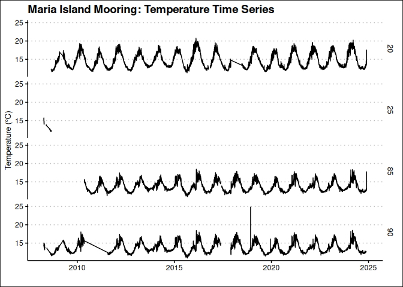
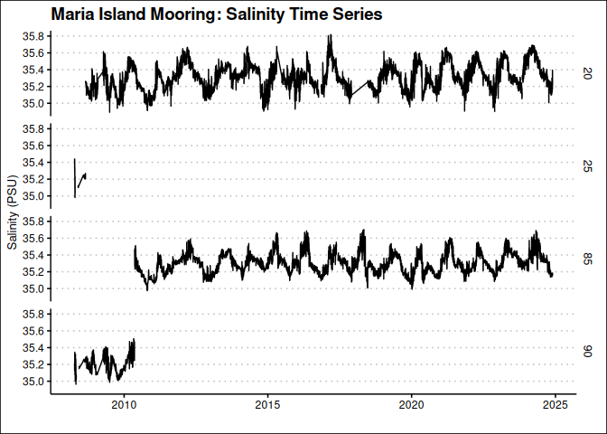
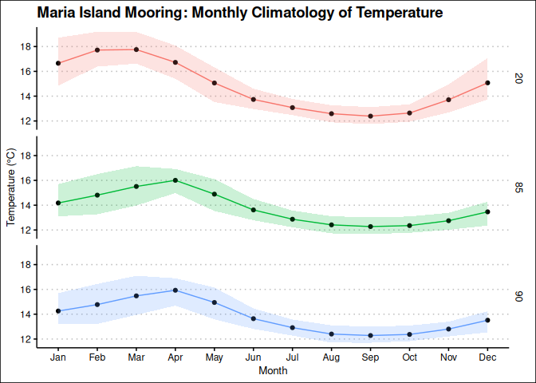
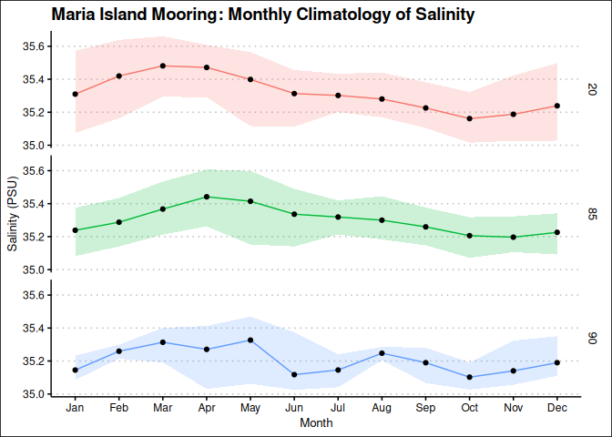
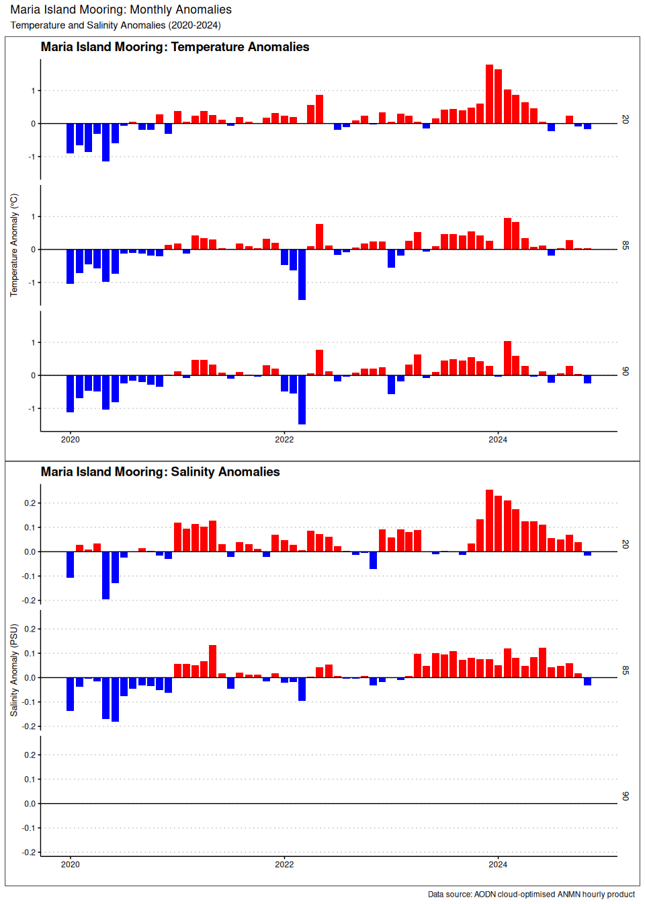

Last updated: 2025-06-20

## Goal

This notebook shows how to extract and plot a temperature and salinity times series from the Maria Island mooring. We will use AODN cloud-optimised ANMN hourly product, which is delivered as a Parquet file. This file is partitioned and sorted by `site_code`, `timestap` (3 months range), and `polygon` which is a cell that contains the data.

## Load packages
We will need `arrow`, `dplyr` and `ggplot2` plus `lubridate` to manage time.


``` r
## load libraries, suppress warnings and messages
suppressPackageStartupMessages({
  library(arrow)
  library(dplyr)
  library(ggplot2)
  library(lubridate)
  library(ggthemes)
  library(kableExtra)
  library(leaflet)
  library(patchwork)
})
```

## Load data

First we need to create a connection with the cloud-optimise data store. We will use the `arrow` package to read the Parquet file. The mooring hourly time-series data is located in `s3://aodn-cloud-optimised/mooring_hourly_timeseries_delayed_qc.parquet/`


``` r
# Create a connection to the cloud-optimised data store
uri <- "s3://aodn-cloud-optimised/mooring_hourly_timeseries_delayed_qc.parquet/"
## the s3_bucket function will automatically detect the region, but we can also specify it
bucket <- s3_bucket(uri, anonymous=TRUE, region="ap-southeast-2")

# Read the Parquet file
df <- open_dataset(bucket)
```


This dataset contains more than 54 million lines of hourly measurements in 96 columns and it is partitioned into more than 2700 individual files. Below are the columns in the dataset. You should be able to identify the variables of interest, such as `TEMP` for temperature and `PSAL` for salinity. The time variable is `TIME`, and the actual depth is indicated by `DEPTH` and the target depth is `NOMINAL_DEPTH`. The mooring site is identified by `site_code`. This product is an aggregation of the IMOS mooring data, which is collected by the [Australian National Mooring Network (ANMN)](https://imos.org.au/facility/national-mooring-network) and has 84 locations. The instruments are programmed to collect data at different frequencies, but the data is aggregated to an hourly frequency. The data is also quality controlled and delayed, which means that the data is not available in real-time, but is available after a certain period of time.


``` r
print(df$schema)
```

```
## Schema
## instrument_index: int32
## instrument_id: string
## source_file: string
## TIME: timestamp[ns]
## LONGITUDE: double
## LATITUDE: double
## NOMINAL_DEPTH: float
## DEPTH: float
## DEPTH_count: float
## DEPTH_min: float
## DEPTH_max: float
## DEPTH_std: float
## PRES: float
## PRES_REL: float
## PRES_REL_count: float
## PRES_REL_max: float
## PRES_REL_min: float
## PRES_REL_std: float
## PRES_count: float
## PRES_max: float
## PRES_min: float
## PRES_std: float
## TEMP: float
## TEMP_count: float
## TEMP_max: float
## TEMP_min: float
## TEMP_std: float
## PSAL: float
## PSAL_count: float
## PSAL_max: float
## PSAL_min: float
## PSAL_std: float
## filename: string
## TURB: float
## TURB_count: float
## TURB_max: float
## TURB_min: float
## TURB_std: float
## CHLF: float
## CHLF_count: float
## CHLF_max: float
## CHLF_min: float
## CHLF_std: float
## CHLU: float
## CHLU_count: float
## CHLU_max: float
## CHLU_min: float
## CHLU_std: float
## CPHL: float
## CPHL_count: float
## CPHL_max: float
## CPHL_min: float
## CPHL_std: float
## DOX: float
## DOX_min: float
## DOX_max: float
## DOX_std: float
## DOX_count: float
## DOX1: float
## DOX1_count: float
## DOX1_max: float
## DOX1_min: float
## DOX1_std: float
## DOX1_2: float
## DOX1_2_min: float
## DOX1_2_max: float
## DOX1_2_std: float
## DOX1_2_count: float
## DOX2: float
## DOX2_min: float
## DOX2_max: float
## DOX2_count: float
## DOX2_std: float
## DOX1_3: float
## DOX1_3_min: float
## DOX1_3_max: float
## DOX1_3_count: float
## DOX1_3_std: float
## DOXY: float
## DOXY_std: float
## DOXY_min: float
## DOXY_max: float
## DOXY_count: float
## DOXS: float
## DOXS_std: float
## DOXS_min: float
## DOXS_max: float
## DOXS_count: float
## PAR: float
## PAR_std: float
## PAR_min: float
## PAR_max: float
## PAR_count: float
## site_code: string
## timestamp: int32
## polygon: string
```

## Mooring Locations

Let's make a map showing the locations of the moorings. Red markers indicate the National Reference Stations. This map is created using an external file that contains the mooring locations. The file was generated from the cloud-optimised product but the code is not including here as it will take long time to run. The file is available in the same directory as this notebook and is called `ANMNlocations.csv`. 


``` r
# Load the mooring locations
mooring_locations <- read.csv("ANMNlocations.csv", stringsAsFactors = FALSE)
mooring_locations$NRSsize <- ifelse(mooring_locations$NRS == FALSE, 7, 12)
mooring_locations$NRScolour <- ifelse(mooring_locations$Active == TRUE, "#5e3c99", "#b2abd2")
mooring_locations$NRScolour <- ifelse(mooring_locations$NRS == TRUE, "#e66101", mooring_locations$NRScolour)

## Map the mooring locations using leaflet. Color the markers by NRS field
m <- leaflet(mooring_locations) |>
  addTiles() |>
  addCircleMarkers(lng = ~lon, lat = ~lat,
                   radius = ~NRSsize, 
                   fillColor = ~NRScolour, 
                   fillOpacity = 0.8, 
                   stroke = TRUE,
                   weight = 1.5,
                   color = "black",
                   label = ~paste(site_name, "-", site_code, " ", yearMin, " - ", yearMax),
                   labelOptions = labelOptions(noHide = FALSE, direction = "top")) |> 
  ## add legend
  addLegend("bottomleft", 
            colors = c("#e66101", "#5e3c99", "#b2abd2"), 
            labels = c("National Reference Station", "Active Mooring", "Inactive Mooring"),
            title = "Mooring Type",
            opacity = 0.7) 

m
```

```{=html}
<div class="leaflet html-widget html-fill-item" id="htmlwidget-5ca8e8c3a2872b99cc00" style="width:672px;height:480px;"></div>
<script type="application/json" data-for="htmlwidget-5ca8e8c3a2872b99cc00">{"x":{"options":{"crs":{"crsClass":"L.CRS.EPSG3857","code":null,"proj4def":null,"projectedBounds":null,"options":{}}},"calls":[{"method":"addTiles","args":["https://{s}.tile.openstreetmap.org/{z}/{x}/{y}.png",null,null,{"minZoom":0,"maxZoom":18,"tileSize":256,"subdomains":"abc","errorTileUrl":"","tms":false,"noWrap":false,"zoomOffset":0,"zoomReverse":false,"opacity":1,"zIndex":1,"detectRetina":false,"attribution":"&copy; <a href=\"https://openstreetmap.org/copyright/\">OpenStreetMap<\/a>,  <a href=\"https://opendatacommons.org/licenses/odbl/\">ODbL<\/a>"}]},{"method":"addCircleMarkers","args":[[-36.1906712,-36.19009093,-36.20585309,-14.85037859,-14.31487107,-30.31040989,-30.27361398,-30.26665139,-12.10780152,-27.32795179,-27.3126,-27.31393044,-27.28363929,-27.24425202,-27.2073152,-27.10488562,-22.40305779,-21.02259777,-23.38159208,-23.5132984,-14.70248699,-14.33987366,-18.21947399,-23.48292719,-18.3087182,-12.28997678,-13.60855362,-11.00009037,-8.528942103,-8.857720994999999,-9.817862471,-9.001899999999999,-9.274152695,-35.07666667,-16.38794857,-15.67348786,-15.53463744,-15.22124724,-12.34206868,-33.93247228,-35.83713429,-42.59749192,-21.8672856,-27.34219686,-31.99310877,-19.30246886,-20.76071731,-14.23546422,-9.938065417000001,-17.75854331,-33.89450494,-31.88553288,-38.53976155,-32.31159203,-34.1196536,-20.05461902,-19.69429745,-19.43549979,-36.51586594,-35.27289307,-36.14565383,-36.52334094,-34.92796536,-35.49918333,-36.18263078,-35.24945206,-33.11102233,-27.33998333,-27.33185,-32.45753817,-32.48012644,-33.94254246,-33.99540967,-21.84994433,-38.40860399,-31.98340519,-31.93281667,-32.08463976,-31.7174322,-31.62658608,-31.6457212,-31.68856764,-31.72755415,-31.76841896],[150.1892948,150.2333512,150.3151557,123.8027014,123.5956437,153.2285647,153.2987944,153.3947308,130.5870294,153.8992557,153.969,153.9995998,154.1351027,154.2929388,154.6448646,155.2973102,151.9881703,152.8145922,151.9871126,151.9552961,145.6369411,145.3034396,147.3455446,152.1728261,147.165542,128.4771819,128.9665793,128.0001992,125.0800169,127.1951632,127.5542381,127.2538,127.3597157,150.8478,121.5882956,121.3020928,121.2431082,121.1152245,130.7100554,121.8501846,136.4466497,148.2333225,113.9474805,153.5618708,115.393581,147.6208144,114.7570044,123.1634636,130.3493088,119.9059366,151.31473,115.0079236,141.2314594,152.923058,151.2245376,116.4160281,116.1116386,115.915315,136.2429354,135.6799347,135.9029688,136.8619556,135.0086717,136.60115,135.8462275,136.6904559,137.7083385,153.7747833,153.8765333,152.54906,152.5685207,151.3821902,151.4508793,113.9067452,141.2708689,115.2284286,115.0111167,115.0714369,115.39993,115.2454978,115.1999289,115.125059,115.0394966,114.9596322],[7,7,7,7,7,7,7,7,7,7,7,7,7,7,7,7,7,7,7,7,7,7,7,7,7,7,7,7,7,7,7,7,7,7,7,7,7,7,12,7,12,12,7,12,12,12,7,7,7,7,7,7,7,7,12,7,7,7,7,7,7,7,7,7,7,7,7,7,7,7,7,7,7,7,12,7,7,7,7,7,7,7,7,7],null,null,{"interactive":true,"className":"","stroke":true,"color":"black","weight":1.5,"opacity":0.5,"fill":true,"fillColor":["#5e3c99","#b2abd2","#5e3c99","#b2abd2","#b2abd2","#5e3c99","#5e3c99","#5e3c99","#b2abd2","#b2abd2","#b2abd2","#b2abd2","#b2abd2","#b2abd2","#b2abd2","#b2abd2","#5e3c99","#b2abd2","#b2abd2","#5e3c99","#b2abd2","#5e3c99","#5e3c99","#5e3c99","#5e3c99","#b2abd2","#b2abd2","#b2abd2","#b2abd2","#b2abd2","#b2abd2","#b2abd2","#b2abd2","#b2abd2","#b2abd2","#b2abd2","#b2abd2","#b2abd2","#e66101","#b2abd2","#e66101","#e66101","#b2abd2","#e66101","#e66101","#e66101","#5e3c99","#5e3c99","#5e3c99","#5e3c99","#5e3c99","#b2abd2","#b2abd2","#b2abd2","#e66101","#b2abd2","#b2abd2","#b2abd2","#b2abd2","#b2abd2","#b2abd2","#b2abd2","#5e3c99","#b2abd2","#b2abd2","#5e3c99","#5e3c99","#b2abd2","#b2abd2","#b2abd2","#b2abd2","#5e3c99","#5e3c99","#b2abd2","#e66101","#5e3c99","#b2abd2","#b2abd2","#b2abd2","#b2abd2","#5e3c99","#b2abd2","#5e3c99","#5e3c99"],"fillOpacity":0.8},null,null,null,null,["Bateman's Marine Park 70m Mooring - BMP070   2014  -  2024","Bateman's Marine Park 90m Mooring - BMP090   2011  -  2015","Bateman's Marine Park 120m Mooring - BMP120   2011  -  2024","Camden Sound 50m Mooring - CAM050   2014  -  2015","Camden Sound 100m Mooring - CAM100   2014  -  2015","Coffs Harbour 50m Mooring - CH050   2016  -  2024","Coffs Harbour 70m Mooring - CH070   2009  -  2024","Coffs Harbour 100m Mooring - CH100   2009  -  2024","Beagle Gulf Mooring - DARBGF   2013  -  2017","East Australian Current (EAC) Deep Water mooring - EAC0500   2015  -  2022","East Australian Current (EAC) Deep Water mooring - EAC1520   2012  -  2013","East Australian Current (EAC) Deep Water mooring - EAC2000   2012  -  2022","East Australian Current (EAC) Deep Water mooring - EAC3200   2015  -  2022","East Australian Current (EAC) Deep Water mooring - EAC4200   2012  -  2022","East Australian Current (EAC) Deep Water mooring - EAC4700   2012  -  2022","East Australian Current (EAC) Deep Water mooring - EAC4800   2012  -  2022","Capricorn Channel Mooring - GBRCCH   2007  -  2024","Elusive Reef Mooring - GBRELR   2007  -  2014","Heron Island North mooring - GBRHIN   2007  -  2013","Heron Island South Mooring - GBRHIS   2007  -  2024","Lizard Shelf Mooring - GBRLSH   2008  -  2014","Lizard Slope Mooring - GBRLSL   2007  -  2024","Myrmidon Mooring - GBRMYR   2007  -  2024","One Tree East Mooring - GBROTE   2007  -  2024","Palm Passage Mooring - GBRPPS   2007  -  2024","Flat Top Banks Shelf Mooring - ITFFTB   2010  -  2019","Joseph Bonaparte Gulf Shelf Mooring - ITFJBG   2010  -  2019","Margaret Harries Banks Shelf Mooring - ITFMHB   2010  -  2019","Indonesian Throughflow array, Ombai  Mooring - ITFOMB   2011  -  2015","Timor North Mooring - ITFTIN   2011  -  2014","Timor South Shelf Mooring - ITFTIS   2010  -  2019","Mooring - ITFTNS   2014  -  2015","Indonesian Throughflow array Timor Sill - ITFTSL   2011  -  2015","Jervis Bay Mooring - JB070   2009  -  2009","Kimberley 50m Mooring - KIM050   2011  -  2014","Kimberley 100m Mooring - KIM100   2012  -  2014","Kimberley 200m Mooring - KIM200   2012  -  2014","Kimberley 400m Mooring - KIM400   2012  -  2014","Darwin National Reference Station - NRSDAR   2009  -  2024","Esperance National Reference Station  - NRSESP   2008  -  2013","Kangaroo Island National Reference Station  - NRSKAI   2008  -  2024","Maria Island National Reference Station  - NRSMAI   2008  -  2024","Ningaloo Reef National Reference Station - NRSNIN   2010  -  2014","North Stradbroke Island National Reference Station - NRSNSI   2010  -  2024","Rottnest Island National Reference Station - NRSROT   2008  -  2024","Yongala National Reference Station - NRSYON   2008  -  2024","Barrow Island Mooring - NWSBAR   2019  -  2024","Browse Island Mooring - NWSBRW   2019  -  2024","Lynedoch Shoal Mooring - NWSLYN   2019  -  2024","Rowley Shoals Mooring - NWSROW   2019  -  2024","Ocean Reference Station Sydney Mooring - ORS065   2006  -  2024","Perth Canyon, WA Passive Acoustic Observatory - PAPCA   2010  -  2017","Portland, VIC Passive Acoustic Observatory - PAPOR   2010  -  2017","Tuncurry, NSW Passive Acoustic Observatory - PATUN   2010  -  2015","Port Hacking 100m Mooring - PH100   2009  -  2024","Pilbara 50m Mooring - PIL050   2012  -  2014","Pilbara 100m Mooring - PIL100   2012  -  2014","Pilbara 200m Mooring - PIL200   2012  -  2014","Deep Slope Mooring (M1) - SAM1DS   2008  -  2009","Cabbage Patch Mooring (M2) - SAM2CP   2008  -  2010","Mid-Slope Mooring (M3) - SAM3MS   2011  -  2013","Canyon Mooring (M4) - SAM4CY   2009  -  2010","Coffin Bay Mooring (M5) - SAM5CB   2009  -  2024","Investigator Strait Mooring (M6) - SAM6IS   2009  -  2009","Deep-Slope Mooring (M7) - SAM7DS   2009  -  2014","Spencer Gulf Mouth Mooring (M8) - SAM8SG   2009  -  2024","Upper Spencer Gulf Mooring - SAMUSG   2019  -  2024","South-East Queensland 200m Mooring - SEQ200   2012  -  2013","South-East Queensland 400m Mooring - SEQ400   2012  -  2013","Seal Rocks Line (SRL2) Mooring - SR030   2020  -  2023","Seal Rocks Line (SRL5) Mooring - SR050   2020  -  2023","Sydney 100m Mooring - SYD100   2008  -  2024","Sydney 140m Mooring - SYD140   2008  -  2024","Tantabiddi Mooring - TAN100   2010  -  2024","Bonney Coast Mooring - VBM100   2019  -  2023","Canyon 200m Head Mooring - WACA20   2010  -  2024","Canyon 500m North Mooring - WACANO   2010  -  2010","Canyon 500m South Mooring - WACASO   2010  -  2014","Two Rocks 44m Mooring - WATR04   2013  -  2019","Two Rocks 50m Shelf Mooring - WATR05   2009  -  2013","Two Rocks 100m Shelf Mooring - WATR10   2009  -  2024","Two Rocks 150m Shelf Mooring - WATR15   2009  -  2013","Two Rocks 200m Shelf Mooring - WATR20   2009  -  2025","Two Rocks 500m Shelf Mooring - WATR50   2009  -  2025"],{"interactive":false,"permanent":false,"direction":"top","opacity":1,"offset":[0,0],"textsize":"10px","textOnly":false,"className":"","sticky":true},null]},{"method":"addLegend","args":[{"colors":["#e66101","#5e3c99","#b2abd2"],"labels":["National Reference Station","Active Mooring","Inactive Mooring"],"na_color":null,"na_label":"NA","opacity":0.7,"position":"bottomleft","type":"unknown","title":"Mooring Type","extra":null,"layerId":null,"className":"info legend","group":null}]}],"limits":{"lat":[-42.59749192,-8.528942103],"lng":[113.9067452,155.2973102]}},"evals":[],"jsHooks":[]}</script>
```

``` r
## save widget
#library(htmlwidgets)
#saveWidget(m, "mooring_locations.html", selfcontained = TRUE, title = "IMOS Mooring Locations")
```


## Get Maria Island data


As mentioned at the beginning, this dataset has `site_code` as a primary sort key. Using `filter()` we can select the data for Maria Island mooring, which has `site_code = "NRSMAI"`. These are the variables in the extracted table.


``` r
# Filter the dataset for Maria Island mooring
maria_data <- df |>
  filter(site_code == "NRSMAI") |>
  collect()  # Collect the data into a local data frame

# Check the first few rows of the data
glimpse(maria_data)
```

```
## Rows: 389,874
## Columns: 96
## $ instrument_index <int> 0, 0, 0, 0, 0, 0, 0, 0, 0, 0, 0, 0, 0, 0, 0, 0, 0, 0,…
## $ instrument_id    <chr> "NRSMAI-SubSurface-01-2008-04; WET Labs WQM; 041", "N…
## $ source_file      <chr> "IMOS/ANMN/NRS/NRSMAI/Biogeochem_timeseries/IMOS_ANMN…
## $ TIME             <dttm> 2008-04-11 21:00:00, 2008-04-11 22:00:00, 2008-04-11…
## $ LONGITUDE        <dbl> 148.2328, 148.2328, 148.2328, 148.2328, 148.2328, 148…
## $ LATITUDE         <dbl> -42.59568, -42.59568, -42.59568, -42.59568, -42.59568…
## $ NOMINAL_DEPTH    <dbl> 25, 25, 25, 25, 25, 25, 25, 25, 25, 25, 25, 25, 25, 2…
## $ DEPTH            <dbl> 18.49087, 18.60412, 18.70247, 18.72992, 18.69934, 18.…
## $ DEPTH_count      <dbl> 482, 964, 964, 964, 964, 964, 964, 964, 964, 964, 964…
## $ DEPTH_min        <dbl> 18.16462, 18.24398, 18.24398, 18.42254, 18.38286, 18.…
## $ DEPTH_max        <dbl> 18.82927, 19.07727, 19.13679, 19.11695, 19.03759, 18.…
## $ DEPTH_std        <dbl> 0.11214975, 0.12092077, 0.13310614, 0.11044005, 0.120…
## $ PRES             <dbl> NA, NA, NA, NA, NA, NA, NA, NA, NA, NA, NA, NA, NA, N…
## $ PRES_REL         <dbl> 18.63888, 18.75304, 18.85219, 18.87985, 18.84903, 18.…
## $ PRES_REL_count   <dbl> 482, 964, 964, 964, 964, 964, 964, 964, 964, 964, 964…
## $ PRES_REL_max     <dbl> 18.98, 19.23, 19.29, 19.27, 19.19, 19.15, 19.10, 19.0…
## $ PRES_REL_min     <dbl> 18.31, 18.39, 18.39, 18.57, 18.53, 18.35, 18.31, 18.2…
## $ PRES_REL_std     <dbl> 0.11305245, 0.12189400, 0.13417757, 0.11132905, 0.121…
## $ PRES_count       <dbl> NA, NA, NA, NA, NA, NA, NA, NA, NA, NA, NA, NA, NA, N…
## $ PRES_max         <dbl> NA, NA, NA, NA, NA, NA, NA, NA, NA, NA, NA, NA, NA, N…
## $ PRES_min         <dbl> NA, NA, NA, NA, NA, NA, NA, NA, NA, NA, NA, NA, NA, N…
## $ PRES_std         <dbl> NA, NA, NA, NA, NA, NA, NA, NA, NA, NA, NA, NA, NA, N…
## $ TEMP             <dbl> 15.61581, 15.64947, 15.64951, 15.62048, 15.60723, 15.…
## $ TEMP_count       <dbl> 482, 964, 964, 964, 964, 964, 964, 964, 964, 964, 964…
## $ TEMP_max         <dbl> 15.6339, 15.6720, 15.6634, 15.6380, 15.6764, 15.6334,…
## $ TEMP_min         <dbl> 15.5981, 15.6313, 15.6429, 15.5902, 15.5568, 15.5526,…
## $ TEMP_std         <dbl> 0.011598652, 0.013329989, 0.004558405, 0.015511190, 0…
## $ PSAL             <dbl> 35.43242, 35.43926, 35.43855, 35.43264, 35.42411, 35.…
## $ PSAL_count       <dbl> 482, 964, 964, 964, 964, 964, 964, 964, 964, 964, 964…
## $ PSAL_max         <dbl> 35.437, 35.445, 35.442, 35.438, 35.439, 35.430, 35.41…
## $ PSAL_min         <dbl> 35.416, 35.432, 35.433, 35.424, 35.415, 35.407, 35.38…
## $ PSAL_std         <dbl> 0.002756679, 0.003112622, 0.001025148, 0.003971767, 0…
## $ filename         <chr> "IMOS_ANMN-NRS_BOSTUZ_20080411_NRSMAI_FV02_hourly-tim…
## $ TURB             <dbl> NA, NA, NA, NA, NA, NA, NA, NA, NA, NA, NA, NA, NA, N…
## $ TURB_count       <dbl> 0, 0, 0, 0, 0, 0, 0, 0, 0, 0, 0, 0, 0, 0, 0, 0, 0, 0,…
## $ TURB_max         <dbl> NA, NA, NA, NA, NA, NA, NA, NA, NA, NA, NA, NA, NA, N…
## $ TURB_min         <dbl> NA, NA, NA, NA, NA, NA, NA, NA, NA, NA, NA, NA, NA, N…
## $ TURB_std         <dbl> NA, NA, NA, NA, NA, NA, NA, NA, NA, NA, NA, NA, NA, N…
## $ CHLF             <dbl> NA, NA, NA, NA, NA, NA, NA, NA, NA, NA, NA, NA, NA, N…
## $ CHLF_count       <dbl> NA, NA, NA, NA, NA, NA, NA, NA, NA, NA, NA, NA, NA, N…
## $ CHLF_max         <dbl> NA, NA, NA, NA, NA, NA, NA, NA, NA, NA, NA, NA, NA, N…
## $ CHLF_min         <dbl> NA, NA, NA, NA, NA, NA, NA, NA, NA, NA, NA, NA, NA, N…
## $ CHLF_std         <dbl> NA, NA, NA, NA, NA, NA, NA, NA, NA, NA, NA, NA, NA, N…
## $ CHLU             <dbl> NA, NA, NA, NA, NA, NA, NA, NA, NA, NA, NA, NA, NA, N…
## $ CHLU_count       <dbl> NA, NA, NA, NA, NA, NA, NA, NA, NA, NA, NA, NA, NA, N…
## $ CHLU_max         <dbl> NA, NA, NA, NA, NA, NA, NA, NA, NA, NA, NA, NA, NA, N…
## $ CHLU_min         <dbl> NA, NA, NA, NA, NA, NA, NA, NA, NA, NA, NA, NA, NA, N…
## $ CHLU_std         <dbl> NA, NA, NA, NA, NA, NA, NA, NA, NA, NA, NA, NA, NA, N…
## $ CPHL             <dbl> NA, NA, NA, NA, NA, NA, NA, NA, NA, NA, NA, NA, NA, N…
## $ CPHL_count       <dbl> 0, 0, 0, 0, 0, 0, 0, 0, 0, 0, 0, 0, 0, 0, 0, 0, 0, 0,…
## $ CPHL_max         <dbl> NA, NA, NA, NA, NA, NA, NA, NA, NA, NA, NA, NA, NA, N…
## $ CPHL_min         <dbl> NA, NA, NA, NA, NA, NA, NA, NA, NA, NA, NA, NA, NA, N…
## $ CPHL_std         <dbl> NA, NA, NA, NA, NA, NA, NA, NA, NA, NA, NA, NA, NA, N…
## $ DOX              <dbl> NA, NA, NA, NA, NA, NA, NA, NA, NA, NA, NA, NA, NA, N…
## $ DOX_min          <dbl> NA, NA, NA, NA, NA, NA, NA, NA, NA, NA, NA, NA, NA, N…
## $ DOX_max          <dbl> NA, NA, NA, NA, NA, NA, NA, NA, NA, NA, NA, NA, NA, N…
## $ DOX_std          <dbl> NA, NA, NA, NA, NA, NA, NA, NA, NA, NA, NA, NA, NA, N…
## $ DOX_count        <dbl> NA, NA, NA, NA, NA, NA, NA, NA, NA, NA, NA, NA, NA, N…
## $ DOX1             <dbl> NA, NA, NA, NA, NA, NA, NA, NA, NA, NA, NA, NA, NA, N…
## $ DOX1_count       <dbl> 0, 0, 0, 0, 0, 0, 0, 0, 0, 0, 0, 0, 0, 0, 0, 0, 0, 0,…
## $ DOX1_max         <dbl> NA, NA, NA, NA, NA, NA, NA, NA, NA, NA, NA, NA, NA, N…
## $ DOX1_min         <dbl> NA, NA, NA, NA, NA, NA, NA, NA, NA, NA, NA, NA, NA, N…
## $ DOX1_std         <dbl> NA, NA, NA, NA, NA, NA, NA, NA, NA, NA, NA, NA, NA, N…
## $ DOX1_2           <dbl> NA, NA, NA, NA, NA, NA, NA, NA, NA, NA, NA, NA, NA, N…
## $ DOX1_2_min       <dbl> NA, NA, NA, NA, NA, NA, NA, NA, NA, NA, NA, NA, NA, N…
## $ DOX1_2_max       <dbl> NA, NA, NA, NA, NA, NA, NA, NA, NA, NA, NA, NA, NA, N…
## $ DOX1_2_std       <dbl> NA, NA, NA, NA, NA, NA, NA, NA, NA, NA, NA, NA, NA, N…
## $ DOX1_2_count     <dbl> NA, NA, NA, NA, NA, NA, NA, NA, NA, NA, NA, NA, NA, N…
## $ DOX2             <dbl> NA, NA, NA, NA, NA, NA, NA, NA, NA, NA, NA, NA, NA, N…
## $ DOX2_min         <dbl> NA, NA, NA, NA, NA, NA, NA, NA, NA, NA, NA, NA, NA, N…
## $ DOX2_max         <dbl> NA, NA, NA, NA, NA, NA, NA, NA, NA, NA, NA, NA, NA, N…
## $ DOX2_count       <dbl> NA, NA, NA, NA, NA, NA, NA, NA, NA, NA, NA, NA, NA, N…
## $ DOX2_std         <dbl> NA, NA, NA, NA, NA, NA, NA, NA, NA, NA, NA, NA, NA, N…
## $ DOX1_3           <dbl> NA, NA, NA, NA, NA, NA, NA, NA, NA, NA, NA, NA, NA, N…
## $ DOX1_3_min       <dbl> NA, NA, NA, NA, NA, NA, NA, NA, NA, NA, NA, NA, NA, N…
## $ DOX1_3_max       <dbl> NA, NA, NA, NA, NA, NA, NA, NA, NA, NA, NA, NA, NA, N…
## $ DOX1_3_count     <dbl> NA, NA, NA, NA, NA, NA, NA, NA, NA, NA, NA, NA, NA, N…
## $ DOX1_3_std       <dbl> NA, NA, NA, NA, NA, NA, NA, NA, NA, NA, NA, NA, NA, N…
## $ DOXY             <dbl> NA, NA, NA, NA, NA, NA, NA, NA, NA, NA, NA, NA, NA, N…
## $ DOXY_std         <dbl> NA, NA, NA, NA, NA, NA, NA, NA, NA, NA, NA, NA, NA, N…
## $ DOXY_min         <dbl> NA, NA, NA, NA, NA, NA, NA, NA, NA, NA, NA, NA, NA, N…
## $ DOXY_max         <dbl> NA, NA, NA, NA, NA, NA, NA, NA, NA, NA, NA, NA, NA, N…
## $ DOXY_count       <dbl> NA, NA, NA, NA, NA, NA, NA, NA, NA, NA, NA, NA, NA, N…
## $ DOXS             <dbl> NA, NA, NA, NA, NA, NA, NA, NA, NA, NA, NA, NA, NA, N…
## $ DOXS_std         <dbl> NA, NA, NA, NA, NA, NA, NA, NA, NA, NA, NA, NA, NA, N…
## $ DOXS_min         <dbl> NA, NA, NA, NA, NA, NA, NA, NA, NA, NA, NA, NA, NA, N…
## $ DOXS_max         <dbl> NA, NA, NA, NA, NA, NA, NA, NA, NA, NA, NA, NA, NA, N…
## $ DOXS_count       <dbl> NA, NA, NA, NA, NA, NA, NA, NA, NA, NA, NA, NA, NA, N…
## $ PAR              <dbl> NA, NA, NA, NA, NA, NA, NA, NA, NA, NA, NA, NA, NA, N…
## $ PAR_std          <dbl> NA, NA, NA, NA, NA, NA, NA, NA, NA, NA, NA, NA, NA, N…
## $ PAR_min          <dbl> NA, NA, NA, NA, NA, NA, NA, NA, NA, NA, NA, NA, NA, N…
## $ PAR_max          <dbl> NA, NA, NA, NA, NA, NA, NA, NA, NA, NA, NA, NA, NA, N…
## $ PAR_count        <dbl> NA, NA, NA, NA, NA, NA, NA, NA, NA, NA, NA, NA, NA, N…
## $ site_code        <chr> "NRSMAI", "NRSMAI", "NRSMAI", "NRSMAI", "NRSMAI", "NR…
## $ timestamp        <int> 1207008000, 1207008000, 1207008000, 1207008000, 12070…
## $ polygon          <chr> "0103000000010000000500000000000000008061400000000000…
```

Now, we have the data locally in our machine. Note that there are multiple variables, not all are available for this station. The main time indicator is the variable `TIME`.

## Location of the mooring

We can plot the location of the Maria Island mooring using `leaflet`. The mooring coordinates are in the `LATITUDE` and `LONGITUDE` columns. We will use the `leaflet` package to create an interactive map. Note that coordinates may vary slightly depending on the deployment, but they are generally around the same location. We will take the average location for the map.


``` r
# Calculate the average location of the mooring
avg_location <- maria_data |>
  summarise(lat = mean(LATITUDE, na.rm = TRUE),
            lon = mean(LONGITUDE, na.rm = TRUE))
# Create a leaflet map
leaflet(avg_location) |>
  addTiles() |>
  addCircleMarkers(lng = ~lon, lat = ~lat,
                   radius = 10, 
                   fillColor = "red", 
                   fillOpacity = 0.5, 
                   stroke = FALSE,
                   label = ~paste("Maria Island Mooring (NRSMAI)"),
                   labelOptions = labelOptions(noHide = FALSE, direction = "top")) |>
  setView(lng = avg_location$lon, lat = avg_location$lat, zoom = 7) 
```

```{=html}
<div class="leaflet html-widget html-fill-item" id="htmlwidget-036b561e5ac61455e845" style="width:672px;height:480px;"></div>
<script type="application/json" data-for="htmlwidget-036b561e5ac61455e845">{"x":{"options":{"crs":{"crsClass":"L.CRS.EPSG3857","code":null,"proj4def":null,"projectedBounds":null,"options":{}}},"calls":[{"method":"addTiles","args":["https://{s}.tile.openstreetmap.org/{z}/{x}/{y}.png",null,null,{"minZoom":0,"maxZoom":18,"tileSize":256,"subdomains":"abc","errorTileUrl":"","tms":false,"noWrap":false,"zoomOffset":0,"zoomReverse":false,"opacity":1,"zIndex":1,"detectRetina":false,"attribution":"&copy; <a href=\"https://openstreetmap.org/copyright/\">OpenStreetMap<\/a>,  <a href=\"https://opendatacommons.org/licenses/odbl/\">ODbL<\/a>"}]},{"method":"addCircleMarkers","args":[-42.59749191618784,148.233322501902,10,null,null,{"interactive":true,"className":"","stroke":false,"color":"#03F","weight":5,"opacity":0.5,"fill":true,"fillColor":"red","fillOpacity":0.5},null,null,null,null,"Maria Island Mooring (NRSMAI)",{"interactive":false,"permanent":false,"direction":"top","opacity":1,"offset":[0,0],"textsize":"10px","textOnly":false,"className":"","sticky":true},null]}],"limits":{"lat":[-42.59749191618784,-42.59749191618784],"lng":[148.233322501902,148.233322501902]},"setView":[[-42.59749191618784,148.233322501902],7,[]]},"evals":[],"jsHooks":[]}</script>
```


## Plot temperature and salinity time series

We will plot the temperature and salinity time series using `ggplot2`. Note that the mooring array has instrument depployed at different depths. With every deployment the target depth could change. The indicator of the target depth is `NOMINAL_DEPTH`. We will use the `NOMINAL_DEPTH`.

Let's explore the data a bit more to see the available depths and how many data point we have for each depth.


``` r
# Check the available depths and number of data points for each depth
depth_summary <- maria_data |>
  group_by(NOMINAL_DEPTH) |>
  summarise(count = n(), .groups = 'drop') |>
  arrange(NOMINAL_DEPTH)

## Print a nice formatted table
kbl(depth_summary) |> 
  kable_styling(full_width = F, bootstrap_options = c("striped", "hover"))
```

<table class="table table-striped table-hover" style="color: black; width: auto !important; margin-left: auto; margin-right: auto;">
 <thead>
  <tr>
   <th style="text-align:right;"> NOMINAL_DEPTH </th>
   <th style="text-align:right;"> count </th>
  </tr>
 </thead>
<tbody>
  <tr>
   <td style="text-align:right;"> 20 </td>
   <td style="text-align:right;"> 133500 </td>
  </tr>
  <tr>
   <td style="text-align:right;"> 25 </td>
   <td style="text-align:right;"> 1834 </td>
  </tr>
  <tr>
   <td style="text-align:right;"> 85 </td>
   <td style="text-align:right;"> 127158 </td>
  </tr>
  <tr>
   <td style="text-align:right;"> 90 </td>
   <td style="text-align:right;"> 127382 </td>
  </tr>
</tbody>
</table>

Now we can plot the temperature and salinity time series for each depth. We will create separate plots for each depth.

Temperature time series: 


``` r
# Plot temperature time series for each depth
ggplot(maria_data, aes(x = TIME, y = TEMP)) +
  geom_line() +
  facet_grid(NOMINAL_DEPTH~.) +
  labs(title = "Maria Island Mooring: Temperature Time Series",
       x = "",
       y = "Temperature (°C)") +
  theme_clean() +
  theme(legend.position = "none")
```

<!-- -->

Salinity time series:  


``` r
# Plot salinity time series for each depth
ggplot(maria_data, aes(x = TIME, y = PSAL)) +
  geom_line() +
  facet_grid(NOMINAL_DEPTH~.) +
  labs(title = "Maria Island Mooring: Salinity Time Series",
       x = "",
       y = "Salinity (PSU)") +
  theme_clean() +
  theme(legend.position = "none")
```

<!-- -->

## Monthly climatology

We can also calculate the monthly climatology for temperature and salinity. We will use `lubridate` to extract the month from the `TIME` variable and then calculate the mean for each month. We will remove the depth of 25m as it only has a few months of data, which may skew the results. We will calculate the mean, min, max, and 0.95 and 0.05 quantiles for each month and depth.


``` r
# Extract month from TIME and calculate monthly climatology
# Remove DEPTH == 25 as it only has few months
monthly_climatology <- maria_data |>
  filter(NOMINAL_DEPTH != 25) |>
  mutate(month = month(TIME)) |>
  group_by(month, NOMINAL_DEPTH) |>
  summarise(TEMPmean = mean(TEMP, na.rm = TRUE),
            TEMPmin = min(TEMP, na.rm = TRUE),
            TEMPmax = max(TEMP, na.rm = TRUE),
            TEMP95 = quantile(TEMP, 0.95, na.rm = TRUE),
            TEMP05 = quantile(TEMP, 0.05, na.rm = TRUE),
            PSALmean = mean(PSAL, na.rm = TRUE),
            PSALmin = min(PSAL, na.rm = TRUE),
            PSALmax = max(PSAL, na.rm = TRUE),
            PSAL95 = quantile(PSAL, 0.95, na.rm = TRUE),
            PSAL05 = quantile(PSAL, 0.05, na.rm = TRUE),
            .groups = 'drop') |> 
  arrange(NOMINAL_DEPTH, month)

# Print the monthly climatology using kable. Group rows by NOMINAL_DEPTH
kbl(monthly_climatology[,c(1, 3:12)], col.names = c("Month", rep(c("Mean", "Min", "Max", "p0.95", "p0.05"), 2)), digits = 4) |> 
  kable_styling(full_width = F, bootstrap_options = c("striped", "hover")) |> 
  add_header_above(c(" " = 1, "Temperature (°C)" = 5, "Salinity (PSU)" = 5)) |>
  pack_rows(index = c("20m" = 12, "85m" = 12, "90m" = 12 ))
```

<table class="table table-striped table-hover" style="color: black; width: auto !important; margin-left: auto; margin-right: auto;">
 <thead>
<tr>
<th style="empty-cells: hide;border-bottom:hidden;" colspan="1"></th>
<th style="border-bottom:hidden;padding-bottom:0; padding-left:3px;padding-right:3px;text-align: center; " colspan="5"><div style="border-bottom: 1px solid #ddd; padding-bottom: 5px; ">Temperature (°C)</div></th>
<th style="border-bottom:hidden;padding-bottom:0; padding-left:3px;padding-right:3px;text-align: center; " colspan="5"><div style="border-bottom: 1px solid #ddd; padding-bottom: 5px; ">Salinity (PSU)</div></th>
</tr>
  <tr>
   <th style="text-align:right;"> Month </th>
   <th style="text-align:right;"> Mean </th>
   <th style="text-align:right;"> Min </th>
   <th style="text-align:right;"> Max </th>
   <th style="text-align:right;"> p0.95 </th>
   <th style="text-align:right;"> p0.05 </th>
   <th style="text-align:right;"> Mean </th>
   <th style="text-align:right;"> Min </th>
   <th style="text-align:right;"> Max </th>
   <th style="text-align:right;"> p0.95 </th>
   <th style="text-align:right;"> p0.05 </th>
  </tr>
 </thead>
<tbody>
  <tr grouplength="12"><td colspan="11" style="border-bottom: 1px solid;"><strong>20m</strong></td></tr>
<tr>
   <td style="text-align:right;padding-left: 2em;" indentlevel="1"> 1 </td>
   <td style="text-align:right;"> 16.6526 </td>
   <td style="text-align:right;"> 13.8692 </td>
   <td style="text-align:right;"> 19.7670 </td>
   <td style="text-align:right;"> 18.7141 </td>
   <td style="text-align:right;"> 14.8427 </td>
   <td style="text-align:right;"> 35.3099 </td>
   <td style="text-align:right;"> 34.9784 </td>
   <td style="text-align:right;"> 35.6850 </td>
   <td style="text-align:right;"> 35.5727 </td>
   <td style="text-align:right;"> 35.0744 </td>
  </tr>
  <tr>
   <td style="text-align:right;padding-left: 2em;" indentlevel="1"> 2 </td>
   <td style="text-align:right;"> 17.7185 </td>
   <td style="text-align:right;"> 14.9980 </td>
   <td style="text-align:right;"> 20.7719 </td>
   <td style="text-align:right;"> 19.1930 </td>
   <td style="text-align:right;"> 16.3830 </td>
   <td style="text-align:right;"> 35.4198 </td>
   <td style="text-align:right;"> 35.0183 </td>
   <td style="text-align:right;"> 35.8055 </td>
   <td style="text-align:right;"> 35.6382 </td>
   <td style="text-align:right;"> 35.1634 </td>
  </tr>
  <tr>
   <td style="text-align:right;padding-left: 2em;" indentlevel="1"> 3 </td>
   <td style="text-align:right;"> 17.7564 </td>
   <td style="text-align:right;"> 15.3774 </td>
   <td style="text-align:right;"> 20.2388 </td>
   <td style="text-align:right;"> 19.1817 </td>
   <td style="text-align:right;"> 16.6229 </td>
   <td style="text-align:right;"> 35.4812 </td>
   <td style="text-align:right;"> 35.1673 </td>
   <td style="text-align:right;"> 35.8181 </td>
   <td style="text-align:right;"> 35.6610 </td>
   <td style="text-align:right;"> 35.2937 </td>
  </tr>
  <tr>
   <td style="text-align:right;padding-left: 2em;" indentlevel="1"> 4 </td>
   <td style="text-align:right;"> 16.7237 </td>
   <td style="text-align:right;"> 14.8413 </td>
   <td style="text-align:right;"> 19.0062 </td>
   <td style="text-align:right;"> 18.0837 </td>
   <td style="text-align:right;"> 15.4024 </td>
   <td style="text-align:right;"> 35.4715 </td>
   <td style="text-align:right;"> 35.2128 </td>
   <td style="text-align:right;"> 35.6847 </td>
   <td style="text-align:right;"> 35.6084 </td>
   <td style="text-align:right;"> 35.2912 </td>
  </tr>
  <tr>
   <td style="text-align:right;padding-left: 2em;" indentlevel="1"> 5 </td>
   <td style="text-align:right;"> 15.0620 </td>
   <td style="text-align:right;"> 13.1201 </td>
   <td style="text-align:right;"> 17.5910 </td>
   <td style="text-align:right;"> 16.3200 </td>
   <td style="text-align:right;"> 13.5257 </td>
   <td style="text-align:right;"> 35.3987 </td>
   <td style="text-align:right;"> 35.0280 </td>
   <td style="text-align:right;"> 35.6161 </td>
   <td style="text-align:right;"> 35.5646 </td>
   <td style="text-align:right;"> 35.1161 </td>
  </tr>
  <tr>
   <td style="text-align:right;padding-left: 2em;" indentlevel="1"> 6 </td>
   <td style="text-align:right;"> 13.7363 </td>
   <td style="text-align:right;"> 12.5698 </td>
   <td style="text-align:right;"> 15.3239 </td>
   <td style="text-align:right;"> 14.6000 </td>
   <td style="text-align:right;"> 12.9630 </td>
   <td style="text-align:right;"> 35.3130 </td>
   <td style="text-align:right;"> 34.8976 </td>
   <td style="text-align:right;"> 35.5105 </td>
   <td style="text-align:right;"> 35.4559 </td>
   <td style="text-align:right;"> 35.1117 </td>
  </tr>
  <tr>
   <td style="text-align:right;padding-left: 2em;" indentlevel="1"> 7 </td>
   <td style="text-align:right;"> 13.0771 </td>
   <td style="text-align:right;"> 11.9000 </td>
   <td style="text-align:right;"> 14.0551 </td>
   <td style="text-align:right;"> 13.7771 </td>
   <td style="text-align:right;"> 12.4725 </td>
   <td style="text-align:right;"> 35.3018 </td>
   <td style="text-align:right;"> 34.8929 </td>
   <td style="text-align:right;"> 35.4848 </td>
   <td style="text-align:right;"> 35.4335 </td>
   <td style="text-align:right;"> 35.2002 </td>
  </tr>
  <tr>
   <td style="text-align:right;padding-left: 2em;" indentlevel="1"> 8 </td>
   <td style="text-align:right;"> 12.5882 </td>
   <td style="text-align:right;"> 11.3058 </td>
   <td style="text-align:right;"> 13.6354 </td>
   <td style="text-align:right;"> 13.2656 </td>
   <td style="text-align:right;"> 11.8882 </td>
   <td style="text-align:right;"> 35.2800 </td>
   <td style="text-align:right;"> 34.9648 </td>
   <td style="text-align:right;"> 35.4931 </td>
   <td style="text-align:right;"> 35.4410 </td>
   <td style="text-align:right;"> 35.1694 </td>
  </tr>
  <tr>
   <td style="text-align:right;padding-left: 2em;" indentlevel="1"> 9 </td>
   <td style="text-align:right;"> 12.3887 </td>
   <td style="text-align:right;"> 11.6072 </td>
   <td style="text-align:right;"> 13.6581 </td>
   <td style="text-align:right;"> 13.1190 </td>
   <td style="text-align:right;"> 11.7506 </td>
   <td style="text-align:right;"> 35.2257 </td>
   <td style="text-align:right;"> 34.9905 </td>
   <td style="text-align:right;"> 35.4647 </td>
   <td style="text-align:right;"> 35.3820 </td>
   <td style="text-align:right;"> 35.1042 </td>
  </tr>
  <tr>
   <td style="text-align:right;padding-left: 2em;" indentlevel="1"> 10 </td>
   <td style="text-align:right;"> 12.6414 </td>
   <td style="text-align:right;"> 11.6930 </td>
   <td style="text-align:right;"> 14.0040 </td>
   <td style="text-align:right;"> 13.3391 </td>
   <td style="text-align:right;"> 11.9345 </td>
   <td style="text-align:right;"> 35.1613 </td>
   <td style="text-align:right;"> 34.9126 </td>
   <td style="text-align:right;"> 35.4387 </td>
   <td style="text-align:right;"> 35.3229 </td>
   <td style="text-align:right;"> 35.0151 </td>
  </tr>
  <tr>
   <td style="text-align:right;padding-left: 2em;" indentlevel="1"> 11 </td>
   <td style="text-align:right;"> 13.7105 </td>
   <td style="text-align:right;"> 12.1964 </td>
   <td style="text-align:right;"> 17.5594 </td>
   <td style="text-align:right;"> 14.9595 </td>
   <td style="text-align:right;"> 12.6870 </td>
   <td style="text-align:right;"> 35.1875 </td>
   <td style="text-align:right;"> 34.8968 </td>
   <td style="text-align:right;"> 35.5610 </td>
   <td style="text-align:right;"> 35.4232 </td>
   <td style="text-align:right;"> 35.0268 </td>
  </tr>
  <tr>
   <td style="text-align:right;padding-left: 2em;" indentlevel="1"> 12 </td>
   <td style="text-align:right;"> 15.0742 </td>
   <td style="text-align:right;"> 12.4026 </td>
   <td style="text-align:right;"> 19.0227 </td>
   <td style="text-align:right;"> 17.0655 </td>
   <td style="text-align:right;"> 13.7320 </td>
   <td style="text-align:right;"> 35.2389 </td>
   <td style="text-align:right;"> 34.9240 </td>
   <td style="text-align:right;"> 35.5836 </td>
   <td style="text-align:right;"> 35.4975 </td>
   <td style="text-align:right;"> 35.0276 </td>
  </tr>
  <tr grouplength="12"><td colspan="11" style="border-bottom: 1px solid;"><strong>85m</strong></td></tr>
<tr>
   <td style="text-align:right;padding-left: 2em;" indentlevel="1"> 1 </td>
   <td style="text-align:right;"> 14.1798 </td>
   <td style="text-align:right;"> 12.0714 </td>
   <td style="text-align:right;"> 16.7912 </td>
   <td style="text-align:right;"> 15.7011 </td>
   <td style="text-align:right;"> 13.1020 </td>
   <td style="text-align:right;"> 35.2386 </td>
   <td style="text-align:right;"> 34.9907 </td>
   <td style="text-align:right;"> 35.4679 </td>
   <td style="text-align:right;"> 35.3748 </td>
   <td style="text-align:right;"> 35.0821 </td>
  </tr>
  <tr>
   <td style="text-align:right;padding-left: 2em;" indentlevel="1"> 2 </td>
   <td style="text-align:right;"> 14.8090 </td>
   <td style="text-align:right;"> 12.6440 </td>
   <td style="text-align:right;"> 18.4493 </td>
   <td style="text-align:right;"> 16.5073 </td>
   <td style="text-align:right;"> 13.2672 </td>
   <td style="text-align:right;"> 35.2874 </td>
   <td style="text-align:right;"> 35.0734 </td>
   <td style="text-align:right;"> 35.5736 </td>
   <td style="text-align:right;"> 35.4342 </td>
   <td style="text-align:right;"> 35.1403 </td>
  </tr>
  <tr>
   <td style="text-align:right;padding-left: 2em;" indentlevel="1"> 3 </td>
   <td style="text-align:right;"> 15.5101 </td>
   <td style="text-align:right;"> 13.0755 </td>
   <td style="text-align:right;"> 18.3275 </td>
   <td style="text-align:right;"> 17.1426 </td>
   <td style="text-align:right;"> 13.9715 </td>
   <td style="text-align:right;"> 35.3673 </td>
   <td style="text-align:right;"> 35.1777 </td>
   <td style="text-align:right;"> 35.6544 </td>
   <td style="text-align:right;"> 35.5341 </td>
   <td style="text-align:right;"> 35.2124 </td>
  </tr>
  <tr>
   <td style="text-align:right;padding-left: 2em;" indentlevel="1"> 4 </td>
   <td style="text-align:right;"> 16.0046 </td>
   <td style="text-align:right;"> 14.3601 </td>
   <td style="text-align:right;"> 18.0979 </td>
   <td style="text-align:right;"> 16.9209 </td>
   <td style="text-align:right;"> 14.9812 </td>
   <td style="text-align:right;"> 35.4415 </td>
   <td style="text-align:right;"> 35.1951 </td>
   <td style="text-align:right;"> 35.6943 </td>
   <td style="text-align:right;"> 35.6072 </td>
   <td style="text-align:right;"> 35.2623 </td>
  </tr>
  <tr>
   <td style="text-align:right;padding-left: 2em;" indentlevel="1"> 5 </td>
   <td style="text-align:right;"> 14.8898 </td>
   <td style="text-align:right;"> 13.1158 </td>
   <td style="text-align:right;"> 16.9889 </td>
   <td style="text-align:right;"> 16.1028 </td>
   <td style="text-align:right;"> 13.5320 </td>
   <td style="text-align:right;"> 35.4143 </td>
   <td style="text-align:right;"> 35.0744 </td>
   <td style="text-align:right;"> 35.7034 </td>
   <td style="text-align:right;"> 35.5982 </td>
   <td style="text-align:right;"> 35.1519 </td>
  </tr>
  <tr>
   <td style="text-align:right;padding-left: 2em;" indentlevel="1"> 6 </td>
   <td style="text-align:right;"> 13.6174 </td>
   <td style="text-align:right;"> 12.1776 </td>
   <td style="text-align:right;"> 14.9755 </td>
   <td style="text-align:right;"> 14.5047 </td>
   <td style="text-align:right;"> 12.7862 </td>
   <td style="text-align:right;"> 35.3360 </td>
   <td style="text-align:right;"> 35.0059 </td>
   <td style="text-align:right;"> 35.5992 </td>
   <td style="text-align:right;"> 35.4895 </td>
   <td style="text-align:right;"> 35.1404 </td>
  </tr>
  <tr>
   <td style="text-align:right;padding-left: 2em;" indentlevel="1"> 7 </td>
   <td style="text-align:right;"> 12.8679 </td>
   <td style="text-align:right;"> 11.1737 </td>
   <td style="text-align:right;"> 13.9145 </td>
   <td style="text-align:right;"> 13.5676 </td>
   <td style="text-align:right;"> 12.2187 </td>
   <td style="text-align:right;"> 35.3188 </td>
   <td style="text-align:right;"> 35.1693 </td>
   <td style="text-align:right;"> 35.4444 </td>
   <td style="text-align:right;"> 35.4194 </td>
   <td style="text-align:right;"> 35.2129 </td>
  </tr>
  <tr>
   <td style="text-align:right;padding-left: 2em;" indentlevel="1"> 8 </td>
   <td style="text-align:right;"> 12.4145 </td>
   <td style="text-align:right;"> 11.1163 </td>
   <td style="text-align:right;"> 13.5598 </td>
   <td style="text-align:right;"> 13.1084 </td>
   <td style="text-align:right;"> 11.7277 </td>
   <td style="text-align:right;"> 35.2997 </td>
   <td style="text-align:right;"> 35.1344 </td>
   <td style="text-align:right;"> 35.4758 </td>
   <td style="text-align:right;"> 35.4448 </td>
   <td style="text-align:right;"> 35.1829 </td>
  </tr>
  <tr>
   <td style="text-align:right;padding-left: 2em;" indentlevel="1"> 9 </td>
   <td style="text-align:right;"> 12.2759 </td>
   <td style="text-align:right;"> 10.9484 </td>
   <td style="text-align:right;"> 13.3163 </td>
   <td style="text-align:right;"> 13.0134 </td>
   <td style="text-align:right;"> 11.6690 </td>
   <td style="text-align:right;"> 35.2591 </td>
   <td style="text-align:right;"> 35.0662 </td>
   <td style="text-align:right;"> 35.4734 </td>
   <td style="text-align:right;"> 35.3762 </td>
   <td style="text-align:right;"> 35.1473 </td>
  </tr>
  <tr>
   <td style="text-align:right;padding-left: 2em;" indentlevel="1"> 10 </td>
   <td style="text-align:right;"> 12.3538 </td>
   <td style="text-align:right;"> 11.5662 </td>
   <td style="text-align:right;"> 13.3648 </td>
   <td style="text-align:right;"> 13.0883 </td>
   <td style="text-align:right;"> 11.7742 </td>
   <td style="text-align:right;"> 35.2057 </td>
   <td style="text-align:right;"> 34.9750 </td>
   <td style="text-align:right;"> 35.3882 </td>
   <td style="text-align:right;"> 35.3177 </td>
   <td style="text-align:right;"> 35.0715 </td>
  </tr>
  <tr>
   <td style="text-align:right;padding-left: 2em;" indentlevel="1"> 11 </td>
   <td style="text-align:right;"> 12.7479 </td>
   <td style="text-align:right;"> 11.7383 </td>
   <td style="text-align:right;"> 17.7587 </td>
   <td style="text-align:right;"> 13.3833 </td>
   <td style="text-align:right;"> 12.0200 </td>
   <td style="text-align:right;"> 35.1966 </td>
   <td style="text-align:right;"> 35.0782 </td>
   <td style="text-align:right;"> 35.4293 </td>
   <td style="text-align:right;"> 35.3227 </td>
   <td style="text-align:right;"> 35.1060 </td>
  </tr>
  <tr>
   <td style="text-align:right;padding-left: 2em;" indentlevel="1"> 12 </td>
   <td style="text-align:right;"> 13.4634 </td>
   <td style="text-align:right;"> 11.8525 </td>
   <td style="text-align:right;"> 15.1011 </td>
   <td style="text-align:right;"> 14.2789 </td>
   <td style="text-align:right;"> 12.3545 </td>
   <td style="text-align:right;"> 35.2259 </td>
   <td style="text-align:right;"> 35.0503 </td>
   <td style="text-align:right;"> 35.3808 </td>
   <td style="text-align:right;"> 35.3419 </td>
   <td style="text-align:right;"> 35.0917 </td>
  </tr>
  <tr grouplength="12"><td colspan="11" style="border-bottom: 1px solid;"><strong>90m</strong></td></tr>
<tr>
   <td style="text-align:right;padding-left: 2em;" indentlevel="1"> 1 </td>
   <td style="text-align:right;"> 14.2572 </td>
   <td style="text-align:right;"> 12.5860 </td>
   <td style="text-align:right;"> 16.9700 </td>
   <td style="text-align:right;"> 15.7020 </td>
   <td style="text-align:right;"> 13.2200 </td>
   <td style="text-align:right;"> 35.1452 </td>
   <td style="text-align:right;"> 35.0757 </td>
   <td style="text-align:right;"> 35.2603 </td>
   <td style="text-align:right;"> 35.2327 </td>
   <td style="text-align:right;"> 35.0854 </td>
  </tr>
  <tr>
   <td style="text-align:right;padding-left: 2em;" indentlevel="1"> 2 </td>
   <td style="text-align:right;"> 14.7763 </td>
   <td style="text-align:right;"> 12.6275 </td>
   <td style="text-align:right;"> 18.4180 </td>
   <td style="text-align:right;"> 16.4408 </td>
   <td style="text-align:right;"> 13.2170 </td>
   <td style="text-align:right;"> 35.2593 </td>
   <td style="text-align:right;"> 35.2066 </td>
   <td style="text-align:right;"> 35.3149 </td>
   <td style="text-align:right;"> 35.2990 </td>
   <td style="text-align:right;"> 35.2135 </td>
  </tr>
  <tr>
   <td style="text-align:right;padding-left: 2em;" indentlevel="1"> 3 </td>
   <td style="text-align:right;"> 15.4778 </td>
   <td style="text-align:right;"> 12.7370 </td>
   <td style="text-align:right;"> 18.4750 </td>
   <td style="text-align:right;"> 17.0975 </td>
   <td style="text-align:right;"> 13.9424 </td>
   <td style="text-align:right;"> 35.3137 </td>
   <td style="text-align:right;"> 35.1482 </td>
   <td style="text-align:right;"> 35.4728 </td>
   <td style="text-align:right;"> 35.4014 </td>
   <td style="text-align:right;"> 35.1918 </td>
  </tr>
  <tr>
   <td style="text-align:right;padding-left: 2em;" indentlevel="1"> 4 </td>
   <td style="text-align:right;"> 15.9312 </td>
   <td style="text-align:right;"> 13.1660 </td>
   <td style="text-align:right;"> 18.0000 </td>
   <td style="text-align:right;"> 16.8975 </td>
   <td style="text-align:right;"> 14.6950 </td>
   <td style="text-align:right;"> 35.2707 </td>
   <td style="text-align:right;"> 34.9638 </td>
   <td style="text-align:right;"> 35.4634 </td>
   <td style="text-align:right;"> 35.4125 </td>
   <td style="text-align:right;"> 35.0306 </td>
  </tr>
  <tr>
   <td style="text-align:right;padding-left: 2em;" indentlevel="1"> 5 </td>
   <td style="text-align:right;"> 14.9465 </td>
   <td style="text-align:right;"> 13.0575 </td>
   <td style="text-align:right;"> 16.9975 </td>
   <td style="text-align:right;"> 16.1550 </td>
   <td style="text-align:right;"> 13.5900 </td>
   <td style="text-align:right;"> 35.3266 </td>
   <td style="text-align:right;"> 35.0195 </td>
   <td style="text-align:right;"> 35.5073 </td>
   <td style="text-align:right;"> 35.4697 </td>
   <td style="text-align:right;"> 35.0619 </td>
  </tr>
  <tr>
   <td style="text-align:right;padding-left: 2em;" indentlevel="1"> 6 </td>
   <td style="text-align:right;"> 13.6407 </td>
   <td style="text-align:right;"> 12.1100 </td>
   <td style="text-align:right;"> 14.9700 </td>
   <td style="text-align:right;"> 14.4636 </td>
   <td style="text-align:right;"> 12.8100 </td>
   <td style="text-align:right;"> 35.1174 </td>
   <td style="text-align:right;"> 35.0130 </td>
   <td style="text-align:right;"> 35.3941 </td>
   <td style="text-align:right;"> 35.3738 </td>
   <td style="text-align:right;"> 35.0253 </td>
  </tr>
  <tr>
   <td style="text-align:right;padding-left: 2em;" indentlevel="1"> 7 </td>
   <td style="text-align:right;"> 12.9164 </td>
   <td style="text-align:right;"> 11.3775 </td>
   <td style="text-align:right;"> 13.9100 </td>
   <td style="text-align:right;"> 13.5700 </td>
   <td style="text-align:right;"> 12.2760 </td>
   <td style="text-align:right;"> 35.1454 </td>
   <td style="text-align:right;"> 34.9874 </td>
   <td style="text-align:right;"> 35.3088 </td>
   <td style="text-align:right;"> 35.2414 </td>
   <td style="text-align:right;"> 35.0409 </td>
  </tr>
  <tr>
   <td style="text-align:right;padding-left: 2em;" indentlevel="1"> 8 </td>
   <td style="text-align:right;"> 12.4006 </td>
   <td style="text-align:right;"> 11.0400 </td>
   <td style="text-align:right;"> 13.5433 </td>
   <td style="text-align:right;"> 13.1030 </td>
   <td style="text-align:right;"> 11.7061 </td>
   <td style="text-align:right;"> 35.2473 </td>
   <td style="text-align:right;"> 35.1810 </td>
   <td style="text-align:right;"> 35.3027 </td>
   <td style="text-align:right;"> 35.2849 </td>
   <td style="text-align:right;"> 35.2045 </td>
  </tr>
  <tr>
   <td style="text-align:right;padding-left: 2em;" indentlevel="1"> 9 </td>
   <td style="text-align:right;"> 12.2818 </td>
   <td style="text-align:right;"> 10.9225 </td>
   <td style="text-align:right;"> 13.2980 </td>
   <td style="text-align:right;"> 12.9975 </td>
   <td style="text-align:right;"> 11.7000 </td>
   <td style="text-align:right;"> 35.1898 </td>
   <td style="text-align:right;"> 35.0539 </td>
   <td style="text-align:right;"> 35.2954 </td>
   <td style="text-align:right;"> 35.2809 </td>
   <td style="text-align:right;"> 35.0659 </td>
  </tr>
  <tr>
   <td style="text-align:right;padding-left: 2em;" indentlevel="1"> 10 </td>
   <td style="text-align:right;"> 12.3700 </td>
   <td style="text-align:right;"> 11.5325 </td>
   <td style="text-align:right;"> 13.5120 </td>
   <td style="text-align:right;"> 13.0865 </td>
   <td style="text-align:right;"> 11.8275 </td>
   <td style="text-align:right;"> 35.1022 </td>
   <td style="text-align:right;"> 35.0101 </td>
   <td style="text-align:right;"> 35.2303 </td>
   <td style="text-align:right;"> 35.1911 </td>
   <td style="text-align:right;"> 35.0269 </td>
  </tr>
  <tr>
   <td style="text-align:right;padding-left: 2em;" indentlevel="1"> 11 </td>
   <td style="text-align:right;"> 12.8032 </td>
   <td style="text-align:right;"> 11.8940 </td>
   <td style="text-align:right;"> 13.9025 </td>
   <td style="text-align:right;"> 13.3975 </td>
   <td style="text-align:right;"> 12.2081 </td>
   <td style="text-align:right;"> 35.1403 </td>
   <td style="text-align:right;"> 35.0249 </td>
   <td style="text-align:right;"> 35.3568 </td>
   <td style="text-align:right;"> 35.3239 </td>
   <td style="text-align:right;"> 35.0556 </td>
  </tr>
  <tr>
   <td style="text-align:right;padding-left: 2em;" indentlevel="1"> 12 </td>
   <td style="text-align:right;"> 13.5157 </td>
   <td style="text-align:right;"> 11.8500 </td>
   <td style="text-align:right;"> 24.9500 </td>
   <td style="text-align:right;"> 14.2406 </td>
   <td style="text-align:right;"> 12.5400 </td>
   <td style="text-align:right;"> 35.1898 </td>
   <td style="text-align:right;"> 35.0765 </td>
   <td style="text-align:right;"> 35.3727 </td>
   <td style="text-align:right;"> 35.3505 </td>
   <td style="text-align:right;"> 35.1104 </td>
  </tr>
</tbody>
</table>
## Monthly climatology plots

We can plot the monthly climatology for temperature and salinity as separate plots for each depth. The bands represent the 0.95 and 0.05 quantiles values for each month.


``` r
# Plot monthly climatology for temperature
ggplot(monthly_climatology, aes(x = month, y = TEMPmean, group = NOMINAL_DEPTH)) +
  geom_line(aes(color = as.factor(NOMINAL_DEPTH))) +
  geom_point(colour="black") +
  geom_ribbon(aes(ymin = TEMP05, ymax = TEMP95, fill = as.factor(NOMINAL_DEPTH)), alpha = 0.2) +
  labs(title = "Maria Island Mooring: Monthly Climatology of Temperature",
       x = "Month",
       y = "Temperature (°C)",
       color = "Depth (m)",
       fill = "Depth (m)") +
  scale_x_continuous(breaks = 1:12, labels = month.abb) +
  facet_grid(NOMINAL_DEPTH~.) +
  theme_clean() +
  theme(legend.position = "none")
```

<!-- -->

``` r
# Plot monthly climatology for salinity
ggplot(monthly_climatology, aes(x = month, y = PSALmean, group = NOMINAL_DEPTH)) +
  geom_line(aes(color = as.factor(NOMINAL_DEPTH))) +
  geom_ribbon(aes(ymin = PSAL05, ymax = PSAL95, fill = as.factor(NOMINAL_DEPTH)), alpha = 0.2) +
  geom_point(colour="black") +
  labs(title = "Maria Island Mooring: Monthly Climatology of Salinity",
       x = "Month",
       y = "Salinity (PSU)",
       color = "Depth (m)",
       fill = "Depth (m)") +
  scale_x_continuous(breaks = 1:12, labels = month.abb) +
  facet_grid(NOMINAL_DEPTH~.) +
  theme_clean() +
  theme(legend.position = "none")
```

<!-- -->

## Monthly temperature and salinity anomalies

We can calculate the monthly anomalies for temperature and salinity by subtracting the monthly climatology from the actual monthly mean values. We will use the `left_join()` function to join the monthly climatology with the original data. Plot the last five years of data.


``` r
# Join the monthly climatology with the original data
maria_anomalies <- maria_data |>
  filter(NOMINAL_DEPTH != 25) |>
  mutate(year = year(TIME), month = month(TIME)) |>
  group_by(year, month, NOMINAL_DEPTH) |>
  summarise(TEMP = mean(TEMP, na.rm = TRUE),
            PSAL = mean(PSAL, na.rm = TRUE),
            .groups = 'drop') |>
  left_join(monthly_climatology, by = c("month", "NOMINAL_DEPTH")) |>
  mutate(TEMP_anomaly = TEMP - TEMPmean,
         PSAL_anomaly = PSAL - PSALmean) |>
  mutate(TIME = make_datetime(year, month, 1)) |>
  select(TIME, NOMINAL_DEPTH, TEMP_anomaly, PSAL_anomaly)

## add a colour column to the anomalies data frame with red for positive anomalies and blue for negative anomalies
maria_anomalies <- maria_anomalies |>
  mutate(TEMP_color = ifelse(TEMP_anomaly > 0, "red", "blue"),
         PSAL_color = ifelse(PSAL_anomaly > 0, "red", "blue"))


# Plot the temperature anomalies. Plot positive anomalies in red and negative in blue
ppTEMP <- ggplot(maria_anomalies |> filter(year(TIME)>=2020), aes(x = TIME, y = TEMP_anomaly)) +
  geom_col(aes(fill = TEMP_color)) +
  geom_hline(yintercept = 0, color = "black") +
  facet_grid(NOMINAL_DEPTH~.) +
  labs(title = "Maria Island Mooring: Temperature Anomalies",
       x = "",
       y = "Temperature Anomaly (°C)") +
  scale_fill_manual(values = c("red" = "red", "blue" = "blue")) +
  theme_clean() +
  theme(legend.position = "none")


# Plot the salinity anomalies. Plot positive anomalies in red and negative in blue
ppPSAL <- ggplot(maria_anomalies |> filter(year(TIME)>=2020), aes(x = TIME, y = PSAL_anomaly)) +
  geom_col(aes(fill = PSAL_color)) +
  geom_hline(yintercept = 0, color = "black") +
  facet_grid(NOMINAL_DEPTH~.) +
  labs(title = "Maria Island Mooring: Salinity Anomalies",
       x = "",
       y = "Salinity Anomaly (PSU)") +
  scale_fill_manual(values = c("red" = "red", "blue" = "blue")) +
  theme_clean() +
  theme(legend.position = "none")

ppTEMP / ppPSAL + 
  plot_layout(guides = "collect") +
  plot_annotation(title = "Maria Island Mooring: Monthly Anomalies",
                  subtitle = "Temperature and Salinity Anomalies (2020-2024)",
                  caption = "Data source: AODN cloud-optimised ANMN hourly product")
```

```
## Warning: Removed 59 rows containing missing values or values outside the scale range
## (`geom_col()`).
```

<!-- -->


## Conclusion

In this notebook, we have extracted and plotted the temperature and salinity time series from the Maria Island mooring using the AODN cloud-optimised ANMN hourly product. We have also calculated the monthly climatology and anomalies for temperature and salinity. The plots show the variations in temperature and salinity over time, as well as the monthly climatology and anomalies for each depth.


