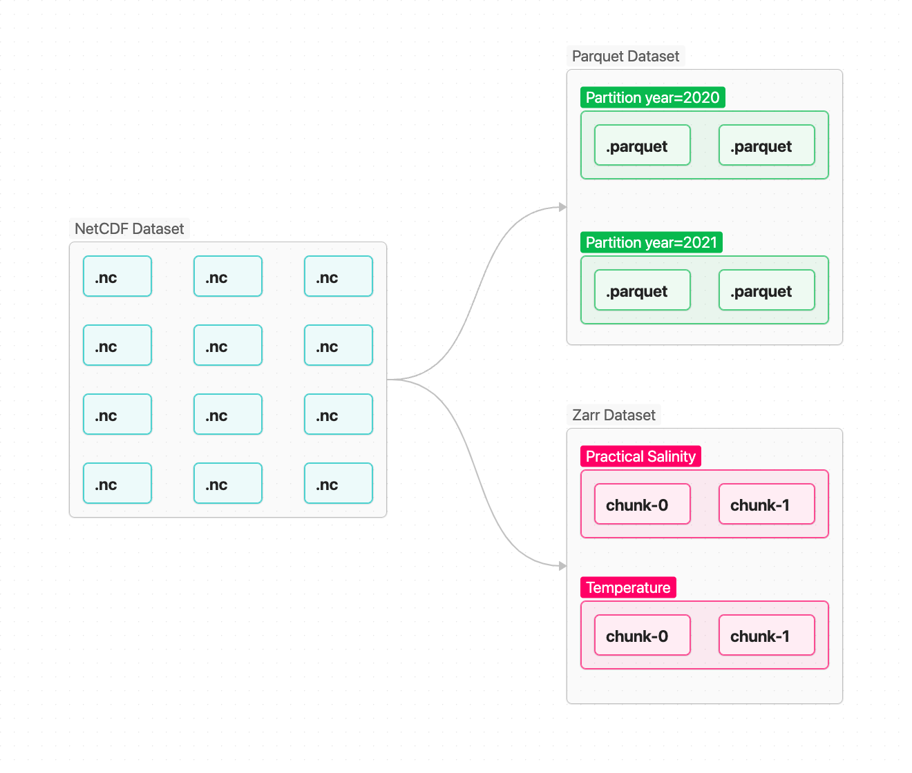
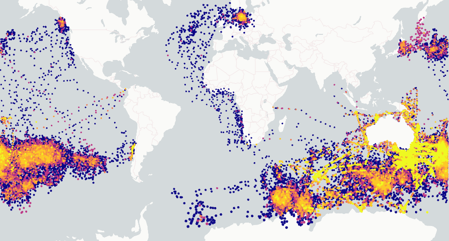
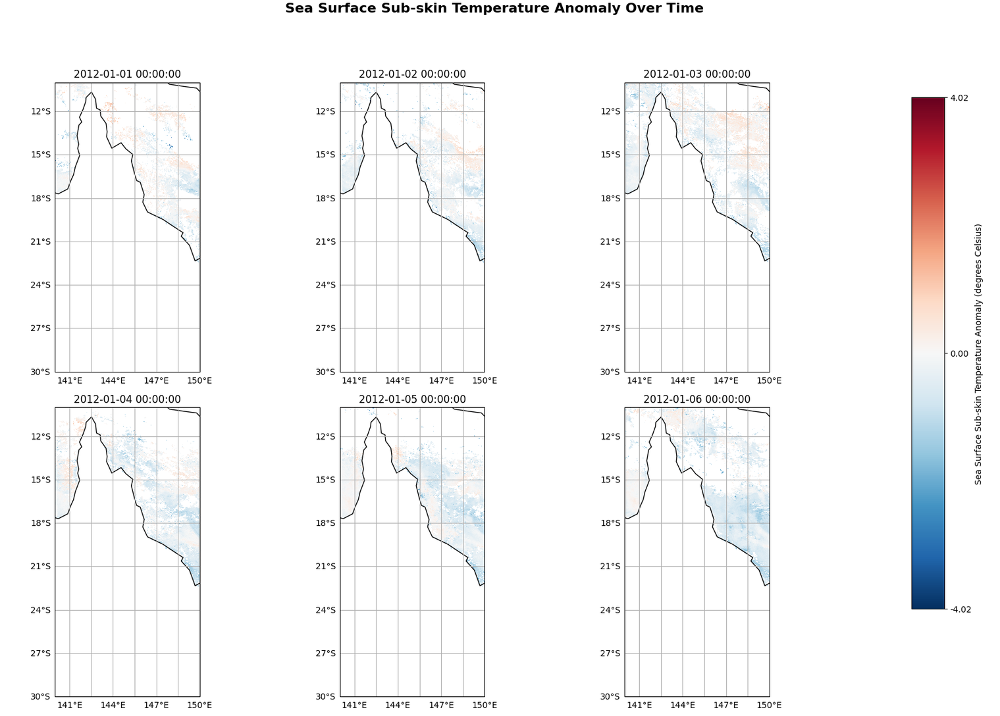

# Slide 1: Introduction to Cloud-Optimized Files
## Rethinking Data Storage: Introduction to Cloud-Optimized Formats
**Modern File Architectures for Large-Scale Geospatial Analytics**

---

### What it is
Storage formats designed specifically to enable fast, efficient access to massive datasets directly over object storage without requiring local file downloads.

### The Problem
Traditional monolithic file formats require downloading the entire file to read a subset of data. This creates bandwidth bottlenecks and slow compute workflows at scale.

### The Solution
Cloud-optimized files support chunking and internal spatial or columnar indexes, allowing systems to pre-filter the source data and read only the data requested.

---

# Slide 2: Why Cloud-Optimized for IMOS data?
## Overcoming Legacy Storage Limitations of NetCDF

* **Reduce Number of Files:** Consolidate millions of fragmented daily files into single, queryable stores.
* **Parallel Cloud Reading:** Sections/Chunks of data can be read simultaneously across distributed compute nodes without read locks. Good for big data analytics.
* **Superior Compression:** Larger, unified arrays allow higher compression, meaning smaller files.
* **Metadata-First Architecture:** Inspect schema and dimensions instantly without downloading or opening bulk data payloads.

---

# Slide 3: Core Formats
## Tailored Architectures for Different Data Structures
Different data models require different structural optimizations for cloud-native performance.

| Feature | Parquet | Zarr |
| :--- | :--- | :--- |
| **Primary Data Model** | Vector / Feature Collections | Gridded / N-Dimensional Arrays |
| **Data Layout** | Columnar Storage | Chunked Array Blocks |
| **Key Use Case** | Point observations, polygons, tables | Satellite imagery, climate models, rasters |

### **Parquet for Vector/Tabular Data:**
A columnar format optimized for tabular and geometric features, enabling fast filtering across millions of records.

[Australasian Seabird Occurences (including migratory species) - Aggregated data product (1939 - ongoing) (NESP MaC 5.9, IMOS)](https://catalogue-imos.aodn.org.au/geonetwork/srv/eng/catalog.search#/metadata/ec2c0ef9-3645-4ded-b617-c8297f6eb250)

### **Zarr for Gridded Data:** 
A chunked, N-dimensional array format designed for complex multi-variable raster and climate datasets.

[IMOS - AusTemp - Heat stress and marine heatwave and cold-spell monitoring metrics for the Australian Coast ](https://catalogue-imos.aodn.org.au/geonetwork/srv/eng/catalog.search#/metadata/2ffccdad-1197-4e41-b412-a9033517cfb2)

---

# Slide 5: Pracitcal Advantages
## Faster Insights, Less Overhead

### **Rapid Downloads**
Better compressed data payloads mean reduced transfer times and lower bandwidth usage.

### **Faster Subsetting**
Fetch only the specific spatial boundary, variable, or time slice you need using direct HTTP range requests—no full-file reads required.

### **Instant Schema Access**
Inspect data structure, coordinate reference systems, and variable metadata instantly without parsing heavy payload files.

---